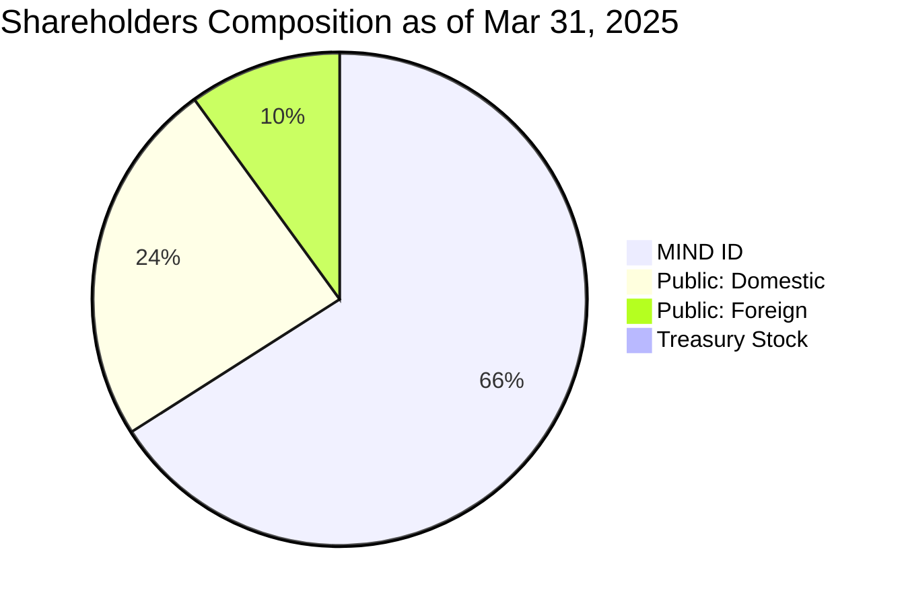

# Corporate Presentation

## PT Bukit Asam Tbk

### 1Q2025 Results & Update
---
# Agenda

- Company Snapshot
- Performance Highlight
- ESG Overview
- Business Development
---
# BUMN UNTUK INDONESIA

BukitAsam

## 1Q2025
## Results & Update

# Company Snapshot
---
# Our Group Profile
## Shareholders structure and composition

### New Structure

mermaid
graph TD
A[Government of Indonesia
cq. Ministry of State-
Owned Enterprises] --> B[Danareksa]
A --> C[1% Series A Dwiwarna
owned by GoI]
C --> D[PT Biro Klasifikasi
Indonesia (Persero) /
Operational Holding]
D --> E[99.00%]
E --> F[Investment Holding]
D --> G[99.99%]
G --> H[MIND ID]
```

- On March 22, 2025, the Government transferred all of its Series B shares in the Company to PT Biro Klasifikasi Indonesia (Persero) ("PT BKI") as an additional capital participation by the GoI (penyertaan modal negara) in PT BKI as an operational holding
- As a result of this transfer, MIND ID, which was previously 100% owned by the GoI, is currently owned 99.99% (Series B shares) by PT BKI and 1 share of Series A Dwiwarna share owned by the GoI.
- However, pursuant to Government Regulation No. 15 of 2025, the GoI continues to exercise control over each of the relevant SOEs through its ownership of the Series A Dwiwarna share. Accordingly, there is no change to the ultimate controlling party of MIND ID, which remains under the ownership of the GoI.

|       |       |           |        |                       |      |         |
| ----- | ----- | --------- | ------ | --------------------- | ---- | ------- |
| 65%   | 65%   | 65.93%    | 100%   | 51.24%                | 34%  | 100%    |
| anram | Timah | BukitAsam | Inalum | PT Freeport Indonesia | VALE | MIND ID |

### Key Facts

- PT Bukit Asam Tbk (PTBA) was established on March 2, 1981.
- Publicly listed in IDX with ticker "PTBA" since 2002
- PTBA is a member of PT Mineral Industri Indonesia (Persero) ("MIND ID"), a state-owned holding company of Indonesian Mining SOEs since 2017.

### Shareholders Composition as of Mar 31, 2025



The government of Indonesia retains a Preferred Share in the company
---
# Our Business Ecosystem
## The details of each stream and its status within the corporate structure

|                                                                                                                          |                                                                            |                                                                      |                                            |
| ------------------------------------------------------------------------------------------------------------------------ | -------------------------------------------------------------------------- | -------------------------------------------------------------------- | ------------------------------------------ |
| **Pertambangan dan Jasa Pertambangan**<br/>Mining and Mining Service<br/><br/>BukitAsam, Banko, INTERNATIONAL PRIMA COAL |                                                                            | **Pembangkit Listrik**<br/>Power Plant<br/><br/>bpi, BukitAsam, BEST | **Perkebunan**<br/>Plantation<br/><br/>BSP |
| **Logistik**<br/>Logistics<br/><br/>OD, PELABUHAN TARAHAN                                                                | **Energi Terbarukan**<br/>Renewable Energy<br/><br/>Bukit Energi Investama |                                                                      | **Investasi**<br/>Investment<br/><br/>BMI  |
| **Pengolahan Batu Bara**<br/>Coal Trading<br/><br/>bap                                                                   |                                                                            | **Lainnya**<br/>Others<br/><br/>Sinergi                              | **Gas**<br/>Gas<br/><br/>BukitAsam GasEkom |

| 20 Subsidiaries |                |                     |                 |
| --------------- | -------------- | ------------------- | --------------- |
| 8<br/>Direct    | 8<br/>Indirect | 3<br/>Joint Venture | 1<br/>Associate |

---
# Our Operational Area
## Each IUP's details and port location

mermaid
graph LR
OMBILIN --- PERANAP
PERANAP --- KERTAPATI
KERTAPATI --- TELUK_BAYUR
TELUK_BAYUR --- BUKIT_KENDI
BUKIT_KENDI --- TARAHAN
TARAHAN --- TANJUNG_ENIM
TANJUNG_ENIM --- IPC_BANTUAS
```

|                                                                                                          |                                                                                                            |                                                                                                     |
| -------------------------------------------------------------------------------------------------------- | ---------------------------------------------------------------------------------------------------------- | --------------------------------------------------------------------------------------------------- |
| Tanjung Enim<br/>Tambang Air Laya<br/><br/>Resources : 685 Mt<br/>Reserves : 377 Mt<br/>GAR: 4900 - 7000 | Tanjung Enim<br/>Muara Tiga Besar<br/><br/>Resources : 303 Mt<br/>Reserves : 157 Mt<br/>GAR: 4400 - 5000   | Tanjung Enim<br/>Banko Barat<br/><br/>Resources : 499 Mt<br/>Reserves : 237 Mt<br/>GAR: 4900 - 5300 |
| Tanjung Enim<br/>Banko Tengah A<br/><br/>Resources : 372 Mt<br/>Reserves : 361 Mt<br/>GAR: 3900 - 4300   | Tanjung Enim<br/>Banko Tengah B<br/><br/>Resources : 3,113 Mt<br/>Reserves : 1,521 Mt<br/>GAR: 3700 - 5300 | Ombilin<br/><br/><br/>Resources : 102 Mt<br/>Reserves : 0 Mt<br/>GAR: 7100 - 7300                   |
| Peranap<br/><br/><br/>Resources : 671 Mt<br/>Reserves : 279 Mt<br/>GAR: 3000                             | Bantuas (IPC)<br/>Bantuas Samarinda<br/><br/>Resources : 19 Mt<br/>Reserves : 1 Mt<br/>GAR: 4300 - 4800    | Bukit Kendi<br/><br/><br/>Resources : 3 Mt<br/>Reserves : 1 Mt<br/>GAR: 4700 - 4900                 |

Coal Resources¹
## 5.77
Billion Ton

Coal Reserves¹
## 2.93
Billion Ton

(1) as of December 31, 2024
---
# BUMN UNTUK INDONESIA

BukitAsam

## 1Q2025
## Results & Update

# Performance Highlight
---
# Operational and Financial Key Figures
## Q1-2025

| Operational                                                                      |                                                                  | Financial                                                                                 |                                                                                  |
| -------------------------------------------------------------------------------- | ---------------------------------------------------------------- | ----------------------------------------------------------------------------------------- | -------------------------------------------------------------------------------- |
| **Production**<br/>8.45<br/>Million tons<br/>↑ 16%<br/>(Q124 7.28 MT)            | **Sales**<br/>10.28<br/>Million tons<br/>↑ 7%<br/>(Q124 9.65 MT) | **Revenue**<br/>9.96<br/>Trillion Rupiah<br/>↑ 6%<br/>(Q124 Rp9.41 trillion)              | **Net Profit**<br/>0.39<br/>Trillion Rupiah<br/>↓ 51%<br/>(Q124 Rp0.79 trillion) |
| **Coal Transportation\***<br/>9.41<br/>Million tons<br/>↑ 12%<br/>(Q124 8.43 MT) | **Stripping Ratio**<br/>6.42<br/>Times<br/>2025 Guidance: 6.49x  | **Average Selling Price**<br/>0.95<br/>Million/Ton<br/>↓ 1%<br/>(Q124 Rp0.96 million/ton) | **Cash Cost**<br/>0.90<br/>Million/Ton<br/>↑ 4%<br/>(Q124 Rp0.87 million/ton)    |

*) including transportation other than railways
---
# Production & Stripping Ratio

Production grew on a yearly basis, with the stripping ratio kept within guidance, although it weakened quarterly due to peak rainy season.

| Production<br/>(in million tons) |     | Stripping Ratio<br/>(x) |   |
| -------------------------------- | --- | ----------------------- | - |
| QoQ                              | YoY |                         |   |
| 4Q2024	10.31&#xA;1Q2025	8.45     |     |                         |   |

↓ -18%

|        |      |
| ------ | ---- |
| 1Q2024 | 7.28 |
| 1Q2025 | 8.45 |

↑ +16%

Q1 2025
6.42

FY2025 Guidance
6.49

- Optimal production has successfully executed, exceeding quarterly target at 8.45 Mt.
- Rainfall intensity is 301-500 mm in this quarter, which is higher than 4Q2024.
- The stripping ratio in Q125 remained under control, tapering to 6.42x, within the FY25 guidance.
- SR outlook for the next quarter is forecasted to remain within the FY25 guidance.
---
# Coal Transportation & Sales

There was a train track derailment in January, which results to lose opportunity for delivery about ~300k ton coal. Both coal transportation and sales grew on a yearly basis.

## Coal Transportation
(in million tons)

| Period | KAI  | Non-KAI | Total | Change |
| ------ | ---- | ------- | ----- | ------ |
| 4Q2024 | 9.01 | 1.33    | 10.34 | -9%    |
| 1Q2025 | 8.54 | 0.87    | 9.41  |        |
| 1Q2024 | 8.43 | -       | 8.43  | +12%   |
| 1Q2025 | 8.54 | 0.87    | 9.41  |        |

- Coal transportation realization was just shy of our quarterly target due to a train track derailment.
- Improvement on a yearly basis due to a contribution from trucking, while during the same period last year, trucking delivery had not yet started.

## Sales
(in million tons)

| Period | Domestic | Export | Total | Change |
| ------ | -------- | ------ | ----- | ------ |
| 4Q2024 | 5.65     | 5.96   | 11.61 | -11%   |
| 1Q2025 | 5.19     | 5.09   | 10.28 |        |
| 1Q2024 | 5.86     | 3.79   | 9.65  | +7%    |
| 1Q2025 | 5.19     | 5.09   | 10.28 |        |

- Sales performance was weaker on a quarterly basis, but still in line with production and coal transportation performance.
- On a yearly basis, we recorded a solid growth in sales volume and export portion.
---
# Sales Area & Portion

India remained our top export destination, followed by Bangladesh, Vietnam, and Thailand. Meanwhile, China moved out of our top five, and we penetrated a new Market in Romania.

## Top Five Export Sales Destination
(% out of total export)

1. India → 24 percent
2. Bangladesh → 23 percent
3. Vietnam → 18 percent
4. Thailand → 10 percent
5. Philippines → 10 percent

## Sales Portion (in %)

<svg viewBox="0 0 100 100">
<circle cx="50" cy="50" r="40" fill="transparent" stroke="#000000" stroke-width="20" />
<circle cx="50" cy="50" r="40" fill="transparent" stroke="#FF0000" stroke-width="20" stroke-dasharray="31.4 68.6" stroke-dashoffset="0" />
<circle cx="50" cy="50" r="40" fill="transparent" stroke="#FFFF00" stroke-width="20" stroke-dasharray="21.3 78.7" stroke-dashoffset="-31.4" />
<circle cx="50" cy="50" r="40" fill="transparent" stroke="#008000" stroke-width="20" stroke-dasharray="5.65 94.35" stroke-dashoffset="-52.7" />
<circle cx="50" cy="50" r="40" fill="transparent" stroke="#0000FF" stroke-width="20" stroke-dasharray="4.4 95.6" stroke-dashoffset="-58.35" />
</svg>

- Export: 50%
- Dom - PLN: 34%
- Dom - Mine Mouth: 9%
- Dom - Others: 7%

Sales Area (Q12025) is represented by a map of Asia and part of Europe, with flags indicating various countries:
- India
- Bangladesh
- Vietnam
- Thailand
- Philippines
- China
- South Korea
- Japan
- Taiwan
- Malaysia
- Indonesia
- Romania (indicated by a flag on the far left of the map)

The BukitAsam logo is visible in the top right corner of the image.
---
# Revenue & Average Selling Price

Export performance was a key driver of revenue, supporting sustained growth despite weakening coal prices on both a quarterly and yearly basis.

## Revenue
(in Billion Rupiah)

| QoQ                                                             | YoY |
| --------------------------------------------------------------- | --- |
| !Down arrow -18%<br/>4Q2024	1Q2025&#xA;12.11	9.96 |     |

+6%

|        |        |
| ------ | ------ |
| 1Q2024 | 1Q2025 |
| 9.41   | 9.96   |

## Average Selling Price

0.95 Rupiah per Ton

QoQ: -7%
YoY: -1%

## Coal Price ICI-3

69.37 USD per Ton

QoQ: -7%
YoY: -12%

- On a yearly basis, despite ICI-3 has decreased, our revenue increased. It was solely driven by a strong export sales portion compared to the same period last year (50% vs 39%).

- On a quarterly basis, revenue has fallen due to lower export volume and weakened coal prices.
---
# Cost Breakdown & Cash Cost

Cash costs increased on both quarterly and yearly basis due to an inflated fuel cost and weakened IDR to USD exchange

## Cost Breakdown

| Category                    | 1Q2024 | 1Q2025 |
| --------------------------- | ------ | ------ |
| Mining Services             | 24%    | 27%    |
| Transportation              | 24%    | 24%    |
| Royalty & Retribution       | 11%    | 10%    |
| Fuel\*\*                    | 4%     | 10%    |
| Remuneration                | 6%     | 6%     |
| Inventory                   | 16%    | 6%     |
| Depreciation & Amortization | 5%     | 5%     |
| Others\*                    | 10%    | 12%    |

## Cash Cost
(in Million Rupiah per Ton)

| Period | 4Q2024 | 1Q2025 | Change |
| ------ | ------ | ------ | ------ |
| QoQ    | 0.86   | 0.90   | +5%    |
| YoY    | 0.87   | 0.90   | +4%    |

## Drivers of Rising Cost

### Fuel Price

| 1Q2024 | 1Q2025 | Change |
| ------ | ------ | ------ |
| 13,718 | 15,127 | +10%   |

### USD Rate

| 1Q2024 | 1Q2025 | Change |
| ------ | ------ | ------ |
| 15,664 | 16,359 | +4%    |

- Rising in fuel price was caused by the removal of B40's subsidy and the depreciation of the IDR against the USD

- Since fuel components are spread across several unit cost categories, the increase can be observed in mining service costs, transportation costs, and of course, fuel costs.

*Including third party services, equipment rentals, spare parts, and community development
**Fuel costs rise significantly due to higher fuel prices and reclassification of fuel costs from coal transportation costs (~Rp400 Billion)
---
# Net Profit & EBITDA

Despite many obstacles throughout the quarter, the bottom line remains positive.

| Net Profit<br/>(in Billion Rupiah)   |                                      | EBITDA<br/>(in Billion Rupiah)       |                                      |
| ------------------------------------ | ------------------------------------ | ------------------------------------ | ------------------------------------ |
| QoQ                                  | YoY                                  | QoQ                                  | YoY                                  |
| 4Q2024: 1.871Q2025: 0.39Change: -79% | 1Q2024: 0.791Q2025: 0.39Change: -51% | 4Q2024: 2.651Q2025: 1.05Change: -60% | 1Q2024: 1.511Q2025: 1.05Change: -30% |

- Pressure from declining coal prices and rising COGS—especially fuel—massively hit our bottom line on both quarterly and yearly basis.
---
# BUMN UNTUK INDONESIA

[Bukit Asam logo]

# 1Q2025
## Results & Update

# ESG Overview
---
# Environment, Social, and Governance
## Positioned for short and long-term value creation

### Environment

- **Watershed Rehabilitation**
Currently, watershed rehabilitation already covered 5,199.18 Ha

- **Preserving Biodiversity**
Endemic plant conservation using tissue culture method and rescuing 213 orchids out of 94 types of orchid species

- **Land Restoration**
Reclamation and revegetation on 2,457.35 Ha in the post-mining area

### Social

- **Circular Economy**
Encouraging environmentally friendly agriculture and improving the work quality of 1,105 agriculturist with the installation of Solar Panel Power Plant

- **Gender Equality**
More than 20% of employees are women, and 28% of them occupy management positions

- **CSR Funding & Activities**
Rp21.04 billion has been distributed for CSR activities, affecting more than 50,000 people and raising level of 12 micro and small enterprises

### Governance

- **Energy Management System**
All business processes have been certified both nationally and internationally

- **External Acknowledgement**
- Awarded the Gold PROPER for Tanjung Enim Mining Unit and Tarahan Port Unit
- Awarded Green PROPER for Kertapati Port Unit and PTBA's subsidiary, PT Bukit Pembangkit Innovative

### ESG SCORING

|                                                                            |                                                                                  |                                                                                                    |
| -------------------------------------------------------------------------- | -------------------------------------------------------------------------------- | -------------------------------------------------------------------------------------------------- |
| **CDP**                                                                    | **MSCI**                                                                         | **Transition Pathway Initiative**                                                                  |
| B<br/>Management Level, the best among local peers on climate change topic | BB<br/>0.6 points higher with significant improvement on carbon emission control | Level 3<br/>Assessed as integrated into operational decision making level, better than local peers |

---
# BUMN UNTUK INDONESIA

BukitAsam

# 1Q2025
## Results & Update

# Business Development
---
# OUR FOCUS STRATEGIC THEME FOR GROWTH
## Theme 1: Expansion of Coal Transportation

### Highlight Project:
**Tanjung Enim to Keramasan**

- Capacity: 20 million tons/year
- Distance: 158 km
- COD: 2Q2026
- Partner: PT KAI and PT KALOG

### Others related project to this theme this year:

**Capacity optimization in the existing Port:**

- Tarahan: 27.5 MT → 28.0 MT
- Kertapati: 8.0 MT → 8.5 MT
---
# OUR FOCUS STRATEGIC THEME FOR GROWTH
## Theme 2: Consolidated Energy Business Development

Total installed capacity ~1.6 GWh

### Highlight Project:
#### CFPP Sumsel-8
- Location    : Tanjung Lalang, South Sumatera
- Capacity    : 2x660 MW
- Status      : COD on October 2023
- Ownership   : PTBA - 45%

### Others related project:

#### CFPP Banjarsari
- Location    : Lahat, South Sumatera
- Capacity    : 2x110 MW
- Status      : COD in 2015
- Ownership   : PTBA - 59.75%

#### CFPP Tanjung Enim
- Location    : Tanjung Enim, South Sumatera
- Capacity    : 3x10 MW
- Status      : COD in 2012
- Ownership   : PTBA - 100%

#### CFPP Tarahan
- Location    : Tarahan, Lampung
- Capacity    : 2x8 MW
- Status      : COD in 2013
- Ownership   : PTBA - 100%
---
# OUR FOCUS STRATEGIC THEME FOR GROWTH
## Theme 2: Consolidated Energy Business Development

Total installed capacity ~702 kWp

### Highlight Project:
#### Solar Panel Power Plant at Krakatau Industrial Estate

- Capacity: 303 kWp
- COD: Q22025
- Partner: PT Timah Industri

[Two aerial images of industrial buildings with solar panels on the roofs]

### Others related project:

| Operating                                                                                               | Development                                                                                           |
| ------------------------------------------------------------------------------------------------------- | ----------------------------------------------------------------------------------------------------- |
| **Bali Mandara Toll Road**<br/>Capacity: 400 kWp<br/>Partner: Jasa Maga                                 | **Toll Road**<br/>Capacity: up to 2 MWp<br/>Partner: Jasa Marga                                       |
| **Airport Control Centre Bandara Soekarno Hatta**<br/>Capacity: 241 kWp<br/>Partner: Injourney Airports | **Cement: Padang**<br/>Capacity: Up to 6.5 MWp<br/>Partner: Semen Padang                              |
| **EPC Contractor - PLTS Semen Baturaja**<br/>Capacity: 23 kWp<br/>Partner: Semen Baturaja               | **Post-mining land: Tanjung Enim, Ombilin, and Bantuas**<br/>Capacity: up to 200 MWp<br/>Partner: TBC |
| **Perumahan Duren Tiga Bukit Asam**<br/>Capacity: 61 kWp<br/>Partner: Bukit Multi Properti              |                                                                                                       |

---
# OUR FOCUS STRATEGIC THEME FOR GROWTH
## Theme 2: Consolidated Energy Business Development

### Highlight Project:

Coal to Artificial Graphite and Anode Sheet

Production Target (Pilot Plant):
- Artificial Graphite (200 tons/month)
- Anode Sheet (41.5 tons/month)

Status: Update Basic Engineering Design
Partner: BRIN

### Others related project:

#### Red Calliandra → Wood Pellet

Production Capacity: Wood Pellet (96 tons/month)
Emission Reduction Target: -12,875 tCO2eq./year
Status: COD Pilot Plant
Partner: UPN Veteran Yogyakarta

#### Extracting Low Rank Coal → Humic Acid

Status: Producing and developing Humic Acid Prototype
Partner: Universitas Gadjah Mada
---
# Forward-looking statements

This presentation contains certain forward-looking statements that involve risks and uncertainties. In some cases, we use words such as "ambition", "continue", "could", "estimate", "intend", "expect", "believe", "likely", "may", "outlook", "plan", "strategy", "will", "guidance", "targets", and similar expressions to identify forward-looking statements. Forward-looking statements include all statements other than statements of historical fact, including, among others, statements regarding PTBA's plans, intentions, aims, ambitions, and expectations; the commitment to develop as an energy company and diversify its business; our ambitions and expectations regarding decarbonization and building a profitable business; future financial performance, including earnings, cash flow and liquidity; accounting policies; the ambition to grow cash flow and returns; expectations regarding progress on the energy transition plan; expectations regarding cash flow and returns from PTBA's business portfolio, renewables and low carbon solutions portfolio; our expectations and ambitions regarding operated emissions; our intention to optimize our portfolio; break-even considerations, targets and other metrics for investment decisions; future workforce economic trends; market outlook and future economic projections and assumptions, including commodity price, currency assumptions; estimates of resource and reserves; organic capital expenditures through [2025]; expectations and estimates regarding production, railways, sales, and projects; estimates regarding power generation; the ambition to keep unit of production cost in the top quartile of our peer group; completion and results of acquisitions, disposals, divestments and other contractual arrangements and delivery commitments; expectations regarding capital distributions, including expected amount and timing of dividend payments and the implementation of our share buy-back program; provisions and contingent liabilities, obligations or expenses; and expected impact of currency and interest rate fluctuations. You should not place undue reliance on these forward-looking statements. Our actual results could differ materially from those anticipated in the forward-looking statements for many reasons.

These forward-looking statements reflect current views about future events, are based on management's current expectations and assumptions and are, by their nature, subject to significant risks and uncertainties because they relate to events and depend on circumstances that will occur in the future. There are a number of factors that could cause actual results and developments to differ materially from those expressed or implied by these forward-looking statements, including levels of exchange rate and interest rate fluctuations; levels and calculations of reserves and material differences from reserves estimates; regulatory stability and access to resources, including attractive low carbon opportunities; the effects of climate change and changes in stakeholder sentiment and regulatory requirements regarding climate change; changes in market demand and supply; inability to meet strategic objectives; the development and use of new technology; social and/or political instability, including as a result of Russia's invasion of Ukraine and the conflict in the Middle East; failure to prevent or manage digital and cyber disruptions to our information and operational technology systems and those of third parties on which we rely; operational problems, including cost inflation in capital and operational expenditures; unsuccessful drilling; availability of adequate infrastructure at commercially viable prices; the actions of field partners and other third parties; reputational damage; the actions of competitors; the actions of the Government of Republic of Indonesia as majority shareholder and exercise of ownership by Government of Republic of Indonesia ; changes or uncertainty in or non compliance with laws and governmental regulations; adverse changes in tax regimes; the political and economic policies of Indonesia and other coal-producing countries; liquidity, interest rate, equity and credit risks; risk of losses relating to trading and commercial supply activities; an inability to attract and retain personnel; ineffectiveness of crisis management systems; inadequate insurance coverage; health, safety and environmental risks; physical security risks to personnel, assets, infrastructure and operations from hostile or malicious acts; failure to meet our ethical and social standards; non-compliance with international trade sanctions; and other factors discussed elsewhere in this report and in PTBA's Annual Report. PTBA's Annual Report is available at PTBA's website www.ptba.co.id.

Although we believe that the expectations reflected in the forward-looking statements are reasonable, we cannot assure you that our future results, level of activity, performance or achievements will meet these expectations. Moreover, neither we nor any other person assumes responsibility for the accuracy and completeness of the forward-looking statements. Any forward-looking statement speaks only as of the date on which such statement is made, and, except as required by applicable law, we undertake no obligation to update any of these statements after the date of this report, either to make them conform to actual results or changes in our expectations.
---
# BUMN UNTUK INDONESIA

# Thank You

For further information:

|          |                                                                                                                                   |
| -------- | --------------------------------------------------------------------------------------------------------------------------------- |
| Contact  | : Aldy Pratama Iswardi                                                                                                            |
| Position | : Head of Investor Relations                                                                                                      |
| Office   | : PT Bukit Asam Tbk<br/>Menara Kadin Indonesia, 15th Floor<br/>Jl. HR Rasuna Said Blok X-5, Kav. 2&3<br/>Jakarta 12950, Indonesia |
| Phone    | : +62 21 52540114                                                                                                                 |
| Email    | : investor.relations\@bukitasam.co.id                                                                                             |
| Website  | : www\.ptba.co.id                                                                                                                 |

# Bukit Asam