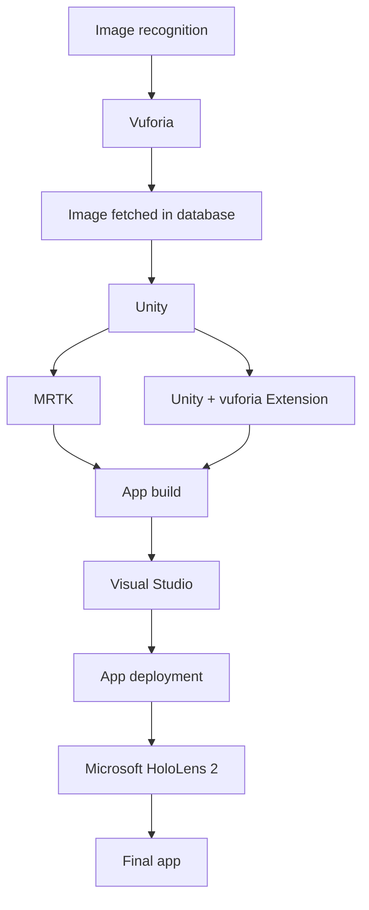

CIRP Journal of Manufacturing Science and Technology 48 (2024) 19-27

Contents lists available at ScienceDirect

CIRP Journal of Manufacturing Science and Technology

journal homepage: www.elsevier.com/locate/cirpj

# Augmented reality training for improved learnability

Dedy Ariansyah a, Bens Pardamean a,b, Eddine Barbaro c, John Ahmet Erkoyuncu c,*

a Bioinformatics & Data Science Research Center, Bina Nusantara University, Jakarta 11480, Indonesia
b Computer Science Department, BINUS Graduate Program - Master of Computer Science, Bina Nusantara University, Jakarta 11480, Indonesia
c School of Aerospace, Transport and Manufacturing, Cranfield, Bedfordshire MK43 0AL, UK

## ARTICLE INFO

**Keywords:**
- Augmented Reality
- Learnability
- Training
- Industry 4.0
- Industry 5.0

## ABSTRACT

In the current era of Industry 4.0, many new technologies offer manufacturing industries to achieve high productivity. Augmented Reality (AR) is one of the emerging technologies that has been adopted in industries to aid users in acquiring complex skills and carrying out many complicated tasks such product assembly and maintenance. Nevertheless, most AR applications have been developed without clear understanding of how such technology can facilitate improved learnability in terms of knowledge reusability. This paper proposed an enhanced AR-based training system that provides multimodal information with a contextualized information to improve task comprehension and knowledge reusability compared with traditional AR that presents unimodal and decontextualized information. An empirical test was carried out to assess the task performance and the task learnability aspects of this enhanced AR compared to the traditional AR and the paper-based document. The experiment consisted of a training phase where participants carried out an electrical connection task of a sensor followed by a knowledge reuse phase where participants had to wire a second sensor using their previous training. A pre-test quiz was given before the experiment followed by the post-tests phase after the training. Post-tests consist of one post-test given directly after the experiment (short-term retention test) and a second post-test quiz given one week later (long-term retention test) to measure information retention. The results indicated that AR-based approaches could enhance knowledge acquisition by around 18 % for traditional AR and almost 25 % for enhanced AR as compared to paper-based approach. While all training systems achieved relatively equivalent well for short-term retention test, trainees who used the enhanced AR training systems statistically outperformed those in the paper-based group for long term retention test. Furthermore, there was a positive correlation between the score of short-term retention test and the score in the knowledge reusability which was also shown by the higher scores in knowledge reusability for the enhanced AR training system compared to the other two approaches. These findings are discussed in relation to the Industry 5.0's human centric core value.

## 1. Introduction

The adoption of Industry 4.0 technologies enables new capabilities to produce and to deliver product faster with a better quality, and more cost efficient. However, this industrial revolution is leading to an increased complexity of manufacturing systems and an increasingly rapid renewal of these systems. Consequently, upskilling employees' competencies to handle and maintain the complex engineering assets (CEAs) is indispensable. In recent years, finding a skilled worker has become a difficult task. The reason is that there is a talent shortage nowadays. Indeed, in 2018, 45 % of employers said that they could not find the necessary skills among candidates [17]. Furthermore, a new issue will arise from adapting to the changing job dynamics brought about by digitalization [27]. Despite the increased interconnectedness and availability of information globally, the progress of digitalization has not been uniformed across countries or even within industries within the same country [14]. To face this challenge and meet with the adoption of Industry 4.0, employers need to find a new way to ensure their workforces are sufficiently equipped to work with CEAs. In the aviation sector, research examined that traditional training such as in-class training and paper-based manual are not reliable means for teaching job tasks and the skills for visual inspection for the future trend in aviation [11,29]. Visual inspection requires Aircraft Maintenance Technician (AMT) to identify certain characteristics of all types of faults and make decision to troubleshoot various systems from one airplane to another. Due to highly complexity and interrelated components in the

* Corresponding author.
E-mail address: j.a.erkoyuncu@cranfield.ac.uk (J.A. Erkoyuncu).

* Corresponding author.

E-mail address: j.a.erkoyuncu@cranfield.ac.uk (J.A. Erkoyuncu).

https://doi.org/10.1016/j.cirpj.2023.11.003

Received 29 March 2023; Received in revised form 4 September 2023; Accepted 2 November 2023

Available online 6 December 2023

1755-5817/� 2024 The Authors. This is an open access article under the CC BY license (http://creativecommons.org/licenses/by/4.0/).
---
D. Ariansyah et al.

CIRP Journal of Manufacturing Science and Technology 48 (2024) 19–27

aircraft, conventional training could lead to long hours of training, frustration, and overall decrease in worker productivity. Existing studies showed that Augmented reality (AR)-based training could help to reduce learning time, cognitive workload, and facilitate knowledge retention [12,16,4]. However, training effectiveness with AR could be decreased when the users fail to integrate training materials with their prior knowledge which could lead to poor knowledge retention and knowledge reusability [26]. During real maintenance, this situation could result in prolonged asset downtime, an increase in cost and time associated with a low first-time fix rate. Addressing this challenge entails a strategy or a new paradigm to improve task learnability.

Compact Oxford dictionary defines the term learnability as "the degree to which knowledge or skill (in something) can be acquired through study or experience or by being taught". In the field of cognitive science, the 'ACT-R' (Adaptive Control of Thought-Rational) theory distinguishes knowledge into declarative and procedural knowledge [2]. Procedural knowledge is acquired through practice and refers to information about how to perform a task and an action that can be directly executed. Declarative knowledge refers to facts and information which cannot be executed directly but can be applied for a specific goal that goes through interpretative process. Complex industrial settings consist of tasks that can contain declarative and procedural knowledge such as design, diagnosis, assembly, management, repair, and training [10]. In nowadays, the way knowledge is acquired and how it is managed to foster productivity have become an important key to achieving competitive advantages for organizations. In the organizational context, learnability is defined as "a concept that captures the ability of employees to acquire the information and know-how necessary and sufficient to execute organizational practices" [21]. A weak learnability in an organization refers to a longer process, an extended effort, and a more frequent exposure needed for the employees to acquire know-how information necessary to perform their roles effectively [21]. This can lead to a high loss of time and a higher potential for errors which can affect productivity. In general, learning can be evaluated by measuring how much information or know-how can be remembered (retention test) and being able to use the information to solve new problems (transfer test) [19]. This means that high learnability entails a high amount of information acquisition and high success on transfer problems.

Recently, the introduction of Industry 5.0 has been viewed as a forward thinking of how new technologies embraced in Industry 4.0 can be better developed to address the aspects of human-centric, sustainability, and resilience [31]. In this paradigm, there is a growing demand for the development of lifelong learning for workers whereby technologies are used to support one's needs and interests to continuously update his knowledge and skills in order to adapt to the changing circumstances in the current industrial landscape brough about by the technology shift [3]. Therefore, increasing knowledge retention in long term and knowledge reusability could serve as foundation for lifelong learning which is to enable the ongoing learning and development throughout an individual's life. In this context, it is easy to see that there is a need to enhance the training approach to not only facilitate workers acquiring the necessary knowledge more efficiently but also to enable them to retain and to reuse their training in different situations. Augmented Reality (AR) is one of the most promising technologies for Industry 4.0. However, there is limited research that shows how AR is developed to foster long life learning in the industrial context. This paper presents the enhanced development of information delivery using this technology and shows the extent to which it could be used for knowledge transmission, more specifically on learnability, retention of knowledge over time, and reusability of knowledge compared to more common learning methods. The next section of this paper reviews existing studies in the literature and presents research questions addressed in this study. Section 3 provides the methods used in this study followed by the results and analysis in the following Section. Section 5 discusses the findings of this work related with existing study and Section 6 provides conclusion and the future work.

## 2. Related work

Over the years, Augmented Reality (AR) has been investigated in different applications to understand how it can facilitate learnability. Early research of AR to assist assembly task found that the ability of AR to overlay graphical information on the task at hand to provide step by step guidance on procedural knowledge and corrective instruction can increase users' perception and skills [25]. The increase in perception was found to result in higher knowledge acquisition compared to traditional method [25]. Recent study to provide distance learning also showed that hybrid laboratory leveraging AR could improve knowledge transfer of assembly task to the remote technician [22]. Moreover, AR has also been shown to facilitate knowledge transfer of declarative knowledge (e.g., real-time monitoring of system's performance) through a cloud-enabled AR [28].

Similarly, in the electronic assembly, AR was also found to increase knowledge retention of participants in a procedural task when specific feedback was presented to correct the errors during learning and task exposure [30]. Furthermore, in comparison to different modes of information delivery, AR users were able to recall more information from long-term memory (e.g., seven day period) in the aviation/aerospace training, leading to a minimal amount of information loss [16]. Moreover, AR was also tested in a simulated control room study to examine its effectiveness as an assistance system for procedural tasks. Compared to traditional approaches, the users who used the AR-based assistance showed fewer intra-team inquiry communication exchanges which indicates that AR was more effective in facilitating task comprehension or implementation of a procedure [26]. Accordingly, some studies have attempted to push forward the intake of AR technologies for industrial tasks by developing an AR content authoring tool to support non-AR experts [18]and AR collaboration tools to enable visual augmentation and effective annotation in 3D space[5].

There are a couple of main reasons as to why AR can lead to better knowledge acquisition and retention compared to conventional approaches. Firstly, learning contents presented in AR can enhance learning motivation which involves attention, relevance, confidence, and satisfaction [13]. Motivation can help learners to engage, persist, and expand effort in the learning process which result in better learning outcomes than unmotivated learners [7]. Secondly, AR allows learning information to be presented in the 3D environment; in the appropriate place and time, enabling learners to easily access the contextual information and avoid the excessive use of their cognitive resources. Since humans have a limited working memory, the way cognitive resources are focused and used in learning can influence task performance [12]. The efficient use of cognitive resources afforded by AR can lead to better knowledge comprehension and effective use of information to complete a task [4]. All the previously existing studies have been focused solely on using AR in presenting learning contents and assessing its effect on knowledge acquisition and retention. Nevertheless, there is currently no study that examines how AR can improve knowledge reusability, that is the ability to use learned information to solve new problems. Furthermore, although some studies have explored the positive effect of AR feedback to users while training, little is known as to how it is associated with knowledge reusability.

Knowledge reusability is an important aspect of learnability since the acquired knowledge provides the foundation for reasoning and actions when facing new but similar problems. Assessing the level of knowledge reusability can give insights into the effectiveness of learnability obtained from a learning media/approach to novel situations. One of the determining factors for human resources management to improve organization productivity lies in its ability to induce learning and exploit the know-how information for various situations [21]. Developing a new training approach that encourages learning and enables knowledge reuse can take a company to achieve a new level of productivity. Therefore, this paper sought to examine two research questions that have not been addressed in the literature: (1) how AR can be designed to

20
---
D. Ariansyah et al.

CIRP Journal of Manufacturing Science and Technology 48 (2024) 19–27

promote efficient knowledge comprehension and reusability and (2) how does knowledge reusability relate to improved learnability.

## 3. Methods

In the Cognitive theory of Multimedia Learning (CTML), knowledge reuse is facilitated when learners engage in meaningful learning. Meaningful learning involves the learner making sense of the presented information by integrating the received information with the existing knowledge to form a coherent representation of new knowledge. According to CTML, learners engage in three cognitive processes to experience meaningful learning: selecting of relevant materials, organizing selected material by building structural relations among the elements, and integrating the selected material with the relevant prior existing knowledge [19]. Nevertheless, this does not mean that human minds can always operate through all these processes when presented by information. Augmented Reality as a technology that can overlay augmented information in the real world has been shown to promote enhanced learning achievement in the educational settings owing to its capabilities provide immediate and relevant information [1]. In the industrial setting, the augmented information that provides context to the real environment can ease the comprehension of the task and can reduce mental workload [12,23]. Table 1 outlines how AR can facilitate meaningful learning.

Existing studies using AR to support learning have been primarily focused on presenting information in a passive way where the user is presented with information that allows him to complete the task. This kind of approach puts the user as a rather passive information receiver and might not be effective to achieve knowledge reusability [26]. In attempt to achieve meaningful learning, this study shows how AR was developed to encourage thinking or sensemaking that allows user to build the mental model of the system.

### 3.1. The design of enhanced AR-based information delivery

Traditional AR system used in engineering training typically focused on presenting training materials to help users go through a task/a process as clearly as possible with minimum error. However, the information is often isolated to a specific sub-task or a process which may not be suitable for a complex system with highly interrelated components. Complex Engineering Assets (CEAs) constitute multiple layers of complexity (e.g. operational and task complexity) that are often challenging for the user to deal with. Therefore, AR-based information needs to be enhanced in a way that facilitates learning to take place. To help users with navigating the complexity and developing a mental model of the system, one of the approaches could be to increase the transparency and the observability of the system behavior and functionality [8]. This can be achieved by showing the information that the user is expected to operate and foresee. Providing such information can increase user awareness of the system, which can help users in combining newly perceived information with the user's existing knowledge to form an

**Table 1**

How AR can facilitate meaningful learning.

| Cognitive Process | How AR can facilitate                |
|-------------------|--------------------------------------|
| Selecting         | Minimizing extraneous information by overlaying only relevant information in the real environment (i.e. considering contextual relevance including users, task, equipment, workplace, etc. [32, 6, 91]) |
|                   | Displaying additional information to user based on on-demand request |
| Organizing        | Showing a step-by-step information to complete a task |
|                   | Combine the presented information dynamically in real-time |
| Integrating       | Displaying supplementing multimodal information |
|                   | Adding contextual information to enhance task awareness |

updated picture of changing situations [8]. Another thing that can reduce the potential for learning in a complex system is the excessive use of working memory resources due to the large amount of information to be processed. Since human information processing system consists of multiple channels in which each channel has a limited capacity to process information, multimodal information delivery has been suggested to facilitate information perception and understanding [19]. Based on these theoretical constructs, three design principles were adopted to develop an enhanced AR-based information delivery system:

1. Multimodal information: combine visual information with vocal explanation in the form of sound cues.
2. Contextual information: provide necessary information to prevent extraneous information processing.
3. Projection of the given states: shows common mistakes and consequences for the projection of the given states.

### 3.2. Development of augmented reality system

The AR system developed in this study was targeted on a head-mounted display Microsoft Hololens 2. It allows users to see their surrounding environment through transparent glasses while the holographic contents are projected onto these glasses and superimposed on the real world. It is also equipped with multiple sensors such as depth sensor on the of the device, Inertia Measurement Unit (IMU) that measures acceleration and rotation of the device in three dimensions, and four visible cameras that are used in conjunction to accurately track user's hands in real-time. AR application was developed using Unity engine which supports multiple platforms for AR development. For AR library, Vuforia engine was used for vision-based tracking. Vuforia has an augmented/mixed reality SDK that can be imported into Unity as a plugin. The user interface (UI) was developed using the Mixed Reality Toolkit (MRTK) proposed by Microsoft specifically for use with Hololens2. The MRTK includes a range of features and tools that can help developers with various aspects of mixed reality development, such as spatial mapping, hand tracking, gesture recognition, voice commands, and so on.

To enable AR for our experiment, an image that the Vuforia Engine can identify, and track is used. This kind of image can be referred to as an "Image Target". By comparing extracted natural characteristics from the camera picture against a predefined target resource database, the Vuforia Engine can identify and track the image, and can show augmented content on top of it. This solution was chosen as targeting different components was difficult without their associated 3D model which needs to be created for that purpose. Moreover, small objects such as wires are difficult to track due to their size. System architecture of the AR system is presented in Fig. 1.

### 3.3. Experimental validation

#### 3.3.1. Experimental conditions
To simulate an industrial scenario that is complex enough to test different methods of learning, an electronic wiring task was defined. This scenario was motivated by several reasons: it can be easily repeated, and the complexity of an electronic task is quite high if the user has no previous knowledge about this field. Furthermore, as an electronic wiring task must be done precisely and consist of multiple variations to achieve the objective, the selected task is suitable for the evaluation of retention and transfer test. The task contained five following subtasks:

- Wire a power supply.
- Connect the power supply to a voltage regulator board.
- Connect the voltage regulator board to a terminal block.
- Connect a sensor to the terminal block.
- Connect an Arduino board to the installation through a breadboard.

21
---
D. Ariansyah et al.

CIRP Journal of Manufacturing Science and Technology 48 (2024) 19–27

Fig. 1. System architecture of AR system.

Further, the task was tested under three different learning interfaces: (1) a paper-based document that serves as a control group against AR systems, (2) a traditional AR-based training system, and (3) an enhanced AR-based training system that was developed by applying design principles that encourage meaningful learning.

##### 3.3.1.1. The paper-based document
The paper-based document (see: 10.17862/cranfield.rd.24079371) contains all information about the electronic system and its components. It also consists of a step-by-step information in the form of textual instruction and pictures to complete a wiring task.

##### 3.3.1.2. The traditional AR-based training system
This training system replicated most of AR systems used for learning the assembly tasks which include textual information, graphical objects (e.g. arrow) for pointing certain objects, and videos. Users were initially presented with an overview of the electronic system and its all components using tooltips and graphical arrows (See Fig. 2(a)). To acquire skills in wiring the system, assembly instructions were presented step by step on top of the workspace in the form of texts as well as videos which describe the task and how to do it (See Fig. 2(b)). The users can pause and play the video as much as they like and proceed to the next step.

##### 3.3.1.3. The enhanced AR-based training system
The enhanced AR-based training system was similar to the traditional one regarding the contents. However, it had voice cues (multimodal information) that gives additional context and information to the user. For example, during the unscrewing part of the power supply, the voice cue gives additional information on how to perform the task: "To loosen the screws, do two or three counterclockwise turns with the screwdriver on both screws". It also included common mistakes and consequences panel after each step to enable the user to grasp the significance of their actions and increase the understanding of the system behavior (projection of the given states and their consequences) as shown in Fig. 3.

#### 3.3.2. Experimental procedure
To examine how different methods of learning affect users in understanding the task and reusing the acquired knowledge to a different situation, this study assessed independent groups of users (between-subjects test) who were assigned to each learning method to learn the same task. Each participant was asked to fill out a demographic questionnaire (see: 10.17862/cranfield.rd.24079371) which includes electronical and augmented reality background questionnaire to check whether they had done some tasks related electronics system and if they were familiar with the use of AR prior to the experiment. After that, each participant was given a questionnaire with questions related to the studied wiring task to test their initial knowledge about the system.

The test consisted of questions about the identification of different components they would use during the task and about general knowledge given during the experiment. Following this, a total of thirteen participants were involved in this experiment where four people were assigned in traditional AR group, five people in the enhanced AR group, and four people in the paper-based document group. They were all students (Male = 6, Female = 7) and aged between 25 and 35 years old. Their knowledge about electronics was balanced across the groups (See Section 4.1). The test was graded over 11 questions and was also given after they finished the task to measure the amount of information they learned after going through a training (short term retention test). One week later, each participant was assessed again with the same questionnaire to test their capability to remember what they learned (long term retention test). The duration of a week has been used in many studies for memory retention test [16,26]. Furthermore, participants were not told that the questionnaire would be the same after one week. Existing studies that measured task learnability typically focused on

Traditional AR-based training system showing the overview of the electronic wiring system and assembly instructions in textual form and video.

Fig. 2. Traditional AR-based training system: (a) the overview of the electronic wiring system, (b) assembly instructions in the textual form and video.

22
---
D. Ariansyah et al.

CIRP Journal of Manufacturing Science and Technology 48 (2024) 19–27

The enhanced AR-based training system showing additional information regarding the system behavior

Fig. 3. The enhanced AR-based training system showing additional information regarding the system behavior.

testing declarative knowledge of a task through questionnaires or procedural knowledge through executing the task without assistance. In addition, objective assessments measuring time completion and the number of mistakes were also administered to measure how well they understand the learning contents. Unlike the previous studies, in this study participants were also asked to wire a second sensor to a terminal board without any guidance. To complete this task successfully, the participant must have the right understanding of the electronic system to identify the correct connection to the power source. Since there was no existing connection present, they had to improvise by creating a new connection. This test was used to assess knowledge reusability.

#### 3.3.3. Data analysis

To analyze the effect of different learning methods to learnability, this study examined the score of each question in the pre-test to test the initial knowledge across different groups. The same analysis was also carried out in the post-tests for short- and long-term retention tests. The score for each question was normalized with respect to the number of participants and one way ANOVA was run to test if there were statistically significant differences among the means of the groups. It helps identify if there are significant differences among the groups and provides insights into which groups may differ from each other. Additionally, one-way repeated measure ANOVA was run to examine if there were statistically significant difference among the means of test score for pre-test, short- and long-term test. Furthermore, one way ANOVA was run to assess the effect on the task performance such as completion time, number of mistakes, and knowledge reusability. Finally, Point-Biserial and Pearson's correlation were run to examine the relation between knowledge retention and knowledge reusability as well as short- and long-term retention respectively. Statistical analysis was run by SPSS v29 with statistical significance was determined when p < 0.05.

## 4. Results

### 4.1. Participants' data

Table 2 presents a snapshot of participant demographics, occupation, nationality, and assessment responses. It shows almost all participants had no experience in performing electronic-related and wiring task (Q5 and Q6) and only one participant had done electronic task related. The were more participants who had used AR (Q7) but rarely (Q8) and mostly for educational purposes (Q9). Only two participants preferred self-learning than with instructor (Q10). Overall, the participants in this study were homogeneous in terms of age, occupation, and their knowledge of electronic-related task.

**Table 2**

Demographics

| Measure    | Items           | Freq. | Details  |
|-------------|-----------------|-------|----------|
| Gender     | Male            | 6     |          |
|             | Female          | 7     |          |
| Age        | < 25            | 12    |          |
|             | 25–35           | 1     |          |
| Occupation | Student         | 13    |          |
| Nationality| Chinese         | 8     |          |
|             | Indian          | 1     |          |
|             | French          | 2     |          |
|             | Mauritian       | 1     |          |
|             | Dutch           | 1     |          |
| Assessment | Q5 (No)         | 12    | Rarely   |
|             | Q5 (Yes)        | 1     | Education|
|             | Q6 (No)         | 6     |          |
|             | Q6 (Yes)        | 1     |          |
|             | Q7 (No)         | 4     |          |
|             | Q7 (Yes)        | 9     |          |
|             | Q8 (No)         | 4     |          |
|             | Q8 (Yes)        | 9     |          |
|             | Q9              | 9     |          |
|             | Q10 (Instructor)| 11    |          |
|             | Q10 (self-learned)| 2    |          |

### 4.2. Learnability pre-test

Table 2 shows the result of pre-test for three groups of participants to assess their knowledge in the electronic task. As can been seen, the percentage of right answers from three groups were in a range from 12.73 % to 15.91 % and there were no statistical significant differences between groups as determined by one-way ANOVA (F(2,30) = 0.124, p = 0.884) indicating that all participants in all groups were not familiar with the given electronic task. From this result, the baseline knowledge about electronic in all groups was balanced and the subsequent result in the post-test can be reliably compared as a certain extent participants acquire new knowledge after participating in the training.

### 4.3. Learnability post-test (short-term retention)

Table 3 shows the score of the post-test from three different groups using different modes of training for electronics training. The results indicated that AR-based approaches could enhance knowledge acquisition to over 20 % for traditional AR and almost 25% for enhanced AR as compared to traditional paper-based approach. Nevertheless, one-way ANOVA determined that these differences were not statistically significantly different (F(2,30) = 3.012, p = 0.064).

23
---
D. Ariansyah et al.

CIRP Journal of Manufacturing Science and Technology 48 (2024) 19–27

**Table 3**

Scores of pre-test for learnability questionnaire.

| Question #                                 | Correct answer Traditional AR group (4 people) | Correct answer Enhanced AR group (5 people) | Correct answer Paper-based manual group (4 people) |
| ------------------------------------------ | -------------------------------------------------- | ----------------------------------------------- | ------------------------------------------------------ |
| 1: Power supply                            | 0                                                  | 2                                               | 0                                                      |
| 2: Terminal block                          | 1                                                  | 2                                               | 1                                                      |
| 3: Arduino board                           | 1                                                  | 0                                               | 1                                                      |
| 4: Breadboard                              | 2                                                  | 1                                               | 1                                                      |
| 5: Voltage regulator board                 | 0                                                  | 0                                               | 1                                                      |
| 6: Sensor                                  | 1                                                  | 0                                               | 0                                                      |
| 7: 24–9 V connection                       | 0                                                  | 1                                               | 0                                                      |
| 8: Proximity sensor wire colors            | 0                                                  | 1                                               | 1                                                      |
| 9: Voltage regulator board terminal wiring | 1                                                  | 0                                               | 0                                                      |
| 10: Power supply output voltage wiring     | 0                                                  | 0                                               | 1                                                      |
| 11: Wire color switching                   | 1                                                  | 0                                               | 0                                                      |
| Total of correct answers                   | 7                                                  | 7                                               | 6                                                      |
| Total of incorrect answers                 | 37                                                 | 48                                              | 38                                                     |
| Percentage of right answers                | 15.91 %                                            | 12.73 %                                         | 13.64 %                                                |

### 4.4. Learnability post-test (long-term retention)

The result of the post-test after one week from the experiment across different groups was shown on the Table 4. While, the paper-based group seems to relatively retain the knowledge they learned after one week, there was a slight decrease observed in the total number of correct answers for traditional AR group whereas a small increment of the total of correct answer was observed for enhanced AR group. In this post-test

Table 4
Scores of post-test for learnability questionnaire (short-term retention).

| Question #                                 | Correct answer Traditional AR group (4 people) | Correct answer Enhanced AR group (5 people) | Correct answer Paper-based manual group (4 people) |
| ------------------------------------------ | -------------------------------------------------- | ----------------------------------------------- | ------------------------------------------------------ |
| 1: Power supply                            | 4                                                  | 4                                               | 4                                                      |
| 2: Terminal block                          | 4                                                  | 5                                               | 3                                                      |
| 3: Arduino board                           | 4                                                  | 5                                               | 3                                                      |
| 4: Breadboard                              | 3                                                  | 5                                               | 3                                                      |
| 5: Voltage regulator board                 | 4                                                  | 4                                               | 2                                                      |
| 6: Sensor                                  | 4                                                  | 5                                               | 4                                                      |
| 7: 24–9 V connection                       | 4                                                  | 4                                               | 2                                                      |
| 8: Proximity sensor wire colors            | 1                                                  | 3                                               | 1                                                      |
| 9: Voltage regulator board terminal wiring | 2                                                  | 3                                               | 1                                                      |
| 10: Power supply output voltage wiring     | 1                                                  | 3                                               | 0                                                      |
| 11: Wire color switching                   | 3                                                  | 3                                               | 2                                                      |
| Total of correct answers                   | 34                                                 | 44                                              | 25                                                     |
| Total of incorrect answers                 | 10                                                 | 11                                              | 19                                                     |
| Percentage of right answers                | 77.27 %                                            | 80.00 %                                         | 56.82 %                                                |

analysis, there was a statistically significant difference between groups as examined by one-way ANOVA (F(2,30)= 5.150, p = 0.012). A Tukey post hoc test analysis revealed that the score of post-test for the enhanced AR group was statistically significant from the paper-based manual group (p = 0.009) whereas there were no statistically significant difference between traditional and enhanced group (p = 0.241) and between traditional and paper-based group (p = 0.278).

### 4.5. Short- and long-term retention comparison

Further analysis was carried out to assess the differences in the knowledge retention between short- and long-term test across the groups relative to the baseline (i.e. learnability pre-test). As indicated on the Table 5, each training methods led to statistically significant improvement of correct answers compared to pre-test as determined by one-way repeated measure ANOVA whereas there were no statistically significant differences in knowledge retention test between long- and short-term across all groups.

### 4.6. Task performance

The task performance in terms of completion time and the number of errors were compared across three different experimental settings. Fig. 4 shows that the traditional AR led to the shortest mean completion time with 30 s and more than 70 s compared to the enhanced AR and paper-based document respectively. It also shows that the traditional AR had the highest variability of task completion whereas the lowest variability was observed in the paper-based group. One-way ANOVA determined there were no statistically significant differences among all group in terms of mean task completion time (F(2,10) = 0.176, p = 0.841) and mean number of overall errors (F(2,10) = 0.497, p = 0.623).

### 4.7. Knowledge reusability test

Fig. 5 presents the percentage of participants who could reuse the knowledge acquired and apply it to different situation. Almost all participants (4 out of 5) in the enhanced AR group could successfully apply the knowledge correctly. However, there were only 50% (two out of four) and 25 % (one out of four) in traditional AR and paper-based group respectively who could reuse the knowledge successfully. One way ANOVA determined that the differences were not statistically significant

Table 5
Scores of post-test for learnability questionnaire (one week after).

| Question #                                 | Correct answer Traditional AR group (4 People) | Correct answer Enhanced AR group (5 People) | Correct answer Paper-based manual group (4 People) |
| ------------------------------------------ | -------------------------------------------------- | ----------------------------------------------- | ------------------------------------------------------ |
| 1: Power supply                            | 3                                                  | 4                                               | 4                                                      |
| 2: Terminal block                          | 4                                                  | 4                                               | 1                                                      |
| 3: Arduino board                           | 4                                                  | 5                                               | 3                                                      |
| 4: Breadboard                              | 3                                                  | 5                                               | 3                                                      |
| 5: Voltage regulator board                 | 2                                                  | 4                                               | 2                                                      |
| 6: Sensor                                  | 3                                                  | 5                                               | 2                                                      |
| 7: 24–9 V connection                       | 2                                                  | 5                                               | 2                                                      |
| 8: Proximity sensor wire colors            | 2                                                  | 5                                               | 1                                                      |
| 9: Voltage regulator board terminal wiring | 3                                                  | 3                                               | 1                                                      |
| 10: Power supply output voltage wiring     | 1                                                  | 3                                               | 1                                                      |
| 11: Wire color switching                   | 4                                                  | 5                                               | 4                                                      |
| Total of correct answers                   | 31                                                 | 48                                              | 24                                                     |
| Total of incorrect answers                 | 13                                                 | 7                                               | 20                                                     |
| Percentage of right answers                | 70.45 %                                            | 87.27 %                                         | 54.55                                                  |

24
---
D. Ariansyah et al.

CIRP Journal of Manufacturing Science and Technology 48 (2024) 19–27

| Type          | Mean Task Completion Time (min) |
|---------------|--------------------------------:|
| Traditional AR| 19.26                           |
| Enhanced AR   | 19.57                           |
| Paper-based   | 20.47                           |

Fig. 4. Mean Task Completion Time.

| Type          | Mean number of mistakes |
|---------------|------------------------:|
| Traditional AR| 1.00                    |
| Enhanced AR   | 0.60                    |
| Paper-based   | 1.75                    |

Fig. 5. Mean number of mistakes.

among groups ((F(2,10) = 1.335, p = 0.306).

### 4.8. Knowledge retention and reusability correlation

The associations between knowledge retention and knowledge reusability along as well as between short- and long-term retention were shown on the Table 6. Point-Biserial Correlation determined that

Table 6
Knowledge retention scores relative to the baseline.

|                    | Traditional AR group (4 People) | Enhanced AR group (5 People) | Paper-based group (4 People) |
|--------------------|---------------------------------|------------------------------|------------------------------|
| ST                 | * *61.37 %                      | * *67.27 %                   | * 43.18 %                    |
| LT                 | * *54.54 %                      | * *74.54 %                   | * 40.91 %                    |
| LT - ST            | -6.83 %                         | 7.27 %                       | -2.27 %                      |
|ST (short-term), LT (long-term)|                      |                              |                              |

*p < 0.05
**p < 0.01

knowledge reusability had a statistically significant positive correlation with short-term retention score (rpb = 0.672, n = 13, p = 0.012), but not for long-term retention scores (rpb = 0.466, n = 13, p = 0.108). However, when knowledge retention between short- and long-term was analyzed, Pearson's correlation showed that there was a positive correlation between both, which was statistically significant (rp = 0.717, n = 13, p = 0.006). Fig. 6 illustrates the comparison for the success rate of wiring a second sensor by comparing the traditional AR, Enhanced AR and Paper based approaches, achieving 50%, 80% and 25% respectively.

## 5. Discussion

Many applications have shown that AR technology can improve learnability when acquiring new skills or concepts over traditional training in terms of knowledge comprehension rate and knowledge retention. The superiority of AR lies in its capability to overlay interactive and animated information in a timely manner. This helps to increase user's motivation to engage with the content which is essential to encourage learning. Besides, allowing users to see the necessary information at a favorable time results in a more efficient use of cognitive resources and in turn accommodates more learning. Nevertheless, the current paradigm in using AR for training seems to focus on a limited aspect of productivity such as task performance and knowledge retention enablement. In the light of Industry 5.0 which emphasizes on human centric, sustainability, and resilience, technology is expected to be developed in ways that serve human needs for upskilling or reskilling, with efficient use of resources, and better equip human to deal with uncertainties [15,31]. In attempt to expand the knowledge in this area, this study sought to base the development of AR system for training on human centric principles to facilitate meaningful learning and achieve improved learnability in terms of retention test and transfer test (see Table 7).

The results in the retention test showed that all users demonstrated statistically significant understanding in the given task regardless of which training system (see Table 5). However, users in the AR groups were able to get an overall higher number of correct answers (18% for the traditional and ~25 % for the enhanced) than paper-based manual despite completion time and number of mistakes committed were similar across groups. Although the differences were not significant in the short-term test, the higher scores observed in AR groups could be due to more extraneous processing occurred in the paper-based manual group whereas more essential processing occurred in the AR groups. Essential processing involves intrinsic load or essential material/

| Type          | Success rate |
|---------------|-------------:|
| Traditional AR| 50%          |
| Enhanced AR   | 80%          |
| Paper-based   | 25%          |

Fig. 6. Success rate of wiring a second sensor.

25
---
D. Ariansyah et al.

CIRP Journal of Manufacturing Science and Technology 48 (2024) 19–27

Table 7
Relation between knowledge retention and knowledge reusability.

|                       | Knowledge reusability | Short-term retention | Long-term retention |
| --------------------- | --------------------- | -------------------- | ------------------- |
| Knowledge reusability | 1                     | 0.672 \*             | 0.466               |
| Short-term retention  |                       | 1                    | 0.717 \* \*         |
| Long-term retention   |                       |                      | 1                   |

*p < 0.05
**p < 0.01

the enhanced AR group. The transparency of the system behavior was increased through the projection of given states and their consequences which encourage users to think and make sense of presented information. Think more deeply of relevant information leaves more memory traces which enables them to retain the information [26]. In the CTML, when relevant information was selected and integrated with the prior knowledge, the information learned is moved from working memory to long term memory for future information retrieval [20]. This might explain why traditional AR systems in which users were conditioned as solely information receiver and implementer might not be able to retain the information effectively [26]. Furthermore, users in AR groups seemed to more likely succeeding in applying the knowledge acquired to a new situation (i.e., transfer test). This was also indicated by a positive correlation between short-term retention and transfer test which suggests that users who scored high in knowledge acquisition test immediately after the training was related with being able to successfully reuse their knowledge.

Finally, it seems that applying human-centric design principles such as providing contextual information in multimodal form facilitates users in attending the relevant and essential information while increasing system transparency encourages thinking and sensemaking of the presented information. This had shown a positive impact in achieving meaningful learning whereby users were more able to recall the lesson learnt and reuse it in different settings without going through explicit training. Addressing the adoption of new technologies that are focused on human-centric approach rather than their capabilities is a crucial factor. To align with Industry 5.0 core value that emphasizes human and societal goal in technology intake, knowledge reusability plays a vital role in enabling employee's empowerment, promoting collaboration, and adaptability, as well as fostering long life learning. This paper presents a new approach in adopting AR technology that looks at aspects of productivity beyond task performance and knowledge retention. More research is required to expand the integration of new technologies and people which are built to serve humans and fit the needs and diversity of industrial workers. This study is limited in terms of number of people who participated as well as the case for knowledge reusability tests. However, it has shown that applying human-centric design principles in the technology development can better accommodate human needs for training in developing their own skills and grow in their roles, which aligns with Industry 5.0's human-centric approach of valuing, empowering, and engaging the workforce [15].

## 6. Conclusion and further research

In the face of the current industrial landscape, which is described as dynamic and fast-paced as it is constantly evolving due to advancements in technologies, industries are implementing various strategies to increase the productivity of their workforce. Nevertheless, the adoption of new technologies should not be focused solely to drive higher task performance but rather to promote the development of lifelong learning of the workers to enable them to grow their knowledge and skills. In this study, we demonstrated the improvement of knowledge acquisition and reusability by applying human-centric design principles over traditional training which addresses two previously presented research questions. Firstly, regarding how AR can be designed to promote efficient knowledge comprehension and reusability, the results of this study showed that providing additional context in the form of voice cue to complement visual information could aid users in avoiding extraneous information processing and to attend to essential information. This could lead to increased knowledge comprehension which was indicated by a higher number of correct answers in the use case. In addition, improving system transparency to the users encourages sensemaking of presented information which may increase the success of knowledge transfer to a new situation. Secondly, this study found that knowledge reusability had a positive correlation with short-term knowledge retention test scores. This relation is consistent with the expectation that when the more

26
---
D. Ariansyah et al.

CIRP Journal of Manufacturing Science and Technology 48 (2024) 19–27

knowledge is acquired, the more capable one can adapt the knowledge to a new situation which leads to improved learnability. Further research may consider how different learning styles can improve the learning outcomes. Adopting Artificial Intelligence technology to learn about users' learning style and deliver personalized learning contents accordingly [24] to assess its impact on improved learnability in terms of retention and transfer test will be the object of the future study.

## CRediT authorship contribution statement

**Dedy Ariansyah**: Software, Methodology, Validation, Investigation, Writing (original draft). **Bens Pardamean**: Verification, Writing (review /editing). **Eddine Barbaro**: Verification, Writing (review /editing). John Ahmet Erkoyuncu: Conceptualization, Resources, Writing (review /editing), Supervision, Funding.

## Declaration of Competing Interest

The authors declare that they have no known competing financial interests or personal relationships that could have appeared to influence the work reported in this paper.

## Acknowledgments

This work was funded by the EPSRC as part of the "Digital Toolkit for optimization of operators and technology in manufacturing partnerships" project (DigiTOP; https://digitop.ac.uk; EP/R032718/1). For access to the data underlying this paper, please see the Cranfield University repository, CORD, at DOI: 10.17862/cranfield.rd.24079371.

## References

[1] Akçayır M, Akçayır G. Advantages and challenges associated with augmented reality for education: a systematic review of the literature. Educ Res Rev 2017;20:1–11. https://doi.org/10.1016/j.edurev.2016.11.002.

[2] Anderson JR, Lebiere CJ. The Atomic Components of Thought. Psychology Press,; 2014. https://doi.org/10.4324/9781315805696.

[3] Ansari F, Hold P, Khobreh M. A knowledge-based approach for representing jobholder profile toward optimal human–machine collaboration in cyber physical production systems. CIRP J Manuf Sci Technol 2020;28:87–106. https://doi.org/10.1016/j.cirpj.2019.11.005.

[4] Ariansyah D, Erkoyuncu JA, Eimontaite I, Johnson T, Oostveen AM, Fletcher S, et al. A head mounted augmented reality design practice for maintenance assembly: toward meeting perceptual and cognitive needs of AR users. Appl Ergon 2022;98. https://doi.org/10.1016/j.apergo.2021.103597.

[5] Choi SH, Kim M, Lee JY. Situation-dependent remote AR collaborations: Image-based collaboration using a 3D perspective map and live video-based collaboration with a synchronized VR mode. Comput Industry 2018;101:51–66. https://doi.org/10.1016/j.compind.2018.06.006.

[6] del Amo IF, Erkoyuncu JA, Farsi M, Ariansyah D. Hybrid recommendations and dynamic authoring for AR knowledge capture and re-use in diagnosis applications. Knowl-Based Syst 2022;239. https://doi.org/10.1016/j.knosys.2021.107954.

[7] di Serio A, Ibáñez MB, Kloos CD. Impact of an augmented reality system on students' motivation for a visual art course. Comput Educ 2013;68:586–96. https://doi.org/10.1016/j.compedu.2012.03.002.

[8] Endsley MR. Designing for Situation Awareness. CRC Press,; 2016. https://doi.org/10.1201/b11371.

[9] Erkoyuncu JA, del Amo IF, Dalle Mura M, Roy R, Dini G. Improving efficiency of industrial maintenance with context aware adaptive authoring in augmented reality. CIRP Ann Manuf Technol 2017;66(1):465–8. https://doi.org/10.1016/j.cirp.2017.04.006.

[10] Fernández del Amo I, Erkoyuncu JA, Roy R, Palmarini R, Onoufriou D. A systematic review of augmented reality content-related techniques for knowledge transfer in maintenance applications. Comput Industry 2018;103:47–71. https://doi.org/10.1016/j.compind.2018.08.007.

[11] Haritos, T., & Macchiarella, N.D., 2005. A mobile application of augmented reality for aerospace maintenance training. In: Proceedings of the 24th Digital Avionics Systems Conference, 1, 5–B.

[12] Jeffri NFS, Awang Rambli DR. A review of augmented reality systems and their effects on mental workload and task performance. Heliyon, Vol. 7. Elsevier Ltd,; 2021. https://doi.org/10.1016/j.heliyon.2021.e06277.

[13] Khan T, Johnston K, Ophoff J. The impact of an augmented reality application on learning motivation of students. Adv Hum-Comput Interact 2019;2019. https://doi.org/10.1155/2019/7208494.

[14] Korfiati A-M, Panagiotopoulou VC, Eguiluz JM, Arrieta IG, Mourtzis D, Stavropoulos P. Development of an educational framework for promoting digitalization in the RIS countries under the prism of teaching and learning factories. SSRN Electr J 2022. https://doi.org/10.2139/ssrn.4074634.

[15] Leng J, Sha W, Wang B, Zheng P, Zhuang C, Liu Q, et al. Industry 5.0: prospect and retrospect. J Manuf Syst 2022;65:279–95. https://doi.org/10.1016/j.jmsy.2022.09.017.

[16] Vincenzi, D.A.,& Majoros, A.E., 2005. Augmented reality as a training medium for aviation/aerospace application. In: Proceedings of the Human Factors and Ergonomics Society Annual Meeting, 49(25), pp. 2174–2178. https://doi.org/10.1177/154193120504902512.

[17] Manpower Group, (2018). Solving the talent shortage. https://go.manpowergroup.com/hubfs/TalentShortage%202018%20(Global)%20Assets/PDFs/MG_TalentShortage2018_lo%206_25_18_FINAL.pdf.

[18] Marino E, Barbieri L, Colacino B, Fleri AK, Bruno F. An augmented reality inspection tool to support workers in Industry 4.0 environments. Comput Industry 2021;127:103412. https://doi.org/10.1016/j.compind.2021.103412.

[19] Mayer, R.E. (Ed.). ,2014. The Cambridge Handbook of Multimedia Learning. Cambridge University Press. https://doi.org/10.1017/CBO9781139547369.

[20] Mayer, R.E., & Moreno, R. (1998). Cognitive theory of multimedia learning: implications for design principles.

[21] McIver D, Lengnick-Hall CA, Lengnick-Hall ML, Ramachandran I. Integrating knowledge and knowing: a framework for understanding knowledge-in-practice. Hum Resour Manag Rev 2012;22(2):86–99. https://doi.org/10.1016/j.hrmr.2011.11.003.

[22] Mourtzis D, Panopoulos N, Angelopoulos J, Zygomalas S, Dimitrakopoulos G, Stavropoulos P. A hybrid teaching factory model for supporting the educational process in COVID-19 era. Procedia CIRP 2021;104:1626–31. https://doi.org/10.1016/j.procir.2021.11.274.

[23] Nee AYC, Ong SK, Chryssolouris G, Mourtzis D. Augmented reality applications in design and manufacturing. CIRP Ann Manuf Technol 2012;61(2):657–79. https://doi.org/10.1016/j.cirp.2012.05.010.

[24] Pardamean B, Suparyanto T, Cenggoro TW, Sudigyo D, Anugrahana A. AI-based learning style prediction in online learning for primary education. IEEE Access 2022. https://doi.org/10.1109/ACCESS.2022.3160177.

[25] Pathomaree, N.,& Charoenseang, S., 2005. Augmented reality for skill transfer in assembly task. ROMAN 2005. In: Proceedings of the IEEE International Workshop on Robot and Human Interactive Communication, 2005, 500–504. https://doi.org/10.1109/ROMAN.2005.1513829.

[26] Rehman U, Cao S. Comparative evaluation of augmented reality-based assistance for procedural tasks: a simulated control room study. Behav Inform Technol 2020;39(11):1225–45. https://doi.org/10.1080/0144929X.2019.1660805.

[27] Stavropoulos, P., Papacharalampopoulos, A., Bikas, H., Athanasopoulou, L., Korfiati, A.-M., Michail, C.K., & Complementarity, al., 2021. Complementarity of European RIS Territories Towards Manufacturing Educational Products. 738–747. https://doi.org/10.1007/978–3-030–85969-5_70ï

[28] Vasilis, S., Lydia, A., Kosmas, A., Panagiotis, S.,& Dimitris, M., 2021. Applying the teaching factory paradigm and augmented reality technology for operator training in assembly operations. # .

[29] Wang Y, Anne A, Ropp T. Applying the technology acceptance model to understand aviation students' perceptions toward augmented reality maintenance training instruction. Int J Aviation, Aeronaut Aerosp 2016;3(4). https://doi.org/10.15394/ijaaa.2016.1144.

[30] Westerfield G, Mitrovic A, Billinghurst M. Intelligent augmented reality training for motherboard assembly. Int J Artif Intell Educ 2015;25(1):157–72. https://doi.org/10.1007/s40593-014-0032-x.

[31] Xu X, Lu Y, Vogel-Heuser B, Wang L. Industry 4.0 and Industry 5.0—Inception, conception and perception. J Manuf Syst 2021;61:530–5. https://doi.org/10.1016/j.jmsy.2021.10.006.

[32] Zhu J, Ong SK, Nee AYC. An authorable context-aware augmented reality system to assist the maintenance technicians. Int J Adv Manuf Technol 2013;66(9–12):1699–714. https://doi.org/10.1007/s00170-012-4451-2.

27