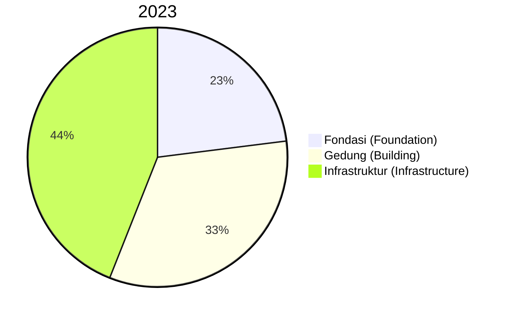
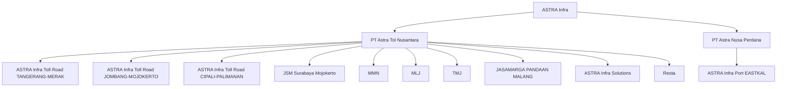
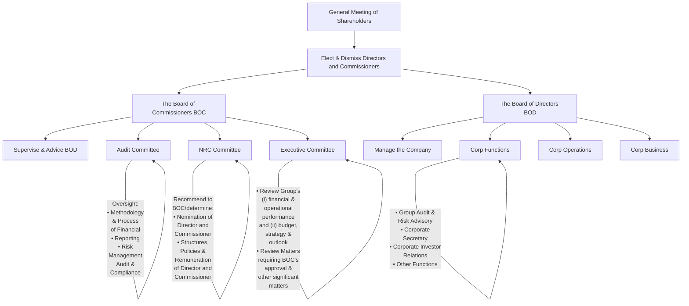

Jasa keuangan Grup Astra meraih peningkatan kinerja yang baik dengan pertumbuhan pendapatan sebesar 13% menjadi Rp29,8 triliun dibandingkan tahun 2022 dengan peningkatan kontribusi laba bersih sebesar 30% menjadi Rp7,9 triliun. Hal ini terutama disebabkan oleh kontribusi yang lebih tinggi dari bisnis pembiayaan konsumen akibat portofolio pinjaman yang lebih besar dan penyisihan kerugian pinjaman yang lebih rendah.

Astra Group's financial services business recorded favorable performance improvement with 13% revenue growth to Rp29.8 trillion compared to 2022 with higher net income contribution of 30% to Rp7.9 trillion. This performance is mainly attributed to higher contribution from the consumer financing business on the back of larger loan portfolios and lower loan loss provisions.

## Tinjauan Industri

Pertumbuhan bisnis jasa keuangan bergerak selaras dengan kondisi perekonomian yang dapat terus bertahan baik pada tahun 2023, didukung oleh pemulihan dampak pandemi serta kebijakan Pemerintah yang menopang stabilitas perekonomian dan daya beli masyarakat. Namun demikian, pada semester kedua kegiatan perekonomian mulai menunjukkan perlambatan, di tengah iklim suku bunga tinggi yang terus berlanjut serta dampak dari ketidakpastian seputar kegiatan pemilu dan transisi pemerintahan pada tahun 2024.

## Industry Review

The financial services businesses achieved growth in line with resilient economic conditions during 2023, largely supported by continued pandemic recovery and Government policies to sustain the stability of the economy and purchasing power. Nevertheless, the momentum of economic activities began to moderate beginning in the second semester, with sustained high-interest environment and rising concerns of risks related to election activities and impending transition of power in 2024.

Sejalan dengan kemampuan finansial bisnis dan konsumen yang terus membaik, kebutuhan dukungan fasilitas kredit untuk pembiayaan usaha, otomotif dan alat berat serta perlindungan bagi bisnis dan aset berharga juga meningkat pada tahun 2023. OJK dan Bank Indonesia terus memperkuat regulasi guna menjaga sektor jasa keuangan dari dampak krisis perbankan yang terjadi di Amerika Serikat dan Eropa. Namun dalam upaya menjaga stabilitas Rupiah, pada kuartal keempat tahun 2023, Bank Indonesia kembali meningkatkan suku bunga setelah sebelumnya bertahan stabil hingga kuartal ketiga, yang berpotensi menahan laju penyaluran kredit dan pertumbuhan ekonomi ke depan.

With continued improvement in financial conditions of businesses and consumers, there was increased demand for credit facility to support business activities, automotive financing, heavy equipment financing and insurance protection for businesses and valuable assets during 2023. OJK and Bank Indonesia consistently strengthened regulations to insulate the financial services sector from the impacts of banking crisis in the US and Europe. However, in the last quarter of 2023, Bank Indonesia moved to raise its benchmark interest rate after maintaining it unchanged until the third quarter of the year in effort to stabilize the currency, hence potentially dampening lending activities and economic growth in the coming year.
---
# Jasa Keuangan
## Financial Services

Tren digitalisasi terus bergulir luas di sektor jasa keuangan dengan kemajuan teknologi, salah satunya terlihat dari kebijakan BI untuk mengakselerasi sistem pembayaran melalui QRIS di kawasan regional. Keunggulan ini juga mendorong perluasan akses layanan jasa keuangan melalui channel digital yang mendukung peningkatan inklusi dan literasi keuangan di tanah air. Oleh karena itu, tantangan ke depan untuk perusahaan jasa keuangan adalah mengembangkan solusi layanan sesuai kebutuhan masyarakat yang luas dengan dukungan regulasi yang kondusif untuk mengarahkan pertumbuhan industri jasa keuangan yang berkelanjutan.

Technological advances continue to drive digitalization across all segments of the financial services sector, including Bank Indonesia's push in accelerating the payment system through QRIS cross border. Also, digital capabilities further expand access to financial services through digital channels to support financial inclusion and literacy nationwide. Therefore, the challenge forward is for financial services companies to develop service solutions to better meet extensive needs of the Indonesia people within regulatory guidance that is conducive to promote growth of sustainable financial services industry.

Secara garis besar perkembangan sektor jasa keuangan terbagi dalam segmen pasar sebagai berikut:

The overall developments in the financial services industry by market segment are as follows:

- Sektor Pembiayaan
Sektor pembiayaan masih didominasi dengan dukungan finansial pada industri otomotif baik roda empat maupun roda dua dimana sekitar 75% penyaluran pembiayaan adalah untuk kepemilikan kendaraan bermotor (sumber: Asosiasi Perusahaan Pembiayaan Indonesia/APPI). Dengan regulasi yang mengakselerasi transisi elektrifikasi termasuk dukungan pemerintah dan regulator melalui berbagai insentif kepada konsumen dalam melakukan konversi, sektor pembiayaan khususnya pembiayaan ritel dituntut untuk turut bertransisi dalam mempelajari skema pembiayaan kendaraan berbasis listrik dan mengembangkan inovasi produk yang mendukung arah pergerakan industri ke depan.

- Financing Sector
The financing sector remains dominated by financial support for the automotive industry, both the four-wheeler and two-wheeler vehicle segments, with about 75% of the financing distribution to meet automotive ownership demand (source: Association of Indonesian Financing Companies/APPI). Given regulatory shift to accelerate electrification with the Government and regulators providing incentives to consumers making the conversion, the financing sector, particularly those focused on retail financing, must similarly commit to the transition by assessing potential schemes for EV financing and develop product innovation to fully support the direction of industry development going forward.

- Sektor Asuransi
Industri asuransi di Indonesia dinilai masih memiliki prospek jangka panjang yang menjanjikan, mengingat angka penetrasi pasar yang masih relatif rendah. Namun, pertumbuhan bisnis asuransi terkait erat dengan kondisi perekonomian, sehingga kondisi perekonomian yang diperkirakan mengalami perlambatan pada tahun 2023 masih memberikan berbagai tantangan, antara lain pelemahan daya beli serta penurunan kegiatan ekonomi dan investasi di tengah ketidakpastian tahun politik.

- Insurance Sector
The long-term growth prospects of the insurance industry in Indonesia remains promising, given that market penetration rate is still relatively low. However, insurance business growth is also closely associated with general economic conditions. Therefore, a slowdown of economic conditions, expected in 2023, will also render emerging challenges, including weakening purchasing power as well as reduced economic and investment activities in response to perceptions of uncertainties in a political year.
---
Pembahasan dan Analisis Manajemen | Tata Kelola Perusahaan | Tanggung Jawab Sosial dan Lingkungan Perusahaan | Laporan Keuangan Konsolidasian 2023
Management Discussion and Analysis | Corporate Governance | Corporate Social and Environmental Responsibility | Consolidated Financial Statements 2023

ASTRA

• Sektor Perbankan
Didukung perekonomian yang bertumbuh baik, perbankan nasional mampu menjaga ketahanan sistem keuangan dan peran intermediasi berjalan dengan lancar, disertai kondisi likuiditas yang kondusif terhadap pertumbuhan kredit perbankan. Dengan kerangka regulasi yang memadai, pemerintah terus mendorong akselerasi digitalisasi sistem pembayaran untuk memperkuat ekosistem perekonomian dan keuangan guna mendukung kelanjutan pemulihan ekonomi. Saat ini, bank-bank yang telah memiliki layanan perbankan digital terus memperkuat integrasi dengan ekosistem digital di sektor keuangan yang lebih luas, sehingga dapat menghadirkan inovasi layanan di luar transaksi perbankan konvensional dan memberikan pengalaman finansial yang semakin komprehensif dan mudah bagi nasabahnya.

• Banking Sector
Against the backdrop of strong economic growth, the national banking sector sustained a resilient financial system and effective financial intermediary function, accompanied by liquidity conditions that were conducive to continued growth of bank loans. To provide adequate regulatory support, government continually accelerate digitalization of the payment system to strengthen the economic and financial ecosystem to sustain continued economic recovery. Today, banks with digital banking capabilities further push integration in a digital ecosystem for more expansive coverage in the financial services sector to offer innovative services beyond conventional banking transactions and create an easy but comprehensive financial experience for customers.

• Sektor Fintech
Sektor financial technology, atau dikenal dengan fintek, merupakan segmen yang berkembang paling pesat, meskipun sejak awal tahun 2020, OJK memberlakukan moratorium pendaftaran layanan baru pinjaman online dalam rangka meningkatkan kesehatan dan reputasi industri.

• Fintech Sector
The financial technology sector, better known as fintech, is the fastest growing industry segment, despite OJK imposing a moratorium on the registration of new online financing services since early 2020 to improve the sector's overall reputation and financial soundness.

[An image of two people shaking hands in front of an ASTRA Financial sign]

Laporan Tahunan 2023 Annual Report

221
---
# Jasa Keuangan
Financial Services

## Strategi Tahun 2023

Astra Financial menjalankan kegiatan bisnis sesuai kerangka regulasi dan berdasarkan prinsip keberlanjutan yang bertujuan memberikan dukungan optimal bagi seluruh pemangku kepentingan dalam memenuhi kebutuhan solusi finansial sehari-hari. Untuk mendukung kegiatan bisnisnya, digitalisasi telah menjadi motor penggerak pengembangan bisnis Astra Financial dalam beberapa tahun terakhir. Hal ini bertujuan meningkatkan kapabilitas bisnis dan membuka jangkauan yang lebih luas dalam mendukung peningkatan literasi dan inklusi keuangan di tanah air.

Layanan Astra Financial meliputi kebutuhan pembiayaan untuk berbagai keperluan, perlindungan asuransi bisnis dan individu, layanan perbankan, serta kehadiran platform digital yang dilengkapi kemudahan layanan fintech Maucash dan pembayaran elektronik AstraPay. Dengan peluncuran layanan perbankan digital Bank Saqu, maka pada tahun 2023 Astra Financial terus melangkah dalam mewujudkan aspirasinya untuk menghadirkan ekosistem jasa keuangan yang lengkap bagi masyarakat Indonesia yang luas. Diperkuat dengan unsur edukasi yang secara khusus dirancang sesuai arah pengembangan layanan secara bertahap dalam beberapa tahun ke depan, Bank Saqu diharapkan dapat mendukung basis pelanggan baru, terutama kalangan underbanked dan unbanked yang sebagiannya merupakan pelaku UMKM dan membutuhkan dukungan finansial yang mudah dan aman dalam menunjang pengembangan bisnisnya lebih optimal.

Ke depan, Astra Financial akan terus mendorong pengembangan ekosistem bisnisnya dalam rangka meningkatkan kehadiran di tengah masyarakat Indonesia dan membuka peluang untuk memajukan ekonomi bangsa secara lebih menyeluruh dan merata selaras cita-cita Grup Astra untuk selalu sejahtera bersama bangsa.

## Strategies in 2023

Astra Financial runs business activities in accordance with the regulatory framework and based on sustainability principles for the purpose of providing optimal support to all stakeholders in fulfilling their needs for daily financial solutions. For smooth business activities, Astra Financial relies on digitalization as the driving force for business development in recent years. Its focus is on enhancing business capabilities and extending wider reach to generate improvements in financial literacy and inclusion in the country.

The scope of Astra Financial services covers multipurpose financing solutions, insurance protection for businesses and individuals and banking services, all complemented by a digital platform equipped with the convenience of fintech services from Maucash and AstraPay electronic payment. Following the launching of digital banking services Bank Saqu, Astra Financial took a big leap in 2023 towards realizing aspiration of providing a comprehensive financial services ecosystem for the people of Indonesia. Bank Saqu is reinforced with educational elements that are specifically designed in line with the direction of gradual service development over the next few years, to be able to support new customer base, particularly the underbanked and unbanked population, which mostly comprise MSMEs that require convenient and safe financial support to promote business development more optimally.

Going forward, Astra Financial will continually promote the development of the business ecosystem to enhance its presence for the people of Indonesia and open vast opportunities towards building a more expansive and equitable national economy in line with Astra Group's aspiration to prosper with the nation.
---
| Pembahasan dan Analisis Manajemen<br/>Management Discussion and Analysis | Tata Kelola Perusahaan<br/>Corporate Governance | Tanggung Jawab Sosial dan Lingkungan Perusahaan<br/>Corporate Social and Environmental Responsibility | Laporan Keuangan Konsolidasian 2023<br/>Consolidated Financial Statements 2023 | ASTRA |
| ------------------------------------------------------------------------ | ----------------------------------------------- | ----------------------------------------------------------------------------------------------------- | ------------------------------------------------------------------------------ | ----- |

Laporan Tahunan 2023 Annual Report                                                                                           223
---
ASTRA

| Ikhtisar Highlights | Laporan Manajemen Management Reports | Profil Perusahaan Company Profile | Sumber Daya Manusia dan Digitalisasi Human Capital and Digitalization |
| ------------------- | ------------------------------------ | --------------------------------- | --------------------------------------------------------------------- |

# Pembiayaan Kendaraan Bermotor

## Automotive Financing

> Perusahaan pembiayaan kendaraan bermotor Grup Astra terus berkembang dengan peningkatan kinerja dan dukungan finansial yang lengkap untuk pembelian produk otomotif, termasuk kendaraan listrik.

> Astra Group's automotive financing companies continually improve performance and financial support for all automotive transactions, including electric vehicles.

224 Laporan Tahunan 2023 Annual Report
---
Grup Astra memberikan dukungan finansial untuk konsumen otomotif di tanah air dengan kemudahan fasilitas pembiayaan yang terjangkau untuk kepemilikan mobil melalui Astra Credit Companies (ACC) dan Toyota Astra Financial Services (TAF), serta pembiayaan sepeda motor melalui Federal International Finance (FIFGROUP).

Astra Group provides financial support for automotive consumers nationwide with convenient and affordable financing facilities for car ownership through Astra Credit Companies (ACC) and Toyota Astra Financial Services (TAF) and for motorcycle financing through Federal International Finance (FIFGROUP).

## Tinjauan dan Prospek Industri

Didukung momentum pemulihan ekonomi yang baik, kinerja perusahaan jasa keuangan mengalami pertumbuhan positif pada tahun 2023. Di sektor otomotif, volume penjualan roda empat mengalami sedikit penurunan akibat perlambatan ekonomi yang mulai terlihat sejak semester kedua, sedangkan kinerja penjualan sepeda motor terlihat mengalami peningkatan yang signifikan karena tahun 2022 terdampak oleh isu pasokan semikonduktor. Persaingan pada segmen pembiayaan otomotif baik roda empat maupun roda dua bergerak dinamis, dengan penawaran suku bunga dan uang muka yang kompetitif dari masing-masing perusahaan pembiayaan.

## Industry Review and Outlook

Financial services companies recorded favorable performance growth in 2023 driven by the momentum of economic recovery. In the automotive sector, there was a slight decline in four-wheeler sales volume aligned with a gradual slowdown of the economy seen in the second semester, whereas motorcycle sales recorded a significant growth, mostly attributed to 2022 performance impacted by semiconductor supply issues. Dynamic competition persisted in both four-wheeler and two-wheeler financing businesses, characterized by aggressive interest rate and down payment offerings from financing companies.

Pertumbuhan sektor otomotif masih akan dipengaruhi oleh kondisi ekonomi dalam negeri yang terdampak oleh risiko-risiko ketidakpastian, termasuk situasi geopolitik dan pergerakan harga komoditas. Namun demikian, prospek pertumbuhan sektor pembiayaan otomotif dalam jangka panjang masih menjanjikan. Jumlah populasi kendaraan yang beroperasi di Indonesia masih relatif rendah jika dibandingkan dengan negara-negara tetangga di kawasan Asia Tenggara. Sementara itu, populasi Indonesia yang besar dan memiliki tingkat pendapatan yang baik serta didukung dengan fokus pembangunan infrastruktur oleh Pemerintah, akan mendorong kebutuhan moda transportasi yang semakin beragam di seluruh penjuru tanah air. Mengingat akselerasi transisi elektrifikasi di industri, perusahaan-perusahaan pembiayaan dituntut untuk mengembangkan rangkaian produk pembiayaan yang inovatif agar dapat menunjang kebutuhan segmen konsumen ini pada tahun mendatang.

Growth in the automotive sector will continue to be influenced by domestic economic conditions, which will face risks of uncertainties, including geopolitical conditions and commodities prices fluctuations. Nonetheless, the long-term growth prospects of the automotive financing sector remain promising. In Indonesia, there is relatively low population of vehicles in operation when compared to neighboring countries around Southeast Asia. Further, the country's large population with increasing affluence and the Government's support through continuous infrastructure development will drive demand for more diverse modes of transportation across the nation. Given the acceleration of industry transition to electrification, financing companies are expected to develop a selection of innovative financing solutions to continually support this consumer segment in the coming years.
---
# Pembiayaan Kendaraan Bermotor
## Automotive Financing

## Astra Credit Companies (ACC)

Grup ACC merupakan gabungan dari tiga perusahaan pembiayaan, terdiri dari PT Astra Sedaya Finance, PT Swadharma Bhakti Sedaya Finance dan PT Astra Auto Finance.

ACC Group comprises three multi-finance companies: PT Astra Sedaya Finance, PT Swadharma Bhakti Sedaya Finance and PT Astra Auto Finance.

### Produk dan Layanan

ACC menyediakan solusi pembiayaan konvensional dan syariah untuk berbagai keperluan pelanggan. Fokus operasional ACC terarah pada pembiayaan otomotif, khususnya pembelian kendaraan roda empat baru dan bekas berbagai merek, serta pembiayaan armada untuk pelaku usaha. Produk andalan lainnya adalah fasilitas pendanaan dengan jaminan kendaraan roda empat, serta penawaran fasilitas pembiayaan alat berat, pembiayaan properti dan pembiayaan modal kerja. Sedangkan untuk layanan syariah, tersedia pembiayaan kendaraan baru dan bekas pakai, pembiayaan multiguna syariah dan pembiayaan perjalanan religi untuk haji dan umrah. ACC terus berupaya memperkuat portofolio bisnis yang dimiliki, diantaranya inisiatif yang telah dimulai pada tahun 2023 untuk menjalin kemitraan dengan Astra Mitra Ventura dalam menawarkan fasilitas pembiayaan joint financing bagi UMKM. Seluruh pengembangan fasilitas pembiayaan dilakukan dengan memaksimalkan model bisnis utama sesuai dengan ketentuan OJK terkait perusahaan pembiayaan.

### Products and Services

ACC provides financing solutions in both conventional and shariah forms to suit customers' needs. ACC's operational focus lies on automotive financing, particularly for purchases of new and used four-wheelers of different brands, as well as fleet financing for business owners. Other flagship products include funding facilities backed by cars as collateral, as well as financing support for heavy equipment, mortgage and working capital financing. Shariah product offerings consist of new and used car financing, shariah financial facilities and financing for religious travels (regular and special Hajj). ACC continually strives to strengthen the business portfolio, including an initiative in 2023 to establish partnership with Astra Mitra Ventura in providing joint financing to provide financial support to MSMEs. All financing products are developed to optimize the main business model in accordance with OJK regulations concerning multi-finance companies.

ACC mengutamakan kualitas portofolio yang sehat dengan menjaga proses pembiayaan berdasarkan prinsip kehati-hatian yang didukung sistem manajemen risiko terintegrasi pada tiga bagian utama struktur bisnis yang dijalankan. Di tahap awal akuisisi pembiayaan, ACC melakukan analisa due diligence berdasarkan 5C - capacity, collateral, capital, character, condition terhadap pelanggan. Tahap berikutnya adalah melakukan penyaluran pembiayaan dengan Loan Maintenance untuk pengelolaan piutang selama masa periode kredit. Selain itu, sebagai garda terakhir proses Customer Retention bekerja sama dengan Customer Relationship Management (CRM) untuk memberikan pelayanan dan program retensi kepada pelanggan.

ACC emphasizes sound portfolio quality by applying credit disbursement on the basis of the prudential principle backed by an integrated risk management system applied to three main parts of the business structure. In the initial phase of loan acquisition, ACC performs due diligence on potential customers using the 5C analysis: capacity, collateral, capital, character and condition. The next step is to distribute financing with Loan Maintenance in charge of the receivables management process for the duration of the credit period. At the final stage, as the last line of the Customer Retention process, working together with Customer Relationship Management (CRM) to provide service and retention programs to customers.

### Pemasaran dan Jaringan Pelayanan

Pelanggan ACC dapat mengakses seluruh penawaran lini produk dan layanan melalui jaringan cabang

### Marketing and Service Network

Customers can access all product and service offerings through ACC's national branch network
---
nasional dengan dilengkapi layanan digital untuk menciptakan pengalaman finansial yang mudah, aman dan modern bagi pelanggan. Sejak tahun 2022, ACC telah mengintegrasikan fungsi digital bisnis pada Berijalan, dengan tiga pilar terdiri dari Operation Center untuk sentralisasi proses operasional berbasis digital, Telephony Center yang menangani kegiatan bisnis berbasis telepon dan Techno Center untuk mendorong berbagai terobosan inovasi digital yang mendukung proses bisnis yang seamless serta pengembangan kinerja dan bisnis yang berkelanjutan.

Selain meningkatkan efisiensi dan produktivitas bisnis lebih optimal, pengembangan platform digital dilakukan secara intensif dan sistematis untuk memperluas jangkauan pasar serta menarik segmen pelanggan yang ramah digital dan teknologi dengan berbagai kemudahan bertransaksi dan berinteraksi.

## Jaringan Pelayanan Digital Eksternal

- ACC ONE memberi kemudahan akses terintegrasi untuk seluruh produk dan layanan ACC dalam satu platform, sebuah solusi menyeluruh untuk setiap kebutuhan pelanggan ACC;
- Yuna adalah layanan bantuan digital dalam bentuk chatbot & callbot yang terintegrasi dengan web ACC ONE untuk menjawab berbagai kebutuhan pelanggan ACC;
- accbid adalah aplikasi lelang mobile bekerja sama dengan balai lelang untuk transaksi lelang mobil secara online;
- Setir Kanan adalah kanal otomotif di YouTube yang memberikan informasi terpercaya melalui berbagai konten video yang menarik dan menghibur untuk penggemar otomotif.

## Jaringan Pelayanan Digital Internal

- ACCME adalah aplikasi yang digunakan sebagai alat kerja dalam rangka mendukung kelancaran proses internal;
- Operation Center merupakan unit operasi terpadu dan sentralisasi kegiatan operasional untuk meningkatkan kualitas pelayanan serta membantu mempercepat proses akuisisi kredit.

76
Kantor Cabang | Branch Offices
---
# Pembiayaan Kendaraan Bermotor
Automotive Financing

## Kinerja 2023
Performance in 2023

Didukung momentum pertumbuhan ekonomi, ACC dapat meraih pertumbuhan kinerja yang baik untuk tahun 2023, terlihat dari sisi jumlah maupun unit pembiayaan dan profitabilitas. Pencapaian ini juga diiringi keberhasilan untuk mempertahankan posisi terdepan dalam segmen pembiayaan roda empat. Konsistensi strategi operational excellence, digitalisasi dan sinergi dengan berbagai pihak dioptimalkan untuk menjangkau target konsumen otomotif lebih luas dan menopang daya saing yang mendukung pertumbuhan bisnis berkelanjutan.

Supported by the momentum of economic growth, ACC managed to achieve favorable performance growth in 2023, as reflected in amount and units financed as well as profitability. With improved performance, ACC also maintained market leadership position in four-wheeler financing. ACC consistently optimized its strategies in operational excellence, digitalization and synergy with various parties to expand reach across automotive consumer segments and promote competitive advantage to support sustainable business growth.

### Jumlah Pembiayaan
Amount Financed

| Jumlah Pembiayaan (Rp triliun)<br/>Amount Financed (Rp trillion) | Unit Pembiayaan (unit)<br/>Units Financed (units) |
| ---------------------------------------------------------------- | ------------------------------------------------- |
| 2022	2023&#xA;35.73	36.19                                        |                                                   |

|         |         |
| ------- | ------- |
| 2022    | 2023    |
| 209,485 | 203,681 |

228 Laporan Tahunan 2023 Annual Report
---
## Komposisi Pembiayaan
Financing Composition

| Category                | 2022 (%) | 2023 (%) |
| ----------------------- | -------- | -------- |
| Mobil Baru (New Cars)   | 62       | 58       |
| Mobil Bekas (Used Cars) | 23       | 27       |
| Lain-lain (Others)      | 15       | 15       |

## Pendanaan
Funding

- Obligasi Berkelanjutan VI Astra Sedaya Finance Tahap I Tahun 2023 senilai Rp2,5 triliun dengan peringkat idAAA dari PT Pemeringkat Efek Indonesia.
- Obligasi Berkelanjutan VI Astra Sedaya Finance Tahap II Tahun 2023 senilai Rp1,0 triliun dengan peringkat AAA(idn) dari PT Fitch Ratings Indonesia.

- Continuous Bonds VI Phase I Astra Sedaya Finance of Rp2.5 trillion in 2023 with idAAA rating from PT Pemeringkat Efek Indonesia.
- Continuous Bonds VI Phase II Astra Sedaya Finance of Rp1.0 trillion in 2023 with AAA(idn) rating from PT Fitch Ratings Indonesia.

| Category                                   | 2022 (Rp triliun) | 2023 (Rp triliun) |
| ------------------------------------------ | ----------------- | ----------------- |
| Obligasi (Bonds)                           | 9.6               | 9.8               |
| Sindikasi/Club Loan (Syndicated/Club Deal) | 7.4               | 6.8               |
| Pinjaman Bilateral (Bilateral Loan)        | 11.9              | 14.4              |
| Joint Finance                              | 7.8               | 8.0               |

Laporan Tahunan 2023 Annual Report

229
---
# Pembiayaan Kendaraan Bermotor
## Automotive Financing

### Rencana Tahun 2024

Terlepas dari berbagai tantangan yang masih akan mewarnai iklim bisnis pada tahun mendatang, ACC tetap optimis bahwa kondisi perekonomian dapat terus mendukung peluang pertumbuhan bisnis yang baik dalam jangka panjang. Didukung infrastruktur digital yang dapat membuka peluang pertumbuhan bisnis dengan kemampuan pemantauan risiko yang mumpuni, langkah ekspansi ACC ke depan tetap adaptif dengan perkembangan industri dan kondisi perekonomian global, termasuk mengoptimalkan akses pada sumber pendanaan yang kompetitif.

Mengikuti perubahan tren di industri otomotif, ACC juga terus proaktif dalam memelopori pembiayaan kendaraan listrik untuk mendukung pertumbuhan kendaraan yang lebih ramah lingkungan. Pertumbuhan bisnis yang berkelanjutan juga didukung kejelian untuk menjajaki pengembangan portofolio dengan growth engine baru, salah satunya pembiayaan UMKM/UKM yang diharapkan akan memacu pertumbuhan bisnis mengingat potensi yang besar pada segmen produktif ini.

### Plans in 2024

Despite various challenges expected to still overshadow the business climate in the coming years, ACC remains optimistic that the economic conditions will continually support growth opportunities for the business over the long term. Supported by a digital infrastructure capable of opening opportunities for business growth with strong risk management capabilities, ACC's future expansion strategy will be adaptive to industry developments and global economic conditions, including optimizing access to competitive funding sources. Following shifting trends in the automotive industry, ACC will continue to be proactive in developing pioneering schemes for electric vehicle financing to support growth of environmentally friendly vehicles. Sustainable business growth will also rely on foresight to explore portfolio development with new growth engines, including MSME/SME financing that is expected to propel business growth considering the promising potential of this productive segment.

230

Laporan Tahunan 2023 Annual Report
---
| Pembahasan dan Analisis Manajemen<br/>Management Discussion and Analysis | Tata Kelola Perusahaan<br/>Corporate Governance | Tanggung Jawab Sosial dan Lingkungan Perusahaan<br/>Corporate Social and Environmental Responsibility | Laporan Keuangan Konsolidasian 2023<br/>Consolidated Financial Statements 2023 | ASTRA |
| ------------------------------------------------------------------------ | ----------------------------------------------- | ----------------------------------------------------------------------------------------------------- | ------------------------------------------------------------------------------ | ----- |

berijalan OJK logo

# Bulan Inklusi Keuangan 2023

## CSR BERIJALAN: EDUCLASS

# EDUCLASS
berijalan

## PEMAHAMAN LITERASI PRODUK JASA KEUANGAN UNTUK MENGHINDARI INVESTASI BODONG

Universitas Atma Jaya Yogyakarta
Selasa, 31 Oktober 2023

Laporan Tahunan 2023 Annual Report                                                                                     231
---
# Pembiayaan Kendaraan Bermotor
## Automotive Financing

## Toyota Astra Financial Services (TAF)

TAF didirikan oleh Astra dan Toyota Financial Services Corporation sebagai perusahaan pembiayaan dan bagian dari rantai nilai bisnis Grup Astra dan Toyota yang memberikan dukungan finansial untuk penjualan produk otomotif di Indonesia.

TAF was established by Astra and Toyota Financial Services Corporation as a financial company and part of both Astra Group and Toyota value chains to provide financing solutions which support automotive sales in Indonesia.

## Produk dan Jasa

TAF menyediakan fasilitas pembiayaan, khususnya yang terfokus pada pembiayaan multiguna untuk kendaraan roda empat, dengan fleksibilitas pilihan pembiayaan konvensional dan syariah sesuai kebutuhan pelanggan. Secara paralel, TAF juga melakukan diversifikasi bisnis untuk optimalisasi portofolio pinjaman, antara lain dengan pembiayaan multiguna untuk pinjaman tunai, pembiayaan modal kerja (dealer financing) dan sewa operasi KINTO, yang memberikan opsi produk sewa (operating lease) bagi pelanggan melalui pelayanan full-service lease, dengan akses pemesanan melalui situs web https://www.kinto-id.com atau dealer di area Jabodetabek. Dalam proses pengembangan bisnis, TAF senantiasa menerapkan prinsip kehati-hatian, khususnya dalam pelaksanaan proses underwriting serta pengelolaan piutang debitur baru, dalam rangka mendukung pertumbuhan bisnis yang berkesinambungan.

## Products and Services

TAF offers varieties of financing facilities, primarily focused on financing vehicles, with the option of conventional or sharia financing according to customer needs. TAF simultaneously applies business diversification strategy for more optimal business portfolios, including offering multipurpose cash financing (Siap Dana), working capital financing through dealer financing as well as KINTO as an operating lease product operation that allows customers to enjoy the benefit of full-service lease, with ordering access via the website https://www.kinto-id.com or dealers in the Jabodetabek area. In exploring new business opportunities, TAF always applies precautionary principles, particularly in acquisition and account receivables management of debtor, in supporting sustainable business growth.

## Pemasaran dan Jaringan Pelayanan

Pengembangan jaringan TAF mengandalkan terjaganya hubungan yang erat dengan dealer, digitalisasi yang mengoptimalkan akses dan konektivitas dalam keseluruhan ekosistem bisnis, serta organisasi yang agile dan terfokus pada pengelolaan risiko dalam operasional bisnis sehari-hari. TAF juga terus meningkatkan customer engagement melalui optimalisasi akses dan kualitas jaringan cabang maupun digital touchpoint sehingga dapat tercipta pengalaman pelanggan yang terbaik di setiap kesempatan.

## Marketing and Service Network

TAF develops a reliable service network based on good relationship with dealers, digitalization for more optimal access and connectivity in the business ecosystem, as well as agile organization with embedded risk management lifestyle. TAF also enhances customer engagement by optimizing access and quality of branch network and digital touchpoints to create the best customer experience at every opportunity.
---
• Kehadiran Service Lounge untuk pelanggan yang berdomisili di Jakarta, menawarkan jam layanan lebih fleksibel, termasuk di akhir pekan dan kemudahan akses di pusat perbelanjaan.

• Flex dirancang sebagai cabang virtual bagi pelanggan, yang memberikan akses layanan berbasis mobile application untuk memudahkan pelanggan TAF dalam memperoleh layanan online, meliputi status aplikasi, perhitungan dan status angsuran, pengajuan restrukturisasi, penarikan BPKB (bukti kepemilikan kendaraan bermotor) dan berbagai manfaat lainnya. Aplikasi ini juga telah terintegrasi dengan berbagai platform layanan jasa keuangan yang menyeluruh dari Astra Financial. Sejak 2022, juga telah dilengkapi dengan inovasi fitur video call Tomi Online Service (TOS) yang memberikan pelanggan akses layanan online yang lebih personal.

• Aplikasi DEAL dikembangkan sebagai perangkat aplikasi yang mendukung staf sales pada jaringan dealer dalam memberikan pelayanan yang terfokus pada kepuasan pelanggan. Pertama diluncurkan pada tahun 2020, keunggulan fitur saat ini telah mendukung kemampuan simulasi kredit yang fleksibel, proses akuisisi yang cepat dan prudent hingga proses pemantauan status aplikasi yang transparan, sehingga mempermudah aplikasi kredit serta meringkas waktu proses persetujuan kredit sesuai kebutuhan pelanggan dan secara terus menerus dikembangkan kemampuan dan fitur yang dimiliki selaras perkembangan digitalisasi dalam bisnis TAF untuk mendukung produktivitas kerja.

• The establishment of Service Lounge for customers domiciled in Jakarta, offering more flexible after-hours services, including on weekends, with easy access in shopping centers.

• Flex is designed as a virtual branch for customers, in the form of a mobile application that provides TAF customers convenient access to an extensive range of online services including application status, calculation and installment status, restructuring proposals, BPKB (proof of motor vehicle ownership certificates) withdrawals and many more benefits. This application is also integrated to various platforms delivering comprehensive financial services from Astra Financial. Since 2022, Flex was completed with Tomi Online Service (TOS) that provides customers with more personalized and innovative video call service.

• DEAL application is developed by TAF as an application to support salesman dealer to deliver services which focused on customer satisfaction. Initially launched in 2020, it is currently equipped with features such as flexible credit simulation, faster and prudent credit acquisition and transparent application monitoring capabilities to ease submission of credit application and accelerate credit approval process according to customers' needs. Its continuous development is aligned with the progress of digital developments across TAF's business to introduce new features and capabilities that support work productivity.

40
Cabang | Office
---
ASTRA

Ikhtisar | Laporan Manajemen | Profil Perusahaan | Sumber Daya Manusia dan Digitalisasi
Highlights | Management Reports | Company Profile | Human Capital and Digitalization

# Kinerja 2023
Performance in 2023

Pemulihan aktivitas penjualan otomotif ke tingkat sebelum pandemi dapat mengoptimalkan bisnis inti TAF dalam mendukung penjualan kendaraan roda empat serta strategi ekspansi pada segmen penjualan kendaraan bekas pakai, sehingga dapat mendorong peningkatan kinerja yang sangat baik pada tahun 2023. Pencapaian ini didukung upaya TAF untuk terus memperkuat sinergi dan memperluas kolaborasi dengan berbagai pihak pada berbagai platform agar dapat mengoptimalkan hasil dari berbagai inisiatif strategis yang dilakukan. Salah satu fokus kolaborasi adalah penguatan sumber pendanaan dalam rangka menawarkan suku bunga dan persyaratan pembayaran dimuka yang menarik bagi konsumen, khususnya dalam menghadapi tantangan persaingan dengan perbankan serta perusahaan pembiayaan yang terafiliasi dengan bank.

The recovery of the domestic automotive market to pre-pandemic levels could optimize TAF's core business in providing new financing for four-wheeled vehicles and in executing expansion strategy into the used cars market segment, thereby generating significant improvement in performance for 2023. This achievement was also supported by TAF's continuous efforts to strengthen synergy and expand collaborations with various parties in multiple platforms to optimize targeted results from the implementation of strategic initiatives during the year. A focus in collaborations aimed to address competition with banks and bank-affiliated financing companies by strengthening funding sources to be able to offer lower rates and attractive down payment terms to automotive financing customers.

## Jumlah Pembiayaan
Amount Financed

| Jumlah Pembiayaan (Rp triliun)<br/>Amount Financed (Rp trillion) | Unit Pembiayaan (unit)<br/>Units Financed (units) |
| ---------------------------------------------------------------- | ------------------------------------------------- |
| 2022	2023&#xA;30.0	37.4                                          |                                                   |

|         |         |
| ------- | ------- |
| 2022    | 2023    |
| 132,224 | 157,757 |

234 Laporan Tahunan 2023 Annual Report
---
## Pendanaan

Sebagian besar pendanaan TAF berasal dari pinjaman bank, dengan didukung penerbitan obligasi sebesar Rp2,1 triliun pada tahun 2023.

- Obligasi Berkelanjutan IV Toyota Astra Financial Services Tahap I Tahun 2023 senilai Rp1,5 triliun dengan peringkat AAA dari PT Fitch Ratings Indonesia.
- Obligasi Berkelanjutan IV Toyota Astra Financial Services Tahap II Tahun 2023 senilai Rp625 miliar dengan peringkat AAA dari PT Fitch Ratings Indonesia.

Most of TAF's funding comes from bank loans, supported by bonds issuance in total amount of Rp2.1 trillion in 2023.

- Continuous Bonds IV Toyota Astra Financial Services Phase I Year 2023 of Rp1.5 trillion with AAA rating from PT Fitch Ratings Indonesia.
- Continuous Bonds IV Toyota Astra Financial Services Phase II Year 2023 of Rp625 billion with AAA rating from PT Fitch Ratings Indonesia.

| Obligasi & MTN (Rp triliun)<br/>Bonds & MTN (Rp trillion) | Pinjaman Bilateral (Rp triliun)<br/>Bilateral Loan (Rp trillion) |
| --------------------------------------------------------- | ---------------------------------------------------------------- |
| 2022	2,036&#xA;2023	3,137                                 |                                                                  |

|      |        |
| ---- | ------ |
| 2022 | 20,980 |
| 2023 | 25,145 |

## Rencana Tahun 2024

Dalam menghadapi tahun politik, TAF akan meningkatkan kewaspadaan dan mendorong pengembangan bisnis, khususnya terfokus pada pembiayaan kendaraan bekas pakai dan fasilitas multiguna TAF Siap Dana yang memiliki potensi pertumbuhan sangat baik. Selaras dengan tantangan disrupsi digital, TAF akan mempertajam dan memperluas kolaborasi bisnis dan digital dengan berbagai pihak, dalam rangka merespons tren perubahan konsumen dan mengoptimalkan peluang pertumbuhan ke depan.

## Plan in 2024

In facing a political year, TAF will increase vigilance and pursue business development, particularly in used car financing and TAF Siap Dana multipurpose financing which considered to have favorable growth potential. In line with the challenges of digital disruption, TAF will sharpen and expand business and digital collaboration, with various parties in response to the changing of customer behavior and optimizing growth opportunities going forward.
---
# Pembiayaan Kendaraan Bermotor
## Automotive Financing

## Federal International Finance (FIFGROUP)

FIFGROUP merupakan perusahaan jasa keuangan dalam struktur bisnis Grup Astra yang menjalankan fokus utama pada pembiayaan sepeda motor Honda diiringi strategi diversifikasi portofolio bisnis lainnya untuk menawarkan solusi pembiayaan yang dapat menjangkau basis konsumen lebih luas dan mendukung pertumbuhan bisnis yang berkelanjutan.

FIFGROUP is a financing company within Astra Group's business structure, focused on financing Honda motorcycle offer a more comprehensive financing solution to expand customer base and support sustainable business growth.

## Produk dan Jasa

FIFGROUP menerapkan model bisnis yang mengedepankan jalinan bisnis kemitraan dengan inovasi produk dan jaringan layanan.

FIFGROUP menyediakan fasilitas pembiayaan untuk berbagai kebutuhan dan sesuai preferensi konsumen melalui skema konvensional dan syariah. Fasilitas pembiayaan yang tersedia dari FIFGROUP dikembangkan melalui 5 lini bisnis utama berdasarkan penawaran produk, terdiri dari:

- FIFASTRA: fasilitas pembiayaan sepeda motor, yang merupakan portofolio bisnis terbesar milik FIFGROUP, mencakup pembiayaan untuk kepemilikan sepeda motor Honda baru. Dalam skema bisnis ini, FIFASTRA merupakan bagian dari rantai nilai bisnis sepeda motor melalui sinergi kemitraan dengan Astra Honda Motor sebagai prinsipal, main dealer serta jaringan dealer sepeda motor Honda sebagai mitra strategi;
- DANASTRA: fasilitas pembiayaan multiguna, dengan jaminan collateral;
- SPEKTRA: fasilitas pembiayaan multi product yang merupakan rangkaian dukungan finansial untuk pembelian produk elektronik, peralatan rumah tangga, furniture, gadget dan produk lifestyle;
- AMITRA: platform syariah yang fokus pada pembiayaan perjalanan religi (haji dan umrah).
- FINATRA: merupakan bisnis terbaru yang diluncurkan pada tahun 2022 sebagai fasilitas pembiayaan mikro produktif yang menjadi solusi bagi UMKM dalam mengembangkan usahanya.

## Products and Services

FIFGROUP implements a business model built on business partnerships while also continuously creating innovations for product and service network.

FIFGROUP offers a large selection of financial solutions to suit customers' needs and preferences with the flexibility of conventional and shariah schemes. FIFGROUP develops its business by operating 5 core business lines based on product offerings as follows:

- FIFASTRA: motorcycle financing product, which represents the majority of FIFGROUP's business portfolio, covering financing for ownership of new Honda motorcycles. Under this business arrangement, FIFASTRA becomes an integral unit in the motorcycle business value chain through synergistic partnership with Astra Honda Motor as principal, main dealer and Honda motorcycle dealer network as strategy partners;
- DANASTRA: multi-purpose financing with collateral requirement;
- SPEKTRA: multi-product financing that provides financial support for a series of purchase transactions, including electronics, household appliances, furniture, gadgets and other lifestyle products;
- AMITRA: shariah platform focused on financing support for religious tours (hajj and umrah).
- FINATRA: FIFGROUP's new business portfolio launched in 2022 to provide productive micro credit as a solution for MSMEs in developing business.
---
Sesuai prinsip operational excellence untuk memberikan kemudahan dan kenyamanan pengalaman finansial bagi pelanggan, FIFGROUP menyediakan layanan pendukung yang melengkapi setiap fasilitas pembiayaan, di antaranya perlindungan asuransi untuk objek pembiayaan dan opsi pembayaran cicilan antara lain melalui AstraPay, sebagai salah satu mitra penyelenggara uang elektronik.

Consistent with its operational excellence principle to create convenient and comfortable financial experience for customers, FIFGROUP integrates supporting services to all financing product offering, including product insurance and easy installment payment option such as using AstraPay, as one of electronic payment service partners.

## Pemasaran dan Jaringan Pelayanan

Strategi pemasaran FIFGROUP mengandalkan ketersediaan omnichannel untuk memberikan pengalaman pelanggan yang berkesan dalam berinteraksi dan bertransaksi. Ekosistem bisnis FIFGROUP terus diperkuat melalui kolaborasi yang erat pada platform digital maupun non-digital dengan mitra strategis FIFGROUP, Grup Astra serta mitra strategis pihak ketiga, sehingga pelanggan dapat menikmati keunggulan akses pada portofolio produk dan layanan yang lebih lengkap dan bernilai tambah.

## Marketing and Service Network

FIFGROUP's marketing strategy relies on omnichannel availability memorable interaction and transaction experiences for customers. To provide customers with flexible access to comprehensive and value-added product portfolio and service channels, FIFGROUP continually builds a stronger business ecosystem by expanding collaboration on both digital and non-digital platforms, with FIFGROUP's strategic partners, Astra Group and third party strategic partners.

Selaras peningkatan ekonomi digital, maka FIFGROUP terus berupaya mengakselerasi digitalisasi agar dapat memperluas jangkauan pemasaran pada segmen baru yang potensial, memaksimalkan engagement dengan konsumen, serta memberikan pengalaman pembiayaan yang lebih optimal dalam rangka meningkatkan loyalitas pelanggan.

With the development of the digital economy, FIFGROUP continually strives to accelerate digitalization in order to expand reach to potential customers segment, to increase engagement with customers, while also optimizing their financing journey in favor of strengthening existing customers' loyalty.

|                                        |                                              |                                                                                                        |
| -------------------------------------- | -------------------------------------------- | ------------------------------------------------------------------------------------------------------ |
| **243**<br/>kantor cabang<br/>branches | **388**<br/>titik layanan<br/>service points | **6,400+**<br/>dealer otomotif dan toko elektronik<br/>automotive dealers and electronic store outlets |

---
# Pembiayaan Kendaraan Bermotor
## Automotive Financing

- Aplikasi FIFGO merupakan versi terupdate dari aplikasi customer yang menghadirkan berbagai kemudahan di tangan pelanggan, yang dilengkapi dengan fitur-fitur untuk kebutuhan pelanggan, mulai dari discovery phase, purchase phase, usage phase, hingga loyalty;

- FIFGROUP Intelligent Personal Assistant (FIONA) adalah layanan pelanggan secara virtual dengan bantuan chatbot untuk memenuhi kebutuhan pelanggan mendapatkan informasi dan bantuan dengan cepat, melalui akses terintegrasi pada Whatsapp, Website dan Facebook Messenger;

- Mesin Antrian ISS (Integrated Self Service) - FIONA SIAP adalah mesin antrian di cabang FIFGROUP yang dapat mengatur alur antrian konsumen ke masing-masing frontliner secara otomatis sesuai dengan layanan yang dipilih;

- HALOFIF memiliki saluran telepon 1500-343 dan e-mail di halofif@fifgroup.astra.co.id. FIFGROUP juga memiliki media sosial @FIFCLUB yang dapat diakses melalui Facebook, Instagram, & Twitter. Layanan HALOFIF dan media sosial FIFCLUB tersedia pada hari Senin - Jumat pukul 08.00 - 17.00 WIB. Virtual customer service Fiona siap melayani konsumen selama 24 jam setiap hari.

- The FIFGO application is the latest version of the customer application providing customers with convenient service access in the palm of their hands, equipped with attractive features to help customers navigate through the discovery phase, purchase phase, usage phase and up to loyalty programs;

- FIFGROUP Intelligent Personal Assistant (FIONA) is a chatbot providing virtual assistance to customers who require faster access to information and services, integrated and presented on Whatsapp, Website and Facebook Messenger;

- Smart Queue System with Integrated Self Service (ISS) System - FIONA SIAP is used in FIFGROUP branches to manage the flow of customer traffic directly to designated frontliner staff according to customers' input for service selection;

- HALOFIF with telephone access 1500-343 and email at halofif@fifgroup.astra.co.id. FIFGROUP's social media accounts with Facebook, Instagram, Twitter @FIFCLUB. HALOFIF services and FIFCLUB social media are available during operating hours: Monday to Friday 08.00 - 17.00 WIB. Virtual customer service Fiona is available for extensive 24/7 service.
---
# Kinerja 2023
## Performance in 2023

Dengan porsi bisnis utama pada pembiayaan otomotif roda dua, maka FIFGROUP dapat mengoptimalkan pertumbuhan industri sepeda motor yang sangat baik pada tahun 2023 dan merealisasikan peningkatan kinerja keuangan. Pencapaian ini juga didukung upaya berkesinambungan untuk mengakselerasi pengembangan portofolio lini bisnis lainnya, khususnya penetrasi pembiayaan mikro melalui perluasan jangkauan bisnis dan penguatan dukungan sistem operasional serta optimalisasi pembiayaan yang tersedia bagi pelanggan melalui strategi plafond-based lintas lini bisnis. FIFGROUP juga terus memperkuat jaringan kolaborasi bisnis melalui pengembangan teknologi dan interkoneksi dengan berbagai pihak untuk membuka peluang pertumbuhan bisnis yang lebih luas.

With its core business on two-wheeler automotive financing, FIFGROUP could optimize significant growth of the motorcycle industry in 2023 to realize improvement in financial performance. This achievement is also supported by continuous efforts to accelerate the development of other business line portfolios, particularly penetration into the micro financing market through expansion of business coverage accompanied by strong support of operational systems as well as optimizing financing amount available to customers through a plafond-based strategy across business lines. FIFGROUP also continued to strengthen business collaboration through technological developments and interconnection with various parties to open opportunities for more intensive future business growth.

## Kontrak Pembiayaan
### Financing Contracts

| Nasabah Aktif (juta)Active Customers (million) | Jumlah Kontrak (juta unit)Total Contracts (million units) | Nilai Kontrak (Rp triliun)Contract Value (Rp trillion) |
| ---------------------------------------------- | --------------------------------------------------------- | ------------------------------------------------------ |
| 2022: 3.5<br/>2023: 3.7                        | 2022: 3.0<br/>2023: 3.4                                   | 2022: 36.5<br/>2023: 43.7                              |

---
# Pembiayaan Kendaraan Bermotor
Automotive Financing

## Nilai Pembiayaan
Amount Financed

| Pembiayaan Sepeda Motor Baru(Rp miliar)New Motorcycle Financing (Rp billion) | Pembiayaan Sepeda Motor Bekas(Rp miliar)Used Motorcycle Financing (Rp billion) | Pembiayaan Elektronik & Perlengkapan Rumah Tangga(Rp miliar)Electronic & Furniture Financing (Rp billion) | Pembiayaan Lainnya(Rp miliar)Others (Rp billion) |
| ---------------------------------------------------------------------------- | ------------------------------------------------------------------------------ | --------------------------------------------------------------------------------------------------------- | ------------------------------------------------ |
| 2022: 21,369<br/>2023: 26,915                                                | 2022: 12,413<br/>2023: 13,409                                                  | 2022: 1,807<br/>2023: 1,783                                                                               | 2022: 941<br/>2023: 1,056                        |

## Pendanaan
Funding

- Obligasi Berkelanjutan V Federal International Finance Dengan Tingkat Bunga Tetap Tahap V Tahun 2023 senilai Rp3,0 triliun dengan peringkat idAAA dari PT Pemeringkat Efek Indonesia dan AAA(idn) dari PT Fitch Ratings Indonesia;

- Obligasi Berkelanjutan VI Federal International Finance Dengan Tingkat Bunga Tetap Tahap I Tahun 2023 senilai Rp1,0 triliun dengan peringkat idAAA dari PT Pemeringkat Efek Indonesia; dan

- Obligasi Berkelanjutan VI Federal International Finance Dengan Tingkat Bunga Tetap Tahap II Tahun 2023 senilai Rp1,1 triliun dengan peringkat idAAA dari PT Pemeringkat Efek Indonesia.

- Continuous Bonds V Federal International Finance With Fixed Interest Rate Phase V Year 2023 of Rp3.0 trillion with idAAA rating from PT Pemeringkat Efek Indonesia and AAA(idn) rating from PT Fitch Ratings Indonesia;

- Continuous Bonds VI Federal International Finance With Fixed Interest Rate Phase I Year 2023 of Rp1.0 trillion with idAAA rating from PT Pemeringkat Efek Indonesia; and

- Continuous Bonds VI Federal International Finance With Fixed Interest Rate Phase II Year 2023 of Rp1.1 trillion with idAAA rating from PT Pemeringkat Efek Indonesia.
---
Pembahasan dan Analisis Manajemen | Tata Kelola Perusahaan | Tanggung Jawab Sosial dan Lingkungan Perusahaan | Laporan Keuangan Konsolidasian 2023
Management Discussion and Analysis | Corporate Governance | Corporate Social and Environmental Responsibility | Consolidated Financial Statements 2023

## Rencana Tahun 2024

Dengan kondisi bisnis yang masih penuh tantangan pada tahun 2024, FIFGROUP akan selalu berhati-hati dalam mengoptimalkan kesempatan yang ada untuk pertumbuhan bisnis secara berkelanjutan. FIFGROUP tetap optimis dengan potensi yang besar untuk meningkatkan pembiayaan sepeda motor sebagai lini bisnis inti, termasuk memelopori transisi untuk membangun kapabilitas yang kuat dan selaras dengan program percepatan adopsi kendaraan listrik oleh Pemerintah. Kesigapan organisasi juga diperlukan untuk menangkap peluang micro financing yang sangat menjanjikan sejalan dengan program Pemerintah dan OJK dalam mendorong pengembangan dan akses jasa keuangan yang lebih luas bagi UMKM di tanah air.

## Plans in 2024

With the business climate still dominated by challenges in 2024, FIFGROUP will remain prudent in optimizing existing opportunities to grow the business in a sustainable manner. FIFGROUP remains optimistic of vast potential to expand motorcycle financing as the core business, including pioneering the transition to build capabilities in line with the Government's program to accelerate the conversion to electric vehicles. Organizational agility is also key to capture promising opportunities in micro financing in line with efforts by the Government and OJK to develop and widen access to financial services for MSMEs nationwide.

FIFGROUP
member of ASTRA

Laporan Tahunan 2023 Annual Report

241

ASTRA
---
ASTRA

|                         |                                          |                                       |                                                                           |
| ----------------------- | ---------------------------------------- | ------------------------------------- | ------------------------------------------------------------------------- |
| Ikhtisar<br/>Highlights | Laporan Manajemen<br/>Management Reports | Profil Perusahaan<br/>Company Profile | Sumber Daya Manusia dan Digitalisasi<br/>Human Capital and Digitalization |

# Pembiayaan Alat Berat

## Heavy Equipment Financing

> Perusahaan pembiayaan alat berat milik Grup Astra mempertahankan kinerja yang baik meskipun menghadapi penurunan penjualan industri yang dipicu oleh pelemahan harga komoditas global.

> Astra Group's heavy equipment financing companies managed to sustain favorable performance while facing lower industry sales on the back of weakening global commodity prices.

242

Laporan Tahunan 2023 Annual Report
---
Setelah mengalami lonjakan yang dipicu oleh krisis energi pada tahun 2022, harga batu bara mengalami normalisasi pada tahun 2023 meskipun masih mampu bertahan diatas harga sebelum pandemi. Walaupun volume penjualan alat berat di Indonesia mengalami penurunan 11%, data Asosiasi Perusahaan Pembiayaan Indonesia (APPI) masih memperlihatkan kenaikan sebesar 5,1% pada nilai pembiayaan untuk kebutuhan investasi aset alat berat. Perusahaan pembiayaan alat berat dalam struktur Grup Astra dapat menjaga hasil kinerja yang baik dengan pertumbuhan profitabilitas dan portofolio pembiayaan yang sehat dan berimbang, didukung konsistensi penerapan proses akuisisi berlandaskan prinsip kehati-hatian untuk memitigasi risiko bisnis yang optimal.

Grup Astra menyediakan solusi pembiayaan alat berat melalui Surya Artha Nusantara Finance (SANF) dan Komatsu Astra Finance (KAF).

## Tinjauan dan Prospek Industri

Permintaan alat berat diprediksi masih akan menghadapi tantangan pada tahun 2024 dan beberapa tahun ke depan. Selain tekanan fluktuasi harga komoditas global, sektor pertambangan saat ini menghadapi tuntutan regulasi terkait perdagangan karbon (carbon trading), net zero emission dan hilirisasi industri yang berpotensi mendongkrak biaya produksi dan berdampak pada perubahan pola investasi bisnis, termasuk pembelian alat berat. Oleh karena itu, perusahaan-perusahaan pembiayaan alat berat dituntut untuk lebih waspada dalam menyikapi dinamika transisi ini dan meningkatkan inovasi dalam merancang produk pembiayaan berikut layanan lainnya yang dapat memberikan dukungan optimal kepada pelanggan mereka dalam menavigasi perubahan-perubahan yang dihadapi. Namun, transisi pada green economy juga membuka berbagai peluang baru, seperti akselerasi program biodiesel yang akan menuntut peningkatan produktivitas industri kelapa sawit, serta mendorong sektor-sektor yang baru berkembang seperti energi terbarukan. Selain jeli melihat peluang, perusahaan-perusahaan pembiayaan perlu konsisten menerapkan prinsip kehati-hatian dalam proses akuisisi pembiayaan dengan diimbangi proses pemantauan ketat kepada debitur dalam rangka menjaga kualitas aset perusahaan yang berkelanjutan.
---
# Pembiayaan Alat Berat
## Heavy Equipment Financing

## Surya Artha Nusantara Finance (SANF)

SANF adalah perusahaan pembiayaan yang didirikan dengan komposisi kepemilikan terdiri dari Grup Astra melalui PT Sedaya Multi Investama (60%), Marubeni Corporation (35%) dan PT Marubeni Indonesia (5%).

SANF is a multi-finance company established with a shareholding structure comprising Astra Group through PT Sedaya Multi Investama (60%), Marubeni Corporation (35%) and PT Marubeni Indonesia (5%).

### Produk dan Jasa

SANF menyediakan solusi pembiayaan yang terfokus pada pemenuhan kebutuhan pelanggan korporasi dan pelaku usaha melalui penawaran produk dan layanan jasa keuangan yang komprehensif dan menunjang terbinanya kemitraan bisnis yang berkelanjutan dan saling menguntungkan.

Saat ini portofolio bisnis SANF terdiri dari pembiayaan alat berat, pembiayaan truk dan pembiayaan produktif pada usaha kecil menengah.

### Products and Services

SANF is a corporate business financing company that aims to provide financing solutions through a comprehensive offering of financial products and services to build sustainable business partnerships for the mutual prosperity of all stakeholders.

SANF's business portfolios currently comprises heavy equipment financing, truck financing and productive financing for small and medium enterprises.

### Pemasaran dan Jaringan Pelayanan

Dalam perjalanan bisnisnya, SANF memfokuskan pelayanan pada berbagai sektor komoditas yang merupakan pengguna utama alat berat, di antaranya pertambangan, agribisnis, kehutanan, konstruksi, perindustrian, infrastruktur serta transportasi dan logistik. Namun demikian, selaras dengan upaya diversifikasi portofolio bisnis yang terus dipacu implementasinya dalam beberapa tahun terakhir, SANF saat ini melayani pelanggan yang berasal dari sektor industri yang semakin luas dan beragam. Fokus diversifikasi ini merupakan strategi pengelolaan risiko untuk memiliki portofolio yang berimbang dan berkualitas.

### Marketing and Services Network

As the business grows, SANF focuses on serving various commodity sectors that constitute main customers of heavy equipment, including mining, agribusiness and forestry, as well as construction, general industries, infrastructure, transportation and logistics. However, as SANF continually intensifies the implementation of its business portfolio diversification in the past several years, its customer base today represents an increasingly wide-ranging industrial footprint. Business diversification constitutes a risk management strategy to sustain a balanced and high-quality portfolio.

Dalam menjalankan kegiatan operasionalnya, SANF yang berkantor pusat di Jakarta Selatan, memberikan pelayanan bagi pelanggan di berbagai kota besar di Indonesia yaitu Jakarta, Surabaya, Medan, Pekanbaru, Jambi, Palembang, Pontianak, Samarinda, Balikpapan, Banjarmasin dan Makassar. Pada tahun 2023 lalu, SANF memperluas jaringan pemasarannya untuk meningkatkan layanan pembiayaan kepada pelanggan di wilayah Jawa Tengah melalui pembukaan jaringan pemasaran di kota Semarang.

In carrying out its operational activities, SANF, which is headquartered in South Jakarta, provides services to customers in various large cities in Indonesia, namely Jakarta, Surabaya, Medan, Pekanbaru, Jambi, Palembang, Pontianak, Samarinda, Balikpapan, Banjarmasin and Makassar. In 2023, SANF expanded its marketing network to improve financing services to customers in the Central Java region by opening a marketing network in Semarang.
---
Pembahasan dan Analisis Manajemen | Tata Kelola Perusahaan | Tanggung Jawab Sosial dan Lingkungan Perusahaan | Laporan Keuangan Konsolidasian 2023
Management Discussion and Analysis | Corporate Governance | Corporate Social and Environmental Responsibility | Consolidated Financial Statements 2023

Strategi digital merupakan pilar penting pada bisnis SANF, bertujuan untuk memanfaatkan dan mengintegrasikan teknologi digital secara berkesinambungan pada bisnis guna mendorong perbaikan pelayanan pelanggan, manajemen risiko dan efisiensi proses bisnis untuk menunjang akselerasi pertumbuhan bisnis. Berbagai perbaikan proses bisnis lebih seamless terlihat antara lain pada proses pembiayaan yang semakin mudah, efisien dan cepat dimulai dari proses aplikasi hingga persetujuan kredit, konektivitas yang luas dengan jaringan mitra bisnis dan layanan pendukung seperti perusahaan asuransi, serta proses pengelolaan risiko dan pembuatan keputusan yang lebih baik didukung dengan sistem manajemen informasi berbasis perangkat digital. Dalam memfasilitasi perjalanan transisi digital, program pengembangan karyawan dilakukan melalui SANF ACADEMY (Learning Management System).

The digital strategy is a key pillar in SANF's business, which involves leveraging and integrating digital technology both internally to promote improvements in customer services, risk management and business process efficiency to accelerate business growth. More seamless business processes are currently seen, among others in more convenient, efficient and expedited financing process starting from the initial credit application to approval, extensive connectivity with the network of business partners and support services such as insurance companies, as well the implementation of a tableau-based information management system to support effective risk management and decision-making processes. The digital transformation at SANF is also supported by the implementation of the SANF ACADEMY (Learning Management System) for employee development activities.

Digitalisasi juga mendukung fokus SANF untuk secara aktif membina engagement dengan pelanggan dalam rangka memperkuat hubungan dan kepuasan pelanggan. Pada tahun 2023, SANF telah meluncurkan aplikasi digital terbaru pada bulan Agustus yaitu SANFind, yang memberikan akses "One Stop Services" bagi pelanggan dan mitra bisnis untuk dukungan solusi finansial dari SANF tanpa batasan waktu dan lokasi. Platform digital omnichannel ini telah dilengkapi kemampuan untuk pelanggan mendapatkan detail informasi fasilitas pembiayaan mereka, memantau kontrak, bahkan memasang notifikasi untuk pembayaran cicilan via perangkat digital yang mereka miliki, dengan demikian semakin memperkaya pengalaman pembiayaan yang cepat, efisien dan personal bersama SANF.

Digitalization also supports SANF's focus on actively fostering engagement with customers in order to strengthen customer relationships and satisfaction. In 2023, SANF launched its newest digital application in August, namely SANFind, which provides "One Stop Services" access for customers and business partners to support financial solutions from SANF without time and location restrictions. This omnichannel digital platform has been equipped with capabilities for customers to gain detailed information on their financing facilities, monitoring contracts, even setting notifications for installment payments via their digital devices, thereby further enriching the fast, efficient and personal financing experience with SANF.
---
# Pembiayaan Alat Berat
## Heavy Equipment Financing

### Portofolio Nilai Pembiayaan Berdasarkan Sektor

Konsentrasi portofolio pembiayaan SANF pada sektor pertambangan batu bara pada tahun 2023 semakin seimbang dibandingkan pada tahun 2022 lalu guna memastikan pertumbuhan perusahaan yang berkelanjutan disertai dengan mitigasi risiko yang optimal. Hal ini didukung oleh upaya diversifikasi penyaluran pembiayaan yang dilakukan oleh SANF baik pembiayaan truk maupun pembiayaan produktif untuk usaha kecil menengah yang mayoritas berada di sektor selain pertambangan batu bara.

### Financing Portfolio by Industry Sector

The concentration of SANF's financing portfolio in the coal mining sector in 2023 will be more balanced than in 2022 to ensure sustainable company growth accompanied by optimal risk mitigation. This is supported by efforts to diversify financing distribution carried out by SANF, both truck financing and productive financing for small and medium enterprises, the majority of which are in sectors other than coal mining.

| 2022                                                 |     | 2023                                                 |     |
| ---------------------------------------------------- | --- | ---------------------------------------------------- | --- |
| Pertambangan Batu Bara (Coal Mining)                 | 52% | Pertambangan Batu Bara (Coal Mining)                 | 48% |
| Industri & Lainnya\* (Industrial & Others\*)         | 16% | Industri & Lainnya\* (Industrial & Others\*)         | 16% |
| Transportasi & Logistik (Transportation & Logistics) | 10% | Transportasi & Logistik (Transportation & Logistics) | 14% |
| Pertambangan Non Batu Bara (Non Coal Mining)         | 9%  | Pertambangan Non Batu Bara (Non Coal Mining)         | 9%  |
| Pertanian (Agriculture)                              | 6%  | Pertanian (Agriculture)                              | 7%  |
| Konstruksi (Construction)                            | 5%  | Konstruksi (Construction)                            | 5%  |
| Kehutanan (Forestry)                                 | 2%  | Kehutanan (Forestry)                                 | 1%  |

*Termasuk Channeling (Including Channeling)

The image below shows a group of people sitting on a stage or platform. There are colorful balloons in the background, and a large "45" sign is visible, suggesting it might be an anniversary or celebration event. The individuals are dressed in casual to semi-formal attire and appear to be engaged in a panel discussion or presentation.

246 Laporan Tahunan 2023 Annual Report
---
# Kinerja 2023
## Performance in 2023

SANF mampu untuk mencatatkan kinerja yang positif sepanjang tahun 2023. Eksekusi yang optimal atas strategi yang ditetapkan sebelumnya mendukung pencapaian yang lebih tinggi dibandingkan tahun sebelumnya baik dalam jumlah pembiayaan maupun jumlah unit pembiayaan. Hal ini juga didukung oleh perolehan pendanaan yang dirancang senantiasa selaras dengan kebutuhan perusahaan dan dengan memperhatikan komposisi sumber pendanaan yang optimal untuk dapat memperoleh tingkat suku bunga yang kompetitif.

SANF was able to record positive performance throughout 2023. Optimal execution of previously determined strategies supported higher achievements compared to the previous year in both total financing and number of financing units. This is also supported by obtaining funding that is designed to always be in line with the company's needs and by paying attention to the optimal composition of funding sources to be able to obtain competitive interest rates.

## Jumlah Pembiayaan
### Amount Financed

| Nilai Pembiayaan (Rp triliun)<br/>Amount Financed (Rp trillion) | Unit Pembiayaan (unit)<br/>Units Financed (units) |
| --------------------------------------------------------------- | ------------------------------------------------- |
| 6.1&#xA;5.1&#xA;&#xA;2022	2023                                  |                                                   |

|       |       |
| ----- | ----- |
| 2,854 | 2,984 |
|       |       |
| 2022  | 2023  |

---
# Pembiayaan Alat Berat
Heavy Equipment Financing

## Pendanaan
Funding

| Total Pendanaan (Rp miliar)Total Funding (Rp billion) | Total Pendanaan (Rp miliar)Total Funding (Rp billion) | Total Pendanaan (Rp miliar)Total Funding (Rp billion) |                                               |       |       |
| ----------------------------------------------------- | ----------------------------------------------------- | ----------------------------------------------------- | --------------------------------------------- | ----- | ----- |
| 2022                                                  | 2023                                                  | 2022                                                  | 2023                                          | 2022  | 2023  |
| Luar Negeri: 315<br/>Dalam Negeri: 3,556              | Luar Negeri: 51<br/>Dalam Negeri: 4,664               | Pinjaman Bilateral: 3,121<br/>Obligasi: 750           | Pinjaman Bilateral: 2,615<br/>Obligasi: 2,100 | 3,871 | 4,715 |

## Rencana Tahun 2024

Tahun 2024 masih akan diwarnai tantangan kondisi global dan domestik yang sangat dinamis. Di tengah ketidakpastian tahun politik, pelaku usaha akan menunda investasi alat berat dan kendaraan komersial didasari sikap wait-and-see dengan mempertimbangkan berbagai risiko bisnis dan regulasi yang timbul dengan pergantian pemerintahan baru. Dalam iklim bisnis ini, SANF akan memantau perkembangan dan peluang bisnis yang ada untuk melanjutkan strategi mendorong pertumbuhan aset dan profitabilitas yang sehat melalui portofolio bisnis yang berimbang pada sektor usaha yang memiliki prospek pertumbuhan baik. Fokus portofolio dioptimalkan pada sektor non-batu bara, termasuk mengakselerasi pertumbuhan portofolio pembiayaan truk dan segmen pembiayan produktif untuk usaha kecil menengah, dengan penawaran solusi keuangan terbaik yang menunjang pertumbuhan berkelanjutan bagi bisnis pelanggan maupun SANF.

## Plans in 2024

The year 2024 will continue to be dominated by dynamic global and domestic challenges. Amid the uncertainty of a political year, businesses will opt to postpone investments in heavy equipment and commercial vehicles based on a wait-and-see perspective and consideration of potential business and regulatory risks emerging with the transition to a new administration. Under this business environment, SANF will monitor the latest developments and existing business opportunities to continually pursue strategies for sound assets and profitability growth through a balanced portfolio targeting business sectors with promising growth prospects. SANF will optimize focus of portfolio on non-coal sectors, including accelerating financing portfolio growth for trucks and productive financing for small and medium enterprises, by delivering the best financial solutions to support sustainable business growth for both customers and SANF.
---
Komatsu Astra Finance (KAF)

KAF adalah perusahaan patungan jasa keuangan yang didirikan oleh Grup Astra melalui PT Sedaya Multi Investama dan Grup Komatsu melalui PT Komatsu Indonesia dengan kepemilikan saham masing-masing 50%. KAF memiliki misi menyediakan pembiayaan untuk alat berat merek Komatsu maupun alat pendukung lainnya yang didistribusikan oleh UT di Indonesia.

KAF is a joint venture financial services company established by Astra Group through PT Sedaya Multi Investama and Komatsu Group through PT Komatsu Indonesia with share ownership of 50% each. KAF serves its mission to provide financing for Komatsu Heavy Equipment and its related products which distributed by UT in Indonesia.

## Produk dan Jasa

KAF merupakan perusahaan pembiayaan yang secara khusus mendukung penjualan alat berat merek Komatsu di Indonesia. Solusi keuangan yang komprehensif disediakan untuk memenuhi kebutuhan investasi pelanggan melalui fasilitas financial lease dan sale and lease back. Sejak tahun 2021, KAF juga menawarkan inovasi produk pembiayaan sparepart financing atau pembiayaan produk pendukung unit alat berat yang dikenal sebagai program SHEFIA (Support Heavy Equipment Financing). Program SHEFIA dilaksanakan melalui kerja sama dengan berbagai pihak sebagai salah satu pilihan layanan purnajual untuk kebutuhan perawatan aset investasi milik pelanggan dan sampai saat ini telah menunjukan peningkatkan kinerja yang baik. Seiring dengan pengembangan produk pembiayaan yang disediakan bagi pelanggan, KAF terus berupaya menjaga kualitas aset yang sehat dengan melakukan akuisisi pembiayaan baru yang didukung dengan proses analisa kredit yang mengedepankan prinsip kehati-hatian dan penilaian risiko yang komprehensif.

## Products and Services

KAF is a captive financing company, which supports Komatsu heavy equipment sales in Indonesia. Financial solutions are provided to meet customers' needs or investment plan, including financial lease and sale and lease back. Since 2021, KAF also offers innovative sparepart financing product known as the SHEFIA (Support Heavy Equipment Financing) program. SHEFIA was created as a collaboration with other parties to provides financing solutions for after sales services to maintain customers' investment assets and it showed a good performance in 2023. Along with financing products development that provided to customers, KAF continues to strive to maintain healthy asset quality by acquiring new financing which is supported by a credit analysis process that prioritizes the principle of prudence and comprehensive risk assessment.

## Pemasaran dan Jaringan Pelayanan

Selaras dengan visi dan misi perusahaan untuk memberikan solusi pembiayaan yang terbaik dalam, Perusahaan terus melakukan perluasan terhadap segmen pelanggan baik pelanggan korporasi maupun pelanggan pada segmen premium komersial yang keseluruhannya memiliki reputasi terbaik dan terdepan dalam industrinya masing-masing.

Dalam mendorong pertumbuhan bisnis yang berkelanjutan, KAF secara konsisten berekspansi melalui implementasi strategi diversifikasi portofolio dan produk pembiayaan untuk memperluas jangkauan bisnis di luar sektor pertambangan batu bara, khususnya pada sektor agribisnis, kehutanan dan konstruksi, serta menjajaki peluang pada pertambangan emas, nikel, mineral dan bauksit dalam beberapa tahun terakhir. Selain itu, KAF terus berupaya untuk mengeksplorasi produk pembiayaan sebagai aliran pendapatan baru.

## Marketing and Service Network

In line with the stated vision and mission to provide the best financing solution in supporting sales of Komatsu heavy equipment products, KAF continues to expand its customer targeted segments, both customers in corporate segment and the premium commercial segment, all recognized for leading reputation in their respective industries.

In driving sustainable business growth, KAF consistently expands by implementing diversification strategy of both portfolio and financing products to explore potential segments beyond the coal mining sector, particularly in agribusiness, forestry, construction and in the last few years opportunities in other mining businesses such as gold, nickel, minerals and bauxite. In addition, KAF continues to explore financing products as a new revenue stream.
---
# Pembiayaan Alat Berat
## Heavy Equipment Financing

Operasional KAF memanfaatkan jaringan pemasaran nasional dengan kantor pusat yang berlokasi di Jakarta dan empat kantor perwakilan di Pekanbaru, Surabaya, Balikpapan dan Makassar. Selaras dengan perkembangan digitalisasi, jaringan operasional KAF terus diperkuat dengan pengembangan inovasi berbasis teknologi dan ekosistem digital yang mendukung aktivitas sehari-hari dalam memberikan pelayanan terbaik bagi pelanggan. Fokus utama digitalisasi adalah perbaikan yang berkesinambungan melalui otomasi proses bisnis dan kemampuan pemantauan risiko yang mendukung portofolio bisnis yang telah dimiliki maupun inisiatif bisnis baru. Dengan demikian, KAF tetap mampu secara konsisten memonitor kinerja proyek pelanggan serta kondisi aset yang dimiliki selama masa tenor pembiayaan.

KAF optimally operates a national marketing network with head office located in Jakarta and four representative offices in Pekanbaru, Surabaya, Balikpapan and Makassar. With progress of digitalization, KAF continually strengthens operational network by developing technology-based innovation and the digital ecosystem to support daily business activities to deliver the best service to customers. The framework for digitalization central point is continuous improvement through automation of business processes and risk monitoring to support existing business portfolios as well as new revenue streams. Therefore, KAF maintains complete and continuous access for remote monitoring of customer's project performance and company's financing assets throughout the financing period.

## Kinerja 2023
### Performance in 2023

Pada tahun 2023, KAF berhasil menjaga pertumbuhan kinerja yang baik dengan peningkatan pendapatan dan profitabilitas. Ditengah kondisi pangsa pasar alat berat yang menurun pada tahun 2023, KAF terus berupaya untuk menjaga kinerja penyaluran pembiayaan alat berat dengan perluasan diversifikasi portofolio pada sektor non-batu bara dengan tetap memperhatikan kualitas aset pembiayaan yang sehat.

In 2023, KAF managed to maintain a good performance, with an increased revenue and profitability. Amidst the downtrend of heavy equipment sales in 2023, KAF continued to support Komatsu sales by optimizing the financing solution both in unit and SHEFIA financing and expanding its portfolio diversification in the non-coal sector while maintaining a good asset quality.

250
---
| Pembahasan dan Analisis Manajemen<br/>Management Discussion and Analysis | Tata Kelola Perusahaan<br/>Corporate Governance | Tanggung Jawab Sosial dan Lingkungan Perusahaan<br/>Corporate Social and Environmental Responsibility | Laporan Keuangan Konsolidasian 2023<br/>Consolidated Financial Statements 2023 | ASTRA |
| ------------------------------------------------------------------------ | ----------------------------------------------- | ----------------------------------------------------------------------------------------------------- | ------------------------------------------------------------------------------ | ----- |

## Jumlah Pembiayaan
Amount Financed

| Jumlah Pembiayaan (USD juta)<br/>Amount Financed (USD million) | Unit Pembiayaan (unit)<br/>Units Financed (units) | Ketersediaan Fasilitas Pendanaan (USD juta)<br/>Funding Availability (USD million) |
| -------------------------------------------------------------- | ------------------------------------------------- | ---------------------------------------------------------------------------------- |
| 325 (2022)<br/>303 (2023)                                      | 883 (2022)<br/>802 (2023)                         | 290 (2022)<br/>263 (2023)                                                          |

## Rencana Tahun 2024

Dalam menghadapi tantangan proyeksi penurunan pasar alat berat dan pelemahan harga batu bara serta kondisi ekonomi dan industri yang dinamis pada proyeksi tahun 2024, KAF tetap optimis untuk melakukan pengembangan bisnis untuk mencapai pertumbuhan jangka panjang. Strategi inovasi produk dan diversifikasi sektor industri yang lebih luas akan dilanjutkan dengan diiringi pengembangan digitalisasi di seluruh aspek bisnis untuk menjalankan operasional dan manajemen risiko yang semakin baik. Kolaborasi akan terus diperkuat untuk menghasilkan peluang bisnis dan arus pendapatan baru, melalui program-program pembiayaan khususnya unntuk mendukung perluasan sektor non-batu bara dan selaras dengan komitmen keberlanjutan antara KAF, Grup Astra dan Grup Komatsu Indonesia.

## Plans in 2024

In the face of the challenges of a projected decline in the heavy equipment market and the weakening coal prices as well as challenging economic and dynamic industry conditions in 2024, KAF remains optimistic to develop its business plan to achieve long-term growth. The innovation of financing product, portfolio diversification strategies and several collaboration program will be consistently implemented align with the acceleration of digitalization to encompass all business aspects to optimize the efficiency of business operations and risk management. Collaborations will continue to be strengthened to generate business opportunities and new income streams, through financing programs specifically to support the expansion of the non-coal sector and in line with the sustainability commitment between KAF, Astra Group and Komatsu Indonesia Group.

Laporan Tahunan 2023 Annual Report 251
---
ASTRA | Ikhtisar | Laporan Manajemen | Profil Perusahaan | Sumber Daya Manusia dan Digitalisasi
| Highlights | Management Reports | Company Profile | Human Capital and Digitalization

# Asuransi

Insurance

> Pengembangan ekosistem digital oleh perusahaan asuransi Grup Astra menciptakan pengalaman berasuransi yang mudah, aman dan nyaman.

> Continuous development of the digital ecosystem by Astra Group's insurance companies enhances an easy, safe and comfortable insurance experience.

[An image of an outdoor setting with an insurance representative meeting a client. A blue banner with "astra life" logo and "Love Life" slogan is visible. The table has water bottles and a sign saying "MINI MCU".]

252

Laporan Tahunan 2023 Annual Report
---
Grup Astra menyediakan solusi perlindungan asuransi bagi masyarakat Indonesia, melalui PT Asuransi Astra Buana (Asuransi Astra) untuk kebutuhan layanan asuransi umum dan PT Asuransi Jiwa Astra (Astra Life) untuk berbagai produk asuransi jiwa.

Astra Group provides insurance protection solutions for the people of Indonesia, through PT Asuransi Astra Buana (Asuransi Astra) for general insurance coverage and PT Asuransi Jiwa Astra (Astra Life) for various forms of life insurance protection.

## Tinjauan dan Prospek Industri

Pada tahun 2023, industri asuransi nasional bertumbuh selaras dengan pertumbuhan ekonomi Indonesia, meskipun dampak jangka panjang pandemi telah meredam laju pertumbuhan industri. Pada segmen asuransi umum, premi masih bertumbuh 10,1% pada sembilan bulan pertama tahun 2023 (sumber: Asosiasi Asuransi Umum Indonesia), di mana kontribusi portofolio masih berasal utamanya dari asuransi properti, asuransi kendaraan dan asuransi kredit. Sementara, segmen asuransi jiwa memiliki kinerja yang cenderung stabil berdasarkan new business weighted premium sejak beberapa tahun terakhir (sumber: Asosiasi Asuransi Jiwa Indonesia). Segmen ini bersifat relatif terfragmentasi dengan sekitar 57 perusahaan bersaing melalui jalur distribusi yang terkonsentrasi pada bancassurance channel dan agency. Normalisasi kondisi industri juga terlihat dengan pergerakan klaim kematian dalam tren penurunan sedangkan klaim kesehatan mengalami kenaikan.

## Industry Overview and Outlook

In 2023, the national insurance industry grew in line with the growth of the Indonesian economy, despite the uncertainties in the global economic condition. The general insurance segment recorded growth in gross premiums of 10.1% in the first 9 months of 2023 (source: Asosiasi Asuransi Umum Indonesia / Indonesia General Insurance Association), with portfolio composition still dominated by property insurance, motor vehicle insurance and credit insurance. Meanwhile, the life insurance segment recorded relatively stable performance in terms of new business weighted premium in the past few years (source: Asosiasi Asuransi Jiwa Indonesia/ Indonesian Life Insurance Association). This segment is relatively fragmented, with around 57 companies competing particularly through distribution channels concentrated on bancassurance channels and agencies. The industry experienced normalization in terms of claims, with death claims moving in a downward trend coinciding with growing health claims.

Tingkat penetrasi asuransi merupakan salah satu faktor yang mendukung prospek pertumbuhan industri ke depannya. Namun di Indonesia, penetrasi asuransi relatif rendah dimana penetrasi asuransi jiwa berada di kisaran 1,0% dari total PDB nasional, sedangkan penetrasi asuransi umum stagnan di sekitar 0,5% dari total PDB nasional.

Insurance penetration is one of the supporting factors of industry growth going forward. However in Indonesia, Insurance penetration is relatively low where life insurance penetration is around 1.0% of the national GDP while general insurance penetration remains stagnated at 0.5% of the national GDP.
---
# Asuransi
Insurance

Beragam kebijakan dan regulasi terus dikembangkan untuk menunjang pertumbuhan industri yang sehat. Dalam mencapai target pertumbuhan berkelanjutan, perusahaan asuransi dituntut untuk mengintegrasikan unsur edukasi dalam program pemasaran yang dilakukan agar masyarakat Indonesia memiliki pemahaman lebih luas mengenai berbagai pilihan perlindungan asuransi dan manfaatnya bagi kehidupan dan kesejahteraan mereka. Sementara, gaya hidup masyarakat modern yang semakin lekat dengan teknologi membuka peluang bagi perusahaan asuransi untuk mengoptimalkan penggunaan jaringan distribusi digital agar lebih efektif melayani segmen konsumen yang membutuhkan perlindungan asuransi, sekaligus membuka jangkauan akses pada target segmen konsumen baru. Transformasi digital di industri jasa keuangan juga berfungsi mendorong kolaborasi antar segmen industri sehingga konsumen dapat menikmati layanan jasa keuangan yang semakin mudah dan lengkap.

Several policies and regulation are continuously developed to support the industry growth. To pursue sustainable growth, insurance companies must integrate educational initiatives in marketing programs designed to help Indonesian consumers increase awareness of various insurance protection options and benefits to build a comfortable and more prosperous life. Further, the shift in lifestyle of the modern society towards utilization of technology presents opportunities for insurance companies to optimize digital distribution capabilities to more effectively serve consumer segments that seek insurance protection, while opening access to explore new consumer segments. Accelerated digital transformation in the financial services industry also drives collaborations across industry segments that offer customers the maximum benefits of convenient and comprehensive financial services solutions.

254 Laporan Tahunan 2023 Annual Report
---
# Asuransi Astra Buana (Asuransi Astra)

PT Asuransi Astra Buana (Asuransi Astra) adalah perusahaan asuransi umum serta merupakan Entitas Utama Konglomerasi Keuangan Astra yang membawahi seluruh perusahaan jasa keuangan Grup Astra.

PT Asuransi Astra Buana (Asuransi Astra) is a general insurance company established as the Main Entity in the Astra Financial Conglomerate, which oversees all Astra Group's financial services companies.

## Produk dan Jasa / Products and Services

Asuransi Astra menyediakan perlindungan asuransi yang komprehensif bagi masyarakat Indonesia melalui layanan produk asuransi kendaraan bermotor, komersial dan kesehatan.

Asuransi Astra provides comprehensive insurance protection for the people of Indonesia with a complete offering of motor vehicle, commercial and health insurance coverage.

Asuransi Astra bergerak di bidang bisnis asuransi kendaraan bermotor dan juga menerapkan strategi diversifikasi bisnis pada asuransi komersial untuk membangun portofolio yang kuat dan beragam, serta asuransi kesehatan yang memberikan proteksi asuransi karyawan korporasi yang berorientasi pada kualitas layanan unggul.

Asuransi Astra engages in the motor vehicle insurance business, while also diversifying into commercial insurance to build a strong and diverse portfolio, as well as health insurance to provide corporate employee benefit coverage which emphasizes on excellent service quality.

Seiring dengan pertumbuhan teknologi digital, beragam produk dan layanan digital terus ditingkatkan untuk memberikan kemudahan berasuransi bagi pelanggan. Asuransi Astra juga terus berupaya dalam menerapkan teknologi digital dalam kegiatan operasionalnya agar dapat memberikan pelayanan yang sederhana, aman dan nyaman.

In line with the growing digital technology, various digital products and channels has been continuously enhanced to provide convenience to customers in accessing their insurance protection. Asuransi Astra also continues to implement digital technology in the operational process to provide simple, safe and convenient service to their customers.

Asuransi Astra terus bertumbuh dengan mengembangkan produk-produk yang ditawarkan. Pada tahun 2021 lalu Asuransi Astra bekerjasama dengan Halodoc meluncurkan Garda Healthtech sebagai produk asuransi kesehatan rawat jalan berbasis digital untuk konsumen ritel. Pada tahun 2022, produk Garda Healthtech kembali dikembangkan agar dapat didistribusi secara B2B sebagai nilai tambah untuk pelanggan pembiayaan di perusahaan leasing.

Asuransi Astra continues to grow by developing products offered to the customers. In 2021 Asuransi Astra in collaboration with Halodoc launched Garda Healthtech which is a digital outpatient insurance product aimed for the retail market. In 2022, Garda Healthtech continued to be developed where distribution can be done by B2B channels as added value for leasing companies' customers.

Tidak hanya dari sisi produk, Asuransi Astra juga terus mengembangkan layanan kepada pelanggan. Salah satu contohnya ada di segmen Asuransi kesehatan yang terus memperbesar jaringan provider hingga mencapai lebih dari 3.000 rumah sakit, klinik, apotek, laboratorium, optik dan dental di seluruh Indonesia. Digitalisasi layanan juga dilakukan melalui aplikasi Garda Mobile Medcare yang dilengkapi berbagai fitur seperti e-konsultasi dan janji temu ekspres.

Not just in products, Asuransi Astra also developed their services to customers. One example is on the health insurance segment which continues to enlarge the provider network reaching over 3,000 hospitals, clinics, pharmacies, labs, optics and dentals across Indonesia. Service digitalization is also done through Garda Mobile Medcare app equipped with features such as e-consultation and express-appointment.
---
# Asuransi
Insurance

Fitur seperti e-consultation dan express-appointment. Pada tahun 2023 telah diluncurkan inovasi layanan terbaru yaitu Garda M-Klinik sebagai layanan klinik berjalan bagi pelanggan korporasi yang memiliki keterbatasan akses pada layanan kesehatan di lingkungan perusahaan.

2023, an innovative new service has been launched in the form of Garda M-Klinik which offers mobile clinic services for corporate customers with limited access to health services in their respective areas.

## Komposisi Pendapatan (%)
Revenue Breakdown (%)

| 2023 | * 38% - Asuransi Ritel \| Retail Insurance
* 43% - Asuransi Komersial \| Commercial Insurance
* 19% - Asuransi Kesehatan \| Health Insurance | |
| ---- | -------------------------------------------------------------------------------------------------------------------------------------------- |

### Asuransi Ritel | Retail Insurance
- Perlindungan kendaraan bermotor: | Motor vehicle insurance:
- garda oto
- garda motor
- Perlindungan untuk segala kebutuhan: | Insurance for every need:
- garda home
- garda trip
- garda me

### Asuransi Komersial | Commercial Insurance
- Asuransi Properti | Property Insurance
- Asuransi Alat Berat | Heavy Equipment Insurance
- Asuransi Marine Cargo | Marine Cargo Insurance
- Asuransi Marine Hull | Marine Hull Insurance
- Asuransi Kendaraan Bermotor | Motor Vehicle Insurance
- Lainnya | Others

### Asuransi Kesehatan | Health Insurance
- garda medika
- garda healthtech

|                                 |                                                                       |
| ------------------------------- | --------------------------------------------------------------------- |
| ## 29Kantor Cabang<br/>Branches | ## 9Garda Center dan Unit Layanan<br/>Garda Center and Service Points |

---
# Pemasaran dan Jaringan Pelayanan

Sesuai visi untuk memberikan peace of mind kepada seluruh pemangku kepentingan khususnya pelanggan, Asuransi Astra terus mengembangkan layanan pada proses akuisisi dan klaim baik melalui offline maupun online. Jaringan layanan Asuransi Astra meliputi:

- Jaringan kantor cabang Asuransi Astra yang tersebar di 29 lokasi di Indonesia.
- Garda Center adalah inovasi pusat layanan pelanggan di lokasi strategis, seperti pusat perbelanjaan.
- Garda Siaga 24 jam adalah layanan darurat dengan akses untuk layanan derek atau gendong kendaraan Emergency Roadside Assistance dan bantuan mobil ambulans serta paramedis Emergency Medical Assistance untuk peserta Garda Medika.
- Garda Akses 24 jam, sebagai layanan contact center terintegrasi dengan akses yang luas melalui Call 1500 112, Click asuransiastra.com, WhatsApp 08950 1 500 112, SMS 08118 500 112, media sosial seperti Facebook, Twitter dan Instagram Garda Oto dan Asuransi Astra serta aplikasi Garda Mobile.
- Garda Mobile adalah inovasi layanan berbasis aplikasi mobile yang dapat digunakan oleh pelanggan maupun petugas pelayanan.

# Marketing and Service Network

In accordance with the vision to provide peace of mind to our stakeholders especially our customers, Asuransi Astra continues to develop their acquisition and claim service both through offline and online channels. These service network includes:

- Asuransi Astra branch office network amounting up to 29 locations across Indonesia.
- Garda Center is an innovative customer service center in strategic locations such as shopping centers.
- Garda Siaga 24 hours is an emergency roadside assistance for towing and car carrier services and Emergency Medical Assistance support for emergency ambulance and paramedical assistance available to participants of Garda Medika.
- 24-hour Garda Akses is an integrated contact center with multiple access through Call 1500 112, Click asuransiastra.com, WhatsApp 08950 1 500 112, SMS 08118 500 112, social media such as Facebook, Twitter and Instagram for Garda Oto and Asuransi Astra as well as Garda Mobile application.
- Garda Mobile is an innovative mobile application-based service designed with comprehensive access for use by customers and service personnel.

astra
member of ASTRA

Laporan Tahunan 2023 Annual Report                                                                       257
---
# Asuransi
Insurance

1. Pelanggan
- Otocare adalah aplikasi untuk pelanggan Garda Oto, yang dapat digunakan juga untuk pembelian hingga pemantauan status klaim asuransi kesehatan rawat jalan Garda Healthtech dan asuransi perjalanan Garda Trip. Permintaan layanan bantuan darurat Garda Siaga pun dapat dengan mudah dilakukan melalui aplikasi Otocare. Otocare juga dilengkapi berbagai fitur menarik termasuk layanan bantuan chatbot "GarXia" (Garda eXperience Intelligence Assistance). GarXia merupakan aplikasi chatbot pertama di industri asuransi umum nasional yang dapat membantu proses pembelian asuransi Garda Oto secara lengkap, dari order polis, pembayaran hingga proses pengajuan klaim.

- Medcare adalah aplikasi yang tersedia untuk masyarakat umum dan memiliki berbagai fitur yang menunjang gaya hidup sehat, serta fitur khusus bagi para peserta Garda Medika untuk kemudahan akses manfaat asuransi, akses data klaim dan proses pengajuan klaim secara digital (E-Claim). Dilengkapi dengan dukungan layanan chatbot, Medcare juga memiliki fitur Find My Doctor untuk membantu mendeskripsikan keluhan yang dialami dan jika dibutuhkan, Medcare juga dapat merekomendasikan dokter-dokter dari rumah sakit yang bekerja sama dengan Garda Medika untuk melakukan konsultasi

1. Customers
- Otocare is an application designed not exclusively for Garda Oto customers, but it may also be used to purchase and track the progress of Garda Healthtech outpatient health insurance and Garda Trip travel insurance. The Garda Siaga emergency help services can also be requested using the Otocare application. Otocare, loaded with a number of appealing features, including a chatbot service "GarXia" (Garda eXperience Intelligence Assistance). GarXia is the first chatbot application used in the Indonesian general insurance industry which can be readily used for purchasing Garda Oto policy from policy order, payment and filing claims.

- Medcare is an application available to the general public with useful features to support a healthy lifestyle and other special features exclusive for Garda Medika members/customers for easy access to data on claims and insurance benefits and processing claims through "E-Claim" feature. Equipped with chatbot assistance, Medcare also offers a "Find My Doctor" feature that allows customers to provide a description of symptoms and if needed, Medcare will recommend doctors from Garda Medika's partnering hospitals to have online consultation through the

258

Laporan Tahunan 2023 Annual Report
---
baik secara online melalui fitur E-consultation atau secara offline. Selain itu terdapat juga fitur Express-Appointment dimana peserta Garda Medika dapat mendaftarkan jadwal konsultasi di rumah sakit rekanan tanpa perlu mengantri di meja admisi.

2. Petugas Pelayanan
- OtoSurvey adalah aplikasi yang dapat membantu surveyor dalam meningkatkan kualitas pelayanan dan mempercepat proses klaim.
- OtoSales adalah aplikasi yang dapat membantu para staf penjualan dalam proses akuisisi untuk melakukan pengumpulan informasi calon pelanggan.

• GardaOto.com adalah situs web yang ditujukan untuk pembelian beragam asuransi digital dari Asuransi Astra, termasuk asuransi mobil Garda Oto, asuransi kesehatan rawat jalan Garda Healthtech, asuransi perjalanan Garda Trip, asuransi kebakaran rumah Garda Home dan asuransi kecelakaan diri Garda Me dan Garda Edu.

• Garda Medika Akses (GMA) merupakan portal web yang digunakan rumah sakit dan klinik rekanan untuk memproses klaim rawat inap dan rawat jalan dengan praktis dan cepat. GMA juga dikembangkan dalam bentuk GMA Client Information yang membantu pelanggan korporasi dalam pengelolaan dan pemantauan data keanggotaan, manfaat Asuransi dan klaim berjalan secara real time.

• Garda M-Klinik adalah inovasi layanan terbaru Asuransi Astra yang ditujukan sebagai layanan klinik berjalan bagi pelanggan korporasi yang memiliki keterbatasan akses pada layanan kesehatan di lingkungan perusahaan.

• Risk Management Service adalah layanan bagi pelanggan komersial untuk melakukan analisis dan memberikan konsultasi penanganan risiko untuk keberlanjutan usaha dan bisnis pelanggan.

Bisnis Asuransi Astra dirancang dengan mengedepankan kualitas pelayanan yang unggul, serta mengutamakan pelanggan ketika melakukan akuisisi produk dan pengajuan klaim.

"E-consultation" feature or otherwise offline consultation. There is also the "Express-Appointment" feature which allows Garda Medika members/customers to make consultation appointments in partner hospitals without queueing on admissions.

2. Service Personnel
- OtoSurvey is an application used to assist the surveyors for improving the quality of service and faster claim process.
- OtoSales is an application used to assist the sales team in the acquisition process for gathering potential customer information.

• GardaOto.com is a website for purchasing various digital products offered by Asuransi Astra, including Garda Oto car insurance, Garda Healthtech outpatient health insurance, Garda Trip travel insurance, Garda Home fire insurance, as well as Garda Me and Garda Edu personal accident insurance.

• Garda Medika Akses (GMA) is a web portal for partnering hospitals and clinics which can be used to process inpatient and outpatient claims. GMA also developed in the form of GMA Client Information to help corporate customers in managing and monitoring membership date, benefits and ongoing claims in real time.

• Garda M-Klinik is the newest service innovation from Asuransi Astra which offers mobile clinic services for corporate customers with limited access to health services in their respective areas.

• Risk Management Service provides service to commercial customers for performing analysis and risk management consultation to support the sustainability of their business.

Asuransi Astra business is designed with emphasis on excellent service quality and putting customers first when conducting acquisition and claims.
---
# Asuransi
Insurance

## Kinerja 2023
Performance in 2023

Asuransi Astra secara konsisten menerapkan prinsip kehati-hatian dalam proses underwriting dan pengelolaan investasi yang mengedepankan manajemen risiko, sehingga Asuransi Astra tidak hanya konsisten pada posisi tiga terbesar berdasarkan premi bruto, namun secara profitabilitas, Asuransi Astra konsisten menjadi salah satu Asuransi Umum dengan laba bersih tertinggi.

Asuransi Astra consistently conduct prudent management principal in the underwriting process managing investments which emphasize risk management. Through this, Asuransi Astra not only consistently become the top three in terms of gross premium, but also consistently having one of the highest net profits in the Indonesian General Insurance industry.

Selain itu, Asuransi Astra juga mendapatkan pengakuan global dari lembaga pemeringkat asuransi internasional AM Best, dimana Asuransi Astra berhasil mempertahankan peringkat skala internasional A- "Excellent" dan juga mendapatkan peringkat skala nasional aaa.ID "Exceptional" dengan outlook stable yang merupakan peringkat tertinggi untuk perusahaan asuransi nasional di Indonesia. Peringkat ini mencerminkan kekuatan keuangan dan kemampuan Asuransi Astra yang sangat baik dalam memenuhi seluruh kewajiban khususnya kepada pelanggan.

In addition, Asuransi Astra received a global recognition from global insurance rating agency AM Best, where Asuransi Astra succeeded in maintaining their A- "Excellent" international scale rating as well as being assigned aaa.ID "Exceptional" national scale rating with stable outlook which is the highest for domestic insurers in Indonesia. This rating reflects Asuransi Astra excellent capabilities in meeting liabilities especially to customers.

| Jumlah Premi Kotor (Rp triliun)<br/>Gross Written Premium (Rp trillion) | Jumlah Aset (Rp triliun)<br/>Total Assets (Rp trillion)     |
| ----------------------------------------------------------------------- | ----------------------------------------------------------- |
| ```
6.8
5.7
2022   2023

```                          | ```
18.4
16.6
2022   2023

``` |

260 Laporan Tahunan 2023 Annual Report
---
Pembahasan dan Analisis Manajemen | Tata Kelola Perusahaan | Tanggung Jawab Sosial dan Lingkungan Perusahaan | Laporan Keuangan Konsolidasian 2023
Management Discussion and Analysis | Corporate Governance | Corporate Social and Environmental Responsibility | Consolidated Financial Statements 2023

ASTRA

## Rencana Tahun 2024

Walaupun tahun 2024 masih akan dibayangi ketidakpastian, Asuransi Astra konsisten mencanangkan pertumbuhan berkelanjutan melalui strategi diversifikasi portofolio dan didukung juga dengan meningkatkan segala kemampuan dan kapasitas yang dimiliki sehingga dapat menangkap peluang-peluang bisnis baru. Salah satu fokus utamanya adalah pengembangan layanan pelanggan melalui akselerasi digitalisasi dan kolaborasi bisnis yang kuat.

## Plans in 2024

Though there are uncertainties in 2023, Asuransi Astra consistently aims for sustainable business growth through portfolio diversification strategy and also supported by elevating the companies capabilities and capacity to capture new business opportunities. One of the main focuses is developing customer service through accelerated digitalization and strong business collaboration.

Laporan Tahunan 2023 Annual Report

261
---
# Asuransi

Insurance

## Asuransi Jiwa Astra (Astra Life)

PT Asuransi Jiwa Astra (Astra Life) merupakan perusahaan asuransi jiwa yang mengemban misi untuk membawa ketenangan pikiran dan membangun masa depan yang sejahtera bagi masyarakat Indonesia.

PT Asuransi Jiwa Astra (Astra Life) is a life insurance company delivering the mission of providing peace of mind and prosperity to the people of Indonesia.

### Produk dan Jasa

Astra Life melayani kebutuhan nasabah segmen individu maupun segmen korporasi dengan penawaran lini produk asuransi yang luas dan komprehensif, mencakup perlindungan jiwa, kecelakaan, kesehatan dan penyakit kritis, serta Produk Asuransi Yang Dikaitkan Dengan Investasi (PAYDI). Sebagian besar produk tersedia dalam pilihan skema konvensional atau syariah.

### Products and Services

Astra Life serves both individual and corporate customers with an extensive and comprehensive offering of insurance protection with coverage for life, accident, health and critical illness, as well as insurance coverage linked to investment. Most of the product portfolios are available in conventional form or shariah options.

Nasabah individu yang dilayani Astra Life terutama berasal dari nasabah bank, perusahaan pembiayaan, telemarketing, serta digital. Lini produk yang tersedia untuk nasabah individu terdiri dari proteksi jiwa dan kesehatan yang fleksibel sesuai kebutuhan masing-masing individu dan berdasarkan life cycle dan segmen pasar yang dituju, yaitu asuransi jiwa murni maupun dengan manfaat tambahan, antara lain manfaat pengembalian premi, PAYDI atau produk asuransi dengan unsur investasi dan beragam manfaat tambahan lainnya. Astra Life juga melayani nasabah kumpulan yang berasal dari nasabah korporasi, meliputi karyawan beserta keluarga mereka, dengan pilihan produk perlindungan jiwa, kesehatan karyawan serta dana pensiun.

Astra Life's individual customers mainly from banking, financing company, telemarketing clients as well as digital customers. A complete set of product offerings are available to individual clients, with flexibility of coverage for life and health to deliver custom solutions for every policy holder in accordance with life cycle and market segment, including traditional protection product as well as those with add-on benefits, such as return of premium, insurance coverage with investment through unit link products and other benefits. Astra Life also runs a group business to serve corporate customers along with employees and their families, with a range of life insurance, employee benefits and pension fund products.

Pada tahun 2023, strategi pengembangan produk mendorong jangkauan dan penetrasi pasar yang lebih optimal pada setiap segmen yang dilayani, dengan penambahan Flexi Life Protection Syariah pada portofolio produk syariah, penawaran AVA iVantage Platinum Protection dan AVA Neo iSmart Protection melalui jalur Bancassurance, serta ASLI Proteksi Andalan adalah produk PAYDI yang memberikan proteksi jiwa dan critical illness dengan manfaat investasi.

In 2023, new products strategy promotes optimization market reach and penetration across customer segments served. Product launchings include Flexi Life Protection Syariah as a new addition to the shariah product portfolio, two new products AVA iVantage Platinum Protection and AVA Neo iSmart Protection offered through the Bancassurance channel and ASLI Proteksi Andalan as a unit-linked product offering life and critical illness protection.
---
Pemasaran dan Jaringan Pelayanan

Astra Life memasarkan produk dan layanannya dengan pendekatan pemasaran yang mendorong semangat kepada masyarakat Indonesia untuk mencintai hidup, sesuai dengan semboyan dan filosofi Astra Life yakni 'Love Life'. Astra Life mengelola operasional bisnis yang terpusat di Jakarta dan dilengkapi keunggulan pelayanan tanpa batas dengan dukungan jaringan distribusi yang dikembangkan melalui strategi partnership distribution secara nasional dan dipadukan dengan direct distribution melalui tenaga pemasar profesional serta saluran digital.

Astra Life telah membangun infrastruktur digital yang andal dan terus dikembangkan untuk menghadirkan digital end-to-end insurance experience meliputi pemilihan produk melalui sistem e-suitability, penetapan harga premi melalui sistem e-quotation, pengajuan aplikasi polis melalui sistem e-submission, pembayaran premi melalui sistem e-payment, penerbitan polis melalui sistem e-policy dan pengajuan klaim melalui sistem e-claim. Pengembangan jaringan kemitraan dilakukan dalam sinergi dengan mitra strategis pihak ketiga, termasuk kolaborasi digital. Beberapa jalur penawaran produk dan layanan yang ditawarkan Astra Life antara lain:

- Bancassurance
Jalur distribusi melalui kemitraan dengan Bank Permata, yang memfasilitasi penawaran produk dan layanan melalui tenaga pemasar 'Professional Financial Consultant (PFC)' di jaringan cabang Bank Permata di seluruh Indonesia. Dalam kemitraan dengan Bank Permata, Astra Life merupakan salah satu pelopor dalam penggunaan perangkat tablet elektronik untuk proses penjualan asuransi jiwa berbasis digital, dengan aplikasi iProsper. Kolaborasi dengan Bank Permata juga diperkuat dengan e-bancassurance melalui aplikasi PermataMobileX serta peluncuran layanan e-policy pada jalur distribusi telemarketing. Proses digital end to-end terbukti memberikan kemudahan bagi pelanggan

Marketing and Service Network

Astra Life markets products and services by adopting a marketing strategy that communicates positive messages to encourage Indonesians to love life, in line with Astra Life's tagline and philosophy of 'Love Life'. Astra Life operates from a single vicinity in Jakarta complemented by an unlimited service advantage built on a partnership distribution strategy for broad national distribution access, combined with direct distribution through marketing professionals and digital channels.

Astra Life has built a reliable digital infrastructure and continues to develop it to provide a digital end-to-end insurance experience including product selection through the e-suitability system, premium pricing through the e-quotation system, submission of policy applications through the e-submission system, premium payments through the e-payment system, issuing policies through the e-policy system and submitting claims through the e-claim system. Partnership network development is carried out in synergy with third party strategic partners, including digital collaboration. Channels to offer Astra Life's products and services include:

- Bancassurance
Distribution channels through partnership with Permata Bank to offer Astra Life products and services to bank customers through Astra Life's Professional Financial Consultants (PFCs) in Permata Bank branches throughout Indonesia. Under this partnership with Permata Bank, Astra Life became one of the pioneers in using electronic tablets for digital sales processing through the iProsper application. Collaboration with Bank Permata was also strengthened with e-bancassurance through the PermataMobileX application, as well as launching e-policy service in telemarketing distribution. This end-to-end digital process is proven.
---
# Asuransi

Insurance

- Financassurance
- Jalur distribusi melalui kemitraan dengan perusahaan pembiayaan, di mana Astra Life melayani kebutuhan perlindungan bagi nasabah perusahaan pembiayaan dengan jangkauan distribusi secara nasional. Melalui jaringan ini, secara paralel sedang dilakukan pengembangan proyek kolaborasi digital touch points dengan beberapa perusahaan pembiayaan.

- Jalur Digital & Direct
A. Digital
Platform distribusi digital dengan pendekatan digital end-to-end yang secara konsisten dikembangkan, antara lain:
> MyAstra Life adalah aplikasi layanan nasabah Astra Life dalam genggaman yang kaya akan fitur untuk memberikan pengalaman berasuransi yang mudah dan nyaman. Sejak diluncurkan di Agustus 2022, nasabah dapat mengakses seluruh data polis, pengajuan klaim, fitur e-card, melihat dana investasi pada polis PAYDI serta informasi penting lainnya termasuk rumah sakit rekanan, program promosi dan katalog produk yang lengkap.
> iLoveLife.co.id - Direct to Consumer
Untuk segmen milenial, yakni nasabah yang secara proaktif mencari perlindungan asuransi jiwa, Astra Life menghadirkan asuransi online iLoveLife.co.id. Dengan mengusung fleksibilitas sebagai proposisi utama, iLoveLife.co.id menghadirkan pilihan produk asuransi yang lengkap dengan nilai perlindungan yang besar, premi terjangkau dan proses pembelian yang mudah.
> Digital affinity - Business to Business to Consumer
Bisnis kemitraan digital yang telah dikembangkan dengan kolaborasi bersama berbagai perusahaan berbasis teknologi. Kolaborasi terus diperluas pada tahun 2023 dengan penambahan berbagai produk dan channel baru bersama Moxa, Asuransi Astra, E-fishery dan Bank Jasa Jakarta.

- Financassurance
Distribution channel through partnerships with financing companies, by which Astra Life serves financing company clients for mandatory insurance coverage, available with national distribution access. Collaborative projects in digital touch points with several financing companies are also currently under development.

- Digital & Direct Channels
A. Digital
Digital distribution platform for an end-to-end digital approach is consistently enhanced and developed, including:
> MyAstra Life is an application-based service platform designed to create easy and comfortable insurance experience for all Astra Life customers. Since initial launching in August 2022, customers have access to all policy data and information, submit claims, e-card feature, information on investment funds of unit link insurance policy and other important information related to partner hospitals, promotional programs and complete product catalogue.
> iLoveLife.co.id - Direct to Consumer
Designed for the millennial market that proactively seeks life insurance protection, Astra Life provides online insurance iLoveLife.co.id by providing flexibility as the main proposition and offering a comprehensive selection of insurance products with high protection value, affordable premiums and an easy sales process.
> Digital affinity - Business to Business to Consumer
Digital partnership businesses are developed through collaborations with tech-based companies. Collaborations are continually expanded in 2023 with the addition of new products and channels with Moxa, Asuransi Astra, E-fishery and Bank Jasa Jakarta.
---
| Pembahasan dan Analisis Manajemen
Management Discussion and Analysis | Tata Kelola Perusahaan
Corporate Governance | Tanggung Jawab Sosial dan Lingkungan Perusahaan
Corporate Social and Environmental Responsibility | Laporan Keuangan Konsolidasian 2023
Consolidated Financial Statements 2023 | ASTRA | | | | |
|----------------------------------------------------------------------------|------------------------------------------------|-----------------------------------------------------------------------------------------------------------|--------------------------------------------------------------------------------|-------|

B. Direct
Jalur distribusi melalui tim Direct Astra Life terus bertumbuh. Hingga akhir tahun 2023, Astra Life telah memiliki lebih dari 190 tenaga pemasar profesional dengan menghadirkan produk asuransi jiwa murni maupun PAYDI.

B. Direct
Distribution channel through Direct Astra Life team continues to grow, with over 190 marketing professionals at the end of 2023 offering both traditional protection products and unit link products.

- Jalur Group Business
Untuk segmen korporasi, Astra Life menghadirkan perlindungan kesehatan, jiwa maupun dana pensiun. Group Business memberikan kemudahan layanan melalui fitur e-card bagi nasabah asuransi grup/kumpulan melalui aplikasi MyAstraLife. Selain itu, nasabah asuransi grup/kumpulan juga dapat menikmati online consultation dan medicine reimbursement melalui aplikasi HaloDoc untuk pengalaman berasuransi yang praktis dan cepat.

- Group Business Channel
Astra Life provides health and life insurance, as well as pension funds for the corporate segment. The Group Business offers service convenience through the e-card feature on MyAstraLife application for collective insurance clients. In addition, collective insurance clients can access online consultation and medicine reimbursement through the HaloDoc application as part of fast and easy insurance experience (from Astra Life).

Laporan Tahunan 2023 Annual Report                                                                             265
---
ASTRA

Ikhtisar | Laporan Manajemen | Profil Perusahaan | Sumber Daya Manusia dan Digitalisasi
Highlights | Management Reports | Company Profile | Human Capital and Digitalization

## Asuransi
Insurance

### Kinerja 2023
Performance in 2023

Dampak pandemi masih menahan laju pertumbuhan segmen bisnis asuransi jiwa, meskipun normalisasi industri telah mulai terlihat dari tren klaim. Dalam kondisi ini, Astra Life dapat secara konsisten menghasilkan kinerja yang kuat, baik dari skala bisnis maupun portofolio yang dikembangkan.

The pandemic impacts presented difficulties in the path to recovery for the life insurance segment, despite the industry currently moving towards normalization as seen in claims trend. Under these conditions, Astra Life consistently achieved strong performance, both from the scale of the business and the portfolio being developed.

| Jumlah Aset (Rp triliun)<br/>Total Assets (Rp trillion) | Jumlah Premi Bruto (Rp triliun)<br/>Total Gross Written Premium (Rp trillion) |
| ------------------------------------------------------- | ----------------------------------------------------------------------------- |
| 2022: 7.4<br/>2023: 7.5                                 | 2022: 6.0<br/>2023: 6.1                                                       |

| Jumlah Premi Setara Tahunan (Rp miliar)<br/>Total Annual Premium Equivalent (Rp billion) | Jumlah Tertanggung (juta)<br/>Number of Insured (million) |
| ---------------------------------------------------------------------------------------- | --------------------------------------------------------- |
| 2022: 1,111<br/>2023: 773                                                                | 2022: 3.7<br/>2023: 3.6                                   |

266

Laporan Tahunan 2023 Annual Report
---
| Pembahasan dan Analisis Manajemen<br/>Management Discussion and Analysis | Tata Kelola Perusahaan<br/>Corporate Governance | Tanggung Jawab Sosial dan Lingkungan Perusahaan<br/>Corporate Social and Environmental Responsibility | Laporan Keuangan Konsolidasian 2023<br/>Consolidated Financial Statements 2023 | ASTRA |
| ------------------------------------------------------------------------ | ----------------------------------------------- | ----------------------------------------------------------------------------------------------------- | ------------------------------------------------------------------------------ | ----- |

## Rencana Tahun 2024

Memasuki tahun 2024, Astra Life akan waspada dalam menyikapi ketidakpastian yang masih mewarnai iklim bisnis, sesuai fokus untuk meningkatkan skala dan kualitas portofolio yang baik dengan tujuan mengoptimalkan profitabilitas dan solvabilitas bisnis melalui rangkaian strategi berikut ini:

- Penguatan jalur distribusi bancassurance melalui fokus pada kualitas portofolio dan pendalaman segmen pasar dengan langkah persiapan untuk produk digital bancassurance;
- Ekspansi pada kemitraan financassurance diiringi peluncuran produk dan channel baru;
- Mendorong pertumbuhan bisnis digital dengan perluasan jaringan kolaborasi dan customer hub;
- Mengoptimalkan profitabilitas dan kolaborasi pada jalur Group Business; dan
- Terus mendorong pencapaian pertumbuhan profitabilitas melalui pendapatan investasi yang optimal diimbangi dengan efisiensi biaya operasional.

## Plan in 2024

Going into 2024, Astra Life will be vigilant in responding to uncertainties still overshadowing the business climate, in line with focus to pursue good portfolio quality and scale with the purpose of delivering optimal profitability and solvency through the following strategies:

- Strengthen bancassurance channel with focus on portfolio quality and deepening market segment with future development of digital bancassurance products;
- Expand in financassurance partnership accompanied by introducing new line of products and channels;
- Pursue growth of digital business by increasing the network of collaborations and customer hub;
- Focus on optimal profitability and collaboration in the Group Business; and
- Continually deliver growth in profitability by optimizing investment income and operating expenses efficiency.

![ASTRA LIFE banner with people in blue shirts making heart shapes with their hands]

Laporan Tahunan 2023 Annual Report 267
---
ASTRA | Ikhtisar | Laporan Manajemen | Profil Perusahaan | Sumber Daya Manusia dan Digitalisasi
| Highlights | Management Reports | Company Profile | Human Capital and Digitalization

# Perbankan
## Banking

> Solusi finansial menyeluruh dari Astra Financial semakin lengkap dengan layanan perbankan konvensional dan digital dari BJJ.

> Astra Financial provides total financial solutions with the addition of conventional and digital banking from BJJ.

[An image of six men in formal attire standing together, with a backdrop that partially reads "Banyak Sakuny" and "ungkanSakumu"]

268

Laporan Tahunan 2023 Annual Report
---
# Bank Jasa Jakarta

PT Bank Jasa Jakarta (BJJ) telah berdiri selama kurang lebih 40 tahun sebagai mitra nasabah yang memberikan solusi layanan perbankan. Pada tahun 2022, BJJ di akuisisi oleh Grup Astra melalui PT Sedaya Multi Investama (SMI) dan Welab Sky Limited (WeLab) dengan kepemilikan masing-masing 49,56% yang membawa kekuatan sinergi untuk mendorong pengembangan usaha dan kinerja bank secara berkelanjutan dalam mendukung inklusi keuangan dengan menjangkau masyarakat underbanked dan unbanked di Indonesia.

PT Bank Jasa Jakarta (BJJ) has been operating for about 40 years and serving as partners to customers in providing banking solutions. In 2022, BJJ was acquired by Astra Group through PT Sedaya Multi Investama (SMI) and Welab Sky Limited (WeLab), each with ownership of 49.56%, hence establishing strong synergy to further promote the sustainable development of the bank's business and performance to support financial inclusion by extending market reach to the underbanked and unbanked population in Indonesia.

## Produk dan Jasa

Sebelum akuisisi, BJJ telah dikenal sebagai bank yang menyediakan beragam layanan produk bagi nasabah, terdiri dari produk simpanan berupa tabungan, giro dan deposito; produk pinjaman untuk modal kerja, investasi dan konsumsi; serta transaksi perbankan lainnya dan juga menyediakan fitur untuk memudahkan transaksi termasuk internet banking dan mobile banking.

## Products and Services

Prior to the acquisition, BJJ was known to provide a wide range of banking products and services to customers, comprise of savings products such as saving accounts, current accounts and time deposits; loan products for working capital, investment and consumption; and other banking transactions, in addition to offering other features for convenience of transactions, including internet banking and mobile banking.

Setelah akuisisi, fokus strategi pada tahun 2023 adalah akselerasi transformasi digitalisasi. Melalui sinergi dan kolaborasi joint financing dan channeling dengan perusahaan pembiayaan dalam jaringan Astra Financial, BJJ mengembangkan penawaran produk dan layanan untuk solusi finansial yang lebih komprehensif.

Following the acquisition, the strategic focus in 2023 was directed towards accelerating the digital transformation. Leveraging on synergy and collaboration joint financing and channeling with financing companies within the Astra Financial network, BJJ are developing product and service offerings to provide more comprehensive financial solutions.

Sebagai upaya perwujudan dari strategi transformasi digital, BJJ mengembangkan aplikasi perbankan digital yang inovatif, diiringi dengan peningkatan ketahanan sistem dan infrastruktur teknologi informasi serta manajemen risiko, sehingga pada tanggal 20 November 2023, BJJ dapat meluncurkan aplikasi perbankan digital Bank Saqu. Aplikasi Bank Saqu dirancang untuk memberikan layanan perbankan digital yang hadir sebagai teman seperjuangan bagi para generasi produktif di Indonesia yang berjiwa solopreneur, yang selalu ada di saku dan bisa diakses kapan saja, di mana saja.

As an implementation of its digital transformation strategy, BJJ has been developing an innovative digital bank application together with initiatives to strengthen the resiliency of information technology systems and infrastructures as well as risk management. Therefore on 20 November 2023, BJJ is able to officially launch its digital banking application Bank Saqu. The Bank Saqu application is specifically designed to provide digital banking services where its presence is to become a trusted partner to Indonesia's productive generation with solopreneur spirit, as digital banking services that are always available in their pocket and can be accessed anywhere, everywhere.
---
# Perbankan

Dorongan bagi BJJ untuk menawarkan layanan jasa keuangan digital berlandaskan pada adanya peluang kebutuhan finansial yang unik dari segmen produktif, terutama individu yang memiliki semangat solopreneur di Indonesia. Berdasarkan studi oleh Segara Institute pada tahun 2023, diperkirakan solopreneur akan menjadi potensi kekuatan baru ekonomi di Indonesia. Studi ini memperkirakan ada sekitar 117 juta solopreneur di Indonesia pada tahun 2030, dimana 1 dari 3 orang Indonesia akan menjadi solopreneur. Studi ini juga memperkirakan bahwa kontribusi solopreneur kepada produk domestik bruto (PDB) adalah sebesar 36% pada tahun 2030. Namun demikian, individu solopreneur seringkali menghadapi berbagai tantangan, termasuk pendapatan yang tidak konsisten dan kesulitan mengelola keuangannya. Oleh karena itu, aplikasi Bank Saqu hadir sebagai mitra yang mendukung kebutuhan pengelolaan keuangan melalui ragam produk dan layanan digital yang memberikan pengalaman lebih baik dan edukatif dalam perjalanan usaha mereka yang diharapkan terus berkembang.

Saat ini, calon nasabah dapat melakukan digital onboarding secara langsung dari aplikasi Bank Saqu dengan proses yang mudah dan cepat. Aplikasi Bank Saqu juga menawarkan beberapa fitur utama seperti Saku (produk tabungan yang bisa dipersonalisasi hingga 20 saku), Busposito (produk deposito berbasis komunitas), Tabungmatic (menabung otomatis dari pembulatan transaksi), Misi Penuh Hadiah dan Saku Booster (saku khusus untuk menyimpan semua cashback yang diperoleh dari hadiah dan dari fitur Tabungmatic). Selanjutnya akan dikembangkan fitur lain sesuai dengan evolusi kebutuhan keuangan nasabah dan selaras dengan visi BJJ "Mentransformasi Perbankan, Memajukan Indonesia".

# Pemasaran dan Jaringan Pelayanan

BJJ beroperasi dengan jaringan kantor terdiri dari kantor pusat di Jakarta, dua perluasan kantor pusat dan 13 kantor cabang pembantu yang tersebar di Jakarta, Bogor dan Tangerang. Seiring dengan perkembangan layanan perbankan digital Bank Saqu, maka di luar jaringan kantor tersebut di atas, BJJ juga mengembangkan aktivitas pemasaran dan layanannya secara digital. Hal ini bertujuan untuk menjangkau pasar yang lebih luas secara optimal dan melayani nasabah dengan lebih baik.
---
Pembahasan dan
Analisis Manajemen
Management Discussion
and Analysis

Tata Kelola Perusahaan
Corporate Governance

Tanggung Jawab Sosial dan
Lingkungan Perusahaan
Corporate Social and
Environmental Responsibility

Laporan Keuangan
Konsolidasian 2023
Consolidated Financial
Statements 2023

ASTRA

Layanan digital yang BJJ kembangkan tersebut juga bertujuan untuk meningkatkan engagement dengan nasabah, memudahkan nasabah untuk mengakses informasi dan memudahkan nasabah untuk menyampaikan pengaduan seperti melalui aplikasi Bank Saqu, media sosial, contact center, e-mail dan kanal digital lainnya, di antaranya:
- website: www.bjj.co.id
- aplikasi perbankan digital yang dapat diunduh di Google Play Store dan Apple Store: Bank Saqu
- website: www.banksaqu.co.id

Selain melalui kanal digital, BJJ juga melakukan aktivitas pemasaran secara luring untuk memberikan edukasi terkait produk Bank dan literasi keuangan kepada masyarakat dan komunitas solopreneur di berbagai lokasi.

The digital services that BJJ is developing also aim to increase engagement with customers, to simplify customers to access information and to voice complaints, among others by using Bank Saqu application, social medias, contact center, e-mail and other digital channels, including:
- website: www.bjj.co.id
- digital banking application that can be downloaded from the Google Play Store and Apple App Store: Bank Saqu
- website: www.banksaqu.co.id

In addition to using digital channels, BJJ also conducts offline marketing activities to impart education regarding the Bank's products and financial literacy to communities and solopreneur communities in several locations.

Laporan Tahunan 2023 Annual Report 271
---
ASTRA

Perbankan
Banking

## Kinerja 2023
Performance in 2023

Pada tahun 2023, BJJ mencatatkan kenaikan penyaluran kredit yang cukup signifikan, dari Rp2,5 triliun pada tahun 2022 menjadi Rp3,8 triliun pada tahun 2023, atau meningkat 50%. Kenaikan ini sejalan dengan optimalisasi kinerja BJJ.

In 2023, BJJ recorded a significant increase in credit distribution, from Rp2.5 trillion in 2022 to Rp3.8 trillion in 2023, or a 50% increase. This is in line with BJJ optimizing performance.

Pendapatan bunga bersih (net interest margin) pada tahun 2023 meningkat cukup signifikan di bandingkan dengan tahun 2022 dikarenakan BJJ telah berupaya mengoptimasi neraca dengan melakukan penempatan pada instrumen keuangan yang "risk free" antara lain surat berharga/obligasi pemerintah. Selain itu, pada tahun 2023 BJJ juga telah melakukan penyaluran kredit melalui produk indirect financing, sehingga menambah tingkat pendapatan bunga BJJ.

In 2023, net interest margin also improved significantly compared to performance in 2022 as BJJ continually strives to optimize balance sheet by investment placement in "risk free" financial instruments such as Marketable Securities/Government Bonds. Further, in 2023 BJJ has also distributed credit through the indirect financing facility, thereby increasing the BJJ's interest income.

Dalam hal profitabilitas, BJJ masih membukukan kerugian pada tahun 2023 yang disebabkan adanya biaya pengembangan layanan perbankan digital "Bank Saqu". Namun demikian, total aset BJJ berhasil meningkat dari Rp11,0 triliun pada tahun 2022 menjadi Rp11,2 triliun pada tahun 2023, terutama karena peningkatan total kredit yang signifikan pada tahun 2023.

In terms of profitability, BJJ still recorded a loss for 2023 due to incurring costs related to the development of "Bank Saqu" digital banking services. However, there was an increase in BJJ's total assets from Rp11.0 trillion in 2022 to Rp11.2 trillion in 2023, mainly due to a significant increase in total credit in 2023.

Dari sisi permodalan BJJ sangat baik, tercermin dari rasio kecukupan modal bank yang masih di atas 100%. Rasio NPL BJJ pada tahun 2023 juga masih cukup rendah yaitu sebesar 0,25% (NPL net) dan hal ini sejalan dengan komitmen BJJ untuk selalu mengedepankan prinsip kehati-hatian dalam menilai profil risiko nasabah.

BJJ maintains favorable capitalization position, as reflected in the Bank's capital adequacy ratio at above 100%. BJJ's NPL ratio in 2023 was also low at only 0.25% (NPL net), which is in line with BJJ's commitment to continually exercise financial prudence in assessing customer risk profiles.
---
| Pembahasan dan Analisis Manajemen<br/>Management Discussion and Analysis | Tata Kelola Perusahaan<br/>Corporate Governance | Tanggung Jawab Sosial dan Lingkungan Perusahaan<br/>Corporate Social and Environmental Responsibility | Laporan Keuangan Konsolidasian 2023<br/>Consolidated Financial Statements 2023 | ASTRA |
| ------------------------------------------------------------------------ | ----------------------------------------------- | ----------------------------------------------------------------------------------------------------- | ------------------------------------------------------------------------------ | ----- |

| Total Kredit (Rp miliar)<br/>Total Credit (Rp billion) | Pendapatan Bunga Bersih (Rp miliar)<br/>Net Interest Income (Rp billion) | Total Aset (Rp miliar)<br/>Total Assets (Rp billion) |
| ------------------------------------------------------ | ------------------------------------------------------------------------ | ---------------------------------------------------- |
| ```
3,781

2,522

2022   2023

```               | ```
545

291

2022   2023

```                             | ```
11,047  11,212

2022    2023

```          |

## Rencana Tahun 2024

BJJ meyakini bahwa industri perbankan di Indonesia memiliki prospek pertumbuhan yang sangat baik. Indonesia memiliki demografi populasi berusia muda dalam jumlah besar dan paham dengan teknologi, walaupun sebagian besar memiliki eksposur pada jasa keuangan yang relatif terbatas, sehingga dikategorikan sebagai populasi unbanked dan underbanked di berbagai wilayah Indonesia. Hal ini membuka peluang bagi BJJ melalui aplikasi Bank Saqu untuk melayani segmen ini dengan menyediakan solusi perbankan digital yang mudah diakses dan inovatif.

Pengembangan layanan perbankan digital akan dilakukan secara bertahap sesuai dengan roadmap pengembangan yang selaras dengan strategi pertumbuhan bank. Area fokus untuk tahun 2024 mencakup pengembangan fitur pembayaran tagihan, layanan pinjaman secara digital dan layanan berbasis ekosistem; juga melakukan peningkatan antarmuka aplikasi serta kualitas teknologi informasi. Selain itu, aplikasi Bank Saqu tidak hanya berfokus pada penawaran produk yang inovatif, namun juga dilengkapi dengan edukasi keuangan dan pengalaman finansial yang lebih baik untuk mendukung pemberdayaan individu dan UMKM dalam perjalanan finansial mereka. Keseluruhan inisiatif pengembangan ke depan akan dilaksanakan dengan tetap menjaga prinsip kehati-hatian yang mengedepankan pengelolaan risiko yang memadai dan penerapan tata kelola yang baik.

## Plans in 2024

BJJ believes that the banking industry in Indonesia has favorable growth prospects. Indonesia has a demography of predominantly young population that are technology savvy, although the majority has relatively limited exposure to financial services, hence representing unbanked and underbanked population throughout Indonesia. This situation opens an opportunity for BJJ through Bank Saqu application to serve this segment by providing easily accessible and innovative digital banking solutions.

The digital banking services will undergo a multi-phase development process in accordance with its development roadmap aligned to the Bank's growth strategy. The focus areas for 2024 include the development of bills payment feature, digital lending product/services and ecosystem-based product/services, in addition to enhancing the application interface and overall quality of information technology used. Further, Bank Saqu application will operate beyond offering innovative products, as it also provides a financial education advantage and a superior financial experience to support and empower individuals and MSMEs in their financial journey. The execution of all future development initiatives will follow the prudentiality principle with emphasis on the implementation of risk management and good corporate governance.

Laporan Tahunan 2023 Annual Report

273
---
# ALAT BERAT, PERTAMBANGAN, KONSTRUKSI DAN ENERGI

Heavy Equipment, Mining, Construction and Energy

> Sejalan dengan Astra 2030 Sustainability Aspirations, strategi pengembangan bisnis UT ke depan difokuskan pada sektor pertambangan mineral dan energi terbarukan. UT berusaha menciptakan keseimbangan kontribusi pendapatan antara bisnis saat ini yang masih terkait batu bara dengan bisnis di luar batu bara.

> In line with the Astra 2030 Sustainability Aspirations, UT's future business development strategy is focused on the mineral mining and renewable energy sectors. UT is trying to create a balance of revenue contributions between existing businesses that are still related to coal and non-related coal businesses.
---
PT United Tractors Tbk (UT) adalah anak perusahaan Grup Astra dengan kepemilikan sebesar 59,5%. UT menjalankan kegiatan usaha yang terbagi dalam lima segmen: Alat Berat, Kontraktor Penambangan, Pertambangan (Batu Bara, Emas dan Mineral Lainnya), Industri Konstruksi dan Energi. Seluruh saham UT tercatat di Bursa Efek Indonesia dengan nilai kapitalisasi pasar sebesar Rp84 triliun pada akhir tahun 2023.

PT United Tractors Tbk (UT) is a subsidiary of Astra Group with 59.5% ownership. UT conducts five business segments, namely: Heavy Equipment, Mining Contracting, Mining (Coal, Gold and Other Minerals), Construction Industry and Energy. All UT shares are listed on the Indonesia Stock Exchange with a market capitalization value of Rp84 trillion at end of 2023.

Pada tahun 2023, kontribusi UT sebesar 41% terhadap pendapatan bersih konsolidasian Grup Astra, stabil jika dibandingkan dengan tahun 2022.

In 2023, UT contributed 41% of Astra Group's consolidated net revenue, stable if it compared to 2022.

## Tinjauan Industri

### Industri Batu Bara

Setelah mengalami volatilitas harga di level yang tinggi dengan harga rata-rata USD360 per ton (Newcastle Index) di sepanjang tahun 2022, harga batu bara global terus turun bahkan sempat mencapai harga terendah baru pada tahun 2023. Harga batu bara menyentuh USD122 per ton pada bulan November 2023, turun 72% dari harga tertinggi USD434 per ton pada bulan September 2022, sebelum mengalami peningkatan di Desember 2023 didorong oleh naiknya harga gas alam akibat ketegangan di kawasan Timur Tengah sebagai dampak dari konflik Israel-Palestina.

Anjloknya harga batu bara terutama disebabkan oleh turunnya permintaan impor dari Tiongkok dan India, dua pengguna batu bara terbesar di dunia. Tiongkok yang masih mengalami perlambatan ekonomi berupaya mengurangi impor dan memenuhi sebagian besar kebutuhannya dari produksi tambang batu bara dalam negeri. Sementara India sebagai importir batu bara terbesar kedua dunia, telah mengurangi impornya hingga 9% sampai akhir September 2023.

Turunnya harga gas alam juga menjadi penyebab turunnya permintaan batu bara di Eropa. Pada tahun 2022, harga gas alam melambung tinggi karena Rusia memotong pasokan gas alam ke Eropa. Namun harga gas alam berangsur kembali normal sejak akhir tahun 2022 sehingga mendorong beberapa negara Eropa untuk mengaktifkan kembali pembangkit listrik.

## Industry Review

### Coal Industry

After experiencing high price volatility with an average price of USD360 per ton (Newcastle Index) throughout 2022, global coal prices continue to fall and even reached the lowest point in 2023. Coal prices touched USD122 per ton in November 2023, down 72% from a high of USD434 per ton in September 2022, before experiencing an increase in December 2023 driven by rising natural gas prices due to tensions in the Middle East region as a result of Israel-Palestine conflict.

The drop in coal prices was mainly triggered by falling import demand from China and India, the world's two largest coal users. China, which still experienced an economic slowdown, was trying to reduce imports and to meet most of its needs from domestic coal mine production. India, the world's second-largest coal importer, had reduced its imports by 9% until end of September 2023.

The decline in natural gas prices was also contributing to falling coal demand in Europe. In 2022, natural gas prices soared as Russia cut natural gas supplies to Europe. However, natural gas prices gradually returned to normal since end of 2022, prompting several European countries to reactivate gas-fired power plants and to shut down coal power plants.
---
# Alat Berat, Pertambangan, Konstruksi dan Energi
## Heavy Equipment, Mining, Construction and Energy

berbahan bakar gas dan mematikan pembangkit listrik batu bara. Beralihnya penggunaan batu bara ke gas juga terkait tingginya harga tunjangan emisi European Union Emmissions Trading System (EU ETS), sistem perdagangan emisi gas rumah kaca untuk mendorong dekarbonisasi di bidang energi dan industri.

The shift from coal to gas was also linked to the high price of the European Union Emissions Trading System (EU ETS), a greenhouse gas emissions trading system to encourage decarbonization in energy and industry.

Kendati terus melandai, rata-rata harga batu bara Newcastle tahun 2023 masih berada di level USD161 per ton, lebih tinggi dari USD142 per ton pada tahun 2021 atau sebelum era perang Rusia-Ukraina. Sementara itu, harga rata-rata Indonesia Coal Index (ICI) per ton pada tahun 2023 sebesar USD201, lebih tinggi dari rata-rata tahun 2021 sebesar USD122. Dari tren yang ada, pengamat meyakini bahwa harga batu bara akan mencapai keseimbangan baru di saat permintaan semakin stabil karena pasokan yang cukup kuat. Harga rata-rata batu bara tahun 2023 yang masih lebih tinggi dari level pra-pandemi memunculkan asumsi bahwa equilibrium harga baru akan terbentuk di atas angka psikologis USD100 per ton. Bagi pelaku usaha tambang batu bara, level harga ini masih cukup menguntungkan selama produktivitas dan efisiensi tambang terkontrol dengan baik.

Despite the continued decline, Newcastle's average coal price in 2023 was still at the level of USD161 per ton, higher than USD142 per ton in 2021 or before the Russia-Ukraine war. Meanwhile, the average price of the Indonesia Coal Index (ICI) per ton in 2023 was USD201, higher than 2021 average of USD122. Looking at the trend, observers believed that coal prices would reach a new equilibrium when demand became more stable due to strong supply. The average coal price in 2023, which was still higher than the pre-pandemic level, raised the assumption that a new price equilibrium would form above the psychological level of USD100 per ton. For coal mining businesses, this price level was still quite profitable as long as the productivity and efficiency of the mine were well controlled.

## Industri Alat Berat

Produksi dan penjualan alat berat sepanjang tahun 2022 terutama digerakkan oleh sektor yang terkait dengan komoditas pertambangan dan konstruksi. Lonjakan harga batu bara dan nikel mendorong pertumbuhan permintaan alat berat sehingga penjualan alat berat Indonesia tahun 2022 mencapai angka tertinggi sepanjang masa.

## Heavy Equipment Industry

Production and sales of heavy equipment in 2022 were mainly driven by sectors related to mining and construction commodities. The surge in coal and nickel prices boosted heavy equipment demand growth so that Indonesia's heavy equipment sales in 2022 reached an all-time high.

Tetapi kondisi tahun 2023 berbeda karena faktor-faktor yang mendorong ketidakstabilan permintaan dan pasokan mulai mereda. Pada triwulan pertama 2023, produksi alat berat masih mampu tumbuh sebesar 3% secara tahunan. Sebaliknya, penjualan alat berat sudah turun 4% secara tahunan. Pada triwulan berikutnya, kinerja produksi dan penjualan alat berat mulai menyusut. Penurunan permintaan terjadi terutama di sektor pertambangan sejalan dengan tren penurunan harga komoditas. Lesunya permintaan alat berat khususnya dari sektor konstruksi diperkirakan terus berlanjut hingga Pemilu berakhir.

However, conditions in 2023 were different as factors driving demand and supply instability began to ease. In the first quarter of 2023, heavy equipment production was able to grow by 3% year-on-year. In contrary, heavy equipment sales down 4% year-on-year. In the next quarter, heavy equipment production and sales performance began to shrink. The decline in demand occurred mainly in the mining sectors, in line with the downward trend in commodity prices. Sluggish demand for heavy equipment, especially from the construction sector, is expected to continue until the election concludes.
---
Mengutip Data Industri Research "Tren Penjualan Alat Berat di Indonesia" (www.dataindustri.com), realisasi penjualan alat berat tahun 2023 hanya mampu mencapai 14.081 unit, dari 20.546 unit pada tahun 2022.

Secara keseluruhan, penurunan permintaan alat berat dipicu oleh ketidakpastian geopolitik global yang berdampak pada harga komoditas, kenaikan suku bunga acuan dan tertahannya serapan anggaran untuk proyek-proyek infrastruktur pemerintah menjelang Pemilu 2024. Sebagian besar pelaku usaha pengguna alat berat masih konservatif dan memilih bersikap wait and see di tengah kondisi transisi struktur pemerintahan dan situasi geopolitik internasional.

## Industri Emas

Harga emas di awal tahun 2023 masih melanjutkan tren rebound pada triwulan keempat 2022 setelah kejatuhan yang dramatis hingga titik terendah pada Oktober 2022. Penguatan harga emas terutama disebabkan oleh kekhawatiran resesi serta kebijakan Bank Sentral AS (The Fed) yang hanya menaikkan suku bunga sebesar 50 basis points (bps) pada Desember 2022 setelah sebelumnya sudah menaikkan suku bunga empat kali hingga 75 bps. Penundaan kenaikan suku bunga The Fed menekan dolar AS dan menurunkan imbal hasil surat utang pemerintah AS sehingga investasi emas menjadi semakin menarik. Pelemahan dolar AS juga membuat emas semakin terjangkau sehingga mendorong permintaan.

Harga emas turun sepanjang triwulan ketiga 2023 karena penguatan dolar AS dan ekspektasi bahwa suku bunga The Fed akan tetap tinggi untuk waktu yang lebih lama. Namun, harga tetap bertahan di atas USD1.900 per troy ons karena permintaan yang relatif kuat dari investasi dan konsumsi perhiasan, meskipun ada pertumbuhan pasokan yang kuat dan peningkatan produksi tambang sepanjang paruh pertama tahun 2023.

Konflik Israel-Palestina yang terjadi sejak Oktober 2023 memicu kenaikan harga emas. Pada Desember 2023, harga emas telah berada di atas USD2.000 per troy ons. Dengan demikian, harga emas sejak Januari hingga Desember 2023 telah naik 7% dengan harga rata-rata USD1.942 per troy ons, lebih tinggi 8% dari harga rata-rata tahun 2022 sebesar USD1.801 per troy ons.
---
# Alat Berat, Pertambangan, Konstruksi dan Energi

Heavy Equipment, Mining, Construction and Energy

## Industri Konstruksi

Infrastruktur masih menjadi tulang punggung dan salah satu pendorong utama pasar konstruksi. Pemerintah sendiri memiliki dua prioritas yang berkaitan dengan infrastruktur pada tahun 2023. Pertama, mempercepat penyelesaian pembangunan infrastruktur prioritas nasional. Kedua, mendorong pertumbuhan sentra-sentra ekonomi baru, termasuk Ibu Kota Nusantara (IKN).

Pemerintah telah mengalokasikan anggaran pembangunan infrastruktur yang lebih tinggi pada tahun 2023, dibandingkan tahun 2022. Kendati demikian, dalam pelaksanaan program belanja infrastruktur tahun anggaran 2023, Kementerian PUPR akan fokus pada penyelesaian pekerjaan konstruksi yang sedang berjalan, khususnya Proyek Strategis Nasional (PSN) sebelum masa kerja Kabinet Indonesia Maju berakhir.

Dengan kata lain, pemerintah tidak memulai proyek infrastruktur baru. Hal ini juga terkait dengan tahun 2023 sebagai tahun politik mengingat Pemilu akan diselenggarakan pada Februari 2024. Pemerintah lebih memperketat struktur anggarannya dan sangat selektif terhadap proyek-proyek yang akan dikerjakan pada 2023. Sejumlah proyek infrastruktur prioritas dan infrastruktur dasar atau konektivitas ditargetkan dapat selesai pada tahun 2023, atau paling lambat pada semester pertama 2024.

Menurut data BPS, lapangan usaha konstruksi pada triwulan pertama 2023 mengalami perlambatan dari 4,57% pada triwulan keempat 2022 menjadi 0,32%. Perlambatan ini disebabkan oleh masih terbatasnya likuiditas, modal, ataupun anggaran pada awal tahun sejalan dengan pola historisnya. Pada triwulan kedua, lapangan usaha konstruksi mulai tumbuh didorong oleh permintaan domestik yang masih kuat dan telah dimulainya aktivitas pekerjaan beberapa proyek baru. Pertumbuhan yang lebih tinggi terjadi pada triwulan III sejalan dengan masih berlangsungnya proyek-proyek domestik di tengah cuaca yang mendukung. Pada triwulan keempat, kegiatan konstruksi sedikit melambat sejalan dengan selesainya sejumlah proyek. Secara umum, pertumbuhan lapangan usaha konstruksi terutama didorong oleh kegiatan pembangunan infrastruktur pemerintah di berbagai wilayah Indonesia, termasuk proyek pembangunan infrastruktur IKN di Kalimantan Timur.

## Construction Industry

Infrastructure is still the backbone and one of the main drivers in the construction market. The government has two priorities related to infrastructure in 2023. First, to accelerate the completion of national priority infrastructure development. Second, to encourage the growth of new economic centers, including Ibu Kota Nusantara (IKN).

The Government has allocated a higher infrastructure development budget in 2023, compared to 2022. Nevertheless, in implementation of the infrastructure spending program for fiscal year 2023, the Ministry of PUPR focused on completing ongoing construction works, especially National Strategic Projects (PSN) before the term of the Advanced Indonesia Cabinet ends.

In other words, the government did not initiate new infrastructure projects. This was also related to 2023 as a political year considering that elections will be held in February 2024. The government tightened its budget structure and rigorously selected projects to be worked on in 2023. Several priority infrastructure projects and basic infrastructure or connectivity were targeted to be completed in 2023, or by the first half of 2024 at the latest.

According to BPS data, the construction business in the first quarter of 2023 experienced a slowdown from 4.57% in the fourth quarter of 2022 to 0.32%. This slowdown was caused by limited liquidity, capital, or budget at the beginning of the year, in line with historical pattern. In the second quarter, construction business began to grow on the back of strong domestic demand and the commencement of work activities on several new projects. Higher growth occurred in the third quarter in line with ongoing domestic projects amid supportive conditions. In the fourth quarter, construction activities slowed slightly in line with the completion of a number of projects. In general, the growth of construction business was mainly driven by government infrastructure development activities in various regions of Indonesia, including the IKN infrastructure development project in East Kalimantan.
---
Industri Nikel

Indonesia memiliki cadangan nikel terbesar di dunia. Sekitar 72 juta ton nikel atau 52% dari total cadangan nikel dunia sebesar 139 juta ton tersebar di Sulawesi Tengah, Sulawesi Tenggara dan Maluku Utara.

Secara historis, permintaan nikel didorong oleh industri baja nirkarat. Pada tahun 2022, sekitar 70% permintaan nikel berasal dari industri baja nirkarat. Indonesia merupakan sumber permintaan nikel terbesar kedua dunia untuk sektor baja nirkarat (feronikel). Namun, transisi energi global akan meningkatkan permintaan baterai untuk kendaraan listrik. Sektor baterai akan memiliki pertumbuhan permintaan nikel (nikel sulfat) yang tinggi di masa depan, meskipun saat ini volumenya masih kecil.

Permintaan nikel global pada tahun 2021 sekitar 2.783 kilo ton dan diperkirakan meningkat dengan CAGR sekitar 2,5% hingga mencapai 3.366 kilo ton pada tahun 2027. Asia akan tetap menjadi konsumen nikel yang dominan dengan konsumsi sekitar 82% dari permintaan nikel global pada tahun 2027. Sementara pasokan nikel jadi mencapai 2.635 kilo ton pada tahun 2021 dan diperkirakan akan mencapai sekitar 3.390 kilo ton pada tahun 2027.

Indonesia berupaya memanfaatkan posisi strategis sebagai produsen nikel terbesar dunia untuk mengembangkan industri kendaraan listrik dalam negeri. Pemerintah telah menerapkan kebijakan untuk mendorong pengembangan hilirisasi nikel untuk meningkatkan nilai tambah. Larangan ekspor bijih nikel yang belum diolah telah mendorong pertumbuhan pesat di sektor hilir termasuk smelter nikel, produsen baja nirkarat dan pabrik baterai.

Tetapi perkembangan pasar nikel global tidak terlalu baik pada tahun 2023. Perlambatan aktivitas ekonomi global, ketegangan geopolitik, fragmentasi geoekonomi antara AS dengan Tiongkok, serta pertumbuhan Tiongkok yang lebih lemah dari perkiraan berdampak pada harga nikel dunia. Harga rata-rata nikel tahun 2023 hanya mencapai USD21.521 per metrik ton (MT), turun 20% dibandingkan harga rata-rata tahun 2022 sebesar USD25.834 per MT karena melambatnya permintaan baterai di Tiongkok dan tingginya pertumbuhan pasokan, terutama dari Indonesia.

Nickel Industry

Indonesia boasts the world's largest nickel reserves. Approximately 72 million tons of nickel, or 52% of the world's total nickel reserves of 139 million tons, are spread across Central Sulawesi, Southeast Sulawesi and North Maluku.

Historically, nickel demand has been driven by the stainless-steel industry. In 2022, about 70% of nickel demand came from the stainless-steel industry. Indonesia is the world's second-largest nickel demand source for the stainless-steel sector (ferro-nickel). However, the global energy transition will increase demand for batteries for electric vehicles. The battery sector will have high demand growth for nickel (nickel sulfate) in the future, although its volume is still small at present.

Global nickel demand in 2021 was around 2,783 kilo tons and is estimated to increase with a CAGR of about 2.5% to reach 3,366 kilo tons by 2027. Asia will remain the dominant nickel consumer with consumption accounting for around 82% of global nickel demand in 2027. Meanwhile, primary nickel supply reached 2,635 kilo tons in 2021 and is estimated to reach around 3,390 kilo tons by 2027.

Indonesia is striving to leverage its strategic position as the world's largest nickel producer to develop the domestic electric vehicle industry. The government has implemented policies to promote downstream nickel development to increase value-added. The ban on the export of unprocessed nickel ore has driven rapid growth in downstream sectors including nickel smelters, stainless steel producers and battery factories.

However, the global nickel market development was not very favorable in 2023. Slower global economic activity, geopolitical tensions, geo-economic fragmentation between the US and China and weaker-than-expected growth in China have impacted world nickel prices. The average nickel price in 2023 only reached USD21,521 per metric ton (MT), down 20% compared to the average price in 2022 of USD25,834 per MT due to slowing battery demand in China and high supply growth, especially from Indonesia.
---
# Alat Berat, Pertambangan, Konstruksi dan Energi

Heavy Equipment, Mining, Construction and Energy

Mulai beroperasinya kapasitas produksi tambahan di Tiongkok dan Indonesia menyebabkan kelebihan pasokan nikel kelas 2 untuk baja nirkarat yang mewakili sekitar dua pertiga pasar nikel global. Pada saat yang sama, perkembangan teknologi baterai menggunakan lithium iron phosphate (LFP) memperlambat pertumbuhan penggunaan nikel untuk industri baterai di Tiongkok. Namun demikian, permintaan baterai kendaraan listrik diperkirakan akan meningkat pada 2025 dan menjadi pendorong utama permintaan nikel di masa depan.

The commencement of additional production capacity in China and Indonesia has led to an oversupply of class 2 nickel for stainless steel, representing about two-thirds of the global nickel market. At the same time, battery technology developments using lithium iron phosphate (LFP) have slowed the growth of nickel usage for the battery industry in China. However, electric vehicle battery demand is expected to increase in 2025 and become the main driver of future nickel demand.

## Energi Terbarukan

Sektor energi terbarukan Indonesia menunjukkan beberapa sentimen positif yang dapat mempengaruhi prospek pertumbuhan dan investasi energi terbarukan. Pertama, komitmen pemerintah untuk mencapai target energi terbarukan sebesar 23% pada 2025 telah diperkuat oleh persetujuan Just Energy Transition Partnership (JETP) antara Indonesia dan International Partners Group (IPG) pada Konferensi Tingkat Tinggi G20 di Bali tahun 2022.

Kedua, pencapaian target 23% akan dikejar melalui optimalisasi pengoperasian pembangkit energi terbarukan yang sudah terjadwal di Rencana Usaha Penyediaan Tenaga Listrik (RUPTL) PLN dan di luar PLN, serta pemanfaatan bahan bakar nabati (BBN). Selain itu, melalui pemanfaatan biomassa dalam teknologi co-firing pada Pembangkit Listrik Tenaga Uap (PLTU), PLN berhasil mereduksi emisi hingga 1,05 juta ton CO₂e dan memproduksi energi bersih sebesar 1,04 terawatt hour (TWh) sepanjang 2023, meningkat jika dibandingkan realisasi tahun 2022.

Ketiga, permintaan energi terbarukan dari industri, terutama dari sektor industri padat energi seperti semen, pemurnian dan pengolahan mineral, pertambangan dan data center, juga meningkat pesat. Selain pemanfaatan Pembangkit Listrik Tenaga Surya (PLTS) Atap, pembangunan PLTS ground mounted dan PLTS Terapung menjadi solusi cepat bagi sejumlah industri.

Di luar sentimen positif tersebut, peningkatan bauran energi terbarukan sangat tergantung pada PLN. Menurut laporan Institute for Essential Services Reform (IESR), tren pembangunan energi terbarukan pada tahun 2023 cenderung melambat, hanya mencapai 0,97 GW dari target 3,4 GW hingga triwulan keempat. Jika tren ini berlanjut, Indonesia

## Renewable Energy

Indonesia's renewable energy sector showed some positive sentiments that could affect the growth and investment prospects of renewable energy. First, the government's commitment to achieve the renewable energy target of 23% by 2025 was strengthened by the Just Energy Transition Partnership (JETP) agreement between Indonesia and the International Partners Group (IPG) at the G20 Summit in Bali in 2022.

Second, the achievement of the 23% target was pursued through optimizing the operation of scheduled renewable energy plants according to PLN's Electricity Supply Business Plan (RUPTL) and outside PLN, as well as the use of biofuels (BBN). In addition, using biomass in co-firing technology at Coal-fired Power Plants (PLTU), PLN managed to reduce emissions by 1.05 million tons of CO₂e and producing clean energy of 1.04 terawatt hours (TWh) in 2023, an increase compared to the realization in 2022.

Third, the demand for renewable energy from industry, especially from energy-intensive industrial sectors such as cement, mineral refining and processing, mining and data center, also increased rapidly. In addition to the use of Rooftop Solar Power Plants (PLTS Rooftop), the construction of ground mounted PLTS and Floating PLTS was a quick solution for a number of industries.

Apart from this positive sentiment, the increase in the renewable energy mix highly depends on PLN. According to a report by the Institute for Essential Services Reform (IESR), the trend of renewable energy development in 2023 slowed down, reaching only 0.97 GW from the target of 3.4 GW until the fourth quarter. If this trend continues, Indonesia will
---
Pembahasan dan Analisis Manajemen | Tata Kelola Perusahaan | Tanggung Jawab Sosial dan Lingkungan Perusahaan | Laporan Keuangan Konsolidasian 2023
Management Discussion and Analysis | Corporate Governance | Corporate Social and Environmental Responsibility | Consolidated Financial Statements 2023

tidak akan mencapai puncak emisi gas rumah kaca yang ditargetkan pada 2035 dan net zero emission pada 2060 atau lebih awal.

not be able to reach its targeted peak greenhouse gas emissions by 2035 and net zero emissions by 2060 or earlier.

Indonesia telah memiliki rencana dan komitmen transisi energi dengan terbitnya berbagai kebijakan, antara lain Peraturan Presiden (Perpres) No. 112 Tahun 2022, Peraturan Menteri Energi dan Sumberdaya Mineral (Permen ESDM) No. 26 Tahun 2021, serta pemutakhiran Kebijakan Energi Nasional oleh Dewan Energi Nasional. Namun faktor-faktor seperti tertundanya pelaksanaan peraturan yang berlaku, kepastian atas pelaksanaan komitmen bahwa PLTU tidak boleh dioperasikan lagi setelah tahun 2030, serta ketersediaan pendanaan domestik yang kompetitif untuk energi terbarukan masih menjadi tantangan utama yang membutuhkan terobosan pemerintah dalam upaya memperbaiki iklim investasi energi terbarukan dan mendorong percepatan transisi energi.

Indonesia already has energy transition plan and commitments by issuing various policies, including Presidential Regulation (Perpres) No. 112 of 2022, Minister of Energy and Mineral Resources Regulation No. 26 of 2021 and updates to the National Energy Policy by the National Energy Council. However, several factors such as slow implementation of applicable regulations, certainty regarding the implementation of the commitment that the PLTU may not be operated before 2030and the availability of competitive domestic funding for renewable energy are still major challenges that require a government breakthrough in efforts to improve the renewable energy investment climate and to encourage the acceleration of the energy transition.

## Prospek Industri

Harga batu bara melanjutkan penguatan yang dimulai sejak November 2023 mendekati level USD130 per ton. Dengan asumsi konflik di Timur Tengah tidak meningkat, harga batu bara diperkirakan akan turun sekitar 26% pada tahun 2024 dan 15% pada tahun 2025, namun masih tetap jauh di atas harga rata-rata sebelum pandemi. Perkiraan tersebut mengasumsikan bahwa pertumbuhan konsumsi akan melambat pada tahun 2024 dan 2025, dengan permintaan yang meningkat dari Tiongkok dan India, tetapi mengalami penurunan di AS dan Eropa (sumber: World Bank Commodity Market Outlook October 2023).

## Industry Outlook

Coal prices continue to strengthen starting from November 2023 approaching the level of USD130 per ton. Assuming the conflict in the Middle East does not escalate, coal prices are expected to fall by around 26% in 2024 and 15% by 2025, but still remain well above pre-pandemic average prices. The forecast assumes that consumption growth will slow in 2024 and 2025, with increased demand from China and India, but decline in the US and Europe (source: World Bank Commodity Market Outlook October 2023).

Konsumsi batu bara untuk sektor ketenagalistrikan di Eropa diperkirakan akan menurun karena kuatnya pertumbuhan produksi energi terbarukan dan gas alam yang berbiaya lebih rendah. Sebaliknya, konsumsi untuk sektor industri diperkirakan akan meningkat pada akhir tahun 2024 dan 2025, di tengah membaiknya prospek perekonomian, terutama di Asia. Produksi batu bara diperkirakan akan melebihi permintaan, dengan pertumbuhan yang kuat di tiga produsen terbesar, Tiongkok, India dan Indonesia.

Coal consumption for the electricity sector in Europe is expected to decline due to strong growth in renewable energy production and lower-cost natural gas. Conversely, consumption for the industrial sector is predicted to increase by end of 2024 and 2025, amid improving economic prospects, especially in Asia. Coal production is expected to exceed demand, with strong growth in the three largest producers: China, India and Indonesia.
---
# Alat Berat, Pertambangan, Konstruksi dan Energi

Heavy Equipment, Mining, Construction and Energy

Tahun 2024 akan menjadi tantangan bagi industri alat berat Indonesia. Di sektor pertambangan, melandainya harga komoditas batu bara dan nikel membuat konsumen memilih bersikap wait and see menunggu perkembangan harga komoditas ke depan.

The year 2024 will be a challenge for the Indonesian heavy equipment industry. In the mining sector, the slump in coal and nickel commodity prices makes consumers take wait-and-see approach observing future commodity price developments.

Di sektor konstruksi, serapan anggaran untuk proyek-proyek infrastruktur sudah tertahan sejak tahun 2023 hingga menjelang Pemilu 2024. Banyak proyek infrastruktur yang tidak berjalan sesuai dengan alokasi anggarannya. Dua faktor tersebut akan mendorong penurunan di permintaan alat berat walaupun kebutuhan dari sektor agro diperkirakan tetap stabil atau tidak terpengaruh secara signifikan. Sejumlah pabrikan dan distributor alat berat bersikap realistis dengan mengoreksi dan memangkas target penjualan tahun 2024.

In the construction sector, budget absorption for infrastructure projects has been held back from 2023 until the 2024 elections. Many infrastructure projects are not running according to their budget allocation. These two factors will drive a decline in demand for heavy equipment, although demand from the agriculture sector is expected to remain stable or not significantly affected. Several heavy equipment manufacturers and distributors are realistic by correcting and cutting sales targets for 2024.

Volatilitas harga emas dalam jangka pendek kemungkinan akan terus berlanjut sejalan dengan meningkatnya risiko geopolitik. Pada saat yang sama, isu inflasi dan suku bunga akan menjadi faktor utama yang mendorong harga emas dalam jangka menengah. Harga emas diperkirakan mencapai rata-rata USD1.900 per troy ons pada tahun 2024, walaupun kemungkinan akan turun pada tahun 2025 seiring meredanya kekhawatiran terhadap inflasi dan resesi. Konflik yang berkepanjangan di Timur Tengah diperkirakan akan meningkatkan ketidakpastian global. Jika eskalasi konflik meningkat dan meluas, harga emas akan terus meningkat karena investor mengalihkan investasinya ke aset-aset safe haven.

Gold price volatility in the short term is likely to continue, in line with rising geopolitical risks. At the same time, the issue of inflation and interest rates will be the main factors driving gold prices in the medium term. Gold prices are expected to average USD1,900 per troy ounce in 2024, although they are likely to fall in 2025 as fears of inflation and recession ease. The prolonged conflicts in the Middle East are expected to increase global uncertainty. If the conflict escalates and expands, gold prices will continue to rise as investors shift their investments to safe-haven assets.

Industri konstruksi Indonesia diproyeksikan tumbuh 4,68% menjadi Rp349 triliun pada tahun 2024. Kegiatan sektor sipil, termasuk infrastruktur, transportasi dan utilitas diperkirakan akan meningkat 4,1% mencapai Rp156 triliun. Proyek-proyek sipil utama yang mendorong pertumbuhan ini termasuk jalan dan jembatan, bendungan, pelabuhan dan pekerjaan sipil, serta pembangkit listrik. Sektor bangunan diperkirakan akan tumbuh sebesar 5,2% mencapai Rp193 triliun dengan kontribusi signifikan dari proyek perumahan dan industri.

Indonesia's construction industry is projected to grow by 4.68% to Rp349 trillion in 2024. Civil sector activities, including infrastructure, transportation and utilities are expected to increase by 4.1% to reach Rp156 trillion. Key civilian projects driving this growth include roads and bridges, dams, ports and civil works, as well as power plants. The building sector is expected to grow by 5.2% to reach Rp193 trillion with significant contributions from housing and industrial projects.
---
Tahun 2024 merupakan akhir masa bakti Kabinet Indonesia Maju. Ada urgensi bagi pemerintah untuk menuntaskan program dan proyek strategis yang sudah dimulai dalam beberapa tahun terakhir termasuk kesinambungan pembangunan IKN. Komitmen ini sangat penting untuk memastikan transisi yang lancar dan berkelanjutan ke pemerintahan yang akan datang. Untuk mendukung agenda infrastruktur 2024, pemerintah telah mengalokasikan anggaran sebesar Rp422,7 triliun pada APBN 2024, naik 5,8% dari perkiraan realisasi anggaran infrastruktur tahun 2023 sebesar Rp399,6 triliun dan merupakan alokasi anggaran infrastruktur tertinggi dalam lima tahun terakhir (sumber: Kementerian Keuangan).

## Keberlanjutan di Divisi Alat Berat, Pertambangan, Konstruksi dan Energi

Divisi Alat Berat, Pertambangan, Konstruksi dan Energi, melalui UT, mengedepankan praktik keberlanjutan dan implementasi ESG dalam proses bisnisnya. Sejalan dengan Astra 2030 Sustainability Aspirations yang menjadi panduan Grup Astra untuk menjadi perusahaan yang lebih sustainable dan resillient, strategi pengembangan bisnis UT ke depan difokuskan pada sektor pertambangan mineral dan energi terbarukan. UT berusaha menciptakan keseimbangan kontribusi pendapatan dan profit antara bisnis UT yang masih terkait batu bara dengan bisnis di luar batu bara.

Hingga saat ini, sektor bisnis terkait batu bara masih sangat menjanjikan dengan pasar batu bara masih tumbuh. Di saat kondisi pasar tidak terlalu baik pun, kinerja segmen kontraktor penambangan masih meningkat dan memberikan profit yang cukup baik sehingga UT masih mempertahankan segmen ini sebagai backbone usaha. Namun tekanan atas komitmen iklim global dan tren pendanaan hijau membuat industri batu bara secara global akan memasuki masa senja. Oleh karena itu, UT telah melakukan diversifikasi usaha ke sektor pertambangan emas melalui PT Sumbawa Jutaraya (SJR) yang diakuisisi tahun 2015 dan beroperasi di Sumbawa, Nusa Tenggara Barat, serta PT Agincourt Resources (PTAR) yang diakuisisi tahun 2018 dan beroperasi di Martabe, Sumatera Utara.
---
ASTRA

|                         |                                          |                                       |                                                                           |
| ----------------------- | ---------------------------------------- | ------------------------------------- | ------------------------------------------------------------------------- |
| Ikhtisar<br/>Highlights | Laporan Manajemen<br/>Management Reports | Profil Perusahaan<br/>Company Profile | Sumber Daya Manusia dan Digitalisasi<br/>Human Capital and Digitalization |

# Alat Berat, Pertambangan, Konstruksi dan Energi
Heavy Equipment, Mining, Construction and Energy

## Akuisisi NIC dan SPR, Langkah Awal UT Memasuki Bisnis Nikel

Pada tahun 2023, UT menyelesaikan transaksi akuisisi 19,99% saham Nickel Industries Limited, yang merupakan perusahaan pertambangan dan pengolahan nikel terintegrasi yang berlokasi di Sulawesi. Selain itu, UT mengakuisisi 70% saham PT Stargate Pasific Resources (SPR), sebuah perusahaan pertambangan nikel dan PT Stargate Mineral Asia (SMA), sebuah perusahaan pengolahan nikel, keduanya berlokasi di Sulawesi. Selanjutnya, UT mengakuisisi 66,7% kepemilikan di PT Anugerah Surya Pasific Resources, yang memiliki masing-masing 30% saham di SPR dan SMA.

Investasi ini sejalan dengan salah satu aspirasi keberlanjutan UT, yaitu mengembangkan dan mencapai portofolio bisnis yang tangguh dan berkelanjutan, terutama di sektor non-batu bara.

## Acquisition of NIC and SPR, UT's First Step into Nickel Business

In 2023, UT completed the acquisition of 19.99% stake in Nickel Industries Limited, an integrated nickel mining and processing company located in Sulawesi. In addition, UT acquired 70% stake in PT Stargate Pacific Resources ("SPR"), a nickel mining company and PT Stargate Mineral Asia ("SMA"), a nickel processing company, both are located in Sulawesi. In addition, UT acquired 66.7% stake in PT Anugerah Surya Pacific Resources, which owns 30% in each of SPR and SMA.

This investment aligns with one of UT's sustainability aspirations, which is to develop and achieve a robust and sustainable business portfolio, particularly in the non-coal sector.

[An aerial night view of a modern urban area with illuminated buildings and roads]

284

Laporan Tahunan 2023 Annual Report
---
Sejalan dengan strategi pengembangan usaha di sektor energi yang ramah lingkungan, UT telah menetapkan bisnis energi sebagai salah satu strategi transisi korporasi di bidang energi. Segmen usaha Energi dijalankan oleh PT Energia Prima Nusantara (EPN).

UT telah melakukan sejumlah studi, tinjauan dan realisasi proyek di segmen ini. Hingga akhir tahun 2023, EPN telah melaksanakan pemasangan Solar Photovoltaic (Solar PV) rooftop dengan kapasitas total 15 Megawatt peak (MWp) di sejumlah fasilitas Grup Astra. EPN juga telah mengembangkan potensi energi hidro dengan membangun Pembangkit Listrik Tenaga Minihidro (PLTM) Besai Kemu 2x3,5 megawatt (MW) di Provinsi Lampung yang sudah resmi beroperasi sejak Januari 2024.

## Segmen Alat Berat

Segmen Alat Berat berfokus pada penjualan alat berat dan kendaraan transportasi dengan menawarkan berbagai produk andal yang dapat mendukung kegiatan usaha pelanggan di berbagai sektor, seperti pertambangan, perkebunan, konstruksi, kehutanan, material handling dan transportasi. Segmen Alat Berat dijalankan oleh UT dan anak usahanya, yakni: PT Bina Pertiwi (BP), UT Heavy Industry (S) Pte. Ltd. (UTHI), PT United Tractors Pandu Engineering (UTPE) dan PT Triatra Sinergia Pratama (TRIATRA).

### Produk dan Jasa

UT menjadi distributor tunggal alat berat Komatsu di Indonesia sejak 1973. Seiring bekembangnya basis pelanggan dan adanya kebutuhan akan produk-produk yang dapat mendukung pekerjaan lapangan atau industrial lainnya, UT menyediakan produk-produk lainnya dari Tadano (crane), Bomag (vibratory roller), Scania (bus dan truk) dan UD Trucks. Armada bus Scania saat ini telah mendukung modernisasi sistem transportasi publik di berbagai wilayah di Indonesia.
---
# Alat Berat, Pertambangan, Konstruksi dan Energi

Heavy Equipment, Mining, Construction and Energy

Sebagai salah satu dukungan UT pada target Indonesia menuju net zero emission pada 2060, pada tahun 2023 UT memperkenalkan produk Komatsu New 20 Ton Class Electric Excavator. Produk terbaru hasil inovasi berkelanjutan dari Komatsu untuk menghadirkan alat berat elektrik yang bebas emisi, sustainable dan ramah lingkungan. Perawatan produk electric excavator ini lebih mudah dengan biaya yang lebih murah dibandingkan diesel engine. Produk ini juga didukung fitur dan teknologi KOMTRAX (Komatsu Machine to Tracking System), teknologi telematik untuk memantau alat berat berbasis nirkabel yang dapat diakses di mana pun dan kapan pun melalui perangkat komputer maupun telepon seluler.

As part of UT's support for Indonesia's target towards net zero emissions by 2060, in 2023, UT introduced Komatsu New 20 Ton Class Electric Excavator. This latest product is a result of sustainable innovation by Komatsu, aiming to provide heavy electric equipment that is emission-free, sustainable and environmentally friendly. The maintenance of this electric excavator is easier and more cost-effective compared to diesel engines. The product is also equipped with features and KOMTRAX (Komatsu Machine to Tracking System) technology, a telematics technology to monitor wireless-based heavy equipment accessible anywhere and anytime using computers or mobile phones.

Di sektor transportasi, UT kembali menghadirkan Scania New Bus Generation dengan standar emisi Euro 5 yang memiliki keunggulan teknologi, termasuk dapat menggunakan bahan bakar biodiesel B35 - B100 yang ramah lingkungan. Produk baru coach bus tersebut adalah model K360CB-4X2, K410CB-4X2, K410CB-6X2*4 dan K450CB-6X2*4. Bus ini juga menggunakan transmisi teknologi Opticruise yang memberikan kenyamanan lebih kepada penumpang dan pengemudi selama perjalanan.

In transportation sector, UT once again introduced Scania New Bus Generation with Euro 5 emission standards, featuring technological advantages, including the ability to use environmentally friendly biodiesel fuels ranging from B35 to B100. The new coach bus models include K360CB-4X2, K410CB-4X2, K410CB-6X2*4 and K450CB-6X2*4. These buses also incorporate Opticruise transmission technology, providing enhanced comfort for both passengers and drivers during journeys.

Pemilik bus Scania dapat memonitor unit Scania New Bus Generation mereka secara real-time dengan Scania Fleet Management Services (FMS). Fitur ini dapat diakses melalui situs Scania ataupun aplikasi mobile-nya. Selain itu terdapat Scania Driver Support (On Board Driver Coaching), fitur untuk memberikan saran kepada pengemudi agar dapat berkendara lebih aman dan efisien. Fitur ini dapat dilihat pada instrumen panel pengemudi yang telah memiliki desain terbaru. Instrumen panel berwarna ini juga sudah tersedia dalam Bahasa Indonesia untuk dapat memudahkan pengemudi dalam berkendara dan melakukan perawatan kendaraannya.

Scania bus owners can monitor their Scania New Bus Generation units in real-time with Scania Fleet Management Services (FMS). This feature is accessible through Scania website or its mobile app. Additionally, there is Scania Driver Support (On Board Driver Coaching), a feature providing advice to drivers for safer and more efficient driving. This feature is visible on the driver's instrument panel, which has a sleek new design. The colorful instrument panel is also available in Bahasa Indonesia, making it easier for drivers to navigate and maintain their vehicles.

UT melalui anak usaha juga menawarkan layanan rekayasa dan manufaktur komponen dan attachment alat berat, layanan rekondisi mesin, serta menjual dan menyewakan traktor pertanian Kubota, generator Kubota dan Komatsu, mini ekskavator Komatsu dan forklift Komatsu, sekaligus penjualan produk-produk commodity parts.

Through its subsidiaries, UT also offers engineering and manufacturing services for heavy equipment components and attachments, machine reconditioning services, as well as selling and renting Kubota agricultural tractors, Kubota and Komatsu generators, Komatsu mini excavators and Komatsu forklifts. Additionally, they engage in the sale of commodity parts.
---
## Pelayanan Pelanggan, Pemasaran dan Jaringan Distribusi

Pelayanan pelanggan UT meliputi konsultasi solusi investasi aset alat berat yang optimal dan bernilai tambah sejak tahap awal perencanaan hingga penggunaan mesin di lapangan, serta diferensiasi dukungan layanan purnajual yang menyeluruh. UT menyediakan layanan perawatan dan pemeliharaan, jasa pelatihan untuk operator dan mekanik, serta jasa remanufaktur dan rekondisi alat berat.

Fasilitas UT Call 1500 072 dengan akses nasional 24 jam setiap hari siap memberikan kemudahan bagi pelanggan untuk menerima bantuan dan dukungan dari agen di kantor pusat di Jakarta serta representatif di kantor cabang. Dengan bantuan teknisi profesional, serta koneksi langsung pada sistem KOMTRAX, permasalahan yang dialami pada alat berat pelanggan dapat ditindaklanjuti dengan cepat dan tepat.

Pelanggan juga dapat memanfaatkan layanan guaranteed product support (GPS) yang memberikan jaminan bagi kelancaran bisnis pelanggan melalui kemudahan garansi purnajual untuk setiap pembelian produk-produk UT, mencakup pengiriman suku cadang, mekanik dan jangka waktu perawatan mesin yang seluruhnya dilengkapi dengan fitur On-Time-In-Full.

Sejalan dengan strategi 3D (Differentiation, Diversification and Digitalization), UT telah mengembangkan UT Command Center sebagai pusat kendali operasional untuk memastikan dan meningkatkan kepuasan pelanggan atas produk dan layanan UT. Fitur yang sudah dikembangkan dalam UT Command Center adalah Parts Order Tracking, Customer Equipment Monitoring dan Customer Handling Management.

## Customer Service, Marketing And Distribution Network

UT's customer service includes consultation on optimal and value-added heavy equipment asset investment solutions, from the initial planning stage to the machine's on-field usage, as well as comprehensive post-sales support differentiation. UT provides maintenance services, training for operators and mechanics, as well as remanufacturing and reconditioning services for heavy equipment.

UT Call 1500 072 facility, with 24/7 national access every day, is ready to provide convenience for customers to receive assistance and support from agents at the central office in Jakarta and representatives at branch offices. With the help of professional technicians and direct connections to the KOMTRAX system, any issues experienced by customers' heavy equipment can be promptly and accurately addressed.

Customers can also take advantage of the guaranteed product support (GPS) service that provides assurance for the smooth operations of their businesses through post-sales warranty convenience for every UT product purchase. This includes spare parts delivery, mechanics and maintenance schedules, all equipped with the On-Time-In-Full feature.

Aligned with the 3D (Differentiation, Diversification and Digitalization) strategy, UT developed UT Command Center as the operational control center to ensure and enhance customer satisfaction with UT's products and services. Features already developed within the UT Command Center include Parts Order Tracking, Customer Equipment Monitoring and Customer Handling Management.
---
# Kinerja 2023
## Performance in 2023

Pelemahan pasar alat berat di sepanjang tahun 2023 berimbas pada kinerja penjualan UT. Dalam kondisi permintaan yang melandai, tingkat persaingan terutama di small dan medium machine semakin tinggi karena kompetitor gencar melakukan berbagai strategi penetrasi. Penjualan Komatsu mengalami penurunan pada tipe ini. Sebaliknya, penjualan tipe big machine yang menjadi keunggulan kompetitif Komatsu masih tumbuh. Hingga saat ini Komatsu tercatat menguasai pangsa pasar terbesar alat berat sebesar 29%.

The downturn in the heavy equipment market throughout 2023 affected UT's sales performance. In a sluggish demand environment, the competition, especially in small and medium-sized machines, intensified as competitors aggressively implemented various penetration strategies. Sales of Komatsu experienced a decline in this category. On the contrary, sales of large machines, which are a competitive advantage for Komatsu, continued to grow. As of now, Komatsu holds the largest market share in the heavy equipment sector at 29%.

Dalam memasarkan produk, strategi UT lebih fokus pada peningkatan sales coverage dan kualitas product support dengan tetap mempertimbangkan faktor prudent dalam transaksi. UT berupaya mengoptimalkan value produk dan layanan bagi pelanggan, seperti masa pakai (lifetime) unit yang panjang, biaya perawatan yang lebih efisien dan komitmen dukungan penuh purnajual melalui berbagai aset UT seperti application engineer dan instructor operator, sehingga operasi alat berat pelanggan menjadi lebih efektif dan produktif.

In marketing its products, UT's strategy was more focused on improving sales coverage and the quality of product support while considering prudent factors in transactions. UT strives to optimize the value of products and services for customers, such as long-lifetime units, more efficient maintenance costs and a commitment to full post-sales support through various UT assets, including application engineer and instructor operator. This ensures that customers' heavy equipment operations become more effective and productive.

| Penjualan Alat Berat Komatsu (unit)<br/>Sales of Komatsu Heavy Equipment (units) | Pendapatan Suku Cadang dan Jasa Pemeliharaan (Rp miliar)<br/>Spare Parts and Maintenance Service Revenues (Rp billion) | Pendapatan Bersih Segmen Alat Berat (Rp triliun)<br/>Heavy Equipment Segment Net Revenues (Rp trillion) |
| -------------------------------------------------------------------------------- | ---------------------------------------------------------------------------------------------------------------------- | ------------------------------------------------------------------------------------------------------- |
| 2022: 5,753<br/>2023: 5,270                                                      | 2022: 10,389<br/>2023: 11,629                                                                                          | 2022: 36.5<br/>2023: 36.6                                                                               |

---
| Pembahasan dan Analisis Manajemen  | Tata Kelola Perusahaan | Tanggung Jawab Sosial dan Lingkungan Perusahaan   | Laporan Keuangan Konsolidasian 2023    |
| ---------------------------------- | ---------------------- | ------------------------------------------------- | -------------------------------------- |
| Management Discussion and Analysis | Corporate Governance   | Corporate Social and Environmental Responsibility | Consolidated Financial Statements 2023 |

## Rencana Tahun 2024

Prospek iklim bisnis tahun 2024 akan bergantung pada berbagai faktor, termasuk kondisi geopolitik dan juga keberhasilan penyelenggaraan Pemilu pada Februari 2024 hingga transisi pemerintahan baru pada Oktober 2024. Dengan kondisi pasar alat berat yang menurun dan kompetisi yang semakin ketat, strategi UT adalah meningkatkan sales coverage dan mencari peluang di sektor-sektor yang masih bertumbuh seperti sektor pertambangan dan hilirisasi mineral, serta sektor pertanian mengingat dukungan pemerintah terhadap sektor-sektor tersebut cukup kuat.

UT telah berkomitmen untuk mendukung energi hijau dan mengedepankan prinsip keberlanjutan dalam setiap aspek bisnis. Salah satu langkah nyata UT adalah mendapatkan Renewable Energy Certificate (REC) pada kantor-kantor cabang UT yang tersebar di seluruh Indonesia. REC merupakan bentuk layanan PLN untuk memudahkan pelanggan mendapatkan pengakuan atas penggunaan energi terbarukan yang transparan, akuntabel dan diakui secara internasional. Setiap sertifikat REC membuktikan bahwa listrik per megawatt-hour (MWh) yang digunakan pelanggan berasal dari pembangkit energi terbarukan PLN.

Ke depan, UT bersama para mitra principal alat berat akan terus berkolaborasi mengembangkan produk-produk inovatif berteknologi ramah lingkungan untuk ikut andil dalam gerakan bersama mengurangi emisi gas rumah kaca dan menciptakan ekosistem yang positif bagi masyarakat Indonesia.

## Plans in 2024

The business prospects for 2024 will depend on various factors, including geopolitical conditions and the holding of the general elections in February 2024 leading to the transition to a new government in October 2024. With the declining heavy equipment market and increasing competition, UT's strategy is to enhance sales coverage and to explore opportunities in growing sectors, such as mining, mineral downstreaming and agricultural sectors, given the strong government support for these sectors.

UT is committed to supporting green energy and prioritizing sustainability principles in every aspect of its business. One tangible step taken by UT is obtaining Renewable Energy Certificate (REC) for its branch offices across Indonesia. REC is a service provided by PLN to facilitate its customers in transparent, accountable and internationally recognized acknowledgment of the use of renewable energy. Each REC certificate proves that the electricity per megawatt-hour (MWh) used by customers comes from PLN's renewable energy power plants.

Going forward, UT and its key heavy equipment principals will continue to collaborate in developing innovative, environmentally friendly technological products. This collaboration aims to contribute to the collective effort to reduce greenhouse gas emissions and to create a positive ecosystem for Indonesian people.

Laporan Tahunan 2023 Annual Report

ASTRA

289
---
# Alat Berat, Pertambangan, Konstruksi dan Energi
Heavy Equipment, Mining, Construction and Energy

## Segmen Kontraktor Penambangan

Segmen Kontraktor Penambangan dijalankan oleh PT Pamapersada Nusantara (PAMA) dan anak usahanya yakni: PT Kalimantan Prima Persada (KPP) dan PT Pama Indo Mining (PIM). PAMA telah diakui reputasinya sebagai kontraktor penambangan yang mendukung sejumlah pemegang konsesi pertambangan besar dalam mengelola aktivitas pertambangannya. Pada tahun 2023 PAMA berhasil mempertahankan pangsa pasar yang signifikan di sektor kontraktor penambangan Indonesia.

## Mining Contracting Segment

Mining Contracting segment is operated by PT Pamapersada Nusantara (PAMA) and its subsidiaries, namely PT Kalimantan Prima Persada (KPP) and PT Pama Indo Mining (PIM). PAMA is recognized for its reputation as a mining contractor supporting several major mining concession holders in managing their mining activities. In 2023, PAMA successfully maintained significant market share in the Indonesian mining contracting sector.

## Produk dan Jasa

PAMA telah membuktikan kapabilitasnya sebagai kontraktor penambangan dalam melaksanakan kontrak penambangan dari perusahaan-perusahaan pertambangan besar di Indonesia. Strategi keberlanjutan bisnis PAMA adalah menjaga komitmen untuk memberikan pelayanan terbaik kepada pelanggan dalam kondisi apapun. Komponen utama dari komitmen ini mencakup aspek-aspek keselamatan dan kesehatan kerja, pertimbangan lingkungan, manajemen produksi dan proses yang efektif, efektivitas biaya, hasil produksi yang optimal, kualitas komunikasi, layanan yang diberikan kepada pelanggan, serta kepatuhan terhadap tanggung jawab sosial perusahaan.

## Products and Services

PAMA has proven its capabilities as a mining contractor by successfully executing mining contracts for major mining companies in Indonesia. PAMA's business sustainability strategy revolves around maintaining a commitment to providing the best services to customers under any conditions. The key components of this commitment include aspects of occupational safety and health, environmental considerations, effective production and process management, cost-effectiveness, optimal production results, quality communication, services provided to customers and compliance with corporate social responsibilities.

PAMA memberikan layanan yang mencakup berbagai aspek produksi pertambangan, meliputi: Desain dan implementasi penambangan, penilaian awal dan studi kelayakan, pembangunan infrastruktur dan fasilitas tambang, pemindahan tanah dan penanganan limbah, eksplorasi, pengangkutan (hauling), barging, perluasan tambang/fasilitas, reklamasi dan revegetasi, serta pemasaran.

PAMA provides services that cover various aspects of mining production, including mining design and implementation, assessment and preliminary feasibility studies, construction of mining infrastructure and facilities, overburden removal and waste management, exploration, hauling, barging, mine/facility expansion, reclamation and revegetation, as well as marketing.

## Fasilitas Produksi

PAMA memiliki armada produksi yang dapat diandalkan di segala kondisi pertambangan. Utilisasi alat berat yang tepat sesuai kondisi menjadi kunci peningkatan kinerja dan efisiensi keseluruhan proses produksi tambang.

## Production Facilities

PAMA has a reliable production fleet that can operate effectively in various mining conditions. The proper utilization of heavy equipment according to specific conditions is the key to improving the overall performance and efficiency of the mining production process.
---
Pada tahun 2023, operasional PAMA dan KPP didukung oleh armada alat berat sebanyak 4.868 unit (2022: 4.698 unit), terdiri dari excavator 604 unit (2022: 563), bulldozer 425 unit (2022: 388 unit), crusher 17 unit (2022:22), dump truck 3.214 unit, (2022: 3.153 unit) grader 282 unit (2022: 260 unit), prime mover 155 unit (2022: 134 unit), drilling machine 92 unit (2022: 84 unit) dan wheel loader 79 unit (2022: 94 unit).

## Pemasaran dan Jaringan Pelayanan

PAMA senantiasa berkolaborasi dengan pelanggan untuk menyesuaikan dan melaksanakan peraturan terbaru yang dikeluarkan oleh pemerintah pusat maupun pemerintah daerah setempat. PAMA membangun komunikasi dan koordinasi dengan pelanggan secara berkala melalui media daring ataupun inspeksi langsung terkait kerapihan tambang dan kepatuhan dalam penerapan aspek keselamatan, kesehatan kerja dan lingkungan.

Pada tahun 2023, PAMA melayani sejumlah produsen batu bara besar di Indonesia, yakni: PT Anugerah Bara Kaltim, PT Bharinto Ekatama, PT Indominco Mandiri, PT Kideco Jaya Agung, PT Turbaindo Coal Mining, PT Bukit Asam Tbk, PT Kaltim Prima Coal dan PT Berau Coal.

[An image showing multiple large yellow metal structures with "KOMATSU" branding visible in blue lettering. Two individuals wearing safety vests and hard hats are walking through a corridor formed by the yellow equipment.]

Laporan Tahunan 2023 Annual Report
---
# Kinerja 2023
## Performance in 2023

![An aerial view of an industrial site with solar panels, storage tanks, and various structures]

Fluktuasi harga batu bara masih menjadi tantangan bagi pelanggan PAMA. Namun kondisi tersebut tidak membuat kinerja PAMA dalam melayani pelanggan menurun. PAMA mengedepankan keunggulan operasional melalui kepatuhan terhadap prinsip-prinsip penambangan yang baik (good planning and execution), fokus pada keselamatan kerja dan menjaga cost leadership untuk mencapai proses produksi yang efektif dan efisien.

The fluctuation in coal prices remained a challenge for PAMA's clients. However, this condition did not result in a decline in PAMA's performance in serving its clients. PAMA prioritizes operational excellence through adherence to good planning and execution, a focus on workplace safety, as well as maintaining cost leadership to achieve effective and efficient production process.

PAMA telah menetapkan Roadmap Digitalisasi Big Data 2021-2026 dengan target digitalisasi pada proses operasi telah terimplementasi dengan baik dan memberikan kontribusi terhadap kinerja perusahaan. Hingga tahun 2023, infrastruktur digital PAMA telah meningkatkan efektivitas proses kerja dan menghasilkan nilai tambah bagi operasional PAMA.

PAMA established 2021-2026 Big Data Digitalization Roadmap with the target of digitizing the operation process has been well implemented and contributed to the Company's performance. In 2023, PAMA's digital infrastructure had enhanced work process effectiveness and generate additional value for PAMA's operations.

| Produksi Batu Bara (juta ton)Coal Production (million tons) | Pemindahan Tanah (juta bcm)Overburden Removal (million bcm) | Pendapatan Bersih Kontraktor Penambangan (Rp triliun)Mining Contracting Net Revenues (Rp trillion) |
| ----------------------------------------------------------- | ----------------------------------------------------------- | -------------------------------------------------------------------------------------------------- |
| 2022: 116<br/>2023: 129                                     | 2022: 954<br/>2023: 1,158                                   | 2022: 47.4<br/>2023: 54.0                                                                          |

292 Laporan Tahunan 2023 Annual Report
---
Rencana Tahun 2024

Volatilitas harga batu bara diperkirakan masih akan berlanjut. Namun, PAMA konsisten mengutamakan operational excellence dan cost leadership sebagai pilar fundamental untuk menjalankan proses produksi yang efisien. Selain itu, PAMA terus melanjutkan pengembangan digitalisasi, dengan menggabungkan inisiatif seperti Big Data, untuk meningkatkan produktivitas dan efisiensi biaya produksi serta memungkinkan respons bisnis dan pengambilan keputusan yang tepat waktu. Selain fokus pada pada kegiatan penambangan batu bara, PAMA terus mencari peluang diversifikasi usaha ke arah ekstraksi bahan mineral seperti emas, nikel dan tembaga, serta pemanfaatan energi terbarukan untuk mengantisipasi penurunan permintaan batu bara dunia di masa depan.

Plans in 2024

The volatility in coal prices is expected to persist. However, PAMA remains committed to prioritizing operational excellence and cost leadership as fundamental pillars for efficient production process. Additionally, PAMA continues its digitalization development by incorporating initiatives, such as Big Data, to enhance productivity and cost efficiency in production and to enable timely business responses and decision-making. Besides focusing on coal mining activities, PAMA continues to explore opportunities for business diversification into the extraction of minerals, such as gold, nickel and copper, as well as the utilization of renewable energy to anticipate the future decline in the global coal demand.

## Segmen Pertambangan - Batu Bara

Segmen pertambangan batu bara dijalankan oleh Turangga Resources yang sahamnya dimiliki oleh PAMA dan UT. Turangga Resources menjadi perusahaan induk di lini bisnis pertambangan dan perdagangan batu bara Grup Astra. Operasional bisnis Turangga Resources meliputi konsesi pertambangan batu bara di Kalimantan Tengah dan Kalimantan Selatan dan perusahaan perdagangan batu bara yang berlokasi di Jakarta, Kalimantan Selatan dan Singapura.

## Mining Segment - Coal

Coal mining segment is operated by Turangga Resources, whose shares are owned by PAMA and UT. Turangga Resources serves as the parent company in the coal mining and trading business of the Astra Group. Turangga Resources' business operations include coal mining concessions in Central and South Kalimantan, as well as coal trading companies located in Jakarta, South Kalimantan and Singapore.

## Produk dan Jasa

Turangga Resources mengoptimalkan operasi tambang batu bara termal, melalui PT Asmin Bara Bronang (ABB) dan PT Telen Orbit Prima (TOP), serta satu tambang batu bara kokas, yaitu PT Suprabari Mapanindo Mineral (SMM). Batu bara kokas digunakan di industri baja. Batu bara kokas yang dihasilkan Turangga Resources tergolong Semi-hard Coking Coal (SHCC) yang menggunakan kombinasi beberapa indeks dalam penentuan skema harga dengan masing-masing pelanggan. Pada akhir tahun 2023, total cadangan batu bara dari seluruh tambang Turangga Resources adalah sebesar 226 juta ton.

## Products and Services

Turangga Resources optimizes the operations of thermal coal mines, namely PT Asmin Bara Bronang (ABB) and PT Telen Orbit Prima (TOP) and one coking coal mine, namely PT Suprabari Mapanindo Mineral (SMM). Coking coal is utilized in the steel industry. Turangga Resources's produced coking coal falls under the category of Semi-hard Coking Coal (SHCC), which involves a combination of several indices in determining the pricing scheme with each customer. At end of 2023, the total coal reserves from all Turangga Resources mines amounted to 226 million tons.
---
ASTRA

Alat Berat, Pertambangan, Konstruksi dan Energi
Heavy Equipment, Mining, Construction and Energy

## Fasilitas Produksi

Fasilitas produksi Turangga Resources meliputi crushing plant dengan kapasitas total 1.850 ton per jam (tph), washing plant (1.000 tph), hauling road (62 juta ton per tahun), port stockpile Paring Lahung (stockpile 2,7 juta ton, loading 8,7 juta ton per tahun), intermediate stockpile Teluk Timbau (stockpile 1,7 juta ton, unloading 4,7 juta ton per tahun, loading 10,9 juta per tahun), serta Floating Loading Facility/ FLF (7 juta ton per tahun).

## Production Facilities

Turangga Resources' production facilities include crushing plant with a total capacity of 1,850 tons per hour (tph), a washing plant (1,000 tph), hauling road (62 million tons per year), Paring Lahung port stockpile (2.7 million tons stockpile, loading 8.7 million tons per year), Teluk Timbau intermediate stockpile (1.7 million tons stockpile, unloading 4.7 million tons per year, loading 10.9 million per year) and Floating Loading Facility/FLF (7 million tons per year).

## Pemasaran dan Jaringan Penjualan

Turangga Resources melakukan perdagangan komoditas batu bara berkalori menengah hingga tinggi, baik hasil produksi dari tambang milik sendiri maupun hasil pembelian dari pihak ketiga, ke pasar domestik dan ekspor. Anak perusahaan Turangga Resources dalam bisnis perdagangan batu bara adalah PT Prima Multi Mineral (PMM) yang berkedudukan di Jakarta dan Turangga Resources Pte. Ltd. yang berkedudukan di Singapura. Selain itu, Turangga Resources bersama ITOCHU mendirikan perusahaan ventura bersama Cipta Coal Trading Pte. Ltd. (Singapura) untuk penjualan batu bara kokas dan bersama Sumitomo Corporation mendirikan Aegis Energy Trading Pte. Ltd. (Singapura) sebagai perusahaan trading batu bara termal. Selain untuk menjaga jaringan pelanggan yang telah dibina oleh Turangga Resources, kedua ventura bersama ini membuka jangkauan pasar lebih luas untuk merealisasikan target peningkatan pangsa pasar. Tujuan ekspor Turangga Resources saat ini terutama ke Jepang, India dan Tiongkok.

## Marketing And Sales Network

Turangga Resources engages in the trading of medium to high-calorie coal commodities, both produced from its own mines and purchased from third parties, in both the domestic and export markets. Turangga Resources' subsidiaries in the coal trading business include PT Prima Multi Mineral (PMM) based in Jakarta and Turangga Resources Pte. Ltd. based in Singapore. Additionally, Turangga Resources, in collaboration with ITOCHU, established a joint venture company, Cipta Coal Trading Pte. Ltd. (Singapore), for the sale of coking coal and in collaboration with Sumitomo Corporation, established Aegis Energy Trading Pte. Ltd. (Singapore) as a thermal coal trading company. Beyond maintaining the customer network established by Turangga Resources, these joint ventures aim to expand market reach to achieve increased market share. Turangga Resources' current export destinations primarily include Japan, India and China.

294

Laporan Tahunan 2023 Annual Report
---
# Kinerja 2023
## Performance in 2023

Kinerja Turangga Resources mengalami penurunan sejalan dengan penurunan harga batu bara secara global. Namun demikian, produksi batu bara meningkat pada tahun 2023 dibandingkan dengan tahun sebelumnya dan efisiensi tambang dapat dikendalikan dengan baik.

Turangga Resources' performance declined in line with the global decrease in coal prices. Nevertheless, coal production increased in 2023 compared to the previous year and mining efficiency was well-managed.

### Volume Penjualan (juta ton) / Sales Volume (million tons)

| Year | Batu Bara Termal<br/>Thermal Coal | Batu Bara Metalurgi<br/>Metallurgical Coal | Total |
| ---- | --------------------------------- | ------------------------------------------ | ----- |
| 2022 | 7.5                               | 2.4                                        | 9.9   |
| 2023 | 9.3                               | 2.5                                        | 11.8  |

### Pendapatan Pertambangan Batu Bara (Rp triliun) / Revenue of Coal Mining (Rp trillion)

| 2022 | 2023 |
| ---- | ---- |
| 31.1 | 30.5 |

## Rencana Tahun 2024

Volatilitas harga batu bara diperkirakan masih akan berlanjut pada tahun 2024. Turangga Resources mengantisipasi kondisi ini dengan tetap mengoptimalkan harga jual dan kuantitas di saat harga masih cukup baik, namun harus bersiap jika terjadi penurunan harga yang lebih dalam. Penetapan skema harga penjualan harus tepat dengan mempertimbangkan berbagai kemungkinan. Dari sisi operasional tambang, hauling dan port, Turangga Resources akan mengkaji kembali seluruh proses operasional untuk lebih mengoptimalkan produktivitas dan meningkatkan efisiensi. Rencana-rencana jangka panjang perusahaan akan dipastikan dapat terimplementasi sesuai target.

## Plans in 2024

The volatility in coal prices is expected to persist in 2024. Turangga Resources anticipates this condition by continuing to optimize selling prices and quantities when the prices are favorable but remains prepared for a deeper price decline. The determination of sales pricing scheme must be precise, considering various possibilities. On the operational side of mining, hauling and port activities, Turangga Resources will reassess the entire operational process to further optimize productivity and to enhance efficiency. UT will ensure that long-term plans are implemented according to targets.
---
# Alat Berat, Pertambangan, Konstruksi dan Energi
Heavy Equipment, Mining, Construction and Energy

## Segmen Pertambangan - Emas

Segmen Pertambangan Emas dikelola oleh PT Agincourt Resources (PTAR) dan PT Sumbawa Jutaraya (SJR). PTAR mengoperasikan Tambang Emas Martabe di Tapanuli Selatan, Sumatera Utara dengan kontrak kerja yang berlaku hingga tahun 2042. Sedangkan SJR yang beroperasi di Pulau Sumbawa, Nusa Tenggara Barat, saat ini dalam tahap pembangunan fasilitas produksi dan infrastruktur. SJR dijadwalkan dapat memulai produksi pada tahun 2024.

PTAR adalah perusahaan pertambangan yang fokus pada kegiatan eksplorasi dan penambangan logam mulia seperti emas dan perak. Dalam menjalankan operasinya, PTAR sangat memperhatikan keseimbangan aspek lingkungan, operasional, ekonomikal dan sosial untuk mengurangi dampak negatif kegiatan pertambangan terhadap lingkungan dan komunitas sekitar. PTAR membangun kolaborasi inklusif dengan seluruh pemangku kepentingan serta menerapkan Biodiversity Code of Conduct yang menegaskan komitmen PTAR untuk memperhatikan dan melindungi keanekaragaman hayati dari dampak kegiatan pertambangan.

## Mining Segment - Gold

Gold Mining segment is managed by PT Agincourt Resources (PTAR) and PT Sumbawa Jutaraya (SJR). PTAR operates the Martabe Gold Mine in South Tapanuli, North Sumatra, with a valid contract until 2042. Meanwhile, SJR, operating on Sumbawa Island, West Nusa Tenggara, is currently in the stage of developing production facilities and infrastructure. SJR is scheduled to commence production in 2024.

PTAR is a mining company focusing on the exploration and extraction of precious metals, such as gold and silver. In its operations, PTAR pays close attention to balancing environmental, operational, economic and social aspects to mitigate the negative impact of mining activities on the environment and surrounding communities. PTAR fosters inclusive collaboration with all stakeholders and adheres to the Biodiversity Code of Conduct, emphasizing its commitment to preserving and protecting biodiversity from the impacts from mining operation.

## Produk dan Jasa

Tambang Emas Martabe mulai berproduksi penuh pada tahun 2012 dan memiliki basis sumber daya 6,2 juta ons emas dan 59 juta ons perak. Kapasitas operasi Tambang Emas Martabe lebih dari 7 juta ton bijih per tahun untuk menghasilkan lebih dari 200.000 ons emas dan 1 hingga 2 juta ons perak per tahun. Hasil produksi PTAR adalah batangan logam campuran emas dan perak (dore bullion). Selanjutnya, dore bullion dilebur dan dimurnikan di PT Aneka Tambang (Persero) Tbk (ANTAM) untuk pemisahan kandungan emas dengan perak.

## Products and Services

Martabe Gold Mine started its full production in 2012 and possesses a resource base of 6.2 million ounces of gold and 59 million ounces of silver. The operational capacity of Martabe Gold Mine is over 7 million tons of ore per year, producing more than 200,000 ounces of gold and 1 to 2 million ounces of silver annually. PTAR's production output is dore bullion that is subsequently melted and refined at PT Aneka Tambang (Persero) Tbk (ANTAM) to separate the gold from silver.
---
## Fasilitas Produksi

Saat ini PTAR melakukan kegiatan eksploitasi di tiga pit terbuka, yakni Pit Purnama yang dibuka pada tahun 2011, Pit Barani yang dibuka pada tahun 2016 dan Pit Ramba Joring yang dibuka pada tahun 2017. Bijih emas diproses di pabrik carbon-in-leach (CIL) konvensional dengan kapasitas 7 juta ton bijih per tahun. Pabrik pengolahan terus dioperasikan kecuali saat shutdown untuk pemeliharaan yang terjadwal.

Area produksi didukung oleh prasarana termasuk jalan angkut, fasilitas penampungan tailing, tangki penyimpanan air baku, bendungan pengendali sedimen, instalasi pengolahan air, switchyard, fuel depot, workshop dan warehouse. PTAR juga memiliki laboratorium analisis dan mengembangkan infrastruktur pendukung seperti panel surya, gudang kapur, pabrik pengolahan limbah minyak, fasilitas pemilahan limbah, serta kantor dan kamp perumahan. Pada tahun 2023, salah satu pengembangan bisnis utama PTAR adalah pembangunan filtration plant sebagai salah satu bagian dari fasilitas pengelolaan tailing baru. Pembangunan filtration plant ditargetkan selesai pada pertengahan 2024.

## Production Facilities

PTAR currently conducts exploitation activities in three open pits, namely Purnama Pit, opened in 2011; Barani Pit, opened in 2016; and Ramba Joring Pit, opened in 2017. Gold ore is processed in a conventional carbon-in-leach (CIL) plant with a capacity of 7 million tons of ore per year. The processing plant operates continuously, except during scheduled maintenance shutdown.

The production area is supported by infrastructure, including haul road, tailing storage facility, raw water storage tank, sediment control dam, water treatment installation, switchyard, fuel depot, workshop and warehouse. PTAR also has an analytical laboratory and develops supporting infrastructure, such as solar panels, limestone warehouse, oil waste processing plant, waste sorting facility, as well as office and residential camps. In 2023, one of PTAR's main business developments was the construction of filtration plant as part of the new tailing management facility. The construction of the filtration plant is targeted to be completed by mid-2024.

## Pemasaran dan Jaringan Penjualan

Hasil butiran emas (kemurnian 99,99%) dan perak (kemurnian 99,95%) seluruhnya diekspor ke Singapura untuk dijual di pasar logam mulia internasional. PTAR langsung menjual produknya kepada pembeli tanpa menggunakan mediator atau anak perusahaan untuk memfasilitasi penjualan. Penjualan dilakukan secara spot berdasarkan negosiasi antara PTAR dan pembeli dengan mengacu pada harga pasar. Seluruh produk PTAR berasal dari refinery emas dan perak bersertifikat London Bullion Market Association (LBMA) sehingga kualitasnya dapat dipertanggungjawabkan.

## Marketing and Sales Network

The resulting gold granules (99.99% purity) and silver (99.95% purity) are entirely exported to Singapore for sale in the international precious metal market. PTAR directly sells its products to buyers without intermediaries or subsidiaries to facilitate the sales process. Sales are conducted on a spot basis through negotiations between PTAR and buyers with reference to market prices. All of PTAR's products originate from a gold and silver refinery certified by the London Bullion Market Association (LBMA), ensuring their quality can be accounted for.
---
# Kinerja 2023
## Performance in 2023

Pada tahun 2023, PTAR mampu mencapai target penjualan dan produksi yang sudah ditetapkan walaupun mengalami penurunan jika dibandingkan tahun 2022. Penurunan penjualan setara emas disebabkan oleh penurunan produksi baik volume bijih ditambang maupun bijih digiling, serta faktor kadar bijih ditambang yang lebih rendah. Penurunan kadar bijih ini sesuai dengan penambahan umur tambang. Namun demikian, kenaikan harga emas sepanjang tahun 2023 memberikan dampak positif bagi kinerja PTAR dengan kenaikan harga jual rata-rata sebesar 5,7% dibanding tahun 2022.

In 2023, PTAR was able to achieve its set sales and production targets despite experiencing a decline compared to 2022. The decrease in gold equivalent sales was attributed to a reduction in both the volume of mined and milled ore, as well as lower ore grades in the mined material. The decline in ore grades aligned with the aging of the mine. However, the increase in gold prices throughout 2023 had a positive impact on PTAR's performance, with the average selling price rising by 5.7% compared to 2022.

| Total Bijih Ditambang<br/>Ore Mined (thousand tons) | Volume Penjualan Setara<br/>Emas (ribu ton)<br/>Gold Equivalent Sales<br/>(thousand tons) | Pendapatan Bersih<br/>Pertambangan Emas (Rp triliun)<br/>Net Revenue of Gold Mining<br/>(Rp trillion) |
| --------------------------------------------------- | ----------------------------------------------------------------------------------------- | ----------------------------------------------------------------------------------------------------- |
| 2022: 6,747<br/>2023: 6,612                         | 2022: 286<br/>2023: 175                                                                   | 2022: 7.7<br/>2023: 5.2                                                                               |

---
## Rencana Tahun 2024

Dalam jangka pendek, proyeksi harga emas tahun 2024 diperkirakaan masih stabil bahkan cenderung meningkat mengingat belum ada tanda-tanda stabilitas geopolitik. Bank konsensus memproyeksikan harga emas pada tahun 2024 akan berada di kisaran USD1.800 - USD1.900 per ons. Strategi jangka panjang PTAR adalah mewujudkan bisnis berkelanjutan, yang diwujudkan melalui eksplorasi sumber daya dan cadangan baru secara berkesinambungan, keunggulan operasional pada seluruh aktivitas perusahaan, serta melakukan studi, inovasi dan pembangunan fasilitas untuk memperpanjang umur tambang.

Pada pertengahan tahun 2024, SJR akan mulai berproduksi. Kapasitas awal produksi diharapkan mencapai 25.000 troy ons dore bullion per tahun dan dapat mencapai kapasitas optimal 65.000 troy ons per tahun pada 2025. Tingkat produksi SJR akan stabil di kisaran 65.000 troy ons dalam 10 tahun, berdasarkan perhitungan total cadangan yang ada saat ini. Dengan demikian secara komulatif, PTAR dan SJR diharapkan dapat menghasilkan sekitar 300.000 troy ons di masa yang akan datang.

## Plans in 2024

In short term, gold price projection for 2024 is expected to remain stable, even showing an inclination to increase due to the signs of geopolitical instability. Consensus among banks projects the gold price in 2024 to be in the range of USD1,800 - USD1,900 per ounce. PTAR's long-term strategy is to achieve sustainable business by continuously exploring new resources and reserves, maintaining operational excellence across all Company activities, as well as conducting studies, innovation and facility development to extend the mine's lifespan.

In mid-2024, SJR will start operating, with an initial production capacity expected to reach 25,000 troy ounces of dore bullion per year. It is anticipated to achieve the optimal capacity of 65,000 troy ounces per year by 2025. SJR's production level is projected to remain stable at around 65,000 troy ounces for the next 10 years, based on the current calculated total reserves. Cumulatively, PTAR and SJR are expected to produce approximately 300,000 troy ounces in the future.

## Segmen Industri Konstruksi

Segmen Industri Konstruksi dijalankan oleh PT Acset Indonusa Tbk (ACSET), anak usaha UT dengan kepemilikan 87,69%. Seluruh saham ACSET telah dicatatkan di Bursa Efek Indonesia dengan total kapitalisasi pasar Rp1,9 triliun pada akhir tahun 2023.

ACSET memiliki tujuh anak perusahaan dan ventura bersama untuk mendukung kelancaran operasional bisnis ACSET, yang antara lain bergerak dalam bidang mechanical, electrical dan plumbing; pump service; penyewaan passanger hoist dan tower crane; penyewaan dan penjualan alat berat; fondasi; serta pengerukan dan reklamasi. Selain itu, kegiatan bisnis konstruksi juga didukung dengan dua workshop berlokasi di Cileungsi dan Jonggol, serta development center.

## Construction Industry Segment

Construction Industry segment is managed by PT Acset Indonusa Tbk (ACSET), a UT subsidiary with an 87.69% ownership. All ACSET shares are listed on the Indonesia Stock Exchange with a total market capitalization of Rp1.9 trillion at end of 2023.

ACSET has seven subsidiaries and joint ventures to support the smooth operation of ACSET's business, which among others is engaged in mechanical, electrical and plumbing; pump service; rental of passanger hoist and tower crane; rental and sale of heavy equipment; foundation; and dredging and reclamation. Additionally, construction business activities are backed by two workshops located in Cileungsi and Jonggol, as well as a development center.
---
# Alat Berat, Pertambangan, Konstruksi dan Energi

Heavy Equipment, Mining, Construction and Energy

## Produk dan Jasa

ACSET berkomitmen untuk terus berkontribusi dalam dunia konstruksi di Indonesia yang akan memberikan dampak positif bagi pembangunan dan perekonomian masyarakat. Setiap tantangan dan inovasi dalam proyek yang dikerjakan menjadi nilai pengetahuan untuk mendukung perkembangan dunia konstruksi Indonesia.

## Products and Services

ACSET is committed to continually contributing to the construction industry in Indonesia, aiming to create a positive impact on development and the local economy. Each challenge and innovation encountered in their projects serves as valuable knowledge to support the advancement of Indonesia's construction sector.

## Spesialis di Bidang Fondasi

ACSET memiliki spesialisasi dalam pengerjaan fondasi dan dinding diafragma. ACSET mampu mengerjakan fondasi berdiameter besar (hingga 2,5 m), deep bored piles (100 m) dan dinding diafragma. ACSET juga telah mengembangkan pelayanan pengerjaan fondasi hingga meliputi pengerjaan ground engineering dan soil improvement untuk merestrukturasi kondisi tanah yang kurang baik. Pada tahun 2016, ACSET mendirikan PT Acset Pondasi Indonusa sebagai bentuk penguatan keahlian di bidang fondasi. Kini, seluruh pengerjaan proyek fondasi berada di bawah lingkup operasi PT Acset Pondasi Indonusa.

## A Specialist in Foundation Sector

ACSET specializes in foundation and diaphragm wall construction. The Company can handle constructions of large-diameter foundations (up to 2.5 m), deep bored piles (100 m) and diaphragm wall. ACSET has also expanded its foundation services to include ground engineering and soil improvement to restructure less favorable soil conditions. In 2016, ACSET established PT Acset Pondasi Indonusa to strengthen its expertise in the foundation sector. Currently, all foundation project activities fall under the scope of PT Acset Pondasi Indonusa's operations.

## Jasa Konstruksi

ACSET telah menempatkan diri sebagai kontraktor untuk berbagai proyek bangunan gedung berkualitas premium. ACSET juga memiliki kemampuan dalam menjalin kerja sama dengan mitra-mitra lokal dan internasional ternama dalam upaya untuk menghasilkan proyek yang aman dan berkualitas.

## Construction Services

ACSET positions itself as a contractor for various premium-quality building projects. The Company also has the capability to collaborate with renowned local and international partners to deliver safe and high-quality projects.

## Mekanikal, Elektrikal dan Plumbing (MEP)

ACSET mengembangkan pelayanan jasa konstruksi secara menyeluruh untuk memberikan pelayanan yang terpadu. Hal ini ditujukan untuk memudahkan pelanggan dalam memenuhi kebutuhan pelayanan jasa konstruksinya. Beberapa pengembangan jasa konstruksi yang diimplementasikan oleh ACSET meliputi jasa Mekanikal, Elektrikal dan Plumbing (MEP) yang dilakukan melalui entitas anak.

## Mechanical, Electrical and Plumbing (MEP)

ACSET develops comprehensive construction services to provide integrated solutions, aiming to facilitate customers in meeting their construction service needs. Some of the expanded construction services implemented by ACSET include Mechanical, Electrical and Plumbing (MEP) services conducted by its subsidiary.

## Jasa Penunjang Konstruksi

ACSET menyediakan jasa penunjang konstruksi yang meliputi sistem formwork, penyewaan passenger hoist dan tower crane, serta concrete pumping melalui entitas anak.

## Construction Supporting Services

ACSET provides construction supporting services, including formwork system, rental of passenger hoist and tower crane, as well as concrete pumping through its subsidiaries.
---
| Pembahasan dan<br/>Analisis Manajemen<br/>Management Discussion<br/>and Analysis | Tata Kelola Perusahaan<br/>Corporate Governance | Tanggung Jawab Sosial dan<br/>Lingkungan Perusahaan<br/>Corporate Social and<br/>Environmental Responsibility | Laporan Keuangan<br/>Konsolidasian 2023<br/>Consolidated Financial<br/>Statements 2023 | ASTRA |
| -------------------------------------------------------------------------------- | ----------------------------------------------- | ------------------------------------------------------------------------------------------------------------- | -------------------------------------------------------------------------------------- | ----- |

Perdagangan

ACSET menyediakan peralatan proyek konstruksi dalam bentuk penjualan alat berat, meliputi stationery concrete pump, mobile concrete pump, passenger hoist, drilling rig, crawler crane dan tower crane melalui entitas anak. Dalam memenuhi aspek layanan purnajual, ACSET juga menyediakan jasa perawatan terhadap peralatan-peralatan tersebut

Trading

ACSET provides construction project equipment in the form of heavy machinery sales, including stationary concrete pump, mobile concrete pump, passenger hoist, drilling rig, crawler crane and tower crane through its subsidiary. In fulfilling post-sales service aspects, ACSET also offers maintenance services for the equipment.

Pemasaran

Seiring dengan perkembangan tuntutan pasar konstruksi untuk mendapatkan jasa kontruksi yang terintegrasi dan menyeluruh, ACSET terus memperkuat layanan dan kompetensinya dengan melakukan diversifikasi bisnis yang meliputi spesialisasi fondasi, struktur dan infrastruktur.

Marketing

In response to the evolving demands of the construction market for integrated and comprehensive construction services, ACSET continues to strengthen its services and competencies through business diversification, encompassing foundation, structural and infrastructure specialization.

ACSET terus berupaya untuk menjaga keunggulan serta meningkatkan kualitas pelayanan kepada pelanggan dengan tetap mengedepankan prinsip keselamatan kerja dan kualitas yang menjadi standar utama ACSET dalam menyediakan jasa konstruksi. Komitmen tersebut merupakan fondasi utama bagi ACSET dalam mencapai visi menjadi perusahaan konstruksi swasta terintegrasi terbaik di Indonesia serta memastikan kesinambungan usaha ACSET dalam mempertahankan posisi sebagai salah satu pelopor di bidang jasa konstruksi.

ACSET is committed to maintaining excellence and enhancing the quality of services to customers, with a primary focus on safety and quality standards. This commitment serves as the cornerstone for ACSET in achieving its vision of becoming the best-integrated private construction company in Indonesia, ensuring the sustainability of ACSET's business and its position as a pioneer in the construction services industry.

[An aerial image of an industrial site surrounded by forest]

Laporan Tahunan 2023 Annual Report 301
---
# Kinerja 2023
## Performance in 2023

![Image shows an aerial view of a road construction project in a forested area, with a newly paved road and ongoing construction work visible.]

Industri konstruksi masih menghadapi tantangan pada tahun 2023, yang salah satunya disebabkan oleh penundaan proyek-proyek menjelang penyelenggaraan pemilihan umum pada tahun 2024. Meskipun demikian, ACSET berhasil membukukan kinerja yang lebih baik dari tahun 2022. ACSET mencatatkan kontrak baru dengan nilai total Rp3,2 triliun, meningkat dibandingkan Rp1,1 triliun pada tahun sebelumnya. Kontrak terbesar yang diperoleh pada tahun 2023 adalah proyek pembangunan Tol Probolinggo dan Banyuwangi, Pelebaran Tol Cipali dan pembangunan Tol Jakarta-Cikampek Selatan.

The construction industry faced challenges in 2023, including project delays leading up to the 2024 elections. Nevertheless, ACSET managed to record better performance compared with 2022. ACSET secured new contracts with a total value of Rp3.2 trillion, an increase from Rp1.1 trillion in the previous year. The largest contracts obtained in 2023 included construction of Probolinggo and Banyuwangi Toll Roads, widening of Cipali Toll Road and construction of Jakarta-South Cikampek Toll Road.

### Pendapatan Bersih Industri Konstruksi (Rp triliun)
### Net Revenue of Construction Industry (Rp trillion)

| 2022 | 2023 |
| ---- | ---- |
| 0.9  | 2.2  |

### Kontribusi Pendapatan Berdasarkan Lini Bisnis (%)
### Revenue Contribution by Business Line (%)


---
Rencana Tahun 2024

Industri konstruksi masih memiliki prospek yang baik secara global masih menarik. Namun faktor Pemilu dan transisi pemerintahan masih membuat kalangan usaha bersikap wait and see setidaknya hingga triwulan ketiga 2024. Masih ada sektor konstruksi yang tetap tumbuh di tengah kondisi ini yang menjadi peluang bagi ACSET, seperti pembangunan gudang modern, pusat data, rumah sakit, infrastruktur jalan tol nasional, pekerjaan sipil pertambangan dan pekerjaan sipil energi terbarukan. Dengan strategi operational excellence dan restrukturisasi integrasi vertikal dalam rantai pasokan, ACSET berupaya mencapai aspirasi tahun 2030 sebagai "Top of Mind" untuk pembangunan fondasi, gedung dan infrastruktur.

## Segmen Energi

Pada tahun 2017, UT membangun Segmen Energi sebagai strategi ekspansi dan diversifikasi usaha. Langkah awal UT di bisnis energi ditandai dengan keikutsertaan UT di dalam konsorsium PT Bhumi Jati Power (BJP) untuk membangun PLTU Jawa-4 (Tanjung Jati B Unit 5 dan 6) 2x1.000 MW di Jepara, Jawa Tengah yang telah beroperasi secara komersial sejak akhir tahun 2022. Konsorsium BJP terdiri dari Sumitomo Corporation (50%), PT United Tractors Tbk (25%) dan The Kansai Electric Power Co. Inc. (25%).

Selama tahun 2023, pengembangan segmen Energi semakin menegaskan komitmen Perseroan untuk melakukan tranformasi ke bisnis non batu bara dan fokus pada pengembangan green energy business sebagai salah satu strategi transisi korporasi di bidang energi dan bagian dari Aspirasi Keberlanjutan 2030 Astra. Pengembangan energi terbarukan dijalankan oleh PT Energia Prima Nusantara (EPN). UT terus menjajaki potensi pengembangan energi terbarukan termasuk melalui kerja sama dengan mitra strategis yang memiliki kompetensi yang baik di sektor pembangkit listrik energi terbarukan.

Saat ini EPN mengoperasikan Pembangkit Listrik Tenaga Mikrohidro (PLTMH) Kalipelus 0,5 MW di Jawa Tengah dan Pembangkit Listrik Minihidro (PLTM) Besai Kemu 7 MW di Provinsi Lampung yang
---
# Alat Berat, Pertambangan, Konstruksi dan Energi
Heavy Equipment, Mining, Construction and Energy

mulai beroperasi komersial sejak Januari 2024. Selain itu, pada tahun 2023, EPN telah menyelesaikan pemasangan Solar Photovoltaic (Solar PV) rooftop off-grid sebesar 9,8 megawatt peak (MWp) sehingga secara akumulatif Solar PV yang sudah terpasang di sejumlah fasilitas Grup Astra mencapai 15,1 MWp.

2024. Additionally, in 2023, EPN completed the installation of 9.8-megawatt peak (MWp) Solar Photovoltaic (Solar PV) rooftop off-grid, bringing the cumulative installed Solar PV capacity across various Astra Group facilities to 15.1 MWp.

## Pendapatan Energi (Rp miliar)
Revenue of Energy (Rp billion)

| 2022 | 2023 |
| ---- | ---- |
| 34.0 | 15.0 |

## Kolaborasi Strategis

Pada tahun 2022, UT melalui EPN mengakuisisi 31,49% saham PT Arkora Hydro Tbk (Arkora), perusahaan terbuka yang bergerak di bidang pembangkitan tenaga listrik energi terbarukan. Arkora memiliki dua proyek yang telah beroperasi yaitu Pembangkit Listrik Tenaga Minihidro (PLTM) Cikopo 2 berkapasitas 7,4 MW di Jawa Barat dan PLTM Tomasa 10 MW di Sulawesi Tengah. Arkora juga sedang membangun PLTM Yaentu dan PLTM Kukusan 2 dengan total kapasitas 15,4 MW. Kedua pembangkit ini ditargetkan beroperasi pada tahun 2024 dan 2025.

Selain itu, pada akhir tahun 2023, Arkora melakukan penandatangan Power Purchase Agreement (PPA) untuk PLTM Tomoni 10 MW di Tomoni Sulawesi Selatan. Arkora juga memiliki sejumlah daftar pipeline proyek yang siap untuk dikembangkan. Hal ini secara tidak langsung juga menambah portofolio energi terbarukan bagi Grup Astra.

Pada bulan Juli 2023, EPN bersama dengan konsorsium Sumitomo dan Hitachi Zosen memenangkan lelang proyek pembangunan Waste to Energy Legok Nangka di Kabupaten Bandung, Jawa Barat. Hal ini menjadi langkah awal bagi EPN untuk berkontribusi dalam pengembangan energi terbarukan sekaligus mengatasi permasalahan lingkungan yang

## Strategic Collaborations

In 2022, through EPN, UT acquired a 31.49% stake in PT Arkora Hydro Tbk (Arkora), a publicly traded company engaged in renewable energy power plant. Arkora operates two operational projects: 7.4 MW Cikopo 2 Mini Hydro Power Plant (PLTM) in West Java and 10 MW Tomasa PLTM in Central Sulawesi. Additionally, Arkora is in the process of constructing Yaentu and Kukusan 2 PLTM with a combined capacity of 15.4 MW, expected to commence operations in 2024 and 2025, respectively.

At end of 2023, Arkora signed a Power Purchase Agreement (PPA) for 10 MW Tomoni PLTM in Tomoni, South Sulawesi. Arkora also has several pipeline projects ready for development, which indirectly expanding Astra Group's renewable energy portfolio.

In July 2023, EPN, in collaboration with Sumitomo and Hitachi Zosen consortium, won the bidding for Waste to Energy Legok Nangka project in Bandung Regency, West Java. This marked EPN's initial step in contributing to renewable energy development while addressing environmental issues caused by waste. Currently, the consortium is in discussions and
---
diakibatkan oleh sampah. Saat ini konsorsium sedang melakukan proses diskusi dan negosiasi untuk finalisasi Cooperation Agreement bersama pemerintah provinsi Jawa Barat.

Pada bulan Desember 2023, EPN mengambil 49,6% saham baru yang dikeluarkan oleh perusahaan geotermal PT Supreme Energy Sriwijaya (SES). SES merupakan salah satu pemegang saham pada PT Supreme Energy Rantau Dedap (SERD), perusahaan Pembangkit Listrik Tenaga Panas Bumi (PLTP) Rantau Dedap dengan kapasitas 2x49 MW yang beroperasi di Sumatera Selatan.

EPN berkolaborasi dengan PLN Icon Plus, anak usaha PLN, untuk pengembangan Solar PV Rooftop. Kolaborasi ini diharapkan dapat meningkatkan kontribusi EPN dalam transformasi energi yang lebih berkelanjutan khususnya pemanfaatan potensi energi surya dan mempercepat adopsi teknologi Solar PV Rooftop di Indonesia.

## Rencana Tahun 2024

Tantangan utama yang dihadapi dalam bisnis energi terbarukan adalah ketidakpastian kebijakan dan kompetisi yang dinamis. EPN dituntut untuk proaktif memahami dan beradaptasi dengan tantangan yang muncul serta membangun hubungan yang kuat dengan mitra strategis dalam pengembangan energi terbarukan selanjutnya. Di sisi lain, kompetisi dan dinamika pasar yang terus berubah mendorong EPN untuk terus meningkatkan efisiensi operasional, menawarkan solusi yang lebih berkelanjutan dan mengembangkan strategi pemasaran yang inovatif. Tantangan ini juga memberikan peluang untuk meningkatkan kepatuhan terhadap regulasi, mengembangkan kemitraan strategis dan menerapkan strategi diferensiasi yang kuat untuk memenangkan persaingan di era transisi energi yang terus tumbuh dan berkembang.

EPN terus mempelajari dan menjajaki peluang pengembangan energi terbarukan dengan mengacu pada RUPTL 2021-2030, termasuk panas bumi, hybrid solar PV dengan battery storage, waste to energy dan sebagainya. Implementasi pengembangan usaha dapat dilakukan melalui kolaborasi dengan mitra strategis internasional atau akuisisi aset operasional energi terbarukan dalam rangka memperluas portofolio bisnis yang berkelanjutan.
---
# AGRIBISNIS

Agribusiness

> Di tengah tekanan penurunan harga CPO, Astra Agro berhasil mendorong operational excellence melalui keunggulan teknologi digital dalam seluruh proses bisnis.

> Amid pressure from declining CPO prices, Astra Agro managed to sustain operational excellence by modernizing end-to-end business processes with the latest digital technology.

306
---
Kegiatan agribisnis milik Grup Astra dikelola oleh PT Astra Agro Lestari Tbk (Astra Agro), anak perusahaan dengan kepemilikan 79,7% saham. Seluruh saham Astra Agro telah dicatatkan di Bursa Efek Indonesia dengan nilai kapitalisasi pasar sebesar Rp13,5 triliun pada akhir tahun 2023. Kontribusi laba bersih dari usaha agribisnis pada tahun 2023 mencapai Rp841 miliar, lebih rendah dari pencapaian tahun 2022, yaitu Rp1,4 triliun, terutama disebabkan oleh harga minyak kelapa sawit yang lebih rendah, yang sebagian diimbangi oleh peningkatan volume penjualan.

Astra Group's agribusiness operations are under management of PT Astra Agro Lestari Tbk (Astra Agro), a subsidiary with 79.7% share ownership. Astra Agro shares are listed on the Indonesia Stock Exchange with total capitalization of Rp13.5 trillion at the end of 2023. Net income contribution from agribusiness activities reached Rp841 billion in 2023, lower from 2022 performance with Rp1.4 trillion, largely due to lower CPO selling prices, partly offset by higher sales.

## Tinjauan dan Prospek Industri

Setelah pasokan minyak nabati mengalami gejolak yang dinamis di tengah tantangan konflik Ukraina dan Rusia, industri kelapa sawit juga masih dihadapkan dengan dampak pandemi serta gagal panen di beberapa negara produsen minyak nabati lainnya pada tahun 2022 lalu, yang mengakibatkan harga CPO memperlihatkan tren penurunan sejak pertengahan tahun 2022 dan berlanjut hingga tahun 2023. Memasuki tahun 2023, industri kelapa sawit Indonesia masih menghadapi kondisi penurunan produksi nasional di tengah turunnya harga minyak nabati lain, terutama minyak kedelai sehingga menyebabkan meningkatnya stok minyak nabati di dua negara importir terbesar kelapa sawit yakni India dan Tiongkok.

## Industry Review and Outlook

With supply of vegetable oils experiencing dynamic fluctuations in the face of challenges related to the conflict between Russia and Ukraine, the palm oil industry also faced the impact of the pandemic and crop failure in several vegetable oil producing countries in 2022, thereby resulting in CPO prices showing a downward trend since mid 2022 and continuing to 2023. Going into 2023, the palm oil industry in Indonesia still struggled with a decline in national production amidst falling prices of other vegetable oils, particularly soybean oil, leading to rising vegetable oil supply in two major palm oil importing countries India and China.

Berbeda dengan tren kenaikan minyak nabati lain yang meningkat, produksi kelapa sawit Indonesia yang merupakan produsen terbesar kelapa sawit dunia yang berkontribusi sekitar 59% pasar global mengalami tren penurunan. Ekonomi global dan juga produktivitas industri sawit secara global memberikan pengaruh pada fluktuasi harga sawit yang cenderung lebih stabil pada tahun 2023. Harga rata-rata CPO untuk tahun 2023 berkisar Rp11.142/kg atau 14% lebih rendah dibandingkan dengan tahun sebelumnya, yaitu Rp12.948/kg.

Contrary to the uptrend seen in other vegetable oil markets, palm oil production in Indonesia remains on its downward course, with Indonesia as the largest producer of palm oil today contributing about 59% of global supply. Global economic conditions and overall productivity of the global palm oil industry are the main factors affecting movements in prices, which remained relatively more stable in 2023. The average price of CPO for 2023 was Rp11,142/kg or 14% lower compared to the year prior at Rp12,948/kg.
---
# Agribisnis

Agribusiness

Di Indonesia, industri kelapa sawit merupakan industri lokal yang memiliki kepentingan strategis nasional sebagai salah satu penghasil devisa terbesar negara, dengan kontribusi sebesar USD35 miliar pada tahun 2023. Prospek industri CPO masih baik ke depan, mengingat CPO memiliki kegunaan yang beragam dalam kehidupan masyarakat modern, diantaranya sebagai bahan baku utama untuk produk makanan, oleokimia, kosmetik dan energi (biofuel). Penggunaan CPO sebagai bahan campuran untuk program biodiesel Pemerintah juga berfungsi mendukung penyerapan hasil produksi industri dalam jangka panjang, yang mana pada awal 2023, kebijakan mandatori pencampuran CPO kembali ditingkatkan dari 30% menjadi 35%, dengan target peningkatan yang konsisten pada tahun mendatang. Industri kelapa sawit juga memiliki komitmen dalam pembangunan berkelanjutan, berdasarkan ketentuan regulasi terkait Sertifikasi Indonesian Sustainable Palm Oil (ISPO) untuk mendukung pengelolaan perkebunan kelapa sawit yang memenuhi kelayakan ekonomi, layak secara sosial dan budaya, serta ramah lingkungan, sehingga turut berkontribusi yang luas terhadap United Nations Sustainable Development Goal (SDG).

In Indonesia, the palm oil industry represents a local industry with national strategic importance as one of the country's major foreign exchange earners, with contribution of USD35 billion in 2023. The outlook of the CPO industry remains promising, given its extensive applications in modern society, among others as main raw materials for food products, oleochemicals, cosmetics and energy (biofuel). Using CPO as the blending material for the Government's biodiesel program also functions to support the long-term absorption of the industry's production, as the mandatory CPO blending policy further increased in early 2023 from 30% to 35%, with a target for consistent optimization in the coming years. The palm oil industry also upholds commitment to sustainable development based on regulations related to the Certification of Indonesian Sustainable Palm Oil (ISPO) to promote management of palm oil plantations that fulfills economic feasibility, be socially and culturally appropriate as well as environmentally friendly, with extensive contributions to the United Nations' Sustainable Development Goals (SDGs).

308

Laporan Tahunan 2023 Annual Report
---
# Astra Agro Lestari

![Map of Astra Agro Lestari operations across Indonesia, showing presence in Aceh, Riau, Jambi, Kalimantan (East, Central, South), Sulawesi (West, Central)]

## Bisnis Inti | Core Business:

- Perkebunan kelapa sawit: Inti & Plasma | Oil Palm Plantation: Nucleus & Plasma
- Produksi Perkebunan untuk Pasar Lokal dan Ekspor | Plantation Production for Local and Export Market
- CPO
- Inti Sawit/PKO | Kernel/PKO
- Sektor Hilir/Produk Turunan Minyak Sawit untuk Pasar Ekspor | Downstream/CPO Derivatives for Export Market
- RBDPO  • Stearin
- Olein  • PFAD
- Pencampuran Pupuk NPK: perkebunan internal & program kemitraan dengan petani | NPK Fertilizer Blending: internal use & partnership program of local smallholders
- Pembelian Tandan Buah Segar (TBS) pihak ketiga | FFB (Fresh Fruits Bunch) Purchasing
- Perdagangan komoditas CPO | CPO Trading

## Negara Tujuan Ekspor | Export Destination Countries:

Tiongkok, Korea Selatan, India, Bangladesh, Filipina, Pakistan, Singapura dan Kenya | China, South Korea, India, Bangladesh, Philippines, Pakistan, Singapore and Kenya

## Perkebunan | Plantation:

![Icons representing Plantation, Plant, Distillery, and NPK Fertilizer Mixing Plant]

### Lahan Tanam berdasarkan Lokasi | Plantation Area by Location

| Region     | Percentage |
| ---------- | ---------- |
| Sumatra    | 36.9%      |
| Kalimantan | 45.5%      |
| Sulawesi   | 17.6%      |

### Lahan Tanam berdasarkan Kepemilikan | Plantation Area by Ownership

| Type    | Percentage |
| ------- | ---------- |
| Nucleus | 74.7%      |
| Plasma  | 25.3%      |

## Fasilitas Produksi | Production Facilities:

- 285.4K ha: Luas Lahan Tertanam | Total Planted Area
- 213.2K ha: Inti | Nucleus
- 72.2K ha: Plasma | Plasma
- 1,570 ton per jam | tonnes per hour: Total Kapasitas CPO Mill | Total CPO Mill
- 1,500 ton per hari | tonnes per day: Total Kapasitas Kernel Crusher | Total Kernel Crusher
- 3,000 ton per hari | tonnes per day: Total Pengolahan Minyak Sawit | Total CPO Refinery
- 400 ton per hari | tonnes per day: Total Pengolahan Minyak Inti Sawit | Total PKO Refinery
- 200K ton per tahun | tonnes per year: Total Pabrik Pencampuran Pupuk | Total Fertilizer Blending Plant
---
# Agribisnis

Agribusiness

## Strategi Tahun 2023

Dari segi operasional, berbagai strategi teknis dilakukan oleh Astra Agro sepanjang tahun 2023 dalam rangka menjalankan kegiatan bisnis yang berlandaskan prinsip-prinsip sustainability dan fokus pada operational excellence yang berbasis digitalisasi, antara lain:

- Menjalankan program intensifikasi dan otomasi.
- Pengembangan dan pengaplikasian benih unggul.
- Program peremajaan tanaman (replanting).
- Melanjutkan operasi industri hilir yang sudah berjalan.
- Meningkatkan volume penjualan melalui pengembangan kerja sama dengan kebun masyarakat sekitar dan pembelian CPO eksternal.
- Pengembangan dan penerapan teknologi dalam proses bisnis untuk meningkatkan produktivitas dan efisiensi.
- Konsistensi dalam menjalankan tata kelola yang berkelanjutan.
- Pengembangan sumber daya manusia.
- Pengembangan dan peningkatan R&D untuk mendukung perkembangan Industri.

Secara spesifik, Astra Agro sangat memperhatikan pengembangan R&D yang berfokus pada pengembangan bibit unggul, pengendalian hama dan penyakit, pengembangan pupuk yang digunakan, budidaya tanaman dan penelitian lainnya. Astra Agro juga dengan bermitra dengan lembaga nasional dan internasional, termasuk Badan Riset Inovasi Nasional (BRIN), Konsorsium Genome Sawit Indonesia (KGSI) dan Universitas Newcastle dalam melakukan penelitian dan membuat bibit-bibit varietas baru untuk mendukung produktivitas tanaman dengan memiliki karakter-karakter unggul seperti ketahanan terhadap penyakit, kualitas buah yang baik, pertumbuhan meninggi yang lambat dan lain sebagainya.

## Strategies in 2023

In business operations, Astra Agro implemented technical strategies throughout 2023 to run business activities based on sustainability principles, also promoting focus on digital-based operational excellence, including:

- Implementing intensification and automation programs.
- Development and application of superior seeds.
- Plant regeneration (replanting) program.
- Continuing operations of existing downstream businesses.
- Increasing sales volume by developing cooperation with community plantations and external CPO purchases.
- Developing the application of technology in business processes to enhance productivity and efficiency.
- Consistent implementation of sustainable corporate governance.
- Continuous human resource development.
- Continuous improvement of R&D to support industry development.

Astra Agro stresses specific emphasis on R&D activities focused on developing superior seeds, controlling pests and diseases, developing fertilizers for use, agronomy practices and other research projects. In these projects, Astra Agro establishes partnership with national and international institutions, including the National Innovation Research Agency (BRIN), the Indonesian Palm Oil Genome Consortium (KGSI) and Newcastle University in conducting research and creating new varieties of seeds to support plant productivity with superior characteristics, such as resistance to diseases, superior fruit quality, slow height growth and other important issues.
---
# Operasional dan Kinerja 2023

Aspek keberlanjutan senantiasa menjadi fokus utama Astra Agro dalam bisnis yang dijalankan. Astra Agro mendapatkan sertifikasi ISPO (Indonesian Sustainable Palm Oil) yang merupakan mandat wajib dari Pemerintah kepada seluruh pelaku bisnis kelapa sawit, baik kepada perusahaan maupun smallholder. Saat ini Perseroan telah mendapatkan 39 sertifikat ISPO dari 44 entitas anak Perseroan dan akan terus berupaya untuk mendapatkan sertifikat ISPO pada seluruh unit usaha. Selain itu, sejak September 2015 komitmen pada keberlanjutan juga telah resmi dituangkan melalui prinsip operasional "no deforestation, peatland and exploitation" (NDPE) untuk meniadakan praktik deforestasi, menerapkan praktik berkelanjutan dalam tata kelola lahan gambut, pencegahan kebakaran lahan, serta menghormati hak asasi manusia.

Pada tahun 2023, Astra Agro dapat meningkatkan produktivitas perkebunan dan operasional melalui operational excellence yang di dukung berbagai program kerja strategis, di antaranya inisiatif intensifikasi, mekanisasi dan otomasi. Untuk meningkatkan produktivitas tanaman, Astra Agro menerapkan Good Agricultural Practices (GAP) dipadukan dengan program Excellent Productivity (Xpro) yang berfokus pada proses kontrol berjenjang, insentif, serta pelaporan hasil kerja guna menghasilkan proses rawat dan panen yang excellent. Seluruh proses Xpro dijalankan dengan menggunakan aplikasi digital sehingga proses rawat dan panen menjadi semakin efektif dan efisien.

# Operations and Performance in 2023

Sustainability has been a consistent and fundamental focus in Astra Agro's business. Astra Agro obtained Indonesian Sustainable Palm Oil (ISPO) Certification, a mandatory mandate from the Government to all palm oil business, both companies and smallholders. Currently, the Company has obtained 39 ISPO certificates from 44 subsidiaries and will continue to strive to obtain ISPO certificates for all of its business units. Since September 2015, Astra Agro has consistently applied "no deforestation, peatland and exploitation" (NDPE) operational principles with emphasis on sustainability commitment to address the industry's deforestation practices, as well as implementation of sustainable practices in peatland management, fields fire prevention and respect for human rights.

In 2023, Astra Agro managed to improve plantation and operational productivity through operational excellence, supported by strategic work programs such as intensification, mechanization and automation initiatives. Strategies to improve crop productivity at Astra Agro are by implementing Good Agricultural Practices (GAP) combined with Excellent Productivity (Xpro) program, which focuses on tiered control processes, workers incentives and reporting of work results to produce excellent cultivation and harvest processes. The entire Xpro operations run on end-to-end digital applications to render the cultivation and harvesting activities more effective and efficient.

Laporan Tahunan 2023 Annual Report 311
---
# Agribisnis

Agribusiness

Sistem operasional digital telah diaplikasikan pada seluruh proses dan tahapan produksi pabrik kelapa sawit untuk meningkatkan efektivitas dan efisiensi bisnis yang mencakup seluruh core yakni management working tools dan management control tools dan telah terintegrasi pada Operation Center of Astra Agro (OCA) di kantor pusat Jakarta. Kemampuan remote control dan monitoring melalui OCA telah berperan penting dalam menjaga kelancaran operasional serta tingkat produktivitas dan efisiensi bisnis tetap optimal, termasuk selama masa pandemi. Digitalisasi bisnis merupakan langkah core modernization sebagai inti dari strategi keberlanjutan Astra Agro dalam bertransformasi menjadi perusahaan agribisnis masa depan yang inovatif dan kompetitif.

Astra Agro currently applies digital operating system in all processes and stages of palm oil mill production to increase the effectiveness and efficiency of the business, including all cores comprising management working tools and management control tools integrated under the Operation Center of Astra Agro (OCA) located at the head office in Jakarta. Remote control and monitoring capabilities through OCA are critically important to sustain smooth business operations and optimal levels of business productivity and efficiency, including during the pandemic. Digitalization is an important step to core modernization as a fundamental part of Astra Agro's sustainability strategy in its transformational journey to become an innovative and competitive agribusiness company of the future.

Kegiatan operasional Astra Agro juga melibatkan peremajaan (replanting) areal kebun secara reguler dengan didukung aktivitas riset dan penelitian (R&D) dalam pengembangan varietas unggul. Astra Agro telah memiliki roadmap untuk bibit unggul masa depan yang diimplementasikan melalui berbagai inisiatif pengembangan kompetensi dan kolaborasi di bidang R&D, termasuk kolaborasi terbaru dengan Universitas Newcastle, Inggris untuk mengembangkan biopestisida terbaru yang organik agar lebih ramah lingkungan serta kerja sama dengan Universitas Potsdam, Jerman untuk pengembangan varietas bibit unggul melalui genome editing. Sebagai komitmen pada R&D, tim R&D Astra Agro diberikan pelatihan dan pendidikan agronom dunia terbaik di tingkat nasional dan internasional, di antaranya melalui beasiswa program doktoral sebagai bagian dari program expert track dalam Grup Astra untuk mengoptimalkan potensi dan kompetensi di berbagai bidang yang bersifat specialist. Kegiatan R&D juga didukung fasilitas laboratorium yang telah dilengkapi dengan akreditasi ISO 17025:2017 dalam menjamin kompetensi dan kualitas laboratorium sesuai standar yang ditentukan. Buah hasil seluruh inisiatif ini diwujudkan pada tahun 2021 dengan peluncuran tiga bibit unggul yang dikenal sebagai Bibit Nirmala, Lestari dan Sejahtera yang memiliki produktivitas TBS lebih dari 24 ton/hektar per tahun dan ketiga bibit tersebut telah diimplementasikan di beberapa areal replanting sejak tahun 2022.

Operations at Astra Agro also maintain consistency of replanting program supported by research and development (R&D) activities in developing superior varieties. Astra Agro currently follows a roadmap for future prime seeds to be implemented by competency development programs and R&D collaborative projects, including the newest collaborations established with Newcastle University, UK to develop green and organic biopesticide, also with the University of Potsdam, Germany for the development of superior varieties through genome editing. Commitment to R&D is realized by offering Astra Agro's R&D team with opportunities in the best national and international agronomy training and education programs, among others through the doctorate scholarships as part of the expert track program promoted across Astra Group for optimization of talent potentials and competencies in specialist fields and areas. The Company also provides full support to R&D activities with laboratory facilities equipped with ISO 17025:2017 accreditation to guarantee its operational competence and quality according to the specified standards. All these efforts ultimately culminated in 2021 with the release of three new superior varieties known as Nirmala, Lestari and Sejahtera Seedlings, estimated to have FFB productivity of more than 24 tonnes/hectare per annum. All three seedlings have begun to be implemented in some replanting areas since 2022.
---
Pembahasan dan Analisis Manajemen | Tata Kelola Perusahaan | Tanggung Jawab Sosial dan Lingkungan Perusahaan | Laporan Keuangan Konsolidasian 2023
Management Discussion and Analysis | Corporate Governance | Corporate Social and Environmental Responsibility | Consolidated Financial Statements 2023

## Rencana Tahun 2024

Tahun 2024 akan menjadi tahun yang menantang bagi industri minyak nabati dimana produktivitas minyak nabati yang tidak bisa mengimbangi permintaan dunia. Sementara itu, produksi minyak kelapa sawit yang masih dalam proses pemulihan, termasuk di Indonesia, sehingga fokus pemenuhan kebutuhan akan diarahkan kepada domestik terlebih dahulu, mengingat peningkatan kebutuhan CPO dalam negeri untuk biodiesel dan pangan. Selain itu risiko geopolitik masih terus berlanjut, termasuk konflik laut merah yang dapat menghambat pelaksanaan ekspor karena jalur yang dibutuhkan untuk melakukan pengiriman akan terganggu.

## Plans in 2024

2024 will be a challenging year for the vegetable oil industry where vegetable oil productivity cannot keep up with world demand. At the same time, palm oil production remains in recovery phase, including in Indonesia. Therefore, the priority will be directed toward fulfilling domestic demand following the steady growth in domestic demand of CPO for biodiesel and food. Furthermore, the geopolitical risk remains, including the Red Sea conflict that may impede export due to the routes required to make shipments will be disturbed.

[An aerial image of an industrial facility near the coast with large buildings, storage tanks, and processing units. The facility is surrounded by lush green vegetation, with the sea and a forested hill visible in the background.]

Laporan Tahunan 2023 Annual Report | 313
---
# INFRASTRUKTUR DAN LOGISTIK

Infrastructure and Logistics

> Divisi infrastruktur dan logistik senantiasa mendorong pengembangan bisnis yang berkelanjutan melalui kontribusi pada pengembangan aset-aset infrastruktur bangsa dalam upaya mendukung pertumbuhan perekonomian dan kesejahteraan masyarakat Indonesia.

> The infrastructure and logistics division continually promotes sustainable business development through contribution in the development of national infrastructure assets to provide support for economic growth and prosperity of the Indonesian people.

314 Laporan Tahunan 2023 Annual Report
---
|                                                                                  |                                                 |                                                                                                               |                                                                                        |       |
| -------------------------------------------------------------------------------- | ----------------------------------------------- | ------------------------------------------------------------------------------------------------------------- | -------------------------------------------------------------------------------------- | ----- |
| Pembahasan dan<br/>Analisis Manajemen<br/>Management Discussion<br/>and Analysis | Tata Kelola Perusahaan<br/>Corporate Governance | Tanggung Jawab Sosial dan<br/>Lingkungan Perusahaan<br/>Corporate Social and<br/>Environmental Responsibility | Laporan Keuangan<br/>Konsolidasian 2023<br/>Consolidated Financial<br/>Statements 2023 | ASTRA |

Bisnis infrastruktur dan logistik milik Grup Astra dikelola melalui tiga perusahaan sub-holding berdasarkan kegiatan usaha yang dijalankan.

Pertumbuhan perekonomian nasional yang terus terjaga baik pada tahun 2023 menjadi faktor utama yang mendukung mobilitas masyarakat dan bisnis. Kondisi ini turut tercermin pada lonjakan kinerja lini bisnis infrastruktur dan logistik, yang menyumbangkan Rp973 miliar terhadap laba bersih konsolidasian Grup dibandingkan kontribusi sebesar Rp527 miliar pada tahun 2022.

Astra Group's infrastructure and logistics holdings are grouped by business activities under management of three sub-holding companies.

National economic growth, which continued to be well maintained in 2023, was the primary driver for continued mobility of people and business. This is also reflected in improved performance of the infrastructure and logistics businesses, with an increase contribution to Rp973 billion to the Group's consolidated net income from Rp527 billion in 2022.

Infrastruktur

Infrastructure

Logistik

Logistics

```mermaid
graph TD
A[Astra Infrastruktur & Logistik
Astra Infrastructure & Logistics]
B[PT Astra Tol Nusantara
Bisnis Infrastruktur
Jalan Tol
Toll Road Infrastructure
Business]
C[PT Astra Nusa Perdana
Bisnis Infrastruktur
Logistik
Logistics Infrastructure
Business]
D[PT Serasi Autoraya
(SERA)
Bisnis Logistik
Logistics Business]

A --> B
A --> C
A --> D
```

Laporan Tahunan 2023 Annual Report                                                                                315
---
# Infrastruktur dan Logistik
Infrastructure and Logistics

## Tinjauan dan Prospek Industri

Dengan kekayaan sumber daya alam yang luar biasa dan jumlah penduduk yang besar, Indonesia siap untuk melanjutkan pertumbuhan ekonomi dan pembangunan. Namun potensi ini hanya dapat dimanfaatkan sepenuhnya melalui investasi yang signifikan dan berkelanjutan pada infrastruktur negara. Beberapa tahun yang lalu, Bank Dunia menggarisbawahi dampak positif yang besar dari infrastruktur terhadap perekonomian, khususnya negara-negara berkembang.

Di Indonesia, akselerasi pengembangan infrastruktur nasional merupakan salah satu program prioritas strategis Pemerintah untuk menstimulasi pertumbuhan ekonomi yang berkelanjutan dan merata. Misi ini tertuang dalam kerangka regulasi terkait Proyek Strategis Nasional (PSN) sejak tahun 2016 dan perubahan terakhir dengan Peraturan Presiden (Perpres) No. 109/2020 (Perubahan Ketiga atas Peraturan Presiden Nomor 3 Tahun 2016) tentang Percepatan Pelaksanaan PSN.

Evaluasi terhadap daftar PSN dilakukan secara konsisten oleh Pemerintah selaras kondisi serta kendala yang dihadapi. Pada tahun 2023, anggaran yang dialokasikan untuk pengembangan infrastruktur mencapai Rp392 triliun. Namun, memasuki fase akhir pelaksanaan target PSN 2020-2024, penetapan fokus kerja melibatkan dikeluarkannya sejumlah proyek dari daftar PSN untuk mendukung komitmen Pemerintah pada penyelesaian proyek-proyek yang telah berjalan dalam beberapa kategori, yaitu proyek yang telah memulai kegiatan konstruksi, aset yang telah beroperasi secara parsial dan proyek penting lainnya yang memiliki target penyelesaian pada tahun-tahun mendatang. Dari tahun 2015 hingga 2023, Pemerintah berhasil merampungkan sebanyak 173 PSN dengan nilai sebesar Rp1.442 triliun. Pada akhir tahun 2023 ini, ditargetkan sebanyak 16 PSN sudah selesai untuk kemudian dilanjutkan dengan penyelesaian sembilan PSN pada semester I tahun 2024, 15 PSN ditargetkan pada semester II tahun 2024 dan sebanyak 42 PSN ditargetkan selesai setelah tahun 2024 (sumber: Indonesia.go.id). Dalam rangka mendorong prospek pembangunan nasional secara merata dan optimal, aset infrastruktur yang menjadi prioritas Pemerintah tersebar luas di berbagai sektor penting, termasuk infrastruktur dasar seperti Sistem Penyediaan Air Minum, irigasi dan jaringan telekomunikasi serta infrastruktur konektivitas, yaitu pelabuhan, jalan tol, kereta api dan bandar udara.

## Industry Overview and Outlook

With remarkable wealth of natural resources and vast population, Indonesia stands poised for continued economic growth and development. This potential, however, can only be fully harnessed through significant and sustained investments in the nation's infrastructure. Several years ago, the World Bank underscored the profound positive impact of infrastructure on economies, particularly those in the developing world.

In Indonesia, the acceleration of national infrastructure development has been designated one of the Government's priority programs to stimulate sustainable and equitable economic growth. This mission is outlined in the regulatory framework related to National Strategic Project (PSN) since 2016 and the latest amendment Presidential Decree (Perpres) No. 109/2020 (Third Amendment to Presidential Decree No. 3 Year 2016) concerning Acceleration of the Implementation of PSN.

The Government consistently reviews and evaluates the PSN list in accordance with the latest conditions and potential challenges. For 2023, the budget allocation for infrastructure development is Rp392 trillion. However, setting work focus upon entering the final phase of the PSN 2020-2024 implementation resulted in several projects being excluded from the list in support of the Government's commitment to complete projects already underway, which comprise those already started construction, partially operational assets and other significant projects due for completion in the coming years. From the period 2015 to 2023, the Government has succeded in completing 173 PSN projects with investment value of Rp1,442 trillion. At the end of 2023, a total 16 PSN projects are scheduled for completion, followed by nine more for the first semester of 2024, 15 for the second semester of 2024 and 42 PSN projects targeted for completion after 2024 (source: Indonesia.go.id). To promote equitable and optimal national growth prospects, infrastructure assets on the Government's priority list are spread across many critical sectors, including basic infrastructure such as drinking water supply systems, irrigation and telecommunications networks as well as connectivity infrastructure such as ports, toll roads, trains and airports.
---
Berbagai proyek infrastruktur yang menunjang konektivitas masyarakat dan industri secara nasional telah mendapat perhatian besar dan diutamakan pengembangnya secara pesat oleh Pemerintah, khususnya jaringan jalan tol yang dilengkapi dukungan kerangka regulasi komprehensif, termasuk penyesuaian tarif tol secara berkala dan tuntutan pemenuhan Standar Pelayanan Minimal (SPM) dalam menjamin keamanan dan kesejahteraan pengguna jalan tol dan masyarakat sekitar. Berdasarkan data dari Badan Pengatur Jalan Tol (BPJT), telah bertambah 236km jalan tol baru yang memulai kegiatan operasional pada tahun 2023. Dengan demikian, jalan tol yang telah beroperasi penuh dan melayani masyarakat di seluruh Indonesia memiliki total panjang 2.817 km pada akhir tahun 2023 yang ada di Jawa, Sumatera, Kalimantan, Sulawesi dan Bali. Total panjang tol yang beroperasi pada tahun 2024 mendatang ditargetkan mencapai 3.455 km.

Various infrastructure projects that support connectivity of people and industries nationwide have been granted particular attention and priority for timely development by the Government, most notably toll road networks and supplemented by comprehensive regulatory support, including regular tariff increases policy while still referring to the fulfilment of Minimum Standard Services (SPM) for securing safety and wellbeing of toll road users and the local communities. Based on data from the Toll Road Regulatory Agency (BPJT), a total of 236km new toll roads commenced operations throughout 2023, bringing the total at the end of 2023 to 2,817 km of fully operational toll roads servicing communities nationwide, particularly in Java, Sumatera, Kalimantan, Sulawesi and Bali. The total length of toll roads in operation is expected around 3,455 km at the end of 2024.

GROUNDBREAKING PELEBARAN LAJUR KE-3
ASTRA TOL CIPALI (KM 72-85, TIP KM 86, TIP KM 102 & TIP KM 130)

Laporan Tahunan 2023 Annual Report 317
---
# Infrastruktur dan Logistik

Infrastructure and Logistics

## Infrastruktur

Grup Astra berpartisipasi pada pengembangan aset-aset infrastruktur bangsa yang berkelanjutan, dengan demikian turut mendukung pertumbuhan perekonomian dan kesejahteraan masyarakat Indonesia yang lebih baik. ASTRA Infra berperan mewujudkan komitmen ini dengan melaksanakan investasi, pembangunan dan pengelolaan operasional portofolio aset infrastruktur, dengan fokus untuk menghasilkan stabilitas arus pendapatan ke depan sekaligus memajukan berbagai kalangan masyarakat yang dilayani. Dalam implementasinya, ASTRA Infra menjalankan bisnis infrastruktur yang sejalan dengan aspirasi keberlanjutan Grup Astra dan senantiasa menjaga keselarasan antara pembangunan fisik aset infrastruktur dan manfaat yang dihasilkan bagi komunitas sekitar untuk kehidupan yang lebih sejahtera saat ini dan di masa depan.

## Infrastructure

Astra Group participates in the development of sustainable national infrastructure assets, thereby supporting economic growth and greater prosperity of the Indonesian people. ASTRA Infra assumes responsibility to deliver on this commitment through investment, construction and management of the Group's infrastructure portfolios with focus on generating future sustainable revenue stream while advancing the communities we serve. In practice, ASTRA Infra runs the infrastructure business aligned with Astra Group's sustainability aspirations by continually harmonizing physical development of infrastructure assets and the resulting benefits for the local communities toward building a better life today and for the future.

Portofolio aset infrastruktur milik ASTRA Infra dikelola oleh dua anak perusahaan berdasarkan jenis usaha. Astra Tol Nusantara (ATN) memegang kepemilikan pada delapan konsesi jalan tol di Pulau Jawa yang keseluruhannya telah beroperasi dengan total panjang 396km, serta didukung dalam pelaksanaan operasional jalan tol oleh divisi usaha ASTRA Infra Solutions (AIS). Di sisi lain, Astra Nusa Perdana (ANP) merupakan pemilik 100% saham sekaligus pengelola aset infrastruktur logistik yang terdiri dari pelabuhan di Penajam, Kalimantan Timur beserta dukungan operasional Pusat Logistik Berikat (PLB) di tiga lokasi.

The portfolio of infrastructure assets held by ASTRA Infra is managed through two subsidiaries according to business type. Astra Tol Nusantara (ATN) maintains ownership in eight toll road concessions on Java Island, entirely operational encompassing total length of 396km and receives support in toll road operations from a business division ASTRA Infra Solutions (AIS). Meanwhile, Astra Nusa Perdana (ANP) holds 100% share ownership and manages logistics infrastructure assets, comprising a seaport in Penajam, East Kalimantan and operational support of Bonded Logistics Centers (PLB) in three locations.

318

Laporan Tahunan 2023 Annual Report
---
| Pembahasan dan Analisis Manajemen<br/>Management Discussion and Analysis | Tata Kelola Perusahaan<br/>Corporate Governance | Tanggung Jawab Sosial dan Lingkungan Perusahaan<br/>Corporate Social and Environmental Responsibility | Laporan Keuangan Konsolidasian 2023<br/>Consolidated Financial Statements 2023 | ASTRA |
| ------------------------------------------------------------------------ | ----------------------------------------------- | ----------------------------------------------------------------------------------------------------- | ------------------------------------------------------------------------------ | ----- |



## Strategi Tahun 2023

ASTRA Infra mengimplementasikan dua strategi utama guna mendukung kinerja keuangan pada tahun 2023, yaitu:

1. Strengthening the Core
Penguatan portofolio aset yang telah dimiliki dilakukan dengan meningkatkan keunggulan operasional bisnis, kualitas pelayanan, serta sistem dan proses bisnis yang terfokus untuk memaksimalkan kepuasan pelanggan dengan tetap mempertahankan kepatuhan terhadap ketentuan regulasi. Secara bersamaan juga ASTRA Infra mendorong perbaikan yang berkesinambungan dalam tata kelola yang selaras dengan implementasi ESG (dengan inisiatif antara lain green house gas emissions reduction, energy management, water management, waste management, employee health and safety, community development dan good corporate governance) dan inovasi digitalisasi, diiringi pengelolaan keuangan dengan prinsip kehati-hatian, termasuk dalam mengoptimalkan struktur keuangan serta alokasi belanja modal dan biaya operasional yang lebih efektif dan efisien.

## Strategy in 2023

ASTRA Infra implemented two main strategies to support financial performance in 2023, which are:

1. Strengthening the Core
Strengthening the existing business portfolios by enhancing operational excellence, service quality and business processes and systems focused on maximizing customer satisfaction while maintaining full regulatory compliance. In parallel, ASTRA Infra is promoting continuous improvement in governance practices aligned to ESG implementation (with initiatives, among others green house gas emissions reduction, energy management, water management, waste management, employee health and safety, community development and good corporate governance) and innovative in digitalization and prudent financial management, including optimum financial structure and more effective and efficient allocation of capital expenditures and operational expenses.

Laporan Tahunan 2023 Annual Report 319
---
ASTRA

| Ikhtisar Highlights | Laporan Manajemen Management Reports | Profil Perusahaan Company Profile | Sumber Daya Manusia dan Digitalisasi Human Capital and Digitalization |
| ------------------- | ------------------------------------ | --------------------------------- | --------------------------------------------------------------------- |

## Infrastruktur dan Logistik
Infrastructure and Logistics

2. Pursuing Sustainable Growth
Dalam tujuan meraih pertumbuhan berkelanjutan, melakukan ekspansi portofolio bisnis melalui kebijakan investasi yang terukur dan berhati-hati serta membina kolaborasi yang luas baik dengan mitra strategis di bidang teknik dan keuangan.

2. Pursuing Sustainable Growth
Focused on sustainable business growth by expanding the portfolios through measured and prudent investment policy and enabling collaboration with technical and financial strategic partners.

[An image of a multi-lane highway cutting through green rural landscape]

320

Laporan Tahunan 2023 Annual Report
---
Infrastruktur Jalan Tol

## Astra Tol Nusantara (ATN)

Pada tahun 2023, ATN telah memiliki aset infrastruktur jalan tol melalui delapan hak konsesi jalan tol, yang keseluruhannya telah menjalankan kegiatan komersial. Dari keseluruhan 396km panjang jalan tol dalam portofolio ATN, 18,8km berada pada jaringan Jalan Tol Lingkar Luar Jakarta dan sisanya melayani pulau Jawa terdiri dari 338,7km atau sekitar 30% dari keseluruhan panjang jaringan tol Trans Jawa dan 38,5km adalah bagian dari jaringan di luar Trans Jawa.

Kinerja tahun 2023 dari bisnis jalan tol meningkat jika dibandingkan dengan tahun sebelumnya, dengan volume kendaraan di jalan tol ASTRA Infra telah pulih pada tingkat sebelum pandemi, mengindikasikan prospek pertumbuhan yang semakin baik ke depan. Kinerja jalan tol juga dioptimalkan dengan pengelolaan kegiatan operasional dan perawatan jalan tol oleh divisi usaha AIS. Dalam kegiatan bisnisnya sebagai operator jalan tol, AIS menangani layanan pengumpulan tol, pengelolaan lalu lintas, pengelolaan aset tol dan manajemen proyek serta layanan konsultasi jalan tol, dengan dukungan sistem jalan tol terintegrasi yang memanfaatkan keunggulan inovasi digitalisasi dan teknologi terbaru. Hingga akhir tahun 2023, AIS menjalin kemitraan dengan pemegang konsesi jalan tol, baik dalam sinergi Grup Astra maupun pihak eksternal, dengan total pengelolaan sejumlah 396km jalan tol, termasuk di antaranya dua aset jalan tol yang dimiliki pihak eksternal yaitu ruas jalan tol Kelapa Gading - Pulo Gebang dan Serang - Panimbang.

Dalam pemenuhan regulasi SPM dengan semangat operational excellence untuk menciptakan pengalaman berkendara yang berkesan bagi pengguna jalan tol serta kontribusi nilai tambah bagi masyarakat sekitar, telah hadir sejak 2020 sebuah kolaborasi ASTRA Infra dan Astra Property yang mempelopori inovasi Tempat Istirahat dan Pelayanan (TIP), yaitu Resta Pendopo KM 456. Dilengkapi akses dua arah pada ruas jalan tol Trans Jawa Semarang - Solo, Resta Pendopo KM 456 mengangkat konsep destinasi wisata dan telah dianugerahkan sebagai Rest Area terbaik di Indonesia oleh Kementerian PUPR (Pekerjaan Umum dan Perumahan Rakyat) sejak tahun 2020 hingga 2023 secara berturut-turut.

## Toll Road Infrastructure

### Astra Tol Nusantara (ATN)

In 2023, ATN owns toll road infrastructure assets through eight concession rights, all already running full commercial operations. From the entire 396km length in ATN's toll road portfolio, projects with 18.8km make up the Jakarta Outer Ring Road network and the remaining portfolio serving Java Island, consisting of 338.7km represent approximately 30% of the entire length of the Trans Java Toll Road network and 38.5km as part of Java other toll road networks.

2023 performance from the toll roads operations improved when compared to the year prior, given that ASTRA Infra's daily traffic volume has fully recovered to pre-pandemic levels and signalling more sustainable growth going forward. Performance of toll road projects is optimized through management of toll road operations and maintenance by divisional unit AIS. In running its business as toll road operator, AIS focuses on providing toll collection, traffic management, asset management and project management and consultancy services backed by a digital ecosystem that is continually developed with the latest technology. At the end of 2023, AIS has established operational partnership with toll road concession holders, both in synergy within the Astra Group business as well as external parties, managing in total length of 396km toll roads, including two toll road assets owned by external parties, which are the Kelapa Gading - Pulo Gebang and Serang - Panimbang toll roads.

In fulfilling applicable requirements reinforced with the spirit of operational excellence to create a memorable driving experience for toll road users and added value for the local communities, ASTRA Infra has collaborated with Astra Property to pioneer an innovative Rest and Service Area (TIP) by launching Resta Pendopo KM 456 in 2020. Equipped with full convenience of dual access entry on both sides of the Semarang - Solo section of the Trans Java Toll Road, Resta Pendopo KM 456 highlights the concept of tourist destination, thus gaining recognition as the best Rest Area in Indonesia from the Ministry of PUPR (Public Works and Public Housing) from 2020 to 2023 consecutively.
---
# Infrastruktur
## Infrastructure

## Infrastruktur Jalan Tol
### Toll Road Infrastructure

1. PT Marga Mandalasakti
- Trans Jawa Tangerang - Merak
- 79.7% Kepemilikan oleh | Owned by ASTRA Infra
- Panjang | Length: 72.5km
- Konsesi | Concession: 2059
- Operasional | Operation: 1996

Pendapatan Jalan Tol (Toll Revenue) (Rp mil | bio):
| 2022  | 2023  |
| ----- | ----- |
| 1,285 | 1,532 |

2. PT Marga Trans Nusantara
- Lingkar Luar Jakarta (JORR) Kunciran - Serpong
- 40.0% Kepemilikan oleh | Owned by ASTRA Infra
- Panjang | Length: 11.1km (2 seksi | sections)
- Konsesi | Concession: 2052
- Operasional | Operation: 2019

Pendapatan Jalan Tol (Toll Revenue) (Rp mil | bio):
| 2022 | 2023 |
| ---- | ---- |
| 216  | 287  |

3. PT Marga Lingkar Jakarta
- Lingkar Luar Jakarta (JORR) Ulujami - Kebun Jeruk
- 49.0% Kepemilikan oleh | Owned by ASTRA Infra
- Panjang | Length: 7.7km (2 seksi | 2 sections)
- Konsesi | Concession: 2044
- Operasional | Operation: S1: 2013, S2: 2014

Pendapatan Jalan Tol (Toll Revenue) (Rp mil | bio):
| 2022 | 2023 |
| ---- | ---- |
| 312  | 334  |

4. PT Lintas Marga Sedaya
- Trans Jawa Cikopo - Palimanan
- 55.0% Kepemilikan oleh | Owned by ASTRA Infra
- Panjang | Length: 116.8km
- Konsesi | Concession: 2045
- Operasional | Operation: 2015

Pendapatan Jalan Tol (Toll Revenue) (Rp mil | bio):
| 2022  | 2023  |
| ----- | ----- |
| 2,053 | 1,990 |

ASTRA Infra berkontribusi sekitar 30% di Ruas Jalan Tol Trans Jawa yang telah beroperasi
ASTRA Infra contributed around 30% of the operational Trans Java Toll Road

[A map of Java showing the toll road network operated by Astra Infra and those under development]

- 8 konsesi (concessions)
- 396 km jalan tol operasional di pulau Jawa (operational toll roads in Java)

5. PT Trans Marga Jateng
- Trans Jawa Semarang - Solo
- 40.0% Kepemilikan oleh | Owned by ASTRA Infra
- Panjang | Length: 72.6km (5 seksi | sections)
- Konsesi | Concession: 2060
- Operasional | Operation: S1: 2011, S2: 2014, S3: 2017, S4-S5: 2018

Pendapatan Jalan Tol (Toll Revenue) (Rp mil | bio):
| 2022 | 2023 |
| ---- | ---- |
| 919  | 968  |

6. PT Marga Harjaya Infrastruktur
- Trans Jawa Jombang - Mojokerto
- 100.0% Kepemilikan oleh | Owned by ASTRA Infra
- Panjang | Length: 40.5km (4 seksi | sections)
- Konsesi | Concession: 2055
- Operasional | Operation: S1: 2014, S2: 2017, S3: 2016, S4: 2018

Pendapatan Jalan Tol (Toll Revenue) (Rp mil | bio):
| 2022 | 2023 |
| ---- | ---- |
| 488  | 511  |

7. PT Jasamarga Surabaya Mojokerto
- Trans Jawa Surabaya - Mojokerto
- 44.5% Kepemilikan oleh | Owned by ASTRA Infra
- Panjang | Length: 36.3km (4 seksi | sections)
- Konsesi | Concession: 2049
- Operasional | Operation: S1A: 2011, S1B, 2, 3: 2017, S4: 2016

Pendapatan Jalan Tol (Toll Revenue) (Rp mil | bio):
| 2022 | 2023 |
| ---- | ---- |
| 549  | 580  |

8. PT Jasamarga Pandaan Malang
- Trans Jawa Pandaan - Malang
- 49.0% Kepemilikan oleh | Owned by ASTRA Infra
- Panjang | Length: 38.5km
- Konsesi | Concession: 2052
- Operasional | Operation: S1,2,3,4: 2019, S5: 2020

Pendapatan Jalan Tol (Toll Revenue) (Rp mil | bio):
| 2022 | 2023 |
| ---- | ---- |
| 328  | 360  |

---
# Infrastruktur Logistik
Logistics Infrastructure

[A map of Indonesia is shown with numbered locations marked]

1. Pelabuhan Eastkal Penajam
Eastkal Penajam Port

2. Pusat Logistik Berikat Eastkal
Bonded Logistics Center Eastkal Site

3. Pusat Logistik Berikat Kariangau
Bonded Logistics Center Kariangau

4. Pusat Logistik Berikat Jakarta
Bonded Logistics Center Jakarta

## Pusat Logistik Berikat
Bonded Logistics Center

- Eastkal (Penajam Kalimantan)
- 76,500m² water
- 8,979m² open yard
- 1,250m² warehouse

- Kariangau (Balikpapan)
- 674m² open yard
- 1,770m² warehouse

- Jakarta (Cakung-Cilincing)
- 6,000m² open yard
- 500m² roofing storage area

## Cargo Handling (m³ ton)

| 2022   | 2023   |
| ------ | ------ |
| 99,783 | 91,351 |

## PT Pelabuhan Penajam Banua Taka (Eastkal)
100% Kepemilikan oleh | Owned by ASTRA Infra

### Fasilitas | Facilities:
Kemampuan layanan industri hulu migas
Service capability for the upstream oil & gas industry

### Luas Area | Total Area: 95Ha

### Infrastruktur Utama | Main Infrastructure:
- 2 Jetty | Jetty: total length 203m
- 16 Gudang | Warehouse: total area 17,192m²
- 6 Open Yard: total area 42,100m²
- 2 buah LMP | sets LMP: total area 3,600m²
- LCT ramp
- Pengelolaan Limbah Berbahaya
Hazardous Waste Management

## 3 Pusat Logistik Berikat (PLB) menunjang lalu lintas perdagangan internasional
Bonded Logistics Center (BLC) supports international trade traffic

[An aerial image of a port facility with ships docked and various structures visible is shown]

Laporan Tahunan 2023 Annual Report

323
---
# Infrastruktur dan Logistik
Infrastructure and Logistics

## Infrastruktur Logistik

### Astra Nusa Perdana (ANP)

ANP mengelola bisnis infrastruktur industri milik ASTRA Infra melalui pelabuhan laut Eastkal dan pusat logistik yang berlokasi di Penajam, Kalimantan Timur. Eastkal, memiliki luasan sebesar 95 ha dengan letak 1 km dari tepi laut, terlindung Teluk Balikpapan, menyediakan layanan pelabuhan bagi mitra bisnis di berbagai sektor industri untuk minyak dan gas serta pertambangan. Sejak tahun 2016, operasional Eastkal terintegrasi dengan pelayanan kepabeanan pada PLB yang tersebar di tiga lokasi, yaitu Penajam dan Kariangau di Kalimantan Timur serta Jakarta, dengan demikian menempatkan Eastkal pada jalur perdagangan internasional yang berperan strategis dalam mendukung program Pemerintah untuk memajukan industri.

Setelah diakuisisi oleh ASTRA Infra pada tahun 2013, pengembangan prasarana dan fasilitas operasional terus ditingkatkan secara berkelanjutan. Saat ini, Eastkal telah beroperasi dengan ekosistem yang lengkap dan terintegrasi untuk memenuhi kebutuhan layanan shore base di daerah Selat Makassar. Eastkal telah diakui memiliki kompetensi yang mumpuni untuk menangani heavy & complex lifting, special material handling termasuk hazardous materials dan fasilitas lainnya, dengan penerapan Kampanye Zero Lost Time Injury sebagai wujud komitmen terhadap standar pelayanan yang aman dan berkualitas. Eastkal memiliki berbagai sertifikasi internasional yakni ISO 90001 (manajemen kualitas), ISO 14001 (manajemen lingkungan) dan ISO 45001 (kesehatan dan keselamatan kerja). Pada tahun 2023, Eastkal tetap menjalin kemitraan melalui kontrak operasional serta kontrak baru sebagai penyedia pergudangan Pusat Logistik Berikat untuk berbagai industri. Eastkal tetap mencari peluang pengembangan melalui diversifikasi market.

## Logistics Infrastructure

### Astra Nusa Perdana (ANP)

ANP manages industrial infrastructure business of ASTRA Infra through Eastkal seaport and logistics center located in Penajam, East Kalimantan. Eastkal, with an area of 95 ha located 1 km from the seafront and insulated by Balikpapan Bay, provides port services for business partners across industrial sectors for oil and gas as well as mining. Since 2016, Eastkal's operations is integrated with customs services at BLC in three locations, which are Penajam and Kariangau in East Kalimantan and Jakarta, thereby strategically placing Eastkal on the international trade route to support the Government's program to advance the industries.

Following its acquisition by ASTRA Infra in 2013, the operational infrastructure and facilities have undergone continuous development and improvement. Today, Eastkal operates with a complete and integrated ecosystem to meet the needs of shore base services in the Makassar Strait area. Eastkal has earned recognition to command excellent competencies to handle heavy & complex lifting, special material handling, including hazardous materials and other facilities, with the application of the Zero Lost Time Injury campaign as commitment to guarantee service quality and safety. Eastkal has obtained international certification, including ISO 90001 (quality management), ISO 14001 (environmental management) and ISO 45001 (occupational health and safety). In 2023, Eastkal actively establishes business partnerships through operational contracts and new contracts as provider of Bonded Logistics Center warehousing for various industries, while continually exploring opportunities for future development through market diversification.
---
## Rencana Tahun 2024

Ke depan, ASTRA Infra meyakini bahwa prospek pembangunan infrastruktur di Indonesia masih menjanjikan dalam jangka panjang dan kesempatan berinvestasi pada proyek-proyek infrastruktur akan terbuka luas sesuai arahan dan dukungan Pemerintah dalam upaya pengembangan nasional yang adil dan merata.

Adapun arah strategi pengembangan bisnis ditetapkan dengan tiga fokus utama, yaitu:

1. Ekspansi kepemilikan dari proyek recycle capital investor lainnya;
2. Partisipasi dalam proyek jalan tol brownfield dalam jaringan Trans Jawa dan Metro; dan
3. Studi lebih lanjut untuk sektor infrastruktur di luar jalan tol dengan menggandeng mitra strategis.

ASTRA Infra terus memonitor proyek-proyek jalan tol dan di luar jalan tol untuk pengembangan bisnisnya ke depan. ASTRA Infra berkomitmen untuk tetap berpartisipasi dan berkontribusi pada pengembangan aset-aset infrastruktur bangsa yang mendukung perekonomian dan masyarakat Indonesia tumbuh secara berkelanjutan, termasuk pengembangan portfolio bisnis yang terfokus pada sub-sektor jalan tol, pelabuhan serta sektor lainnya yang prospektif.

Selaras dengan visi menjadi pengelola aset jalan tol dan pelabuhan terdepan, strategi pertumbuhan berkelanjutan ASTRA Infra menargetkan perbaikan kualitas pelayanan yang berkesinambungan melalui keunggulan operational excellence, SDM, inovasi, kepatuhan aspek ESG, serta pengeloaan keuangan dengan prinsip kehati-hatian.

## Plans in 2024

Going forward, ASTRA Infra believes that the outlook for infrastructure development in Indonesia remains promising over the long term and there will be vast opportunities to invest in infrastructure projects according to Government support and (regulatory) directives to promote fair and equitable national development.

The strategic direction of business development has three focus areas, which are:

1. Expansion shares from recycle capital of private investors;
2. Explore brownfield toll road projects in Trans Java and Metro area; and
3. Explore potential new sector and non-toll road projects with strategic partner.

ASTRA Infra continues to monitor toll road and non-toll road projects for future business development. ASTRA Infra is committed to continually participate and contribute to efforts in developing national infrastructures that support the economy and people of Indonesia to grow in a sustainable manner, including building a business portfolio focused on toll roads, ports and other prospective sectors.

In line with the vision of becoming a leading toll road and port asset operator, ASTRA Infra's sustainable growth strategy targets continuous improvement in service quality through operational excellence, human capital, innovation, ESG compliance and financial management with the principle of prudence.
---
## Logistik
### Logistics

PT Serasi Autoraya (SERA) mengelola bisnis logistik Grup Astra melalui tiga lini bisnis utama, yaitu solusi transportasi, penjualan kendaraan bekas pakai dan jasa logistik. Melalui tiga lini bisnis utama ini, SERA menyediakan pilihan solusi transportasi dan jasa logistik, serta menjalin sinergi penjualan kendaraaan bekas pakai untuk mengoptimalkan pelayanan bagi seluruh kategori pelanggan ritel dan korporasi serta basis pelanggan.

PT Serasi Autoraya (SERA) manages Astra Group's logistics business with three main pillars in transportation solution, pre-owned car sales and logistics services. Through these core business lines, SERA provides extensive transportation and logistics services, while also engaging in pre-owned car sales market with strong synergy to optimize services for both retail and corporate clients.

### Komposisi Pendapatan (%)
### Revenue Breakdown (%)

| Category                                                | Percentage |
| ------------------------------------------------------- | ---------- |
| Solusi Transportasi<br/>Transportation Solution         | 53.1%      |
| Penjualan Kendaraan Bekas Pakai<br/>Pre-Owned Car Sales | 28.2%      |
| Jasa Logistik<br/>Logistics Services                    | 18.7%      |

### Strategi Tahun 2023

Dengan pemulihan kegiatan bisnis pasca pandemi, SERA meyakini terbukanya potensi pertumbuhan yang luas pada tahun 2023. Untuk memanfaatkan peluang ini, SERA mempersiapkan organisasi dan kapasitas bisnis pada seluruh lini usaha. Berbagai inisiatif yang dilakukan untuk meraih pertumbuhan berkelanjutan ke depan meliputi:

1. Meningkatkan operational excellence dan cost leadership secara berkesinambungan untuk memenuhi ekspektasi pelanggan.
2. Mempertahankan posisi market leader dalam ekosistem kelompok usaha (B2B) di Indonesia diimbangi inisiatif berekspansi pada segmen B2C.
3. Fokus keberlanjutan yang mengoptimalkan inovasi digital agar tetap relevan di mata pelanggan diiringi prinsip-prinsip ESG yang diaplikasikan pada bisnis logistik sebagai keunggulan operasional yang ramah lingkungan dan sesuai tuntutan regulasi.

### 2023 Strategies

In line with post-pandemic business recovery, SERA is confident that 2023 is offers vast growth potentials. To capitalize on the momentum, SERA prepares organization readiness and business capacity across all business lines. Initiatives to achieve sustainable business growth into the future covers:

1. Continuous improvement in operational excellence and cost leadership to fulfill customer expectations.
2. Maintain a market leader position in B2B business group ecosystem in Indonesia while balancing with expansion initiatives in the B2C segment.
3. Sustainability-focused by optimizing digital innovation to remain relevant with customer needs while still comply with ESG principles applied in logistics business to promote environmental-friendly operational excellence and in compliance with regulations.
---
| Pembahasan dan Analisis Manajemen
Management Discussion and Analysis | Tata Kelola Perusahaan
Corporate Governance | Tanggung Jawab Sosial dan Lingkungan Perusahaan
Corporate Social and Environmental Responsibility | Laporan Keuangan Konsolidasian 2023
Consolidated Financial Statements 2023 | ASTRA | | | | |
|---|---|---|---|---|

Ekspansi bisnis yang dilakukan oleh SERA sejalan dengan aspek keberlanjutan yang dicanangkan oleh Astra Grup di mana aspek ESG (Environmental Social Governance) dan sustainability menjadi elemen integral dari proses tersebut. SERA menetapkan milestones secara cermat dan bijaksana dengan mempertimbangkan keseimbangan antara kepentingan saat ini dan masa depan. SERA juga memiliki tanggung jawab terhadap kondisi sosial dan lingkungan hidup sehingga berkontribusi melalui program Public Contribution yang bermanfaat.

SERA executes business expansion strategies aligned with sustainability directives as defined by Astra Group, which adopt Environmental Social Governance aspects and sustainability principles as integral elements in the entire process. SERA diligently and meticulously sets milestones with due consideration to a harmonious balance of current and future interests. SERA also embraces social and environmental responsibility by implementing Public Contribution programs for meaningful impact.

sera

RAPAT PEMBAHASAN
MATERI KEPUTUSAN SIRKULER
PARA PEMEGANG SAHAM
PT SERASI AUTORAYA

Jakarta, 18 April 2023

Laporan Tahunan 2023 Annual Report

327
---
# Infrastruktur dan Logistik
Infrastructure and Logistics

## Solusi Transportasi

Bisnis solusi transportasi melayani pelanggan ritel dan korporasi dengan fleksibilitas yang disesuaikan untuk pilihan kendaraan penumpang maupun komersial, jangka waktu penggunaan dan opsi pengemudi sesuai kebutuhan. Setiap pelanggan menikmati kemudahan akses pemesanan kendaraan melalui jaringan outlet maupun pemesanan online. Khusus untuk pelanggan korporasi, tersedia solusi komprehensif untuk pengelolaan armada kendaraan dan transportasi berbasis teknologi informasi untuk memberikan kemudahan bagi pelanggan dalam melakukan monitoring dan analisa terhadap kegiatan transportasi yang berlangsung.

Secara umum, bisnis solusi transportasi menunjang berbagai kegiatan korporasi serta program Pemerintah terkait pengembangan konektivitas, transportasi publik dan industri pariwisata. TRAC menjalankan model bisnis yang berorientasi pada skema lease dengan kemampuan menghasilkan arus pendapatan yang relatif stabil, sehingga memiliki financial resilience lebih baik. Selaras normalisasi kegiatan perekonomian dan mobilitas masyarakat, investasi penguatan armada operasional yang secara konsisten dikerahkan terbukti berhasil mengoptimalkan momentum pertumbuhan bisnis pasca pandemi seperti tercermin pada kinerja TRAC yang terus meningkat pada tahun 2023.

## Transportation Solution

The transportation solutions business serves both retail and corporate customers with flexibility to choose an option of passenger or commercial vehicle, length of rental period and driver options as per customer needs. Each customer enjoys easy and convenient access for vehicle bookings through the branch network or by online channels. Further, a comprehensive IT-based transportation fleet management solution is available for corporate customers, providing extensive monitoring and analytical capabilities for ongoing transportation activities.

In general, the transportation solution business is provide support to various corporate activities and aligned with the government program in relation with connectivity, public transportation and tourism industry. TRAC's lease-based business model enables capability to generate relatively stable income stream, rendering better financial resilience for the business. With normalized economic activities and people mobility, consistent investment made to strengthen operational fleets allows TRAC to optimally capitalize on post-pandemic growth potentials as reflected in continually improving financial performance in 2023.

328

Laporan Tahunan 2023 Annual Report
---
| Pembahasan dan Analisis Manajemen<br/>Management Discussion and Analysis | Tata Kelola Perusahaan<br/>Corporate Governance | Tanggung Jawab Sosial dan Lingkungan Perusahaan<br/>Corporate Social and Environmental Responsibility | Laporan Keuangan Konsolidasian 2023<br/>Consolidated Financial Statements 2023 | ASTRA |
| ------------------------------------------------------------------------ | ----------------------------------------------- | ----------------------------------------------------------------------------------------------------- | ------------------------------------------------------------------------------ | ----- |

# TRAC
member of ASTRA

## Transportation Solutions

Layanan penyewaan kendaraan untuk berbagai kebutuhan di seluruh wilayah nusantara.
Vehicle rental service for all occasions nationwide.

- Armada operasional yang andal dan lengkap sesuai kebutuhan | Diverse and reliable operational fleet
- >35.000 Kendaraan Operasional: mobil penumpang, kendaraan niaga, bus, sepeda motor
Operational Fleet: passenger cars, commercial vehicles, bus, motorcycles
- >3,900 Pengemudi | Drivers
- Jangkauan area terluas di tanah air | Comprehensive nationwide coverage
- 28 Kantor Cabang | Branch Offices
- 26 Rental Outlet | Rental Outlets
- 26 Service Point | Service Points
- Sistem transportasi berbasis digital menciptakan pengalaman pelanggan yang istimewa
Digital-based transportation system to enrich the customer experience
- Astra Fleet Management Solution (AstraFMS):
Sistem yang mendukung kemudahan kendali dan efisiensi operasional (armada transportasi) yang
menguntungkan bagi pelanggan
System that benefits customers with the convenience of fleet control and operational efficiency
- TRACtoGo: aplikasi mobile yang memberikan kemudahan dan keleluasaan pemesanan sewa kendaraan
untuk kebutuhan pribadi dan perusahaan
mobile app providing maximum ease and flexibility of rental reservation system for individuals and businesses
- Keunggulan operasional yang bersertifikasi
Certified operational excellence
- ISO 9001:2015 Sistem Manajemen Mutu
ISO 9001:2015 Quality Management System (QMS)
- ISO 27001:2013 Sistem Manajemen Keamanan Informasi
ISO 27001:2013 Information Security Management System (ISMS)
(digital channel: TRACtoGo & AstraFMS)

Laporan Tahunan 2023 Annual Report 329
---
# Infrastruktur dan Logistik
Infrastructure and Logistics

## Penjualan Kendaraan Bekas Pakai

Grup Astra menawarkan layanan penjualan dan pembelian kendaraan bekas pakai yang fleksibel, dengan pilihan transaksi langsung melalui mobil88, metode lelang yang dikelola oleh IBID serta platform iklan baris digital yang dikelola oleh OLX. Sebelum akuisisi OLX pada tahun 2023, digitalisasi proses bisnis telah dilakukan oleh SERA dalam rangka menjawab transisi perubahan preferensi konsumen dalam pembelian kendaraan bekas pakai dari metode transaksi konvensional menjadi digital. Dengan demikian, melalui tambahan pilihan layanan digital yang semakin luas saat ini, pelanggan lebih leluasa dan nyaman untuk memiliki mobil impian, mulai dari proses pemasangan iklan, pemilihan, pembelian, hingga penyelesaian transaksi yang keseluruhannya dilakukan secara online dan realtime. Selain membuka jangkauan pasar yang lebih luas, platform digital juga memberikan penawaran harga lebih baik, serta efisiensi dan proses bisnis yang lebih cepat, tepat dan lancar, bahkan selama masa pandemi. Dengan berakhirnya pandemi pada tahun 2023, kondisi penjualan kendaraan bekas pakai membaik pada tahun 2023.

## Pre-Owned Car Sales

Astra Group offers flexible pre-owned car sales and buy services to customers, with an option to conduct direct transactions through mobil88 operations, participating in auctions managed by IBID or using a classifieds platform operated by OLX. Prior to OLX acquisition in 2023, SERA conducted digitalization of business processes, which facilitated the transition of customer preference in purchasing pre-owned cars from conventional to digital transactions. This transition offers a wider range of digital channels, allowing the customer to comfortably and conveniently having their car of choice, from placing the advertisement, selecting vehicles, purchasing of vehicle and completing the transaction in on line and realtime. While enhancing market coverage, the digital platform also generates more competitive pricing, faster, more efficient, accurate and streamline business processes, moreover during the pandemic. Total pre-owned car sales improved in 2023, as the pandemic has ended.

- mobil88
- Mobil88 hadir di pasar ritel melalui jaringan penjualan nasional dengan 29 cabang, dilengkapi dengan platform digital (mobbi) untuk memudahkan transaksi pembelian mobil bekas secara online dengan berbagai fitur andalan, mulai dari katalog stok mobil, detail laporan inspeksi mobil pilihan pelanggan dan menawarkan berbagai jenis pembayaran termasuk secara kredit.

- mobil88
- Mobil88 is present in the retail market through a nationwide sales network with 29 branches, equipped with digital platform (mobbi) for ease online purchase of pre-owned cars, with reliable features, car inventory catalog, detailed car inspections report and offers various type of payment including option for credit purchase.

- IBID
- IBID fokus pada pasar lelang di Indonesia dengan dukungan jaringan penjualan yang tersebar di 10 cabang serta implementasi Online Auction untuk seluruh rangkaian transaksi lelang online secara real time yang memberikan kemudahan akses bagi peserta lelang, cakupan wilayah transaksi lebih luas, serta keunggulan hasil penawaran harga yang lebih kompetitif.

- IBID
- IBID dominates the auction market in Indonesia with the support of sales network made up of 10 branches and the implementation of the Online Auction system to provide a real time full online auction process to provide real time online auction experience with easy access for auction participants, more extensive area coverage and optimum hammered price.
---
| Pembahasan dan Analisis Manajemen  | Tata Kelola Perusahaan | Tanggung Jawab Sosial dan Lingkungan Perusahaan   | Laporan Keuangan Konsolidasian 2023    |
| ---------------------------------- | ---------------------- | ------------------------------------------------- | -------------------------------------- |
| Management Discussion and Analysis | Corporate Governance   | Corporate Social and Environmental Responsibility | Consolidated Financial Statements 2023 |

## OLX

- Diakuisisi pada tahun 2023 dalam dorongan akselerasi transformasi digital dan strategi penguatan ekosistem digital Grup Astra, yang bertujuan membuka peluang untuk selalu memberikan solusi menyeluruh bagi pelanggan. Sebagai platform iklan baris digital di Indonesia, OLX terus berkembang dengan branding yang kuat dan basis pengguna yang luas, sehingga telah menjadi pilihan utama bagi masyarakat, termasuk konsumen otomotif di Indonesia.

- Acquired in 2023 as part of the Astra Group's digital transformation acceleration and digital ecosystem strengthening strategy, which aims to provide consumers with comprehensive solutions on a continuous basis. As a pioneer in Indonesia's digital classifieds advertising platform, OLX continues to grow with strong branding and a large user base, to the point where it is top of mind for the general public, including Indonesian automobile shoppers.

Pada tahun 2023, OLX memiliki lebih dari 9 juta pengguna aktif per bulan dan telah beroperasi lebih dari 18 tahun. OLX menjadi solusi untuk mempertemukan penjual dan pembeli dengan menghadirkan produk dan layanan iklan baris digital dengan berbagai kategori antara lain mobil, motor, handphone, komputer, peralatan rumah tangga, properti, hingga lowongan kerja dan jasa lainnya.

OLX, which has been in operation for almost 18 years, will have over 9 million monthly active users in 2023. OLX is a solution to bring together sellers and buyers by displaying digital classified advertisements for items and services in numerous categories such as automobiles, motorcycles, cellphones, computers, household equipment and property, as well as job vacancies and other services.

Melihat peluang dan kebutuhan konsumen yang semakin dinamis, OLX berkomitmen untuk terus mendorong transformasi digital di tanah air dengan menghadirkan produk dan layanan yang aman dan nyaman kepada konsumen.

Seeing the increasingly dynamic opportunities and needs of consumers, OLX is committed to promoting digital transformation in the country by providing consumers with safe and convenient products and services.

Laporan Tahunan 2023 Annual Report
---
# Infrastruktur dan Logistik
Infrastructure and Logistics

## Pre-owned Car Sales

|                                   |                                                        | |
| --------------------------------- | ------------------------------------------------------ |---|
| !mobil88 logo | >35.000 Total penjualan kendaraan \| Total unit sold   |
|                                   | 39 outlets                                             | |
|                                   | Digital channel: mobbi<br/>IBID Online Auction<br/>OLX | |

|                                                           |                                                                                                                     | |
| --------------------------------------------------------- | ------------------------------------------------------------------------------------------------------------------- |---|
| !ibid logo<br/>!olx logo | Keunggulan operasional yang bersertifikasi \| Certified operational excellence                                      |
|                                                           | ISO 9001:2015 Sistem Manajemen Mutu (IBID)<br/>ISO 9001:2015 Quality Management System (QMS)                        | |
|                                                           | ISO 27001:2013 Sistem Manajemen Keamanan Informasi<br/>ISO 27001:2013 Information Security Management System (ISMS) | |

## Jasa Logistik

Jasa logistik menyediakan layanan terintegrasi contract logistics, shipping services, jasa layanan kurir, pengelolaan pergudangan dan freight forwarding. Lini bisnis ini berhasil meraih peningkatan kinerja pada tahun 2023, terutama didukung oleh peningkatan volume shipment selaras dengan pertumbuhan ekonomi Indonesia, selain juga pencapaian dari inisiatif sinergi dengan beragam kelompok usaha di Indonesia

## Logistics Services

The Logistics Services business provides integrated services for contract logistics, shipping services, courier services, warehouse management and freight forwarding. The business managed to improve performance in 2023, primarily supported by higher shipment volume in line with growth of economic activities, combined with results from synergistic initiatives across business lines throughout Indonesia.
---
| Pembahasan dan Analisis Manajemen
Management Discussion and Analysis | Tata Kelola Perusahaan
Corporate Governance | Tanggung Jawab Sosial dan Lingkungan Perusahaan
Corporate Social and Environmental Responsibility | Laporan Keuangan Konsolidasian 2023
Consolidated Financial Statements 2023 | ASTRA | | | | |
|---|---|---|---|---|

## Logistics Services

- Bisnis logistik dengan keunggulan jaringan nasional dan armada operasional yang andal.
Logistics operations with reliable nationwide branch network and fleet.
- 17 Cabang | Branches
- 8 Unit Vessel | Vessels
- > 950 Unit Truk | Trucks
- > 17 Ha Fasilitas Gudang dan Penyimpanan | Warehouse and Storage Facilities
- SELOG Express untuk dukungan pengiriman dokumen dan paket.
SELOG Express for document and package delivery support.
- Keunggulan operasional yang bersertifikasi Certified operational excellence
- ISO 9001:2015 Sistem Manajemen Mutu
ISO 9001:2015 Quality Management System (QMS)

## Rencana Tahun 2024

SERA tetap optimis akan prospek pertumbuhan pada tahun 2024, meskipun lebih berhati-hati dalam menyikapi berbagai faktor yang berpotensi menghambat kelancaran aktivitas bisnis, diantaranya persaingan yang semakin tajam, fluktuasi harga komoditas, pelemahan ekonomi global, serta dampak pelaksanaan pemilu. Ke depan, SERA tetap fokus pada pengembangan skala dan ekosistem bisnis melalui kolaborasi dan inovasi teknologi diiringi upaya mendorong keunggulan operasional, CRM dan cost leadership. Keseluruhan strategi ini diharapkan menopang brand serta reputasi yang kuat agar dapat lebih optimal berekspansi dan menjajaki peluang serta segmen pasar baru untuk mewujudkan aspirasi menjadi yang terdepan dalam layanan solusi transportasi, penjualan kendaraan bekas pakai dan jasa logistik di Indonesia.

## Plans in 2024

SERA remains optimistic with the prospects to growth in 2024 while maintaining full vigilance in responding various factors that could potentially disrupt business activities, such as more intense competition, commodity prices fluctuations, global economic slowdown and impacts of the general election. Going forward, SERA remains focused in developing business scale and ecosystem through collaboration and technological innovation accompanied by efforts to promote operational excellence, CRM and cost leadership. This overall strategy is expected to support a strong brand and reputation to more optimally expand as well as explore new opportunities and market segments toward SERA's aspiration to be the best in transportation solution, pre-owned car sales and logistics services in Indonesia.

Laporan Tahunan 2023 Annual Report

333
---
# ASTRA

| Ikhtisar   | Laporan Manajemen  | Profil Perusahaan | Sumber Daya Manusia dan Digitalisasi |
| ---------- | ------------------ | ----------------- | ------------------------------------ |
| Highlights | Management Reports | Company Profile   | Human Capital and Digitalization     |

# TEKNOLOGI INFORMASI
Information Technology

> Astragraphia terus meningkatkan kinerja bisnis secara berkelanjutan dengan strategi penguatan fundamental bisnis.
>
> Astragraphia pursues sustainable growth of business performance by implementing strategies to strengthen business fundamental.

334 Laporan Tahunan 2023 Annual Report
---
Pilar bisnis Grup Astra di bidang teknologi informasi dikelola oleh PT Astra Graphia Tbk (Astragraphia), anak perusahaan dengan kepemilikan saham sebesar 76,9%. Seluruh saham Astragraphia tercatat di Bursa Efek Indonesia dengan kapitalisasi pasar sebesar Rp1,2 triliun pada akhir tahun 2023. Kinerja Astragraphia pada tahun 2023 bertumbuh, dengan kenaikan profitabilitas yang didukung peningkatan bisnis solusi dokumen dan teknologi infomasi diiringi efisiensi biaya operasional melalui operational excellence.

## Tinjauan dan Prospek Industri

Transformasi digital yang terakselerasi dengan pesat selama pandemi terus berlanjut dalam mempercepat dan mengubah proses bisnis serta optimalisasi operasional. Pergeseran perilaku konsumen yang semakin akrab dengan kemudahan pelayanan digital, menuntut pelaku usaha melakukan digitalisasi proses bisnis yang dapat memperkaya pengalaman digital pelanggan sekaligus mengakomodasi kebutuhan gaya bekerja hybrid yang memberikan fleksibilitas bagi karyawan untuk berkarya di dalam maupun di luar lingkungan kantor. Untuk mendukung hal tersebut, kebutuhan layanan terkait Digital Document Automation, Document Management Solution, Artificial Intelligence, Cloud, IT Security hingga Smart Solution melalui IoT (Internet of Things) akan semakin meningkat.

Perusahaan Riset IDC pada tahun 2023 memperkirakan bahwa dengan didukung pertumbuhan perekonomian Indonesia yang terjaga baik, belanja TI (Teknologi Informasi) Perusahaan di Indonesia diperkirakan meningkat sebesar 11% pada tahun 2024. Didorong oleh kebutuhan perusahaan untuk melakukan modernisasi dan digitalisasi, pertumbuhan portofolio IT Managed Services serta solusi IT integration dan IT Services diperkirakan akan meningkat. Digitalisasi perusahaan dan pola kerja hybrid juga menyebabkan penurunan kebutuhan printing di segmen perkantoran. Namun demikian, momentum pertumbuhan bisnis pencetakan di segmen Graphic Art pada tahun 2023 masih baik dan diyakini masih memiliki prospek yang baik pada tahun 2024.
---
# Teknologi Informasi
Information Technology

## Astragraphia

Astragraphia didukung oleh dua anak perusahaan dalam menawarkan end-to-end printing & digital services terdiri dari tiga segmen usaha, yaitu solusi dokumen, solusi teknologi informasi dan solusi perkantoran. Sebagai salah satu pelopor dalam industri percetakan (printing) di Indonesia, bisnis Astragraphia terus berkembang dengan prinsip keberlanjutan yang kuat untuk menghadirkan berbagai inovasi produk dan solusi.

## Strategi Tahun 2023

Pada tahun 2023, fokus operasional Astragraphia adalah penguatan fundamental bisnis dalam rangka memastikan langkah bisnis menuju pertumbuhan yang berkelanjutan. Dalam hal ini, Astragraphia harus selalu adaptif dalam memanfaatkan perubahan dan menangkap peluang bisnis, Astragraphia berupaya untuk selalu responsif dan relevan di tengah perubahan kondisi bisnis dan perilaku pasar agar dapat terus menjadi mitra pilihan pelanggan. Berbagai inisiatif strategis yang telah dilakukan meliputi:

1. Mengoptimalkan keuntungan melalui penguatan fundamental bisnis dan kepemimpinan pasar.
2. Memperkuat kapabilitas layanan dan daya saing di bidang percetakan & teknologi digital.
3. Mendorong pertumbuhan dengan mengembangkan inisiatif-inisiatif baru di bidang percetakan, produk dan jasa digital.
4. Memperkuat kompetensi sumber daya manusia melalui peningkatan keterampilan dan pelatihan ulang.
5. Memperkuat kontribusi sosial terhadap pembangunan berkelanjutan dengan fokus pada empat pilar utama: kesehatan, pendidikan, lingkungan dan kewirausahaan.

## Produk dan Jasa

### Segmen Solusi Dokumen

Segmen Solusi Dokumen dijalankan dengan mitra eksklusif FUJIFILM Business Innovation dalam menyediakan produk dan layanan yang merupakan transformasi dari penyedia layanan berbasis perangkat keras (hardware-based services) menjadi layanan berbasis solusi (solution-based services) mencakup seluruh aspek siklus dokumen mulai dari input, digital document management, hingga document output.
---
|                                                                                  |                                                 |                                                                                                               |                                                                                        |       |
| -------------------------------------------------------------------------------- | ----------------------------------------------- | ------------------------------------------------------------------------------------------------------------- | -------------------------------------------------------------------------------------- | ----- |
| Pembahasan dan<br/>Analisis Manajemen<br/>Management Discussion<br/>and Analysis | Tata Kelola Perusahaan<br/>Corporate Governance | Tanggung Jawab Sosial dan<br/>Lingkungan Perusahaan<br/>Corporate Social and<br/>Environmental Responsibility | Laporan Keuangan<br/>Konsolidasian 2023<br/>Consolidated Financial<br/>Statements 2023 | ASTRA |

Portofolio solusi dokumen mencakup:

• Enterprise Document Solution (EDS):
EDS menawarkan solusi pintar pengelolaan dokumen untuk segmen perkantoran mulai dari skala perkantoran kecil, menengah, hingga besar. Produk utamanya adalah Perangkat Multifungsi (Multi-Function Device/MFD) dan printer laser dengan kategori Single Function Printer (SFP) dan Multi-Function Printer (MFP) termasuk bahan habis pakai (consumables). Untuk mendukung tren transformasi digital yang semakin berkembang, portofolio ini juga menyediakan solusi pengelolaan dokumen secara digital (elektronik) mulai dari solusi yang sudah tersedia pada perangkat multifungsi hingga solusi tambahan yang memungkinkan untuk mengintegrasikan perangkat multifungsi dengan jaringan pelanggan seperti solusi Print Management, Workflow Management, Data Capture, solusi berbasis cloud hingga sistem pengelolaan dokumen (Document Management System). Berbagai solusi pintar EDS dapat dikemas menjadi sebuah paket solusi yang dirancang khusus untuk mendukung pelanggan dalam mengimplementasikan strategi digitalisasi dan simplifikasi proses bisnis.

The document solutions portfolio includes:

• Enterprise Document Solution (EDS):
EDS offers smart document management solutions for office segments ranging from small, medium, to large office scale. The main products are Multi-Function Device (MFD) and laser printers with Single Function Printer (SFP) and Multi-Function Printer (MFP) categories including consumables. To support the growing trend of digital transformation, this portfolio also provides digital (electronic) document management solutions ranging from solutions that are already available on multifunction devices to additional solutions that allow to integrate multifunctional devices with customer networks, such as Print Management, Workflow Management, Data Capture, cloud-based solutions and Document Management System. Various EDS smart solutions can be packaged into a solution package specifically designed to support customers in implementing digitalization strategies and simplification of business processes. Product offerings are continuously enhanced with advanced features and technological innovations that support dynamic, safe and environmentally friendly work style.

Laporan Tahunan 2023 Annual Report 337
---
# Teknologi Informasi
Information Technology

## Enterprise Document Solution & Services (EDS Services):

EDS Services menjawab kebutuhan pengelolaan dokumen pelanggan melalui peningkatan kualitas manajemen dokumen pada aktivitas bisnis yang dijalankan. Portofolio ini menawarkan solusi menyeluruh dengan mengintegrasikan produk dan keahlian yang dimiliki oleh Astragraphia, yang mencakup layanan Managed Print Services, Document Outsourcing & Communication Services dan Business Process Services. Target industri yang dilayani meliputi perusahaan di bidang perbankan, asuransi, telekomunikasi, utilitas, pendidikan dan manufaktur yang memiliki kebutuhan dokumen dengan volume tinggi, di mana cakupan solusi dirancang secara khusus sesuai kegiatan dan alur kerja setiap pelanggan dan tertuang di dalam Statement of Work (SOW) dan Service Level Agreement (SLA).

EDS Services answer customer document management needs by improving the quality of document management in business activities carried out. This portfolio offers end-to-end solutions by integrating Astragraphia's products and expertise, which include Managed Print Services, Document Outsourcing & Communication Services and Business Process Services. Targeted industries served include companies in banking, insurance, telecommunications, utilities, education and manufacturing that have the need for high-volume documents, where the scope of solutions is specifically designed according to the activities and workflow of each customer and contained in the Statement of Work (SOW) and Service Level Agreement (SLA).

## Graphic Communication Services:

Mendukung pertumbuhan bisnis pelanggan yang berbasis pengembangan aplikasi kreatif, dengan menghadirkan teknologi pencetakan produksi terbaik di kelasnya, mulai dari solusi Pre-Press, Press dan Post Press (finishing solution). Produk utama yang dipasarkan Astragraphia adalah mesin dari prinsipal FUJIFILM Business Innovation untuk pencetakan skala produksi (press) dengan kecepatan tinggi dan kustomisasi cetak sesuai kebutuhan pelanggan. Untuk mendukung solusi end-to-end pencetakan produksi, juga tersedia solusi Pre-Press berupa software otomasi untuk meningkatkan produktivitas pelanggan, dilengkapi dengan solusi Post-Press untuk meningkatkan nilai tambah produk dari hasil cetakan, yang hadir melalui kolaborasi dengan berbagai mitra terpercaya, diantaranya digital cutting sticker, mesin potong dan mesin laminasi yang umum digunakan untuk aplikasi packaging & labelling oleh Usaha Mikro, Kecil dan Menengah (UMKM) serta industri kreatif lainnya. Dalam mewujudkan komitmen untuk terus berinovasi dan menciptakan nilai tambah bagi pelanggan, pada tahun 2023 GCS meluncurkan tiga model mesin printer produksi terbaru, yaitu Fujifilm Revoria PressTM EC1100, Fujifilm Revoria PressTM SC180 dan Fujifilm Revoria PressTM SC170, untuk mendukung sektor graphic art dan menjawab kebutuhan cetak para pelanggan skala besar maupun kecil serta pelaku bisnis di industri kreatif.

Supporting customers' business growth based on creative application development, by presenting best-in-class production printing technology, ranging from Pre-Press, Press and Post Press (finishing solution) solutions. The main products marketed by Astragraphia are machines from FUJIFILM Business Innovation principal for high-speed press-scale printing and print customization according to customer needs. To support end-to-end production printing solutions, Pre-Press solutions are also available in the form of automation software to increase customer productivity, equipped with Post-Press solutions to increase the added value of printed products, which are presented through collaboration with various trusted partners, including digital cutting sticker, cutting machine and lamination machine commonly used for packaging & labelling applications by Micro, Small and Medium Enterprises (MSME) and other creative industries. In realizing its commitment to continue to innovate and create added value for customers, in 2023, GCS launched 3 (three) models of the latest production printer machines, namely Fujifilm Revoria PressTM EC1100, Fujifilm Revoria PressTM SC180 and Fujifilm Revoria PressTM SC170, to support the graphic art sector and to answer the print needs of large and small-scale customers as well as businesspeople in the creative industry.
---
## Segmen Solusi Teknologi Informasi

Entitas anak PT Astra Graphia Information Technology (AGIT) menjalankan segmen solusi teknologi informasi, khususnya layanan digital terpadu, mencakup layanan Digital Strategy, Digital ICT Foundation (Next Generation Infrastructure, Enterprise Business Application dan Managed Operation), serta Digital Platform. Dalam pengembangan layanan, AGIT menjalin kerja sama dengan mitra strategis kelas dunia. direvisi menjadi: Sebagai komitmen Astragraphia untuk senantiasa mendorong pertumbuhan dengan mengembangkan inisiatif-inisiatif baru di bidang percetakan, produk dan jasa digital, AGIT juga akan mengembangkan portofolio IT Managed Services dengan fokus pada layanan Cyber Security untuk membantu pelanggan dalam mengantisipasi meluasnya serangan siber saat ini.

## Information Technology Solutions Segment

PT Astra Graphia Information Technology (AGIT) is a subsidiary that runs the information technology solutions segment, particularly integrated digital services, encompassing Digital Strategy, Digital ICT Foundation (Next Generation Infrastructure, Enterprise Business Application and Managed Operation), as well as Digital Platform. In service development, AGIT collaborates with world-class strategic partners. As the Astragraphia's commitment to continuously encourage growth by developing new initiatives in the fields of printing, digital products and services, AGIT will also develop the IT Managed Services portfolio with a focus on Cyber Security services to help customers anticipate the current widespread cyber attacks.

## Segmen Solusi Perkantoran

Entitas anak PT Astragraphia Xprins Indonesia (AXI) menjalankan segmen solusi perkantoran melalui:

- AXIQoe, yaitu layanan e-commerce untuk pengadaan berbagai kebutuhan kantor seperti elektronik, office equipment dan office supplies.
- PrintQoe, yaitu layanan pencetakan dokumen yang mencakup variable data printing, creative, design, document imaging, serta commercial & publishing printing.
- 3D Printing, yaitu layanan pemasaran dan purnajual untuk printer tiga dimensi, beserta material dan aksesorisnya di seluruh wilayah di Indonesia.

Sejak tahun 2022 Astragraphia telah meluncurkan portofolio 3D printing dalam upaya pengembangan ekosistem 3D printing di Indonesia. AXI menjalankan kegiatan pemasaran dan layanan purnajual untuk produk dan consumables mesin cetak 3D di Indonesia. Pada tahun 2023, Astragraphia berkomitmen menghadirkan nilai tambah bagi pengguna 3D printing dengan melebarkan ekosistem untuk produk dan layanan di segmen industrial. Portofolio terbaru ini diharapkan dapat memberikan nilai tambah dan kontribusi dalam menciptakan bisnis yang berkelanjutan.

## Office Solutions Segment

PT Astragraphia Xprins Indonesia (AXI) is a subsidiary that operates office solutions segment through:

- AXIQoe, which is an e-commerce service for procuring various office needs, such as electronics, office equipment and office supplies.
- PrintQoe, which is a document printing service that includes variable data printing, creative design, document imaging, as well as commercial and publishing printing.
- 3D Printing, which is a marketing and after-sales service for three-dimensional printers, along with their materials and accessories throughout the entire region of Indonesia.

Since 2022, Astragraphia has launched a 3D printing portfolio in an effort to develop the 3D printing ecosystem in Indonesia. AXI conducts marketing and after-sales services for 3D printing machine products and consumables in Indonesia. In 2023, Astragraphia was committed to providing added value for 3D printing users by expanding the ecosystem for products and services in the industrial segment. This latest portfolio is expected to provide added value and contribute to creating a sustainable business.
---
# Teknologi Informasi
Information Technology

## Wilayah Operasional
Operational Area

- 31 Kantor Cabang (Branch Office)
- 93 Titik Layanan (Service Points)
- 514 Kota dan Kabupaten (Cities and Provinces)

[Map of Indonesia showing operational areas with branch offices, service points, and head office locations]

### Contact Information:
- Halo Astragraphia: 1500 345
- E-Mail: info@astragraphia.co.id
- Website: www.astragraphia.co.id

Legend:
- Red: Kantor Pusat (Head Office)
- Orange: Kantor Cabang (Branch Offices)
- Blue: Titik Layanan (Service Point)

## Pemasaran dan Jaringan Pelayanan

Astragraphia mengelola jaringan layanan secara offline maupun online untuk menunjang pertumbuhan berkelanjutan. Penjualan dilakukan secara langsung, serta kombinasi penjualan tidak langsung melalui mitra usaha, reseller dan system integrator pada beberapa portofolio.

Pada tahun 2023, Astragraphia fokus untuk memaksimalkan efektivitas penetrasi pasar melalui jaringan cabang yang telah beroperasi dengan tetap melakukan analisa dalam menentukan ekspansi pasar ke depan. Perubahan perilaku pelanggan yang semakin digital-savvy direspons Astragraphia dengan pendekatan baru dalam hal pelayanan pelanggan. Untuk memberikan pengalaman digital yang sesuai dengan kondisi terkini pelanggan, berbagai akses digital telah tersedia untuk memberikan jangkauan transaksi dan layanan yang luas sesuai kebutuhan pelanggan diiringi optimalisasi situs dan media sosial perusahaan sebagai saluran komunikasi dengan

## Marketing and Service Networks

Astragraphia manages service networks both offline and online to support sustainable growth. Sales are conducted directly, as well as through a combination of indirect sales through business partners, resellers and system integrators for several portfolios.

In 2023, Astragraphia was focused on maximizing market penetration effectiveness through its operational branch network while still conducting analysis to determine future market expansion. Astragraphia responded to the changing behavior of digitally-savvy customers with a new approach to customer service. To provide a digital experience that matches the current customer conditions, various digital accesses have been made available to offer a wide range of transactions and services according to customer needs, accompanied by optimizing the company's website and social media as communication channels with customers. To enhance the quality of

340
---
Pembahasan dan Analisis Manajemen | Tata Kelola Perusahaan | Tanggung Jawab Sosial dan Lingkungan Perusahaan | Laporan Keuangan Konsolidasian 2023
Management Discussion and Analysis | Corporate Governance | Corporate Social and Environmental Responsibility | Consolidated Financial Statements 2023

pelanggan. Untuk meningkatkan kualitas after-sales services, telah hadir iCare dan iSense untuk memfasilitasi pelanggan dalam menyampaikan permintaan layanan dengan lebih cepat, serta Online Service Assistance (OSA) untuk mempermudah pelanggan mengakses informasi dan panduan seputar produk secara lengkap melalui website secara mandiri 24 jam setiap hari. Berbagai platform marketplace dan e-commerce juga telah mendukung peralihan pola transaksi pelanggan. Proses bisnis Astragraphia juga didorong semakin cepat, efisien dan berkualitas melalui digitalisasi proses kerja.

after-sales services, iCare and iSense were introduced to facilitate customers in requesting services more quickly, as well as Online Service Assistance (OSA) to make it easier for customers to access comprehensive product information and guidance through the website independently, 24 hours a day. Various marketplace and e-commerce platforms also support the transition of customer transaction patterns. Astragraphia's business processes are driven to be faster, more efficient and of higher quality through the digitalization of workflows.

Dalam melayani pelanggannya, AGIT menerapkan standar proses dan metodologi unggul yang mengacu pada standar operasi TI kelas dunia seperti ITIL - IT Infrastructure Library, ISO 20000 - IT Service Management, ISO 27001 - IT Information Security. Integrasi operasional secara onsite-offsite dilakukan dengan memiliki Integrated Operation Center (IOC), sebuah fasilitas monitoring untuk customer, network, digital dan IT Security. Dengan IOC, pengawasan dilakukan melalui fasilitas command center secara jarak jauh dan real time selama 24 jam baik untuk perangkat yang berada di pelanggan ataupun yang berada di cloud.

In serving the customers, AGIT applies top-quality process standards and methodologies that refer to world-class IT operation standards, such as ITIL - IT Infrastructure Library, ISO 20000 - IT Service Management, ISO 27001 - IT Information Security. Onsite-offsite operational integration is carried out by having an Integrated Operation Center (IOC), a monitoring facility for customer, network, digital and IT Security. With IOC, supervision is conducted through a remote and real-time command center facility for 24 hours, both for devices located at the customer's site or in the cloud. In the marketing process.

AXI melakukan multi-channel, baik secara offline melalui direct sales, telesales, indirect channel, serta menyediakan akses digital untuk solusi layanan perkantoran secara online melalui situs axiqoe.com, printqoe.com dan 3dprintingsolution.id.

AXI employs multi-channel strategies, both offline through direct sales, telesales, indirect channel, as well as providing digital access for online office solution services through axiqoe.com, printqoe.com and 3dprintingsolution.id websites.

Pelanggan mendapatkan layanan purnajual dengan dukungan tenaga ahli profesional melalui kehadiran teknisi (engineer), helpdesk, serta jaminan kualitas layanan terbaik dengan rangkaian pilihan Contract Maintenance, Preventive Maintenance dan Operation Support yang dilengkapi dengan garansi SLA (Service Level Agreement). Melalui Customer Contact Center (CCC), Astragraphia secara aktif menerima pengaduan dan secara proaktif melakukan penanggulangan atas keluhan pelanggan, baik melalui arahan lewat telepon, maupun kunjungan teknisi ke lokasi pelanggan.

Customers receive after-sales services with the support of professional expert staff through the presence of engineers and helpdesk, as well as the assurance of the best quality service with a range of choices, including Contract Maintenance, Preventive Maintenance and Operation Support, accompanied by SLA (Service Level Agreement) guarantees. Through the Customer Contact Center (CCC), Astragraphia actively receives complaints and proactively addresses customer concerns, either through telephone guidance or technician visits to the customer's location.
---
ASTRA

Teknologi Informasi
Information Technology

## Kinerja 2023
Performance in 2023

Dengan berbagai inisiatif penguatan fundamental bisnis yang diimplementasikan sebagai fokus operasional pada tahun 2023, kinerja finansial Astragraphia meningkat secara signifikan pada tahun 2023 dibandingkan dengan tahun 2022. Dengan konsistensi strategi untuk meningkatkan keunggulan operasional, digitalisasi dalam setiap proses dan mendorong kemampuan setiap lini bisnis dalam mencari peluang-peluang baru untuk membangun pertumbuhan bisnisnya secara berkelanjutan dengan tetap mempertahankan efisiensi biaya yang menunjang peningkatan marjin usaha.

With various initiatives to strengthen the fundamental business implemented as operational focus in 2023, Astragraphia's financial performance improved significantly in 2023 compared to 2022. With a consistent strategy to improve operational excellence, digitalization in every process and encourage the ability of each business line to seek new opportunities to build sustainable business growth while maintaining cost efficiency that supports higher business margins.

| Pendapatan Bersih (Rp triliun)<br/>Net Revenue (Rp trillion) | Laba Bersih (Rp miliar)<br/>Net Income (Rp billion) |
| ------------------------------------------------------------ | --------------------------------------------------- |
| 2022	2.91&#xA;2023	2.97                                      |                                                     |

|      |     |
| ---- | --- |
| 2022 | 97  |
| 2023 | 141 |

342 Laporan Tahunan 2023 Annual Report
---
Pembahasan dan Analisis Manajemen | Tata Kelola Perusahaan | Tanggung Jawab Sosial dan Lingkungan Perusahaan | Laporan Keuangan Konsolidasian 2023
Management Discussion and Analysis | Corporate Governance | Corporate Social and Environmental Responsibility | Consolidated Financial Statements 2023

## Rencana Tahun 2024

Astragraphia percaya bahwa prospek usaha masih positif, dengan banyaknya peluang yang terbuka mendukung potensi pertumbuhan bisnis ke depan. Melalui strategi penguatan fundamental bisnis dan eksekusi inovasi bisnis, Astragraphia terus berupaya mendorong daya saing dan kemampuan yang mumpuni di bidang percetakan dan teknologi digital dalam visi menjadi menjadi mitra pilihan dalam layanan solusi percetakan, teknologi dan transformasi digital bagi para pemangku kepentingan dengan tetap mengedepankan aspek keberlanjutan bisnis melalui kontribusi sosial yang luas di bidang kesehatan, pendidikan, lingkungan dan kewirausahaan.

## Plans in 2024

Astragraphia believes that the business prospects are remain positive, with numerous opportunities available to support potential business growth in the future. By strengthening the fundamental business strategies and executing business innovations, Astragraphia continues to strive for competitiveness and proficiency in the printing and digital technology field, with the vision of becoming the preferred partner in printing, technology and digital transformation solutions for stakeholders, while prioritizing business sustainability through broad social contributions in the fields of health, education, environment and entrepreneurship.

Laporan Tahunan 2023 Annual Report

343
---
# PROPERTI
Property

> Sejumlah aksi korporasi yang dilakukan oleh Astra Property pada tahun 2023 merupakan strategi untuk bertumbuh secara berkelanjutan.
>
> Several corporate actions are carried out by Astra Property in 2023 are its strategy for sustainable growth.

344 Laporan Tahunan 2023 Annual Report
---
Astra Property merupakan perusahaan pengembang, manajemen dan investasi di sektor properti yang memiliki portofolio terpadu dan terdiversifikasi. Komitmen pada kesinambungan perbaikan diaplikasikan pada seluruh aspek produk, inovasi layanan, pengembangan kompetensi dan proses bisnis yang dijalankan, termasuk konsep pengembangan bisnis melalui kolaborasi dengan mitra strategis untuk menunjang keberhasilan setiap aset properti yang dimiliki.

Astra Property is a property development, management and investment company with an integrated and diversified portfolio. Commitment to continuous improvement extends to all product aspects, service innovations, competency enhancements and business processes refinements, including business development through extensive collaboration and strategic partnerships to sustain success of every project undertaking.

## Tinjauan dan Prospek Industri

Sebagai salah satu industri yang memiliki kontribusi penting terhadap pertumbuhan perekonomian negara, sektor properti berkembang selaras momentum pemulihan ekonomi pada tahun 2023. Berakhirnya pandemi disambut dengan optimisme tinggi oleh pelaku industri melalui peluncuran produk-produk properti terbaru, khususnya proyek residensial rumah tapak. Kondisi ini mendorong tingkat persaingan yang tinggi serta tantangan oversupply yang mulai berdampak pada pencapaian target penjualan. Tingkat permintaan menunjukkan tren pertumbuhan yang melambat karena konsumen meningkatkan kewaspadaan berinvestasi dalam menghadapi ketidakpastian pada tahun politik 2024.

## Industry Review and Outlook

The property business is one of the major contributors to the Indonesian economy and in 2023, the sector grew in line with the momentum of economic recovery. As the pandemic ended, renewed optimism was seen with a surge in industry players introducing new products, particularly the more popular landed housing projects. This led to heightened competition and oversupply, which made sales more challenging. There was a relatively slow growth in demand as consumers grew increasingly cautious in their investments attributed to the uncertain political condition due to the 2024 election.

Secara keseluruhan, kerangka regulasi telah cukup kondusif untuk menopang prospek pertumbuhan industri ke depan, di antaranya dengan pemberian subsidi kepada konsumen untuk pembelian rumah pertama dan pelonggaran kebijakan kepemilikan aset properti oleh warga negara asing. Selain itu, Bank Indonesia melanjutkan kebijakan relaksasi rasio LTV (Loan to Value) untuk pinjaman dan pembiayaan properti hingga maksimal 100% berlaku efektif untuk 2023. Dukungan regulasi tersebut diharapkan dapat menstimulasi pemulihan bisnis properti, khususnya segmen residensial yang cenderung lebih stabil.

The regulatory environment in Indonesia is conducive to the growth of the property sector going forward, including providing subsidies for first-time homebuyers and relaxing property ownership restrictions for foreigners. Further, Bank Indonesia ruled to extend the relaxation of the Loan to Value (LTV) policy applicable to credit and financing for the property sector up to 100% effective for 2023. Regulatory support is expected to stimulate recovery in the property business, particularly the residential sector that is generally more stable.

Terlepas dari perlambatan aktivitas dan investasi properti di tengah agenda kegiatan pemilu, sektor properti tetap memiliki prospek pertumbuhan jangka panjang yang sangat baik, khususnya didukung oleh kebutuhan sarana hunian bagi masyarakat Indonesia yang terus menikmati tingkat pendapatan yang baik. Akselerasi pengembangan sarana infrastruktur nasional juga membuka peluang investasi properti

Despite the slowdown of property activities and investments in the middle of the election agenda, the outlook for the property sector remains promising over the long term, supported by continually growing demand for good-quality housing projects for the Indonesian people with their increasing income levels. The acceleration of national infrastructure development also offers extensive opportunities
---
# Properti

Property

yang lebih luas, termasuk konsep pembangunan di kawasan transit terpadu (transit-oriented development - TOD), khususnya di area Jabodetabek dengan potensi pengembangan yang terintegrasi dengan moda transportasi masal serta konektivitas jalan tol. Selain itu juga terlihat maraknya conurbation dengan terbentuknya kawasan-kawasan yang luas di luar metro area dari berbagai komunitas hingga kota kecil yang saling terhubung. Pengembangan bisnis properti ke depan juga bertransisi dengan mempertajam fokus keberlanjutan selaras visi pengembangan green economy, dimulai pada aspek perencanaan desain, konstruksi hingga operasional aset properti.

for property investments, including the concept of transit-oriented development or TOD, especially in the Greater Jakarta (Jabodetabek) area due to the potential for integrated development with mass transportation modes and toll-road connectivity. Further, there is rising conurbation with the formation of extended urban areas outside of metro centers as communities merge with small cities. The property business will continue its profound shift in approach to development with emphasis on sustainability as a central tenet in line with the vision of green economy development, encompassing all phases from design planning to construction and property operations.

Perubahan tren dan perilaku konsumen pasca pandemi mendorong pergeseran peta perkembangan bisnis properti, khususnya di area Jabodetabek sebagai berikut:

1. Komersial - Perkantoran: Segmen komersial perkantoran di Jakarta, khususnya di kawasan Central Business District (CBD), telah menghadapi tantangan kondisi oversupply sejak sebelum pandemi dan diperkirakan akan terus berlanjut. Seperti halnya di negara-negara lain, dengan berakhirnya pandemi, sebagian besar bisnis di Indonesia telah kembali menerapkan pola bekerja di kantor, sedangkan beberapa sektor tertentu tetap membuka kesempatan untuk melanjutkan pola kerja hybrid dari kantor dan rumah yang optimal. Meskipun kekhawatiran akan pola kerja hybrid telah meredam laju peluncuran proyek-proyek baru, konstruksi gedung perkantoran di Jakarta masih berlanjut, dengan penambahan sekitar 330.000 meter persegi di daerah CBD dan jumlah yang lebih terbatas di luar kawasan CBD pada tahun 2023. Saat ini, diperkirakan tingkat okupansi di kawasan CBD berada di sekitar 74%, dengan faktor utama yang mendukung tercapainya tingkat okupansi yang optimal terdiri dari penawaran kualitas sarana dan prasarana gedung, tingkat harga sewa serta lokasi yang strategis, yang saat ini terpusat pada kawasan dalam rute Moda Raya Terpadu (MRT) dan Lintas Raya Terpadu (LRT).

Changes in post-pandemic trends and consumer behaviors have prompted a shift in the roadmap for property business, particularly in the greater Jakarta area, as follows:

1. Commercial - Office: The Jakarta office market, particularly in the CBD area, is still challenging, primarily because of oversupply and is estimated to persist in the coming years. As similarly seen in other countries, the end of the pandemic marked the implementation of return-to-office policy by businesses in Indonesia, while certain specific sectors retained opportunities for other effective hybrid working arrangements. While earlier concerns regarding the prevalence of hybrid work policy hindered new project launchings, construction of office buildings in Jakarta continued with the addition of about 330k sqm of new CBD office space and a lesser amount in non-CBD areas coming to market in 2023. The current market for building occupancy in CBD is estimated at around 74%, with key factors supporting occupancy levels comprising the quality of features and facilities offered in the building, rental price and strategic location, which currently covers concentrated areas within the Mass Rail Transport (MRT) and Light Rail Transport (LRT) routes.
---
| Pembahasan dan Analisis Manajemen  | Tata Kelola Perusahaan | Tanggung Jawab Sosial dan Lingkungan Perusahaan   | Laporan Keuangan Konsolidasian 2023    |
| ---------------------------------- | ---------------------- | ------------------------------------------------- | -------------------------------------- |
| Management Discussion and Analysis | Corporate Governance   | Corporate Social and Environmental Responsibility | Consolidated Financial Statements 2023 |

2. Residensial: Dengan ditopang populasi usia produktif yang besar diiringi tren urbanisasi dan conurbation serta agenda pembangunan sarana infrastruktur oleh Pemerintah, segmen residensial memiliki prospek pertumbuhan yang paling baik, terbukti dengan perannya sebagai motor penggerak industri selama pandemi. Potensi terbesar terlihat pada segmen rumah tapak yang umumnya memenuhi kebutuhan primer hunian bagi pembeli, terindikasi dengan banyaknya proyek-proyek baru yang ditawarkan kepada konsumen, khususnya kalangan kelas menengah atas. Sementara, segmen residensial apartemen masih menghadapi lanskap bisnis yang menantang saat ini dan pada tahun-tahun mendatang, sehingga peluncuran proyek baru masih dalam jumlah terbatas. Permintaan cenderung didominasi dengan kebutuhan hunian dan investasi oleh segmen konsumen kelas menengah, khususnya terfokus pada area CBD, dengan mengutamakan ketersediaan sarana dan fasilitas yang modern dan berkualitas tinggi.

2. Residential: Supported by a large younger working population, rising urbanization and conurbation and the Government's infrastructure development agenda, the residential segment has prospects for maximum growth, as proven by its significance as the driving force of the industry during the pandemic. The landed housing segment is seen to have the highest potential in serving the buyer's primary need for residential space, as indicated by many new products being launched in the market, particularly upper-middle-class housing. At the same time, high-rise residential market faces a challenging landscape today and in the coming years. Therefore, there has been limited new supply offered to consumers, while demand is largely driven by the middle upper segment for housing and investment needs, particularly focused in CBD areas for the benefits of more modern and high-quality facilities and amenities.

3. Industri: Pada segmen industri, permintaan untuk fasilitas pergudangan modern terlihat terus meningkat, seiring pertumbuhan bisnis e-commerce yang mendukung transisi gaya hidup masyarakat modern beralih pada transaksi digital, termasuk berbelanja online. Kebutuhan ini dapat diimbangi dengan penambahan ruang dari operasional fasilitas baru dan ditunjang berbagai inovasi perbaikan infrastruktur yang tersedia, sehingga tingkat sewa mengalami peningkatan yang relatif baik diiringi tingkat okupansi yang bertahan stabil diatas 90%. Sepanjang tahun 2023, delapan kawasan pergudangan industri baru telah mulai beroperasi.

3. Industry: In the industry segment, overall demand for modern warehousing facilities will continue to increase, following the growth of e-commerce businesses that support modern society to accelerate lifestyle shifts and social transition to digital transactions, including shopping online. Supply of new facilities has been adequate to address market needs, simultaneously supported by infrastructure improvements and innovation to sustain a steady growth in market rent and occupancy stable above 90%. In 2023, eight new industrial warehouse spaces commenced commercial operations.

Laporan Tahunan 2023 Annual Report

ASTRA

347
---
# Properti

## Astra Property

Astra Property melihat bahwa prospek pertumbuhan industri paskapandemi masih baik. Kondisi ini membuka berbagai peluang pertumbuhan untuk melakukan ekspansi portofolio bisnis dan memperkuat reputasi serta kehadiran Astra Property sebagai pengembang properti premium yang memprioritaskan keunggulan standar layanan dan operasional.

Astra Property views that the industry holds promise for growth post pandemic. This condition opens opportunities to continue expanding Astra Property's portfolio and strengthen presence and reputation as a premium property developer recognized for service and operational excellence.

## Strategi Tahun 2023

Strategi Astra Property pada tahun 2023 berfokus pada inovasi, continuous improvement dan aspek keberlanjutan sebagai berikut:

1. Mengoptimalkan portofolio bisnis yang telah berjalan dan dalam proses pengembangan dengan keunggulan standar kualitas dan layanan yang tersertifikasi sebagai benchmark industri;
2. Diversifikasi portofolio pada segmen dan area baru yang potensial dengan dukungan mitra strategis yang memiliki kompetensi baik, diantaranya masuk pada segmen industri serta secara aktif memantau tren perkembangan urbanisasi dan perencanaan pengembangan infrastruktur konektivitas dan pendukung lainnya guna mengidentifikasi peluang pertumbuhan di masa depan;
3. Mengintegrasikan pengembangan kompetensi organisasi dan people dengan fokus pada aspek keberlanjutan dan digitalisasi yang kuat; dan
4. Memperkuat bisnis di dalam sinergi yang luas dengan berbagai pihak.

## Strategies in 2023

Astra Property's strategies in 2023 are focused on innovation, continuous improvement and sustainability as follows:

1. Optimize business portfolio by developing existing projects based on certified quality and service excellence standards as the benchmark in the industry;
2. Diversify the business portfolio into new industrial segments and potential areas, in collaboration with strategic partners to leverage optimal competencies, including entry into the industrial segment, while actively monitoring plans regarding the development of urban areas and connectivity as well as supporting infrastructure to better identify future growth opportunities;
3. Integrate organizational and people development programs with strong focus on sustainability and digitalization strategies; and
4. Capitalize synergy with to further strengthen business with various parties.

## Pemasaran dan Kinerja 2023

Kegiatan penjualan terfokus pada pengembangan berbagai proyek residensial dan komersial yang telah berjalan, khususnya kawasan residensial Asya dan kompleks mixed-use Arumaya. Dengan meningkatnya kepedulian terhadap lingkungan, Astra Property berupaya merespon arah transisi ini dengan peluncuran Ammaia sebagai pengembangan perumahan ramah lingkungan yang ditunjang dengan kawasan hijau yang luas dan telah memperoleh sertifikasi ramah lingkungan tingkat tertinggi. Secara paralel, portofolio komersial juga dikembangkan dengan akuisisi Hotel Mandarin Oriental, salah satu hotel yang memiliki lokasi premium di Jakarta. Seluruh

## Marketing and Performance in 2023

Sales activities continued by developing ongoing residential and commercial projects, particularly Asya residential estate and Arumaya mixed-use complex. With heightened environmental concern, Astra Property strived to respond this transitional shift with the launch of Ammaia, a green residential development with a sizable green area that has acquired the highest level of green certification. In parallel, expansion of the commercial portfolio was with the acquisition of Mandarin Oriental Hotel, a well-known high-end hotel in the prime location in Jakarta. Astra Property executes business development strategy through a balanced portfolio

348

Laporan Tahunan 2023 Annual Report
---
strategi pengembangan bisnis melalui portofolio yang berimbang ini diharapkan mendukung pertumbuhan bisnis yang berkelanjutan dan penguatan reputasi Astra Property sebagai salah satu pengembang high-end yang terus berinovasi.

Dalam setiap proyek yang digarap, Astra Property menjalin kerja sama dengan arsitek terkemuka serta kontraktor yang andal untuk memastikan keunggulan desain dan kualitas produk yang dikembangkan serta proses serah terima tepat waktu. Keunggulan operational dan service excellence hadir di setiap proyek milik Astra Property melalui modernisasi proses bisnis dan kompetensi internal yang inovatif didukung teknologi digitalisasi terkini. Platform digital Astra Property dibangun dengan kemampuan untuk menciptakan pengalaman yang seamless bagi pelanggan dan penghuni untuk bertransaksi dan mendapatkan pelayanan menyeluruh di aset properti yang dikelola oleh Astra Property, termasuk aplikasi AstraProperty Sales dan MyAstraProperty, yang merupakan sales tools untuk proses penjualan yang efisien dan efektif serta dashboard yang membantu manajemen dalam fungsi monitoring dan evaluasi kinerja tim pengelola properti.

Selaras penerapan Astra Sustainability Aspirations 2030, fokus kerja tahun 2023 juga mengintegrasikan aspek keberlanjutan secara penuh pada bisnis, mencakup seluruh proses dan aspek bisnis dimulai dari tahap perencanaan dan desain, konstruksi, pemasaran, hingga operasional bisnis sehari-hari. Astra Property melengkapi portofolio yang telah dimiliki dengan berbagai sertifikasi yang mewujudkan komitmen pada best practice industri yang berkelanjutan. Selain melakukan retrofit gedung yang bertujuan mengoptimalkan efisiensi operasional diantaranya melalui penggunaan energi dan air, juga diterapkan program pengelolaan limbah dan penggunaan sumber energi terbarukan. Astra Property juga meluncurkan kampanye 'Earth LIFE Matters' untuk meningkatkan kesadaran akan isu keberlanjutan dan mengajak seluruh pemangku kepentingan yang membentuk komunitas di dalam aset properti miliknya, termasuk penyewa gedung, penghuni residensial dan pihak internal Astra Property, untuk merangkul gaya hidup yang lebih ramah lingkungan. Kampanye ini memiliki enam pilar utama yakni GHG, energi, air, limbah, kesehatan dan keselamatan kerja (K3) dan masyarakat.

In pursuit of sustainable growth and a strong reputation as a high-end developer focused on continuous innovation.

In project development, collaborations between Astra Property with leading architects and reliable contractors are key to ensuring design excellence and product quality as well as a timely handover process. Each Astra Property project operates with the advantage of operational and service excellence by modernizing and innovating business processes and internal competencies driven by the latest technology. Astra Property also builds a digital platform equipped with capabilities to create seamless and delightful experience for customers and residents by convenient access to total transaction and services solutions across all property portfolio managed by Astra Property, including utilization of AstraProperty Sales and MyAstraProperty applications as sales tools for efficient and effective digital buying experience and dashboard to assist management in running monitoring and performance evaluation functions of property management team.

Consistent with Astra Sustainability Aspirations 2030 implementation, the work agenda in 2023 involves fully integrating sustainability principles into the business, hence profoundly influencing decision-making at all phases, from planning and design, construction, marketing and up to daily operations. Astra Property also successfully achieved certifications for existing portfolio as part of strong commitment to industry best practice in a sustainable manner. Other important initiatives include continuously retrofitting buildings to optimize operational efficiency through energy and water usage, implementing responsible waste management programs and expanding renewable energy sources. Astra Property also launched the 'Earth LIFE Matters' campaign to raise awareness of sustainability issues and adopt a more sustainable lifestyle by actively engaging all stakeholders that make up the community in all property holdings, including tenants of commercial buildings, residents and internal Astra Property. The campaign implements six core pillars comprising GHG, energy, water, waste, operational health and safety (OHS) and community.
---
# Properti

## PORTOFOLIO PROYEK PROPERTI | PROPERTY PROJECT PORTFOLIO

### Perkantoran Menara Astra | Menara Astra Office Complex

**Kepemilikan | Ownership**: Astra International 100%
**Lokasi | Location**: Jalan Jendral Sudirman, Jakarta

Gedung perkantoran Menara Astra berada di dalam kompleks komersial dan residensial terintegrasi seluas 2,4 hektar, yang menampilkan keistimewaan kualitas dan prestige di kawasan pusat bisnis Jakarta. Dibangun sesuai standar International Grade A Office dengan Green Mark Platinum yang ditetapkan oleh BCA (Building & Construction Authority) Singapura, Menara Astra menawarkan berbagai sarana premium, termasuk fasilitas convention hall berkapasitas 1.000 orang serta tiga lantai ruang ritel yang didesain untuk memenuhi kebutuhan F&B (food & beverage) dan layanan pendukung lain yang bervariasi. Sebagai komitmen pada standar industri terbaik, pada tahun 2023 kegiatan operasional Menara Astra telah dilengkapi dengan sertifikasi ISO 9001 (Quality Management System), 14001 (Environmental Management System) dan 45001 (Occupational Health and Safety).

Menara Astra office building is located within an integrated commercial and residential complex covering a total area of 2.4 hectares, which emphasizes quality and prestige in the central business district of Jakarta. Built upon International Grade A Office standards with Green Mark Platinum set by BCA (Building & Construction Authority) Singapore, Menara Astra offers various premium facilities, including a convention hall with a capacity of 1,000 people and three floors of retail space designed to meet F&B (food & beverage) and other varied support services needs. As commitment to the highest industry standards, Menara Astra operates with ISO 9001 (Quality Management System), 14001 (Environmental Management System) and 45001 (Occupational Health and Safety) certifications effective from 2023.

|                              |                                                                  |                                                     |
| ---------------------------- | ---------------------------------------------------------------- | --------------------------------------------------- |
| **47**<br/>Lantai<br/>Floors | **72,500**<br/>sqm SGFA Leasable Area<br/>sqm SGFA Leasable Area | **80%**<br/>Committed Tenants<br/>Committed Tenants |

350 Laporan Tahunan 2023 Annual Report
---
Pembahasan dan | Tata Kelola Perusahaan | Tanggung Jawab Sosial dan | Laporan Keuangan
Analisis Manajemen | | Lingkungan Perusahaan | Konsolidasian 2023
Management Discussion | Corporate Governance | Corporate Social and | Consolidated Financial | ASTRA
and Analysis | | Environmental Responsibility | Statements 2023

Apartemen Anandamaya Residences | Anandamaya Residences Apartment

Kepemilikan | Ownership : Astra International 60%, Hongkong Land 40%
Lokasi | Location        : Jalan Jendral Sudirman, Jakarta

Selesai dibangun pada tahun 2018, Anandamaya Residences melengkapi Menara Astra dalam menyediakan sebuah luxury tower dan dua premium tower yang mewujudkan lingkungan hunian eksklusif guna menunjang gaya hidup metropolitan.

Completed in 2018, Anandamaya Residences complements Menara Astra by providing a luxury tower and two premium towers that embody a residential environment suitable for an exclusive metropolitan lifestyle.

| Tower 1                | Tower 2 & 3            | Tingkat Penjualan<br/>Sale Rate | | |
| ---------------------- | ---------------------- | ------------------------------- |---|---|
| 47<br/>Lantai \| Floor | 44<br/>Lantai \| Floor | 99%                             |

Laporan Tahunan 2023 Annual Report

351
---
# Properti

## Asya

**Kepemilikan | Ownership**: Astra Land Indonesia 100%
**Lokasi | Location**: Cakung, Jakarta

Asya adalah proyek perumahan skala kota (township) yang mengusung konsep dan desain menarik bagi target konsumen kelas menengah. Terletak di Jakarta Timur, Asya menawarkan kehidupan yang nyaman dan berkualitas di kawasan danau melalui pilihan hunian yang sesuai dengan berbagai kebutuhan, termasuk perumahan tapak, apartemen dan vila di tepi danau (lake villa), ditunjang fasilitas pendukung pusat komersial dan ruang terbuka publik. Dari 6 cluster perumahan tapak yang ada saat ini, cluster Matana telah selesai proses konstruksi dan diserahterimakan kepada pelanggan, sedangkan lima cluster lainnya dan kawasan komersial Genova dalam tahap pemasaran dan konstruksi.

Asya is a residential township project presenting an attractive concept and design for middle-class consumers. Located in East Jakarta, Asya offers a comfortable and high-quality lifestyle in a tranquil lake area, with extensive residential options to suit customer needs, including landed housing, apartments and lake villas, complemented by supporting facilities for commercial centers and open public spaces. From six landed housing clusters currently available, Matana cluster is fully constructed and handed over to respective owners, while five other residential clusters and Genova commercial complex are under construction and actively marketed.

| Area Pengembangan<br/>Development Area | Periode Pengembangan<br/>Development Period | Proyek Rumah Tapak<br/>Landed House Projects | Kompleks Komersial<br/>Commercial Complex | Tingkat Penjualan<br/>Sale Rate |
| -------------------------------------- | ------------------------------------------- | -------------------------------------------- | ----------------------------------------- | ------------------------------- |
| 67<br/>Hektar<br/>Hectares             | 15<br/>Tahun<br/>Years                      | 6<br/>Cluster<br/>Clusters                   | 1                                         | 74%                             |

352 Laporan Tahunan 2023 Annual Report
---
The Arumaya

Kepemilikan | Ownership
Residensial | Residential : Astra International 60%, Hongkong Land 40%
Perkantoran | Offices   : Astra International 100%
Lokasi | Location      : TB Simatupang, Jakarta

Arumaya merupakan kawasan komersial mixed-use yang terintegrasi, dengan lokasi yang strategis di Simatupang, Jakarta Selatan. Kompleks residensial Arumaya menyediakan sarana hunian gedung apartemen yang modern. Proses pembangunan proyek dimulai pada bulan November 2018 dan telah serah terima kepada pemilik unit residensial di akhir tahun 2022, lebih cepat dari target awal pada tahun 2023. Secara bersamaan juga berjalan pengembangan area perkantoran, yang terdiri dari Grha Asuransi Astra dengan ketinggian 10 lantai dan Menara FIF dengan 18 lantai serta pengembangan satu gedung perkantoran baru dengan konsep desain yang memanfaatkan ruang terbuka publik dan pusat ritel yang akan menampung gerai kuliner, waralaba/franchise, showroom otomotif, beserta sarana penunjang lain untuk melayani kebutuhan masyarakat sekitar dan komunitas bisnis.

Arumaya is an integrated mixed-use commercial area, with a strategic location in Simatupang, South Jakarta. The residential complex of Arumaya provides modern apartment living. The construction process was initiated in November 2018, with unit handover to owners at the end of 2022, sooner than the initial target of 2023. Office area development was carried out parallel with residential construction, consisting of the 10-floor Grha Asuransi Astra and the 18-floor FIF Tower, as well as a new office development showcasing a design concept with open public spaces and retail center to provide a diverse selection of culinary outlets, franchises, automotive showrooms and other supporting facilities to serve the local residents and business communities.

| Area Pengembangan<br/>Development Area | Unit Apartemen<br/>Apartment units               | Unit Villa<br/>Villa units                      | Jumlah Lantai Residensial<br/>Residential Floors | Jumlah Lantai Perkantoran<br/>Office Floors                            | Office Committed Tenants |
| -------------------------------------- | ------------------------------------------------ | ----------------------------------------------- | ------------------------------------------------ | ---------------------------------------------------------------------- | ------------------------ |
| 2.5<br/>Hektar<br/>Hectares            | 299<br/>tingkat penjualan<br/>sales rate<br/>52% | 59<br/>tingkat penjualan<br/>sales rate<br/>29% | 23<br/>Lantai<br/>Floors                         | Menara FIF<br/>18<br/>Grha Asuransi Astra<br/>10<br/>Lantai<br/>Floors | 96%                      |

---
ASTRA

|                         |                                          |                                       |                                                                           |
| ----------------------- | ---------------------------------------- | ------------------------------------- | ------------------------------------------------------------------------- |
| Ikhtisar<br/>Highlights | Laporan Manajemen<br/>Management Reports | Profil Perusahaan<br/>Company Profile | Sumber Daya Manusia dan Digitalisasi<br/>Human Capital and Digitalization |

## Properti
Property

### Mandarin Oriental Hotel

Kepemilikan | Ownership : Astra Land Indonesia 96.92%
Lokasi | Location       : Bundaran HI, Jakarta

Mandarin Oriental Hotel adalah hotel bintang 5 yang berlokasi strategis di jantung ibukota Jakarta, yaitu Bundaran HI dengan keunggulan akses yang strategis pada berbagai kawasan komersial dan fasilitas umum lainnya, termasuk Mall Grand Indonesia, Mall Plaza Indonesia, sarana transportasi yang luas dan kawasan CBD. Mandarin Oriental menyediakan fasilitas konferensi dan bisnis dengan penawaran kamar hotel yang beragam, pilihan F&B, serta fasilitas lainnya.

Mandarin Oriental Hotel is a prestigious 5-star hotel strategically located in the heart of Jakarta at Bundaran HI. It has an easy access to a myriad of commercial and public amenities, including Mall Grand Indonesia, Mall Plaza Indonesia, extensive transportation connectivity and CBD area. Mandarin Oriental offers a selection of high-end rooms with exclusive conference and business facilities and an impressive array of F&B options and other amenities.

Area Pengembangan
Development Area

9,590

sqm (gross)

354

Laporan Tahunan 2023 Annual Report
---
# Ammaia Ecoforest

Kepemilikan | Ownership : Astra Land Indonesia 100%
Lokasi | Location       : Cikupa, Tangerang

Ammaia Ecoforest merupakan proyek perumahan skala kota (township) yang menawarkan konsep kehidupan yang sehat (green living) bagi target konsumen kelas menengah. Berlokasi di Cikupa, Tangerang, Ammaia Ecoforest memiliki kawasan hijau yang luas agar para penghuni dapat membangun kehidupan yang nyaman dan berkualitas. Produk properti yang tersedia terdiri dari hunian residensial, komersial dan mixed-use, serta area industri di masa mendatang. Akses yang terhubung dengan jaringan jalan tol menjadi daya tarik kawasan ini bagi target konsumen dari daerah Jakarta dan sekitarnya. Kawasan residensial terbaru ini telah memperoleh sertifikasi Green Mark Gold dari Green Building Council Indonesia (GBCI) dan akan dilengkapi berbagai fasilitas dan fitur ramah lingkungan, antara lain penggunaan solar panel, sistem pemanenan air hujan dan pengolahan air limbah.

Ammaia Ecoforest is a residential township project that presents a green living concept for middle-class customers. Located in Cikupa, Tangerang, Ammaia Ecoforest offers a vast lush green belt that gives residents a comfortable and quality life. Ammaia Ecoforest products include residential, commercial, mixed-use and future industrial areas. Its proximity to the toll road makes it convenient for residents of Jakarta and surrounding areas. This new residential development has been awarded the Green Mark Gold certification by the Green Building Council Indonesia (GBCI). The township will be equipped with green features, such as solar panels, rainwater harvesting systems and waste water management.

| Area Pengembangan<br/>Development Area      | 50 Hektar<br/>Hectares |
| ------------------------------------------- | ---------------------- |
| Periode Pengembangan<br/>Development Period | 12 Tahun<br/>Years     |

---
# Properti

## RESTA Pendopo 456

**Kepemilikan | Ownership:** Astra Astari Sejahtera 95%, Sarana Pembangunan Jawa Tengah 5%

**Lokasi | Location:** Tol Semarang - Solo Km 456

Sebuah kolaborasi antara Astra Property dan ASTRA Infra, RESTA Pendopo 456 hadir sebagai inovasi tempat istirahat dan pelayanan jalan tol yang dirancang dengan konsep destinasi wisata dan ritel yang menarik dengan kelengkapan fasilitas pelayanan jalan tol yang komprehensif, termasuk sarana ibadah dengan kapasitas 400 orang. Sejak mulai beroperasi pada tahun 2020, seluruh pengguna jalan tol menikmati kemudahan akses yang terletak pada kilometer 456 melalui Site A yang melayani ruas Semarang-Salatiga dan Site B pada ruas Salatiga-Semarang, keduanya terintegrasi dengan jembatan penghubung untuk pejalan kaki. RESTA Pendopo 456 juga menonjolkan pesona kekayaan seni dan budaya dengan desain arsitektur yang menonjolkan lima bangunan utama bergaya joglo yang merepresentasikan keberadaan lima gunung di Jawa Tengah serta sentra ritel dan ruang kuliner Resta Sae yang menjadi wadah untuk mendukung pengembangan UMKM yang dikurasi dari daerah sekitar.

A collaboration between Astra Property and ASTRA Infra, RESTA Pendopo 456 serves as an innovative rest area and toll road services designed with an attractive concept of tourism and retail destination with a full range of toll road service facilities, including places of worship with total capacity of 400 people. Since initial operation in 2020, all toll road users enjoy convenience of access located at kilometer 456 via Site A, which serves the Semarang-Salatiga section and Site B for service on the Salatiga-Semarang section, both sites are integrated with a connecting bridge for pedestrians. RESTA Pendopo 456 also highlights the captivating richness of arts and culture with architectural design inspired by the local structure joglo in five main buildings that represent five mountains found in Central Java as well as retail and culinary attraction Resta Sae, as a space designed to support the development of curated MSMEs from the surrounding areas.

|                           |                                            |                       |
| ------------------------- | ------------------------------------------ | --------------------- |
| **SGFA (Leaseable Area)** | **Area Pengembangan<br/>Development Area** | **Committed Tenants** |
| 5,400 sqm                 | 3.3 Hektar<br/>Hectare                     | 86%                   |

356 Laporan Tahunan 2023 Annual Report
---
Pembahasan dan Analisis Manajemen | Tata Kelola Perusahaan | Tanggung Jawab Sosial dan Lingkungan Perusahaan | Laporan Keuangan Konsolidasian 2023
Management Discussion and Analysis | Corporate Governance | Corporate Social and Environmental Responsibility | Consolidated Financial Statements 2023

## Rencana Tahun 2024

Walaupun tahun 2024 akan diwarnai berbagai tantangan, Astra Property tetap optimis dalam mengarahkan perkembangan bisnis melalui diversifikasi portofolio dengan menjajaki peluang pertumbuhan pada segmen pasar dan lokasi yang lebih luas. Astra Property juga meyakini bahwa operasional dan pengembangan bisnis yang berjalan dalam harmoni prinsip keberlanjutan akan mendorong daya saing setiap portofolio properti yang dikelola menuju pertumbuhan yang berkelanjutan. Oleh karena itu, komitmen ini tidak terbatas pada adaptasi dan operasional bisnis berdasarkan green certification namun juga memiliki fokus dan engagement yang lebih luas dengan melibatkan jaringan pemasok dan kontraktor serta komunitas yang terbentuk di dalam maupun di sekitar proyek properti agar bersama menerapkan karya dan gaya hidup yang lebih ramah lingkungan untuk masa depan yang lebih sehat dan sejahtera.

## Plans in 2024

While 2024 will see various challenges, Astra Property remains optimistic of directing business development through portfolio diversification by exploring growth opportunities in more expansive market segments and locations. Astra Property also believes that implementing business operations and development strategies in harmony with sustainability principles will enhance competitive advantage of each existing property portfolio to achieve sustainable growth. Therefore, this commitment is not limited to adapting and operating businesses based on green certification but also further extending focus and seeking engagement of suppliers and contractors as well as communities formed within and around each property project to collectively work and actively exercise a green lifestyle towards a healthy and more prosperous future.

MENARA ASTRA

Laporan Tahunan 2023 Annual Report                                                                          357
---
# Tinjauan Kinerja Keuangan

Financial Performance Overview

> Grup mencatatkan pencapaian kinerja tertinggi pada tahun 2023, didukung oleh pemulihan penjualan sepeda motor dan pertumbuhan bisnis pembiayaan konsumen. Grup tetap menunjukkan resiliensi dengan diversifikasi portofolio bisnisnya, meskipun harga komoditas turun dan kondisi perekonomian melemah pada semester kedua. Jika kedua kondisi ini masih berlanjut, kami mengantisipasi terjadinya penurunan siklus pertumbuhan pada tahun 2024. Namun demikian, kami yakin bahwa Grup berada pada posisi yang baik untuk mencapai pertumbuhan jangka panjang, melalui penguatan bisnis inti kami serta investasi baru yang mendukung prioritas strategis kami.

The Group achieved record earnings in 2023 on the back of a strong recovery in motorcycle sales and growth in the consumer finance businesses. The Group continued to demonstrate resilience through its diversified portfolio, despite lower commodity prices and softening economic conditions in the second half of the year. While these conditions remain, we anticipate a cyclical dip in growth in 2024. However, we are confident that the Group is well-positioned to achieve long-term growth through the strengthening of our core businesses, as well as new investments to support our strategic priorities.

358
---
Pada tahun 2023, kinerja Grup Astra meningkat terutama didorong oleh sebagian besar divisi bisnisnya, terutama bisnis otomotif dan jasa keuangan. Dengan posisi keuangan yang kuat, Grup akan terus fokus mencari peluang bisnis baru untuk mencapai pertumbuhan jangka panjang yang berkelanjutan.

Berikut ini adalah pembahasan yang terperinci mengenai kinerja keuangan Grup Astra untuk tahun buku 2023 dibandingkan tahun buku 2022. Tinjauan keuangan ini disusun berdasarkan Laporan Keuangan Konsolidasian PT Astra International Tbk dan Entitas Anak untuk tahun yang berakhir 31 Desember 2023 dan 2022, yang telah diaudit oleh Kantor Akuntan Publik Tanudiredja, Wibisana, Rintis & Rekan (anggota jaringan firma PricewaterhouseCoopers) dengan opini wajar dalam semua hal yang material.

## KINERJA KEUANGAN KOMPREHENSIF

### Laporan Posisi Keuangan Konsolidasian

#### Aset

##### Aset Lancar
Pada tahun 2023, aset lancar menurun sebesar 8% dari Rp179,8 triliun pada tahun 2022 menjadi Rp166,2 triliun. Penurunan tersebut terutama disebabkan oleh penurunan kas & setara kas sebesar 33% menjadi Rp41,1 triliun.

##### Aset Tidak Lancar
Pada tahun 2023, aset tidak lancar meningkat 20% dari Rp233,5 trilliun pada tahun 2022 menjadi Rp279,5 triliun. Peningkatan tersebut terutama disebabkan oleh peningkatan investasi pada ventura dan entitas asosiasi sebesar 31% menjadi Rp61,3 triliun dan aset tetap sebesar 22% menjadi Rp72,9 triliun.
---
# Tinjauan Kinerja Keuangan

Financial Performance Overview

| Laporan Posisi Keuangan Konsolidasian (Rp miliar)Consolidated Statement of Financial Position (Rp billion)<br/>2023 | Per 31 DesemberAs at 31 December<br/>2022 | Per 31 DesemberAs at 31 December<br/>Rp | PerubahanChange<br/>% | PerubahanChange | |
| ------------------------------------------------------------------------------------------------------------------- | ----------------------------------------- | --------------------------------------- | --------------------- | --------------- |---|
| **Aset Lancar \| Current Assets**                                                                                   |                                           |                                         |                       |                 |
| Kas & Setara Kas \| Cash & Cash Equivalents                                                                         | 41,136                                    | 61,295                                  | (20,159)              | -33%            |
| Piutang Usaha - bersih \| Trade Receivables - net                                                                   | 27,938                                    | 29,425                                  | (1,487)               | -5%             |
| Piutang Pembiayaan - bersih \| Financing Receivables - net                                                          | 38,568                                    | 36,838                                  | 1,730                 | 5%              |
| Persediaan \| Inventories                                                                                           | 39,138                                    | 32,323                                  | 6,815                 | 21%             |
| Aset Lancar Lainnya \| Other Current Assets                                                                         | 19,406                                    | 19,937                                  | (531)                 | -3%             |
| Jumlah Aset Lancar \| Total Current Assets                                                                          | 166,186                                   | 179,818                                 | (13,632)              | -8%             |
| **Aset Tidak Lancar \| Non-current Assets**                                                                         |                                           |                                         |                       |                 |
| Piutang Usaha - bersih \| Trade Receivables - net                                                                   | 29                                        | -                                       | 29                    | N/A             |
| Piutang Pembiayaan - bersih \| Financing Receivables - net                                                          | 39,930                                    | 35,239                                  | 4,691                 | 13%             |
| Persediaan \| Inventories                                                                                           | 6,399                                     | 4,303                                   | 2,096                 | 49%             |
| Investasi pada Ventura Bersama & Entitas Asosiasi<br/>Investments in Joint Ventures & Associates                    | 61,348                                    | 46,725                                  | 14,623                | 31%             | |
| Properti Investasi \| Investment Properties                                                                         | 7,137                                     | 7,172                                   | (35)                  | 0%              |
| Tanaman Produktif - bersih \| Bearer Plants - net                                                                   | 7,410                                     | 7,310                                   | 100                   | 1%              |
| Aset Tetap - bersih \| Fixed Assets - net                                                                           | 72,911                                    | 59,536                                  | 13,375                | 22%             |
| Properti Pertambangan - bersih \| Mining Properties - net                                                           | 17,846                                    | 11,905                                  | 5,941                 | 50%             |
| Hak Konsesi - bersih \| Concession Rights - net                                                                     | 9,070                                     | 8,774                                   | 296                   | 3%              |
| Goodwill dan Aset Tak Berwujud Lainnya<br/>Goodwill and Other Intangible Assets                                     | 7,977                                     | 6,827                                   | 1,150                 | 17%             | |
| Aset Tidak Lancar Lainnya \| Other Non-current Assets                                                               | 49,436                                    | 45,688                                  | 3,748                 | 8%              |
| Jumlah Aset Tidak Lancar \| Total Non-current Assets                                                                | 279,493                                   | 233,479                                 | 46,014                | 20%             |
| Jumlah Aset \| Total Assets                                                                                         | 445,679                                   | 413,297                                 | 32,382                | 8%              |

## Jumlah Aset

Jumlah aset meningkat sebesar 8% dari Rp413,3 triliun pada akhir tahun 2022 menjadi Rp445,7 triliun pada 31 Desember 2023, sesuai tabel di atas.

## Kas dan Setara Kas

Jumlah kas dan setara kas menurun 33% dari Rp61,3 triliun pada akhir tahun 2022 menjadi Rp41,1 triliun pada akhir tahun 2023, disebabkan oleh peningkatan belanja modal dan investasi.

## Piutang Usaha

Piutang usaha menurun 5% menjadi Rp28,0 triliun (2022: Rp29,4 triliun), terutama dari divisi otomotif.

## Piutang Pembiayaan

Piutang pembiayaan naik 9% dari Rp72,1 triliun pada akhir tahun 2022 menjadi Rp78,5 triliun.
---
Portofolio piutang pembiayaan, terutama berhubungan dengan pembiayaan mobil, sepeda motor dan alat berat untuk mendukung antara lain merek-merek yang didistribusikan oleh Astra seperti Toyota, Daihatsu dan Isuzu untuk segmen mobil, Honda untuk segmen sepeda motor dan Komatsu untuk segmen alat berat. Seluruh pembiayaan mobil, sepeda motor dan alat berat dijamin dengan kendaraan maupun alat berat yang dibiayai tersebut.

The Group's financing receivables portfolio primarily relates to car, motorcycle and heavy equipment loans to support brands distributed by Astra, including Toyota, Daihatsu and Isuzu in the car segment, Honda in the motorcycle segment and Komatsu in the heavy equipment segment. All loans for financing cars, motorcycles and heavy equipment are collateralized against such financed vehicles or heavy equipment.

Penyisihan piutang ragu-ragu untuk piutang pembiayaan pada tanggal 31 Desember 2023 sejumlah Rp5,6 triliun, dibandingkan Rp5,8 triliun pada tanggal 31 Desember 2022, turun sebesar 4%. Secara persentase dari total piutang pembiayaan, total penyisihan menurun dari 7,5% menjadi 6,7%.

The provision for doubtful financing receivables as at 31 December 2023 was Rp5.6 trillion, compared with Rp5.8 trillion as at 31 December 2022, a decrease of 4%. As a percentage of total financing receivables, the provision level decreased from 7.5% to 6.7%.

Persediaan
Persediaan meningkat sebesar 24% dari Rp36,6 triliun pada akhir tahun 2022 menjadi Rp45,5 triliun pada akhir tahun 2023, terutama dari bisnis otomotif, properti serta alat berat, pertambangan, konstruksi dan energi.

Inventory
Inventory increased by 24% from Rp36.6 trillion at the end of 2022 to Rp45.5 trillion at the end of 2023, mainly from automotive, property, as well as heavy equipment, mining, construction and energy.

Aset Lancar Lainnya
Aset lancar lainnya turun 3% dari Rp19,9 triliun pada tahun 2022 menjadi Rp19,4 triliun, terutama disebabkan atas penurunan pajak dibayar dimuka, diimbangi dengan peningkatan investasi lain-lain.

Other Current Assets
Other current assets decreased by 3% from Rp19.9 trillion in 2022 to Rp19.4 trillion, mainly due to a decrease in prepaid taxes, offset by an increase in other investments.

Investasi pada Ventura Bersama dan Entitas Asosiasi
Ventura bersama yang material milik Grup adalah Astra Honda Motor, dengan kepemilikan efektif 50,00%, sedangkan entitas asosiasi Grup yang material adalah Astra Daihatsu Motor dengan kepemilikan efektif sebesar 31,87%. Total investasi pada ventura bersama dan entitas asosiasi naik 31% dari Rp46,7 triliun pada tahun 2022 menjadi Rp61,3 triliun, terutama akibat akuisisi 19,99% kepemilikan pada Nickel Industries Limited dan peningkatan kepemilikan di PT Polinasi Iddea Investama ("Halodoc") menjadi 21,04%, serta peningkatan kinerja ventura bersama dan entitas asosiasi.

Investments in Joint Ventures and Associates
The material joint venture of the Group is Astra Honda Motor with an effective ownership interest of 50.00%, while the material associate of the Group is Astra Daihatsu Motor, with an effective ownership interest of 31.87%. Total investments in joint ventures and associates increased 31% from Rp46.7 trillion in 2022 to Rp61.3 trillion, mainly due to the acquisition of 19.99% ownership in Nickel Industries Limited and increasing ownership in PT Polinasi Iddea Investama ("Halodoc") to 21.04%, as well as improved performance from joint ventures and associates.

Properti Investasi
Properti investasi sebesar Rp7,1 triliun pada akhir tahun 2023 merupakan tanah dan bangunan yang dimiliki untuk sewa operasi.

Investment Properties
Investment properties totaled Rp7.1 trillion at the end of 2023, representing land and buildings held for operating lease.
---
# Tinjauan Kinerja Keuangan

Financial Performance Overview

## Tanaman Produktif
Tanaman produktif yang terkait kegiatan operasional agribisnis meningkat 1% dari Rp7,3 triliun menjadi Rp7,4 triliun pada tahun 2023.

Bearer Plants: Bearer plants, which relate to the agribusiness operations, increased by 1% from Rp7.3 trillion to Rp7.4 trillion in 2023.

## Aset Tetap
Aset tetap meningkat 22% dari Rp59,5 triliun pada tahun 2022 menjadi Rp72,9 triliun, seiring dengan peningkatan belanja modal.

Fixed Assets: Fixed assets increased 22% from Rp59.5 trillion in 2022 to Rp72.9 trillion, in line with an increase of capital expenditure.

## Properti Pertambangan
Properti pertambangan terutama terdiri dari konsesi pertambangan yang dimiliki oleh anak usaha United Tractors (UT) untuk menambang cadangan batu bara dan emas di sejumlah wilayah konsesi, yang akan berakhir pada waktu yang berbeda-beda antara tahun 2026 dan tahun 2044. Properti pertambangan meningkat menjadi Rp17,8 triliun pada tahun 2023, seiring dengan perluasan UT di bidang pertambangan nikel.

Mining Properties: Mining properties mainly comprised contractual rights held by subsidiaries of United Tractors (UT) to mine coal and gold reserves in a number of concession areas, which will expire at various dates between 2026 and 2044. Mining properties increased to Rp17.8 trillion in 2023, in line with UT's business expansion in nickel mining.

## Hak Konsesi
Hak konsesi merupakan hak pengusahaan jalan tol yang memberikan hak kepada pemegang konsesi untuk menerima pembayaran tol dari pengguna jalan dengan mempertimbangkan pendanaan dan pembangunan infrastruktur jalan. Konsesi jalan tol yang dimiliki oleh anak perusahaan Marga Harjaya Infrastruktur (yang memegang konsesi atas jalan tol Jombang-Mojokerto sepanjang 41km) dan Marga Mandalasakti (yang memegang konsesi atas jalan tol Tangerang-Merak sepanjang 72km) akan berakhir masing-masing pada tahun 2055 dan tahun 2059. Hak konsesi meningkat 3% dari Rp8,8 triliun menjadi Rp9,0 triliun pada tahun 2023 terkait dengan penambahan lajur pada jalan tol Tangerang-Merak.

Concession Rights: Concession rights are toll road concession rights that grant the holder the right to receive toll payments from users in consideration for the financing and construction of the infrastructure. Toll road concession rights, which are held by subsidiaries Marga Harjaya Infrastruktur (which holds the 41km Jombang-Mojokerto toll road concession) and Marga Mandalasakti (which holds the 72km Tangerang-Merak toll road concession), will expire in 2055 and 2059, respectively. Concession rights increased 3% from Rp8.8 trillion to Rp9.0 trillion in 2023 related to an additional lane at the Tangerang-Merak toll road.

## Goodwill dan Aset Takberwujud Lainnya
Goodwill dan aset takberwujud lainnya meningkat 17% dari Rp6,8 triliun pada akhir tahun 2022 menjadi Rp8,0 triliun.

Goodwill and Other Intangible Assets: Goodwill and other intangible assets increased 17% from Rp6.8 trillion at the end of 2022 to Rp8.0 trillion.

## Aset Tidak Lancar Lainnya
Aset tidak lancar lainnya terdiri dari piutang lain-lain tidak lancar, investasi lain-lain, pajak dibayar dimuka, aset pajak tangguhan dan aset lain-lain, meningkat 8% dari Rp45,7 triliun pada tahun 2022 menjadi Rp49,4 triliun.

Other Non-current Assets: Other non-current assets, which consist of other non-current receivables, other investments, prepaid taxes, deferred tax assets and other assets, increased 8% from Rp45.7 trillion in 2022 to Rp49.4 trillion.
---
## Liabilitas dan Ekuitas

### Liabilitas Jangka Pendek
Liabilitas jangka pendek naik 5% dari Rp119,2 triliun pada akhir tahun 2022 menjadi Rp125,0 triliun. Komponen terbesar dari liabilitas jangka pendek adalah pinjaman dan utang usaha.

### Liabilitas Jangka Panjang
Liabilitas jangka panjang naik 39% dari Rp50,4 triliun pada akhir tahun 2022 menjadi Rp70,2 triliun. Sebagian besar dari liabilitas jangka panjang adalah utang jangka panjang, yang utamanya berkaitan dengan usaha jasa keuangan Grup Astra.

### Jumlah Liabilitas
Pada akhir tahun 2023, jumlah liabilitas sebesar Rp195,3 triliun, naik 15% dari Rp169,6 triliun pada tanggal 31 Desember 2022.

### Ekuitas
Jumlah ekuitas meningkat 3% dari Rp243,7 triliun pada akhir tahun 2022 menjadi Rp250,4 triliun pada akhir tahun 2023. Kenaikan jumlah ekuitas terutama berasal dari peningkatan laba ditahan sebesar 4% menjadi Rp189,0 triliun (2022: Rp181,5 triliun).

Tabel berikut menggambarkan posisi liabilitas dan ekuitas Grup:

| Laporan Posisi Keuangan Konsolidasian (Rp miliar)Consolidated Statement of Financial Position (Rp billion) | Per 31 DesemberAs at 31 December<br/>2023 | Per 31 DesemberAs at 31 December<br/>2022 | PerubahanChange<br/>Rp | PerubahanChange<br/>% | |
| ---------------------------------------------------------------------------------------------------------- | ----------------------------------------- | ----------------------------------------- | ---------------------- | --------------------- |---|
| **Liabilitas Jangka Pendek \| Current Liabilities**                                                        |                                           |                                           |                        |                       |
| Pinjaman Jangka Pendek \| Short-term Borrowings                                                            | 6,613                                     | 5,643                                     | 970                    | 17%                   |
| Utang Usaha \| Trade Payables                                                                              | 40,529                                    | 37,644                                    | 2,885                  | 8%                    |
| Bagian Jangka Pendek dari Utang Jangka Panjang<br/>Current Portion of Long-term Debt                       | 32,448                                    | 29,026                                    | 3,422                  | 12%                   | |
| Liabilitas Jangka Pendek Lainnya \| Other Current Liabilities                                              | 45,432                                    | 46,885                                    | (1,453)                | -3%                   |
| Jumlah Liabilitas Jangka Pendek \| Total Current Liabilities                                               | 125,022                                   | 119,198                                   | 5,824                  | 5%                    |
| **Liabilitas Jangka Panjang \| Non-current Liabilities**                                                   |                                           |                                           |                        |                       |
| Utang Jangka Panjang - setelah dikurangi Bagian Jangka Pendek<br/>Long-term Debt - net of Current Portion  | 54,249                                    | 36,052                                    | 18,197                 | 50%                   | |
| Liabilitas Jangka Panjang Lainnya \| Other Non-current Liabilities                                         | 15,990                                    | 14,327                                    | 1,663                  | 12%                   |
| Jumlah Liabilitas Jangka Panjang \| Total Non-current Liabilities                                          | 70,239                                    | 50,379                                    | 19,860                 | 39%                   |
| Jumlah Liabilitas \| Total Liabilities                                                                     | 195,261                                   | 169,577                                   | 25,684                 | 15%                   |
| Jumlah Ekuitas \| Total Equity                                                                             | 250,418                                   | 243,720                                   | 6,698                  | 3%                    |
| Jumlah Liabilitas dan Ekuitas \| Total Liabilities and Equity                                              | 445,679                                   | 413,297                                   | 32,382                 | 8%                    |

---
# Tinjauan Kinerja Keuangan

Financial Performance Overview

## Pinjaman Jangka Pendek

Pinjaman jangka pendek meningkat 17% dari Rp5,6 triliun pada tahun 2022 menjadi Rp6,6 triliun, terutama terkait usaha jasa keuangan Grup Astra.

Short-term Borrowings
Short term borrowings increased 17% from Rp5.6 trillion in 2022 to Rp6.6 trillion, mainly due to Astra Group's financial services.

## Utang Usaha

Utang usaha, yang meningkat 8% dari Rp37,6 triliun pada akhir tahun 2022 menjadi Rp40,5 triliun, sebagian besar merupakan utang usaha United Tractors (termasuk utang kepada Grup Komatsu yang dijamin dengan letter of credit), serta utang pembelian mobil, sepeda motor, bahan baku dan barang terkait dengan kegiatan usaha otomotif Grup.

Trade Payables
Trade payables, which increased 8% from Rp37.6 trillion at the end of 2022 to Rp40.5 trillion, largely comprised amounts owing by United Tractors (including amounts owing to the Komatsu Group which were secured by letters of credit), as well as amounts owing from cars, motorcycles, raw materials and finished units purchases from the Group's automotive business activities.

## Pinjaman Jangka Panjang

Utang jangka panjang, termasuk porsi yang akan jatuh tempo dalam waktu satu tahun, meningkat 33% menjadi Rp86,7 triliun pada akhir tahun 2023. Dari jumlah tersebut, 44% (2022: 48%) adalah pinjaman bilateral dari bank, 32% (2022: 26%) adalah pinjaman sindikasi bank, 22% (2022: 23%) adalah obligasi dan sisanya adalah pinjaman dari pihak selain bank dan liabilitas dari sewa. Perseroan tidak menjamin pelunasan surat utang entitas-entitas anaknya.

Long-term Debt
Long-term debt, inclusive of the current portion, increased 33% to Rp86.7 trillion at the end of 2023. Of the total amount, 44% (2022: 48%) were bilateral loans from banks, 32% (2022: 26%) were syndicated bank loans, 22% (2022: 23%) were bonds, while the rest were non-bank loans and lease liabilities. The Company does not guarantee the repayment of debt of any of its subsidiaries.
---
# LAPORAN LABA RUGI DAN PENGHASILAN KOMPREHENSIF LAIN KONSOLIDASIAN

## CONSOLIDATED STATEMENT OF PROFIT OR LOSS AND OTHER COMPREHENSIVE INCOME

| Laporan Laba Rugi dan Penghasilan Komprehensif Lain Konsolidasian(Rp miliar)Consolidated Statements of Profit or Loss and Other Comprehensive Income(Rp billion)<br/>2023 | Untuk tahun yang berakhir31 DesemberFor the years ended31 December<br/>2022 | Untuk tahun yang berakhir31 DesemberFor the years ended31 December<br/>Rp | PerubahanChange<br/>% | PerubahanChange | |
| ------------------------------------------------------------------------------------------------------------------------------------------------------------------------- | --------------------------------------------------------------------------- | ------------------------------------------------------------------------- | --------------------- | --------------- |---|
| Pendapatan Bersih \| Net Revenue                                                                                                                                          | 316,565                                                                     | 301,379                                                                   | 15,186                | 5%              |
| Beban Pokok Pendapatan \| Cost of Revenue                                                                                                                                 | (243,255)                                                                   | (231,291)                                                                 | (11,964)              | 5%              |
| Laba Bruto \| Gross Profit                                                                                                                                                | 73,310                                                                      | 70,088                                                                    | 3,222                 | 5%              |
| Beban Usaha \| Operating Expense                                                                                                                                          | (29,042)                                                                    | (27,887)                                                                  | (1,155)               | 4%              |
| Penghasilan Bunga \| Interest Income                                                                                                                                      | 3,053                                                                       | 2,535                                                                     | 518                   | 20%             |
| Biaya Keuangan \| Finance Costs                                                                                                                                           | (3,112)                                                                     | (2,107)                                                                   | (1,005)               | 48%             |
| (Kerugian)/Keuntungan Selisih Kurs - bersih \| Foreign Exchange (Losses)/Gains - net                                                                                      | (408)                                                                       | 188                                                                       | (596)                 | N/A             |
| Penyesuaian Nilai Wajar Investasi \| Fair Value Adjustments on Investments                                                                                                |                                                                             |                                                                           |                       |                 |
| - GoTo dan Hermina \| GoTo and Hermina                                                                                                                                    | (159)                                                                       | (1,544)                                                                   | 1,385                 | -90%            |
| - Lain-lain \| Others                                                                                                                                                     | (126)                                                                       | 419                                                                       | (545)                 | N/A             |
| Bagian atas Hasil Bersih Ventura Bersama dan Entitas Asosiasi<br/>Share of Results of Joint Ventures and Associates                                                       | 9,499                                                                       | 8,231                                                                     | 1,268                 | 15%             | |
| Pendapatan Lain Lain - bersih \| Other Income - net                                                                                                                       | 1,714                                                                       | 467                                                                       | 1,247                 | 267%            |
| Laba Sebelum Pajak Penghasilan \| Profit Before Income Tax                                                                                                                | 54,729                                                                      | 50,390                                                                    | 4,339                 | 9%              |
| Beban Pajak Penghasilan \| Income Tax Expenses                                                                                                                            | (10,228)                                                                    | (9,970)                                                                   | (258)                 | 3%              |
| Laba Tahun Berjalan \| Profit for the Year                                                                                                                                | 44,501                                                                      | 40,420                                                                    | 4,081                 | 10%             |
| Laba yang diatribusikan kepada: \| Profit Attributable to:                                                                                                                |                                                                             |                                                                           |                       |                 |
| - Pemilik Entitas Induk \| Owners of the Parent                                                                                                                           | 33,839                                                                      | 28,944                                                                    | 4,895                 | 17%             |
| - Kepentingan Nonpengendali \| Non-controlling Interests                                                                                                                  | 10,662                                                                      | 11,476                                                                    | (814)                 | -7%             |
| Penghasilan Komprehensif Lain, setelah pajak<br/>Other Comprehensive Income, net of tax                                                                                   | (829)                                                                       | 5,525                                                                     | (6,354)               | N/A             | |
| Jumlah Penghasilan Komprehensif Tahun Berjalan<br/>Total Comprehensive Income for the Year                                                                                | 43,672                                                                      | 45,945                                                                    | (2,273)               | -5%             | |
| Laba per Saham (dalam satuan Rupiah)<br/>Earnings per Share (in full Rupiah)                                                                                              | 836                                                                         | 715                                                                       | 121                   | 17%             | |

## Pendapatan Bersih

Pendapatan bersih konsolidasian Grup untuk tahun 2023 meningkat 5% menjadi Rp316,6 triliun, dengan peningkatan pendapatan pada hampir semua segmen bisnis.

## Net Revenue

The Group's consolidated net revenue for the year increased 5% to Rp316.6 trillion, with higher revenue in almost all business segments.

Tabel berikut menyajikan data kontribusi pendapatan dari masing-masing lini bisnis. Pendapatan bersih per segmen usaha adalah pendapatan bersih setelah eliminasi. Pembahasan lebih rinci terkait lini bisnis Grup dapat dilihat pada sub-bagian Tinjauan Bisnis, setelah sub-bagian ini.

The table below presents a breakdown of the revenue contributions from each business line. Net revenue by business activity represents a post-elimination figure. A more detailed discussion on the performance of the Group's business lines is provided under the Business Review sub-section, following this sub-section.
---
# Tinjauan Kinerja Keuangan
## Financial Performance Overview

| Pendapatan Bersih (Rp miliar)Net Revenue (Rp billion)                                                | Untuk tahun yang berakhir 31 DesemberFor the years ended 31 December<br/>2023 | Untuk tahun yang berakhir 31 DesemberFor the years ended 31 December<br/>2022 | PerubahanChange<br/>% | |
| ---------------------------------------------------------------------------------------------------- | ----------------------------------------------------------------------------- | ----------------------------------------------------------------------------- | --------------------- |---|
| Otomotif \| Automotive                                                                               | 126,306                                                                       | 119,360                                                                       | 6%                    |
| Jasa Keuangan \| Financial Services                                                                  | 29,765                                                                        | 26,442                                                                        | 13%                   |
| Alat Berat, Pertambangan, Konstruksi dan Energi<br/>Heavy Equipment, Mining, Construction and Energy | 128,257                                                                       | 123,274                                                                       | 4%                    | |
| Agribisnis \| Agribusiness                                                                           | 20,745                                                                        | 21,829                                                                        | -5%                   |
| Infrastruktur dan Logistik \| Infrastructure and Logistics                                           | 8,388                                                                         | 7,266                                                                         | 15%                   |
| Teknologi Informasi \| Information Technology                                                        | 2,224                                                                         | 2,244                                                                         | -1%                   |
| Properti \| Property                                                                                 | 880                                                                           | 964                                                                           | -9%                   |
| Pendapatan Bersih \| Net Revenue                                                                     | 316,565                                                                       | 301,379                                                                       | 5%                    |

### Beban Pokok Pendapatan
Beban pokok pendapatan tahun 2023 naik 5% menjadi Rp243,3 triliun, seiring dengan meningkatnya jumlah pendapatan.

### Cost of Revenue
Cost of revenue during 2023 increased 5% to Rp243.3 trillion, in line with the increase in revenue.

### Laba Bruto dan Marjin Laba Bruto
Laba bruto Grup meningkat sebesar 5% dari Rp70,1 triliun menjadi Rp73,3 triliun pada tahun 2023, seiring meningkatnya pendapatan bersih. Marjin laba bruto Grup relatif stabil, yaitu 23,2%.

### Gross Profit and Gross Margin
The Group's gross profit increased 5% from Rp70.1 trillion to Rp73.3 trillion in 2023, in line with a higher net revenue. The Group's gross margin was relatively stable at 23.2%.

### Beban Usaha
Beban penjualan stabil di angka Rp11,5 triliun. Beban umum dan administrasi meningkat 7% dari Rp16,4 triliun pada tahun 2022 menjadi Rp17,6 triliun. Hal ini sejalan dengan meningkatnya aktivitas operasional Grup.

### Operating Expenses
Selling expenses were stable at Rp11.5 trillion. General and administrative expenses increased 7% from Rp16.4 trillion in 2022 to Rp17.6 trillion, in line with the Group's increased operational activities.

### Bagian atas Hasil Bersih Ventura Bersama dan Entitas Asosiasi
Grup mencatatkan 15% peningkatan bagian atas hasil bersih ventura bersama dan entitas asosiasi menjadi Rp9,5 triliun (2022: Rp8,2 triliun), seiring dengan meningkatnya penjualan di divisi otomotif.

### Share of Results of Joint Ventures and Associates
The Group's share of results of joint ventures and associates increased 15% to Rp9.5 trillion (2022: Rp8.2 trillion), mainly due to the higher sales volume in the automotive division.

### Laba Tahun Berjalan
Laba tahun berjalan Grup selama tahun 2023 tercatat sebesar Rp44,5 triliun, naik 10% dibandingkan Rp40,4 triliun yang dibukukan selama tahun 2022.

### Profit for the Year
The Group's profit for the year in 2023 was Rp44.5 trillion, a 10% increase compared to Rp40.4 trillion recorded in 2022.
---
Laba yang Diatribusikan kepada Pemilik Entitas Induk

Pada tahun 2023, Grup mencetak laba yang dapat diatribusikan kepada pemilik entitas induk sebesar Rp33,8 triliun, naik 17% dibandingkan Rp28,9 trilliun pada tahun 2022.

Penghasilan/Kerugian Komprehensif Lain

Kerugian komprehensif lain pada tahun 2023 adalah Rp0,8 triliun dibandingkan dengan keuntungan komprehensif lain setelah pajak Rp5,5 triliun pada tahun 2022.

Jumlah Penghasilan Komprehensif

Jumlah penghasilan komprehensif tahun 2023 adalah Rp43,7 triliun, lebih rendah 5% dibandingkan Rp45,9 triliun pada tahun 2022.

Laba per Saham

Laba dasar dan dilusian per saham pada tahun 2023, termasuk penyesuaian nilai wajar atas investasi di GoTo dan Hermina, sebesar Rp836, lebih tinggi 17% dibandingkan tahun 2022, yaitu Rp715.

## Tinjauan Segmen Bisnis

Berikut ini adalah pembahasan kinerja keuangan Grup berdasarkan aktivitas bisnis untuk pada tahun 2023.

Laba bersih yang diatribusikan kepada pemegang saham Astra berdasarkan divisi bisnis untuk periode dua tahun terakhir disajikan pada tabel berikut:

| Laba bersih yang diatribusikan ke Astra International (Rp miliar)                                                                                                                               | Untuk tahun yang berakhir 31 Desember<br/>2023 | Perubahan<br/>2022 | %    | |
| ----------------------------------------------------------------------------------------------------------------------------------------------------------------------------------------------- | ---------------------------------------------- | ------------------ | ---- |---|
| Otomotif \| Automotive                                                                                                                                                                          | 11,417                                         | 9,668              | 18%  |
| Jasa Keuangan \| Financial Services                                                                                                                                                             | 7,852                                          | 6,035              | 30%  |
| Alat Berat, Pertambangan, Konstruksi dan Energi<br/>Heavy Equipment, Mining, Construction and Energy                                                                                            | 12,664                                         | 12,678             | 0%   | |
| Agribisnis \| Agribusiness                                                                                                                                                                      | 841                                            | 1,376              | -39% |
| Infrastruktur dan Logistik \| Infrastructure and Logistics                                                                                                                                      | 973                                            | 527                | 85%  |
| Teknologi Informasi \| Information Technology                                                                                                                                                   | 109                                            | 75                 | 45%  |
| Properti \| Property                                                                                                                                                                            | 142                                            | 129                | 10%  |
| Laba bersih konsolidasian (belum termasuk penyesuaian nilai wajar investasi di GoTo dan Hermina)<br/>Attributable net income (before fair value adjustments on investments in GoTo and Hermina) | 33,998                                         | 30,488             | 12%  | |
| Penyesuaian nilai wajar investasi di GoTo dan Hermina<br/>Fair value adjustments on investments in GoTo and Hermina                                                                             | (159)                                          | (1,544)            | 90%  | |
| Laba bersih konsolidasian<br/>Attributable net income                                                                                                                                           | 33,839                                         | 28,944             | 17%  | |

---
# Tinjauan Kinerja Keuangan
## Financial Performance Overview

### Otomotif

Pada tahun 2023, pendapatan bersih dari usaha otomotif Grup mencapai Rp126,3 triliun, naik 6% dari Rp119,4 triliun pada tahun 2022. Pendapatan bersih dari otomotif memberikan kontribusi sebesar 40% dari total pendapatan bersih Grup untuk tahun 2023 (2022: 40%).

Laba bersih dari divisi otomotif Grup lebih tinggi 18% menjadi Rp11,4 triliun (2022: Rp9,7 triliun), terutama didukung oleh peningkatan volume penjualan sepeda motor dan bisnis komponen.

Pada tahun 2023, penjualan mobil secara nasional mencapai 1,0 juta unit, turun 4% dibandingkan tahun 2022. Penjualan mobil Astra lebih rendah 2% menjadi 561.000 unit, dengan pangsa pasar meningkat dari 55% menjadi 56%.

Penjualan sepeda motor secara nasional meningkat 19% menjadi 6,2 juta unit pada tahun 2023. Penjualan Astra Honda Motor di pasar domestik lebih tinggi 22% menjadi 4,9 juta unit, dengan pangsa pasar meningkat dari 77% menjadi 78%.

Bisnis komponen otomotif Grup yang dikelola Astra Otoparts mencatatkan peningkatan laba bersih sebesar 39% menjadi Rp1,8 triliun tahun 2023, terutama disebabkan oleh volume penjualan yang lebih tinggi dan marjin operasi yang lebih baik.

### Jasa Keuangan

Bisnis jasa keuangan Grup mencatat pendapatan bersih sebesar Rp29,8 triliun, naik 13% dari Rp26,4 triliun pada tahun 2022. Pendapatan bersih dari bisnis jasa keuangan memberikan kontribusi sebesar 9% terhadap pendapatan bersih Grup pada tahun 2023 (2022: 9%).

Laba bersih divisi jasa keuangan Grup lebih tinggi 30% menjadi Rp7,9 triliun pada tahun 2023. Hal ini terutama disebabkan oleh peningkatan kontribusi dari bisnis pembiayaan konsumen Grup.

Kontribusi laba bersih dari perusahaan pembiayaan mobil Grup meningkat 24% menjadi Rp2,3 triliun dan kontribusi laba bersih dari Federal International Finance yang fokus pada pembiayaan sepeda
---
motor meningkat 29% menjadi Rp4,1 triliun. Secara keseluruhan, bisnis pembiayaan konsumen Grup mengalami peningkatan nilai pembiayaan sebesar 15% menjadi Rp117,3 triliun.

Kontribusi laba bersih dari unit usaha pembiayaan alat berat Grup naik sebesar 75% menjadi Rp178 miliar. Total pembiayaan naik 8% menjadi Rp10,7 triliun.

Asuransi Astra Buana, perusahaan asuransi umum Grup, mencatat peningkatan laba bersih sebesar 14% menjadi Rp1,4 triliun, terutama disebabkan pendapatan underwriting dan hasil investasi yang lebih tinggi. Perusahaan asuransi jiwa Grup, Astra Life, mencatatkan peningkatan premi bruto sebesar 2% menjadi Rp6,1 triliun.

Alat Berat, Pertambangan, Konstruksi dan Energi
Divisi alat berat, pertambangan, konstruksi dan energi mencatat pendapatan bersih sebesar Rp128,3 triliun pada tahun 2023, naik 4% dari Rp123,3 triliun pada tahun 2022. Jumlah ini merupakan 41% dari pendapatan bersih Grup untuk tahun 2023 (2022: 41%). Laba bersih Grup alat berat, pertambangan, konstruksi dan energi stabil, yaitu Rp12,7 triliun.

Pada bisnis mesin konstruksi, penjualan alat berat Komatsu turun 8% menjadi 5.300 unit, sementara pendapatan dari suku cadang dan jasa pemeliharaan meningkat. Bisnis kontraktor penambangan yang sepenuhnya dimiliki Grup, Pamapersada Nusantara, mencatat volume pengupasan lapisan tanah (overburden removal) 21% lebih tinggi menjadi 1,2 miliar bank cubic metres serta produksi batu bara meningkat 11% menjadi 129 juta ton. Anak perusahaan UT di bidang pertambangan melaporkan peningkatan penjualan batu bara sebesar 19% menjadi 11,8 juta ton, namun pendapatan menurun disebabkan oleh harga batu bara yang lebih rendah. Agincourt Resources, yang 95% sahamnya dimiliki oleh UT, melaporkan penurunan penjualan emas sebesar 39% menjadi 175.000 ons pada tahun 2023.

Perusahaan kontraktor umum yang 87,7% sahamnya dimiliki UT, Acset Indonusa (ACSET), melaporkan kerugian bersih sebesar Rp270 miliar (2022: rugi bersih Rp449 miliar).
---
# Tinjauan Kinerja Keuangan

Financial Performance Overview

## Agribisnis

Segmen agribisnis di bawah operasional Astra Agro Lestari, yang dimiliki oleh Grup sebesar 79,7%, mencatat penurunan pendapatan bersih sebesar 5% menjadi Rp20,7 triliun (2022: Rp21,8 triliun). Divisi agribisnis menyumbangkan 7% (2022: 7%) terhadap pendapatan bersih Grup pada tahun 2023.

Laba bersih dari segmen agribisnis Grup tercatat menurun 39% menjadi Rp841 miliar (2022: Rp1,4 triliun), terutama disebabkan oleh harga minyak kelapa sawit yang lebih rendah, yang sebagian diimbangi oleh peningkatan volume penjualan. Harga CPO mengalami penurunan sebesar 14% menjadi Rp11.142/kg dibanding tahun lalu.

## Infrastruktur dan Logistik

Pendapatan bersih dari bisnis infrastruktur dan logistik Grup mencapai Rp8,4 triliun (2022: Rp7,3 triliun), naik 15%. Segmen ini berkontribusi sebesar 2% (2022: 2%) terhadap pendapatan bersih Grup pada tahun 2023.

Segmen infrastruktur dan logistik Grup mencatat peningkatan laba bersih dari Rp527 miliar pada tahun 2022 menjadi Rp973 miliar, sebagian besar disebabkan peningkatan kinerja dari bisnis jalan tol, solusi transportasi dan logistik.

Grup memiliki konsesi 396km jalan tol yang telah beroperasi di sepanjang jalan tol Trans Jawa dan lingkar luar Jakarta. Pendapatan jalan tol tercatat meningkat sebesar 7% pada tahun 2023.

Laba bersih Serasi Autoraya meningkat 26% menjadi Rp213 miliar, terutama disebabkan oleh peningkatan kontribusi dari bisnis solusi transportasi dan jasa logistik, dengan jumlah unit kontrak yang stabil sebanyak 25.800 unit, yang lebih dari cukup untuk mengimbangi penurunan laba bersih dari bisnis mobil bekas.

## Teknologi Informasi

Pendapatan bersih dari segmen teknologi informasi relatif stabil di angka Rp2,2 triliun dibandingkan tahun sebelumnya. Bisnis teknologi informasi, yang dikelola oleh Astra Graphia, yang 76,9% sahamnya dimiliki Grup, memberikan kontribusi sebesar 1% (2022: 1%) terhadap pendapatan bersih Grup pada tahun 2023.

Laba bersih dari segmen teknologi informasi Grup mencatat peningkatan 45% menjadi Rp109 miliar, terutama karena peningkatan marjin usaha.
---
Properti

Pendapatan bersih dari segmen properti Grup mencapai Rp880 miliar (2022: Rp964 miliar) pada tahun 2023. Segmen bisnis ini menyumbangkan kurang dari 1% terhadap pendapatan bersih Grup pada tahun 2023 dan 2022. Segmen properti Grup melaporkan peningkatan laba bersih sebesar 10% menjadi Rp142 miliar, terutama disebabkan oleh meningkatnya tingkat hunian di Menara Astra.

Property

Net revenue from the Group's property segment amounted to Rp880 billion in 2023 (2022: Rp964 billion). This segment accounted for less than 1% of the Group's net revenue both in 2023 and 2022. The Group's property division reported a 10% increase in net income to Rp142 billion, mainly due to higher occupancy in Menara Astra.

## ARUS KAS KONSOLIDASIAN

### Arus Kas Bersih dari Aktivitas Operasi

Arus kas bersih yang diperoleh dari aktivitas operasi pada tahun 2023 adalah Rp33,7 triliun, menurun dari Rp37,3 triliun pada tahun 2022, terutama akibat kebutuhan modal kerja yang lebih tinggi.

### Arus Kas Bersih dari Aktivitas Investasi

Arus kas bersih yang digunakan untuk aktivitas investasi tahun 2023 adalah Rp36,0 triliun, dibandingkan dengan Rp16,0 triliun pada tahun 2022, terutama disebabkan oleh investasi UT di sektor nikel dan energi terbarukan sebagai bagian dari rencana transisinya. UT juga mengeluarkan belanja modal yang lebih tinggi untuk penggantian alat berat pascapandemi sejalan dengan peningkatan aktivitas bisnisnya.

### Arus Kas Bersih dari Aktivitas Pendanaan

Arus kas bersih yang digunakan untuk aktivitas pendanaan pada tahun 2023 adalah Rp17,4 triliun, turun dari Rp25,5 triliun pada tahun 2022. Aktivitas pendanaan sepanjang tahun meliputi penerimaan bersih atas pinjaman sebesar Rp22,2 triliun (2022: pembayaran bersih Rp6,2 triliun) diimbangi dengan pembayaran dividen tunai sejumlah Rp38,7 triliun (2022: Rp15,3 triliun).

### Posisi Kas

Pada akhir tahun 2023, posisi kas Grup adalah Rp41,1 triliun (2022: Rp61,3 triliun). Dengan posisi kas yang kuat, Grup akan terus mencari peluang bisnis baru untuk mencapai pertumbuhan jangka panjang yang berkelanjutan.

## CONSOLIDATED CASH FLOWS

### Net Cash Flows from Operating Activities

Net cash flows from operating activities in 2023 was Rp33.7 trillion, a decrease from Rp37.3 trillion in 2022, mainly due to higher working capital requirements.

### Net Cash Flows from Investing Activities

Net cash flows used in investing activities in 2023 was Rp36.0 trillion, compared with Rp16.0 trillion in 2022, mainly attributable to UT's investments in nickel and renewable energy as part its transition plan. UT also incurred higher capital expenditure for replacement of heavy equipment post-pandemic to accommodate increased business activity.

### Net Cash Flows from Financing Activities

Net cash flows used in financing activities in 2023 was Rp17.4 trillion, lower than Rp25.5 trillion in 2022. Financing activities for the year comprised net inflow from loans amounting to Rp22.2 trillion (2022: Rp6.2 trillion net outflow) offset by cash dividend payments amounting to Rp38.7 trillion (2022: Rp15.3 trillion).

### Cash Position

At the end of 2023, the balance of the Group's cash and cash equivalents was Rp41.1 trillion (2022: Rp61.3 trillion). With its strong cash position, the Group will continue to seek new business opportunities to achieve sustainable long-term growth.
---
# Tinjauan Kinerja Keuangan
Financial Performance Overview

## KEMAMPUAN MEMBAYAR HUTANG

### Likuiditas
Grup mempertahankan likuiditas yang sehat secara konsisten dan memiliki jumlah aset yang memadai untuk memenuhi semua liabilitas sepanjang tahun 2023. Tingkat likuiditas Grup, yang terlihat dari rasio lancar, turun menjadi 1,3 kali dibandingkan dengan tahun 2022, yaitu 1,5 kali.

### Solvabilitas
Pada tahun 2023, Grup mampu menjaga posisi keuangan yang kuat untuk memenuhi seluruh kewajiban pinjaman. Gearing ratio Grup termasuk jasa keuangan pada tahun 2023 adalah 0,21, dibandingkan dengan 0,04 pada akhir tahun 2022. Peningkatan tersebut terutama untuk belanja modal dan investasi Grup.

### Kolektibilitas Piutang
Pada tahun 2023, Grup mencatat rata-rata periode penagihan piutang usaha 33 hari, dibandingkan dengan rata-rata 31 hari pada tahun 2022. Grup secara konsisten menerapkan kebijakan piutang usaha yang cermat, dengan didukung oleh proses pemantauan secara berkala terhadap kualitas kredit dan kemampuan pelanggan untuk memenuhi kewajiban mereka.

## CAPACITY TO PAY DEBTS

### Liquidity
The Group consistently maintains sound liquidity levels and had sufficient assets to cover its liabilities throughout 2023. Liquidity level as measured by the Group's current ratio was lower at 1.3 times, compared to 1.5 times in 2022.

### Solvency
In 2023, the Group was able to maintain a strong financial position to cover all its debt obligations. The Group's gearing ratio including financial services at the end of 2023 was 0.21, compared with 0.04 at the end of 2022. The increase was mainly attributed to the Group's capex and investments.

### Collectability of Receivables
In 2023, the Group recorded an average of 33 trade receivable days, compared to an average of 31 days in 2022. The Group consistently applies a robust account receivables policy, which is supported by regular reviews of credit quality and customers' ability to meet their obligations.

## STRUKTUR MODAL, KEBIJAKAN STRUKTUR MODAL DAN KEBIJAKAN KEUANGAN

### Kebijakan Struktur Modal
Secara keseluruhan, kebijakan pendanaan Grup disusun untuk memastikan adanya keseimbangan antara ekuitas dan utang, baik jangka pendek maupun jangka panjang, agar memberikan keleluasaan dalam pengembangan bisnis. Grup secara rutin menelaah dan mengelola struktur permodalan untuk memastikan struktur modal dan hasil pengembalian ke pemegang saham yang optimal, dengan mempertimbangkan kebutuhan modal masa depan dan efisiensi modal Grup, profitabilitas saat ini dan yang akan datang, proyeksi arus kas operasi, proyeksi belanja modal dan proyeksi peluang investasi yang strategis. Dalam rangka mempertahankan atau menyesuaikan struktur modal, Grup dapat menyesuaikan jumlah dividen yang dibayarkan kepada para pemegang saham, mengeluarkan saham baru atau menjual aset untuk mengurangi utang.

## CAPITAL STRUCTURE, CAPITAL POLICY AND TREASURY POLICY

### Capital Structure Policy
Overall, the Group's funding policy is designed to keep an appropriate balance between equity and debt, both short and long-term, to give flexibility to develop the business. The Group regularly reviews and manages its capital structure to ensure optimal capital structure and shareholder returns, taking into consideration the future capital requirements and capital efficiency of the Group, prevailing and projected profitability, projected operating cash flows, projected capital expenditure and projected strategic investment opportunities. In order to maintain or adjust the capital structure, the Group may adjust the amount of dividend paid to shareholders, issue new shares or sell assets to reduce debt.

372 Laporan Tahunan 2023 Annual Report
---
Grup memonitor modal berdasarkan rasio gearing konsolidasian. Rasio gearing dihitung dengan membagi utang bersih dengan total ekuitas. Utang bersih dihitung dengan mengurangkan jumlah pinjaman dengan kas dan setara kas.

Grup juga secara terpisah memonitor utang bersih konsolidasian dari perusahaan non-jasa keuangan dan perusahaan jasa keuangan menimbang perusahaan jasa keuangan beroperasi dengan tingkat leverage yang tinggi dibandingkan dengan perusahaan non-jasa keuangan.

Kas bersih, tidak termasuk anak perusahaan jasa keuangan Grup, mencapai Rp29 miliar pada 31 Desember 2023, dibandingkan Rp35,1 triliun pada akhir tahun 2022. Utang bersih anak perusahaan jasa keuangan Grup mencapai Rp52,2 triliun, dibandingkan dengan Rp44,5 triliun pada 31 Desember 2022.

## Kebijakan Keuangan

Kegiatan bisnis Grup menghadapi berbagai macam risiko keuangan. Kebijakan keuangan Grup dirancang untuk mengurangi dampak keuangan dari fluktuasi tingkat suku bunga dan nilai tukar serta meminimalisir potensi kerugian yang dapat berdampak pada posisi keuangan Grup.

Grup mengelola risiko keuangan dengan menggunakan berbagai teknik dan instrumen. Tujuan utamanya adalah untuk membatasi risiko yang timbul dari valuta asing dan tingkat suku bunga agar dapat memberikan tingkat kepastian biaya. Dana yang dimiliki Grup dikelola untuk meminimalisir risiko dan meningkatkan imbal hasil.

Informasi lebih lanjut mengenai manajemen risiko keuangan dapat dilihat pada Catatan 35 atas Laporan Keuangan Konsolidasian.
---
# Tinjauan Kinerja Keuangan
Financial Performance Overview

## Komitmen Belanja Barang Modal

Per tanggal 31 Desember 2023, Grup telah memiliki komitmen untuk belanja barang modal sejumlah Rp2,4 triliun. Sumber pendanaan untuk transaksi tersebut berasal dari sumber internal dan pendanaan eksternal. Informasi lebih lanjut mengenai komitmen yang signifikan dapat dilihat pada Catatan 37 atas Laporan Keuangan Konsolidasian.

## Capital Expenditure Commitments

As of 31 December 2023, the Group had entered into commitments for capital expenditure of Rp2.4 trillion. Funding sources for these commitments will be through internal resources and external funding. Further information on significant capital commitments are contained within the Notes of the Consolidated Financial Statements under Note 37.

## Realisasi Belanja Barang Modal

Pada tahun 2023, Grup melaporkan belanja barang modal sebesar Rp45,9 triliun, yang sebagian besar digunakan untuk pembelian alat berat untuk bisnis kontraktor penambangan Grup.

## Realization of Capital Expenditure

In 2023, the Group reported net capital expenditure of Rp45.9 trillion, which was mainly used for heavy equipment purchases for the Group's mining contracting business.

## Peristiwa Setelah Periode Pelaporan

Pada bulan Desember 2023, Grup, melalui UT, berinvestasi sebesar USD51,9 juta atau senilai Rp804 miliar di PT Supreme Energy Sriwijaya ("SES") atas saham baru yang dikeluarkan oleh SES. Kemudian, pada bulan Januari 2024, persetujuan regulator diterima, dimana PT Energia Prima Nusantara, anak perusahaan UT, menjadi pemegang saham SES sebesar 49,6%.

## Subsequent Events

In December 2023, the Group, through UT, invested USD51.9 million, equivalent to Rp804 billion, in PT Supreme Energy Sriwijaya ("SES") for new shares issued by SES. In January 2024, regulatory approval was received whereupon, PT Energia Prima Nusantara, a subsidiary of UT became the 49.6% shareholder of SES.

## Prospek

Grup mencatatkan pencapaian kinerja tertinggi pada tahun 2023, didukung oleh pemulihan penjualan sepeda motor dan pertumbuhan bisnis pembiayaan konsumen. Grup tetap menunjukkan resiliensi dengan diversifikasi portofolio bisnisnya, meskipun harga komoditas turun dan kondisi perekonomian melemah pada semester kedua. Jika kedua kondisi ini masih berlanjut, kami mengantisipasi terjadinya penurunan siklus pertumbuhan pada tahun 2024. Namun demikian, kami yakin bahwa Grup berada pada posisi yang baik untuk mencapai pertumbuhan jangka panjang, melalui penguatan bisnis inti kami serta investasi baru yang mendukung prioritas strategis kami.

## Prospects

The Group achieved record earnings in 2023 on the back of a strong recovery in motorcycle sales and growth in the consumer finance businesses. The Group continued to demonstrate resilience through its diversified portfolio, despite lower commodity prices and softening economic conditions in the second half of the year. While these conditions remains, we anticipate a cyclical dip in growth in 2024. However, we are confident that the Group is well-positioned to achieve long-term growth through the strengthening of our core businesses, as well as new investments to support our strategic priorities.

## Strategi Pemasaran dan Penjualan

Pembahasan lebih lanjut terkait aspek pemasaran dan penjualan produk dan jasa layanan disajikan secara terpisah pada laporan Tinjauan Bisnis dalam Laporan Tahunan ini.

## Sales and Marketing Strategy

More detailed discussions related to the marketing and sales of products and services are provided separately in the Business Review reports in this Annual Report.
---
DIVIDEN

## Kebijakan Dividen

Perseroan secara konsisten mendistribusikan kepada pemegang saham dividen tunai dari laba bersih setelah pajak. Perseroan tidak menerapkan kebijakan pembayaran dividen tertentu dan dividen yang dibagikan mempertimbangkan kondisi keuangan, profitabilitas dan kebutuhan kas untuk menunjang kegiatan operasional dan investasi, serta keputusan RUPS Tahunan.

Manajemen Perseroan akan mengajukan usulan jumlah dividen untuk mendapatkan persetujuan RUPS Tahunan. Dengan ketentuan bahwa posisi keuangan Perseroan memungkinkan dan Dewan Komisaris menyetujui, maka manajemen Perseroan dapat memutuskan pembagian dividen interim sebagai bagian dari dividen tahunan yang akan ditetapkan pada RUPS Tahunan berikutnya.

## Pengajuan dan Pembayaran Dividen

Dividen final sebesar Rp421 per saham (2022: Rp552 per saham) akan diusulkan pada Rapat Umum Pemegang Saham Tahunan Perseroan pada bulan April 2024. Dividen final yang akan diusulkan tersebut, bersama dengan dividen interim sebesar Rp98 per saham (2022: Rp88 per saham) yang dibagikan pada bulan Oktober 2023, akan menjadikan total dividen yang diusulkan untuk tahun 2023 menjadi Rp519 per saham (2022: Rp640 per saham), dengan rasio pembayaran dividen sebesar 62% (berdasarkan laba bersih Grup sebesar Rp34,0 triliun, tidak termasuk penyesuaian nilai wajar atas investasi di GoTo dan Hermina). Rasio tersebut lebih tinggi dari rata-rata rasio pembayaran dividen historis Perseroan.

RUPS Tahunan pada bulan April 2023 telah menyetujui pembagian dividen final sejumlah Rp22,3 triliun untuk tahun buku 2022 atau setara dengan Rp552 per lembar saham. Bersama dengan dividen interim sejumlah Rp3,5 triliun atau Rp88 per lembar saham, yang telah dibayarkan kepada para pemegang saham pada bulan Oktober 2022, jumlah dividen tahun 2022 sejumlah Rp25,9 triliun atau Rp640 per lembar saham, yang mencerminkan rasio pembayaran dividen sebesar 85%.

DIVIDENDS

## Dividend Policy

The Company has consistently distributed to its shareholders cash dividends from net income after tax. The Company does not apply a defined dividend payout policy and the amount of dividends paid out takes into consideration the financial condition, profitability and cash requirements for business operations and investment, as well as the resolutions of the Annual GMS.

The Company's management proposes the amount of dividends to be approved by the Annual GMS. Provided that the Company's financial position allows and the Board of Commissioners approves, the Company's management may exercise an interim dividend payout as part of the final dividend to be determined in the Annual GMS for the following year.

## Dividend Proposal and Payout

An enhanced final dividend of Rp421 per share (2022: Rp552 per share) will be proposed at the Annual General Meeting of Shareholders of the Company to be held in April 2024. The proposed final dividend, together with the interim dividend of Rp98 per share (2022: Rp88 per share) distributed in October 2023, will bring the proposed total dividend for 2023 to Rp519 per share (2022: Rp640 per share), representing a dividend payout ratio of 62% (based on the Group's net income of Rp34.0 trillion, excluding the fair value adjustments on investments in GoTo and Hermina). This ratio is higher than the historical average dividend payout ratio of the Company.

The Annual GMS in April 2023 approved the distribution of a final dividend amounting Rp22.3 trillion in respect of the financial year 2022, equivalent to Rp552 per share. Together with the interim dividend of Rp3.5 trillion or Rp88 per share, which was distributed to shareholders in October 2022, the total dividend for 2022 was Rp25.9 trillion or Rp640 per share, representing a dividend payout ratio of 85%.
---
# Tinjauan Kinerja Keuangan
## Financial Performance Overview

| Dividen \| Dividends                                                            | 2023                                       | 2022                                | | |
| ------------------------------------------------------------------------------- | ------------------------------------------ | ----------------------------------- |---|---|---|
| Jenis Dividen \| Type of Dividend                                               | Tunai \| Cash                              | Tunai \| Cash                       |
| Jumlah Pembayaran Dividen (Rp triliun) \| Total Dividend Paid Out (Rp trillion) | 21.0                                       | 25.9                                | | |
| Dividen Interim (Rp triliun) \| Interim Dividend (Rp trillion)                  | 4.0                                        | 3.6                                 | | |
| Dividen Final (Rp triliun) \| Final Dividend (Rp trillion)                      | 17.0                                       | 22.3                                | | |
| Jumlah Laba Bersih (Rp triliun) \| Total Net Income (Rp trillion)               | 34.0\*                                     | 30.5\*                              | | |
| Rasio Dividen \| Payout Ratio                                                   | 62%                                        | 85%                                 | | |
| Jumlah Per Saham \| Per Share amounts                                           |                                            |                                     | | |
| Jumlah Dividen \| Total Dividend (Rp)                                           | 519                                        | 640                                 | | |
| Dividen Interim \| Interim Dividend (Rp)                                        | 98                                         | 88                                  | | |
| Dividen Final \| Final Dividend (Rp)                                            | 421                                        | 552                                 | | |
| Tanggal Pembayaran \| Payment Date                                              |                                            |                                     | | |
| Dividen Interim \| Interim Dividend                                             | 31 Oktober 2023<br/>31 October 2023        | 31 Oktober 2022<br/>31 October 2022 | | |
| Dividen Final \| Final Dividend                                                 | diusulkan dalam RUPST<br/>proposed in AGMS | 19 Mei 2023<br/>19 May 2023         | | |

\* sebelum penyesuaian nilai wajar atas investasi di GoTo dan Hermina | before fair value adjustments on investments in GoTo and Hermina

## Program Kepemilikan Saham bagi Karyawan (ESOP)

Pada tahun 2023, Grup tidak memiliki program opsi saham karyawan.

## Employees Stock Ownership Program (ESOP)

In 2023, the Group did not have any employees stock ownership program.

## Realisasi Dana Hasil Penawaran Umum

Pada tahun 2023, Perseroan tidak melakukan penawaran umum. Namun, beberapa anak perusahaan Astra memiliki obligasi yang diterbitkan melalui penawaran umum di Indonesia. Kewajiban pelaporan terkait dengan penggunaan dana hasil penawaran umum dilaksanakan oleh masing-masing perusahaan terkait, sesuai dengan ketentuan yang ditetapkan oleh pihak regulator.

## Realization of Public Offering Proceeds

In 2023, the Company did not conduct any public offering. However, several Astra subsidiaries have outstanding bonds issued through public offerings in Indonesia. Reporting obligations related to the use of proceeds are made by the respective companies as required by the relevant regulatory authorities.

## Investasi, Ekspansi dan Divestasi

- Pada bulan April, Astra membentuk perusahaan patungan dengan Equinix, Inc., salah satu perusahaan infrastruktur digital terbesar dunia, dengan kepemilikan Grup sebesar 25%. Perusahaan patungan tersebut akan mengembangkan data centre di Indonesia.

- Pada bulan Juni, Grup melalui PT Astra Land Indonesia, mengakuisisi 96,92% saham di PT Bhumi Prama Arjasa ("BPA") (sebelumnya PT Jaya Mandarin Agung), pemilik Hotel Mandarin Oriental Jakarta dan pemilik lahan premium seluas 1 hektar di kawasan dimana hotel tersebut berada. Total nilai transaksi sebesar USD85 juta.

## Investment, Expansion and Divestment

- In April, Astra formed a joint venture with Equinix, Inc., one of the world's largest digital infrastructure companies, where the Group has a 25% shareholding. The joint venture will develop data centres in Indonesia.

- In June, the Group, through Astra Land Indonesia, acquired a 96.92% stake in PT Bhumi Prama Arjasa ("BPA") (formerly PT Jaya Mandarin Agung), owner of the Mandarin Oriental Hotel Jakarta and the prime 1-hectare site where the hotel is located. The total transaction value was USD85 million.
---
• Pada bulan Juli, Grup, melalui PT Astra Digital Internasional, menambah investasi senilai USD100 juta di Halodoc, platform ekosistem kesehatan digital terkemuka di Indonesia. Dengan demikian, total investasi Grup di Halodoc menjadi USD135 juta dengan kepemilikan sebesar 21,04%.

• In July, the Group, through Astra Digital Internasional, invested an additional USD100 million in Halodoc, a leading digital health ecosystem platform in Indonesia, bringing the Group's total investment to USD135 million and ownership to 21.04%.

• Pada bulan Agustus, Grup, melalui PT Astra Digital Mobil, mengakuisisi 99,98% saham PT Tokobagus, perusahaan yang mengoperasikan platform iklan baris terkemuka di Indonesia dengan merek OLX. Sedangkan sisanya, 0,02% saham dibeli oleh PT Astra Digital Internasional. Akuisisi ini diharapkan dapat memperkuat ekosistem digital Grup.

• In August, the Group, through Astra Digital Mobil, acquired 99.98% of Tokobagus, a company operating a leading classifieds platform in Indonesia under the OLX brand. The remaining 0.02% was acquired by Astra Digital Internasional. This acquisition is expected to strengthen the Group's digital ecosystem.

• Pada bulan September, Grup melalui UT, menyelesaikan transaksi pengambilan 19,99% saham di Nickel Industries Limited ("NIC") dengan total nilai transaksi sebesar AUD942,7 juta. NIC, perusahaan yang tercatat pada Australian Securities Exchange, merupakan perusahaan pertambangan dan pengolahan nikel terintegrasi dengan aset utama berlokasi di Indonesia.

• In September, the Group, through UT, completed a transaction to subscribe for a 19.99% shareholding in Nickel Industries Limited ("NIC") for AUD942.7 million. NIC, which is listed on the Australian Securities Exchange, is an integrated nickel mining and processing company with major assets located in Indonesia.

• Pada bulan November, Grup melalui UT, akuisisi 70% kepemilikan di PT Stargate Pasific Resources ("SPR"), sebuah perusahaan pertambangan nikel dan PT Stargate Mineral Asia ("SMA"), sebuah perusahaan pengolahan nikel, dengan nilai investasi sebesar Rp3,2 triliun. Selanjutnya pada bulan Desember, UT menyelesaikan akuisisi 66,7% kepemilikan di PT Anugerah Surya Pasific Resources, perusahaan induk yang memiliki masing-masing 30% saham di SPR dan SMA, dengan nilai investasi sebesar Rp1,6 triliun.

• In November, the Group, through UT, acquired 70% stakes in PT Stargate Pasific Resources ("SPR"), a nickel mining company and PT Stargate Mineral Asia ("SMA"), a nickel processing company, for Rp3.2 trillion. Then in December, UT completed the acquisition of a 66.7% stake in PT Anugerah Surya Pacific Resources, which owns 30% in each of SPR and SMA, for Rp1.6 trillion.

## Transaksi Pihak Berelasi (Transaksi Afiliasi)

Dalam situasi bisnis yang normal, Grup melakukan transaksi dengan pihak berelasi sebagaimana didefinisikan dalam PSAK 7 tentang "Pengungkapan Pihak-pihak yang Berelasi".

## Related Party Transactions (Affiliated Transactions)

In the normal course of business, the Group enters into transactions with related parties, as defined in Indonesia Financial Accounting Standard (PSAK) 7 "Related Party Disclosures".

Transaksi-transaksi tersebut telah dilakukan dengan mengacu pada Peraturan OJK No. 42/POJK.04/2020 tentang Transaksi Afiliasi dan Transaksi Benturan Kepentingan ("POJK 42"), Anggaran Dasar Perseroan dan prosedur internal Perseroan guna memastikan transaksi-transaksi afiliasi dijalankan secara wajar sesuai dengan praktik bisnis yang berlaku umum (arm's length).

The above transactions have been conducted in accordance with OJK Regulation No. 42/POJK.04/2020 on the Affiliated Transaction and Conflict of Interest Transaction ("POJK 42"), the Company's Articles of Association and internal procedures in order to ensure the affiliated transactions are conducted fairly and in line with common business practice (arm's length).
---
ASTRA

| Ikhtisar   | Laporan Manajemen  | Profil Perusahaan | Sumber Daya Manusia dan Digitalisasi |
| ---------- | ------------------ | ----------------- | ------------------------------------ |
| Highlights | Management Reports | Company Profile   | Human Capital and Digitalization     |

## Tinjauan Kinerja Keuangan
Financial Performance Overview

Atas transaksi afiliasi yang dilakukan sepanjang tahun 2023, sesuai dengan POJK 42, Perseroan telah:
(i) melakukan keterbukaan informasi kepada masyarakat melalui situs web Perseroan dan situs web Bursa Efek Indonesia (yang salinannya disampaikan ke OJK); atau
(ii) melaporkan kepada OJK; atau
(iii) mengungkapkan dalam Catatan 33 Laporan Keuangan Konsolidasian Perseroan.

For affiliated transactions carried out throughout 2023 in line with POJK 42, the Company has:
(i) published public disclosure through the Company's website and Indonesia Stock Exchange's website (the copy of which has been reported to OJK); or
(ii) report to OJK; or
(iii) disclosed in Note 33 section of the Consolidated Financial Statements of the Company.

## Transaksi Material yang Mengandung Benturan Kepentingan

Pada tahun 2023, tidak terdapat transaksi yang bersifat material dan mengandung Benturan Kepentingan di lingkungan Perusahaan.

## Material Transactions with Conflicts of Interests

In 2023, there were no material transactions with Conflicts of Interests within the Company.

## Perubahan Peraturan Perundangan

Pada tahun 2023, tidak terdapat perubahan peraturan perundangan yang mempunyai dampak signifikan terhadap Grup.

## Changes in Law and Regulations

In 2023, there were no changes in law or regulations that have had a significant impact on the Group.

## Perubahan Kebijakan dan Standar Akuntansi

Pada tahun 2023, tidak ada perubahan kebijakan dan standar akuntansi yang mempunyai dampak signifikan terhadap Grup.

## Changes in Accounting Standards and Policies

In 2023, there were no changes accounting standards and policies that have had a significant impact on the Group.

378 Laporan Tahunan 2023 Annual Report
---
Pembahasan dan | Tata Kelola Perusahaan | Tanggung Jawab Sosial dan | Laporan Keuangan
Analisis Manajemen | | Lingkungan Perusahaan | Konsolidasian 2023
Management Discussion | Corporate Governance | Corporate Social and | Consolidated Financial | ASTRA
and Analysis | | Environmental Responsibility | Statements 2023

[The image shows a nighttime cityscape with a prominent skyscraper bearing the illuminated "ASTRA" logo at its top.]

Laporan Tahunan 2023 Annual Report                                379
---
Bab • Chapter

# 05

# MANA BY PRIN
---
# Tata Kelola Perusahaan

Corporate Governance

382 Tata Kelola Perusahaan
Corporate Governance
418 Laporan Komite Audit
Audit Committee Report

AGING

CIPLE
---
# Tata Kelola Perusahaan

Corporate Governance

> Dalam menjalankan bisnisnya, Astra berpandu pada Astra GCG, yang terus berevolusi sesuai best practice, guna memastikan pertumbuhan organisasi yang tangguh dan berkelanjutan.
>
> In carrying out its business, Astra is guided by Astra GCG that continually evolving according to best practice, to ensure a solid and sustainable organizational growth.

382 Laporan Tahunan 2023 Annual Report
---
Pembahasan dan Analisis Manajemen | Tata Kelola Perusahaan | Tanggung Jawab Sosial dan Lingkungan Perusahaan | Laporan Keuangan Konsolidasian 2023
Management Discussion and Analysis | Corporate Governance | Corporate Social and Environmental Responsibility | Consolidated Financial Statements 2023

ASTRA

Dalam mencapai cita-cita untuk Sejahtera Bersama Bangsa, Astra menerapkan strategi Triple-P Roadmap yang terdiri dari Portfolio Roadmap, People Roadmap dan Public Contribution Roadmap. Untuk memastikan pertumbuhan organisasi yang berkelanjutan, Triple-P Roadmap telah diperkuat dengan mengintegrasikan Astra 2030 Sustainability Aspirations dan dilengkapi dengan Astra Good Corporate Governance (GCG) sebagai key enabler.

In achieving its aspiration to Prosper with the Nation, Astra implements the Triple-P Roadmap strategy, which consists of Portfolio Roadmap, People Roadmap and Public Contribution Roadmap. To ensure sustainable growth of the organization, the Triple-P Roadmap has been strengthened with the integration of Astra 2030 Sustainability Aspirations, completed with Astra Good Corporate Governance (GCG) as the key enabler.

Astra GCG merupakan suatu pedoman bagi insan Astra untuk bersikap dan berperilaku secara pantas, yang disusun dengan berlandaskan pada filosofi Perseroan yaitu Catur Dharma. Penerapan Astra GCG mengacu pada best practice dan standar keberlanjutan internasional yang terus berkembang guna memastikan pertumbuhan Grup Astra yang tangguh dan berkelanjutan, yang dapat mengimbangi antara kepentingan di saat ini dan di masa yang akan datang.

Astra GCG is a guideline for Astra employees to act and behave in an appropriate manner, which is formulated based on philosophy of the Company i.e. Catur Dharma. Astra GCG implementation refers to best practice and international sustainability standards that is continuously developed in order to ensure resilient and sustainable growth of Astra Group, that balances current and future interests.

Pada tahun 2023, berbagai inisiatif peningkatan tata kelola perusahaan dilakukan untuk mendukung operasional bisnis selaras dengan tuntutan regulasi dan norma-norma umum. Salah satunya adalah penyesuaian kebijakan terkait (i) perlindungan konsumen pada bisnis jasa keuangan Grup Astra dan (ii) cyber security di Grup Astra. Selain itu, juga dilakukan penyesuaian terhadap kebijakan transaksi afiliasi, dengan didukung sosialisasi di dalam Grup Astra. Dalam rangka mendorong peningkatan Astra GCG yang sistematis dan terarah, Astra juga mempersiapkan peta jalan penguatan Astra GCG.

In 2023, various corporate governance improvement initiatives were carried out to support business operations in line with regulatory demands and generally accepted norms. One of the initiatives is adjusting policies related to (i) consumer protection in Astra Group's financial services businesses and (ii) cyber security at Astra Group. Further, an adjustment was applied to the affiliated transaction policy, supported by socialization across Astra Group. In order to drive systematic and targeted improvement of Astra GCG, Astra has also prepared a roadmap for strengthening Astra GCG.

383
---
# Tata Kelola Perusahaan

## Corporate Governance

### Struktur Corporate Governance Astra / Astra's Corporate Governance Structure



Sebagai perseroan terbatas yang didirikan berdasarkan hukum negara Republik Indonesia, Perseroan memiliki 3 (tiga) organ perusahaan, yang terdiri dari:

- Rapat Umum Pemegang Saham
- Dewan Komisaris
- Direksi

As a limited liability company established under the laws of the Republic of Indonesia, the Company has 3 (three) corporate bodies comprising the following:

- General Meeting of Shareholders
- Board of Commissioners
- Board of Directors

Setiap organ memiliki tugas dan wewenangnya masing-masing dan independen dalam menjalankan tugas dan wewenangnya sesuai dengan Anggaran Dasar Perseroan dan peraturan perundangan yang berlaku.

Each corporate body has its own duties and authorities and each of them is independent in performing duties and authorities in accordance with the Company's Articles of Association and prevailing laws & regulations.

Rapat Umum Pemegang Saham, pada dasarnya, merupakan wadah bagi para pemegang saham untuk menentukan anggota Direksi dan Dewan Komisaris Perseroan, mengesahkan laporan keuangan tahunan, menyetujui laporan tahunan, menetapkan penggunaan laba bersih, serta menyetujui perubahan anggaran dasar dan restrukturisasi Perseroan.

The General Meeting of Shareholders, in principle, is a forum for shareholders to determine the members of the Board of Directors and Board of Commissioners of the Company, to ratify the annual financial statements, to approve the annual report, to determine the appropriation of net income, as well as to approve the changes on the articles of association and restructuring of the Company.
---
Dewan Komisaris menjalankan fungsi pengawasan, sedangkan Direksi bertugas menjalankan kepengurusan Perseroan.

## Rapat Umum Pemegang Saham

Rapat Umum Pemegang Saham (RUPS) Perseroan memiliki wewenang yang tidak diberikan kepada Dewan Komisaris dan Direksi, dengan batasan yang ditentukan dalam peraturan perundang-undangan dan/atau Anggaran Dasar Perseroan.

Wewenang tersebut mencakup pengambilan keputusan terhadap hal-hal sebagai berikut:

- Persetujuan atas laporan tahunan dan pengesahan laporan Dewan Komisaris serta laporan keuangan tahunan Perseroan;
- Penggunaan laba bersih Perseroan;
- Pengangkatan dan pemberhentian anggota Dewan Komisaris dan Direksi, serta penetapan remunerasi anggota Dewan Komisaris dan Direksi;
- Penggabungan, peleburan, atau pemisahan Perseroan;
- Perubahan Anggaran Dasar Perseroan; dan/atau
- Rencana Perseroan untuk melakukan transaksi yang melebihi nilai tertentu dan/atau transaksi yang mengandung benturan kepentingan.

RUPS Perseroan terdiri dari RUPS Tahunan dan RUPS Luar Biasa. RUPS Tahunan wajib diselenggarakan setiap tahun, paling lambat 6 (enam) bulan setelah ditutupnya tahun buku atau sesuai dengan ketentuan yang berlaku, sedangkan RUPS Luar Biasa dapat diadakan sewaktu-waktu berdasarkan kebutuhan Perseroan.

Sesuai dengan peraturan Otoritas Jasa Keuangan (OJK), pemegang saham secara sendiri-sendiri atau bersama-sama yang mewakili sekurang-kurangnya 1/10 dari jumlah seluruh saham Perseroan atau Dewan Komisaris dapat meminta Direksi untuk memanggil dan menyelenggarakan RUPS Luar Biasa. Permintaan tersebut harus disampaikan secara tertulis kepada Direksi Perseroan dengan menyebutkan hal-hal yang ingin dibicarakan disertai alasannya dan memenuhi ketentuan-ketentuan lain sebagaimana disyaratkan dalam Anggaran Dasar Perseroan.
---
# Tata Kelola Perusahaan
## Corporate Governance

Secara umum, RUPS Perseroan dapat dilangsungkan apabila dihadiri oleh pemegang saham yang mewakili lebih dari setengah bagian dari jumlah seluruh saham yang dikeluarkan oleh Perseroan. Semua keputusan RUPS diusahakan untuk diambil berdasarkan musyawarah untuk mufakat. Dalam hal keputusan berdasarkan musyawarah untuk mufakat tidak tercapai, maka keputusan diambil berdasarkan suara setuju lebih dari 50% bagian dari seluruh saham dengan hak suara yang hadir dalam RUPS.

In general, the Company's GMS can be held if it is attended by shareholders that represent more than half of the total shares issued by the Company. The GMS seeks to arrive at a decision based on a consensus. In the event that a decision cannot be reached through a consensus, decisions will be taken based on affirmative vote of more than 50% of the shares with voting rights represented at the GMS.

Persyaratan kuorum dan pemungutan suara RUPS yang berbeda dan lebih tinggi berlaku dalam hal RUPS mengambil keputusan untuk menyetujui hal-hal tertentu, seperti penggabungan dan/atau peleburan Perseroan. Ketentuan mengenai hal-hal terkait RUPS diatur dalam Anggaran Dasar Perseroan.

A different and more rigorous quorum and voting requirement applies in the event that the GMS aims to make decisions on certain matters, such as approving a merger and/or consolidation of the Company. Provisions regarding matters pertaining to the GMS are set out in the Company's Articles of Association.

## RUPS Tahunan 2023

Perseroan menyelenggarakan RUPS Tahunan 2023 pada tanggal 19 April 2023 di Menara Astra, Jakarta Pusat, dengan tingkat kehadiran pemegang saham sebesar 82,272%. Dalam RUPS ini, Perseroan diwakili oleh Direksi dan Dewan Komisaris. RUPS dihadiri oleh seluruh anggota Direksi Perseroan dan 6 anggota Dewan Komisaris Perseroan.

## 2023 Annual GMS

The Company held its 2023 Annual GMS on 19 April 2023 at Menara Astra, Central Jakarta, with shareholders attendance of 82.272%. In this GMS, the Company was represented by the Board of Directors and Board of Commissioners. The GMS was attended by all members of the Company's Board of Directors and 6 members of the Company's Board of Commissioners.

Pelaksanaan perhitungan suara pada RUPS Tahunan 2023 dilakukan oleh pihak independen yang ditunjuk oleh Perseroan, yaitu Notaris Aulia Taufani S.H. dan PT Raya Saham Registra, sebagai Biro Administrasi Efek Perseroan. Keputusan RUPS Tahunan 2023 dipublikasikan di situs web Perseroan, situs web Bursa Efek Indonesia dan situs web KSEI tanggal 19 April 2023, sesuai dengan ketentuan yang berlaku.

The counting of votes at the 2023 Annual GMS was carried out by independent parties appointed by the Company, i.e. Notary Aulia Taufani S.H. and PT Raya Saham Registra, as the Company's share registrar. The 2023 Annual GMS resolutions were announced on the websites of the Company, the Indonesia Stock Exchange and KSEI on 19 April 2023 in accordance with the applicable regulations.
---
| Pembahasan dan Analisis Manajemen
Management Discussion and Analysis | Tata Kelola Perusahaan
Corporate Governance | Tanggung Jawab Sosial dan Lingkungan Perusahaan
Corporate Social and Environmental Responsibility | Laporan Keuangan Konsolidasian 2023
Consolidated Financial Statements 2023 | ASTRA | | | | |
|--------------------------------------------------------------------------|-------------------------------------------------|----------------------------------------------------------------------------------------------------------|--------------------------------------------------------------------------------|-------|

RUPS Tahunan 2023 tersebut pada intinya memutuskan hal-hal sebagai berikut:

The 2023 Annual GMS mainly resolved the following matters:

| Mata Acara<br/>Agenda           | Keputusan RUPS Tahunan 2023<br/>2023 Annual GMS Resolutions                                                                                                                                                                                                                                                                                                                                                                                                                                                                                                                                                                                                                                                                                                                                                                                                                                                                                                                                                                                                                                                                                                                                                                                                                                                                                                                                                                                                                                                                                                                                                                                                                                                                                                                                                                                                                                                                                                                                                                                                                                                                                                                                                    |
| ------------------------------- | -------------------------------------------------------------------------------------------------------------------------------------------------------------------------------------------------------------------------------------------------------------------------------------------------------------------------------------------------------------------------------------------------------------------------------------------------------------------------------------------------------------------------------------------------------------------------------------------------------------------------------------------------------------------------------------------------------------------------------------------------------------------------------------------------------------------------------------------------------------------------------------------------------------------------------------------------------------------------------------------------------------------------------------------------------------------------------------------------------------------------------------------------------------------------------------------------------------------------------------------------------------------------------------------------------------------------------------------------------------------------------------------------------------------------------------------------------------------------------------------------------------------------------------------------------------------------------------------------------------------------------------------------------------------------------------------------------------------------------------------------------------------------------------------------------------------------------------------------------------------------------------------------------------------------------------------------------------------------------------------------------------------------------------------------------------------------------------------------------------------------------------------------------------------------------------------------------------- |
| Mata Acara Pertama<br/>Agenda 1 | Menyetujui dan menerima baik Laporan Tahunan untuk tahun buku 2022, termasuk mengesahkan Laporan Tugas Pengawasan Dewan Komisaris Perseroan, serta mengesahkan Laporan Keuangan Konsolidasian Perseroan dan Entitas Anak untuk tahun buku 2022 yang telah diaudit oleh Kantor Akuntan Publik Tanudiredja, Wibisana, Rintis & Rekan sebagaimana dimuat dalam laporan mereka tanggal 27 Februari 2023 dengan pendapat wajar dalam semua hal yang material.<br/><br/>Approve and accept the Annual Report for financial year 2022, including ratify the Board of Commissioners Supervision Report and ratify the Consolidated Financial Statements of the Company and Subsidiaries for financial year 2022, which has been audited by the Public Accountant Firm Tanudiredja, Wibisana, Rintis & Rekan as stated in their report dated 27 February 2023 rendering the opinion of fairly stated in all material respects.<br/><br/>Dengan disetujuinya Laporan Tahunan dan disahkannya Laporan Tugas Pengawasan Dewan Komisaris Perseroan dan Laporan Keuangan Konsolidasian Perseroan dan Entitas Anak tersebut, semua anggota Direksi dan Dewan Komisaris Perseroan diberikan pelunasan dan pembebasan tanggung-jawab sepenuhnya (acquit et decharge) atas tindakan pengurusan dan pengawasan yang mereka lakukan selama tahun buku 2022, sejauh tindakan-tindakan tersebut tercermin dalam Laporan Tahunan dan Laporan Keuangan Konsolidasian Perseroan dan Entitas Anak tahun buku 2022.<br/><br/>With the approval of the Annual Report and the ratification of the Board of Commissioners Supervision Report and the Consolidated Financial Statements of the Company and Subsidiaries, grant full release and discharge (acquit et decharge) to all members of the Board of Directors and the Board of Commissioners of the Company for their respective management and supervision actions taken during financial year 2022, to the extent those actions are reflected in the Annual Report and Consolidated Financial Statements of the Company and Subsidiaries for financial year 2022.                                                                                                                 |
| Mata Acara Kedua<br/>Agenda 2   | Menyetujui penggunaan laba bersih konsolidasian Perseroan untuk tahun buku yang berakhir pada tanggal 31 Desember 2022 sebesar Rp28.944.440.806.382,- sebagai berikut:<br/>Approve the consolidated net profit of the Company for financial year ending as at 31 December 2022 amounting to Rp28,944,440,806,382.- to be appropriated as follows:<br/><br/>a. (1) sebesar Rp25.909.474.009.600,- atau Rp640,- setiap saham dibagikan sebagai dividen tunai, termasuk di dalamnya dividen interim sebesar Rp88,- setiap saham atau seluruhnya berjumlah Rp3.562.552.676.320,- yang telah dibayarkan pada tanggal 31 Oktober 2022, sehingga sisanya sebesar Rp22.346.921.333.280,- atau Rp552,- setiap saham akan dibayarkan pada tanggal 19 Mei 2023 kepada Pemegang Saham Perseroan yang namanya tercatat dalam Daftar Pemegang Saham Perseroan pada tanggal 8 Mei 2023 pukul 16.00 WIB;<br/>(1) an amount of Rp25,909,474,009,600.- or Rp640.- per share to be distributed as cash dividend, which include an interim dividend of Rp88.- per share or a total of Rp3,562,552,676,320.- which has been paid on 31 October 2022, as such the remaining in the amount of Rp22,346,921,333,280.- or Rp552.- per share will be paid on 19 May 2023 to the Company's Shareholders whose names are registered in the Company's Register of Shareholders on 8 May 2023 at 16:00 Western Indonesian Time;<br/><br/>(2) memberikan wewenang kepada Direksi Perseroan untuk melaksanakan pembagian dividen tersebut dan untuk melakukan semua tindakan yang diperlukan. Pembayaran dividen akan dilakukan dengan memperhatikan ketentuan-ketentuan pajak, Bursa Efek Indonesia dan ketentuan pasar modal lainnya yang berlaku; dan<br/>(2) authorize the Board of Directors of the Company to carry out the dividend distribution and to do all necessary actions. The dividend payment will be made with due observance to the prevailing tax, Indonesia Stock Exchange and other Capital Market regulations; and<br/><br/>b. sisanya sebesar Rp3.034.966.796.782,- dibukukan sebagai laba ditahan Perseroan.<br/>the remaining, an amount of Rp3,034,966,796,782.- to be recorded as retained earnings of the Company. |

Laporan Tahunan 2023 Annual Report 387
---
# Tata Kelola Perusahaan

Corporate Governance

## Mata Acara Ketiga

### Keputusan RUPS Tahunan 2023

a. Mengangkat:
(1) Bapak Djony Bunarto Tjondro sebagai Presiden Direktur Perseroan;
(2) Bapak Johannes Loman sebagai Direktur Perseroan;
(3) Bapak Suparno Djasmin sebagai Direktur Perseroan;
(4) Bapak Chiew Sin Cheok sebagai Direktur Perseroan;
(5) Bapak Gidion Hasan sebagai Direktur Perseroan;
(6) Bapak Henry Tanoto sebagai Direktur Perseroan;
(7) Bapak Santosa sebagai Direktur Perseroan;
(8) Ibu Gita Tiffani Boer sebagai Direktur Perseroan;
(9) Bapak FXL Kesuma sebagai Direktur Perseroan;
(10) Bapak Hamdani Dzulkarnaen Salim sebagai Direktur Perseroan;
(11) Bapak Prijono Sugiarto sebagai Presiden Komisaris Perseroan;
(12) Ibu Sri Indrastuti Hadiputranto sebagai Komisaris Independen Perseroan;
(13) Bapak Apinont Suchewaboripont sebagai Komisaris Independen Perseroan;
(14) Bapak Anthony John Liddell Nightingale sebagai Komisaris Perseroan;
(15) Bapak Benjamin William Keswick sebagai Komisaris Perseroan; dan
(16) Bapak Benjamin Herrenden Birks sebagai Komisaris Perseroan,

(1) Mr. Djony Bunarto Tjondro as the President Director of the Company;
(2) Mr. Johannes Loman as the Director of the Company;
(3) Mr. Suparno Djasmin as the Director of the Company;
(4) Mr. Chiew Sin Cheok as the Director of the Company;
(5) Mr. Gidion Hasan as the Director of the Company;
(6) Mr. Henry Tanoto as the Director of the Company;
(7) Mr. Santosa as the Director of the Company;
(8) Ms. Gita Tiffani Boer as the Director of the Company;
(9) Mr. FXL Kesuma as the Director of the Company;
(10) Mr. Hamdani Dzulkarnaen Salim as the Director of the Company;
(11) Mr. Prijono Sugiarto as the President Commissioner of the Company;
(12) Ms. Sri Indrastuti Hadiputranto as the Independent Commissioner of the Company;
(13) Mr. Apinont Suchewaboripont as the Independent Commissioner of the Company;
(14) Mr. Anthony John Liddell Nightingale as the Commissioner of the Company;
(15) Mr. Benjamin William Keswick as the Commissioner of the Company; and
(16) Mr. Benjamin Herrenden Birks as the Commissioner of the Company,

terhitung sejak ditutupnya Rapat untuk masa jabatan sebagaimana yang ditentukan oleh Anggaran Dasar Perseroan, sehingga dengan demikian, susunan anggota Direksi dan Dewan Komisaris Perseroan berubah menjadi sebagai berikut:

as of the closing of the Meeting for a term of office as stipulated in the Articles of Association of the Company, therefore, the composition of members of the Board of Directors and the Board of Commissioners of the Company will change and become as follows:

Direksi Perseroan
Board of Directors of the Company

| Nama              | Jabatan \| Position       | Name               |
| ----------------- | ------------------------- | ------------------ |---|
| Presiden Direktur | Djony Bunarto Tjondro     | President Director | |
| Direktur          | Johannes Loman            | Director           | |
| Direktur          | Suparno Djasmin           | Director           | |
| Direktur          | Chiew Sin Cheok           | Director           | |
| Direktur          | Gidion Hasan              | Director           | |
| Direktur          | Henry Tanoto              | Director           | |
| Direktur          | Santosa                   | Director           | |
| Direktur          | Gita Tiffani Boer         | Director           | |
| Direktur          | FXL Kesuma                | Director           | |
| Direktur          | Hamdani Dzulkarnaen Salim | Director           | |

terhitung sejak ditutupnya Rapat sampai dengan Rapat Umum Pemegang Saham Tahunan 2026 Perseroan.
as of the closing of the Meeting until the 2026 Annual General Meeting of Shareholders of the Company.
---
Pembahasan dan | Tanggung Jawab Sosial dan | Laporan Keuangan
Analisis Manajemen | Tata Kelola Perusahaan | Lingkungan Perusahaan | Konsolidasian 2023
Management Discussion | Corporate Governance | Corporate Social and | Consolidated Financial | ASTRA
and Analysis | | Environmental Responsibility | Statements 2023

| Mata Acara<br/>Agenda | Keputusan RUPS Tahunan 2023<br/>2023 Annual GMS Resolutions                                                                                                                                                                                                                                                                                                                                                                                                                                                                                                                                                                                                                           | |
| --------------------- | ------------------------------------------------------------------------------------------------------------------------------------------------------------------------------------------------------------------------------------------------------------------------------------------------------------------------------------------------------------------------------------------------------------------------------------------------------------------------------------------------------------------------------------------------------------------------------------------------------------------------------------------------------------------------------------- |---|
|                       | **Dewan Komisaris Perseroan<br/>Board of Commissioners of the Company**Nama	Jabatan \| Position	Name&#xA;Presiden Komisaris	Prijono Sugiarto	President Commissioner&#xA;Komisaris Independen	Sri Indrastuti Hadiputranto	Independent Commissioner&#xA;Komisaris Independen	Apinont Suchewaboripont	Independent Commissioner&#xA;Komisaris Independen	Bambang Permadi Soemantri Brodjonegoro	Independent Commissioner&#xA;Komisaris	Anthony John Liddell Nightingale	Commissioner&#xA;Komisaris	Benjamin William Keswick	Commissioner&#xA;Komisaris	John Raymond Witt	Commissioner&#xA;Komisaris	Stephen Patrick Gore	Commissioner&#xA;Komisaris	Benjamin Herrenden Birks	Commissioner |

terhitung sejak ditutupnya Rapat sampai dengan Rapat Umum Pemegang Saham Tahunan 2026 Perseroan, kecuali untuk Bapak Bambang Permadi Soemantri Brodjonegoro sampai dengan Rapat Umum Pemegang Saham Tahunan 2024 Perseroan dan Bapak John Raymond Witt serta Bapak Stephen Patrick Gore sampai dengan Rapat Umum Pemegang Saham Tahunan 2025 Perseroan.

as of the closing of the Meeting until the 2026 Annual General Meeting of Shareholders of the Company, except for Mr. Bambang Permadi Soemantri Brodjonegoro until the 2024 Annual General Meeting of Shareholders of the Company and Mr. John Raymond Witt as well as Mr. Stephen Patrick Gore until the 2025 Annual General Meeting of Shareholders of the Company.

b. (1) Memberikan wewenang kepada Dewan Komisaris Perseroan untuk menetapkan gaji dan tunjangan anggota Direksi Perseroan, dengan memperhatikan kebijakan Komite Nominasi dan Remunerasi Perseroan; serta

(1) Authorize the Board of Commissioners to determine the salary and benefit of the members of the Board of Directors of the Company with due observance to the policy of the Nomination and Remuneration Committee of the Company; and

(2) Menetapkan total honorarium untuk seluruh anggota Dewan Komisaris Perseroan maksimum sejumlah Rp1,85 miliar gross per bulan, mulai berlaku terhitung sejak 1 Mei 2023 hingga penutupan Rapat Umum Pemegang Saham Tahunan 2024 dan memberikan wewenang kepada Presiden Komisaris untuk menetapkan pembagian jumlah honorarium tersebut di antara para anggota Dewan Komisaris Perseroan, dengan memperhatikan pendapat dari Komite Nominasi dan Remunerasi Perseroan.

(2) Determine that the total honorarium for the entire members of the Board of Commissioners of the Company will be in the maximum amount of Rp1.85 billion gross per month, effective as of 1 May 2023 until the closing of the 2024 Annual General Meeting of Shareholders and authorize the President Commissioner to determine the distribution of such honorarium amount among the members of the Board of Commissioners of the Company, with due observance to the opinion of the Nomination and Remuneration Committee of the Company.

Mata Acara Keempat
Fourth Agenda

1. Menunjuk kantor akuntan publik Tanudiredja, Wibisana, Rintis & Rekan, anggota jaringan firma PricewaterhouseCoopers, yang merupakan kantor akuntan publik yang terdaftar di Otoritas Jasa Keuangan, untuk melakukan audit Laporan Keuangan Perseroan tahun buku 2023; dan

Appoint public accountant firm Tanudiredja, Wibisana, Rintis & Rekan, a member of the PricewaterhouseCoopers network of firm, which is a public accountant firm registered with Financial Services Authority, to conduct an audit of the Financial Statements of the Company for financial year 2023; and

2. Memberikan wewenang kepada Direksi Perseroan untuk menetapkan jumlah honorarium dan persyaratan lainnya sehubungan dengan penunjukan kantor akuntan publik tersebut sesuai dengan ketentuan yang berlaku.

Authorize the Board of Directors of the Company to determine the honorarium and other terms and conditions of the appointment of such public accountant firm in accordance with applicable laws and regulations.

Laporan Tahunan 2023 Annual Report 389
---
# Tata Kelola Perusahaan
## Corporate Governance

### Realisasi Hasil RUPS Tahunan 2023

Sampai dengan akhir tahun 2023, seluruh keputusan RUPS Tahunan 2023 yang perlu ditindaklanjuti oleh manajemen Perseroan telah dilaksanakan, termasuk pembayaran dividen final kepada Pemegang Saham Perseroan yang dilaksanakan pada tanggal 19 Mei 2023.

### RUPS Luar Biasa 2023

Perseroan menyelenggarakan RUPS Luar Biasa 2023 pada tanggal 14 Agustus 2023 di Menara Astra, Jakarta Pusat, dengan tingkat kehadiran pemegang saham sebesar 82,488%. Dalam RUPS ini, Perseroan diwakili oleh Direksi dan Dewan Komisaris. Dalam RUPS ini, Perseroan diwakili oleh Direksi dan Dewan Komisaris. RUPS dihadiri oleh seluruh anggota Direksi Perseroan dan 4 anggota Dewan Komisaris Perseroan.

Pelaksanaan perhitungan suara pada RUPS Luar Biasa 2023 dilakukan oleh pihak independen yang ditunjuk oleh Perseroan, yaitu Notaris Aulia Taufani S.H. dan PT Raya Saham Registra, sebagai Biro Administrasi Efek Perseroan. Keputusan RUPS Luar Biasa 2023 dipublikasikan di situs web Perseroan, situs web Bursa Efek Indonesia dan situs web KSEI tanggal 14 Agustus 2023, sesuai dengan ketentuan yang berlaku.

### Realization on the Resolutions of 2023 Annual GMS

Until the end of 2023, all resolutions made in the 2023 Annual GMS that require the Company's management actions have been carried out, including the payment of the final dividend to the Company's Shareholders, which was made on 19 May 2023.

### 2023 Extraordinary GMS

The Company held its 2023 Extraordinary GMS on 14 August 2023 at Menara Astra, Central Jakarta, with shareholders attendance of 82.488%. In this GMS, the Company was represented by the Board of Directors and Board of Commissioners. The GMS was attended by all members of the Company's Board of Directors and 4 members of the Company's Board of Commissioners.

The counting of votes at the 2023 Extraordinary GMS was carried out by independent parties appointed by the Company, i.e. Notary Aulia Taufani S.H. and PT Raya Saham Registra, as the Company's share registrar. The 2023 Extraordinary GMS resolutions were announced on the websites of the Company, the Indonesia Stock Exchange and KSEI on 14 August 2023 in accordance with the applicable regulations.
---
# Pembahasan dan Analisis Manajemen | Tata Kelola Perusahaan | Tanggung Jawab Sosial dan Lingkungan Perusahaan | Laporan Keuangan Konsolidasian 2023

RUPS Luar Biasa 2023 tersebut pada intinya memutuskan hal-hal sebagai berikut:

The 2023 Extraordinary GMS mainly resolved the following matters:

| Mata AcaraAgenda                                                                                                                                                   | Keputusan RUPS Luar Biasa 20232023 Extraordinary GMS Resolutions                                                                                                                                                                                                                                                                                                                                                                                                                                                                                                                                                                                                                                                                                                                                                                                                                                                                                                                                                                                                                                                                                                                                                                                                                                                                                                                                       | |
| ------------------------------------------------------------------------------------------------------------------------------------------------------------------ | ------------------------------------------------------------------------------------------------------------------------------------------------------------------------------------------------------------------------------------------------------------------------------------------------------------------------------------------------------------------------------------------------------------------------------------------------------------------------------------------------------------------------------------------------------------------------------------------------------------------------------------------------------------------------------------------------------------------------------------------------------------------------------------------------------------------------------------------------------------------------------------------------------------------------------------------------------------------------------------------------------------------------------------------------------------------------------------------------------------------------------------------------------------------------------------------------------------------------------------------------------------------------------------------------------------------------------------------------------------------------------------------------------ |---|
| Mata Acara Rapat (Perubahan Susunan Anggota Dewan Komisaris Perseroan)<br/>Meeting Agenda (Change in the Composition of the Board of Commissioners of the Company) | Mengangkat Bapak Muliaman Darmansyah Hadad selaku Komisaris Independen Perseroan, terhitung sejak ditutupnya Rapat untuk masa jabatan sebagaimana yang ditentukan oleh Anggaran Dasar Perseroan, sehingga dengan demikian, susunan anggota Dewan Komisaris Perseroan berubah menjadi sebagai berikut:<br/>Appoint Mr. Muliaman Darmansyah Hadad as the Independent Commissioner of the Company, as of the closing of the Meeting for a term of office as stipulated in the Articles of Association of the Company, therefore, the composition of members of the Board of Commissioners of the Company will change and become as follows: Dewan Komisaris Perseroan<br/>Board of Commissioners of the CompanyNama	Jabatan \| Position	Name&#xA;Presiden Komisaris	Prijono Sugiarto	President Commissioner&#xA;Komisaris Independen	Sri Indrastuti Hadiputranto	Independent Commissioner&#xA;Komisaris Independen	Apinont Suchewaboripont	Independent Commissioner&#xA;Komisaris Independen	Bambang Permadi Soemantri Brodjonegoro	Independent Commissioner&#xA;Komisaris Independen	Muliaman Darmansyah Hadad	Independent Commissioner&#xA;Komisaris	Anthony John Liddell Nightingale	Commissioner&#xA;Komisaris	Benjamin William Keswick	Commissioner&#xA;Komisaris	John Raymond Witt	Commissioner&#xA;Komisaris	Stephen Patrick Gore	Commissioner&#xA;Komisaris	Benjamin Herrenden Birks	Commissioner |

terhitung sejak ditutupnya Rapat sampai dengan Rapat Umum Pemegang Saham Tahunan 2026 Perseroan, kecuali untuk Bapak Bambang Permadi Soemantri Brodjonegoro sampai dengan Rapat Umum Pemegang Saham Tahunan 2024 Perseroan dan Bapak John Raymond Witt serta Bapak Stephen Patrick Gore sampai dengan Rapat Umum Pemegang Saham Tahunan 2025 Perseroan.
as of the closing of the Meeting until the 2026 Annual General Meeting of Shareholders of the Company, except for Mr. Bambang Permadi Soemantri Brodjonegoro until the 2024 Annual General Meeting of Shareholders of the Company and Mr. John Raymond Witt as well as Mr. Stephen Patrick Gore until the 2025 Annual General Meeting of Shareholders of the Company.

## Realisasi Hasil RUPS Luar Biasa 2023

Sampai dengan akhir tahun 2023, keputusan RUPS Luar Biasa 2023 yang perlu ditindaklanjuti oleh manajemen Perseroan telah dilaksanakan.

## Realization on the Resolutions of 2023 Extraordinary GMS

Until the end of 2023, resolution made in the 2023 Extraordinary GMS that require the Company's management actions have been carried out.

## RUPS Tahunan 2022

Perseroan menyelenggarakan RUPS Tahunan 2022 pada tanggal 20 April 2022 di Menara Astra, Jakarta Pusat, dengan tingkat kehadiran pemegang saham sebesar 83,141%. Dalam RUPS ini, Perseroan diwakili oleh Direksi dan Dewan Komisaris, dengan tingkat kehadiran 100% untuk Direksi Perseroan dan 80% untuk Dewan Komisaris Perseroan.

Pelaksanaan perhitungan suara pada RUPS Tahunan 2022 dilakukan oleh pihak independen yang ditunjuk oleh Perseroan, yaitu Notaris Aulia Taufani S.H. dan PT Raya Saham Registra, sebagai Biro Administrasi

## 2022 Annual GMS

The Company held its 2022 Annual GMS on 20 April 2022 at Menara Astra, Central Jakarta, with shareholders attendance of 83.141%. In this GMS, the Company was represented by the Board of Directors and Board of Commissioners, with attendance of 100% for the Company's Board of Directors and 80% for the Board of Commissioners.

The counting of votes at the 2022 Annual GMS was carried out by independent parties appointed by the Company, i.e. Notary Aulia Taufani S.H. and PT Raya Saham Registra, as the Company's share registrar.
---
# Tata Kelola Perusahaan

Corporate Governance

Efek Perseroan. Keputusan RUPS Tahunan 2022 dipublikasikan di situs web Perseroan, situs web Bursa Efek Indonesia dan situs web KSEI tanggal 20 April 2022, sesuai dengan ketentuan yang berlaku.

The 2022 Annual GMS resolutions were announced on the websites of the Company, the Indonesia Stock Exchange and KSEI on 20 April 2022 in accordance with the applicable regulations.

RUPS Tahunan 2022 tersebut pada intinya memutuskan hal-hal sebagai berikut:

The 2022 Annual GMS mainly resolved the following matters:

| Mata AcaraAgenda                | Keputusan RUPS Tahunan 20222022 Annual GMS Resolutions                                                                                                                                                                                                                                                                                                                                                                                                                                                                                                                                                                                                                                                                                                                                                                                                                                                                                                                                                                                                                                                                                                                                                                                                                                                                                                                                                                                                                                                                                                                                                                                                                                                                                                                                                                                                                                                                                                                                                                                                                                                                                                                                                                        |
| ------------------------------- | ----------------------------------------------------------------------------------------------------------------------------------------------------------------------------------------------------------------------------------------------------------------------------------------------------------------------------------------------------------------------------------------------------------------------------------------------------------------------------------------------------------------------------------------------------------------------------------------------------------------------------------------------------------------------------------------------------------------------------------------------------------------------------------------------------------------------------------------------------------------------------------------------------------------------------------------------------------------------------------------------------------------------------------------------------------------------------------------------------------------------------------------------------------------------------------------------------------------------------------------------------------------------------------------------------------------------------------------------------------------------------------------------------------------------------------------------------------------------------------------------------------------------------------------------------------------------------------------------------------------------------------------------------------------------------------------------------------------------------------------------------------------------------------------------------------------------------------------------------------------------------------------------------------------------------------------------------------------------------------------------------------------------------------------------------------------------------------------------------------------------------------------------------------------------------------------------------------------------------- |
| Mata Acara Pertama<br/>Agenda 1 | Menyetujui dan menerima baik Laporan Tahunan untuk tahun buku 2021, termasuk mengesahkan Laporan Tugas Pengawasan Dewan Komisaris Perseroan, serta mengesahkan Laporan Keuangan Konsolidasian Perseroan dan Entitas Anak untuk tahun buku 2021 yang telah diaudit oleh Kantor Akuntan Publik Tanudiredja, Wibisana, Rintis & Rekan sebagaimana dimuat dalam laporan mereka tanggal 25 Februari 2022 dengan pendapat wajar dalam semua hal yang material.<br/><br/>Approve and accept the Annual Report for financial year 2021, including ratify the Board of Commissioners Supervision Report and ratify the Consolidated Financial Statements of the Company and Subsidiaries for financial year 2021, which have been audited by the Public Accountant Firm Tanudiredja, Wibisana, Rintis & Rekan as stated in their report dated 25 February 2022 rendering the opinion of fairly stated in all material respects.<br/><br/>Dengan disetujuinya Laporan Tahunan dan disahkannya Laporan Tugas Pengawasan Dewan Komisaris Perseroan dan Laporan Keuangan Konsolidasian Perseroan dan Entitas Anak tersebut, semua anggota Direksi dan Dewan Komisaris Perseroan diberikan pelunasan dan pembebasan tanggung-jawab sepenuhnya (acquit et decharge) atas tindakan pengurusan dan pengawasan yang mereka lakukan selama tahun buku 2021, sejauh tindakan-tindakan tersebut tercermin dalam Laporan Tahunan dan Laporan Keuangan Konsolidasian Perseroan dan Entitas Anak tahun buku 2021.<br/><br/>With the approval of the Annual Report and the ratification of the Board of Commissioners Supervision Report and the Consolidated Financial Statements of the Company and Subsidiaries, grant full release and discharge (acquit et decharge) to all members of the Board of Directors and the Board of Commissioners of the Company for their respective management and supervision actions taken during financial year 2021, to the extent those actions are reflected in the Annual Report and Consolidated Financial Statements of the Company and Subsidiaries for financial year 2021.                                                                                                                               |
| Mata Acara Kedua<br/>Agenda 2   | Menyetujui penggunaan laba bersih konsolidasian Perseroan untuk tahun buku yang berakhir pada tanggal 31 Desember 2021 sebesar Rp20.195.982.953.947,- sebagai berikut:<br/>Approve the consolidated net profit of the Company for financial year ending as at 31 December 2021 amounting to Rp20,19,982,953,947.- to be appropriated as follows:<br/><br/>a. (1) sebesar Rp239,- setiap saham atau Rp9.675.569.200.460,- dibagikan sebagai dividen tunai, termasuk di dalamnya dividen interim sebesar Rp45,- setiap saham atau seluruhnya berjumlah Rp1.821.759.891.300 yang telah dibayarkan pada tanggal 29 Oktober 2021, sehingga sisanya sebesar Rp194,- setiap saham atau seluruhnya berjumlah Rp7.853.809.309.160,- akan dibayarkan pada tanggal 20 Mei 2022 kepada Pemegang Saham Perseroan yang namanya tercatat dalam Daftar Pemegang Saham Perseroan pada tanggal 10 Mei 2022 pukul 16.00 WIB;<br/>(1) an amount of Rp239 per share or Rp9,675,569,200,460 to be distributed as cash dividend, which include an interim dividend of Rp45 per share or a total of Rp1,821,759,891,300 which has been paid on 29 October 2021, as such the remaining in the amount of Rp194 per share or a total of Rp7,853,809,309,160 will be paid on 20 May 2022 to the Company's Shareholders whose names are registered in the Company's Register of Shareholders on 10 May 2022 at 16:00 Western Indonesian Time;<br/><br/>(2) memberikan wewenang kepada Direksi Perseroan untuk melaksanakan pembagian dividen tersebut dan untuk melakukan semua tindakan yang diperlukan. Pembayaran dividen akan dilakukan dengan memperhatikan ketentuan-ketentuan pajak, Bursa Efek Indonesia dan ketentuan pasar modal lainnya yang berlaku; dan<br/>(2) authorize the Board of Directors of the Company to carry out the dividend distribution and to do all necessary actions. The dividend payment will be made with due observance to the prevailing tax, Indonesia Stock Exchange and other Capital Market regulations; and<br/><br/>b. Sisanya sebesar Rp10.520.413.753.487,- dibukukan sebagai laba ditahan Perseroan.<br/>the remaining, an amount of Rp10,520,413,753,487 to be recorded as retained earnings of the Company. |

392 Laporan Tahunan 2023 Annual Report
---
Pembahasan dan Analisis Manajemen | Tata Kelola Perusahaan | Tanggung Jawab Sosial dan Lingkungan Perusahaan | Laporan Keuangan Konsolidasian 2023
Management Discussion and Analysis | Corporate Governance | Corporate Social and Environmental Responsibility | Consolidated Financial Statements 2023

ASTRA

## Mata Acara
### Agenda

### Mata Acara Ketiga
#### Agenda 3

**Keputusan RUPS Tahunan 2022**
**2022 Annual GMS Resolutions**

a. Mengangkat:
Appoint:
(1) Bapak Hamdani Dzulkarnaen Salim sebagai Direktur;
(2) Bapak John Raymond Witt sebagai Komisaris;
(3) Bapak Stephen Patrick Gore sebagai Komisaris,

(1) Mr. Hamdani Dzulkarnaen Salim as the Director of the Company;
(2) Mr. John Raymond Witt as the Commissioner of the Company;
(3) Mr. Stephen Patrick Gore as the Commissioner of the Company,

terhitung sejak ditutupnya Rapat untuk masa jabatan sebagaimana yang ditentukan oleh Anggaran Dasar Perseroan, sehingga dengan demikian, susunan anggota Direksi dan Dewan Komisaris Perseroan berubah menjadi sebagai berikut:

as of the closing of the Meeting for a term of office as stipulated in the Articles of Association of the Company, therefore, the composition of members of the Board of Directors and the Board of Commissioners of the Company will change and become as follows:

Direksi Perseroan
Board of Directors of the Company

| Nama              | Jabatan \| Position       | Name               |
| ----------------- | ------------------------- | ------------------ |---|
| Presiden Direktur | Djony Bunarto Tjondro     | President Director | |
| Direktur          | Johannes Loman            | Director           | |
| Direktur          | Suparno Djasmin           | Director           | |
| Direktur          | Chiew Sin Cheok           | Director           | |
| Direktur          | Gidion Hasan              | Director           | |
| Direktur          | Henry Tanoto              | Director           | |
| Direktur          | Santosa                   | Director           | |
| Direktur          | Gita Tiffani Boer         | Director           | |
| Direktur          | FXL Kesuma                | Director           | |
| Direktur          | Hamdani Dzulkarnaen Salim | Director           | |

terhitung sejak ditutupnya Rapat sampai dengan Rapat Umum Pemegang Saham Tahunan 2023 Perseroan.
as of the closing of the Meeting until the 2023 Annual General Meeting of Shareholders of the Company.

Laporan Tahunan 2023 Annual Report 393
---
# Tata Kelola Perusahaan

Corporate Governance

## Keputusan RUPS Tahunan 2022
2022 Annual GMS Resolutions

### Dewan Komisaris Perseroan
Board of Commissioners of the Company

| Nama                 | Jabatan \| Position                    | Name                     |
| -------------------- | -------------------------------------- | ------------------------ |---|
| Presiden Komisaris   | Prijono Sugiarto                       | President Commissioner   | |
| Komisaris Independen | Sri Indrastuti Hadiputranto            | Independent Commissioner | |
| Komisaris Independen | Rahmat Waluyanto                       | Independent Commissioner | |
| Komisaris Independen | Apinont Suchewaboripont                | Independent Commissioner | |
| Komisaris Independen | Bambang Permadi Soemantri Brodjonegoro | Independent Commissioner | |
| Komisaris            | Anthony John Liddell Nightingale       | Commissioner             | |
| Komisaris            | Benjamin William Keswick               | Commissioner             | |
| Komisaris            | John Raymond Witt                      | Commissioner             | |
| Komisaris            | Stephen Patrick Gore                   | Commissioner             | |
| Komisaris            | Benjamin Herrenden Birks               | Commissioner             | |

terhitung sejak ditutupnya Rapat sampai dengan Rapat Umum Pemegang Saham Tahunan 2023 Perseroan, kecuali untuk Bapak Bambang Permadi Soemantri Brodjonegoro sampai dengan Rapat Umum Pemegang Saham Tahunan 2024 Perseroan dan Bapak John Raymond Witt serta Bapak Stephen Patrick Gore sampai dengan Rapat Umum Pemegang Saham Tahunan 2025 Perseroan.

as of the closing of the Meeting until the 2023 Annual General Meeting of Shareholders of the Company, except for Mr. Bambang Permadi Soemantri Brodjonegoro until the 2024 Annual General Meeting of Shareholders of the Company and Mr. John Raymond Witt as well as Mr. Stephen Patrick Gore until the 2025 Annual General Meeting of Shareholders of the Company.

(1) Memberikan wewenang kepada Dewan Komisaris Perseroan untuk menetapkan gaji dan tunjangan anggota Direksi Perseroan, dengan memperhatikan kebijakan Komite Nominasi dan Remunerasi Perseroan; serta

(1) Authorize the Board of Commissioners to determine the salary and benefit of the members of the Board of Directors of the Company with due observance to the policy of the Nomination and Remuneration Committee of the Company; and

(2) Menetapkan total honorarium untuk seluruh anggota Dewan Komisaris Perseroan maksimum sejumlah Rp1,85 miliar gross per bulan, mulai berlaku terhitung sejak 1 Mei 2022 hingga penutupan Rapat Umum Pemegang Saham Tahunan 2023 dan memberikan wewenang kepada Presiden Komisaris untuk menetapkan pembagian jumlah honorarium tersebut di antara para anggota Dewan Komisaris Perseroan, dengan memperhatikan pendapat dari Komite Nominasi dan Remunerasi Perseroan.

(2) Determine that the total honorarium for the entire members of the Board of Commissioners of the Company will be in the maximum amount of Rp1.85 billion gross per month, effective as of 1 May 2022 until the closing of the 2023 Annual General Meeting of Shareholders and authorize the President Commissioner to determine the distribution of such honorarium amount among the members of the Board of Commissioners of the Company, with due observance to the opinion of the Nomination and Remuneration Committee of the Company.

### Mata Acara Keempat
Agenda 4

1. Menunjuk kantor akuntan publik Tanudiredja, Wibisana, Rintis & Rekan, anggota jaringan firma PricewaterhouseCoopers, yang merupakan kantor akuntan publik yang terdaftar di Otoritas Jasa Keuangan, untuk melakukan audit Laporan Keuangan Perseroan tahun buku 2022; dan

Appoint public accountant firm Tanudiredja, Wibisana, Rintis & Rekan, a member of the PricewaterhouseCoopers network of firm, which is a public accountant firm registered with Financial Services Authority, to conduct an audit of the Financial Statements of the Company for financial year 2022; and

2. Memberikan wewenang kepada Direksi Perseroan untuk menetapkan jumlah honorarium dan persyaratan lainnya sehubungan dengan penunjukan kantor akuntan publik tersebut sesuai dengan ketentuan yang berlaku.

Authorize the Board of Directors of the Company to determine the honorarium and other terms and conditions of the appointment of such public accountant firm in accordance with applicable laws and regulation.
---
Pembahasan dan Analisis Manajemen | Tata Kelola Perusahaan | Tanggung Jawab Sosial dan Lingkungan Perusahaan | Laporan Keuangan Konsolidasian 2023
--- | --- | --- | ---
Management Discussion and Analysis | Corporate Governance | Corporate Social and Environmental Responsibility | Consolidated Financial Statements 2023

## Realisasi Hasil RUPS Tahunan 2022

Sampai dengan akhir tahun 2022, seluruh keputusan RUPS Tahunan 2022 yang perlu ditindaklanjuti oleh manajemen Perseroan telah dilaksanakan, termasuk pembayaran dividen final kepada Pemegang Saham Perseroan yang dilaksanakan pada tanggal 20 Mei 2022.

## Realization on the Resolutions of 2022 Annual GMS

Until the end of 2022, all resolutions made in the 2022 Annual GMS that require the Company's management actions have been carried out, including the payment of the final dividend to the Company's Shareholders, which was made on 20 May 2022.

## Dewan Komisaris

Dewan Komisaris Perseroan mengawasi kebijakan kepengurusan yang ditetapkan oleh Direksi, serta mengawasi dan memberikan nasihat kepada Direksi dalam menjalankan kepengurusan sesuai dengan Pedoman Dewan Komisaris Perseroan, Anggaran Dasar dan peraturan perundang-undangan yang berlaku, serta dengan memperhatikan prinsip-prinsip good corporate governance.

## Board of Commissioners

The Board of Commissioners oversees management policies made by the Board of Directors and oversees as well as provides advice to the Board of Directors in managing the business in accordance with the Company's Board of Commissioners Charter, Articles of Association and prevailing rules and regulations with due regard to good corporate governance principles.

## Pedoman Dewan Komisaris

Perseroan memiliki Pedoman Dewan Komisaris yang ditujukan untuk memberikan arahan bagi Dewan Komisaris dalam melaksanakan tugas pengawasannya. Pedoman Dewan Komisaris tersebut disusun berdasarkan Undang-Undang Perseroan Terbatas, Undang-Undang Pasar Modal, peraturan Otoritas Jasa Keuangan, peraturan Bursa Efek Indonesia dan Anggaran Dasar Perseroan.

## Board of Commissioners Charter

The Company maintains the Board of Commissioners Charter, which is designed to provide guidelines for the Board of Commissioners in performing its oversight duties. The Charter is prepared in compliance with the Company Law, Capital Market Law, OJK regulations, Indonesia Stock Exchange regulations and the Company's Articles of Association.

Pedoman Dewan Komisaris tersebut mencakup antara lain pedoman mengenai tugas dan wewenang Dewan Komisaris, pembatasan rangkap jabatan, tata cara rapat Dewan Komisaris dan pertanggungjawaban Dewan Komisaris. Pedoman Dewan Komisaris tersebut dapat diunduh secara lengkap pada situs web Perseroan.

The Board of Commissioners Charter covers, among others, the duties and authorities of the Board of Commissioners, restrictions on concurrent positions, Board of Commissioners' meeting procedures and Board of Commissioners' accountability. The complete Board of Commissioners Charter can be fully downloaded from the Company's website.

## Tugas dan Tanggung Jawab Dewan Komisaris

Tugas-tugas Dewan Komisaris secara umum meliputi:

a. Memberikan tanggapan dan rekomendasi atas rencana kerja tahunan Perseroan yang diajukan Direksi;
b. Melakukan pengawasan dan memberikan nasihat kepada Direksi mengenai risiko bisnis Perseroan dan upaya-upaya manajemen dalam menerapkan pengendalian internal;
c. Melakukan pengawasan dan memberikan nasihat kepada Direksi mengenai penyusunan dan pengungkapan laporan keuangan berkala;

## Board of Commissioners Duties and Responsibilities

The duties of the Board of Commissioners in general include the following:

a. Providing feedback and recommendation on the Company's annual work plan proposed by the Board of Directors;
b. Monitoring and providing advice to the Board of Directors on business risks and management's efforts to implement internal controls;
c. Monitoring and providing advice to the Board of Directors regarding the preparation and disclosure of periodic financial statements;
---
# Tata Kelola Perusahaan
## Corporate Governance

d. Memberikan persetujuan atas pembagian dividen interim;
Giving approval on the distribution of the interim dividend;

e. Mempertimbangkan keputusan Direksi yang memerlukan persetujuan Dewan Komisaris berdasarkan Anggaran Dasar;
Considering the decision of the Board of Directors that requires the approval of the Board of Commissioners under the Articles of Association;

f. Melakukan pengawasan atas pelaksanaan prinsip-prinsip good corporate governance dalam kegiatan-kegiatan usaha Perseroan;
Monitoring the implementation of good corporate governance principles in the Company's business activities;

g. Memberikan laporan mengenai pelaksanaan tugas pengawasan dan pemberian nasihat yang dilakukannya dalam laporan tahunan;
Providing a report on the implementation of its supervisory and advisory duties in the annual report;

h. Menelaah dan menyetujui laporan tahunan;
Reviewing and approving the annual report;

i. Melaksanakan fungsi nominasi dan remunerasi; dan
Performing nomination and remuneration functions; and

j. Dalam keadaan tertentu, menyelenggarakan RUPS Tahunan dan RUPS Luar Biasa sesuai dengan Anggaran Dasar Perseroan dan peraturan perundangan yang terkait.
Under certain circumstances, convening Annual GMS and Extraordinary GMS in accordance with the Company's Articles of Association and relevant laws and regulations.

Dalam menjalankan tugas dan tanggung jawabnya, Dewan Komisaris melakukannya dengan itikad baik, penuh tanggung jawab dan kehati-hatian untuk kepentingan Perseroan dan dengan memperhatikan kepentingan para pemangku kepentingan Perseroan.

The Board of Commissioners carries out its duties and responsibilities in good faith, with full responsibility and prudence to serve the benefit of the Company and with due regard to the interests of the Company's stakeholders.

Presiden Komisaris bertindak sebagai juru bicara dari Dewan Komisaris dan menjadi penghubung utama (main contact) bagi Dewan Komisaris dengan pihak lain.

The President Commissioner acts as the spokesperson of the Board of Commissioners and serves as the main contact for the Board of Commissioners in communicating with other parties.

Dewan Komisaris Perseroan telah membentuk 3 komite khusus untuk membantu pelaksanaan tugasnya, yaitu:
a. Komite Audit,
b. Komite Nominasi dan Remunerasi; dan
c. Komite Eksekutif.

The Board of Commissioners of the Company has established 3 special committees to assist in the implementation of its duties, namely:
a. Audit Committee,
b. Nomination and Remuneration Committee; and
c. Executive Committee.

## Komisaris Independen

Berdasarkan peraturan yang berlaku, Perseroan wajib memiliki Komisaris Independen yang berjumlah sedikitnya 30% dari jumlah seluruh anggota Dewan Komisaris.

## Independent Commissioner

Regulations require that the Company fulfill representation of Independent Commissioners at no less than 30% of the entire membership of the Board of Commissioners.

Perseroan memiliki 4 (empat) Komisaris Independen dari total 10 (sepuluh) anggota Dewan Komisaris Perseroan atau 40% dari jumlah seluruh anggota Dewan Komisaris Perseroan.

The Company currently has 4 (four) Independent Commissioners from a total of 10 (ten) members of the Board of Commissioners, thereby accounting for 40% of the entire Board of Commissioners of the Company.
---
Keberadaan Komisaris Independen bertujuan untuk mendorong terciptanya lingkungan kerja yang lebih objektif dan wajar dengan memperhatikan berbagai kepentingan para pemangku kepentingan. Kebijakan Perseroan terkait kriteria independensi Komisaris mengacu pada ketentuan yang telah ditetapkan oleh OJK, yaitu:

- Berasal dari luar Perseroan;
- Tidak mempunyai saham Perseroan, baik langsung maupun tidak langsung;
- Tidak mempunyai hubungan afiliasi dengan Perseroan, anggota Dewan Komisaris, anggota Direksi atau pemegang saham utama Perseroan; dan
- Tidak memiliki hubungan usaha baik langsung maupun tidak langsung yang berkaitan dengan kegiatan usaha Perseroan.

Setiap Komisaris Independen Perseroan telah membuat surat pernyataan independensi sesuai dengan ketentuan OJK.

## Komposisi dan Masa Jabatan Dewan Komisaris

Anggota Dewan Komisaris diangkat oleh RUPS untuk jangka waktu terhitung sejak tanggal yang ditentukan oleh RUPS yang mengangkat mereka sampai penutupan RUPS Tahunan yang ketiga setelah tanggal pengangkatan tersebut. Anggota Dewan Komisaris yang masa jabatannya telah berakhir dapat diangkat kembali oleh RUPS.

Berdasarkan peraturan OJK, Komisaris Independen yang telah menjabat selama 2 (dua) periode masa jabatan dapat diangkat kembali sepanjang Komisaris Independen tersebut menyatakan pada RUPS bahwa dirinya tetap independen sesuai dengan ketentuan yang berlaku.
---
# Tata Kelola Perusahaan
## Corporate Governance

Berdasarkan keputusan RUPS Luar Biasa 2023 yang dimuat dalam Akta PKR No. 22 tanggal 14 Agustus 2023, yang dibuat oleh Notaris Aulia Taufani, S.H., maka susunan anggota Dewan Komisaris Perseroan per tanggal 31 Desember 2023 adalah sebagai berikut:

Based on resolution of the 2023 Extraordinary GMS set out in the Deed No. 22 dated 14 August 2023, drawn up by Notary Aulia Taufani, S.H., the composition of the Company's Board of Commissioners as of 31 December 2023 is as follows:

| Jabatan              | Nama \| Name                           | Position                 |
| -------------------- | -------------------------------------- | ------------------------ |---|
| Presiden Komisaris   | Prijono Sugiarto                       | President Commissioner   | |
| Komisaris Independen | Sri Indrastuti Hadiputranto            | Independent Commissioner | |
| Komisaris Independen | Apinont Suchewaboripont                | Independent Commissioner | |
| Komisaris Independen | Bambang Permadi Soemantri Brodjonegoro | Independent Commissioner | |
| Komisaris Independen | Muliaman Darmansyah Hadad              | Independent Commissioner | |
| Komisaris            | Anthony John Liddell Nightingale       | Commissioner             | |
| Komisaris            | Benjamin William Keswick               | Commissioner             | |
| Komisaris            | John Raymond Witt                      | Commissioner             | |
| Komisaris            | Stephen Patrick Gore                   | Commissioner             | |
| Komisaris            | Benjamin Herrenden Birks               | Commissioner             | |

Sesuai dengan praktik good corporate governance dan untuk memastikan independensi pengambilan keputusan, masing-masing anggota Dewan Komisaris Perseroan tidak memiliki hubungan keluarga dengan Komisaris lainnya dan/atau Direktur Perseroan.

In accordance with good corporate governance practices and for the purpose of ensuring independence during the decision-making process, each member of the Board of Commissioners has no family relationship with other Commissioners and/or Directors of the Company.

## Keberagaman Komposisi Dewan Komisaris

Anggota Dewan Komisaris yang menjabat saat ini telah mewakili keberagaman komposisi dari sisi usia, keahlian, pengalaman kerja dan latar belakang pendidikan yang diperlukan untuk memastikan efektivitas pelaksanaan fungsi pengawasan terhadap pengelolaan Perseroan yang diemban oleh Dewan Komisaris. Selain itu, Perseroan memiliki Astra 2030 Sustainability Aspirations, dimana salah satunya Perseroan mendukung keberagaman dan inklusivitas di setiap level eksekutif, Direksi, Dewan Komisaris, dengan fokus pada gender.

## Diversity in the Board of Commissioners Composition

The existing Board of Commissioners members have represented a diverse composition in terms of age, expertise, work experience and educational background, which are necessary to ensure the effective implementation of the Board of Commissioners mandated duties in overseeing the Company's management. In addition, the Company has adopted Astra 2030 Sustainability Aspirations, one of which states that the Company supports diversity and inclusivity at each level of executives, Board of Directors, Board of Commissioners, with a focus on gender.

Profil lengkap anggota Dewan Komisaris Perseroan dapat dilihat pada bagian "Profil Perseroan", sub-bagian Profil Dewan Komisaris pada halaman 88-92 Laporan Tahunan ini.

The full profile of the members of the Board of Commissioners of the Company is available under the section of "Company Profile", sub-section of Board of Commissioners Profile on pages 88-92 of this Annual Report.
---
# Rapat Dewan Komisaris dan Tingkat Kehadiran

Berdasarkan ketentuan dalam peraturan OJK dan Anggaran Dasar Perseroan, rapat Dewan Komisaris wajib diadakan secara berkala paling kurang 1 (satu) kali dalam setiap 2 (dua) bulan. Dewan Komisaris juga dapat mengadakan rapat tambahan bilamana dipandang perlu.

Pada tahun 2023, Dewan Komisaris Perseroan telah mengadakan Rapat Dewan Komisaris sebanyak 6 (enam) kali. Dewan Komisaris telah mengadakan rapat bersama dengan Direksi sebagaimana dipersyaratkan. Dalam rapat-rapat Dewan Komisaris tersebut telah dibahas, antara lain, rencana kerja Perseroan, kinerja Perseroan, laporan Komite Audit (yang meliputi laporan keuangan, internal audit, manajemen risiko dan perkara hukum), kondisi ekonomi makro dan usulan keputusan untuk diajukan dalam RUPS Tahunan 2023 Perseroan. Berikut di bawah ini adalah tingkat kehadiran anggota Dewan Komisaris dalam rapat:

| NamaName                               | JabatanPosition                                  | Tingkat kehadiranAttendance level | |
| -------------------------------------- | ------------------------------------------------ | --------------------------------- |---|
| Prijono Sugiarto                       | Presiden Komisaris \| President Commissioner     | 83.33%                            |
| Sri Indrastuti Hadiputranto            | Komisaris Independen \| Independent Commissioner | 83.33%                            |
| Apinont Suchewaboripont                | Komisaris Independen \| Independent Commissioner | 16.67%                            |
| Bambang Permadi Soemantri Brodjonegoro | Komisaris Independen \| Independent Commissioner | 100.00%                           |
| Muliaman Darmansyah Hadad              | Komisaris Independen \| Independent Commissioner | 100.00%                           |
| Anthony John Liddell Nightingale       | Komisaris \| Commissioner                        | 100.00%                           |
| Benjamin William Keswick               | Komisaris \| Commissioner                        | 100.00%                           |
| John Raymond Witt                      | Komisaris \| Commissioner                        | 100.00%                           |
| Stephen Patrick Gore                   | Komisaris \| Commissioner                        | 50.00%                            |
| Benjamin Herrenden Birks               | Komisaris \| Commissioner                        | 100.00%                           |

Dewan Komisaris dapat juga mengambil keputusan yang sah tanpa mengadakan rapat, yaitu pengambilan keputusan secara sirkuler, jika semua anggota Dewan Komisaris telah diberitahu secara tertulis mengenai usulan yang diajukan dan semua anggota Dewan Komisaris memberikan persetujuan mengenai usulan yang diajukan secara tertulis dengan menandatangani keputusan tersebut. Pada tahun 2023, Dewan Komisaris telah mengeluarkan 1 (satu) keputusan secara sirkuler.

# Board of Commissioners Meeting and Attendance

In accordance with OJK regulations and the Company's Articles of Association, the Board of Commissioners meetings shall be held periodically at least once every 2 (two) months. The Board of Commissioners may also hold additional meetings whenever deemed necessary.

In 2023, the Board of Commissioners of the Company held 6 (six) Board of Commissioners Meetings. The Board of Commissioners held the required joint meetings with the Board of Directors. The meetings of the Board of Commissioners have discussed, among others, the Company's work plan, the Company's performance, the Audit Committee reports (including financial statements, internal audit, risk management and legal case reports), macroeconomic conditions and proposed agenda for the 2023 Annual GMS. The table above provides information on attendance of the Board of Commissioners in meetings.

The Board of Commissioners may also adopt valid resolution without holding a meeting, which is by way of circular resolution, if all members of the Board of Commissioners have been notified in writing and given their approval in writing to the proposal of and signed the resolution. In 2023, the Board of Commissioners issued 1 (one) circular resolution.
---
# Tata Kelola Perusahaan
## Corporate Governance

### Pelaksanaan Tugas Dewan Komisaris

Pada tahun 2023, Dewan Komisaris Perseroan telah melaksanakan antara lain tugas-tugas sebagai berikut:

1. Melakukan penelaahan dan memberikan persetujuan atas rencana kerja Perseroan tahun 2023 yang disampaikan oleh Direksi.
2. Melakukan penelaahan secara berkala dan memberikan rekomendasi dan nasihat kepada Direksi atas kinerja Perseroan.
3. Melakukan penelaahan secara berkala dan memberikan arahan kepada Komite Audit atas laporan yang disampaikan oleh Komite tersebut.
4. Melakukan penelaahan dan memberikan persetujuan atas pembagian dividen interim Perseroan tahun 2023.
5. Memberikan persetujuan atas perubahan susunan Komite Audit.

### Implementation of the Board of Commissioners Duties

In 2023, the Board of Commissioners of the Company has performed, among others, the following tasks:

1. Reviewing and approving the Company's work plan for 2023 as submitted by the Board of Directors.
2. On a regular basis reviewing and providing recommendation and advice to the Board of Directors on the Company's performance.
3. On a regular basis reviewing and providing guidance to the Audit Committee concerning reports submitted by the Committee.
4. Reviewing and approving the distribution of the Company's interim dividends in 2023.
5. Approving the changes to the composition of the Audit Committee.

### Pelatihan Dewan Komisaris

Dalam rangka memastikan tugas dan tanggung jawab anggota Dewan Komisaris dilaksanakan secara efektif dan efisien serta sejalan dengan perkembangan bisnis terkini, Perseroan meyakini peningkatan kompetensi anggota Dewan Komisaris perlu dilakukan secara berkelanjutan. Perseroan memiliki kebijakan untuk peningkatan kapabilitas anggota Dewan Komisaris yang tercantum dalam Kebijakan Nominasi dan Remunerasi Perseroan. Salah satu kegiatan untuk peningkatan kapabilitas tersebut adalah dengan mengikutsertakan Dewan Komisaris dalam program pengembangan yang bertujuan antara lain untuk memberikan informasi terkini mengenai bisnis dan kebijakan-kebijakan Perseroan. Kegiatan lain adalah berbagi pengetahuan sesuai kapabilitasnya terkait materi-materi yang dapat menunjang pelaksanaan tugas pengawasannya.

### Trainings for the Board of Commissioners

In order to ensure that the duties and responsibilities of the members of the Board of Commissioners are carried out effectively, efficiently and in line with the latest business developments, the Company believes that it is necessary to enhance the competencies of the members of the Board of Commissioners on a continuous basis. The Company has a policy to enhance the capability of the Board of Commissioners' members as stipulated in the Company's Nomination and Remuneration Policy. One of the capability enhancement is by participation of the Board of Commissioners in development programs which aim, among others, to provide the latest information on the Company's business and policies. Another activity is information sharing based on their respective capabilities to support their oversight duties.
---
Pada tahun 2023, anggota Dewan Komisaris telah mengikuti program pelatihan (termasuk melalui webinar), antara lain sebagai berikut:

| Tanggal           | Topik                                                                                                                      | Tempat          | |
| ----------------- | -------------------------------------------------------------------------------------------------------------------------- | --------------- |---|
| 10 Januari 2023   | Asian Outlook Rountable                                                                                                    | Hong Kong       | |
| 28 Januari 2023   | Asian Outlook 2023                                                                                                         | Hong Kong       | |
| 3 Februari 2023   | Workshop B2B dan Digital Business                                                                                          | Indonesia       | |
| 6 Februari 2023   | E-Conomy SEA 2022 Webinar                                                                                                  | Virtual         | |
| 7 Februari 2023   | Understanding Asian Consumers                                                                                              | Virtual         | |
| 14 Februari 2023  | Consultative Workshop on Suitable Technologies and Financing Mechanisms for Improving Plastic and Organic Waste Management | Indonesia       | |
| 17 Februari 2023  | Opportunities and Risks in Indonesia                                                                                       | Singapore       | |
| 7 Maret 2023      | Leadership Talk: Pengambilan Keputusan Pemindahan Ibu Kota                                                                 | Indonesia       | |
| 3 Mei 2023        | Asia Pacific Tax Forum                                                                                                     | Indonesia       | |
| 22 Mei 2023       | Insights on Policy making                                                                                                  | Indonesia       | |
| 26 Mei 2023       | Diversity & Inclusion Workshop                                                                                             | Virtual         | |
| 31 Mei 2023       | Stronger Financial Industry Through Technology                                                                             | Indonesia       | |
| 11 Juni 2023      | Business Ethics: The Changing Role of Corporations in Society                                                              | Kanada          | |
| 5-6 Juli 2023     | Jardines Sustainability Summit 2023                                                                                        | Virtual         | |
| 14 Juli 2023      | Transformasi Ekonomi 2045 \| Economic Transformation 2045                                                                  | Indonesia       |
| 27 Juli 2023      | Education Session on Generative AI                                                                                         | China           | |
| 9 Agustus 2023    | Indonesia Economic Outlook 2024                                                                                            | Jakarta         | |
| 22 Agustus 2023   | The Risks and Opportunities of Artificial Intelligence                                                                     | Singapore       | |
| 23 Agustus 2023   | Energy Transition                                                                                                          | Indonesia       | |
| 24 Agustus 2023   | Top Executive Learning Program - Culture of Innovation                                                                     | Indonesia       | |
| 30 Agustus 2023   | Indonesia's 2024 Elections - What to expect for businesses                                                                 | Virtual         | |
| 8 September 2023  | Driving Forces of Sustainability Unleashing Human Capital & Technology Enables for Lasting Growth                          | Indonesia       | |
| 13 September 2023 | The Cooler Earth - Sustainability Summit                                                                                   | Indonesia       | |
| 18 September 2023 | Indonesia Energy Transition Dialogue                                                                                       | Indonesia       | |
| 19 September 2023 | Top Executive Learning Program - Professional Judgment and Decision Making                                                 | Indonesia       | |
| 4 Oktober 2023    | ESG for Boards-Governance of ESG                                                                                           | Virtual         | |
| 17 Oktober 2023   | Plastic Pollution                                                                                                          | Indonesia       | |
| 24 Oktober 2023   | GRC Integrated Information for Supervisionary Board                                                                        | Virtual         | |
| 7 November 2023   | Economic Outlook 2024 - Navigating Business Opportunities and Investment Strategies in Political Year                      | Indonesia       | |
| 12 November 2023  | From G20 to COP28: Energy, Climate and Growth                                                                              | Uni Emirat Arab | |
| 21 November 2023  | Capital Market Outlook 2024: Assesing Prospect and Challenges in the Indonesian Capital Market                             | Indonesia       | |
| 19 Desember 2023  | Indonesia Development Forum 2023                                                                                           | Indonesia       | |

---
# Tata Kelola Perusahaan
## Corporate Governance

### Program Orientasi untuk Komisaris Baru

Sebagaimana diatur dalam Piagam Dewan Komisaris Perseroan, setiap anggota Dewan Komisaris yang baru diangkat wajib mengikuti program orientasi Perseroan. Pada tahun 2023, Perseroan melaksanakan program orientasi bagi anggota Dewan Komisaris yang baru diangkat pada RUPS Luar Biasa 2023. Program orientasi dilaksanakan guna memberikan pemahaman kepada anggota Dewan Komisaris yang baru diangkat tersebut mengenai Perseroan, antara lain nilai-nilai (values) Perseroan, Astra Management System, kegiatan usaha Perseroan dan grup Perseroan, serta Astra Code of Conduct.

### Orientation Program for New Commissioners

As stipulated in the Board of Commissioners Charter, a newly appointed Commissioner is obliged to participate in orientation program prepared by the Company. In 2023, the Company held an orientation program for a new Board of Commissioners member appointed by the 2023 Extraordinary GMS. This orientation program aims to provide an understanding to the newly appointed member of the Board of Commissioners regarding, among others, the Company's values, Astra Management System, business activities of the Company and the Group and Astra Code of Conduct.

### Penilaian Kinerja Komite di Bawah Dewan Komisaris

Guna mendukung pelaksanaan tugas dan tanggung jawabnya, Dewan Komisaris telah membentuk 3 (tiga) Komite, yakni Komite Audit, Komite Nominasi dan Remunerasi serta Komite Eksekutif. Penilaian terhadap kinerja komite-komite tersebut di atas dilakukan oleh Dewan Komisaris secara keseluruhan.

Sebagaimana diatur dalam Pedoman Dewan Komisaris Perseroan, Dewan Komisaris melakukan evaluasi dan penilaian tahunan atas pelaksanaan tugas dari seluruh komite-komite tersebut. Kriteria penilaian komite-komite tersebut didasarkan pada pelaksanaan tugas dan tanggung jawab selama tahun berjalan sebagaimana diatur dalam pedoman atau piagam masing-masing komite serta kebijakan internal Perseroan.

Pada tahun 2023, Dewan Komisaris menilai bahwa pelaksanaan tugas oleh Komite Audit, Komite Nominasi dan Remunerasi, serta Komite Eksekutif Perseroan, telah dilaksanakan dengan baik sesuai dengan kriteria yang ditetapkan.

### Performance Assessment of Committees under the Board of Commissioners

To support execution of duties and responsibilities, the Board of Commissioners has formed 3 (three) Committees, namely the Audit Committee, Nomination and Remuneration Committee and Executive Committee. The evaluation of performance by these committees is carried out by the Board of Commissioners as a whole.

Pursuant to Board of Commissioners Charter, the Board of Commissioners performs yearly evaluation and assessment of the implementation of duties by all those committees. The assessment criteria applied to the committees refer to the execution of duties and responsibilities during the current year as stipulated in the committee charter and other internal policies issued by the Company.

In 2023, the Board of Commissioners assessed that the performance of duties by the Audit Committee, Nomination and Remuneration Committee and Executive Committee throughout the year 2023, has been satisfactorily fulfilled in accordance with criteria established.
---
| Pembahasan dan Analisis Manajemen
Management Discussion and Analysis | Tata Kelola Perusahaan
Corporate Governance | Tanggung Jawab Sosial dan Lingkungan Perusahaan
Corporate Social and Environmental Responsibility | Laporan Keuangan Konsolidasian 2023
Consolidated Financial Statements 2023 | ASTRA | | | | |
|-------------|-------------|-------------|-------------|-------|

## Direksi

Direksi Perseroan memimpin dan mengelola Perseroan untuk kepentingan Perseroan sesuai dengan maksud dan tujuan Perseroan, Pedoman Direksi Perseroan, Anggaran Dasar dan peraturan perundangan yang berlaku, serta dengan memperhatikan prinsip-prinsip good corporate governance.

## Board of Directors

Board of Directors of the Company leads and manages the Company in the interest of the Company in accordance with the purpose and objectives of the Company, the Company's Board of Directors Charter, Articles of Association, applicable laws and regulations with due regards to the principles of good corporate governance.

## Pedoman Direksi

Perseroan memiliki Pedoman Direksi yang bertujuan untuk memberikan arahan bagi Direksi dalam melaksanakan tugas kepengurusan mereka. Pedoman Direksi Perseroan tersebut disusun berdasarkan Undang-Undang Perseroan Terbatas, Undang-Undang Pasar Modal, peraturan-peraturan Otoritas Jasa Keuangan dan Bursa Efek Indonesia, Anggaran Dasar Perseroan, serta prinsip-prinsip good corporate governance.

Pedoman Direksi mencakup antara lain tugas dan wewenang Direksi, standar etika Direktur, pembatasan rangkap jabatan, rapat Direksi dan pertanggungjawaban Direksi. Pedoman Direksi dapat diunduh secara lengkap pada situs web Perseroan.

## Board of Directors Charter

The Company has a Board of Directors Charter to provide guidance to the Board of Directors in carrying out their management duties. These guidelines are compiled based on the Company Law, Capital Market Law, regulations of the Financial Services Authority and the Indonesia Stock Exchange, the Company's Articles of Association, as well as principles of good corporate governance.

Board of Directors Charter includes, among others, the duties and authorities, code of conduct, limitations on holding concurrent positions, meetings and accountability of Board of Directors. The full version of Board of Directors Charter can be downloaded from the Company's website.

## Tugas, Tanggung Jawab dan Ruang Lingkup Pekerjaan

Tugas-tugas Direksi secara kolektif meliputi, antara lain:
- Menyusun visi, misi dan nilai-nilai serta rencana strategis Perseroan dalam bentuk rencana korporasi dan rencana kerja;
- Menetapkan struktur organisasi Perseroan dengan rincian tugas setiap divisi dan unit usaha;
- Mengendalikan dan mengembangkan sumber daya yang dimiliki Perseroan secara efektif dan efisien;
- Membentuk sistem pengendalian internal dan manajemen risiko Perseroan;
- Mengelola dan melaksanakan tanggung jawab sosial dan lingkungan Perseroan;
- Mengelola dan memelihara daftar pemegang saham dan daftar khusus;
- Menyusun dan menyediakan laporan keuangan berkala dan laporan tahunan Perseroan;
- Menyusun dan menyampaikan kepada publik informasi material yang disyaratkan; dan
- Menyelenggarakan RUPS tahunan dan RUPS luar biasa sesuai dengan Anggaran Dasar Perseroan dan peraturan perundangan yang terkait.

## Duties, Responsibilities and Scope of Work

The collective duties of the Board of Directors include, but are not limited to:
- Formulating the Company's vision, mission and values, as well as strategic plans in the form of corporate plans and work plans;
- Establishing the Company's organizational structure, detailing duties of each division and business unit;
- Controlling and developing the Company's resources effectively and efficiently;
- Establishing the Company's internal control and risk management systems;
- Managing and implementing the Company's social and environmental responsibilities;
- Maintaining the Company's share register and special registers;
- Preparing and providing the Company's periodic financial reports and annual reports;
- Preparing and disclosing the required material information to the public; and
- Organizing annual and extraordinary GMS in accordance with the Company's Articles of Association and relevant regulations.

Laporan Tahunan 2023 Annual Report 403
---
# Tata Kelola Perusahaan

## Corporate Governance

Direksi menjalankan tugas kepengurusan Perseroan dengan itikad baik, penuh tanggung jawab dan kehati-hatian untuk kepentingan Perseroan dan dengan memperhatikan kepentingan para pemangku kepentingan Perseroan.

Board of Directors carries out the management duties of the Company with good faith, full responsibility and prudence for the benefits of the Company, considering the interests of the Company's stakeholders.

Presiden Direktur bertindak sebagai juru bicara dari Direksi dan menjadi penghubung utama (main contact) bagi Direksi dengan pihak lain. Presiden Direktur dapat menunjuk seorang Direktur lainnya untuk menjadi juru bicara Direksi.

President Director acts as the spokesperson for the Board of Directors and serves as the main contact for the Board of Directors with external parties. President Director may appoint another Director to act as spokesperson for the Board of Directors.

Selain tugas-tugas Direksi secara kolektif dalam kepengurusan Perseroan, setiap anggota Direksi juga memiliki ruang lingkup pekerjaan sebagaimana digambarkan pada bagian "Struktur Organisasi" di halaman 98 Laporan Tahunan ini.

In addition to the collective duties of the Board of Directors in managing the Company, each Director also has specific scope of work as described in the "Organizational Structure" section on page 98 of this Annual Report.

## Komposisi dan Masa Jabatan Direksi

## Board of Directors Composition and Term of Office

Direktur Perseroan diangkat oleh RUPS untuk jangka waktu terhitung sejak tanggal yang ditentukan oleh RUPS yang mengangkat mereka sampai penutupan RUPS tahunan yang ketiga setelah tanggal pengangkatan tersebut. Seorang Direktur yang masa jabatannya telah berakhir dapat diangkat kembali oleh RUPS.

The Company's Directors are appointed by the GMS for a period commencing from the date determined by the GMS that appoints them until the closing of the third Annual GMS after the date of such appointment. A Director whose term of office has expired may be reappointed by the GMS.

Berdasarkan keputusan RUPS Luar Biasa 2023 yang dimuat dalam Akta PKR No. 22 tanggal 14 Agustus 2023, yang dibuat oleh Notaris Aulia Taufani, S.H., maka susunan Direksi Perseroan per tanggal 31 Desember 2023 adalah sebagai berikut:

Based on resolution of the 2023 Extraordinary GMS set out in the Deed No. 22 dated 14 August 2023, drawn up by Notary Aulia Taufani, S.H., the composition of the Company's Board of Directors as of 31 December 2023 is as follows:

| Jabatan           | Nama \| Name              | Position           |
| ----------------- | ------------------------- | ------------------ |---|
| Presiden Direktur | Djony Bunarto Tjondro     | President Director | |
| Direktur          | Johannes Loman            | Director           | |
| Direktur          | Suparno Djasmin           | Director           | |
| Direktur          | Chiew Sin Cheok           | Director           | |
| Direktur          | Gidion Hasan              | Director           | |
| Direktur          | Henry Tanoto              | Director           | |
| Direktur          | Santosa                   | Director           | |
| Direktur          | Gita Tiffani Boer         | Director           | |
| Direktur          | FXL Kesuma                | Director           | |
| Direktur          | Hamdani Dzulkarnaen Salim | Director           | |

---
Keberagaman Komposisi Direksi

Anggota Direksi yang menjabat saat ini telah mewakili keberagaman komposisi dari sisi usia, keahlian, pengalaman kerja dan latar belakang pendidikan yang diperlukan untuk memastikan berjalannya pengelolaan dan kepengurusan Perseroan secara efektif oleh anggota Direksi sesuai bidangnya. Selain itu, Perseroan memiliki Astra 2030 Sustainability Aspirations, dimana salah satunya Perseroan mendukung keberagaman dan inklusivitas di setiap level eksekutif, Direksi, Dewan Komisaris, dengan fokus pada gender.

Profil lengkap anggota Direksi Perseroan dapat dilihat pada bagian "Profil Perseroan", sub-bagian Profil Direksi di halaman 93-97 Laporan Tahunan ini.

## Rapat Direksi dan Tingkat Kehadiran

Berdasarkan ketentuan dalam peraturan OJK dan Anggaran Dasar Perseroan, rapat Direksi wajib diadakan secara berkala paling kurang 1 (satu) kali dalam setiap bulan. Direksi juga dapat menyelenggarakan rapat tambahan bilamana dipandang perlu.

Pada tahun 2023, Direksi telah mengadakan Rapat Direksi sebanyak 46 (empat puluh enam) kali. Direksi juga telah mengadakan rapat bersama dengan Dewan Komisaris sebagaimana dipersyaratkan. Dalam rapat-rapat Direksi telah dibahas, antara lain:

1. Kinerja keuangan dan operasional Astra dan Grup secara berkala;
2. Usulan pemberian atau perolehan pinjaman;
3. Usulan transaksi-transaksi yang signifikan (termasuk investasi);
4. Kinerja Astra Sustainability Framework;
5. Usulan nominasi Direktur atau Komisaris anak perusahaan Perseroan;
6. Usulan agenda RUPS Tahunan dan Luar Biasa Perseroan tahun 2023; dan
7. Usulan dividen final dan dividen interim Perseroan.

## Diversity in Board of Directors Composition

The existing Board of Directors members have represented a diverse composition in terms of age, expertise, work experience and educational background, which are necessary to ensure the effective implementation of the management duties by members of the Board of Directors in their respective. In addition, the Company has adopted Astra 2030 Sustainability Aspirations, one of which states that the Company supports diversity and inclusivity at each level of executives, Board of Directors, Board of Commissioners, with a focus on gender.

The full profile of the members of the Board of Directors of the Company is available under the section of "Company Profile", sub-section of Board of Directors Profile on page 93-97 of this Annual Report.

## Board of Directors Meetings and Attendance Rate

In accordance with OJK regulations and the Company's Articles of Association, the Board of Directors meetings shall be held periodically at least once every month. The Board of Directors may also hold additional meetings whenever deemed necessary.

In 2023, the Board of Directors held 46 (forty six) Board of Directors Meetings. The Board of Directors also held the required joint meetings with the Board of Commissioners. The meetings of the Board of Directors have discussed, among others:

1. Financial and operational performance of Astra and the Group on a regular basis;
2. Proposal for granting or obtaining a loan;
3. Proposed significant transactions (including investment);
4. Performance of Astra Sustainability Framework;
5. Proposed nominations of Directors or Commissioners of the Company's subsidiaries;
6. Proposed agenda for 2023 Annual and Extraordinary GMS; and
7. Proposal for the Company's final and interim dividends.
---
# Tata Kelola Perusahaan

Corporate Governance

Berikut di bawah ini adalah tingkat kehadiran anggota Direksi dalam rapat:

Below is the attendance rate of Board of Directors members at the meetings:

| NamaName                  | JabatanPosition                         | Tingkat KehadiranAttendance Level | |
| ------------------------- | --------------------------------------- | --------------------------------- |---|
| Djony Bunarto Tjondro     | Presiden Direktur \| President Director | 100.00%                           |
| Johannes Loman            | Direktur \| Director                    | 100.00%                           |
| Suparno Djasmin           | Direktur \| Director                    | 91.30%                            |
| Chiew Sin Cheok           | Direktur \| Director                    | 97.82%                            |
| Gidion Hasan              | Direktur \| Director                    | 100.00%                           |
| Henry Tanoto              | Direktur \| Director                    | 84.78%                            |
| Santosa                   | Direktur \| Director                    | 100.00%                           |
| Gita Tiffani Boer         | Direktur \| Director                    | 91.30%                            |
| FXL Kesuma                | Direktur \| Director                    | 84.78%                            |
| Hamdani Dzulkarnaen Salim | Direktur \| Director                    | 93.47%                            |

Direksi dapat juga mengambil keputusan yang sah tanpa mengadakan Rapat Direksi (secara sirkuler), jika semua anggota Direksi telah diberitahu secara tertulis mengenai usulan yang diajukan dengan dan semua anggota Direksi memberikan persetujuan mengenai usulan yang diajukan secara tertulis serta menandatangani keputusan tersebut. Pada tahun 2023, tidak ada keputusan sirkuler yang dikeluarkan oleh Direksi.

The Board of Directors may also adopt valid resolution without holding a meeting, which is by way of circular resolution, if all members of the Board of Directors have been notified in writing and given their approval in writing to the proposal of and signed the resolution. In 2023, the Board of Directors issued none circular resolutions.
---
# Pelatihan Direksi

Dalam rangka memastikan tugas dan tanggung jawab anggota Direksi dilaksanakan secara efektif dan efisien serta sejalan dengan perkembangan bisnis terkini, Perseroan meyakini peningkatan kompetensi anggota Direksi perlu dilakukan secara berkelanjutan. Perseroan memiliki kebijakan untuk meningkatkan kapabilitas anggota Direksi yang tercantum dalam Kebijakan Nominasi dan Remunerasi. Salah satu kegiatan peningkatan kapabilitas tersebut adalah dengan mengikutsertakan Direksi dalam program pengembangan yang bertujuan antara lain untuk memberikan informasi mengenai kondisi terkini mengenai bisnis secara lokal dan global dalam rangka mengantisipasi tantangan masa depan untuk keberlangsungan Perseroan.

Pada tahun 2023, anggota Direksi telah mengikuti program pelatihan (termasuk melalui webinar) antara lain sebagai berikut:

| Tanggal                       | Topik                                                                                              | Tempat          |
| ----------------------------- | -------------------------------------------------------------------------------------------------- | --------------- |
| 3 Februari 2023               | Enabling Climate Tech for a Net Zero World                                                         | Indonesia       |
| 20 Februari 2023              | Makro Ekonomi, Politik & Future of EV Aftermarket 2023                                             | Virtual         |
| 3 Maret 2023                  | Pembiayaan Mikro & SDM di Era Society                                                              | Indonesia       |
| 19 April 2023                 | Jardine Matheson Group Sustainability Leadership Council                                           | Hong Kong       |
| 6 Juni 2023                   | Perkembangan BNPL di Industri Pembiayaan                                                           | Indonesia       |
| 7 Juni 2023                   | Building a Sustainable Future through Technology                                                   | Indonesia       |
| 12 Juni 2023                  | Insurance Accounting, Metrics and Valuation                                                        | Indonesia       |
| 21 Juni 2023                  | Demographic & Customer Behaviour Trend Update                                                      | Virtual         |
| 12 Juli 2023                  | Generative AI & Cyber Security                                                                     | Virtual         |
| 1 Agustus 2023                | The Future of Digitalization in Multifinance Industry                                              | Indonesia       |
| 14 Agustus 2023               | Business Transformation for Sustainability                                                         | Virtual         |
| 8 September 2023              | Indonesia Sustainability 2023 - Opportunity Across the Carbon Markets & carbon Pricing Value Chain | Indonesia       |
| 1 November 2023               | World Hydropower Congress                                                                          | Indonesia       |
| 6 November 2023               | Data Centric Business Models                                                                       | Virtual         |
| 16 November 2023              | People and Culture, China outlook and what this means for other markets.                           | Hong Kong       |
| 21 November 2023              | Scenario Analysis of Automotive Industry: An Indonesian Case                                       | Indonesia       |
| 29 November - 1 Desember 2023 | Conference of Parties 28 UNFCCC (United Nations Climate Change Conference)                         | Uni Emirat Arab |
| 30 November 2023              | Risk and Governance Summit                                                                         | Virtual         |
| 12 Desember 2023              | Tantangan Industri Komponen Otomotif Pasca Pilpres 2024                                            | Indonesia       |

# Board of Directors Training

In order to ensure that the duties and responsibilities of the Board of Directors are carried out effectively and efficiently and in line with current business developments, the Company believes in the continuous enhancement of the competencies of the Board of Directors members. The Company has a policy to enhance the capabilities of the Board of Directors as outlined in the Nomination and Remuneration Policy. One of the capability enhancement is by participation of the Board of Directors on development programs which aim, among others, to provide information on the latest local and global business conditions in order to assess future challenges affecting the Company's sustainability.

In 2023, the Board of Directors members participated in training programs (including webinars) among others as follows:

[The table content is the same as above, so it's not repeated here to avoid redundancy]
---
# Tata Kelola Perusahaan
## Corporate Governance

### Program Orientasi untuk Direktur Baru

Pada tahun 2023, Perseroan tidak melaksanakan program orientasi bagi anggota Direksi yang baru dikarenakan tidak ada anggota Direksi baru yang diangkat pada tahun 2023.

### Orientation Program for New Director

In 2023, the Company did not hold orientation program for new Directors because there was no new Director appointments in 2023.

### Penilaian Kinerja Komite di Bawah Direksi

Perseroan tidak memiliki Komite yang mendukung pelaksanaan tugas Direksi.

### Performance Evaluation of Committees under Board of Directors

The Company presently has no committee established to assist the Board of Directors in performance of duties.

### Penilaian Kinerja Dewan Komisaris dan Direksi

### Performance Evaluation of the Board of Commissioners and Board of Directors

### Prosedur dan Pihak yang Melakukan Penilaian Kinerja

Komite Nominasi dan Remunerasi melakukan penilaian kinerja Dewan Komisaris dan Direksi, baik secara keseluruhan maupun individu, pada setiap tahun buku dengan menggunakan metode penilaian yang berlaku di Perseroan. Pada tahun 2023, Komite Nominasi dan Remunerasi juga telah melangsungkan dan mengkoordinasikan penilaian sendiri (self-assessment) oleh masing-masing anggota Direksi atas kinerja Direksi secara keseluruhan dan oleh anggota Dewan Komisaris atas kinerja Dewan Komisaris secara keseluruhan berdasarkan kebijakan Perseroan mengenai Penilaian Sendiri.

### Procedures and Party Responsible for Conducting Performance Evaluation

The Nomination and Remuneration Committee conducts performance evaluation of the Board of Commissioners and the Board of Directors, either collectively or individually, every financial year based on the assessment method adopted by the Company. In 2023, the Nomination and Remuneration Committee has also carried out and coordinated self-assessment process whereby each Director assessed the collective performance of the Board of Directors and each Commissioner assessed the collective performance of the Board of Commissioners based on the Company's current policy on Self-Assessment.

Masing-masing Direktur/Komisaris melakukan penilaian sendiri. Penilaian sendiri tersebut dilakukan sebagai bagian dari penilaian kinerja individual dan penilaian kinerja Direksi/Komisaris. Penilaian ini dilakukan setahun sekali.

Each Director/Commissioner performs self-assessment, which represents a component of the individual performance evaluation and performance evaluation of the Board of Directors/Board of Commissioners. The evaluation is carried out on an annual basis.
---
Kriteria Penilaian Kinerja

Dalam melakukan penilaian kinerja, Komite Nominasi dan Remunerasi menggunakan kriteria yang telah ditentukan bagi anggota Dewan Komisaris dan Direksi. Kriteria tersebut adalah sebagai berikut:

## Dewan Komisaris

Kriteria penilaian kinerja Dewan Komisaris adalah pelaksanaan tugas pengawasan atas kebijakan pengurusan dan jalannya pengurusan pada umumnya baik mengenai Perseroan maupun usaha Perseroan yang dijalankan oleh Direksi Perseroan, serta pemberian saran kepada Direksi untuk kepentingan pencapaian tujuan Perseroan. Penilaian juga mencakup evaluasi terhadap pelaksanaan tugas khusus yang diberikan sesuai Anggaran Dasar dan/atau berdasarkan keputusan RUPS.

## Direksi

Kriteria penilaian kinerja Direksi mencakup:

- Pelaksanaan tugas dan tanggung jawab masing-masing anggota Direksi dalam mengelola Perseroan sesuai Anggaran Dasar Perseroan dan ruang lingkup pekerjaannya;
- Pencapaian dari rencana kerja Perseroan; dan
- Pelaksanaan hasil keputusan RUPS.

## Nominasi dan Remunerasi Dewan Komisaris dan Direksi

Perseroan memiliki Komite Nominasi dan Remunerasi yang dibentuk untuk membantu Dewan Komisaris dalam pelaksanaan tugas dan fungsi pengawasan terkait dengan nominasi dan remunerasi anggota Direksi dan Dewan Komisaris.

## Kebijakan Nominasi

Komite Nominasi dan Remunerasi bertanggung jawab memberikan rekomendasi kepada Dewan Komisaris mengenai komposisi jabatan Direksi dan Dewan Komisaris serta menyusun kebijakan yang dibutuhkan dalam proses nominasi tersebut. Kebijakan nominasi ini meliputi kriteria serta prosedur nominasi.

## Criteria for Evaluation

In conducting the performance evaluation, the Nomination and Remuneration Committee adopts the criteria established for the Board of Commissioners and the Board of Directors members. The criteria are as follows:

### Board of Commissioners

The Board of Commissioners performance evaluation criteria include the implementation of supervisory duties over management policies and the general management implementation of which, both concerning the Company itself and the business activities run by the Board of Directors and also the rendering of advice to the Board of Directors for the purpose of achieving the Company's objectives. Assessment also includes evaluation of the specifically assigned duties in accordance with the Articles of Association and/or GMS resolutions.

### Board of Directors

Performance evaluation criteria for the Board of Directors include:

- Conduct of duties and responsibilities of each Board of Directors member in managing the Company in accordance with the Company's Articles of Association and his/her scope of work;
- Achievement of the Company's work plan; and
- Implementation of GMS resolutions.

### Board of Commissioners and Board of Directors Nomination and Remuneration

The Company has the Nomination and Remuneration Committee that is established to assist the Board of Commissioners in carrying out its oversight duties and function pertaining to the nomination and remuneration of the members of the Board of Directors and Board of Commissioners.

### Nomination Policy

The Nomination and Remuneration Committee is responsible for providing recommendations to the Board of Commissioners concerning the composition of the Board of Directors and Board of Commissioners, as well as formulating policies required in said nomination process. Nomination policies comprise criteria and procedures related to nomination.
---
# Tata Kelola Perusahaan
## Corporate Governance

Kriteria nominasi disusun dengan mempertimbangkan kompetensi dan juga karakter calon anggota Direksi dan Dewan Komisaris yang selaras dengan kebutuhan bisnis Perseroan serta kriteria lainnya yang dipersyaratkan oleh peraturan perundang-undangan terkait, yaitu antara lain:

1. Mempunyai akhlak, moral dan integritas yang baik serta cakap melakukan perbuatan hukum;
2. Dalam 5 (lima) tahun sebelum pengangkatan dan selama menjabat:
a. tidak pernah dinyatakan pailit;
b. tidak pernah menjadi anggota Direksi dan/atau anggota Dewan Komisaris yang dinyatakan bersalah menyebabkan suatu perusahaan dinyatakan pailit;
c. tidak pernah dihukum karena melakukan tindak pidana yang merugikan keuangan negara dan/atau yang berkaitan dengan sektor keuangan;
3. Berkomitmen untuk mematuhi peraturan perundang-undangan; dan
4. Memiliki pengetahuan dan/atau keahlian di bidang yang dibutuhkan Perseroan.

Terkait dengan prosedur nominasi, Komite Nominasi dan Remunerasi mengidentifikasi dan memberikan rekomendasi dan usulan mengenai calon anggota Direksi dan anggota Dewan Komisaris kepada Dewan Komisaris untuk diajukan dalam RUPS. Dalam memberikan usulan, Komite Nominasi dan Remunerasi mengutamakan untuk mencari calon anggota Direksi dan Dewan Komisaris dari internal Astra. Jika diperlukan, Komite Nominasi dan Remunerasi juga dapat melibatkan perusahaan pencarian profesional atau melakukan seleksi dari eksternal Astra untuk mendapatkan calon anggota Direksi dan Dewan Komisaris yang sesuai dengan kebutuhan bisnis Perseroan.

## Prosedur dan Pelaksanaan Remunerasi

Perseroan memiliki kebijakan remunerasi di setiap level organisasi untuk memberikan penghargaan sesuai dengan jabatan dan insentif untuk mendorong pencapaian hasil kinerja yang terbaik. Kebijakan tersebut juga diterapkan dalam menentukan remunerasi Dewan Komisaris dan Direksi, di mana secara umum remunerasi ditentukan dengan memperhatikan:

(i) remunerasi yang berlaku pada industri lain dengan kegiatan usaha dan/atau skala usaha sejenis dari Perseroan;
---
| Pembahasan dan Analisis Manajemen
Management Discussion and Analysis | Tata Kelola Perusahaan
Corporate Governance | Tanggung Jawab Sosial dan Lingkungan Perusahaan
Corporate Social and Environmental Responsibility | Laporan Keuangan Konsolidasian 2023
Consolidated Financial Statements 2023 | ASTRA | | | | |
|----------------------------------------------------------------------------|------------------------------------------------|-----------------------------------------------------------------------------------------------------------|----------------------------------------------------------------------------------|-------|

(ii) tugas, tanggung jawab dan wewenang serta target dan kinerja masing-masing anggota Dewan Komisaris dan Direksi; dan
(iii) keseimbangan tunjangan yang bersifat tetap dan bersifat variabel, dimana secara keseluruhan tetap mempertimbangkan kemampuan Perseroan dan kondisi pasar.

(ii) duties, responsibilities and authorities, correlating with targets and performance of each member of the Board of Commissioners and Board of Directors; and
(iii) balance of fixed and variable benefits, whereas in entirety also considers the Company's capability and the market conditions.

Pada tahap awal proses penetapan remunerasi, Komite Nominasi dan Remunerasi menyusun rekomendasi dan usulan terkait remunerasi anggota Dewan Komisaris dan Direksi. Usulan remunerasi tersebut kemudian disampaikan kepada Dewan Komisaris, untuk selanjutnya diajukan kepada RUPS Tahunan untuk dimintakan persetujuan.

At the initial stage of determining remuneration, the Nomination and Remuneration Committee prepares recommendations and proposal on the remuneration of the Board of Commissioners and Board of Directors members. The proposed remuneration is then submitted to the Board of Commissioners, to be subsequently presented to the Annual GMS for approval.

RUPS menetapkan remunerasi Dewan Komisaris dan Direksi. RUPS dapat memberikan kuasa kepada Dewan Komisaris untuk menentukan remunerasi anggota Direksi, dengan mempertimbangkan kebijakan dari Komite Nominasi dan Remunerasi. RUPS dapat juga menetapkan remunerasi untuk seluruh anggota Dewan Komisaris dan memberikan wewenang kepada Presiden Komisaris untuk menetapkan pembagian remunerasi tersebut di antara para anggota Dewan Komisaris, dengan memperhatikan pendapat Komite Nominasi dan Remunerasi Perseroan.

The GMS resolves the Board of Commissioners and the Board of Directors remuneration. The GMS may authorize the Board of Commissioners to determine the remuneration for the Board of Directors members, with due observance to the policy of the Nomination and Remuneration Committee. The GMS may also determine the total remuneration amount for all the Board of Commissioners members and authorize the President Commissioner to determine the distributed amount among the Board of Commissioners members, with due observance to the opinion of the Nomination and Remuneration Committee.

## Struktur Remunerasi Dewan Komisaris dan Direksi Tahun 2023

## Board of Commissioners and Board of Directors Remuneration Structure in 2023

Struktur remunerasi Direksi Perseroan terdiri atas gaji, tantiem dan tunjangan lainnya. Sementara itu, struktur remunerasi Dewan Komisaris Perseroan terdiri dari honorarium dan tunjangan lainnya.

The Board of Directors remuneration structure comprises salary, bonus and other allowances. While the Board of Commissioners remuneration structure comprises honorarium and other allowances.

Struktur remunerasi untuk periode tahun 2023/2024 bagi Dewan Komisaris mengacu pada hasil keputusan RUPS Tahunan 2023 tanggal 19 April 2023, yaitu pemberian honorarium kepada Dewan Komisaris yang secara keseluruhan maksimum sejumlah Rp1,85 miliar (gross) per bulan, mulai berlaku terhitung sejak 1 Mei 2023 hingga penutupan RUPS Tahunan 2024. RUPS Tahunan tersebut juga memberikan wewenang kepada Presiden Komisaris untuk menetapkan pembagian jumlah honorarium tersebut di antara para anggota Dewan Komisaris Perseroan, dengan memperhatikan pendapat dari Komite Nominasi dan Remunerasi Perseroan.

The Board of Commissioners remuneration structure for the period of 2023/2024 is based on the resolutions of the 2023 Annual GMS on 19 April 2023, which gave honorarium to the Board of Commissioners in the maximum amount of Rp1.85 billion (gross) per month, effective as of 1 May 2023 until the closing of the 2024 Annual GMS. The Annual GMS also granted authority to the President Commissioner to determine the distribution of such honorarium amount among the members of the Board of Commissioners of the Company, with due observance to the opinion of the Nomination and Remuneration Committee of the Company.

Laporan Tahunan 2023 Annual Report 411
---
# Tata Kelola Perusahaan
## Corporate Governance

Selanjutnya, RUPS Tahunan 2023 memberikan wewenang kepada Dewan Komisaris Perseroan untuk menetapkan jumlah gaji dan tunjangan bagi anggota Direksi Perseroan, dengan memperhatikan kebijakan Komite Nominasi dan Remunerasi Perseroan.

Further, the 2023 Annual GMS provided authority to the Board of Commissioners of the Company to determine the salary and benefit of the members of the Board of Directors with due observance to the policy of the Nomination and Remuneration Committee of the Company.

Untuk tahun 2023, jumlah remunerasi yang diterima oleh anggota Dewan Komisaris dan Direksi Perseroan dan 196 (2022: 188) anak perusahaan yang terkonsolidasi, yaitu sejumlah 269 orang (2022: 271 orang), adalah sebesar Rp1,7 triliun (2022: Rp1,4 triliun). Bentuk remunerasi tersebut terdiri dari imbalan kerja jangka pendek sejumlah Rp1,6 triliun (2022: Rp1,3 triliun) dan imbalan pasca-kerja serta imbalan jangka panjang lainnya sejumlah Rp49 miliar (2022: Rp32 miliar).

For 2023, the amount of remuneration received by the members of the Board of Commissioners and Board of Directors of the Company and 196 (2022: 188) consolidated subsidiaries, representing 269 individuals (2022: 271 individuals) was Rp1.7 trillion (2022: Rp1.4 trillion). The remuneration is made up of short-term employee benefits amounting to Rp1.6 trillion (2022: Rp1.3 trillion) and post-employment benefits and other long-term benefits amounting to Rp49 billion (2022: Rp32 billion).

## Opsi Saham

Pada tahun 2023, Perseroan tidak menyelenggarakan program opsi saham bagi manajemen maupun karyawan Perseroan.

## Stock Option

In 2023, the Company did not offer a stock option program for management nor employees of the Company.

## Kepemilikan Saham Dewan Komisaris dan Direksi

Dalam rangka memenuhi ketentuan dalam UU No. 40 Tahun 2007 tentang Perseroan Terbatas sebagaimana telah diubah, UU No. 8 Tahun 1995 tentang Pasar Modal sebagaimana telah diubah dan Peraturan OJK No. 11/POJK.04/2017 tentang Laporan Kepemilikan atas setiap Perubahan Kepemilikan Saham Perusahaan Terbuka, Perseroan memiliki kebijakan yang antara lain mewajibkan Direksi dan Dewan Komisaris untuk melaporkan kepemilikan sahamnya di Perseroan yang disampaikan setiap kuartal kepada Perseroan.

## Board of Commissioners and Board of Directors Share Ownership

In compliance with provisions of Law No. 40 of 2007 concerning Limited Liability Company as amended, Law No. 8 of 1995 concerning Capital Market as amended and OJK Regulation No. 11/POJK.04/2017 concerning Ownership Report for a Change in Share Ownership in Public Company, the Company applies a policy that, among other things, requires the Board of Directors and Board of Commissioners to provide report on their share ownership in the Company, submitted on quarterly basis to the Company.

Dalam hal terdapat perubahan informasi kepemilikan saham dari informasi yang telah dilaporkan sebelumnya, anggota Direksi/Dewan Komisaris wajib untuk menyampaikan perubahan tersebut kepada Perseroan paling lambat 3 (tiga) hari sejak terjadinya perubahan dimaksud.

In the event that there is a change in share ownership information from previously reported, said members of the Board of Directors/Board of Commissioners are required to report such change to the Company no later than 3 (three) days following occurrence of change.
---
Berdasarkan pelaksanaan kebijakan kepemilikan saham Perseroan oleh Dewan Komisaris dan Direksi Perseroan, berikut adalah informasi persentase saham Perseroan yang dimiliki oleh anggota Dewan Komisaris dan Direksi per 31 Desember 2022 dan per 31 Desember 2023 di Perseroan:

| NamaName<br/>Jumlah sahamNumber of shares     | JabatanPosition<br/>Persentase KepemilikanPercentage of Ownership | 31 Desember 202231 December 2022<br/>Jumlah sahamNumber of shares | 31 Desember 202231 December 2022<br/>Persentase KepemilikanPercentage of Ownership | 31 Desember 202331 December 2023 | 31 Desember 202331 December 2023 | |
| --------------------------------------------- | ----------------------------------------------------------------- | ----------------------------------------------------------------- | ---------------------------------------------------------------------------------- | -------------------------------- | -------------------------------- |---|
| **Dewan Komisaris \| Board of Commissioners** |                                                                   |                                                                   |                                                                                    |                                  |                                  |
| Anthony John Liddell Nightingale\*            | Komisaris \| Commissioner                                         | 6,100,000                                                         | 0.02%                                                                              | 6,100,000                        | 0.02%                            |
| **Direksi \| Board of Directors**             |                                                                   |                                                                   |                                                                                    |                                  |                                  |
| Djony Bunarto Tjondro                         | Presiden Direktur \| President Director                           | -                                                                 | -                                                                                  | 2,390,000                        | 0.01%                            |
| Johannes Loman                                | Direktur \| Director                                              | 1,552,000                                                         | 0.00%                                                                              | 3,740,000                        | 0.01%                            |
| Suparno Djasmin                               | Direktur \| Director                                              | 2,218,900                                                         | 0.01%                                                                              | 4,474,300                        | 0.01%                            |
| Gidion Hasan                                  | Direktur \| Director                                              | 1,275,000                                                         | 0.00%                                                                              | 3,275,000                        | 0.01%                            |
| Henry Tanoto                                  | Direktur \| Director                                              | 549,700                                                           | 0.00%                                                                              | 879,700                          | 0.00%                            |
| Santosa                                       | Direktur \| Director                                              | -                                                                 | -                                                                                  | 1,700,000                        | 0.00%                            |

*Seluruh saham dimiliki melalui perusahaan kustodian UBS | All shares are owned through UBS custodian company.

Selain Direksi dan Dewan Komisaris di atas, tidak terdapat anggota Direksi dan Dewan Komisaris lainnya yang memiliki saham Perseroan.
---
# Tata Kelola Perusahaan
## Corporate Governance

### Komite-Komite Dewan Komisaris
### Board of Commissioners Committees

#### Komite Audit
Komite Audit adalah komite independen yang dibentuk oleh dan bertanggung jawab kepada Dewan Komisaris. Fungsi utamanya adalah untuk membantu Dewan Komisaris dalam melaksanakan tanggung jawab pengawasan atas metode dan proses pelaporan keuangan, manajemen risiko, audit dan kepatuhan terhadap peraturan dan undang-undang yang berlaku.

#### Audit Committee
The Audit Committee is an independent committee established by and responsible to the Board of Commissioners. Its primary role is to assist the Board of Commissioners in exercising oversight responsibilities for financial reporting method and process, risk management, audit and compliance with prevailing rules and regulations.

#### Piagam Komite Audit
Pembentukan Komite Audit dan pelaksanaan tugasnya mengacu pada ketentuan yang ditetapkan dalam Piagam Komite Audit, sebagai pedoman yang disusun selaras dengan peraturan OJK yang berlaku dan telah disetujui oleh Dewan Komisaris. GIA telah meninjau ulang piagam tersebut dan menyampaikan hasilnya kepada Komite Audit pada bulan Oktober 2023. Pelaksanaan kegiatan Komite Audit pada tahun 2023 telah sesuai dengan yang dicantumkan dalam Piagam Komite Audit. Kegiatan tersebut sebagaimana tercantum pada halaman 417 Laporan Tahunan ini.

#### Audit Committee Charter
The establishment of Audit Committee and the conduct of its duties refer to the provisions set forth in the Audit Committee Charter, as a guideline that has been prepared in accordance with the applicable OJK regulations and approved by the Board of Commissioners. GIA has reviewed the charter and reported it to Audit committee in October 2023. The Audit Committee activities in 2023 have been carried out in accordance with those stated in the Audit Committee Charter. These activities are provided on page 417 in this Annual Report.

#### Peran dan Tanggung Jawab
Berdasarkan Piagam Komite Audit, peran dan tanggung jawab Komite Audit antara lain meliputi:

#### Roles and Responsibilities
Pursuant to the Audit Committee Charter, the roles and responsibilities of the Audit Committee include but are not limited to:

##### Peran
Komite Audit melaksanakan pengawasan atas hal-hal berikut:
- Laporan Keuangan - kredibilitas dan objektivitas laporan keuangan Perseroan yang akan diterbitkan untuk pihak eksternal dan badan pengawas, termasuk penindaklanjutan keluhan dan/atau catatan ketidakwajaran terhadap laporan selama periode pengkajian Komite Audit;
- Manajemen Risiko dan Pengendalian Internal - kecukupan proses untuk mengidentifikasi dan memitigasi risiko keuangan dan bisnis;
- Kegiatan Asurans - rencana dan hasil kegiatan yang dilaksanakan oleh Group Risk Advisory (GRA) Perseroan, Grup Internal Audit (GIA) Perseroan, Auditor Eksternal dan penyedia jasa asurans lainnya untuk menilai risiko utama telah dicakup dan dievaluasi secara memadai di dalam pelaksanaan tugas mereka;
- Objektivitas dan Independensi - objektivitas dan independensi Auditor Internal dan Auditor Eksternal;

##### Roles
The Audit Committee exercises oversight over the following:
- Financial Statements - the credibility and objectivity of the Company's financial statements to be published to external parties and regulatory bodies, including the follow-up of complaints and/or irregularities in the report during the Audit Committee review period;
- Risk Management and Internal Control - adequacy of processes to identify and mitigate financial and business risks;
- Assurance Activities - plans and results of activities undertaken by the Group Risk Advisory (GRA) of the Company, the Internal Audit Group (GIA) of the Company, the External Auditor and other assurance providers to assess that key risks have been adequately covered and evaluated in the conduct of their duties;
- Objectivity and Independence - the objectivity and independence of the Internal and External Auditors;
---
# Tanggung Jawab Komite Audit

Komite Audit memiliki tanggung jawab pelaporan yang mencakup:

- Laporan tertulis kepada Dewan Komisaris sekurangnya satu kali setiap kuartal yang mencakup rincian kegiatan Komite Audit, rekomendasi untuk tindak lanjut dan paparan hal-hal signifikan yang perlu diketahui oleh Dewan Komisaris;

- Memberikan rekomendasi kepada Dewan Komisaris mengenai penunjukan Audit Eksternal dengan mempertimbangkan antara lain cakupan pekerjaan dan independensi, serta mengkaji biaya jasa Audit Eksternal yang diajukan oleh manajemen dan mengemukakan temuan ketidakwajaran kepada Dewan Komisaris;

- Memastikan bahwa Direksi telah mengambil langkah-langkah yang tepat terkait isu-isu yang dijabarkan dalam laporan Komite Audit sebelumnya dan melaporkan ketidaksesuaian signifikan dari pihak terkait untuk menindaklanjuti hal-hal tersebut kepada Dewan Komisaris;

- Menyiapkan laporan untuk dimasukkan ke dalam Laporan Tahunan Perseroan berisi kegiatan Komite Audit yang mengungkap antara lain:
a. Pelanggaran signifikan terhadap undang-undang dan peraturan yang berlaku;
b. Kesalahan signifikan atau pengungkapan yang tidak wajar dalam laporan keuangan;
c. Ketidakcukupan sistem manajemen risiko atau pengendalian internal;
d. Kurang memadainya independensi Auditor Eksternal atau Internal;
e. Perbedaan pendapat yang signifikan antara Manajemen dan Audit Eksternal;
f. Setiap hal yang berpotensi memiliki benturan kepentingan signifikan yang diidentifikasi oleh Komite Audit selama periode pengkajiannya; dan
g. Penyediaan laporan khusus kepada Dewan Komisaris sebagaimana diperlukan.

Komite Audit melaksanakan fungsinya, termasuk melaksanakan instruksi yang diberikan oleh Dewan Komisaris, sesuai dengan peraturan perundangan yang berlaku, khususnya peraturan yang dikeluarkan oleh OJK dan Bursa Efek Indonesia.

# Responsibilities

The Audit Committee's reporting responsibilities consist of:

- Providing a written report to the Board of Commissioners at least once every quarter detailing the Committee's activities, recommendations for follow-up and presentation of significant matters which the Board of Commissioners need to know;

- Providing recommendations to the Board of Commissioners regarding the appointment of the External Auditor by taking into account, among others, the scope of work and independency, as well as reviewing the fees of the External Audit services proposed by management and presenting any finding of irregularities to the Board of Commissioners;

- Ensuring that the Board of Directors has taken appropriate measures in relation to the issues noted in the previous Audit Committee's report and reporting significant non-conformities committed by related parties to follow up those matters to the Board of Commissioners;

- Preparing a report to be included in the Company's Annual Report disclosing the Committee's activities which include, among others:
a. Significant breaches against prevailing laws and regulations;
b. Significant errors or unusual disclosures in the financial statements;
c. Inadequate risk management system or internal control;
d. Impaired independence of the External or Internal Auditor;
e. Significant disagreements between Management and External Auditor;
f. Any potentially significant conflict of interest identified by the Audit Committee during the assessment period; and
g. Submission of special report to the Board of Commissioners as required.

The Audit Committee performs its functions, including executing the instructions given by the Board of Commissioners, in accordance with prevailing rules and regulations, in particular the regulations issued by OJK and the Indonesia Stock Exchange.
---
# Tata Kelola Perusahaan

## Corporate Governance

### Komposisi dan Masa Jabatan Anggota Komite Audit

Komite Audit Perseroan terdiri dari 4 (empat) orang anggota, yaitu Ketua Komite, 2 (dua) anggota independen dan 1 (satu) anggota khusus yang tidak memiliki hak suara. Ketua Komite Audit merupakan seorang Komisaris Independen dan ditunjuk oleh Dewan Komisaris.

### Composition and Term of Office of the Audit Committee Members

The Company's Audit Committee comprises 4 (four) members, namely the Chairman of the Committee, 2 (two) independent members and 1 (one) special member with no voting rights. The Chairman of the Audit Committee is an Independent Commissioner and appointed by the Board of Commissioners.

| NamaName                               | JabatanPosition                  | Masa JabatanTerm of Office | |
| -------------------------------------- | -------------------------------- | -------------------------- |---|
| Bambang Permadi Soemantri Brodjonegoro | Ketua \| Chairman                | 2023 - 2026                |
| Sri Indrastuti Hadiputranto            | Anggota \| Member                | 2023 - 2026                |
| Jusuf Halim                            | Anggota \| Member                | 2023 - 2026                |
| Amy Hsu\*                              | Anggota Khusus \| Special Member | 2022 - 2025                |

*Tidak memiliki hak suara | No voting right

Pengangkatan anggota Komite Audit Perseroan di atas dilakukan berdasarkan Keputusan Sirkuler Dewan Komisaris pada September 2022 dan April 2023.

The appointment of the above members of the Company's Audit Committee was made based on the Board of Commissioners' Circular Resolution in September 2022 and April 2023.

Profil lengkap anggota Komite Audit dapat dilihat pada bagian "Profil Perusahaan", sub-bagian Profil Komite-Komite di halaman 101-102 Laporan Tahunan ini.

The full profile of the members of the Audit Committee is available under the section "Company Profile", subsection Committees Profile on page 101-102 of this Annual Report.

### Independensi Komite Audit

Dalam rangka menunjang pelaksanaan tugas pengawasan dan pemberian pendapat yang profesional dan independen, komposisi Komite Audit Perseroan memiliki keberagaman kompetensi, pengalaman dan pengetahuan di bidang keuangan serta integritas dan independensi para anggota sesuai ketentuan OJK.

### Independence of Audit Committee

To support the Audit Committee in serving oversight duties and providing professional and independent opinions, the composition of the Company's Audit Committee is made up of a mix of competence, experience and knowledge in finance as well as integrity and independence of its members in accordance with OJK requirements.

### Rapat dan Kehadiran Rapat Komite Audit

Sesuai ketentuan dalam Piagam Komite Audit, Komite Audit wajib mengadakan rapat rutin sekurang-kurangnya satu kali dalam setiap kuartal, serta dapat menyelenggarakan rapat tambahan jika diperlukan. Komite juga dapat menyelenggarakan rapat khusus guna melaksanakan pembahasan masalah tertentu.

### Audit Committee Meeting and Attendance

Pursuant to the Audit Committee Charter, the Committee shall convene regular meetings at least once in each quarter and may hold additional meetings as deemed necessary. The Committee may also hold special meetings to discuss specific issues.
---
Pada tahun 2023, Komite Audit telah melaksanakan 5 (lima) kali rapat, dengan tingkat kehadiran anggota Komite Audit dalam rapat sebagai berikut:

| NamaName                               | JabatanPosition                  | Tingkat kehadiranAttendance level | |
| -------------------------------------- | -------------------------------- | --------------------------------- |---|
| Bambang Permadi Soemantri Brodjonegoro | Ketua \| Chairman                | 100%                              |
| Sri Indrastuti Hadiputranto            | Anggota \| Member                | 100%                              |
| Jusuf Halim                            | Anggota \| Member                | 100%                              |
| Amy Hsu\*                              | Anggota Khusus \| Special Member | 100%                              |

*Tidak memiliki hak suara | No voting right

## Pelatihan Komite Audit

Komite Audit mengikuti berbagai program pelatihan dan pendidikan dalam rangka pengembangan kompetensi untuk menunjang pelaksanaan tugas-tugasnya. Pada tahun 2023, Komite Audit telah mengikuti program-program (termasuk melalui webinar), antara lain sebagai berikut:

| TanggalDate                    | TopikTopic                                                                                                                                               | TempatVenue | |
| ------------------------------ | -------------------------------------------------------------------------------------------------------------------------------------------------------- | ----------- |---|
| 12 Januari \| January 2023     | HSBC - Asian Outlook 2003                                                                                                                                | Singapore   |
| 7-9 Februari \| February 2023  | Economist Impact - Sustainability Week Asia                                                                                                              | Virtual     |
| 14 Februari \| February 2023   | Consultative Workshop on suitable technologies and financing mechanisms for improving plastic and organic waste management                               | Jakarta     |
| 7 Maret \| March 2023          | Leadership Talk: Pengambilan Keputusan Pemindahan Ibu Kota                                                                                               | Balikpapan  |
| 8-10 Maret \| March 2023       | CLSA ASEAN Forum 2023                                                                                                                                    | Bangkok     |
| 3 Mei \| May 2023              | Asia Pacific Tax Forum                                                                                                                                   | Jakarta     |
| 22 Mei \| May 2023             | Insights on Policy making                                                                                                                                | Jakarta     |
| 29 Mei \| May 2023             | IASB Update: The Latest Developments in IFRS                                                                                                             | Jakarta     |
| 8 September \| September 2023  | Indonesia Sustainability Forum; driving Forces os Sustainability Unleashing Human Capital & Technology Enables for Lasting Growth - gave closing remarks | Jakarta     |
| 13 September \| September 2023 | The Cooler Earth - Sustainability Summit                                                                                                                 | Jakarta     |
| 20 September \| September 2023 | CIMB: Sustainability Training                                                                                                                            | Jakarta     |
| 22 September \| September 2023 | NPAP Community Event - Advancing Local Waste Management in Indonesia                                                                                     | Jakarta     |
| 25 Oktober \| October 2023     | Digital Leadership: From Future Fit to Focus                                                                                                             | Virtual     |
| 1 November \| November 2023    | Unveiling the Strategic Value of Cultural Intelligence                                                                                                   | Virtual     |
| 16 November \| November 2023   | Betterup Executive Coaching                                                                                                                              | Virtual     |
| 21 November \| November 2023   | Capital Market Outlook 2024: Assessing Prospect and Challenges in the Indonesian Capital Market                                                          | Jakarta     |
| 6 Desember \| December 2023    | Islamic Banking and Recent Important Regulation Update                                                                                                   | Jakarta     |
| 13 Desember \| December 2023   | Creating Value in Challenging World                                                                                                                      | Jakarta     |
| 14 Desember \| December 2023   | Frasers Law Webinar - Restructuring in Vietnam - The Case of Van Thinh Phat                                                                              | Virtual     |
| 19 Desember \| December 2023   | Indonesia Development Forum 2023                                                                                                                         | Batam       |

---
# Laporan Komite Audit

## Audit Committee Report

Untuk mendukung penerapan GCG sesuai dengan mandatnya, Komite Audit membantu Dewan Komisaris dengan melakukan pengawasan independen atas pelaporan keuangan, audit internal, manajemen risiko, kepatuhan terhadap peraturan perundang-undangan yang berlaku, masalah hukum yang signifikan dan audit eksternal. Peran dan tanggung jawab Komite Audit diatur dalam Piagam Komite Audit yang ditinjau ulang secara berkala, dengan mempertimbangkan peraturan yang relevan dan praktik terbaik yang direkomendasikan.

To support the implementation of GCG pursuant to its mandate, the Audit Committee assists the Board of Commissioners by carrying out independent oversight of financial reporting, internal audit, risk management, compliance to the prevailing laws and regulations, significant legal cases and external audit. The role and responsibilities of the Audit Committee are set out in an Audit Committee Charter, which is reviewed periodically, taking into account relevant regulation and recommended best practice.

Pada tahun 2023, kegiatan pokok Komite adalah sebagai berikut:

In 2023, the Committee's principal activities were as follows:

- Mengkaji dan membahas laporan keuangan konsolidasi Perseroan dengan manajemen setiap triwulan untuk tahun buku 2023;
- Mengevaluasi pemberian jasa audit untuk tahun buku 2022, termasuk mengadakan sesi khusus dengan auditor eksternal untuk mendiskusikan hasil audit dan kualitas proses tinjauan yang dilakukan oleh auditor eksternal;
- Memberikan rekomendasi mengenai penunjukan auditor eksternal untuk tahun buku 2023;
- Mengkaji dan membahas strategi audit eksternal serta hasil audit eksternal;
- Mengawasi rencana kerja dan laporan dari GIA dan GRA;
- Mengkaji dan membahas rencana audit dan temuan audit yang signifikan dengan audit internal serta memantau penerapan rekomendasi audit. Temuan utama atas audit internal anak perusahaan juga disampaikan kepada Komite Audit;
- Mengkaji dan membahas hal-hal yang berkaitan dengan sustainability/ESG risk;
- Mengkaji dan membahas hal-hal yang berkaitan dengan risiko siber;
- Mengkaji dan membahas hal-hal yang berkaitan dengan kepatuhan Perusahaan terhadap peraturan perundang-undangan yang berlaku termasuk membahas hal-hal umum terkait dengan pelindungan data;

- Reviewed and discussed the Company's consolidated financial statements with the management every quarter for the 2023 financial year;
- Evaluated the provision of audit service for the 2022 financial year, including holding an exclusive session with external auditor to discuss audit results and the quality of review process performed by the external auditor;
- Provided recommendation on external auditor's appointment for the 2023 financial year;
- Reviewed and discussed the external audit strategy as well as the external audit result;
- Supervision of work plans and report from the GIA and GRA;
- Reviewed and discussed the audit plan and significant audit findings with internal audit as well as monitored the implementation of audit recommendations. The main findings of the subsidiary's internal audit were also presented to the Audit Committee;
- Review and discuss matters related to sustainability/ESG risk;
- Review and discuss matters relating to cyber risk;
- Reviewed and discussed matters concerning the Company's compliance with prevailing laws and regulations including discussing general matters related to data protection;
---
| Pembahasan dan Analisis Manajemen<br/>Management Discussion and Analysis | Tata Kelola Perusahaan<br/>Corporate Governance | Tanggung Jawab Sosial dan Lingkungan Perusahaan<br/>Corporate Social and Environmental Responsibility | Laporan Keuangan Konsolidasian 2023<br/>Consolidated Financial Statements 2023 | ASTRA |
| ------------------------------------------------------------------------ | ----------------------------------------------- | ----------------------------------------------------------------------------------------------------- | ------------------------------------------------------------------------------ | ----- |

• Meninjau dan membahas perkara hukum dan litigasi yang bersifat signifikan yang melibatkan Perusahaan; dan
• Menyelenggarakan forum Komite Audit sebagai media untuk berbagi pengetahuan antar Komite Audit dalam Grup Astra.

• Reviewed and discussed significant legal cases and litigations involving the Company; and
• Held Audit Committee forum as media for knowledge sharing among Astra Group Audit Committees.

Selama pelaksanaan kegiatan tersebut di atas, Manajemen selalu memberikan tanggapan dan penjelasan yang memadai.

During the implementation of the above activities, Management always provides adequate responses and explanations.

Selain kegiatan-kegiatan di atas, Komite Audit juga mengadakan pertemuan informal dengan Kepala Audit Internal Grup untuk tindak lanjut dan diskusi sesuai kebutuhan.

Aside from the above activities, the Audit Committee also held informal meetings with the Head of the Group Internal Audit for follow-up and discussion as needed.

Komite Audit juga telah mengkaji Piagam Internal Audit dan Piagam Komite Audit dan berpandangan bahwa kedua piagam yang ada masih sesuai dengan peraturan yang berlaku.

The Audit Committee has also reviewed the Internal Audit Charter and Audit Committee Charter and considered that both charters are still in line with prevailing regulations.

Bambang Permadi Soemantri Brodjonegoro
Ketua Komite Audit
Chairman of Audit Committee

|                                                                                    |                                                                    |                                                                                 |
| ---------------------------------------------------------------------------------- | ------------------------------------------------------------------ | ------------------------------------------------------------------------------- |
| Sri Indrastuti Hadiputranto<br/>Anggota Komite Audit<br/>Member of Audit Committee | Jusuf Halim<br/>Anggota Komite Audit<br/>Member of Audit Committee | Amy Hsu\*<br/>Anggota Khusus Komite Audit<br/>Special Member of Audit Committee |

*Tidak memiliki hak suara | No voting right

Laporan Tahunan 2023 Annual Report 419
---
# Tata Kelola Perusahaan
## Corporate Governance

### Komite Nominasi dan Remunerasi

Komite Nominasi dan Remunerasi dibentuk untuk membantu Dewan Komisaris dalam pelaksanaan tugas dan fungsi pengawasan yang terkait dengan sistem nominasi dan remunerasi bagi anggota Direksi dan Dewan Komisaris.

### Nomination and Remuneration Committee

The Nomination and Remuneration Committee is established to assist the Board of Commissioners in carrying out its duties and oversight function pertaining to the nomination and remuneration system of the members of the Board of Directors and the Board of Commissioners.

### Pedoman Komite Nominasi dan Remunerasi

Sesuai dengan ketentuan peraturan OJK, Perseroan telah menerbitkan Pedoman Komite Nominasi dan Remunerasi pada bulan Desember 2015 dan telah dipublikasikan dalam situs web Perseroan. Pedoman tersebut disusun untuk memberikan arahan kepada Komite Nominasi dan Remunerasi dan anggotanya dalam menjalankan tugas dan tanggung jawabnya.

### Nomination and Remuneration Committee Charter

In accordance with OJK regulation, the Company has issued a Nomination and Remuneration Committee Charter in December 2015 and is published in the Company's website. The Charter was prepared to provide guidelines to the Nomination and Remuneration Committee and its members in carrying out its roles and responsibilities.

### Tugas, Tanggung Jawab dan Independensi Komite

Tugas dan tanggung jawab Komite Nominasi dan Remunerasi diatur dalam Pedoman Komite Nominasi dan Remunerasi, yaitu terkait dengan fungsi nominasi dan fungsi remunerasi, sebagai berikut:

### Duties, Responsibilities and Independency of the Committee

The Nomination and Remuneration Committee Charter sets out the roles and responsibilities of the Committee related to its nomination function and remuneration function as follows:

A. Fungsi Nominasi
1. Memberikan rekomendasi kepada dan/atau membantu Dewan Komisaris mengenai:
a. Komposisi jabatan Direksi dan Dewan Komisaris;
b. Kebijakan dan kriteria yang dibutuhkan dalam proses nominasi anggota Direksi dan anggota Dewan Komisaris;
c. Kebijakan evaluasi kinerja bagi anggota Direksi dan anggota Dewan Komisaris; dan
d. Program pengembangan untuk anggota Direksi dan anggota Dewan Komisaris.
2. Membantu Dewan Komisaris melakukan penilaian kinerja anggota Direksi dan anggota Dewan Komisaris berdasarkan kriteria yang telah ditetapkan;
3. Memberikan usulan calon yang memenuhi syarat sebagai anggota Direksi dan anggota Dewan Komisaris kepada Dewan Komisaris untuk disampaikan kepada RUPS untuk mendapatkan persetujuan.

A. Nomination Function
1. Providing recommendations to and/or assisting the Board of Commissioners concerning:
a. Composition of the Board of Directors and the Board of Commissioners;
b. Policies and criteria required in the nomination process for the Board of Directors and the Board of Commissioners members;
c. Performance evaluation policy for the Board of Directors and the Board of Commissioners members; and
d. Development program for the Board of Directors and the Board of Commissioners members.
2. Assisting the Board of Commissioners in evaluating the performance of the Board of Directors and the Board of Commissioners members based on pre-established criteria;
3. Providing input on the candidates qualified as the Board of Directors and the Board of Commissioners members to the Board of Commissioners for further submission to the GMS for its approval.
---
Pembahasan dan Analisis Manajemen | Tata Kelola Perusahaan | Tanggung Jawab Sosial dan Lingkungan Perusahaan | Laporan Keuangan Konsolidasian 2023
--- | --- | --- | ---
Management Discussion and Analysis | Corporate Governance | Corporate Social and Environmental Responsibility | Consolidated Financial Statements 2023

## B. Fungsi Remunerasi

1. Memberikan rekomendasi kepada dan/atau membantu Dewan Komisaris mengenai:
a. Struktur remunerasi anggota Direksi dan anggota Dewan Komisaris;
b. Kebijakan atas remunerasi anggota Direksi dan anggota Dewan Komisaris; dan
c. Besaran atas remunerasi anggota Direksi dan anggota Dewan Komisaris.

2. Membantu Dewan Komisaris dalam melakukan penilaian kesesuaian remunerasi yang diterima masing-masing anggota Direksi dan anggota Dewan Komisaris terkait dengan kinerja mereka.

Sesuai dengan Pedoman Komite Nominasi dan Remunerasi, Komite Nominasi dan Remunerasi bertindak independen dalam melaksanakan tugas dan tanggung jawabnya.

## B. Remuneration Function

1. Providing recommendations to and/or assisting the Board of Commissioners concerning:
a. Remuneration structure for the Board of Directors and the Board of Commissioners members;
b. Remuneration policy for the Board of Directors and the Board of Commissioners members; and
c. Amount of remuneration for the Board of Directors and the Board of Commissioners members.

2. Assisting the Board of Commissioners in evaluating the appropriateness of remuneration received by each of the Board of Directors and the Board of Commissioners member related to their performance.

In accordance with the Nomination and Remuneration Committee Charter, the Nomination and Remuneration Committee shall act in an independent manner in executing their duties and responsibilities.

## Komposisi dan Masa Jabatan Anggota Komite Nominasi dan Remunerasi

Komposisi Komite Nominasi dan Remunerasi Perseroan adalah sebagai berikut:

| NamaName                    | JabatanPosition   | Masa JabatanTerm of Office | |
| --------------------------- | ----------------- | -------------------------- |---|
| Sri Indrastuti Hadiputranto | Ketua \| Chairman | 2023 - 2026                |
| Benjamin William Keswick    | Anggota \| Member | 2023 - 2026                |
| John Raymond Witt           | Anggota \| Member | 2023 - 2026                |
| Benjamin Herrenden Birks    | Anggota \| Member | 2023 - 2026                |

Pengangkatan anggota Komite Nominasi dan Remunerasi Perseroan di atas dilakukan berdasarkan Keputusan Sirkuler Dewan Komisaris bulan April 2023.

## Composition and Term of Office of Nomination and Remuneration Committee Members

Composition of the Company's Nomination and Remuneration Committee is as follows:

[Table content as above]

The appointment of the above Company's Nomination and Remuneration Committee members is based on the Board of Commissioners' Circular Resolution in April 2023.

## Independensi Anggota Komite Nominasi dan Remunerasi

Seluruh anggota Komite Nominasi dan Remunerasi Perseroan memiliki integritas dan kemampuan, pengetahuan dan pengalaman yang memadai untuk melaksanakan tugas dan tanggung jawab sebagai anggota Komite Nominasi dan Remunerasi.

## Independence of Nomination and Remuneration Committee Members

All members of the Nomination and Remuneration Committee of the Company adequately possess the integrity and ability, knowledge and experience to perform the duties and responsibilities of such Committee.

421
---
# Tata Kelola Perusahaan
## Corporate Governance

Profil masing-masing anggota Komite Nominasi dan Remunerasi dapat dilihat pada bagian "Profil Perseroan" sub-bagian Profil Komite-Komite di halaman 103 Laporan Tahunan ini.

The profile of each member of the Nomination and Remuneration Committee is set out in the "Company Profile" section, sub-section Committees Profile on page 103 of this Annual Report.

## Rapat Komite Nominasi dan Remunerasi

Sesuai dengan peraturan OJK dan Pedoman Komite Nominasi dan Remunerasi, rapat Komite Nominasi dan Remunerasi diselenggarakan secara berkala paling kurang 1 (satu) kali dalam 4 (empat) bulan.

## Nomination and Remuneration Committee Meetings

In accordance with OJK regulations and the Nomination and Remuneration Committee Charter, meetings of the Nomination and Remuneration Committee shall be held periodically at least once every 4 (four) months.

Selama tahun 2023, Komite Nominasi dan Remunerasi telah melaksanakan 3 (tiga) kali rapat dengan tingkat kehadiran anggota Komite Nominasi dan Remunerasi dalam rapat sebagai berikut:

During 2023, the Nomination and Remuneration Committee conducted 3 (three) meetings, with attendance rate of the Nomination and Remuneration Committee members in meetings as follows:

| NamaName                    | JabatanPosition   | Tingkat KehadiranAttendance Level | |
| --------------------------- | ----------------- | --------------------------------- |---|
| Sri Indrastuti Hadiputranto | Ketua \| Chairman | 100%                              |
| Benjamin William Keswick    | Anggota \| Member | 100%                              |
| John Raymond Witt           | Anggota \| Member | 100%                              |
| Benjamin Herrenden Birks    | Anggota \| Member | 100%                              |

## Program Pelatihan Komite Nominasi dan Remunerasi

Komite Nominasi dan Remunerasi mengikuti berbagai program pelatihan dan pendidikan dalam rangka pengembangan kompetensi untuk menunjang pelaksanaan tugas-tugasnya. Program pelatihan Komite Nominasi dan Remunerasi dapat dilihat pada bagian "Pelatihan Dewan Komisaris" di halaman 400-401 Laporan Tahunan ini.

## Nomination and Remuneration Committee Training Programs

The Nomination and Remuneration Committee participated in several training and education programs in competence development to support the implementation of its duties. Nomination and Remuneration Committee Training Programs is set out in the "Board of Commissioners Training" section on page 400-401 of this Annual Report.

## Pelaksanaan Tugas Komite Nominasi dan Remunerasi

Selama tahun 2023, Komite Nominasi dan Remunerasi telah melaksanakan tugas dan tanggung jawabnya sesuai dengan Pedoman Komite Nominasi dan Remunerasi. Realisasi pelaksanaan tugas Komite Nominasi dan Remunerasi pada tahun 2023, antara lain adalah sebagai berikut:

1. Mengidentifikasi dan mengusulkan calon yang memenuhi syarat sebagai anggota Direksi;
2. Menyepakati total remunerasi Dewan Komisaris;
3. Mengidentifikasi program pengembangan untuk anggota Direksi;
4. Melakukan penilaian kinerja para anggota Direksi dan Dewan Komisaris dengan mengkoordinasikan pelaksanaan penilaian sendiri (self-assessment) masing-masing anggota Direksi dan Dewan Komisaris.

## Implementation of the Duties of the Nomination and Remuneration Committee

In 2023, the Nomination and Remuneration Committee has performed its duties and responsibilities in accordance with the Nomination and Remuneration Committee Charter. The realization of such duties in 2023 are, among others as follows:

1. Identified and nominated the Board of Directors candidate who meets the requirements;
2. Agreed on the total remuneration of the Board of Commissioners;
3. Identified development program for members of the Board of Directors;
4. Conducted performance appraisal of the members of the Board of Directors and the Board of Commissioners by coordinating the implementation of self-assessments of each member of the Board of Directors and the Board of Commissioners.
---
| Pembahasan dan Analisis Manajemen
Management Discussion and Analysis | Tata Kelola Perusahaan
Corporate Governance | Tanggung Jawab Sosial dan Lingkungan Perusahaan
Corporate Social and Environmental Responsibility | Laporan Keuangan Konsolidasian 2023
Consolidated Financial Statements 2023 | ASTRA | | | | |
|---|---|---|---|---|

## Suksesi Direksi

Dalam rangka memastikan keberlanjutan bisnis Perseroan, kesinambungan proses regenerasi kepemimpinan di Perseroan merupakan hal yang terus menjadi perhatian Perseroan.

Sejalan dengan hal tersebut, Komite Nominasi dan Remunerasi bertugas untuk menyusun, menelaah dan mengusulkan perencanaan suksesi anggota Direksi dengan memperhatikan antara lain kriteria kompetensi, profesionalitas, etika kerja dan prinsip strive for excellence yang dibutuhkan oleh Perseroan guna meningkatkan nilai Perseroan terhadap pemegang saham dan pemangku kepentingan lainnya. Kriteria tersebut merupakan acuan bagi Komite Nominasi dan Remunerasi dalam melakukan identifikasi calon yang memenuhi syarat sebagai anggota Direksi (baik dari kalangan internal maupun dari eksternal), melakukan evaluasi kinerja Direksi, serta menyusun program pengembangan kepemimpinan yang diperlukan.

## Succession of the Board of Directors

In order to ensure the sustainability of the Company's business, the continuous leadership regeneration process in the Company has constantly been a priority for the Company.

Accordingly, the Nomination and Remuneration Committee is responsible for preparing, reviewing and proposing the succession planning for the Board of Directors members by taking into account, among others, the criteria of competence, professionalism, work ethics and strive-for-excellence principles required by the Company to enhance the Company's value to shareholders and other stakeholders. These criteria serve as a reference for the Nomination and Remuneration Committee in identifying qualified Board of Directors candidates (selected internally or externally), in evaluating their performance and in preparing the necessary leadership development programs.

## Komite Eksekutif

Komite Eksekutif Perseroan merupakan Komite yang dibentuk oleh dan bertugas untuk membantu Dewan Komisaris dalam melaksanakan fungsi pengawasannya yang terkait dengan kinerja bisnis dan inisiatif bisnis Grup Astra.

## Executive Committee

The Executive Committee of the Company is a committee established by and that assists the Board of Commissioners in its oversight duties related to business performance and business initiatives of Astra Group.

## Tugas dan Tanggung Jawab

Komite Eksekutif mengemban tugas antara lain:

a. Memberikan rekomendasi dan/atau pendapat mengenai keputusan dan kebijakan bisnis yang diambil oleh Direksi dan perlu mendapatkan persetujuan Dewan Komisaris sesuai dengan Anggaran Dasar Perseroan,

b. Memberikan rekomendasi dan/atau pendapat atas usulan bisnis dan/atau kebijakan tertentu sebagaimana ditetapkan oleh Dewan Komisaris dan/atau sebagaimana diusulkan oleh Direksi,

c. Menelaah dan memberikan pendapat/nasihat kepada Direksi sehubungan dengan kinerja keuangan dan operasional,

d. Menelaah dan memberikan pendapat/nasihat kepada Direksi sehubungan dengan strategi usaha dan outlook dan

e. Tugas-tugas lain yang ditentukan dan/atau didelegasikan oleh Dewan Komisaris.

## Duties and Responsibilities

The Executive Committee is tasked with, among others:

a. Providing recommendation and/or opinion pertaining to business decision and policy taken by the Board of Directors and which require to be submitted to the Board of Commissioners for its approval based on the Company's Articles of Association,

b. Providing recommendation and/or opinion concerning certain business proposal and/or policy as determined by the Board of Commissioners and/or proposed by the Board of Directors,

c. Reviewing and providing opinion/recommendation to the Board of Directors concerning financial and operational performance,

d. Reviewing and providing opinion/recommendation to the Board of Directors concerning business strategy and outlook and

e. Performing other tasks assigned and/or delegated by the Board of Commissioners.

Laporan Tahunan 2023 Annual Report 423
---
# Tata Kelola Perusahaan

## Corporate Governance

### Komposisi dan Masa Jabatan Komite Eksekutif

Susunan Komite Eksekutif Perseroan adalah sebagai berikut:

| NamaName                 | JabatanPosition   | Masa JabatanTerm of Office | |
| ------------------------ | ----------------- | -------------------------- |---|
| John Raymond Witt        | Ketua \| Chairman | 2022 - 2025                |
| Prijono Sugiarto         | Anggota \| Member | 2023 - 2026                |
| Djony Bunarto Tjondro    | Anggota \| Member | 2023 - 2026                |
| Chiew Sin Cheok          | Anggota \| Member | 2023 - 2026                |
| Benjamin Herrenden Birks | Anggota \| Member | 2023 - 2026                |
| Stephen Patrick Gore     | Anggota \| Member | 2022 - 2025                |

Komite Eksekutif Perseroan di atas diangkat oleh Dewan Komisaris berdasarkan Keputusan Sirkuler Dewan Komisaris pada April 2022 dan April 2023.

Seluruh anggota Komite Eksekutif merupakan para profesional di bidangnya masing-masing, yang dipilih berdasarkan, antara lain, integritas, kompetensi, pengalaman serta pengetahuan di bidang manajemen, keuangan dan/atau di bidang industri terkait.

Profil masing-masing anggota Komite Eksekutif dapat dilihat pada bagian "Profil Perseroan", sub-bagian Profil Direksi dan Profil Dewan Komisaris di halaman 88-97 Laporan Tahunan ini.

### Rapat dan Tingkat Kehadiran Rapat Komite Eksekutif

Komite Eksekutif menyelenggarakan rapat sekurangnya sekali dalam sebulan dan dapat mengadakan rapat tambahan jika dibutuhkan.

Pada tahun 2023, Komite Eksekutif telah melaksanakan 14 (empat belas) kali rapat, dengan tingkat kehadiran anggota Komite Eksekutif dalam rapat sebagai berikut:

| NamaName                 | JabatanPosition   | Tingkat kehadiranAttendance level | |
| ------------------------ | ----------------- | --------------------------------- |---|
| John Raymond Witt        | Ketua \| Chairman | 100.00%                           |
| Prijono Sugiarto         | Anggota \| Member | 92.86%                            |
| Djony Bunarto Tjondro    | Anggota \| Member | 100.00%                           |
| Chiew Sin Cheok          | Anggota \| Member | 100.00%                           |
| Benjamin Herrenden Birks | Anggota \| Member | 100.00%                           |
| Stephen Patrick Gore     | Anggota \| Member | 64.27%                            |

---
Program Pelatihan Komite Eksekutif

Komite Eksekutif mengikuti berbagai program pelatihan dan pendidikan dalam rangka pengembangan kompetensi untuk menunjang pelaksanaan tugas-tugasnya. Program pelatihan Komite Eksekutif dapat dilihat pada bagian "Pelatihan Dewan Komisaris" di halaman 400-401 dan bagian "Pelatihan Direksi" di halaman 407 Laporan Tahunan ini.

Executive Committee Training Programs

The Executive Committee participated in several training and education programs in competence development to support the implementation of its duties. Executive Committee Training Programs is set out in the "Board of Commissioners Training" section on page 400-401 and "Board of Directors Training" section on page 407 of this Annual Report.

Pelaksanaan Tugas Komite Eksekutif

Pada tahun 2023, Komite Eksekutif telah melaksanakan hal-hal sebagai berikut:
• Memberikan konsultasi dan saran kepada Direksi atas keputusan strategis, arah organisasi serta hal-hal bisnis seperti perencanaan strategi, kebijakan, usulan investasi, serta pengelolaan risiko; dan
• Mengkaji kinerja Perseroan serta masing-masing segmen bisnisnya secara berkala.

Implementation of Executive Committee Duties

In 2023, the Executive Committee has implemented the following:
• Providing consultation and recommendation to the Board of Directors concerning the strategic decisions, organizational targets and other business matters, such as strategic planning, policies, proposed investments and risk management; and
• Reviewing performance of the Company and each business unit on a regular basis.

Sekretaris Perusahaan

Jabatan Sekretaris Perusahaan dipegang oleh Gita Tiffani Boer.

Corporate Secretary

The position of Corporate Secretary is held by Gita Tiffani Boer.

Profil Sekretaris Perusahaan

Gita Tiffani Boer
Warga negara Indonesia, berdomisili di Jakarta. Menjabat sebagai Sekretaris Perusahaan sejak tanggal 1 Juli 2011, berdasarkan penunjukan sesuai Surat Keputusan Direksi tertanggal 26 Juni 2011. Pada April 2018, beliau diangkat menjadi anggota Direksi Perseroan. Sebelumnya, beliau bekerja di kantor konsultan hukum Mochtar Karuwin Komar sejak tahun 1989-2011, dengan posisi terakhir sebagai Partner. Beliau meraih gelar sarjana hukum dari Fakultas Hukum, Universitas Indonesia pada tahun 1990 dan gelar LL.M dari Washington College of Law, American University pada tahun 1993.

Profile of Corporate Secretary

Gita Tiffani Boer
Indonesian citizen domiciled in Jakarta. She has been serving as Corporate Secretary since 1 July 2011, based on appointment pursuant to the Board of Directors Decree dated 26 June 2011. In April 2018, she was appointed as a member of the Company's Board of Directors. Previously, she worked at Mochtar Karuwin Komar law firm from 1989-2011, with the last position as Partner. She obtained her law degree from the Faculty of Law, University of Indonesia in 1990 and an LL.M degree from Washington College of Law, American University in 1993.

Tugas dan Tanggung Jawab

Sesuai ketentuan OJK, Sekretaris Perusahaan antara lain bertugas mengikuti perkembangan Pasar Modal khususnya peraturan perundang-undangan yang berlaku di bidang Pasar Modal dan memberikan masukan kepada Direksi dan Dewan Komisaris untuk mematuhi ketentuan peraturan perundang-undangan di bidang Pasar Modal.

Duties and Responsibilities

In accordance with OJK regulations, the Corporate Secretary is assigned to, among others, keep abreast with the developments in the Capital Market, particularly the prevailing laws and regulations in Capital Market and to provide input to the Board of Directors and the Board of Commissioners in complying with the prevailing laws and regulations in the Capital Market.
---
# Tata Kelola Perusahaan
## Corporate Governance

Sekretaris Perusahaan juga bertugas membantu Direksi dan Dewan Komisaris dalam pelaksanaan tata kelola perusahaan yang meliputi:

- Keterbukaan informasi kepada masyarakat, termasuk ketersediaan informasi tertentu pada situs web Perseroan;
- Penyampaian laporan kepada OJK dan/atau Bursa Efek Indonesia (BEI) tepat waktu;
- Penyelenggaraan dan dokumentasi RUPS;
- Penyelenggaraan dan dokumentasi rapat Direksi dan rapat Dewan Komisaris;
- Pelaksanaan program orientasi bagi Direktur dan Komisaris baru Perseroan;
- Bertindak sebagai penghubung antara Perseroan dengan pemegang saham Perseroan, OJK, bursa dan pemangku kepentingan lainnya.

The Corporate Secretary is also in charge of assisting the Board of Directors and Board of Commissioners in the implementation of corporate governance, which includes:

- Providing the disclosure of information to the public, including the availability of certain information on the Company's website;
- Timely submission of reports to OJK and/or Indonesia Stock Exchange;
- Organizing and documenting of the GMS;
- Organizing and documenting the Board of Directors and the Board of Commissioners meetings;
- Implementing the orientation program for the new Director and Commissioner of the Company;
- Acting as a liaison between the Company and the shareholders of the Company, OJK, stock exchange and other stakeholders.

## Program Pelatihan Sekretaris Perusahaan

Divisi Sekretaris Perusahaan Perseroan mengikuti berbagai program, antara lain, pelatihan dan pendidikan dalam rangka pengembangan kompetensi untuk menunjang pelaksanaan tugas-tugasnya. Pada tahun 2023, Divisi Sekretaris Perusahaan telah mengikuti program-program (termasuk melalui webinar), antara lain sebagai berikut:

## Corporate Secretary Training Program

The Company's Corporate Secretary function attended various programs, among others, training and education programs in order to develop competence to support the conduct of her duties. In 2023, the Corporate Secretary function participated in, among others, the following programs (including through webinar):

| TanggalDate                  | TopikTopic                                                                                                                                                                                                                                                                                                                            | TempatVenue | |
| ---------------------------- | ------------------------------------------------------------------------------------------------------------------------------------------------------------------------------------------------------------------------------------------------------------------------------------------------------------------------------------- | ----------- |---|
| 28 Februari \| February 2023 | Pendalaman SEOJK No.16/SEOJK.04/2021 tentang Bentuk dan Isi Laporan Tahunan Emiten atau Perusahaan Publik<br/>Deepening of SEOJK No.16/SEOJK.04/2021 concerning the Form and Content of the Annual Report of Issuers or Public Companies                                                                                              | Virtual     |
| 10 April \| April 2023       | Sosialisasi terkait Panduan Pengisian Form Informasi Daftar Efek Syariah dalam rangka Pilot Project Sistem Informasi Daftar Efek Syariah (SIDES)<br/>Socialization of the Guidelines for Filling in the Sharia Securities List Information Form in the context of the Sharia Securities List Information System (SIDES) Pilot Project | Virtual     |
| 11 April \| April 2023       | Undang-Undang Pengembangan dan Penguatan Sektor Keuangan sebagai Penguat Sektor Keuangan bagi Konsumen dan Industri Keuangan<br/>Financial Sector Development and Strengthening Law as Financial Sector Strengthener for Consumers and Financial Industry                                                                             | Virtual     |
| 16-17 Mei \| May 2023        | Sustainability Seasonal Course for ESG Champion - Governance                                                                                                                                                                                                                                                                          | Virtual     |
| 13 Juni \| June 2023         | The Future of Sustainability Reporting: An Exclusive Forum for Regulators and Listed Companies in Indonesia                                                                                                                                                                                                                           | Indonesia   |
| 20 Juli \| July 2023         | Seminar Ekonomi Makro 2023: Peluang dan Tantangan Grup Astra dalam Memperkuat Ekonomi Indonesia di Tahun Politik 2024<br/>Macroeconomic Seminar 2023: Opportunities and Challenges for Astra Group in Strengthening the Indonesian Economy in the 2024 Political Year                                                                 | Indonesia   |
| 3 Oktober \| October 2023    | Listed Companies Compliance Refreshments                                                                                                                                                                                                                                                                                              | Virtual     |
| 6 Oktober \| October 2023    | Penjelasan atas Peraturan Bursa No. I-A Tahun 2021 terkait Ketentuan Free Float dan Penggunaan Form E009 pada Sistem Pelaporan SPE IDXnet<br/>Explanation of IDX Regulation No. I-A of 2021 related Free Float Provisions and the Use of Form E009 on the IDXnet SPE Reporting System                                                 | Virtual     |
| 20 Desember \| December 2023 | An Overview of ASEAN Corporate Governance Scorecard                                                                                                                                                                                                                                                                                   | Virtual     |

---
# Pelaksanaan Tugas Sekretaris Perusahaan Tahun 2023

Pada tahun 2023, Sekretaris Perusahaan telah melaksanakan tugas-tugas antara lain sebagai berikut:

1. Menyelenggarakan dan mengadministrasikan RUPS Tahunan pada tanggal 19 April 2023 dan RUPS Luar Biasa pada tanggal 14 Agustus 2023.

2. Menyelenggarakan dan mengadministrasikan rapat-rapat Direksi dan Dewan Komisaris Perseroan.

3. Melakukan penyesuaian kebijakan serta praktik tata kelola Perseroan, yaitu antara lain:

• Melaksanakan inisiatif dari roadmap untuk memperkuat praktik GCG Perseroan (GCG Strengthening Roadmap) yang telah disusun pada tahun 2022, antara lain pengungkapan di laporan tahunan terkait tata kelola terkait IT security dan kebijakan terkait seleksi pemasok dan vendor;

• Memperkuat dan mensosialisasikan Standard Operating Procedures (SOP) transaksi afiliasi kepada Grup; dan

• Memperkuat kebijakan sehubungan perlindungan data pribadi dan kebijakan anti-korupsi & anti-fraud.

4. Melaksanakan program orientasi bagi anggota Komisaris Perseroan yang baru menjabat.

5. Melakukan keterbukaan informasi terkait kegiatan korporasi tertentu Perseroan, termasuk pembagian dividen final dan dividen interim Perseroan serta transaksi afiliasi tertentu.

6. Melaksanakan administrasi daftar pemegang saham dan daftar khusus dengan bekerja sama dengan biro administrasi saham yang ditunjuk.

# Corporate Secretary Activities in 2023

In 2023, the Corporate Secretary performed the following tasks:

1. Organized and administered the Annual GMS on 19 April 2023 and Extraordinary GMS on 14 August 2023.

2. Organized and administered the Board of Directors and Board of Commissioners meetings.

3. Made adjustments to the Company's practices and policy related to corporate governance, among others:

• Implementing initiatives from roadmap to strengthen the GCG practices of the Company (GCG Strengthening Roadmap) which was established in 2022, among others enhancing disclosures in Annual Report regarding IT security governance and policy on suppliers & vendor selection;

• Strengthening and socializing Standard Operating Procedures (SOP) for affiliate transactions within the Group; and

• Reinforcing policies related to personal data protection and anti-corruption & anti-fraud policies.

4. Conducting orientation program for new Board of Commissioner member of the Company.

5. Undertaken information disclosure pertaining to certain corporate activities of the Company, including distribution of final and interim dividends by the Company as well as certain affiliated-party transactions.

6. Carried out administration of the Company's Register of Shareholders and special register in cooperation with the appointed share registrar.

# Hubungan Investor

Astra berkomitmen untuk terus mengembangkan proses komunikasi dua arah yang efektif antara Perseroan dan komunitas investasi, termasuk pemegang saham, investor potensial, analis serta media pasar modal, berdasarkan ketentuan peraturan pasar modal Indonesia. Corporate Investor Relations Astra (Corporate IR) bekerja sama erat dengan seluruh tim komunikasi Perseroan dalam menyediakan informasi yang dibutuhkan oleh komunitas investasi sekaligus juga menjaga komunikasi yang proaktif dengan komunitas investasi untuk membantu mereka

# Investor Relations

Astra is committed to continuously develop an effective two-way communication process between the Company and the investment community, including shareholders, potential investors, analysts and capital market media, in accordance with the provisions of the Indonesian capital market regulations. Astra's Corporate Investor Relations (Corporate IR) works closely with all of the Company's communication teams in providing the information needed by the investment community while also maintaining proactive communication with the
---
# Tata Kelola Perusahaan

## Corporate Governance

memahami operasional dan perkembangan kinerja Perseroan secara utuh dan tepat waktu. Kebijakan komunikasi dengan investor/pemegang sedia di situs web Perseroan di www.astra.co.id.

investment community to help them understand the Company's operations and performance developments in a complete and timely manner. The communication policy with Astra investors/ shareholders is available on the Company's website at www.astra.co.id.

## Tugas dan Tanggung Jawab

Corporate IR bertanggung jawab atas penyebaran informasi keuangan, bisnis, strategi dan hukum kepada pemangku kepentingan, termasuk investor dan calon investor korporat dan ritel, analis keuangan, pialang saham, badan pengatur dan media keuangan. Corporate IR berjalan berdasarkan enam prinsip utama, yaitu transparansi, akurasi, ketepatan waktu, keseimbangan, konsistensi dan akuntabilitas, sehingga didapatkan kepastian bahwa informasi material mengenai Perseroan dapat dengan mudah diakses oleh masyarakat umum secara tepat waktu.

## Duties and Responsibilities

Corporate IR is responsible for disseminating financial, business, strategic and legal information to stakeholders, including existing and potential institutional and retail investors and potential investors, financial analysts, stockbrokers, regulatory bodies and financial media. The Corporate IR operates on six key principles, namely transparency, accuracy, timeliness, balance, consistency and accountability, thereby providing assurance that material information about the Company can be easily accessed by the public in a timely manner.

Sebagian dari tanggung jawab utama Corporate IR adalah sebagai berikut:

* Memberikan pemahaman yang jelas kepada Direksi dan manajemen senior Perseroan mengenai pandangan pasar terhadap Perseroan dan mengapa pendapat tersebut dapat terbentuk.
* Menganalisis struktur kepemilikan Perseroan, termasuk analisis berkala mengenai daftar saham untuk mengetahui identitas dan gabungan pemegang saham korporat dan ritel.
* Mendukung fungsi Sekretaris Perusahaan untuk mengelola proses pengungkapan informasi Perseroan sesuai dengan prinsip keterbukaan yang ditetapkan oleh OJK dan BEI secara berkala, sebagaimana yang ditentukan.
* Mengoordinasikan persiapan dan penyebaran bahan informasi material dan non-material Perseroan bagi komunitas investor dan publik, yang terdiri dari, antara lain, laporan tahunan dan informasi kinerja keuangan dan operasional kuartalan yang dapat diakses di situs web Perseroan, www.astra.co.id, pada bagian Hubungan Investor.

Some of the main responsibilities of Corporate IR are as follows:

* To provide the Board of Directors and senior management of the Company with a clear understanding of the market's views toward the Company and why those views are held.
* To analyze the Company's ownership structure, including regular analysis of the security registered to determine the identity and mix of institutional and retail security holders.
* To support the Corporate Secretary function in managing Company's information disclosure process in accordance to continuous disclosure principles set by OJK and IDX, as appropriate.
* To coordinate the preparation and dissemination of material and non-material information of the Company to the investor community and the public, which consists of, among others, annual report and quarterly financial and operational performance information that can be accessed on the Company's website, www.astra.co.id, under the Investor Relations section.
---
Corporate IR menyusun rencana kerja tahunan yang komprehensif dalam rangka meningkatkan kualitas komunikasi dengan investor/pemegang saham, termasuk memberikan informasi secara rutin mengenai kinerja dan posisi keuangan serta prospek Perseroan kepada investor/pemegang saham.

Corporate IR prepares a comprehensive annual work plan in order to improve the quality of communication with investors/shareholders, including providing regular information on the performance and financial position and prospects of the Company to investors/ shareholders, as well as conducting a perception study to obtain meaningful inputs from the investor community.

Pemegang saham Perseroan tersebar di berbagai benua. Untuk memberikan informasi terkini atas kinerja Perseroan, Corporate IR secara rutin berpartisipasi dalam konferensi investor dan melakukan non-deal roadshows untuk investor-investor di kawasan Amerika Utara dan Eropa, serta Asia. Selama tahun 2023, Corporate IR telah melakukan pertemuan dengan sejumlah 453 investor melalui one-on-one dan group meetings, serta 11 konferensi investor. Corporate IR juga telah menyelenggarakan Analyst Gathering/Analyst Meeting sebanyak dua kali pada tahun 2023, atas kinerja tahun 2022 dan semester pertama 2023 dan dihadiri oleh Direksi serta manajemen senior Astra.

The Company's shareholders are widely spread across various continents. To provide the latest information on the Company's performance, Corporate IR regularly participates in investor conferences and conducts non-deal roadshows for investors in North America and Europe, as well as Asia. Throughout 2023, Corporate IR has conducted meetings with 453 investors through one-on-one and group meetings, as well as 11 investor conferences. Corporate IR also held Analyst Gathering/Analyst Meetings twice in 2023, discussing on the 2022 and first semester of 2023 performances and were attended by Board of Directors and Astra senior management.

Perseroan juga menyelenggarakan Public Expose tahun 2023 di mana Direksi Perseroan memberikan informasi-informasi penting kepada komunitas investasi termasuk media pasar modal serta menjawab pertanyaan-pertanyaan penting yang menjadi perhatian utama para investor. Kegiatan Public Expose Perseroan dilakukan secara virtual dan telah berhasil mengumpulkan sejumlah 192 partisipan, terutama dari investor ritel.

The Company also held a Public Expose in 2023 in which the Board of Directors of the Company provided important information to the investment community, including the capital market media and answered important questions that were of primary concern to investors. The Company's Public Expose, which was conducted virtually and has managed to gather 192 participants, especially from retail investors.

Pada situs web Perseroan, terdapat bagian Hubungan Investor yang menyediakan berbagai informasi yang relevan bagi investor dan pemegang saham. Selain itu, investor atau pemegang saham juga dapat mengontak Corporate IR melalui alamat e-mail: investor@ai.astra.co.id.

On the corporate website, the Company incorporates an Investor Relations section that provides investors and shareholders with various relevant information. In addition, investors or shareholders can also contact Corporate IR via e-mail address: investor@ai.astra.co.id.

Harga saham tidak menjadi tolok ukur bagi keberhasilan berjalannya fungsi Corporate IR. Dengan memastikan bahwa Perseroan telah melakukan komunikasi yang baik dengan para investor, Corporate IR telah membantu memastikan bahwa Perseroan telah dinilai secara wajar oleh pasar.

The share price is not an effective indicator for the successful functioning of the Corporate IR. By ensuring that the Company has fostered good communication with investors, Corporate IR has served to ensure that the Company has been fairly valued by the market.
---
# Tata Kelola Perusahaan
## Corporate Governance

### Komunikasi Perusahaan

Divisi Komunikasi Perusahaan (Corporate Communications) bertanggung jawab dalam memastikan kelancaran aktivitas komunikasi antara Astra dan seluruh pemangku kepentingan (stakeholders), baik pihak internal maupun eksternal, sehingga dapat menjaga citra dan reputasi Perusahaan yang baik. Pihak internal terdiri dari seluruh karyawan perusahaan Grup Astra, yayasan Astra dan Koperasi Astra, sedangkan pihak eksternal mencakup masyarakat, pemerintah, media massa, komunitas digital, pelanggan, komunitas Astra, pemegang saham, mitra dan seluruh pemangku kepentingan lainnya. Dengan sasaran komunikasi yang sangat luas dan terstruktur, Divisi Corporate Communications mengelola berbagai saluran komunikasi, baik konvensional maupun kanal digital, sehingga dapat mendukung keterbukaan informasi dan penyebaran informasi untuk memenuhi kebutuhan para pemangku kepentingan serta sesuai dengan peraturan perundangan dan etika yang berlaku. Kinerja Divisi didukung penerapan Integrated Evaluation Framework dari International Association for The Measurement and Evaluation of Communication (AMEC) untuk mengukur keberhasilan program komunikasi.

### Corporate Communications

The Corporate Communications Division has an important function in ensuring smooth communication between Astra and all internal as well as external stakeholders to uphold the Company's image and reputation. The internal stakeholders comprise all employees of Astra Group companies, Astra foundations and Astra Cooperative (Koperasi Astra), while the external stakeholders include the public, the government, mass media, digital community, customers, Astra communities, shareholders, partners and other stakeholders. With a broad and structured communications objective, the Corporate Communications Division manages both conventional and digital communication channels to support information disclosure and information dissemination as required by different stakeholders and in compliance with applicable laws and regulations. The Division has also implemented the Integrated Evaluation Framework from the International Association for Measurement and Evaluation of Communication (AMEC) to support performance and measure the effectiveness of communication programs carried out.

### Komunikasi Internal

Divisi Corporate Communications mengelola sistem komunikasi internal dengan dukungan 26 person in charge (PIC) Komunikasi Divisi Astra Head Office, 232 PIC Corporate Communications Grup Astra dan 31 Koordinator Wilayah (Korwil) Grup Astra dan dua Koordinator Kawasan Grup Astra. Jaringan serta infrastruktur yang dibangun secara luas ini penting dalam memfasilitasi kemudahan jangkauan akses untuk Insan Astra yang menjalankan operasional bisnis di seluruh pelosok di Indonesia.

Sistem komunikasi tersebut terdiri dari berbagai jenis media informasi antara lain, publikasi internal yaitu Astramagz di mana sejak bulan Agustus 2020 sudah terbit secara digital setiap bulan melalui astramagz.astra.co.id dan satu-indonesia.com, serta Astranet yang dikelola bersama oleh Corporate Human Capital Development (CHCD) serta Corporate Information System and Technology (CIST) sebagai sarana penting untuk menyampaikan informasi terkait perkembangan perusahaan dan melibatkan

### Internal Communications

The Corporate Communications Division manages an internal communication system with support from 26 Communications Division persons in charge (PICs) at Astra Head Office, 232 Astra Group Corporate Communications PICs, 31 Astra Group Regional Coordinators and two Area Coordinators for the Astra Group. The comprehensive infrastructure and system are critical in allowing easy access to all Astra employees running extensive business operations throughout Indonesia.

The communication system incorporates a wide range of information media, including internal publications, Astramagz, which since August 2020 has been published monthly in digital form through astramagz.astra.co.id and satu-indonesia.com and Astranet, which is managed in coordination with the Corporate Human Capital Development (CHCD) and Corporate Information System and Technology (CIST) as tools for cascading information on developments taking place in the Company and engaging employees to actively
---
Pembahasan dan Analisis Manajemen | Tata Kelola Perusahaan | Tanggung Jawab Sosial dan Lingkungan Perusahaan | Laporan Keuangan Konsolidasian 2023
Management Discussion and Analysis | Corporate Governance | Corporate Social and Environmental Responsibility | Consolidated Financial Statements 2023

partisipasi aktif karyawan dalam menyumbang informasi dan saran kepada manajemen tentang kebutuhan dan kondisi di lingkungan perusahaan.

Divisi Corporate Communications juga bertanggung jawab dalam penyusunan strategi dan konsep komunikasi, termasuk di antaranya tampilan poster, brosur, banner dan materi iklan cetak, elektronik dan digital, serta mengelola informasi yang disajikan di Museum Astra dan Galeri Astra yang kini dapat diakses melalui www.virtualtour.astra.co.id.

Salah satu agenda tahunan yang dilakukan bersama Corporate Investor Relations dan Environment & Social Responsibility (ESR) adalah publikasi Laporan Tahunan dan Laporan Keberlanjutan, dalam memenuhi ketentuan regulasi pasar modal.

Koordinasi erat dijalin dengan Korwil Grup Astra dan Koordinator Kawasan Grup Astra di seluruh Indonesia untuk memfasilitasi saluran komunikasi yang efektif dalam lingkup Grup Astra, selain juga menyediakan bantuan dalam rangka memperkuat jaringan komunikasi Grup Astra dengan pemangku kepentingan di tiap-tiap wilayah. Sejak 2014, Astra memberikan penghargaan kepada Korwil Grup Astra terbaik, dengan penilaian berdasarkan persyaratan dalam kaitan tiga poin utama, yaitu kemampuan keorganisasian, kontribusi sosial berkelanjutan dan komunikasi.

Jajaran manajemen Astra juga terlibat aktif dalam proses komunikasi internal perusahaan, khususnya dalam Town Hall sebagai sarana interaksi langsung melalui berbagai pertemuan dan dialog antara presiden direktur, direksi dan eksekutif Grup Astra dengan para kepala departemen dan personel kunci Grup Astra di berbagai wilayah di Indonesia. Upaya yang biasanya temu muka tersebut dilakukan secara virtual sebanyak dua kali dalam satu tahun. Inisiatif ini merupakan upaya komunikasi terbuka dua arah di mana ada sesi dialog yang disediakan pada setiap pertemuan.

Manajemen Astra juga memberikan dukungan penuh terhadap pelaksanaan Forum Komunikasi Grup Astra sebagai sarana untuk melakukan koordinasi atas komunikasi aktif karyawan dalam menyuarakan aspirasi mereka. Forum-forum tersebut memfasilitasi pertukaran informasi yang berfungsi untuk
---
# Tata Kelola Perusahaan
## Corporate Governance

membantu menciptakan tanggapan positif dari para peserta, sekaligus membuahkan gagasan-gagasan yang bermanfaat bagi kemajuan Perusahaan. Forum Komunikasi Grup Astra pada tahun 2023 diadakan sebanyak 10 kali.

Divisi Corporate Communications meluncurkan Astra Communications Management System (ACMS) pada tahun 2018 sebagai sistem penilaian yang mengukur efektivitas sistem komunikasi yang telah berjalan di lingkup Grup Astra. Dengan berpedoman pada ACMS, setiap tahunnya Astra mengadakan sertifikasi kompetensi komunikasi di level individu maupun asesmen perusahaan yang didukung oleh para asesor dari Grup Astra. Hingga tahun 2023, telah dilakukan sertifikasi kepada 106 personel komunikasi Astra dan asesmen kepada 32 perusahaan Grup Astra.

Sejak tahun 2017, Astra telah meraih lisensi dari Badan Nasional Sertifikasi Profesi (BNSP) untuk mendirikan Lembaga Sertifikasi Profesi (LSP) sendiri, dinamakan LSP Astra. Melalui LSP Astra, karyawan Astra dapat melaksanakan sertifikasi kompetensi sesuai dengan profesinya, dalam bidang Human Capital, Environment & Social Responsibility, Corporate Security dan Corporate Communications.

## Aktivasi Digital

Selama tahun 2023, konten yang telah diunggah oleh Astra pada akun media sosial mengumpulkan paparan di media sosial sebesar 37.987.916 impressions (berapa kali konten dibaca) dan 16.049.988 reach (jumlah orang yang membaca) serta rata-rata engagement rate sebesar 7,02%.

Divisi Corporate Communications juga telah membentuk Insan Astra Youtuber sejak tahun 2019, yang telah rebranding pada November 2022 menjadi Astra Youth Squad (AYS), selaku representasi perusahaan yang aktif di media sosial Astra, seperti YouTube, TikTok dan Instagram, sekaligus aktif menjadi host di acara internal maupun eksternal. Terdiri dari 20 Insan Astra berusia di bawah 35 tahun dari berbagai perusahaan Grup Astra, AYS membawakan konten-konten inspiratif terkini.
---
Divisi Corporate Communications secara rutin mengundang para content creators ke berbagai kegiatan Astra dalam rangka membina hubungan yang baik secara berkelanjutan.

The Corporate Communications Division regularly invites content creators to Astra events to foster sustained positive relationships.

Sebagai wadah apresiasi untuk menyebarluaskan berbagai kontribusi positif yang inspiratif di tengah masyarakat juga diadakan Lomba Foto Astra dan Anugerah Pewarta Astra. Untuk tahun 2023 diangkat tema Semangat Untuk Hari Ini dan Masa Depan Indonesia, di mana karya foto dan karya tulis yang dihasilkan dapat mengekspresikan harapan dan semangat masyarakat dalam upaya memajukan bangsa untuk hari ini dan masa depan Indonesia. Memasuki tahun ke-15, Lomba Foto Astra 2023 menjaring 4.668 peserta dengan keseluruhan jumlah foto terkumpul mencapai 15.920 foto. Sementara Anugerah Pewarta Astra 2023 diselenggarakan pada tahun kesembilan, yang diikuti 2.882 dengan sebanyak 3.258 artikel terkumpul selama periode Juni hingga November 2023.

Additionally, the Division organizes the Astra Photo Contest and Astra Journalist Award to recognize inspirational contributions within the society. In 2023, themed Spirit for Today and the Future of Indonesia, where the presented photographs and writings can express the hopes and enthusiasm of the people in an effort to advance the nation for Indonesia's today and future. Entering its 15th year, the 2023 Astra Photography Competition attracted 4,668 participants, with a total of 15,920 photos collected. Meanwhile, the 2023 Astra Writing Competition, in its ninth year, drew 2,882 participants, with a total of 3,258 articles collected during the period from June to November 2023.

## Komunikasi dengan Media Massa

Divisi Corporate Communications juga memiliki fungsi penting dalam menjalin hubungan yang erat dengan media massa. Peran ini dijalankan sebagai bagian dari pelaksanaan tata kelola yang baik, khususnya proses penyampaian informasi secara transparan, berkelanjutan dan bertanggung jawab kepada seluruh pemangku kepentingan melalui media massa.

## Communication with Mass Media

The Corporate Communications Division also has an important function of maintaining close relationship with mass media. The execution of this role constitutes good corporate governance implementation, in particular information delivery in a transparent, sustainable and accountable manner to all stakeholders through mass media.

Astra memiliki berbagai program komunikasi dengan media massa, antara lain program edukasi yang secara aktif melibatkan Direksi Astra dan anak perusahaan Grup Astra, termasuk Workshop Wartawan Pasar Modal, Workshop Wartawan Industri dan Workshop Wartawan Lingkungan yang telah diadakan secara rutin sejak tahun 1999. Direksi Perusahaan juga menyediakan waktu untuk melakukan wawancara dengan media massa sebagai kesempatan untuk memberikan penjelasan dan diskusi terkait aksi korporasi, kinerja perusahaan dan informasi penting lainnya yang layak disebarluaskan.

Astra promotes a wide range of communication programs with mass media, including education programs that actively involve Astra's Board of Directors and Astra Group's subsidiaries, including Capital Market Journalists Workshop and Industry Journalists Workshop held as routine events since 1999. The Board of Directors of the Company also allocates time for interviews with the mass media in order to elaborate and discuss topics related to corporate actions, company performance and other important information for public disclosure.

Distribusi informasi yang rutin dan akurat terkait perkembangan dan kinerja Grup Astra dilakukan melalui siaran pers, antara lain informasi meliputi data realisasi penjualan mobil serta kinerja korporasi lainnya, investor buletin, laporan keuangan

Regular and accurate information related to the development and performance of Astra Group is distributed through press release, such as information regarding car sales and other corporate performance, investor bulletins, quarterly financial statements,
---
# Tata Kelola Perusahaan
## Corporate Governance

Triwulanan, keterbukaan informasi dan informasi kegiatan kontribusi sosial berkelanjutan Astra lainnya. Selain dikirimkan secara langsung melalui e-mail dan grup WhatsApp ke media massa, penyebarluasan informasi ini juga terdapat dalam situs web www.astra.co.id dan situs web Bursa Efek Indonesia.

Disclosure of information and information on sustainable social contribution activities. Information is disseminated using the corporate website www.astra.co.id and the Indonesia Stock Exchange website as well as directly delivered to mass media via e-mail and WhatsApp group chats.

Astra telah menerbitkan sebanyak 65 siaran pers pada tahun 2023, sementara pada tahun 2022 Astra menerbitkan 58 siaran pers. Seluruh siaran pers tersebut dapat diakses melalui www.astra.co.id.

In 2023, Astra issued 65 press releases, compared to 58 press releases in 2022, all of which can be accessed at www.astra.co.id.

Sepanjang tahun 2023, Astra juga telah mengadakan 11 kali konferensi pers, yang dilakukan secara daring dan luring. Astra menyelenggarakan lima kali gathering Presiden Direktur Astra beserta Direksi Astra bersama 72 tokoh dan pimpinan media massa nasional. Seiring dengan membaiknya kondisi pandemi COVID-19, silaturahmi dan buka puasa Astra bersama insan media serta content creator sudah dijalankan kembali dengan total enam kali.

During 2023, Astra also held 11 press conferences, both online and offline. Astra organized five virtual gatherings of Astra's President Director and Astra's Board of Directors with 72 national media figures and leaders. Along with the improvement in the condition of the COVID-19 pandemic, Astra's gathering and breaking the fast with media people and content creators has been carried out again for a total of six times.

## Relasi dengan Pemerintah, Asosiasi dan Komunitas
## Relations with Government, Associations and Communities

Divisi Corporate Communications mewakili Astra dalam menjalin hubungan baik dengan pihak pemerintah, antara lain, mendukung pelaksanaan Hannover Messe 2023, COP28 Dubai, KTT ASEAN 2023 dan Konvensi Humas Indonesia 2023.

The Corporate Communications Division represents Astra in establishing good relations with the government, including supporting Hannover Messe 2023, COP28 Dubai, ASEAN Summit 2023 and 2023 Indonesian Public Relations Convention events.

Astra juga berpartisipasi aktif dalam kegiatan asosiasi, antara lain:

Astra also actively participates in activities involving associations, including:

| Indonesia                                                         | English                                                            |
| ----------------------------------------------------------------- | ------------------------------------------------------------------ |
| Asosiasi Industri Sepeda Motor Indonesia (AISI)                   | Indonesian Motorcycle Industry Association (AISI)                  |
| Gabungan Industri Alat Mobil dan Motor (GIAMM)                    | Automobile and Motorcycle Tools Industry Association (GIAMM)       |
| Gabungan Industri Kendaraan Bermotor Indonesia (GAIKINDO)         | Indonesian Automotive Industry Association (GAIKINDO)              |
| Asosiasi Asuransi Syariah Indonesia (AASI)                        | Indonesia Sharia Insurance Association (AASI)                      |
| Asosiasi Asuransi Umum Indonesia (AAUI)                           | Indonesian General Insurance Association (AAUI)                    |
| Asosiasi Jasa Konstruksi Nasional (GAPENSI)                       | National Construction Services Association (GAPENSI)               |
| Perhimpunan Agen Alat Berat Indonesia (PAABI)                     | Indonesia Heavy Equipment Agents Association (PAABI)               |
| Gabungan Perusahaan Kelapa Sawit Indonesia (GAPKI)                | Indonesia Palm Oil Association (GAPKI)                             |
| Asosiasi Jalan Tol Indonesia (ATI)                                | Indonesia Toll Road Association (ATI)                              |
| Asosiasi Perusahaan Jasa Pengiriman Ekspres Indonesia (ASPERINDO) | Indonesia Express Delivery Service Company Association (ASPERINDO) |
| Asosiasi Perusahaan Rental Kendaraan Indonesia (ASPERKINDO)       | Indonesia Vehicle Rental Company Association (ASPERKINDO)          |
| Persatuan Balai Lelang Indonesia (PERBALI)                        | Indonesia Auction Center Association (PERBALI)                     |

---
| Pembahasan dan Analisis Manajemen
Management Discussion and Analysis | Tata Kelola Perusahaan
Corporate Governance | Tanggung Jawab Sosial dan Lingkungan Perusahaan
Corporate Social and Environmental Responsibility | Laporan Keuangan Konsolidasian 2023
Consolidated Financial Statements 2023 | ASTRA | | | | |
|----------------------------------------------------------------------------|------------------------------------------------|-----------------------------------------------------------------------------------------------------------|----------------------------------------------------------------------------------|-------|

- Asosiasi Industri Teknologi Informasi (AITI)
- Persatuan Perusahaan Realestat Indonesia (REI)
- Asosiasi Emiten Indonesia (AEI)
- Asosiasi Pengusaha Indonesia (APINDO)
- Ikatan Akuntan Indonesia (IAI)
- Kamar Dagang dan Industri Indonesia (KADIN)
- Perhimpunan Hubungan Masyarakat Indonesia (PERHUMAS).

- Information Technology Industry Association (AITI)
- Indonesia Real Estate Company Association (REI)
- Indonesia Public Companies Association (AEI)
- Indonesia Entrepreneurs Association (APINDO)
- Indonesia Accountant Association (IAI)
- Indonesia Chamber of Commerce and Industry (KADIN)
- Indonesia Public Relations Association (PERHUMAS)

Sebagai wujud Catur Dharma butir pertama, Menjadi Aset yang Bermanfaat bagi Bangsa dan Negara, Astra berupaya untuk sinergi dengan program pemerintah untuk mendukung percepatan pencapaian tujuan pembangunan berkelanjutan khususnya terkait bidang Kesehatan, Pendidikan, Lingkungan dan Kewirausahaan. Dalam menjalankan program kontribusi sosial berkelanjutan, 14 penerima apresiasi SATU Indonesia Awards telah dikolaborasikan oleh Astra dengan enam Kampung Berseri Astra dan 84 Desa Sejahtera Astra yang tersebar di 10 provinsi di Indonesia.

To manifest the first point of Catur Dharma, To Be an Asset to the Nation, Astra fosters synergy with government programs to support the acceleration of achieving sustainable development goals, particularly in areas of Health, Education, Environment and Entrepreneurship. In carrying out sustainable social contribution programs, Astra also collaborates 14 recipients of SATU Indonesia Awards with six Kampung Berseri Astra and 84 Desa Sejahtera Astra in 10 provinces in Indonesia.

Divisi juga mengelola komunitas lari dan sepeda yaitu Astra Runners dan Astra Cycling Team yang terdiri dari karyawan dari berbagai Grup Astra di berbagai wilayah di Indonesia.

The Division also manages the runners and bicyclists communities, namely Astra Runners and Astra Cycling Team that unite employees from various Astra Group companies throughout Indonesia.

## Sistem Pengendalian Internal

Dalam tatanan bisnis Perseroan, Direksi bertanggung jawab atas proses pengendalian internal. Perseroan telah menerapkan sistem pengendalian internal, termasuk pengendalian keuangan dan operasional, yang memenuhi kerangka pengendalian yang diakui secara internasional oleh the Committee of Sponsoring Organizations of the Treadway Commission (COSO).

## Internal Control System

In the Company's business structure, the Board of Directors is responsible for maintaining the Company's internal control process. The Company adopts an internal control system, including financial and operational controls that conform to the internationally accepted standards of the Committee of Sponsoring Organizations of the Treadway Commission (COSO).

Tujuan pengendalian internal dalam Perseroan, dijabarkan sebagai berikut:

The objectives of internal control in the Company are detailed as follows:

• Tujuan Operasional: Pengendalian internal dirancang untuk meningkatkan efisiensi dan efektivitas operasional Perseroan, termasuk untuk membantu Perseroan mencapai tujuan keuangan, serta untuk melindungi aset Perseroan.

• Operational Objective: The internal control system is designed to enhance the Company's operational efficiency and effectiveness, including assisting the Company to achieve its financial goals and to safeguard the Company's assets.

• Tujuan Pelaporan: Pengendalian internal yang bertujuan agar laporan keuangan dan non-keuangan Perseroan, memenuhi prinsip keandalan, ketepatan waktu dan transparansi, serta prinsip lainnya yang disyaratkan oleh

• Reporting Objective: The internal control system aims to ensure that the Company's financial and non-financial reports comply with the reliability, timeliness and transparency principles, with other principles required by the regulatory bodies, with
---
# Tata Kelola Perusahaan
## Corporate Governance

- Tujuan Kepatuhan: Pengendalian internal yang bertujuan untuk meningkatkan kepatuhan Perseroan terhadap peraturan dan perundang-undangan yang berlaku dan relevan bagi Perseroan.

- Compliance Objective: The internal control system aims to improve the Company's compliance with prevailing rules and regulations relevant for the Company.

Perseroan menerapkan prinsip pengendalian internal yang meliputi adanya komponen control environment, risk assessment, control activities, information - communication, serta proses monitoring, pada semua lini dalam perusahaan.

The Company implements internal control principles which include the components of control environment, risk assessment, control activities, information - communication and monitoring processes, in all lines within the Company.

Sistem pengendalian Perseroan menerapkan konsep three lines of defense, di mana manajemen bertugas menjalankan sistem pengendalian internal dan pengawasan perusahaan yang memadai pada lini pertama. Manajemen didukung oleh lini berikutnya, yaitu fungsi manajemen risiko dan pengendali lain yang mengukur tingkat risiko dan pengendalian, melakukan pemantauan secara berkala terhadap jalannya fungsi pengendalian. Pada lini ketiga, Audit Internal diutus atas nama Direksi dan Dewan Komisaris untuk memberikan keyakinan yang wajar terhadap sistem tata kelola, risiko dan pengendalian melalui pemeriksaan audit.

The Company's control system adopts the concept of three lines of defense, where management, as the first line of defense, is responsible for the implementation of adequate internal controls and supervision or monitoring thereafter. Management is supported by the second line of defense, namely the risk management function and other control functions to assess and monitor the risk levels and controls design, as well as regularly monitor the implementation of these controls. Internal Audit, as the third line of defense, is delegated the responsibility, by the Board of Directors and Commissioners, to provide reasonable assurance on this governance, risk and control system by performing audits.

## Grup Internal Audit (GIA)

GIA memiliki peran penting sebagai lini ketiga dalam mendukung operasional sistem pengendalian dan pengelolaan risiko yang baik.

Group Internal Audit (GIA) has a significant role as the third line of defense in supporting the implementation of a good control system and risk management.

## Piagam Audit Internal

Sesuai dengan ketentuan peraturan OJK, Perseroan telah menerbitkan Piagam Audit Internal Perseroan pada bulan Juli 2021 dan melakukan review berkala pada bulan Oktober 2023 dan telah dipublikasikan dalam situs web Perseroan. Pedoman tersebut disusun untuk memberikan arahan kepada GIA dan anggotanya dalam menjalankan tugas dan tanggung jawabnya.

Internal Audit Charter: In compliance with the provisions of OJK regulations, the Company has issued the Internal Audit Charter in July 2021 and conduct a periodic review in October 2023 and also published on the corporate website. These guidelines are prepared to provide direction to GIA and its members in conducting their duties and responsibilities.

## Tanggung Jawab dan Kedudukan GIA

GIA merupakan bagian dari struktur pengendalian internal Perseroan yang berperan sebagai mitra utama bagi Manajemen dengan menerapkan manajemen risiko proaktif, melindungi dan menciptakan nilai bisnis bagi Grup Astra melalui kegiatan asurans dan

Duties and Position of GIA: GIA is part of the Company's internal control structure that acts as the main partner for Management by implementing proactive risk management, protecting and creating business value for the Astra Group through independent and objective assurance and consultancy
---
Pembahasan dan Analisis Manajemen | Tata Kelola Perusahaan | Tanggung Jawab Sosial dan Lingkungan Perusahaan | Laporan Keuangan Konsolidasian 2023
Management Discussion and Analysis | Corporate Governance | Corporate Social and Environmental Responsibility | Consolidated Financial Statements 2023

konsultansi yang independen serta objektif. Kegiatan audit dilakukan menggunakan konsep berbasis risiko (risk-based audit) yang diselaraskan dengan strategi Perseroan dan mengacu pada standar internasional yang berlaku.

Dalam struktur organisasi Perseroan, GIA bertanggung jawab secara langsung kepada Presiden Direktur. Selain itu, GIA melaksanakan koordinasi yang erat dengan Komite Audit yang bertugas membantu Dewan Komisaris dalam pelaksanaan fungsi pengawasan Perseroan. GIA menyampaikan hasil dari aktivitas asurans dan konsultasi pengendalian internal dalam laporan audit internal kepada Direksi dan Komite Audit secara berkala. Rapat rutin dan khusus akan diadakan dengan Direksi, Dewan Komisaris dan/atau Komite Audit apabila diperlukan untuk membahas isu audit sekurang-kurangnya 4 kali dalam setahun.

Sesuai kedudukan dalam tatanan bisnis Perseroan diterapkan sistem audit internal yang terintegrasi dan komprehensif. Dalam pelaksanaan kerja, setiap unit Audit Internal di masing-masing anak perusahaan bertanggung jawab kepada Direksi anak perusahaan tersebut dan juga berkoordinasi dengan GIA di kantor pusat Perseroan.

## Profil Kepala GIA

Pimpinan GIA ditunjuk oleh Presiden Direktur, dengan persetujuan Dewan Komisaris.

Sejak bulan November 2021, kepemimpinan GIA dijabat oleh Lee Liang Whye, berdasarkan Surat Keputusan Direksi No. 199/DIR/X/2021 tertanggal 29 Oktober 2021.

Berikut adalah profil singkat Kepala GIA:
Warga negara Malaysia, menjabat sejak 1 November 2021. Sebelum bergabung dengan Perseroan, beliau adalah Finance Director di PT Astra Welab Digital Arta (Juli 2018 - Oktober 2021). Beliau juga pernah menjabat sebagai Group Managing Director di Jardine Technology Holdings (Februari 2014 - Juni 2018). Beliau menempuh pendidikan Master di jurusan Electrical Engineering and Physics di University of Illinois, Urbana Champaign pada tahun 2004, serta memperoleh sertifikasi profesional Chartered Financial Analyst (CFA) pada tahun 2008.
---
# Tata Kelola Perusahaan
## Corporate Governance

### Personalia GIA

Pada akhir tahun 2023, GIA didukung oleh 45 (empat puluh lima) personel, dengan komposisi sebagai berikut:

| JabatanPosition                                    | Jumlah OrangTotal Personnel |
| -------------------------------------------------- | --------------------------- |
| Managerial (Chief, Division Head, Department Head) | 8                           |
| Auditor                                            | 33                          |
| Administrator                                      | 4                           |
| Total                                              | 45                          |

### GIA Personnel

At the end of 2023, GIA was supported by 45 (fourty five) personnel, with the following composition:

(Table content same as above)

### Pelatihan dan Sertifikasi

Pengembangan kompetensi personil GIA dilakukan secara berkelanjutan untuk menjaga standar kualitas hasil audit internal terbaik untuk bisnis Perseroan. Pengembangan mencakup program pelatihan dan sertifikasi. Program pelatihan disusun secara terstruktur dengan tujuan utama untuk membekali semua tenaga auditor dengan keahlian dan pengalaman yang memadai untuk pelaksanaan proses audit sesuai kebutuhan Perseroan. Proses sertifikasi dilaksanakan untuk memenuhi tuntutan konsistensi dan keselarasan kemampuan auditor Perseroan dengan standar profesi auditor internal bertaraf nasional dan internasional. Program sertifikasi yang telah diperoleh sampai dengan pada tahun 2023 adalah:

| Nama SertifikasiCertification                                                          | Jumlah OrangTotal Personnel |
| -------------------------------------------------------------------------------------- | --------------------------- |
| Internal Audit Practitioner (IIAP)                                                     | 19                          |
| Pra Qualified Internal Auditor (Pra QIA/Managerial) & Qualified Internal Auditor (QIA) | 15                          |
| Certified Information System Auditor (CISA)                                            | 3                           |
| Certified Data Scientist Specialist (CDSS)                                             | 3                           |
| Certified Data Protection Officer (CDPO)                                               | 2                           |
| Certified Internal Auditor (CIA)                                                       | 2                           |
| Certified Sustainability Reporting Assurer (CSRA)                                      | 2                           |
| Certified COBIT5 Foundation                                                            | 2                           |
| Certified Ethical Hacker (CEH)                                                         | 2                           |
| Information Security Management System (ISMS) Lead Auditor                             | 1                           |

### Training and Certification

GIA personnel's competence development is continuously improved to maintain the best standard of internal audit result quality for the Company's business. The development covers training and certification programs. The training program is structured to equip all auditors with the necessary expertise and experience in preparing the audit process tailored to the Company's business needs. The certification process is conducted to meet the demand for consistency and alignment of the Company's auditors with national and international professional standards for internal auditors. The certification programs conducted in 2023 were as follows:

(Table content same as above)