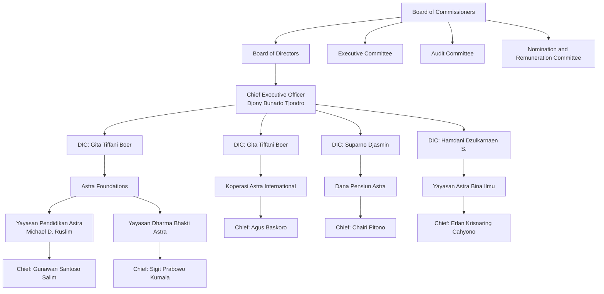

ASTRA logo Satu Indonesia logo

# MENUJU MASA DEPAN MELALUI PERTUMBUHAN BERKELANJUTAN

Shaping the Future through Sustainable Growth

2023 Laporan Tahunan
Annual Report

PT Astra International Tbk
---
[QR Code]

Silakan memindai Kode QR berikut untuk mengunduh Laporan Tahunan ini
Please scan this QR Code to download this Annual Report

Panduan Umum:
Harap diperhatikan petunjuk dalam membaca laporan ini, 'Perseroan' dan 'Astra' mengacu pada PT Astra International Tbk sebagai perusahaan induk. 'Grup' dan 'Grup Astra' mengacu pada PT Astra International Tbk, anak perusahaan dan perusahaan afiliasinya. Laba bersih mengacu pada laba yang diatribusikan kepada pemilik entitas induk.

General Use of Terms:
For guidance when reading this report, please note the terms the 'Company' and 'Astra' refer to PT Astra International Tbk as the parent company. 'Group' and 'Astra Group' refer to PT Astra International Tbk, its subsidiaries and its affiliates. Net income refers to profit attributable to owners of the parent.

Sangkalan:
Laporan Tahunan ini berisi pernyataan-pernyataan yang beberapa di antaranya dapat dianggap sebagai pandangan masa depan (forward looking statements), yang memiliki prospek risiko dan ketidakpastian dan kenyataan yang terjadi mungkin dapat secara material berbeda dengan apa yang terdapat dalam pernyataan.

Disclaimer:
This Annual Report contains statements, some of which may be considered forward looking statements, which have the prospect of risk and uncertainty and their actual development may be materially different from that which is stated.
---
# MENUJU MASA DEPAN MELALUI PERTUMBUHAN BERKELANJUTAN

Shaping the Future through Sustainable Growth

Mulai tahun 2023, peta jalan yang telah ditetapkan untuk masing-masing lini bisnis Grup Astra telah dilaksanakan dengan mengacu pada optimalisasi bisnis, penciptaan dan penguatan nilai tambah, serta pengembangan ekosistem. Peta jalan tersebut disusun dengan memperhatikan perubahan berbagai elemen eksternal dan perubahan landscape, serta mengintegrasikan Astra 2030 Sustainability Aspirations guna memastikan pertumbuhan berkelanjutan dan relevansi Astra di masa mendatang - menuju visi Astra 2030 sebagai pride of the nation.

Starting in 2023, the roadmap defined for each of Astra Group business lines has been implemented based on the principle of optimizing business, creating and strengthening added value and broadening ecosystems. The roadmaps were formulated by taking into account the changes in various external elements and changes in landscape as well as integrating Astra 2030 Sustainability Aspirations to ensure Astra's continued growth and relevance in the future - towards Astra's 2030 vision to be the pride of the nation.

Laporan Tahunan 2023 Annual Report
---
# Daftar Isi
Contents

## 01 Ikhtisar
Highlights

- 01 Tema | Theme
- 04 Kesinambungan Tema
Themes Continuity
- 06 Kerangka Keberlanjutan Astra & Astra 2030 Sustainability Aspirations
Astra Sustainability Framework & Astra 2030 Sustainability Aspirations

## 24 Laporan Manajemen
Management Reports

- 26 Laporan Dewan Komisaris
Board of Commissioners' Report
- 36 Dewan Komisaris
Board of Commissioners
- 38 Laporan Direksi
Board of Directors' Report
- 58 Direksi
Board of Directors

- 68 Motto, Cita-cita, Filosofi, Visi dan Misi Perseroan
Motto, Aim, Philosophy, Vision and Mission of the Company
- 70 Sekilas Grup Astra
Astra Group at a Glance
- 72 Produk dan Jasa/Segmen Usaha
Products and Services/Business Segments
- 74 Tonggak Sejarah
Milestones
- 88 Profil Dewan Komisaris
Board of Commissioners' Profile
- 93 Profil Direksi
Board of Directors' Profile

## 62 Profil Perusahaan
Company Profile

- 08 Ikhtisar Keuangan
Financial Highlights
- 10 Ikhtisar Saham
Stock Highlights
- 12 Penghargaan dan Sertifikasi
Awards and Certifications
- 16 Peristiwa Penting
Event Highlights

- 60 Tanggung Jawab Laporan Tahunan 2023
Responsibility for Annual Report 2023
- 64 Informasi Perseroan
Company Information
- 67 Akses Informasi
Information Access

- 98 Struktur Organisasi
Organizational Structure
- 101 Profil Komite-Komite
Committees' Profiles
- 104 Struktur Grup Astra
Astra Group Structure
- 106 Anak Perusahaan, Ventura Bersama dan Entitas Asosiasi
Subsidiaries, Joint Ventures and Associates
- 114 Lembaga/Profesi Penunjang Pasar Modal
Capital Market Supporting Institutions/Professionals

2 Laporan Tahunan 2023 Annual Report
---
116
# Sumber Daya Manusia dan Digitalisasi
Human Capital and Digitalization

118 Sumber Daya Manusia
Human Capital
124 Transformasi Digital di Grup Astra
Digital Transformation in Astra Group

141 Tinjauan Bisnis
Business Overview
142 Otomotif | Automotive
148 Grup Mobil
Automobile Group
194 Sepeda Motor Honda
Honda Motorcycles
202 Produsen dan Penjual Komponen Otomotif
Automotive Component Manufacturer and Trader
212 AstraWorld
AstraWorld
218 Jasa Keuangan
Financial Services

134
# Pembahasan dan Analisis Manajemen
Management Discussion and Analysis

136 Tinjauan dan Prospek Ekonomi Makro Indonesia
Indonesia Macroeconomic Review and Outlook
140 Struktur Bisnis
Business Structure

224 Pembiayaan Kendaraan Bermotor
Automotive Financing
242 Pembiayaan Alat Berat
Heavy Equipment Financing
252 Asuransi | Insurance
268 Perbankan | Banking
274 Alat Berat, Pertambangan, Konstruksi dan Energi
Heavy Equipment, Mining, Construction and Energy
306 Agribisnis | Agribusiness
314 Infrastruktur dan Logistik
Infrastructure and Logistics
334 Teknologi Informasi
Information Technology
344 Properti | Property
358 Tinjauan Kinerja Keuangan
Financial Performance Overview

380
# Tata Kelola Perusahaan
Corporate Governance

382 Tata Kelola Perusahaan
Corporate Governance
418 Laporan Komite Audit
Audit Committee Report

456
# Tanggung Jawab Sosial dan Lingkungan Perusahaan
Corporate Social and Environment Responsibility

459
# Laporan Keuangan
Financial Report

461 Laporan Keuangan Konsolidasian 31 Desember 2023 dan 2022
Consolidated Financial Statements 31 December 2023 and 2022

Laporan Tahunan 2023 Annual Report
---
# Kesinambungan Tema

Themes Continuity

## 2019

**Mengelola Tantangan, Menginspirasi Bangsa**
Embracing Challenges, Inspiring the Nation

Perkembangan iklim bisnis pada tahun 2019 memberikan tekanan pada kinerja beberapa lini bisnis Grup Astra. Menghadapi tantangan tersebut, Grup senantiasa membangun keunggulan melalui kapabilitas sumber daya manusia yang profesional dan berintegritas, kemampuan organisasional untuk 'make things happen', serta mempertahankan reputasi sebagai 'partner of choice'. Sementara itu, dalam menghadapi tantangan bagi pertumbuhan ke depan, Grup melakukan pengembangan kompetensi digital secara terencana dan berkesinambungan. Grup berharap berbagai pencapaian maupun langkah strategis yang terekam pada tahun ini maupun pada tahun-tahun mendatang dapat menjadi inspirasi bagi individu dan perusahaan di Indonesia, sekaligus membawa Grup Astra semakin dekat pada aspirasinya menjadi perusahaan kebanggaan bangsa.

Developments in the business environment throughout 2019 put pressure on the performance of several Astra Group's business lines. In the face of these challenges, the Group continues to build excellence through the capabilities of professional human capital with integrity, Organizational ability to 'make things happen' and maintaining the reputation as a 'partner of choice'. At the same time, challenges for future growth were responded by the Group through planned and sustainable development of digital competency. It is Astra Group's hope that the various achievements and strategic steps recorded this year and in the coming years can be an inspiration to individuals and companies in Indonesia, as well as bringing the Group closer to its aspirations of becoming pride of the nation.

## 2020

**Optimisme dalam Beradaptasi dan Berinovasi**
Optimism in Adaptation and Innovation

Tahun 2020, dunia dilanda pandemi COVID-19 dan menimbulkan krisis yang belum pernah terjadi.

Menyikapi situasi yang menantang dengan penuh ketidakpastian ini, Grup Astra dengan cepat merumuskan strategi dan kebijakan penanggulangan pandemi untuk beradaptasi dan berinovasi menghadapi realitas baru, yang selanjutnya diterapkan secara serentak oleh portofolio bisnis Astra. Selain itu, Astra juga senantiasa mendukung Insan Astra, masyarakat dan bangsa Indonesia untuk bersama-sama menghadapi pandemi ini. Tahun 2020 juga memiliki makna penting bagi Grup Astra dalam memetakan perjalanan berikutnya menjadi "Pride of the Nation" menuju Goal 2030 untuk menjadi salah satu perusahaan yang membanggakan bagi Indonesia di mata dunia dalam semua aktivitasnya. Dengan fondasi bisnis yang kuat, yang telah dibangun selama ini melalui ketahanan, kekuatan, kemampuan beradaptasi dan kegigihan, Grup Astra menyongsong masa depan dengan senantiasa berusaha yang terbaik dan optimis dalam mewujudkan bisnis yang solid dan berkelanjutan.

In 2020, the world was hit by the COVID-19 pandemic, which precipitated a crisis that has no precedent.

Responding to this challenging and uncertain situation, Astra Group formulated pandemic response strategies and policies to adapt and innovate to the new realities, which were implemented simultaneously across all Astra Group's business portfolios. In addition, Astra also continued to support its employees, the surrounding community and the nation in facing the pandemic. 2020 also marked a milestone for Astra Group in charting the next stage of its "Pride of the Nation" journey towards the Goal 2030 to become one of the companies that make Indonesia proud in the eyes of the world in all its activities. Having built a robust business foundation over the years with resilience, energy, adaptability and persistence, Astra Group continues to leverage its optimism and best efforts to realize a solid and sustainable business.

## 2021

**Tangguh Menggapai Peluang di Tengah Tantangan**
Resilient to Pursue Opportunities in Challenging Times

Pandemi masih berlangsung pada tahun 2021 yang berdampak pada seluruh kehidupan masyarakat. Namun demikian, Grup Astra optimis dan bertekad untuk tetap teguh berkontribusi, mendukung pertumbuhan perekonomian domestik, melayani pelanggan dan menanggulangi dampak pandemi di tanah air. Didukung oleh semangat digitalisasi, jajaran perusahaan Grup Astra meningkatkan efisiensi dan keunggulan operasional pada bisnis dengan tetap menerapkan manajemen keuangan yang disiplin dan hati-hati, serta pelatihan untuk membangun Insan Astra yang inovatif dan berjiwa pemimpin. Keseluruhan penerapan inisiatif ini diyakini dapat membentuk daya tahan terbaik bagi Grup Astra.

Di tengah berbagai tantangan, Grup Astra terus memanfaatkan berbagai peluang pengembangan arus pendapatan baru yang menunjang pertumbuhan berkelanjutan, selain juga mendukung kemajuan ekonomi digital di Indonesia. Transisi Grup Astra pada tahun 2021 juga selaras dengan isu keberlanjutan, yang semakin menjadi perhatian dunia, dengan memperkuat integrasi lingkungan dalam menjalankan strategi Triple-P Roadmap yang meliputi aspek portofolio bisnis, sumber daya manusia dan kontribusi sosial.

The pandemic still continued in 2021, affecting all aspects of life. Nonetheless, Astra Group remained optimistic and determined to be resilient in making contributions to support growth of the domestic economy, serve customers and overcome the impacts of the pandemic across the nation. With the spirit of digitalization, Astra Group companies enhanced efficiency and operational excellence in the business, with consistent implementation of disciplined and prudent financial management and people development to cultivate innovative Astra people with leadership capabilities. All these initiatives are implemented to reinforce strong organizational resilience for Astra Group.

In the midst of various challenges, Astra Group continued to seek opportunities to generate new revenue streams and promote sustainable growth, as well participate in progressing Indonesia's digital economy. In line with the world's growing concern over sustainability, as part of its transition journey, in 2021 Astra Group strengthened the integration of environment aspect into its Triple-P Roadmap strategy, covering the business portfolio, human capital and social contributions.
---
Pembahasan dan Analisis Manajemen | Tata Kelola Perusahaan | Tanggung Jawab Sosial dan Lingkungan Perusahaan | Laporan Keuangan Konsolidasian 2023
Management Discussion and Analysis | Corporate Governance | Corporate Social and Environmental Responsibility | Consolidated Financial Statements 2023

# 2022

## Mempercepat Transisi, Perkuat Aksi & Perluas Dampak
Accelerating Transition, Strengthening Action & Widening Impact

Dalam evolusi perjalanan 65 tahunnya, Grup Astra memasuki tahun 2022 dengan pendekatan dan sikap yang optimis namun tetap waspada. Dengan penerapan nilai-nilai Catur Dharma secara konsisten dan tata kelola perusahaan yang baik, Astra tetap optimis dalam mencermati tantangan dan menghadapinya sebagai peluang untuk terus bertumbuh dan berkembang dengan lebih baik.

Di tengah situasi pandemi COVID 19, perkembangan disrupsi teknologi dan bisnis model serta tekanan geopolitik, Grup memutuskan untuk meningkatkan perjalanan keberlanjutannya dengan menetapkan Astra 2030 Sustainability Aspirations, yang memuat aspirasi dan target terukur yang ingin dicapai Astra pada tahun 2030 di pilar portfolio, people dan public contribution.

Astra ingin menjadi bisnis yang lebih sustainable dan resilient, yang dapat berkontribusi dalam memperkuat ekonomi Indonesia serta mendukung masyarakat yang sejahtera dan inklusif.

In the 65 years of its evolution journey, Astra Group entered 2022 with an optimistic yet vigilant mindset and attitude. With consistent implementation of Catur Dharma values and good corporate governance, Astra remained optimistic in observing challenges and facing them as opportunities to continue growing.

In the midst of the COVID 19 pandemic, increasing technological and business models disruptions as well as geopolitical pressures, the Group decided to advance its sustainability journey with the launch of Astra 2030 Sustainability Aspirations, which sets out aspirations and measurable targets that Astra wants to achieve by 2030 in the portfolio, people and public contribution pillars.

Astra wishes to become a more sustainable and resilient business that contributes to the strength of the Indonesian economy and supports a prosperous and inclusive society.

# 2023

## Menuju Masa Depan melalui Pertumbuhan Berkelanjutan
Shaping the Future through Sustainable Growth

Mulai tahun 2023, peta jalan yang telah ditetapkan untuk masing-masing lini bisnis Grup Astra telah dilaksanakan dengan mengacu pada optimalisasi bisnis, penciptaan dan penguatan nilai tambah serta pengembangan ekosistem. Peta jalan tersebut disusun dengan memperhatikan perubahan berbagai elemen eksternal dan perubahan landscape serta mengintegrasikan Astra 2030 Sustainability Aspirations guna memastikan pertumbuhan berkelanjutan dan relevansi Astra di masa mendatang - menuju visi Astra 2030 sebagai pride of the nation.

Starting in 2023, the roadmap defined for each of Astra Group business lines has been implemented based on the principle of optimizing business, creating and strengthening added value and broadening ecosystems. The roadmaps were formulated by taking into account the changes in various external elements and changes in landscape as well as integrating Astra 2030 Sustainability Aspirations to ensure Astra's continued growth and relevance in the future - towards Astra's 2030 vision to be the pride of the nation.

Laporan Tahunan 2023 Annual Report
---
# Kerangka Keberlanjutan Astra & Astra 2030 Sustainability Aspirations

Meningkatkan Langkah Perjalanan Keberlanjutan Kami

Astra Sustainability Framework & Astra 2030 Sustainability Aspirations
Advancing our Sustainability Journey

## Strategi Triple-P Roadmap Astra: Kerangka Keberlanjutan
Astra's Triple-P Roadmap Strategy: Sustainability Framework

### Tujuan
Sejahtera Bersama Bangsa
(Prosper with the Nation)

### Visi
Menjadi salah satu perusahaan dengan pengelolaan terbaik di Asia Pasifik dengan pertumbuhan yang berkelanjutan dan struktur keuangan yang solid
(To be one of the best managed corporations in Asia Pacific with sustainable growth and solid financial structure)

### Strategi Triple-P

| Portfolio                                                                                                                                                                                                                                                                                                                                                                                                                                                                                         | People                                                                                                                                                                                                                                                                                                                                                                                                                                                                                                                                | Public Contribution                                                                                                                                                                                                                                                                                                   |
| ------------------------------------------------------------------------------------------------------------------------------------------------------------------------------------------------------------------------------------------------------------------------------------------------------------------------------------------------------------------------------------------------------------------------------------------------------------------------------------------------- | ------------------------------------------------------------------------------------------------------------------------------------------------------------------------------------------------------------------------------------------------------------------------------------------------------------------------------------------------------------------------------------------------------------------------------------------------------------------------------------------------------------------------------------- | --------------------------------------------------------------------------------------------------------------------------------------------------------------------------------------------------------------------------------------------------------------------------------------------------------------------- |
| **Berkelanjutan & Tangguh**<br/>(Sustainable & Resilience)<br/><br/>**Komitmen Keberlanjutan**<br/>(Sustainability Commitments)<br/><br/>Kami bertransisi menuju perusahaan yang lebih sustainable dan resilient guna memberikan dampak positif kepada bumi dan iklimnya, bisnis kami, serta masyarakat.<br/><br/>(We are transitioning to become a more sustainable and resilient business that has a positive impact on the planet and its climate, our business and the communities we serve.) | **Beragam & Inklusif**<br/>(Diverse & Inclusive)<br/><br/>**Komitmen Keberlanjutan**<br/>(Sustainability Commitments)<br/><br/>Kami berkomitmen mewujudkan lingkungan kerja yang beragam dan inklusif, menarik serta mempertahankan talenta-talenta terbaik Indonesia agar Insan Astra dapat berkembang, berhasil dan sejahtera bersama bangsa.<br/><br/>(We remain committed to a diverse and inclusive workplace to attract & retain Indonesia's best talent, enabling our people to develop, succeed and prosper with the nation.) | **Memberdayakan Masyarakat**<br/>(Empowering Communities)<br/><br/>**Komitmen Keberlanjutan**<br/>(Sustainability Commitments)<br/><br/>Kami memberdayakan dan mendukung masyarakat demi masa depan yang lebih baik untuk semua.<br/><br/>(We are empowering and supporting communities for a better future for all.) |

### Key Enabler
Tata Kelola Perusahaan yang Baik
(Good Corporate Governance)

### Landasan Utama
Catur Dharma
(Core Foundation)

6 Laporan Tahunan 2023 Annual Report
---
# Astra 2030 Sustainability Aspirations

## Strategi Triple-P Roadmap

### Portfolio

#### Penurunan Emisi Gas Rumah Kaca
- Menurunkan emisi gas rumah kaca Grup Astra scope 1 dan 2 sebesar 30%.

#### Pengelolaan Air & Air Limbah
- Mengurangi intensitas pengambilan air Grup Astra sebesar 15%.

#### Ketahanan Model Bisnis
- Meningkatkan business resilience dengan meningkatkan pendapatan non-batu bara hingga 88%.

#### Pengelolaan Energi
- 50% bauran energi terbarukan untuk mendukung kegiatan operasional.

#### Pengelolaan Limbah Padat
- Mencapai hingga 99% daur ulang dan recovery limbah padat.

### People

#### Keberagaman & Inklusivitas Karyawan
- Mendukung keberagaman dan inklusivitas karyawan, dengan fokus pada gender.

#### Keselamatan & Kesehatan Kerja
- Mencapai zero fatality tenaga kerja dan pengurangan 60% tingkat lost-time injury Grup Astra.

#### Keberagaman & Inklusivitas Manajemen
- Mendukung keberagaman dan inklusivitas di level eksekutif, Direksi, Dewan Komisaris, dengan fokus pada gender.

### Public Contribution

#### Pengembangan Masyarakat
- Menjangkau 2,5 juta penerima manfaat melalui program pengembangan masyarakat.

## Key Enabler

### Tata Kelola Perusahaan yang Baik
Terus memperkuat tata kelola perusahaan kami dengan standar internasional.

Laporan Tahunan 2023 Annual Report
---
# Ikhtisar Keuangan

Financial Highlights

Angka-angka pada seluruh tabel dan grafik dinyatakan dalam miliaran Rupiah dan menggunakan notasi bahasa Inggris kecuali disebutkan lain.

Numerical notation in all tables and graphs are stated in billions of Rupiah and in English notation, unless stated otherwise.

|                                                               | 2023    | 2022    | 2021    | 2020    | 2019    |                                                                |
| ------------------------------------------------------------- | ------- | ------- | ------- | ------- | ------- | -------------------------------------------------------------- |
| **Laporan Laba Rugi dan Penghasilan Komprehensif Lain**       |         |         |         |         |         | **Statement of Profit or Loss and Other Comprehensive Income** |
| Pendapatan Bersih                                             | 316,565 | 301,379 | 233,485 | 175,046 | 237,166 | Net Revenue                                                    |
| Laba Bruto                                                    | 73,310  | 70,088  | 51,033  | 38,778  | 50,239  | Gross Profit                                                   |
| Laba Tahun Berjalan                                           | 44,501  | 40,420  | 25,586  | 18,571  | 26,621  | Profit for the Year                                            |
| Laba yang Diatribusikan kepada:                               |         |         |         |         |         | Profit Attributable to:                                        |
| - Pemilik Entitas Induk                                       | 33,839  | 28,944  | 20,196  | 16,164  | 21,707  | Owners of the Parent -                                         |
| - Kepentingan Non-pengendali                                  | 10,662  | 11,476  | 5,390   | 2,407   | 4,914   | Non-controlling Interests -                                    |
| Penghasilan Komprehensif Tahun Berjalan                       | 43,672  | 45,945  | 27,781  | 17,491  | 23,279  | Comprehensive Income for the Year                              |
| Penghasilan Komprehensif yang Diatribusikan kepada:           |         |         |         |         |         | Comprehensive Income Attributable to:                          |
| - Pemilik Entitas Induk                                       | 33,418  | 32,191  | 21,755  | 15,222  | 19,464  | Owners of the Parent -                                         |
| - Kepentingan Non-pengendali                                  | 10,254  | 13,754  | 6,026   | 2,269   | 3,815   | Non-controlling Interests -                                    |
| **Posisi Keuangan (Neraca)**                                  |         |         |         |         |         | **Financial Position (Balance Sheets)**                        |
| Jumlah Aset                                                   | 445,679 | 413,297 | 367,311 | 338,203 | 351,958 | Total Assets                                                   |
| Aset Lancar                                                   | 166,186 | 179,818 | 160,262 | 132,308 | 129,058 | Current Assets                                                 |
| Aset Tidak Lancar                                             | 279,493 | 233,479 | 207,049 | 205,895 | 222,900 | Non-Current Assets                                             |
| Investasi pada Ventura Bersama dan Entitas Asosiasi           | 61,348  | 46,725  | 37,794  | 33,483  | 45,683  | Investments in Joint Ventures and Associates                   |
| Jumlah Liabilitas                                             | 195,261 | 169,577 | 151,696 | 142,749 | 165,195 | Total Liabilities                                              |
| Liabilitas Jangka Pendek                                      | 125,022 | 119,198 | 103,778 | 85,736  | 99,962  | Current Liabilities                                            |
| Liabilitas Jangka Panjang                                     | 70,239  | 50,379  | 47,918  | 57,013  | 65,233  | Non-Current Liabilities                                        |
| Jumlah Pinjaman                                               | 93,310  | 70,721  | 72,486  | 79,481  | 92,301  | Total Borrowings                                               |
| Jumlah Ekuitas                                                | 250,418 | 243,720 | 215,615 | 195,454 | 186,763 | Total Equity                                                   |
| Ekuitas yang Dapat Diatribusikan kepada Pemilik Entitas Induk | 198,640 | 192,142 | 172,053 | 155,662 | 147,847 | Equity Attributable to Owners of the Parent                    |
| **Analisa Rasio dan Informasi Lain**                          |         |         |         |         |         | **Ratio Analysis and Other Information**                       |
| Modal Kerja Bersih1                                           | 32,975  | 28,407  | 22,081  | 22,249  | 27,633  | 1Net Working Capital                                           |
| Laba Bersih terhadap Aset2                                    | 10%     | 10%     | 7%      | 5%      | 8%      | 2Return on Assets                                              |
| Laba Bersih terhadap Ekuitas3                                 | 18%     | 17%     | 12%     | 10%     | 14%     | 3Return on Equity                                              |
| Marjin Laba Bruto                                             | 23%     | 23%     | 22%     | 22%     | 21%     | Gross Profit Margin                                            |
| Marjin Laba Bersih                                            | 14%     | 13%     | 11%     | 11%     | 11%     | Net Income Margin                                              |
| Rasio Lancar (x)                                              | 1.3     | 1.5     | 1.5     | 1.5     | 1.3     | Current Ratio (x)                                              |
| Rasio Liabilitas terhadap Jumlah Aset (x)                     | 0.4     | 0.4     | 0.4     | 0.4     | 0.5     | Liabilities to Total Assets Ratio (x)                          |
| Rasio Liabilitas terhadap Jumlah Ekuitas (x)                  | 0.8     | 0.7     | 0.7     | 0.7     | 0.9     | Liabilities to Total Equity Ratio (x)                          |
| Saham Beredar (dalam Jutaan)                                  | 40,484  | 40,484  | 40,484  | 40,484  | 40,484  | Issued Shares (in millions)                                    |
| Laba per Saham (Rp)4                                          | 836     | 715     | 499     | 399     | 536     | 4Earnings per Share (Rp)                                       |
| Nilai Aset Bersih per Saham (Rp)                              | 4,907   | 4,746   | 4,250   | 3,845   | 3,652   | Net Asset Value per Share (Rp)                                 |
| Dividen Interim per Saham (Rp)                                | 98      | 88      | 45      | 27      | 57      | Interim Dividend per Share (Rp)                                |
| Dividen Final per Saham (Rp)                                  | 4215    | 552     | 194     | 87      | 157     | Final Dividend per Share (Rp)                                  |
| Rasio Utang Bersih terhadap Ekuitas6                          | N/A7    | N/A7    | N/A7    | N/A7    | 11.9%   | 6Net Debt to Equity Ratio                                      |

1. Piutang Usaha + Persediaan - Utang Usaha
2. Laba tahun berjalan/Jumlah Aset
3. Laba tahun berjalan/Total Ekuitas
4. Laba yang Diatribusikan kepada Pemilik Entitas Induk/Jumlah Saham Beredar
5. Tergantung persetujuan pemegang saham pada Rapat Umum Tahunan bulan April 2024
6. Utang Bersih tidak termasuk Jasa Keuangan/Total Ekuitas
7. N/A karena posisi kas bersih

1. Trade Receivables + Inventories - Trade Payables.
2. Profit for the year/Total Assets
3. Profit for the year/Total Equity
4. Profit Attributable to Owners of the Parent/Number of Outstanding Shares
5. Subject to the approval of shareholders at Annual General Meeting in April 2024
6. Net Debt excludes Financial Services divided by Total Equity
7. N/A due to net cash position
---
| Analisis dan Pembahasan Manajemen
Management Discussion and Analysis | Tata Kelola Perusahaan
Corporate Governance | Tanggung Jawab Sosial dan Lingkungan Perusahaan
Corporate Social and Environment Responsibility | Laporan Keuangan Konsolidasian 2023
Consolidated Financial Statements 2023 | ASTRA | | | | |
|---|---|---|---|---|

## Pendapatan Bersih
Net Revenue
dalam miliar Rupiah | in billions Rupiah

| 2019    | 2020    | 2021    | 2022    | 2023    |
| ------- | ------- | ------- | ------- | ------- |
| 237,166 | 175,046 | 233,485 | 301,379 | 316,565 |

## Laba yang Diatribusikan kepada Pemilik Entitas Induk
Profit Attributable to Owners of the Parent
dalam miliar Rupiah | in billions Rupiah

| 2019   | 2020   | 2021   | 2022   | 2023   |
| ------ | ------ | ------ | ------ | ------ |
| 21,707 | 16,164 | 20,196 | 28,944 | 33,839 |

## Jumlah Aset
Total Assets
dalam miliar Rupiah | in billions Rupiah

| 2019    | 2020    | 2021    | 2022    | 2023    |
| ------- | ------- | ------- | ------- | ------- |
| 351,958 | 338,203 | 367,311 | 413,297 | 445,679 |

## Jumlah Ekuitas
Total Equity
dalam miliar Rupiah | in billions Rupiah

| 2019    | 2020    | 2021    | 2022    | 2023    |
| ------- | ------- | ------- | ------- | ------- |
| 186,763 | 195,454 | 215,615 | 243,720 | 250,418 |

## Laba per Saham
Earnings per Share
dalam Rupiah | in Rupiah

| 2019 | 2020 | 2021 | 2022 | 2023 |
| ---- | ---- | ---- | ---- | ---- |
| 536  | 399  | 499  | 715  | 836  |

## Dividen per Saham
Dividend per Share
dalam Rupiah | in Rupiah

| 2019       | 2020       | 2021       | 2022       | 2023                    |
| ---------- | ---------- | ---------- | ---------- | ----------------------- |
| 214<br/>57 | 114<br/>27 | 239<br/>45 | 640<br/>88 | 519\*<br/>98            |
|            | 87         | 194        | 552        | 421\* Final<br/>Interim |

\* Jika disetujui Pemegang Saham pada Rapat Umum Pemegang Saham Tahunan bulan April 2024
Subject to approval of Shareholders at Annual General Meeting of Shareholders in April 2024

Laporan Tahunan 2023 Annual Report

9
---
# Ikhtisar Saham

Stock Highlights

## Pergerakan Harga dan Volume Perdagangan Saham Perseroan (ASII) 2022-2023 di BEI
2022-2023 Company (ASII) Stock Price Movement and Trading Volume at IDX

[Chart showing stock price and trading volume from Jan 2022 to Dec 2023]

jumlah saham | shares                                                                                         dalam Rupiah | in Rupiah

350,000,000                                                                                                                    10,000

300,000,000                                                                                                                    8,750

250,000,000                                                                                                                    7,500

200,000,000                                                                                                                    6,250

150,000,000                                                                                                                    5,000

100,000,000                                                                                                                    3,750

50,000,000                                                                                                                    2,500

0  Jan  Feb Mar Apr May Jun     Jul Aug Sep   Oct Nov Dec      Jan Feb Mar Apr May Jun   Jul Aug Sep  Oct  Nov Dec   1,250

2022                                                     2023
Sumber | Source: Bloomberg                         Harga Penutupan | Closing Price               Volume Perdagangan | Trading Volume

## Harga dan Volume Perdagangan Saham Perseroan (ASII) per Triwulan 2022-2023 di BEI
2022-2023 Quarterly Company (ASII) Stock Price and Trading Volume at IDX

| PeriodePeriod<br/>2022        | Harga TerendahLowest Price(Rupiah)<br/>2023 | Harga TerendahLowest Price(Rupiah)<br/>2022 | Harga TertinggiHighest Price(Rupiah)<br/>2023 | Harga TertinggiHighest Price(Rupiah)<br/>2022 | Harga PenutupanClosing Price(Rupiah)<br/>2023 | Harga PenutupanClosing Price(Rupiah)<br/>2022 | Rata-Rata VolumePerdagangan HarianAverage Daily TradingVolume(saham \| shares)<br/>2023 | Rata-Rata VolumePerdagangan HarianAverage Daily TradingVolume(saham \| shares)<br/>2022 | Kapitalisasi PasarMarket Capitalization(juta \| million Rupiah)<br/>2023 | Kapitalisasi PasarMarket Capitalization(juta \| million Rupiah) |
| ----------------------------- | ------------------------------------------- | ------------------------------------------- | --------------------------------------------- | --------------------------------------------- | --------------------------------------------- | --------------------------------------------- | --------------------------------------------------------------------------------------- | --------------------------------------------------------------------------------------- | ------------------------------------------------------------------------ | --------------------------------------------------------------- |---|---|---|---|
| Triwulan Ke-1<br/>1ˢᵗ Quarter | 5,300                                       | 5,225                                       | 6,700                                         | 6,150                                         | 6,575                                         | 6,000                                         | 50,876,030                                                                              | 41,979,332                                                                              | 266,179,357                                                              | 242,901,319                                                     | | | | |
| Triwulan Ke-2<br/>2ⁿᵈ Quarter | 6,500                                       | 5,925                                       | 7,575                                         | 6,925                                         | 6,625                                         | 6,775                                         | 49,012,556                                                                              | 55,029,429                                                                              | 268,203,545                                                              | 274,276,073                                                     | | | | |
| Triwulan Ke-3<br/>3ʳᵈ Quarter | 5,825                                       | 6,150                                       | 7,200                                         | 6,875                                         | 6,625                                         | 6,225                                         | 46,775,452                                                                              | 37,078,166                                                                              | 268,203,545                                                              | 252,010,118                                                     | | | | |
| Triwulan Ke-4<br/>4ᵗʰ Quarter | 5,625                                       | 5,400                                       | 6,725                                         | 6,275                                         | 5,700                                         | 5,650                                         | 47,706,972                                                                              | 48,178,860                                                                              | 230,756,245                                                              | 228,732,075                                                     | | | | |

10                                                                                              Laporan Tahunan 2023 Annual Report
---
# Kronologis Pencatatan Saham
Stock Listing Chronology

| TahunYear | Kebijakan/Aksi KorporasiCorporate Actions/Policy                                                                                                                                                                                                                                                                                                                                                                                                                                                                                                                                                                                                                                                                                                                                                                                                                                                                                                                                                                                                                                                                  |
| --------- | ----------------------------------------------------------------------------------------------------------------------------------------------------------------------------------------------------------------------------------------------------------------------------------------------------------------------------------------------------------------------------------------------------------------------------------------------------------------------------------------------------------------------------------------------------------------------------------------------------------------------------------------------------------------------------------------------------------------------------------------------------------------------------------------------------------------------------------------------------------------------------------------------------------------------------------------------------------------------------------------------------------------------------------------------------------------------------------------------------------------- |
| 1990      | Penawaran Umum Perdana 30 juta saham, dengan nilai nominal Rp1.000 (dalam satuan Rupiah) per saham, harga penawaran Rp14.850 (dalam satuan Rupiah) per saham.<br/>Initial Public Offering of 30 million shares, with a par value of Rp1,000 (full Rupiah) per share, offering price of Rp14,850 (full Rupiah) per share.                                                                                                                                                                                                                                                                                                                                                                                                                                                                                                                                                                                                                                                                                                                                                                                          |
| 1994      | Penawaran Umum Terbatas dengan Hak Memesan Efek Terlebih Dahulu atas 48.439.600 saham dengan harga Rp13.850 (dalam satuan Rupiah) per saham.<br/>Limited Public Offering with pre-emptive rights of 48,439,600 shares at the price of Rp13,850 (full Rupiah) per share.<br/><br/>Pembagian saham bonus yang berasal dari kapitalisasi tambahan modal disetor sejumlah Rp872 miliar atau setara dengan 871.912.800 saham.<br/>Distribution of bonus shares from the capitalization of additional paid-in capital amounting to Rp872 billion, equivalent to 871,912,800 shares.                                                                                                                                                                                                                                                                                                                                                                                                                                                                                                                                     |
| 1997      | Konversi obligasi menjadi 280.837 saham yang dilakukan oleh sebagian pemegang obligasi konversi.<br/>Conversion of bonds into 280,837 shares by certain convertible bondholders.<br/><br/>Pemecahan nilai nominal saham dari Rp1.000 (dalam satuan Rupiah) per saham menjadi Rp500 (dalam satuan Rupiah) per saham, yang mengakibatkan kenaikan jumlah saham yang beredar menjadi 2.325.662.474.<br/>A change in the par value from Rp1,000 (full Rupiah) per share to Rp500 (full Rupiah) per share, increasing the number of shares issued to 2,325,662,474.                                                                                                                                                                                                                                                                                                                                                                                                                                                                                                                                                    |
| 1999      | Penerbitan 258.398.155 rights kepada para kreditur dan pemegang obligasi sehubungan dengan restrukturisasi utang, satu right berhak untuk membeli satu saham Perseroan dengan harga Rp500 (dalam satuan Rupiah) per saham. Sejumlah 253.158.665 saham telah diterbitkan sehubungan dengan pelaksanaan rights ini.<br/>The issuance of 258,398,155 rights to creditors and bondholders in relation to debt restructuring, thus the owner of one right is entitled to purchase one share of the Company at the price of Rp500 (full Rupiah) per share. A total of 253,158,665 shares were issued as a result of the rights exercised.<br/><br/>Persetujuan atas kompensasi berbasis saham bagi karyawan dan eksekutif Perseroan sampai dengan 70 juta saham. Pada tanggal jatuh tempo, sejumlah 64.754.000 saham telah diterbitkan sehubungan dengan eksekusi opsi saham karyawan tersebut.<br/>Approval for stock-based compensation for the Company's employees and executives up to 70 million shares. As at the expiry date, 64,754,000 shares had been issued as a result of employee stock options exercised. |
| 2002      | Penawaran Umum Terbatas dengan Hak Memesan Efek Terlebih Dahulu, 1.404.780.175 saham dengan harga Rp1.000 (dalam satuan Rupiah) per saham.<br/>Limited Public Offering in respect of a rights issue with pre-emptive rights, 1,404,780,175 shares at the price of Rp1,000 (full Rupiah) per share.                                                                                                                                                                                                                                                                                                                                                                                                                                                                                                                                                                                                                                                                                                                                                                                                                |
| 2012      | Pemecahan nilai nominal saham dari Rp500 (dalam satuan Rupiah) menjadi Rp50 (dalam satuan Rupiah) per saham, yang mengubah jumlah saham beredar dari 4.048.355.314 saham menjadi 40.483.553.140 saham.<br/>A change in the par value from Rp500 (full Rupiah) to Rp50 (full Rupiah) per share, changing the number of issued shares from 4,048,355,314 shares to 40,483,553,140 shares.                                                                                                                                                                                                                                                                                                                                                                                                                                                                                                                                                                                                                                                                                                                           |

## Aksi Korporasi
Corporate Actions

Perseroan tidak melakukan aksi korporasi terkait saham Perseroan pada tahun 2023.

The Company did not undertake any corporate actions related to its shares in 2023.

## Suspensi atau Delisting
Suspension or Delisting

Selama tahun buku 2023, tidak ada suspensi atau delisting dari Bursa Efek Indonesia terhadap perdagangan saham Astra.

Throughout the 2023 financial year, no delisting or suspension was imposed on the stock trading of Astra by the Indonesia Stock Exchange.
---
# Penghargaan dan Sertifikasi

Awards and Certifications

## Penghargaan
Awards

| No. | Pemberi PenghargaanAppreciator                                       | Nama PenghargaanAward                                                                                                                                                                                                                                                                                                                                       | BulanMonth          | | | | |
| --- | -------------------------------------------------------------------- | ----------------------------------------------------------------------------------------------------------------------------------------------------------------------------------------------------------------------------------------------------------------------------------------------------------------------------------------------------------- | ------------------- |---|---|---|---|
| 1   | Majalah MIX Marcomm                                                  | - Ekosistem Keberlanjutan Terbaik<br/>Best Sustainability Ecosystem<br/>- Cause Promotion (Program #SemangatSalingBantu)<br/>Cause Promotion (#SemangatSalingBantu Program)<br/>- Tim Pejuang Keberlanjutan (Yayasan Pendidikan Astra Michael D. Ruslim)<br/>Sustainability Warrior Team (Yayasan Pendidikan Astra Michael D. Ruslim)                       | Januari<br/>January | | | | |
| 2   | PR Indonesia                                                         | - Astramagz \| Sub Media Milik EMagazine (Pemenang Perak)<br/>Astramagz \| Owned Media Sub EMagazine (Silver Winner)<br/>- SATU Indonesia Awards \| Sub Program PR Korporat (Pemenang Perak)<br/>SATU Indonesia Awards \| Program PR Sub Corporate PR (Silver Winner)                                                                                       | Maret<br/>March     |
| 3   | First Indonesia                                                      | - Kepemimpinan Terbaik Fokus pada Program CSR<br/>The Best Leadership Focus on CSR Program<br/>- Program Keunggulan Lingkungan Terbaik<br/>Best Environmental Excellence Program<br/>- Program CSR Global Terbaik<br/>Best CSR Global Program<br/>- Program Terbaik Kategori Pendidikan dan Beasiswa<br/>Best Program in Education and Scholarship Category | Maret<br/>March     | | | | |
| 4   | Foundation for International Human Rights Reporting Standards Awards | Penghargaan dari Foundation for International Human Rights Reporting Standards (Peringkat A+)<br/>Foundation for International Human Rights Reporting Standards Awards (Rank A+)                                                                                                                                                                            | Maret<br/>March     | | | | |
| 5   | Asia Sustainability Reporting Award (ASRA)                           | Pemberian penghargaan Asia Sustainability Reporting Award (ASRA) sebagai Finalis<br/>Awarding Asia Sustainability Reporting Award (ASRA) as a Finalist                                                                                                                                                                                                      | Maret<br/>March     | | | | |
| 6   | Business Media International (BMI) & HR Asia                         | - HR Asia Perusahaan Terbaik untuk Bekerja di Asia 2023 (6 tahun berturut-turut)<br/>HR Asia Best Company to Work For in Asia 2023 (6ᵗʰ consecutive years)<br/>- Penghargaan Kategori Transformasi Digital HR Asia 2023<br/>HR Asia Digital Transformation Category Awards 2023                                                                             | Juni<br/>June       | | | | |
| 7   | Kementerian Sosial RI                                                | Padmamitra Awards 2023 Kategori Kewirausahaan<br/>Padmamitra Awards 2023 Entrepreneurship Category                                                                                                                                                                                                                                                          | Juli<br/>July       | | | | |
| 8   | La Tofi School of Social Responsibility                              | - Penanganan Perubahan Iklim: Astra Sustainability Journey<br/>Handling Climate Change: Astra Sustainability Journey<br/>- Penanganan Perubahan Iklim: Astra Untuk Indonesia Hijau<br/>Handling Climate Change: Astra Untuk Indonesia Hijau                                                                                                                 | Juli<br/>July       | | | | |
| 9   | Reuters Events                                                       | Responsible Business Awards (UK), 1 kategori sebagai finalis: Pelopor SDGs<br/>Responsible Business Awards (UK), 1 category as finalist: SDGs Pioneer                                                                                                                                                                                                       | Juli<br/>July       | | | | |
| 10  | Humas Indonesia                                                      | DEI & ESG Awards (IDEAS) 2023: Sektor Lingkungan \| Astra Sustainability Communication Silver Award<br/>DEI & ESG Awards (IDEAS) 2023: Environmental Sector \| Astra Sustainability Communication Silver Award                                                                                                                                              | Agustus<br/>August  | | |
| 11  | TOP Business                                                         | - TOP CSR 2023 #Bintang-5<br/>TOP CSR 2023 #5 Stars<br/>- TOP Leader dalam Komitmen CSR<br/>TOP Leader on CSR Commitment                                                                                                                                                                                                                                    | Agustus<br/>August  | | | | |

---
| No. | Pemberi PenghargaanAppreciator                       | Nama PenghargaanAward                                                                                                                                                                                                                                                                                                                                                                                                                                                                                                                                                                                                                                                                                                                                                                                                                                                                                                                                                                                                                                                                                                                                                                                                                                                                           | BulanMonth         |
| --- | ---------------------------------------------------- | ----------------------------------------------------------------------------------------------------------------------------------------------------------------------------------------------------------------------------------------------------------------------------------------------------------------------------------------------------------------------------------------------------------------------------------------------------------------------------------------------------------------------------------------------------------------------------------------------------------------------------------------------------------------------------------------------------------------------------------------------------------------------------------------------------------------------------------------------------------------------------------------------------------------------------------------------------------------------------------------------------------------------------------------------------------------------------------------------------------------------------------------------------------------------------------------------------------------------------------------------------------------------------------------------- | ------------------ |
| 12  | Forum Perusahaan untuk Pengembangan Komunitas (CFCD) | - Penghargaan CSR terbaik di Indonesia<br/>The best of Indonesia CSR Awards<br/>- Penghargaan CSR terbaik dari yang terbaik<br/>The best of the best CSR Awards                                                                                                                                                                                                                                                                                                                                                                                                                                                                                                                                                                                                                                                                                                                                                                                                                                                                                                                                                                                                                                                                                                                                 | Agustus<br/>August |
| 13  | The Pinnacle Group International                     | 15ᵗʰ Annual Global CSR & ESG Summit and Awards 2023 kategori:<br/>15ᵗʰ Annual Global CSR & ESG Summit and Awards 2023 for category:<br/>- Penghargaan Keunggulan Negara Terbaik (Indonesia) #Platinum<br/>Best Country Excellence Award (Indonesia) #Platinum<br/>- Penghargaan Keunggulan Lingkungan Terbaik #Silver<br/>Best Environmental Excellence Award #Silver                                                                                                                                                                                                                                                                                                                                                                                                                                                                                                                                                                                                                                                                                                                                                                                                                                                                                                                           | Agustus<br/>August |
| 14  | Kementerian Kesehatan RI                             | Penghargaan Mitra Pembangunan dalam Dukungan Integrasi Layanan Primer<br/>Development Partner Award in Primary Care Integration Support                                                                                                                                                                                                                                                                                                                                                                                                                                                                                                                                                                                                                                                                                                                                                                                                                                                                                                                                                                                                                                                                                                                                                         | Agustus<br/>August |
| 15  | Economic Review                                      | Economic Review Indonesia CSR Award VI 2023 dengan tema "Climate Change How to Campaign & Monetize" sebagai The Best of Indonesia CSR Awards VI 2023 kategori Public Company dan The Best of The Best 2023 Juara Umum kategori SDGs Program<br/>Economic Review Indonesia CSR Award VI 2023 with the theme "Climate Change How to Campaign & Monetize" as The Best of Indonesia CSR Awards VI 2023 in the Public Company category and The Best of the Best 2023 General Champion in the SDGs Program category                                                                                                                                                                                                                                                                                                                                                                                                                                                                                                                                                                                                                                                                                                                                                                                   | Agustus<br/>August |
| 16  | Kementerian Pariwisata dan Ekonomi Kreatif RI        | Penganugerahan Desa Wisata 2023<br/>2023 Tourism Village Award<br/>Beberapa desa peraih penghargaan Anugerah Desa Wisata Indonesia (ADWI 2023)<br/>Several villages have won the 2023 Indonesian Tourism Village Award (ADWI 2023)<br/>- Juara Desa Terbaik: Desa Ketapanrame Mojokerto<br/>Best Village Champion: Ketapanrame Village, Mojokerto<br/>- Juara 2 Homestay Terbaik: Desa Hariarapohan Samosir<br/>2ⁿᵈ Place for Best Homestay: Hariarapohan Samosir Village<br/>DSA yang mendapat rekor MURI:<br/>DSA that received a MURI record:<br/>- Botubarani Bone Bolango - Rekor Hiu Paus Terbanyak di Indonesia<br/>Botubarani Bone Bolango - Record for the Most Whale Sharks in Indonesia<br/>- Desa Wisata Tari Rebo Bangka - Pusat Pengolahan Tepung Pati Sagu dengan Varian Terbanyak<br/>Bangka Rebo Dance Tourism Billage - Sago Starch Processing Center with the Largest Variants<br/>- Desa Wisata Iboih Sabang - Populasi Lumba-Lumba Terbanyak<br/>Iboih Sabang Tourism Village - Largest Dolphin Population<br/>- Desa Wisata Duren Trenggalek - Desa Durian Terluas<br/>Duren Trenggalek Tourist Village - The Largest Durian Village<br/>- Desa Wukirsari - Desa Pengrajin Batik Terbanyak<br/>Wukirsari Village - The Village with The Largest Number of Batik Craftsmen | Agustus<br/>August |

Laporan Tahunan 2023 Annual Report
---
# Penghargaan dan Sertifikasi

Awards and Certifications

| No. | Pemberi PenghargaanAppreciator                | Nama PenghargaanAward                                                                                                                                                                                                                                                                                                                                                            | BulanMonth              |
| --- | --------------------------------------------- | -------------------------------------------------------------------------------------------------------------------------------------------------------------------------------------------------------------------------------------------------------------------------------------------------------------------------------------------------------------------------------- | ----------------------- |
| 17  | Konvensi Humas Indonesia, Humas Indonesia     | - Corporate PR Program Tema Nation Branding<br/>Corporate PR Program with Nation Branding Theme<br/>- Internal PR Program Tema Umum<br/>Internal PR Program General Theme<br/>- CSR Tema DEI<br/>CSR DEI Theme                                                                                                                                                                   | September<br/>September |
| 18  | Detik.com                                     | Grup Otomotif Berkomitmen Tinggi terhadap Lingkungan<br/>Automotive Group is Highly Committed to the Environment                                                                                                                                                                                                                                                                 | September<br/>September |
| 19  | The Green Organization                        | Green Apple Awards Kategori Manfaat Perubahan Iklim<br/>Green Apple Awards Climate Change Benefit Category                                                                                                                                                                                                                                                                       | September<br/>September |
| 20  | Asian Technology Excellence Awards 2023       | - Kategori Keunggulan Teknologi Indonesia untuk Perangkat Lunak Perusahaan - Layanan Otomotif<br/>The Indonesia Technology Excellence Award for Enterprise Software - Automotive Services category<br/>- Kategori Indonesia Technology Excellence Award for Mobile - Automotive Services<br/>The Indonesia Technology Excellence Award for Mobile - Automotive Services category | September<br/>September |
| 21  | Investortrust.id                              | The Best Investortrust Companies 2023: Sektor Perindustrian<br/>The Best Investortrust Companies 2023: Industrial Sector                                                                                                                                                                                                                                                         | Oktober<br/>October     |
| 22  | Asosiasi Analis Efek Indonesia                | Certified Securities Analyst (CSA) Awards 2023: Analyst's Favorite in the Industrial Sector<br/>Certified Securities Analyst (CSA) Awards 2023: Analyst's Favorite in the Industrial Sector                                                                                                                                                                                      | Oktober<br/>October     |
| 23  | Forbes                                        | Rank 244ᵗʰ World's Best Employers<br/>Rank 244ᵗʰ World's Best Employers                                                                                                                                                                                                                                                                                                          | Oktober<br/>October     |
| 24  | Kementerian Lingkungan Hidup dan Kehutanan RI | Apresiasi Kalpataru dan Inovasi Proklim Tingkat Provinsi Jawa Tengah Tahun 2023: KBA Rempoah<br/>Appreciation of Kalpataru Innovation and Proklim at Central Java Province Level in 2023: KBA Rempoah                                                                                                                                                                            | Oktober<br/>October     |
| 25  | Corporate Forum for CSR Development (CFCD)    | ISDA: Kategori Tindakan Mitigasi Perubahan Iklim (SDGs 13)<br/>ISDA: Climate Change Mitigation Action Category (SDGs 13)                                                                                                                                                                                                                                                         | Desember<br/>December   |

---
# Sertifikasi
## Certification

| Sertifikasi & AkreditasiCertification & Accreditation                                                             | InstitusiInstitution                                                                                                                    | Masa berlakuPeriod of Validity |
| ----------------------------------------------------------------------------------------------------------------- | --------------------------------------------------------------------------------------------------------------------------------------- | ------------------------------ |
| ISO 14001<br/>Sistem Manajemen Lingkungan<br/>Environmental Management System                                     | - AJA Europe<br/>- BSI<br/>- LRQA<br/>- SAI Global<br/>- SGS<br/>- TUV Rheinland<br/>- URS                                              | 2021-2024                      |
| ISO 45001<br/>Sistem Manajemen Kesehatan dan Keselamatan Kerja<br/>Occupation Health and Safety Management System | - SGS<br/>- TUV SUD<br/>- Sucofindo<br/>- SICS<br/>- BSI<br/>- LRQA<br/>- BVI<br/>- TUV Rheinland<br/>- AJA Europe                      | 2023-2026                      |
| ISO 50001<br/>Sistem Manajemen Energi<br/>Energy Management System                                                | - TUV SUD                                                                                                                               | 2021-2023                      |
| SMK3<br/>Sistem Manajemen Kesehatan dan Keselamatan Kerja<br/>Occupation Health and Safety Management System      | - Kementerian Ketenagakerjaan Republik Indonesia<br/>Ministry of Manpower of the Republic of Indonesia<br/>- Sucofindo<br/>- SAI Global | 2023-2026                      |
| IATF 16949<br/>Sistem Manajemen Mutu Industri Otomotif<br/>Automotive Industry Quality Management System          | - TUV SUD<br/>- BSI<br/>- SGS<br/>- SAI Global                                                                                          | 2023-2026                      |
| ISPO<br/>Perkebunan Kelapa Sawit Berkelanjutan Indonesia<br/>Indonesia Sustainable Palm Oil                       | - Mutuagung Lestari (MAL)<br/>- BVI<br/>- TUV Rheinland<br/>- SGS<br/>- AJA<br/>- BSI<br/>- Mutu Hijau Indonesia<br/>- MISB             | 2023-2028                      |
| ISO 9001<br/>Sistem Manajemen Mutu<br/>Quality Management System                                                  | - BSI<br/>- LRQA<br/>- SGS<br/>- TUV Rheinland<br/>- URS                                                                                | 2023-2026                      |
| ISO 27001<br/>Sistem Manajemen Keamanan Informasi<br/>Information Security Management Systems                     | - BSI                                                                                                                                   | 2020-2026                      |
| ISO 27701<br/>Sistem Manajemen Informasi Privasi<br/>Privacy Information Management System                        | - BSI                                                                                                                                   | 2023-2026                      |

Laporan Tahunan 2023 Annual Report
---
# Peristiwa Penting
Event Highlights

## Februari | February 01

### HUT Ke-66 Astra, Untuk Hari Ini dan Masa Depan Indonesia

Astra merayakan HUT ke-66 dengan mengangkat tema "Astra untuk Hari ini dan Masa Depan Indonesia." Perayaan dihadiri oleh Direksi dan seluruh karyawan dari berbagai wilayah di Indonesia. Salah satu acara dalam perayaan HUT tersebut adalah penyerahan apresiasi Astra Awards, yang merupakan penghargaan tertinggi kepada perusahaan-perusahaan Grup Astra yang mampu menunjukkan kinerja terbaiknya dalam konsep 3W (Winning Concept, Winning System dan Winning Team) sepanjang tahun 2022.

### Astra's 66ᵗʰ Anniversary, for Today and the Future of Indonesia

Astra celebrated its 66ᵗʰ anniversary with the theme "Astra for Today and the Future of Indonesia." The celebration was attended by the Board of Directors and all employees from various regions in Indonesia. The event was followed by the awarding of the Astra Awards, the highest accolade given to Astra Group companies for outstanding performance in terms of the 3W concept (Winning Concept, Winning System and Winning Team) throughout 2022.

## Maret | March 02

### Ekspor Produk Unggulan Desa Sejahtera Astra (DSA)

Astra melepas ekspor produk unggulan Desa Sejahtera Astra (DSA) Wajak Lor, Boyolangu, Tulungagung berupa ikan hias senilai Rp1,8 miliar ke Australia, Inggris dan Jepang (12/3). Sebelumnya, Astra juga melepas ekspor produk unggulan DSA Nias Utara berupa kelapa genjah Nias dan kopra putih edible senilai Rp6,7 miliar ke Tiongkok (8/3).

Hingga akhir tahun 2023, Astra telah mengembangkan 1.060 DSA yang tersebar di seluruh Indonesia dan memiliki nilai valuasi ekspor mencapai Rp87,8 miliar yang disumbangkan dari total 317 DSA. Melalui program DSA, Astra berharap agar produk unggulan DSA dapat menjadi produk kebanggaan Indonesia yang turut berkontribusi terhadap peningkatan nilai ekspor nasional serta mendorong pemulihan dan pertumbuhan ekonomi nasional.

### Export of Desa Sejahtera Astra (DSA) Flagship Products

Astra exported Desa Sejahtera Astra (DSA) flagship products from Wajak Lor, Boyolangu, Tulungagung, consisting of ornamental fish worth Rp1.8 billion to Australia, the United Kingdom and Japan (12/3). Previously, Astra also exported DSA flagship products from North Nias, namely Nias dwarf coconuts and white edible copra worth Rp6.7 billion to China (8/3).

As at end of 2023, Astra has developed 1,060 DSAs spread across Indonesia and has achieved export valuation totalling Rp87.8 billion contributed from a total of 317 DSAs. Through the DSA program, Astra aims for DSA flagship products to become prideful Indonesian products contributing to the national export value enhancement and driving the recovery and growth of the national economy.
---
| Pembahasan dan
Analisis Manajemen
Management Discussion
and Analysis | Tata Kelola Perusahaan
Corporate Governance | Tanggung Jawab Sosial dan
Lingkungan Perusahaan
Corporate Social and
Environmental Responsibility | Laporan Keuangan
Konsolidasian 2023
Consolidated Financial
Statements 2023 | ASTRA | | | | |
|-----------------------------------------------------------------------------|----------------------------------------------|----------------------------------------------------------------------------------------------------------|-----------------------------------------------------------------------------------|-------|

[Two images showing groups of people at business events]

## April | April 03

### Equinix dan Astra Membentuk Usaha Patungan untuk Mendukung Kebutuhan Digital Indonesia

Astra dan Equinix. Inc, perusahaan infrastruktur digital dunia, mendirikan perusahaan patungan dimana kepemilikan Astra sebesar 25%. Kolaborasi yang menggabungkan keahlian infrastruktur digital global Equinix dan pengalaman luas Astra dalam beroperasi di Indonesia ini akan membantu entitas bisnis lokal dan multinasional mengembangkan kemampuan digital mereka dan memanfaatkan teknologi baru dan berkembang, seperti hybrid multicloud, 5G, IoT, AI dan lainnya.

### Equinix and Astra Established a Joint Venture to Support Indonesia's Digital Needs

Astra and Equinix. Inc, the world's digital infrastructure company, established a joint venture company where the Group has a 25% ownership. Combining the global digital infrastructure expertise of Equinix and the extensive experience of Astra in operating in Indonesia, this joint venture will help local businesses and multinationals develop their digital capabilities and capitalize on new and emerging technologies, such as hybrid multicloud, 5G, IoT, AI and more.

## April | April 04

### Pameran Teknologi Industri Dunia Hannover Messe 2023 di Hannover

Astra berkomitmen untuk mendukung keikutsertaan Indonesia dalam ajang pameran teknologi industri dunia Hannover Messe 2023 di Hannover, Jerman pada 17-21 April 2023 yang juga dihadiri oleh Presiden RI Joko Widodo. Tema yang diangkat pada Hannover Messe 2023 adalah "Infinite Journey".

Presiden Komisaris Astra Prijono Sugiarto turut hadir sebagai pembicara dalam salah satu agenda Business Summit, bersama dengan Chairman of the Board of Executive Directors BASF SE, Martin Brudermuller dalam sesi Flashlight on Indonesian-German Business Cooperation.

Adapun anak perusahaan Astra yang bergerak di industri komponen otomotif dan non otomotif, PT Astra Otoparts Tbk kembali berpartisipasi dalam Hannover Messe dengan memamerkan produk-produk 4.0 yang diharapkan tidak hanya meningkatkan nilai ekspor namun juga dapat menarik penanaman modal asing atau foreign investment dengan menunjukkan kapasitas, kompetensi dan kapabilitas manufaktur Astra Otoparts.

### Hannover Messe 2023 World Industrial Technology Exhibition in Hannover

Astra is committed to supporting Indonesia's participation in the Hannover Messe 2023 World Industrial Technology Exhibition in Hannover, Germany, on April 17-21, 2023, which will also be attended by President of the Republic of Indonesia, Joko Widodo. The theme of the Hannover Messe 2023 is "Infinite Journey".

Astra's President Commissioner, Prijono Sugiarto, will be present as a speaker in one of the Business Summit agendas, alongside Martin Brudermuller, Chairman of the Board of Executive Directors of BASF SE, in the Flashlight on Indonesian-German Business Cooperation session.

Astra's subsidiary engaged in automotive and non-automotive component industries, PT Astra Otoparts Tbk, will participate in the Hannover Messe by showcasing Industry 4.0 products. This participation is aimed not only at enhancing export value but also at attracting foreign investment by demonstrating Astra Otoparts' manufacturing capacity, competence and capability.

Laporan Tahunan 2023 Annual Report 17
---
# Peristiwa Penting

Event Highlights

## April | April 05

### Astra Mengadakan RUPST 2023

Astra mengadakan Rapat Umum Pemegang Saham (RUPS) Tahunan 2023, yang antara lain menyetujui laporan tahunan (termasuk mengesahkan laporan keuangan) dan menyetujui pembagian dividen untuk tahun buku 2023.

### Astra Held 2023 AGMS

Astra held the 2023 Annual General Meeting of Shareholders (AGMS), which among others approved the annual report (including ratified the financial statements) and approved the distribution of dividends for the 2023 financial year.

## Mei | May 06

### Astra Meresmikan Kampus Baru ASTRAtech: Politeknik Vokasi Untuk Turut Menciptakan SDM Unggul

Astra, melalui Yayasan Astra Bina Ilmu (YABI), meresmikan kampus baru Politeknik ASTRAtech di Delta Silicon, Cikarang, Jawa Barat. Kampus baru ASTRAtech merupakan salah satu wujud nyata kontribusi Astra bagi Indonesia di bidang pendidikan.

### Astra Inaugurated New Campus of ASTRAtech: A Vocational Polytechnic to Help Create Outstanding Human Resources

Astra, through its Astra Bina Ilmu Foundation (YABI), inaugurated the new campus of ASTRAtech Polytechnic in Delta Silicon, Cikarang, West Java. The new ASTRAtech campus is a concrete manifestation of Astra's contribution to Indonesia in the field of education.

## Juni | June 07

### Astra Apresiasi Pemenang Astranauts 2023, Kompetisi Inovasi Digital dan Teknologi

Astra mengumumkan pemenang kompetisi inovasi dan teknologi digital Astranauts 2023 pada acara Demo Day & Awarding Astranauts 2023. Tema Astranauts 2023 adalah "Building a Sustainable Future through Technology" yang menandakan komitmen Astra dalam mendorong inovasi digital mahasiswa dan startup Indonesia serta mencari solusi tantangan bisnis dan teknologi saat ini.

### Astra honored the Winners of Astranauts 2023, Digital and Technology Innovation Competition

Astra revealed the winners of the digital innovation and technology competition Astranauts 2023 at the Demo Day & Awarding Astranauts 2023 event. The theme for the 2023 Astranauts is "Building a Sustainable Future through Technology", which signifies Astra's commitment to encourage digital innovations by Indonesian students and startups and finding solutions to current business and technology challenges.
---
| Pembahasan dan Analisis Manajemen
Management Discussion and Analysis | Tata Kelola Perusahaan
Corporate Governance | Tanggung Jawab Sosial dan Lingkungan Perusahaan
Corporate Social and Environmental Responsibility | Laporan Keuangan Konsolidasian 2023
Consolidated Financial Statements 2023 | ASTRA | | | | |
|---|---|---|---|---|

## Juli | July

### 08

**Kolaborasi Astra dan PLN Percepat Transisi Energi Baru Terbarukan**

Astra berkolaborasi dengan PLN untuk mempercepat transisi energi bersih melalui pengembangan infrastruktur kendaraan listrik dalam bentuk penyediaan Stasiun Pengisian Kendaraan Listrik Umum (SPKLU) dan pemasangan Pembangkit Listrik Tenaga Surya (PLTS) Atap. Penandatanganan Nota Kesepahaman berlangsung pada acara The 11ᵗʰ Indonesia Energi Baru Terbarukan dan Konservasi Energi (EBTKE) ConEx 2023 di ICE BSD City, Tangerang, Banten.

**Collaboration between Astra and PLN Accelerates New and Renewable Energy Transition**

Astra collaborated with PLN to accelerate the clean energy transition through developing electric vehicle (EV) infrastructure in the form of providing Public Electric Vehicle Charging Stations (SPKLU) and installing Rooftop Solar Power Plants (PLTS). The signing of a Memorandum of Understanding (MoU) was conducted at the 11ᵗʰ Indonesia Renewable Energy and Energy Conservation (EBTKE) ConEx 2023 event at ICE BSD City, Tangerang, Banten.

### 09

**Astra Meningkatkan Investasinya di Halodoc**

Astra melalui anak usahanya, PT Astra Digital Internasional, menambah investasi pada platform ekosistem kesehatan digital, Halodoc. Melalui pendanaan seri D ini, Halodoc mendapatkan total dana investasi sebesar USD100 juta. Astra memimpin partisipasi dalam pendanaan tersebut, sehingga total investasi Astra setelah pendanaan seri D ini mencapai USD135 juta. Sinergi antara Astra dan Halodoc diharapkan dapat memberikan dampak positif terhadap industri kesehatan serta pertumbuhan ekonomi digital tanah air. Sejak diluncurkan pada tahun 2016, Halodoc telah memberikan akses kepada masyarakat ke lebih dari 20.000 praktisi medis, 3.300 rumah sakit dan 4.900 apotek. Pada tahun 2022, lebih dari 20 juta pengguna aktif bulanan terhubung dengan platform Halodoc.

**Astra Increased Its Investment in Halodoc**

Astra, through its subsidiary, PT Astra Digital Internasional, increased its investment in the digital health ecosystem platform, Halodoc. Through this series D funding round, Halodoc has successfully raised a total funding amounted USD100 million. Astra led the participation in Halodoc's series D funding to make Astra's total investment after the latest funding round amounted USD135 million. It is hoped that the synergy between Astra and Halodoc will have a positive impact on the health industry and the growth of the country's digital economy. Since its launch in 2016, Halodoc has enabled the public to access more than 20,000 medical practitioners, 3,300 hospitals and 4,900 pharmacies. In 2022, more than 20 million monthly active users are connected to the Halodoc platform.

Laporan Tahunan 2023 Annual Report

19
---
# Peristiwa Penting
## Event Highlights

### Agustus | August 10

Astra Menyelesaikan Akuisisi Platform OLX Classifieds

Astra, melalui anak usahanya telah menyelesaikan akuisisi PT Tokobagus, perusahaan iklan baris digital terkemuka di tanah air dengan merek OLX. Dengan akuisisi ini Astra memiliki 100% saham PT Tokobagus melalui PT Astra Digital Mobil sebesar 99,98% dan PT Astra Digital Internasional sebesar 0,02%. Akuisisi ini diharapkan akan melengkapi ekosistem digital Grup Astra yang sudah ada dengan platform iklan baris digital dan mendorong inovasi, memenuhi kebutuhan dan harapan pelanggan.

Astra Completed the Acquisition of Platform OLX Classifieds

Astra, through its subsidiaries, has completed the acquisition of PT Tokobagus, the leading digital classified advertising company in Indonesia under the OLX brand. With this acquisition, Astra owns 100% of PT Tokobagus shares through PT Astra Digital Mobil with 99.98% and PT Astra Digital Internasional with 0.02%. This acquisition is expected to complement the Astra Group's existing digital ecosystem with a digital classifieds advertising platform and encourage innovation, meeting customer needs and expectations.

### September | September 12

Program Uji Emisi Gratis dari Astra Demi Udara Jakarta yang Lebih Bersih dan Sehat

Astra mengadakan Program Uji Emisi Kendaraan Gratis bagi pelanggannya di Jakarta. Sebanyak 45 bengkel diler Astra yang terintegrasi dengan Dinas Lingkungan Hidup (DLH) DKI Jakarta siap melayani uji emisi secara cuma-cuma. Uji emisi berlokasi di bengkel-bengkel Auto2000, Astra Daihatsu, Astra Isuzu, Astra UD Trucks, Astra Peugeot, BMW Astra, Lexus dan Astra Motor. Sebanyak tiga outlet Astra Otoservice dan dua outlet Shop & Drive juga siap melayani pelanggannya. Program ini berlangsung sampai 31 Desember 2023.

Free Emission Testing Program from Astra to Promote Jakarta Cleaner and Healthier Air

Astra held a Free Vehicle Emission Testing Program for its customers in Jakarta. There were 45 Astra dealer workshops integrated with the DKI Jakarta Province Environmental Agency that ready to provide free emission tests. Emission tests were located at Auto2000, Astra Daihatsu, Astra Isuzu, Astra UD Trucks, Astra Peugeot, BMW Astra, Lexus and Astra Motor workshops. There were also three Astra Otoservice outlets and two Shop & Drive outlets ready to serve their customers. This program lasted until 31 December 2023.

### Agustus | August 11

Astra Mengadakan RUPSLB untuk Menyetujui Pengangkatan Komisaris Independen Baru

Pada tanggal 14 Agustus 2023, Astra mengadakan Rapat Umum Pemegang Saham Luar Biasa (RUPSLB) yang menyetujui pengangkatan Muliaman Darmansyah Hadad selaku Komisaris Independen Perseroan.

Astra Held an EGMS to Approve the Appointment of a New Independent Commissioner

On 14 August 2023, Astra held an Extraordinary General Meeting of Shareholders (EGMS) to approve the appointment of Muliaman Darmansyah Hadad as Independent Commissioner of the Company.
---
Pembahasan dan Analisis Manajemen | Tata Kelola Perusahaan | Tanggung Jawab Sosial dan Lingkungan Perusahaan | Laporan Keuangan Konsolidasian 2023
Management Discussion and Analysis | Corporate Governance | Corporate Social and Environmental Responsibility | Consolidated Financial Statements 2023

ASTRA

### November | November 13

**Groundbreaking Revitalisasi SDN 020 Sepaku di Ibu Kota Nusantara (IKN)**

Astra melalui Yayasan Pendidikan Astra - Michael D. Ruslim (YPA-MDR) melaksanakan groundbreaking revitalisasi Sekolah Dasar Negeri (SDN) 020 Sepaku, sekolah binaan YPA-MDR di Kabupaten Penajam Paser Utara, Kalimantan Timur, ditujukan untuk mengakselerasi ekosistem pendidikan yang berkualitas di Ibu Kota Nusantara (IKN). Revitalisasi yang dihadiri Presiden Republik Indonesia (RI) Joko Widodo dan para menterinya tersebut merupakan bagian dari rangkaian pembangunan sarana dan prasarana publik, area komersial dan infrastruktur IKN melalui kolaborasi multi pihak antara Pemerintah Pusat, Badan Otorita IKN, Pemerintah Daerah dan masyarakat setempat.

Selain itu, YPA-MDR telah melakukan pembinaan di 14 sekolah di Ibu Kota Nusantara (IKN) sejak Juli 2023. Sehingga secara keseluruhan, YPA-MDR telah memiliki 136 sekolah binaan untuk wilayah Kalimantan Timur.

**Groundbreaking Ceremony for the Revitalization of SDN 020 Sepaku in Ibu Kota Nusantara (IKN)**

Astra, through the Yayasan Pendidikan Astra - Michael D. Ruslim (YPA-MDR), carried out the groundbreaking ceremony for the revitalization of Elementary School (SDN) 020 Sepaku, a fostered school by YPA-MDR in Penajam Paser Utara Regency, East Kalimantan. It is intended to accelerate the quality education ecosystem in Ibu Kota Nusantara (IKN). The revitalization, attended by the President of the Republic of Indonesia (RI) Joko Widodo and his ministers, is part of a series of developments in public facilities and infrastructure, commercial areas and IKN infrastructure through multi-stakeholder collaboration between the Central Government, the IKN Authority Agency, Local Governments and the local community.

In addition, YPA-MDR has conducted foster programs in 14 schools in Ibu Kota Nusantara (IKN) since July 2023. Thus, overall, YPA-MDR has sponsored 136 schools in East Kalimantan.

### November | November 14

**Lima Pemuda Inspiratif Menerima Apresiasi 14ᵗʰ SATU Indonesia Awards 2023**

Astra kembali memberikan penghargaan kepada generasi muda inspiratif melalui ajang Semangat Astra Terpadu Untuk (SATU) Indonesia Awards 2023 ke-14. Penghargaan tersebut diberikan kepada lima individu yang telah berkontribusi tanpa kenal lelah kepada bangsa dan masyarakat di lima bidang kesehatan, pendidikan, kewirausahaan, lingkungan hidup dan teknologi.

**Five Inspirational Youths Received the 14ᵗʰ SATU Indonesia Awards 2023**

Astra continued to honor the inspiring young generation through the 14ᵗʰ Semangat Astra Terpadu Untuk (SATU) Indonesia Awards 2023. The awards were given to five individuals who have tirelessly contributed to the nation and society in the five fields of health, education, entrepreneurship, environment and technology.

Laporan Tahunan 2023 Annual Report 21
---
# Peristiwa Penting

Event Highlights

## November 15

Dihadiri Jokowi, Astra Kembali Berpartisipasi dalam Gerakan Tanam Pohon Bersama

Astra kembali berpartisipasi dalam Gerakan Tanam Pohon Bersama di Ruang Terbuka Hijau (RTH) yang ada di Provinsi DKI Jakarta. Kali ini penanaman pohon dilakukan di Hutan Kota Kawasan Industri Pulo Gadung, Jakarta Timur yang juga menjadi tempat simbolis penanaman pohon bersama Presiden Republik Indonesia (RI) Joko Widodo. Sebelumnya, rangkaian penanaman pohon berlangsung di Rumah Susun Nagrak, Jakarta Utara, yang dihadiri oleh PJ Gubernur DKI Jakarta Heru Budi Hartono. Secara keseluruhan, hingga saat ini Astra telah menyumbang sekitar 500 pohon jenis pulai, bungur, flamboyan, sawo kecik dan spathodea. Kegiatan kolaborasi pemerintah-swasta ini merupakan upaya mengurangi dampak cuaca ekstrem di Jakarta.

Attended by Jokowi, Astra Again participated in the Joint Tree Planting Movement

Astra once again participated in the Joint Tree Planting Movement in Green Open Spaces (RTH) in DKI Jakarta Province. The tree-planting was carried out in the Pulo Gadung Industrial Area City Forest, East Jakarta, which is also a symbolic place for tree-planting with the President of the Republic of Indonesia (RI) Joko Widodo. Previously, a series of tree-planting held at Nagrak Flat, North Jakarta, which was attended by the Acting Governor of DKI Jakarta Heru Budi Hartono. To date, Astra has donated around 500 trees of pulai, bungur, flamboyan, sapodilla and spathodea. This government-private collaboration activity is an effort to reduce extreme weather impact in Jakarta.

## November 16

Astra Berkolaborasi dengan Google Cloud Platform dan Amazon Web Service untuk memperkuat Ekosistem Digital Grup Astra

Astra menandatangani dua perjanjian kerja sama, dengan Google Cloud Platform melalui Datalabs dan Amazon Web Services. Kolaborasi ini bertujuan untuk mengeksplorasi perkembangan teknologi baru dalam memperkuat ekosistem digital Astra melalui berbagai inisiatif digital yang diterapkan di Grup Astra.

Astra Collaborated with Google Cloud Platform and Amazon Web Services to Strengthen Astra Group's Digital Ecosystem

Astra signed two cooperation agreements, with Google Cloud Platform through Datalabs and Amazon Web Services. This collaboration aims to explore new technological developments in strengthening Astra's digital ecosystem through various digital initiatives implemented in Astra Group.
---
| Pembahasan dan Analisis Manajemen
Management Discussion and Analysis | Tata Kelola Perusahaan
Corporate Governance | Tanggung Jawab Sosial dan Lingkungan Perusahaan
Corporate Social and Environmental Responsibility | Laporan Keuangan Konsolidasian 2023
Consolidated Financial Statements 2023 | ASTRA | | | | |
|---|---|---|---|---|

### November | November 17

Astra Financial dan WeLab Meluncurkan Produk Bank Saqu sebagai Inovasi Layanan Perbankan Digital

Astra Financial, melalui PT Bank Jasa Jakarta (BJJ) dan WeLab melalui WeLab Sky meluncurkan produk Bank Saqu, layanan perbankan digital, sebagai mitra keuangan bagi individu dan UKM di Indonesia dengan semangat solopreneur. Peluncuran Bank Saqu sejalan dengan visi BJJ untuk menjadi Bank Ritel dan UKM pilihan, dibangun di atas ekosistem yang kuat dan fungsi keuangan yang terintegrasi, mendorong kemajuan ekonomi digital Indonesia.

Astra Financial and WeLab Launch Bank Saqu as an Innovative Digital Banking Service

PT Bank Jasa Jakarta (BJJ), owned by Astra Financial and WeLab through WeLab Sky, launched Bank Saqu product, a digital banking service, as a financial partner for individuals and SMEs in Indonesia with a solopreneur spirit. The launch of Bank Saqu is in line with the vision of BJJ to become a preferred Retail and SME Bank, built on strong ecosystems and integrated financial functions, driving Indonesia's digital economy forward.

### Desember | December 18

Astra Mendukung Paviliun Indonesia di COP 28 Dubai, Berkontribusi pada Aksi Perubahan Iklim

Sebagai bentuk nyata dari komitmen untuk memerangi perubahan iklim, Astra kembali mendukung Paviliun Indonesia pada Conference of the Parties 28 (COP 28) di Expo City Dubai, Uni Emirat Arab. Direktur Astra Gita Tiffani Boer turut serta menjadi pembicara pada sesi talkshow bertajuk "Support Indonesia's Transition to a Sustainable Future: Private Sector Contribution in Climate Action and Partners".

Astra Supported the Indonesia Pavilion at COP 28 Dubai, Contributing to Climate Action

Demonstrating its commitment to combating climate change, Astra continues to support the Indonesia Pavilion at the Conference of the Parties 28 (COP 28) in Expo City Dubai, United Arab Emirates. Astra Director Gita Tiffani Boer participated as a speaker at a talk show session titled "Support Indonesia's Transition to a Sustainable Future: Private Sector Contribution in Climate Action and Partners".

Laporan Tahunan 2023 Annual Report 23
---
Bab • Chapter

# 01

# VISIO LEADE

This page appears to be a chapter title page or section divider for a document, likely an annual report. The design uses a bold blue background with white and light blue text for contrast. The content is presented in a stylized, modern typography layout, with the chapter number prominently displayed and the chapter title split across two lines with an interesting visual effect.

The text "VISIO LEADE" is likely meant to be "VISION" and "LEADER" or "LEADERSHIP", with the words creatively split and overlapped to create a visual design element.
---
# Laporan Manajemen
Management Reports

26 Laporan Dewan Komisaris
Board of Commissioners' Report

36 Dewan Komisaris
Board of Commissioners

38 Laporan Direksi
Board of Directors' Report

58 Direksi
Board of Directors

60 Tanggung Jawab Laporan Tahunan 2023
Responsibility for Annual Report 2023

NARY
ERSHIP
---
# Laporan Dewan Komisaris

Board of Commissioner's Report

Prijono Sugiarto
Presiden Komisaris | President Commissioner

26 Laporan Tahunan 2023 Annual Report
---
Pembahasan dan Analisis Manajemen | Tata Kelola Perusahaan | Tanggung Jawab Sosial dan Lingkungan Perusahaan | Laporan Keuangan Konsolidasian 2023
Management Discussion and Analysis | Corporate Governance | Corporate Social and Environmental Responsibility | Consolidated Financial Statements 2023

> Dewan Komisaris melihat bahwa Direksi mampu menavigasi berbagai tantangan pada tahun 2023, termasuk ketidakpastian ekonomi global dan volatilitas harga komoditas, sehingga Grup Astra mampu mencatatkan kinerja bisnis yang baik.

The Board of Commissioners views that the Board of Directors managed to navigate various challenges in 2023, including uncertainty of the global economy and volatility of commodities prices, thus allowing Astra Group to record a good business performance.

Pemangku Kepentingan yang Terhormat,

Di tengah iklim bisnis yang penuh tantangan, Grup Astra berhasil mencapai kinerja yang memuaskan pada tahun 2023. Pencapaian tersebut patut kita syukuri, meskipun berbagai ketidakpastian masih kita hadapi.

Dunia yang belum pulih sepenuhnya pada tahun 2023 kembali harus dihadapkan pada konflik geopolitik yang memberikan dampak negatif bagi perekonomian global.

Uni Eropa (EU) menghadapi angka pertumbuhan sangat rendah tahun lalu dan Amerika Serikat (AS) yang walaupun mampu mencatat pertumbuhan ekonomi yang baik, masih dibayangi oleh potensi resesi dari inflasi yang masih tinggi dan suku bunga yang ketat. Kondisi ekonomi yang kurang baik juga dialami oleh Tiongkok sebagai motor penggerak ekonomi di Asia yang mengalami perlambatan dan negara-negara berkembang pun merasakan dampak terbesar dengan kewajiban hutang yang semakin melambung.

Isu geopolitik yang kian memanas dengan berlanjutnya konflik Rusia dan Ukraina dan konflik Palestina dan Israel, serta meningkatnya fragmentasi geoekonomi antara AS, Tiongkok dan Taiwan juga menjadi faktor negatif yang mewarnai tahun 2023.

Dear Respected Stakeholders,

Amid challenging business climate, Astra Group managed to achieve outstanding performance in 2023. We are grateful for this achievement, even though we are still face with various uncertainties currently.

The world has yet to fully recover in 2023, when it must face geopolitical conflicts that negatively impact the global economy.

The European Union (EU) faced a significantly low growth in the previous year and the United States (US), while still managing to record good growth, remained under the risk of potential recession from high inflation and tight interest rate. As the driving force of economies in Asia, China also saw unfavorable economic conditions as it experienced a slowdown and developing countries were also significantly impacted with rising debt obligations.

Geopolitical issues further intensified, with the continuation of the Russia and Ukraine conflict and the conflict between Palestine and Israel, as well as geoeconomic fragmentation between the US, China and Taiwan were also negative factors affecting 2023.
---
# Laporan Dewan Komisaris

## Board of Commissioner's Report

Selain itu, perubahan iklim juga terus menunjukkan dampak destruktifnya pada berbagai komunitas dan area di seluruh penjuru dunia. Pada tahun 2023, ekonomi dunia mencatat pertumbuhan 2,6%, lebih rendah dibandingkan dengan tahun sebelumnya yaitu sebesar 3,0% (sumber: The World Bank).

2023. Furthermore, climate change continued to manifest its destructive forces on communities and areas in various parts of the world. In 2023, the world economy recorded 2.6% growth, lower compared to 3,0% in the year prior (source: The World Bank).

Meskipun terdapat ketidakpastian perekonomian global yang juga berimbas pada perekonomian Indonesia, pada tahun 2023 Indonesia tetap mampu menjaga ketahanan ekonomi yang relatif baik, terutama didukung oleh konsumsi masyarakat, dengan tingkat pertumbuhan tahun 2023 sebesar 5,05%, menurun dibandingkan 5,31% setahun sebelumnya, selaras dengan tren dunia (sumber: BPS). Meskipun pertumbuhan ini lebih lambat dibandingkan tahun lalu, Indonesia masih mampu mempertahankan performa ekonomi yang relatif tangguh. Dengan didukung tingginya konsumsi domestik, investasi, serta neraca perdagangan yang masih tetap surplus di tengah tekanan penurunan harga komoditas global, Indonesia terus menerapkan keseimbangan kebijakan fiskal dan moneter yang mampu menjaga inflasi dan Rupiah relatif stabil, dengan demikian dapat menopang stabilitas perekonomian Indonesia dari dampak tekanan global.

Despite of uncertainty in global economy which also had an impact to Indonesia's economy, in 2023 Indonesia was able to maintain the resiliency of its economy relatively well, particularly supported by private consumption. The growth for 2023 was 5.05%, lower compared to 5.31% in the year prior but consistent with global trends (source: BPS). Despite decelerating economic growth, Indonesia could sustain relatively resilient economic performance. Supported by high domestic consumption, investment and surplus trade balance despite the pressure of declining global commodities prices, Indonesia continued to maintain a balanced fiscal and monetary policy that can sustain inflation and Rupiah relatively stable, therefore supporting Indonesia economic stability insulated against global pressures.

## Pandangan atas Prospek Usaha yang Disusun Direksi

## View on Business Outlook Formulated by The Board of Directors

Momentum pertumbuhan ekonomi dan kegiatan bisnis terlihat mulai melambat di paruh kedua tahun 2023. Salah satu faktor pemicu perlambatan ekonomi adalah persepsi akan risiko ketidakpastian menjelang kegiatan pemilihan umum yang menyebabkan sikap kehati-hatian pelaku ekonomi mengingat kemungkinan terjadi perubahan dalam agenda ekonomi dan sejumlah peraturan. Posisi wait-and-see ini diperkirakan akan berlanjut setidaknya hingga pemerintahan baru terpilih. Selain itu, ketidakpastian di tingkat global juga masih berlanjut, yang tercerminkan dari turunnya proyeksi pertumbuhan ekonomi global tahun 2024.

The momentum of economic growth and business activities appeared to start decelerating in the second semester of 2023. One of the factors triggering economic slowdown was the perception of the risk of uncertainties of the impending general election which caused increased vigilance by businesses of the potential shift in economic agenda and regulatory direction. This wait-and-see posture is estimated to persist until such time a new administration is elected. In addition, uncertainties at the global level continued, reflected with 2024 global economic growth projections being revised down.
---
Pembahasan dan Analisis Manajemen | Tata Kelola Perusahaan | Tanggung Jawab Sosial dan Lingkungan Perusahaan | Laporan Keuangan Konsolidasian 2023
Management Discussion and Analysis | Corporate Governance | Corporate Social and Environmental Responsibility | Consolidated Financial Statements 2023

Dengan latar belakang ini, Dewan Komisaris menilai bahwa Grup Astra telah memiliki dan mengimplementasikan strategi bisnis secara sistematis dan konsisten untuk mendukung pertumbuhan organisasi yang tidak hanya resilient terhadap berbagai dinamika tantangan yang dihadapi namun juga sustainability-focused untuk mengambil peran yang lebih aktif dalam merespons berbagai isu penting, antara lain isu perubahan iklim dan isu kesetaraan, yang keduanya bersentuhan langsung dengan aktivitas bisnis sehari-hari.

With this background, the Board of Commissioners views that Astra Group has systematically and consistently formulated and implemented business strategies to support organizational growth that was not only resilient in navigating dynamic challenges but also sustainability-focused to take on a more active role in addressing critical issues of today, including climate change and equality issues, which are directly interconnected to daily business activities.

Dengan pertumbuhan Astra sebagai organisasi berkelanjutan yang berekspansi secara dinamis, Dewan Komisaris juga perlu menegaskan pentingnya pengembangan Insan Astra yang tidak hanya memiliki kompetensi tinggi namun juga karakter yang kuat untuk bertransformasi sebagai visionary leader. Kami percaya bahwa karakteristik pemimpin seperti ini akan mendorong Astra untuk selalu selangkah di depan, dengan persepsi dan visi untuk berani merangkul perubahan dan mengarahkan penyusunan strategi bisnis yang tepat dan melakukan implementasi yang terarah sehingga dapat menghasilkan nilai yang maksimal bagi Perusahaan dan seluruh pemangku kepentingan secara berkesinambungan. Niscaya, peningkatan Insan Astra yang memiliki aspirasi dan semangat keberlanjutan menjadi kekuatan yang akan membawa Astra diakui sebagai benchmark dan proxy yang inspiratif bagi Indonesia, untuk selalu menjadi kebanggaan bangsa.

With Astra growing as a dynamically expanding sustainable organization, the Board of Commissioners needs to emphasize the importance of people development at Astra, stressing not only on high competency but also strong character to transform as visionary leaders. We believe this type of leaders will drive Astra to be consistently a step ahead, possessing the foresight and vision to boldly embrace change and guide the formulation of appropriate business strategies and carry out defined implementation to generate maximum value for the Company and all stakeholders in a sustainable manner. Undoubtedly, the development of Astra employees to embody sustainability mindset will lead Astra to be recognized as an inspirational benchmark and proxy for Indonesia, to be the pride of the nation.

## Pengawasan terhadap Perumusan dan Implementasi Strategi Perusahaan oleh Direksi

## Oversight on Formulation and Implementation of The Company's Strategic Planning by The Board of Directors

Dewan Komisaris mengemban tugas utama untuk mengawasi dan memberikan nasihat atas pengelolaan Perseroan oleh Direksi (termasuk dalam hal perumusan strategi, kebijakan strategis, serta proses implementasinya) untuk kepentingan Perseroan serta sesuai dengan tujuan Perseroan.

The main responsibility of the Board of Commissioners is to provide oversight of and to give advice on the Company's management by the Board of Directors (including formulation of business strategies, strategic policies and their implementation) in the interest of the Company as well as in accordance with the Company's objectives.
---
# Laporan Dewan Komisaris

## Board of Commissioner's Report

Pengawasan oleh Dewan Komisaris dilakukan dengan memberikan bimbingan, saran dan masukan kepada Direksi terkait perencanaan strategi, pengambilan keputusan dalam menjalankan strategi dan implementasi strategi tersebut. Hal ini dilakukan dengan mempertimbangkan dinamika perkembangan Perseroan dan industri secara berimbang, untuk memenuhi kepentingan bisnis dan para pemangku kepentingan. Tindakan pengawasan melibatkan koordinasi dan komunikasi secara rutin antara Dewan Komisaris dan Direksi melalui proses pelaporan dan diskusi dalam rapat-rapat.

Oversight by the Board of Commissioners takes the form of providing guidance, advice and input to the Board of Directors related to strategic planning, decision-making in implementing business strategies and their implementation. These duties are executed by taking into consideration the dynamic development of the Company and the industry in a balanced manner to serve the interests of the business and stakeholders. The oversight process involves coordination and routine communication between the Board of Commissioners and the Board of Directors through reporting process and discussions in meetings.

Berjalannya fungsi pengawasan oleh Dewan Komisaris juga dibantu dengan peran Komite Audit, Komite Nominasi dan Remunerasi, serta Komite Eksekutif sesuai tugas dan wewenang yang tertuang dalam Anggaran Dasar Perseroan, pedoman Dewan Komisaris dan piagam Komite. Dewan Komisaris menilai bahwa pelaksanaan tugas oleh masing-masing Komite selama tahun 2023 telah berjalan dengan baik.

In performing the oversight function, the Board of Commissioners is assisted by the Audit Committee, Nomination and Remuneration Committee and Executive Committee in accordance with their respective duties and authorities as provided in the Company's Articles of Association, Board of Commissioners charter and Committee charters. The Board of Commissioners views that all Committees have effectively performed their duties in 2023.

## Penilaian terhadap Kinerja Direksi atas Pengelolaan Perusahaan

## Assessment on The Board of Directors' Performance in Managing The Company

Menurut pandangan Dewan Komisaris, sejumlah investasi yang secara konsisten dilakukan dalam beberapa tahun terakhir telah mulai membuahkan hasil yang baik, seperti bisnis infrastruktur yang dimasuki Astra lebih dari satu dekade yang lalu telah menunjukkan kinerja yang cukup memuaskan. Dewan Komisaris melihat bahwa Direksi mampu menavigasi berbagai tantangan pada tahun 2023, termasuk ketidakpastian ekonomi global dan volatilitas harga komoditas, sehingga Grup Astra mampu mencatatkan kinerja bisnis yang baik.

The Board of Commissioners views that certain investments that have been consistently pursued within the past years have begun to generate notable returns, such as the infrastructure portfolio that Astra initiated more than a decade ago has recorded satisfactory performance. The Board of Commissioners assesses that The Board of Directors managed to navigate significant challenges in 2023, including uncertainties in the global economy and commodities prices volatility, hence allowing Astra Group to record a good business performance.

Pada tahun 2023, Grup Astra berhasil mencatatkan peningkatan profitabilitas yang lebih baik dibandingkan tahun sebelumnya, didukung oleh sebagian besar bisnis Grup terus bertumbuh dengan baik yang dapat mengimbangi penurunan kinerja dari bisnis berbasis komoditas.

In 2023, Astra Group was successful in achieving profitability improvement relative to the previous year. This is evident by most of the Group's business lines sustaining continuous growth and compensating weakened performance of commodity-based businesses.
---
| Pembahasan dan Analisis Manajemen
Management Discussion and Analysis | Tata Kelola Perusahaan
Corporate Governance | Tanggung Jawab Sosial dan Lingkungan Perusahaan
Corporate Social and Environmental Responsibility | Laporan Keuangan Konsolidasian 2023
Consolidated Financial Statements 2023 | ASTRA | | | | |
|---|---|---|---|---|

Divisi otomotif membukukan kinerja yang lebih tinggi, yang didukung oleh volume penjualan, walaupun terdapat dampak perlambatan ekonomi pada penjualan otomotif, khususnya roda empat, di paruh kedua tahun 2023. Grup Astra mewujudkan kontribusi untuk memajukan industri otomotif yang lebih ramah lingkungan, mulai dari produk-produk lokal Low-Cost Green Car (LCGC), transisi pada standar Euro 4 yang menyeluruh, hingga pengembangan ekosistem elektrifikasi yang mumpuni di tanah air melalui pilihan produk dan infrastruktur pendukung yang komprehensif. Selain itu, Grup Astra juga berkolaborasi dengan PT PLN (Persero) untuk mempercepat transisi energi bersih melalui pengembangan infrastruktur kendaraan listrik dalam bentuk penyediaan Stasiun Pengisian Kendaraan Listrik Umum (SPKLU) dan pemasangan Pembangkit Listrik Tenaga Surya (PLTS) Atap.

The automotive division recorded higher performance supported by sale volume, despite the economic slowdown impacting automotive sales, particularly four-wheelers, in the second semester of 2023. Astra Group has also supported eco-friendly automotive industry by offering locally produced Low-Cost Green Cars (LCGCs), full transition to Euro 4 standard and continued development of electrification ecosystem in the country through a comprehensive selection of products and infrastructure. Additionally, Astra Group has collaborated with PT PLN (Persero) to accelerate green energy transition through the development of electric vehicle charging stations as part of electric vehicle infrastructure development efforts and installation of rooftop solar power generation.

Divisi jasa keuangan mencatatkan peningkatan kinerja, terutama dari bisnis pembiayaan konsumen dan asuransi umum. Dengan pengelolaan bisnis berlandaskan prinsip kehati-hatian, perusahaan-perusahaan jasa keuangan Grup Astra mencatat peningkatan nilai pembiayaan pada sektor otomotif dan alat berat dengan provisi kerugian pinjaman yang lebih rendah. Sementara itu, terdapat perbaikan kinerja pada bisnis asuransi terutama didukung oleh pendapatan underwriting dan hasil investasi serta premi bruto (gross written premium) yang lebih tinggi. Mulai tahun 2023, Astra menawarkan layanan jasa keuangan konvensional dan digital yang semakin lengkap dengan transformasi Bank Jasa Jakarta sebagai bank digital melalui peluncuran Bank Saqu.

The financial services division recorded improved performance, mostly from consumer financing and general insurance businesses. With prudent business management, financial services companies under Astra Group recorded an increase in new financing amount for the automotive and heavy equipment sectors with lower loan loss provisions. Improved performance in the insurance businesses was mostly attributable to higher underwriting and investment income as well as gross written premiums. Since 2023, Astra has offered more comprehensive conventional and digital financial services with the transformation of Bank Jasa Jakarta as a digital bank following the launching of Bank Saqu.

Laporan Tahunan 2023 Annual Report

31
---
# Laporan Dewan Komisaris

## Board of Commissioner's Report

Kontribusi yang relatif stabil dicatat oleh divisi alat berat, pertambangan, konstruksi dan energi dengan kinerja yang meningkat dari bisnis mesin konstruksi dan kontraktor pertambangan yang menutupi kontribusi lebih rendah dari bisnis pertambangan batu bara dan emas. Namun demikian, sejalan dengan transisi keberlanjutan Grup, diversifikasi portofolio bisnis divisi ini terus menjadi fokus untuk mendorong kontribusi pendapatan non-batu bara, antara lain dengan investasi dua perusahaan di bidang pertambangan nikel serta inisiatif untuk masuk dalam usaha energi terbarukan geothermal dan waste-to-energy pada tahun 2023. Grup juga terus menjajaki berbagai peluang bisnis lainnya di sektor pertambangan non-batu bara dan energi terbarukan.

The heavy equipment, mining, construction and energy booked a relatively stable contribution with improved performance in construction machinery and mining contracting, offsetting lower contributions from its coal and gold mining businesses. However, in line with the Group's sustainability transition, diversification of this division's business portfolio has been a constant focus to expand contribution of non-coal revenues, including investment in two companies engaged in nickel mining as well as entering the renewable energy businesses, which were geothermal and waste-to-energy in 2023. The Group has also consistently explored other business opportunities in non-coal mining and renewable energy sectors.

Divisi agribisnis mencatatkan profitabilitas yang lebih rendah selaras dengan tren penurunan harga minyak kelapa sawit (crude palm oil/CPO), meskipun volume penjualan meningkat menyusul normalisasi situasi pasar CPO setelah kebijakan larangan ekspor pada tahun 2022. Grup Astra senantiasa konsisten dalam mendukung berbagai program strategis Pemerintah, termasuk melayani permintaan dari dalam negeri dan pasar ekspor serta program biodiesel yang telah ditingkatkan implementasinya dari B30 menjadi B35 sejak semester kedua tahun 2023.

The agribusiness division recorded lower profitability in line with declining trend of crude palm oil (CPO) prices, even though sales volume increased following the normalization of the CPO market conditions after the export ban policy in 2022. Astra Group remains consistent in supporting various Government's programs, including fulfilling domestic and export demands as well as the biodiesel program, which increased in implementation from B30 to B35 since the second half of 2023.

Divisi infrastruktur dan logistik mengalami kinerja yang lebih tinggi, terutama disebabkan oleh peningkatan volume kendaraan di jalan tol serta kinerja solusi transportasi dan logistik yang lebih baik. Pada akhir tahun 2023, portofolio aset infrastruktur meliputi delapan konsesi jalan tol di pulau Jawa dan fasilitas pelabuhan di Kalimantan.

The infrastructure and logistics division recorded higher performance, particularly due to increased volume of traffic on toll roads and improved performance from transportation and logistics solutions. At the end of 2023, the infrastructure assets portfolio comprises eight toll road concessions in Java and seaport facilities in Kalimantan.

Divisi teknologi informasi membukukan peningkatan profitabilitas, terutama didukung peningkatan marjin usaha dan pendapatan. Namun, digitalisasi dan dampak pandemi telah mengubah lanskap bisnis, salah satunya tren paperless, sehingga Astra terus mencari peluang untuk terus mengembangkan bisnis teknologi informasinya, salah satunya dengan menjajaki bisnis 3D printing solutions.

The information technology division recorded increased profitability, mainly supported by improved operating margin and higher revenues and operating margin. However, digitalization and pandemic impacts have change the business landscape, such as the paperless trend. Hence, Astra continually seeks opportunities to develop the information technology business, such as exploring the 3D printing solutions business.
---
Divisi properti juga mencatatkan peningkatan kinerja yang didukung oleh tingkat okupansi Menara Astra yang lebih tinggi di tengah persaingan ruang perkantoran. Pada tahun 2023, Grup Astra juga telah meluncurkan proyek residensial di daerah Tangerang.

Grup Astra masih tetap fokus dalam pengembangan digitalisasi, yang dimaksudkan untuk mengoptimalkan jangkauan dan kualitas layanan digital yang dapat diakses oleh pelanggan dan masyarakat tanpa batasan tempat dan waktu. Selain beberapa produk digital yang telah dijalankan pada beberapa tahun terakhir, seperti Astra Otoshop, Auto2000 Digiroom, IBID Online, UT Connect, Motorku X, AstraPay dan Mobbi. Grup Astra juga meluncurkan produk bank digitalnya, yang bernama Bank Saqu.

## Pandangan atas Penerapan Tata Kelola Perusahaan

Grup Astra menjalankan dan menumbuhkan usahanya dengan pendekatan sebagai warga korporasi yang sustainability-focused yang turut berkontribusi pada pencapaian Sustainability Development Goals Indonesia. Dalam pelaksanaannya, Astra Good Corporate Governance (GCG) memegang peranan yang amat penting.

Astra GCG disusun berlandaskan pada filosofi Perseroan, yaitu Catur Dharma, untuk menjadi aset yang bermanfaat bagi bangsa, pelanggan, sesama Insan Astra, dengan senantiasa berusaha untuk mencapai yang terbaik. Semangat ini terus mendorong pelaksanaan tata kelola dengan penerapan sistem manajemen yang efektif disertai dengan proses pengawasan, evaluasi dan perbaikan berkelanjutan untuk menjaga keselarasan praktik-praktik GCG dengan best practice dan perubahan terkini.
---
# Laporan Dewan Komisaris

## Board of Commissioner's Report

Menurut pandangan Dewan Komisaris, Direksi dan Grup Astra telah mempertahankan konsistensi penerapan dan penguatan prinsip-prinsip tata kelola sepanjang tahun 2023. Inisiatif ini juga salah satunya adalah pelaksanaan sustainability governance untuk memastikan pencapaian Astra 2030 Sustainability Aspirations yang telah diadopsi pada tahun 2022, berjalan efektif dengan sistem pemantauan yang jelas dan terukur. Dewan Komisaris melihat dukungan dan sambutan yang positif dari para pemegang saham, investor dan pemangku kepentingan lainnya dengan diterapkannya Astra 2030 Sustainalibity Aspirations, yang menetapkan roadmap untuk pengembangan bisnis yang terarah, relevan dan berkelanjutan. Pelaksanaan sustainability governance ini dan penguatan penerapan prinsip-prinsip tata kelola lainnya, turut menghasilkan peningkatan rating sustainability berdasarkan penilaian beberapa lembaga pemeringkat keberlanjutan global.

The Board of Commissioners views that the Board of Directors and Astra Group have maintained consistency in implementing and enhancing corporate governance principles during 2023. One of the initiatives is the implementation of sustainability governance to ensure that the progress of Astra 2030 Sustainability Aspirations, which was adopted in 2022, continues effectively as supported by clear and measured monitoring system. The Board of Commissioners recognizes the support and positive response given by shareholders, investors and other stakeholders of the implementation of Astra 2023 Sustainability Aspirations which defines a more targeted, relevant and sustainable roadmap for business development. The implementation of sustainability and strengthening of other corporate governance principles have resulted in improved sustainability rating based on assessment by several global sustainability rating agencies.

## Perubahan Komposisi Dewan Komisaris

## Changes in Board of Commissioners Composition

RUPS Luar Biasa tanggal 14 Agustus 2023 telah menyetujui perubahan komposisi Dewan Komisaris Perseroan dengan pengangkatan Bapak Muliaman Darmansyah Hadad sebagai Komisaris Independen baru Perseroan. Dengan demikian, susunan anggota Dewan Komisaris pada akhir tahun 2023 adalah sebagai berikut:

The Extraordinary GMS on 14 August 2023 approved the change to the Board of Commissioners composition with the appointment of Mr. Muliaman Darmansyah Hadad as the Company's new Independent Commissioner. Therefore, the composition of the Board of Commissioners at the end of 2023 is as follows:

| Jabatan              | Nama \| Name                           | Position                 |
| -------------------- | -------------------------------------- | ------------------------ |---|
| Presiden Komisaris   | Prijono Sugiarto                       | President Commissioner   | |
| Komisaris Independen | Sri Indrastuti Hadiputranto            | Independent Commissioner | |
| Komisaris Independen | Apinont Suchewaboripont                | Independent Commissioner | |
| Komisaris Independen | Bambang Permadi Soemantri Brodjonegoro | Independent Commissioner | |
| Komisaris Independen | Muliaman Darmansyah Hadad              | Independent Commissioner | |
| Komisaris            | Anthony John Liddell Nightingale       | Commissioner             | |
| Komisaris            | Benjamin William Keswick               | Commissioner             | |
| Komisaris            | John Raymond Witt                      | Commissioner             | |
| Komisaris            | Stephen Patrick Gore                   | Commissioner             | |
| Komisaris            | Benjamin Herrenden Birks               | Commissioner             | |

---
| Pembahasan dan Analisis Manajemen
Management Discussion and Analysis | Tata Kelola Perusahaan
Corporate Governance | Tanggung Jawab Sosial dan Lingkungan Perusahaan
Corporate Social and Environmental Responsibility | Laporan Keuangan Konsolidasian 2023
Consolidated Financial Statements 2023 | ASTRA |

## Apresiasi

Sebagai penutup, Dewan Komisaris menyampaikan apresiasi kepada seluruh pemangku kepentingan Astra atas dukungannya selama ini. Kami juga berterima kasih kepada jajaran manajemen Astra dan seluruh Insan Astra atas komitmen untuk meneruskan apa yang telah kita upayakan bersama demi keberlanjutan bisnis Astra. Jajaran manajemen Astra telah menunjukkan kegigihan dan keberanian untuk terus menjajaki berbagai inisiatif dan bidang baru sebagai kekuatan fondasi untuk terus berkembang ke depan. Mari kita lanjutkan perjalanan ini dengan semangat dan visi keberlanjutan dalam membentuk masa depan Indonesia yang lebih sejahtera dan inklusif untuk hari ini dan untuk masa depan.

## Appreciation

In closing, the Board of Commissioners would like to convey appreciation to all stakeholders for continued support provided to Astra through the years. We also express utmost gratitude to the management and employees of Astra for steadfast commitment to carry on initiatives that we have nurtured together to support Astra's sustainable business. The management team at Astra has shown tenacity and courage to continuously explore various initiatives and new business fields as strong pillars for continued growth going forward. Let us advance on this journey with strong spirit and vision of sustainability to a more prosperous and inclusive Indonesia today and in the future.

Jakarta, April | April 2024
Atas Nama Dewan Komisaris | On Behalf of the Board of Commissioners
PT Astra International Tbk

Prijono Sugiarto
Presiden Komisaris | President Commissioner

Laporan Tahunan 2023 Annual Report

35
---
# ASTRA

|                         |                                          |                                       |                                                                           |
| ----------------------- | ---------------------------------------- | ------------------------------------- | ------------------------------------------------------------------------- |
| Ikhtisar<br/>Highlights | Laporan Manajemen<br/>Management Reports | Profil Perusahaan<br/>Company Profile | Sumber Daya Manusia dan Digitalisasi<br/>Human Capital and Digitalization |

# Dewan Komisaris

## Board of Commissioners

1. Prijono Sugiarto
Presiden Komisaris
President Commissioner

2. Sri Indrastuti Hadiputranto
Komisaris Independen
Independent Commissioner

3. Apinont Suchewaboripont
Komisaris Independen
Independent Commissioner

4. Bambang Permadi Soemantri Brodjonegoro
Komisaris Independen
Independent Commissioner

5. Muliaman Darmansyah Hadad
Komisaris Independen
Independent Commissioner

[Image of five individuals standing together]

3 4 1 5 2

36

Laporan Tahunan 2023 Annual Report
---
| Pembahasan dan Analisis Manajemen<br/>Management Discussion and Analysis | Tata Kelola Perusahaan<br/>Corporate Governance | Tanggung Jawab Sosial dan Lingkungan Perusahaan<br/>Corporate Social and Environmental Responsibility | Laporan Keuangan Konsolidasian 2023<br/>Consolidated Financial Statements 2023 | ASTRA |
| ------------------------------------------------------------------------ | ----------------------------------------------- | ----------------------------------------------------------------------------------------------------- | ------------------------------------------------------------------------------ | ----- |

6. Anthony John Liddell Nightingale
Komisaris
Commissioner

7. Benjamin William Keswick
Komisaris
Commissioner

8. John Raymond Witt
Komisaris
Commissioner

9. Stephen Patrick Gore
Komisaris
Commissioner

10. Benjamin Herrenden Birks
Komisaris
Commissioner

[Image of five men in business suits]

8 9 6 10 7

Laporan Tahunan 2023 Annual Report                                                                                  37
---
ASTRA

Ikhtisar | Laporan Manajemen | Profil Perusahaan | Sumber Daya Manusia dan Digitalisasi
Highlights | Management Reports | Company Profile | Human Capital and Digitalization

# Laporan Direksi

Board of Directors' Report

Djony Bunarto Tjondro
Presiden Direktur | President Director

38 Laporan Tahunan 2023 Annual Report
---
Pembahasan dan Analisis Manajemen | Tata Kelola Perusahaan | Tanggung Jawab Sosial dan Lingkungan Perusahaan | Laporan Keuangan Konsolidasian 2023
Management Discussion and Analysis | Corporate Governance | Corporate Social and Environmental Responsibility | Consolidated Financial Statements 2023

> Astra melangkah pasti dalam perjalanan transisi keberlanjutan dengan terus mengoptimalkan operasional dan kinerja seluruh bisnis inti saat ini, diimbangi dengan investasi sebagai mesin pertumbuhan baru untuk relevansi Astra di masa depan.

Astra remains firm in moving forward in its sustainability transition journey by continuing to optimize operations and performance of existing core businesses, balanced with investments as new engines of growth for Astra's relevance in the future.

Pemangku Kepentingan yang Terhormat,

Dear Respected Stakeholders,

Tahun 2023 diawali dengan optimisme yang didukung oleh berlanjutnya pemulihan ekonomi global pasca pandemi. Namun, terdapat berbagai faktor yang masih menahan laju pemulihan ekonomi global, antara lain peningkatan risiko geopolitik yang berdampak pada harga energi, komoditas dan bahan pangan, serta ekonomi Tiongkok yang masih melemah. Pertumbuhan ekonomi global pada tahun 2023 tercatat 3,0%, lebih rendah dibandingkan dengan tahun sebelumnya, yaitu 3,5% (sumber: IMF).

We entered 2023 with optimism, given the prospect of continuing post-pandemic global economic recovery. However, there were several factors restricting the pace of global economic recovery, among others were the increased geopolitical risk that impacted the prices of energy, commodities and food products, as well as China's economy that remained weak. Global economic growth in 2023 was recorded at 3.0%, lower than the previous year, which was 3.5% (source: IMF).

Perekonomian Indonesia pada paruh pertama tahun 2023 bertumbuh cukup baik, namun memasuki paruh kedua, daya beli masyarakat dan bisnis mulai melemah, sedangkan angka impor, investasi dan pinjaman swasta menurun. Pelemahan harga komoditas menekan laju ekspor, walaupun Indonesia masih dapat tetap mempertahankan surplus perdagangannya. Namun demikian, dengan kondisi tingkat inflasi dan tingkat suku bunga yang masih terkendali yang mendukung aktivitas bisnis dan ditopang oleh nilai tukar mata uang Rupiah yang relatif stabil, pertumbuhan ekonomi Indonesia hanya mengalami sedikit penurunan, yaitu 5,05% pada tahun 2023, dibandingkan dengan 5,31% pada tahun 2022 (sumber: BPS).

Indonesia's economy recorded favorable growth in the first semester of 2023. However, going into the second semester, purchasing power of consumers and businesses started to weaken, whereas import, investment and private lending declined. The softening commodities prices depressed the growth of export, although Indonesia managed to sustain its trade surplus. Nevertheless, with the controlled inflation and interest rates that supported business activities underpinned by relatively stable exchange rate of Rupiah, Indonesia recorded an economic growth that was just slightly lower at 5.05% in 2023, compared to 5.31% in 2022 (source: BPS).

39
---
# Laporan Direksi

## Tantangan yang Dihadapi

Pada tahun 2023, tantangan utama yang dihadapi Grup Astra adalah disrupsi teknologi, disrupsi model bisnis, isu keberlanjutan dan ketidakpastian yang masih membayangi iklim bisnis.

Indonesia menjadi salah satu target pasar yang sangat menarik bagi pelaku bisnis multinasional, didukung populasi yang besar dengan daya konsumsi yang berpotensi untuk terus bertumbuh. Pasar otomotif merupakan segmen di mana banyak pemain baru yang hadir dengan model kendaraan listrik (electric vehicle/EV). Bagi Astra, daya tarik dan persaingan tinggi di industri otomotif merupakan indikator akan prospek pertumbuhan ke depan yang sangat menjanjikan. Astra, bersama dengan prinsipal, terus mendukung kemajuan industri otomotif nasional dengan menyediakan berbagai pilihan kendaraan yang sesuai dengan kebutuhan masyarakat yang beragam. Sejalan dengan inisiatif Pemerintah dalam meningkatkan adopsi EV, Astra dan prinsipal telah berkomitmen untuk menyediakan produk-produk hybrid EV (HEV) dan battery EV (BEV) yang berkualitas sesuai dengan kebutuhan masyarakat Indonesia. Selain itu, Astra juga akan terus konsisten dalam pengembangan ekosistem EV yang komprehensif, meliputi sarana EV charging station serta jaringan pelayanan yang luas dan memadai.

Dengan isu perubahan iklim dan keberlanjutan yang semakin kuat, maka tuntutan global untuk melakukan transisi menuju green economy juga semakin kuat. Astra telah menyatakan komitmen untuk secara konsisten melakukan transisi, baik dari sisi portofolio bisnis, program digitalisasi serta penyiapan sumber daya manusia yang tepat, agar dapat menjadi organisasi yang lebih berkelanjutan. Untuk itu, Astra telah menetapkan Astra 2030 Sustainability Aspirations sebagai panduan untuk perjalanan transisi sampai tahun 2030 dan selanjutnya. Hal ini juga mencakup pemetaan masa depan portofolio bisnis Astra, seperti halnya bisnis pertambangan dan energi Grup dengan adanya pergeseran fokus ke bisnis mineral non-batu bara dan energi terbarukan, serta penetapan target komposisi pendapatan non-batu bara sebesar 88% pada tahun 2030.

## Challenges Encountered

In 2023, the main challenges faced by Astra Group were technological disruptions, business model disruptions, sustainability issues and continued uncertainties overshadowing the business climate.

Indonesia is one of the attractive target markets for multinational businesses, given the country's large population with potential increased of consumer purchasing power. The automotive market is a segment where there are many new players offering electric vehicle (EV) models. For Astra, the interest and increased competition in the automotive industry are clear indicators of promising growth prospects in this industry. Astra together with its principals continue to support the advancement of the national automotive industry by providing product options that are suitable for various customers' needs. In line with the Government's initiative to increase EV adoption, Astra and its principals have committed to providing quality and more affordable hybrid EV (HEV) and battery EV (BEV) products that are suitable for Indonesian customers' needs. In addition, Astra remains committed to developing a comprehensive EV ecosystem, including EV charging stations and extensive service network.

As concerns on climate change and sustainability issues intensify, the demand for the world to transition toward a green economy has grown stronger. Astra is also transitioning, both in terms of portfolio development, digitalization and human capital readiness, to become a more sustainable organization. For this reason, Astra has established Astra 2030 Sustainability Aspirations to guide our transition journey until 2030 and beyond. This involves establishing a roadmap for the future of our businesses, including the Group's mining and energy businesses where the focus has been shifting to non-coal minerals and renewable energy businesses and setting a target of growing non-coal revenues to 88% by 2030.
---
Kondisi perekonomian pada tahun 2023 juga masih dibayangi berbagai ketidakpastian, antara lain faktor inflasi, suku bunga dan daya beli masyarakat. Pandemi yang berlangsung selama tiga tahun telah mengajarkan kita bahwa ketidakpastian telah menjadi suatu kepastian yang harus disikapi dengan cermat.

Dengan semangat Catur Dharma dan penerapan tata kelola perusahaan yang baik, Astra tetap optimis dalam menghadapi tantangan dan menemukan peluang untuk memperkuat portofolio bisnis yang telah dimiliki dan membangun pilar-pilar pertumbuhan baru agar dapat terus berkembang secara berkelanjutan.

## Strategi Perusahaan dan Kebijakan Strategis

Sejak tahun 2010, Astra telah menerapkan strategi Triple-P Roadmap, yang terdiri dari Portfolio Roadmap, People Roadmap dan Public Contribution Roadmap dengan didukung Astra Good Corporate Governance (Astra GCG) sebagai key enabler. Triple-P Roadmap dirancang berlandaskan filosofi perusahaan, Catur Dharma, untuk memetakan langkah transformasi Astra sebagai perusahaan yang lebih berkelanjutan untuk dapat menjadi Kebanggaan Bangsa.

Keberhasilan pelaksanaan strategi Triple-P Roadmap sangat ditentukan oleh tiga faktor utama, yaitu: kewaspadaan, perencanaan yang tepat dan eksekusi yang baik. Astra terus mengasah kompetensinya, menghindari sikap berpuas diri (complacency) dengan senantiasa waspada, membuat perencanaan yang tepat dan menjalankan rencana tersebut secara fokus dan cermat.

Dalam menuju visi Astra 2030 untuk menjadi Kebanggaan Bangsa, selama tiga tahun ke depan, Astra fokus untuk menjadi "Sustained Leading Organization", yang tidak hanya terdepan dalam aspek bisnisnya, namun juga terdepan dalam inovasi, kualitas pelayanan, tata kelola, serta tanggung jawab sosial dan lingkungan. Terdapat dua hal yang perlu diperhatikan untuk menjadi "Sustained Leading Organization", yaitu:

a) Reinforcing core portfolios, dimana Astra harus memiliki adaptabilitas dan ketahanan yang baik untuk menavigasi disrupsi dan transformasi yang terjadi di bisnis-bisnis inti yang dimiliki Astra saat ini, sehingga Astra tetap mampu mempertahankan posisi terdepan pada bisnis-bisnis tersebut.
---
# Laporan Direksi

## Board of Directors' Report

b) Building new pillars of growth, dimana Astra memiliki aspirasi untuk membangun pilar bisnis baru yang mampu memberikan kontribusi yang berarti dalam jangka panjang.

b) Building new pillars of growth: Astra's aspirations to build new business pillars to generate meaningful contributions in the long run.

Selain itu, seiring dengan meningkatnya perhatian terhadap keberlanjutan, khususnya urgensi perubahan iklim, Astra telah memulai proses rejuvenasi Triple-P Roadmap sejak 2021 dan pada tahun 2022 Astra telah sepenuhnya mengintegrasikan aspek keberlanjutan pada masing-masing pilar strategi Triple-P Roadmap melalui Astra 2030 Sustainability Aspirations.

In addition, with the increased concern over sustainability, especially the urgency of climate change, Astra had initiated the rejuvenation of the Triple-P Roadmap in 2021, followed in 2022 by fully integrating sustainability in each of the pillars of the Triple-P Roadmap strategy through Astra 2030 Sustainability Aspirations.

Astra 2030 Sustainability Aspirations terdiri dari sepuluh aspirasi yang memadukan fokus Astra pada masyarakat, iklim dan lingkungan dan bertujuan menyeimbangkan kepentingan generasi saat ini dengan generasi masa depan. Penerapan aspirasi dilakukan melalui penetapan target terukur dengan dilengkapi 7 flagship initiatives, yang dirancang untuk memandu langkah transisi Astra menjadi perusahaan yang lebih sustainable dan resilient pada tahun 2030 dan seterusnya.

Astra 2030 Sustainability Aspirations consist of ten aspirations combining Astra's focus on people, climate and the planet, thus balancing the interests of present and future generations. The implementation of these aspirations is through measurable targets and equipped with 7 flagship initiatives, which are designed to guide Astra's path to become a more sustainable and resilient company in 2030 and beyond.

Dengan optimalisasi bisnis, penciptaan dan penguatan nilai tambah, serta pengembangan ekosistem, Astra terus mengoptimalkan operasional dan kinerja bisnis-bisnis inti saat ini dan menjajaki peluang bisnis baru di sektor baru yang dilandasi dengan pertimbangan Environmental, Social and Governance (ESG) yang lebih ketat untuk memastikan kelangsungan dan keberlanjutan di masa depan.

By optimizing business, creating and strengthening added value and broadening ecosystems, Astra continues to optimize operations and performance of existing core businesses as well as explore new business opportunities in new sectors with rigorous Environmental, Social and Governance (ESG) considerations to ensure continuity and sustainability in the future.

## Peran Direksi dalam Perumusan dan Pelaksanaan Strategi dan Kebijakan Strategis

## Directors' Role In Formulating Corporate Strategy and Strategic Policy

Proses perumusan serta pelaksanaan strategi dan kebijakan strategis Perseroan dan setiap unit bisnis dilakukan secara terstruktur dan komprehensif. Proses perencanaan strategi dan kebijakan strategis dibahas melalui forum khusus Rapat Direksi yang dimulai pada kuartal ketiga pada tahun sebelumnya, yang mencakup pembahasan perkembangan bisnis serta penetapan strategi jangka pendek, jangka menengah maupun jangka panjang.

The Company and business units take a structured and comprehensive process in formulating and implementing strategy and strategic policy. The planning for strategy and strategic policy is carried out through the special meeting of the Board of Directors initiated in the third quarter of the previous year, covering discussions on the developments of the businesses and establishing the short-term, medium-term and long-term strategies.
---
Hasil pembahasan rapat dituangkan dalam President Letter yang berisi arahan umum dari Presiden Direktur sebagai pedoman bagi bisnis unit dalam menyusun strategi dan kebijakan strategis masing-masing. Kemudian, Presiden Direktur dan seluruh Direktur Astra melakukan proses komunikasi internal, melalui pertemuan Town Hall, untuk menyampaikan isi President Letter. Town Hall dihadiri oleh para pemimpin di dalam lingkup Perusahaan, yakni para eksekutif Grup Astra, kepala divisi, kepala departemen dan personel kunci lainnya yang turut bertanggung jawab dalam proses perumusan strategi dan kebijakan strategis di masing-masing unit bisnis.

Selain President Letter, hasil rapat juga dituangkan dalam target perusahaan yang akan dieksekusi sepanjang tahun. Dalam proses eksekusi berbagai target yang telah ditetapkan di awal tahun, Astra melaksanakan corporate review secara berkala. Corporate review dilakukan untuk melihat pencapaian dari target yang telah ditetapkan serta melakukan langkah-langkah antisipatif di masa yang akan datang, dengan mempertimbangkan risiko dan kondisi internal masing-masing bisnis, peraturan perundang-undangan yang berlaku, serta perkembangan kondisi eksternal industri dan ekonomi. Untuk memastikan implementasi strategi yang telah ditetapkan, dilakukan proses evaluasi secara berkala yang meliputi, antara lain, aspek operasional, keuangan, sumber daya manusia, keberlanjutan dan kontribusi kepada masyarakat.

## Proses yang Diterapkan Direksi untuk Implementasi Strategi yang Efektif

Direksi melakukan pemantauan terhadap kinerja serta pelaksanaan rencana bisnis dengan proses evaluasi dan asesmen, memperoleh umpan balik, serta jika diperlukan, melakukan penyesuaian terhadap strategi dan kebijakan yang telah ditetapkan untuk beradaptasi selaras dengan dinamika pasar dan industri.

The results of the meeting discussions are articulated in the President Letter, which sets forth the general direction from the President Director as the basic guideline for the business units in formulating their respective strategy and strategic policy. Further, the President Director and all Directors carry out internal communication, through Town Hall meetings, to communicate the contents of the President Letter. Attendance in Town Hall includes leaders across the Company, comprising executives of Astra Group, division heads, department heads and other key personnels, all of whom are responsible for the formulation of strategy and strategic policy in each business unit.

In addition to the President Letter, the results of meeting are also incorporated in company targets, to be implemented throughout the year. In implementing various targets set forth at the beginning of the year, Astra performs regular corporate review. The purpose of the corporate review is to assess the achievements of the pre-determined targets and take preemptive measures, with due consideration to risk factors and the internal conditions of each business, applicable laws and regulations, as well as external developments of the industries and economy. To ensure the implementation of the strategies, the Company performs periodic evaluation process that covers, among others, operational, financial, human capital, sustainability and community contribution aspects.

## Steps Taken by the Directors to Implement Strategies Effectively

The Board of Directors monitors business performance and implementation of business plans by performing an evaluation and assessment process, obtaining feedback and whenever necessary, making adjustments to strategy and policy in order to adapt to the market and industry dynamics.
---
# Laporan Direksi

## Board of Directors' Report

Dalam pelaksanaan proses evaluasi dan asesmen, Direksi melakukan diskusi dan rapat dengan Dewan Komisaris untuk mendapatkan pandangan dan nasihat Dewan Komisaris terhadap kebijakan yang ditetapkan dan pengurusan yang dijalankan Direksi. Direksi melakukan pemantauan dan analisa terhadap indikator utama bisnis, di antaranya indikator kinerja, risiko, engagement pelanggan dan standar pelayanan, kompetensi dan suksesi kepemimpinan, pencapaian digitalisasi dan pencapaian sustainability. Direksi juga melibatkan Grup Internal Audit (GIA) dalam memastikan implementasi strategi telah berjalan sesuai dengan tujuan bisnis dan manajemen risiko yang efektif. Berdasarkan rekomendasi GIA, Direksi akan melakukan tindak lanjut temuan audit, termasuk penyesuaian proses kerja dan bisnis serta kebijakan strategis, jika diperlukan, agar Perusahaan senantiasa menjalankan operasional bisnis dengan memperhatikan seluruh pemangku kepentingan secara berimbang.

In performing the evaluation and assessment process, the Board of Directors carries out discussions and meetings with the Board of Commissioners to get their view and advice on the policy established and management of the Company by the Board of Directors. The Board of Directors conducts monitoring and analysis of key business indicators, including performance indicators, risks, customer engagement and service standards, competency and leadership succession, digitalization progress and sustainability progress. The Board of Directors also seeks involvement of the Group Internal Audit (GIA) in providing assurance that strategy implementation is consistent with the business objective and effective risk management. Based on GIA recommendation, the Board of Directors will follow up on audit findings, including adjustments to work and business processes and as necessary, strategic policy to ensure that the Company runs its business operations with a balanced regard to stakeholders' interests.

## Kinerja Tahun 2023 - Perbandingan antara Target dan Hasil yang Dicapai

## Performance in 2023 - A Comparison between Targets and Results

Grup Astra mencatatkan hasil kinerja yang baik pada tahun 2023, walaupun kondisi perekonomian sedikit melemah pada paruh kedua tahun 2023. Pendapatan bersih konsolidasian Grup Astra tercatat sebesar Rp316,6 triliun, mengalami peningkatan 5% dibandingkan dengan pendapatan bersih pada tahun 2022. Laba bersih Grup, tanpa memperhitungkan penyesuaian nilai wajar atas investasi pada GoTo dan Hermina, sebesar Rp34,0 triliun, lebih tinggi 12% jika dibandingkan dengan kinerja tahun 2022, yang mencerminkan peningkatan kinerja di hampir seluruh divisi bisnis Grup, terutama bisnis otomotif dan jasa keuangan. Jika memperhitungkan nilai wajar tersebut, laba bersih Grup meningkat 17% menjadi Rp33,8 triliun dibandingkan tahun sebelumnya.

Astra Group managed to record good performance in 2023, even though economic conditions slightly weakened in the second semester of 2023. Astra Group's consolidated net revenue was Rp316.6 trillion, 5% higher than net revenue in 2022. The Group's net income, excluding fair value adjustments on investments in GoTo and Hermina, was Rp34.0 trillion, 12% higher when compared to the performance in 2022, which reflects improved performances from most of the Group's business divisions, especially the automotive and financial services businesses. If including said fair value adjustments, the Group's net income increased by 17% to Rp33.8 trillion compared to the year prior.

Pencapaian kinerja Grup Astra pada tahun 2023 dapat dipetakan berdasarkan kerangka strategi Triple-P Roadmap sebagai berikut:

Astra Group's performance in 2023 can be mapped based on the following Triple-P Roadmap strategic framework:
---
# Portfolio Roadmap

Berikut merupakan ulasan kinerja masing-masing divisi Grup Astra selama tahun 2023:

## Otomotif

Laba bersih divisi otomotif mengalami peningkatan 18% menjadi Rp11,4 triliun dibandingkan periode yang sama tahun 2022, terutama didukung oleh peningkatan volume penjualan sepeda motor dan bisnis komponen.

Pada segmen kendaraan roda empat, volume penjualan mobil Grup Astra turun sebesar 2% menjadi 561.000 unit, dengan peningkatan pangsa pasar dari 55% pada tahun sebelumnya, menjadi 56%. Sepanjang tahun 2023, Grup telah meluncurkan 16 model baru dan 11 model revamped.

Pada segmen kendaraan roda dua, PT Astra Honda Motor (AHM) mengalami perbaikan kinerja penjualan yang signifikan pada tahun 2023, terutama didukung normalisasi kegiatan produksi dibandingkan kondisi tahun 2022 ketika kendala pasokan semikonduktor berdampak pada bisnis. AHM mencatat peningkatan kinerja penjualan sepeda motor sebesar 22% menjadi 4,9 juta unit, dengan peningkatan pada pangsa pasar. Sepanjang tahun 2023, AHM meluncurkan 3 model baru dan 13 model revamped.

Divisi komponen otomotif di bawah PT Astra Otoparts Tbk (AOP), yang 80% sahamnya dimiliki oleh Grup, mencatatkan peningkatan laba bersih sebesar 39% menjadi Rp1,8 triliun dari Rp1,3 triliun pada tahun 2022. Peningkatan kinerja ini terutama disebabkan oleh peningkatan volume penjualan dan marjin operasi.

Dengan aspirasi The Future of Mobility, Grup Astra bertekad terus mendukung target net zero emission (NZE) atau netralitas karbon melalui kontribusi yang menyeluruh pada upaya akselerasi elektrifikasi di sektor otomotif. Penawaran produk elektrik yang mendukung mobilitas sehari-hari masyarakat Indonesia sangat penting untuk mendorong minat konsumen dalam mengadopsi teknologi yang lebih ramah lingkungan. Saat ini, Grup telah memasarkan 6 model mobil BEV dan 13 model mobil HEV di bawah merek Toyota, Lexus dan BMW; sementara AHM telah memasarkan satu model sepeda motor BEV, yaitu EM1e. Selain itu, Grup juga konsisten mengembangkan ekosistem kendaraan listrik

# Portfolio Roadmap

Below are the reviews of each of Astra Group's division in 2023:

## Automotive

Net income from the automotive division increased by 18% to Rp11.4 trillion compared to the same period in 2022, mainly supported by higher sales volume of motorcycles and the component business.

In the four-wheeler segment, Astra Group recorded a decrease in car sales volume of 2% to 561,000 units, with improvement in market share achievement from 55% in the year prior to 56%. The Group launched 16 new and 11 revamped models throughout 2023.

In the two-wheeler segment, PT Astra Honda Motor (AHM) experienced a significant increase in sales performance in 2023, mainly supported by the normalization of production activities compared to the conditions in 2022 when disruption of semiconductor supply affected the business. AHM recorded higher motorcycle sales performance by 22% to 4.9 million units, with improvement in market share. AHM launched 3 new models and 13 revamped models throughout 2023.

The automotive components division under PT Astra Otoparts Tbk (AOP), which is 80% owned by Group, recorded an increase in net income of 39% to Rp1.8 trillion from Rp1.3 trillion in 2022. The improvement in performance was mainly due to higher sales volume and operating margin.

In line with the aspiration of The Future of Mobility, Astra Group is determined to continually support the net zero emission (NZE) target or carbon neutrality through comprehensive contribution to the electrification acceleration effort in the automotive sector. Electric product offering that supports daily mobility of the Indonesian people is important to drive consumer interest to adopt a more environmentally friendly technology. Currently, the Group markets 6 BEV car models and 13 HEV car models under the brands Toyota, Lexus and BMW; while AHM markets one BEV motorcycle model, EM1e. Further, the Group has been consistent in developing a sustainable electric vehicle ecosystem, particularly the installation
---
# Laporan Direksi

## Board of Directors' Report

yang berkelanjutan, khususnya pembangunan sarana battery charging station di jaringan dealer maupun berbagai lokasi strategis seperti tempat-tempat umum, seperti pusat perbelanjaan, gedung perkantoran dan jaringan jalan tol. Grup juga memfasilitasi armada kendaraan listrik operasional Pemerintah untuk berbagai acara, antara lain ASEAN Summit di Labuan Bajo dan Jakarta serta Konferensi Tingkat Tinggi Forum Negara-Negara Kepulauan dan Negara Pulau (Archipelagic and Island States Forum) di Bali.

of battery charging station infrastructure at dealer network as well as in other strategic locations as in public spaces such as shopping centers, office buildings and toll road networks. The Group also facilitated the Government's operational electric vehicle fleet for numerous state events, including the ASEAN Summit in Labuan Bajo and Jakarta as well as the first Summit of the Archipelagic and Island States Forum in Bali.

## Jasa Keuangan

Laba bersih dari divisi jasa keuangan Grup meningkat 30% mencapai Rp7,9 triliun, terutama disebabkan oleh peningkatan kontribusi bisnis pembiayaan konsumen.

Nilai pembiayaan baru dari bisnis pembiayaan konsumen Grup mengalami peningkatan sebesar 15% menjadi Rp117,3 triliun. Kontribusi laba bersih dari perusahaan Grup yang fokus pada pembiayaan mobil meningkat 24% menjadi Rp2,3 triliun, sementara PT Federal International Finance (FIFGROUP) yang fokus pada pembiayaan sepeda motor juga memberikan peningkatan kontribusi laba bersih sebesar 29% menjadi Rp4,1 triliun. Total pembiayaan baru yang disalurkan oleh perusahaan Grup yang fokus pada pembiayaan alat berat meningkat 8% menjadi Rp10,7 triliun, dengan kenaikan kontribusi laba bersih sebesar 75% menjadi Rp178 miliar.

PT Asuransi Astra Buana (Asuransi Astra), perusahaan asuransi umum Grup, mencatatkan peningkatan laba bersih sebesar 14% menjadi Rp1,4 triliun, terutama didukung oleh pendapatan underwriting dan hasil investasi yang lebih tinggi. Perusahaan asuransi jiwa Grup, PT Asuransi Jiwa Astra (Astra Life), mencatatkan peningkatan premi bruto (gross written premium) sebesar 2% menjadi Rp6,1 triliun.

Bisnis jasa keuangan dari Grup Astra semakin lengkap dengan kehadiran PT Bank Jasa Jakarta (BJJ). Diakuisisi oleh Grup Astra dan WeLab Sky Limited pada tahun 2022, bank yang telah beroperasi selama 40 tahun bertransformasi sebagai bank digital dengan peluncuran aplikasi Bank Saqu pada tahun 2023. Langkah ini meningkatkan fokus BJJ pada inklusi keuangan dan upaya menjangkau masyarakat yang unbanked, khususnya generasi produktif di Indonesia yang berjiwa solopreneur melalui layanan perbankan digital yang lengkap.

## Financial Services

Net income from the Group's financial services division increased by 30% to Rp7.9 trillion, mostly due to higher contributions from consumer finance businesses.

The Group's consumer finance businesses saw a 15% increase in new amounts financed to Rp117.3 trillion. The net income contribution from the Group's car-focused finance companies increased by 24% to Rp2.3 trillion, while the net income contribution from motorcycle-focused finance company PT Federal International Finance (FIFGROUP) increased by 29% to Rp4.1 trillion. The Group's heavy equipment-focused finance companies recorded an increase in new amounts financed of 8% to Rp10.7 trillion, with net income contribution increasing by 75% to Rp178 billion.

The Group's general insurance company PT Asuransi Astra Buana (Asuransi Astra) reported a 14% increase in net income to Rp1.4 trillion, reflecting higher underwriting and investment income. The Group's life insurance company, PT Asuransi Jiwa Astra (Astra Life), recorded 2% higher gross written premiums at Rp6.1 trillion.

Astra Group's financial services business became more wide-ranging with the addition of PT Bank Jasa Jakarta (BJJ). Acquired by Astra Group and WeLab Sky Limited in 2022, the bank that has been operating for 40 years transformed into a digital bank with the launching of Bank Saqu application in 2023. This initiative enhanced BJJ's focus on financial inclusion and efforts to reach the unbanked population, particularly Indonesia's productive generation with solopreneur spirit through a comprehensive offering of digital banking services.
---
# Alat Berat, Pertambangan, Konstruksi dan Energi

Divisi alat berat, pertambangan, konstruksi dan energi Grup Astra mencatatkan laba bersih yang stabil, yaitu Rp12,7 triliun pada tahun 2023, dengan peningkatan kinerja dari sektor mesin konstruksi dan kontraktor penambangan yang mengimbangi penurunan kontribusi dari bisnis pertambangan batu bara dan emas.

PT United Tractors Tbk (UT) yang 59,5% sahamnya dimiliki Grup melaporkan penurunan laba bersih sebesar 2% menjadi Rp20,6 triliun. Di tengah tekanan penurunan harga komoditas, kinerja penjualan alat berat Komatsu turun 8% menjadi 5.300 unit, meskipun pendapatan dari suku cadang dan jasa pemeliharaan masih meningkat. Pangsa pasar Komatsu mengalami peningkatan dari 28% menjadi 29%.

Bisnis kontraktor penambangan yang dikelola oleh PT Pamapersada Nusantara (PAMA) mencatat peningkatan volume pengupasan lapisan tanah (overburden removal volume) sebesar 21% menjadi 1,2 miliar bank cubic meters (bcm), diiringi peningkatan produksi batu bara sebesar 11% menjadi 129 juta ton.

Anak perusahaan UT di bidang pertambangan batu bara mencatatkan peningkatan kinerja penjualan sebesar 19% menjadi 11,8 juta ton, termasuk 2,5 juta ton metallurgical coal, dibandingkan kinerja tahun 2022. PT Agincourt Resources (PTAR), anak perusahaan yang 95% sahamnya dimiliki oleh UT, melaporkan penurunan penjualan emas sebesar 39% menjadi 175.000 ons.

Perusahaan kontraktor umum PT Acset Indonusa Tbk (ACSET) yang 87,7% sahamnya dimiliki UT, melaporkan rugi bersih sebesar Rp270 miliar, lebih rendah jika dibandingkan dengan kerugian tahun 2022 sebesar Rp449 miliar.

# Agribisnis

Divisi agribisnis Grup di bawah PT Astra Agro Lestari Tbk (Astra Agro) yang 79,7% sahamnya dimiliki Perseroan mencatatkan penurunan laba bersih sebesar 39% menjadi Rp841 miliar, terutama disebabkan harga minyak kelapa sawit (crude palm oil/CPO) yang lebih rendah. Namun demikian, volume penjualan CPO dan produk turunannya meningkat 13% menjadi 1,7 juta ton.
---
# Laporan Direksi

## Board of Directors' Report

Selaras dengan komitmen pada pemanfaatan energi terbarukan yang optimal, Astra Agro konsisten dalam menggunakan serat dan cangkang kelapa sawit sebagai bahan bakar biomass, termasuk memasok kebutuhan energi untuk seluruh boiler dalam operasional pabrik kelapa sawit yang mengolah tandan buah segar menjadi CPO. Langkah strategis ini telah menghasilkan lebih dari 5,2 juta MWh, atau sekitar 93% dari total energi yang dikonsumsi oleh Astra Agro.

With commitment to achieving an optimal renewable energy mix in operations, Astra Agro continues to utilize oil palm fibers and shells as biomass fuel, including supplying energy requirement for operating all boilers in its palm oil mills to process fresh fruit bunches into CPO. This strategic initiative had resulted in the generation of over 5.2 million MWh, or approximately 93% of the total energy consumed by Astra Agro.

## Infrastruktur dan Logistik

Divisi bisnis infrastruktur dan logistik Grup Astra meraih peningkatan laba bersih sebesar 85% menjadi Rp973 miliar, terutama didukung kinerja bisnis jalan tol, solusi transportasi dan logistik yang lebih baik. Pendapatan harian dari bisnis jalan tol Grup tercatat lebih tinggi 7% jika dibandingkan pencapaian tahun 2022. Sementara itu, laba bersih dari bisnis logistik yang dikelola oleh PT Serasi Autoraya (SERA) mengalami peningkatan sebesar 26% menjadi Rp213 miliar, terutama disebabkan oleh peningkatan kontribusi dari bisnis solusi transportasi dan jasa logistik, dengan jumlah unit kontrak yang stabil sebanyak 25.800 unit, yang lebih dari cukup untuk mengimbangi penurunan laba bersih dari bisnis mobil bekas.

Grup Astra mendukung pengembangan infrastruktur Indonesia. Portofolio bisnis infrastruktur Astra mencakup kepemilikan saham di (i) delapan konsesi jalan tol yang tersebar di pulau Jawa, yang keseluruhannya telah beroperasi dengan total panjang 396km dan (ii) Pelabuhan Eastkal di Penajam, Kalimantan Timur berikut fasilitas pendukung Pusat Logistik Berikat di tiga lokasi.

## Infrastructure and Logistics

Astra Group's infrastructure and logistics division reported an increase of 85% in net income to Rp973 billion, mainly due to improved performance in its toll road, transportation solutions and logistics businesses. The Group's toll road concessions saw 7% higher daily toll revenue compared to performance in 2022. At the same time, net income from the logistics business managed by PT Serasi Autoraya (SERA) increased by 26% to Rp213 billion, mainly due to higher contributions from its transportation solutions and logistics services businesses, with vehicles under contract relatively stable at 25,800 units, which more than offset a lower contribution from its used car business.

Astra Group supports Indonesia's infrastructure development. Astra infrastructure portfolio covers interests in (i) eight toll road concessions on Java Island, all of which are fully operational toll roads spanning over 396km and (ii) Eastkal Seaport in Penajam, East Kalimantan, which is supported by Bonded Logistics Center in three locations.

## Teknologi Informasi

Divisi teknologi informasi di bawah PT Astra Graphia Tbk (Astragraphia) yang 76,9% sahamnya dimiliki Grup, melaporkan kenaikan laba bersih sebesar 45% menjadi Rp109 miliar pada tahun 2023, terutama disebabkan oleh peningkatan marjin usaha.

## Information Technology

The Group's information technology division PT Astra Graphia Tbk (Astragraphia), 76.9%-owned by the Group, reported a 45% increase in net income to Rp109 billion in 2023, primarily due to higher operating margin.

## Properti

Divisi properti Grup Astra mencatatkan kenaikan laba bersih sebesar 10% menjadi Rp142 miliar, terutama didukung oleh tingkat hunian Menara Astra yang lebih tinggi.

## Property

Astra Group's property division reported a 10% increase in net income to Rp142 billion, mainly due to an improvement in occupancy at Menara Astra.
---
# Pengembangan Bisnis

Konsistensi Grup Astra untuk berekspansi, termasuk menjajaki peluang bisnis baru, merupakan bagian integral dari perencanaan strategis masa depan. Selaras dengan arah transisi bisnis menuju sustainability focused dan resilient portfolio, aspek ESG menjadi bagian yang terintegrasi dalam setiap pengambilan keputusan investasi untuk memastikan daya saing serta relevansinya.

Investasi baru Grup Astra mencakup tiga fokus:

1. Core and Adjacent Investment adalah investasi yang dilakukan oleh/pada lini bisnis yang ada saat ini dengan tujuan pengembangan bisnis serta peningkatan arus pendapatan baru dalam mendukung strategi pertumbuhan berkelanjutan. Investasi Grup di fokus ini pada tahun 2023:

a. Di Otomotif, Grup mengakuisisi PT Tokobagus, perusahaan yang mengoperasikan platform iklan baris terkemuka di Indonesia dengan merek OLX, yang telah menjadi pilihan solusi untuk mempertemukan penjual dan pembeli berbagai produk dan layanan, termasuk produk-produk otomotif. Dengan kebutuhan konsumen yang semakin dinamis, OLX akan melengkapi sinergi ekosistem digital Grup Astra untuk terus mendorong transformasi digital di tanah air.

b. Di Properti, Grup mengakuisisi 96,92% saham PT Jaya Mandarin Agung (sekarang bernama PT Bhumi Prama Arjasa), perusahaan pemilik Hotel Mandarin Oriental Jakarta dan lahan premium seluas 1 hektar dimana hotel tersebut berada, dengan total investasi USD85 juta.

c. Di Teknologi Informasi, Astra bersama Equinix, Inc. membentuk perusahaan patungan, dengan kepemilikan masing-masing 25% dan 75%, yang bergerak di bidang pengembangan data centre di Indonesia. Dengan menggabungkan keahlian infrastruktur digital berskala global yang dimiliki Equinix dan pengalaman luas Astra di Indonesia, perusahaan patungan ini membantu perusahaan-perusahaan di Indonesia untuk mengembangkan kapabilitas digital mereka dan memanfaatkan teknologi baru, seperti hybrid multicloud, 5G, internet of things (IoT), kecerdasan buatan (artificial intelligence) dan lainnya.

# Business Development

Astra Group's consistent pursuit of business expansion, including exploring new business opportunities, is an integral part of the Company's future strategic plan. Aligned with business transition toward sustainability-focused and resilient portfolio, ESG aspect constitutes an integral part when evaluating investments to ensure its competitiveness and relevance.

Astra Group's new investments comprise three focuses:

1. Core and Adjacent Investments are investments carried out by or within existing business lines with objectives in business expansion and developing new revenue streams to support the business sustainable growth strategy. The Group's investments under this focus in 2023:

a. In Automotive, the Group acquired PT Tokobagus, a company operating a leading classifieds platform in Indonesia under the OLX brand, which has become a preferred solution to connect sellers and buyers seeking various types of products and services, including automotive products. Given the dynamic shifts in consumer needs, OLX will complement the synergy within Astra Group's digital ecosystem to contribute toward accelerating the digital transformation in the country.

b. In Property, the Group acquired a 96.92% stake in PT Jaya Mandarin Agung (now named PT Bhumi Prama Arjasa), a company that owns the Mandarin Oriental Hotel Jakarta and the prime 1-hectare site where the hotel is located, with total investment value of USD85 million.

c. In Information Technology, Astra and Equinix, Inc formed a joint venture, with 25% and 75% ownership respectively, which engages in development of data centres in Indonesia. Combining the global digital infrastructure expertise of Equinix and the extensive experience of Astra in operating in Indonesia, this joint venture aims to help local businesses and multinationals develop their digital capabilities and capitalize on new and emerging technologies, such as hybrid multicloud, 5G, internet of things (IoT), artificial intelligence (AI) and more.
---
# Laporan Direksi

Board of Directors' Report

## Portfolio Transition Investment

Portfolio Transition Investment adalah investasi yang dilakukan selaras dengan aspirasi untuk membangun portofolio bisnis yang lebih sustainability-focused, antara lain melakukan portfolio rebalancing pada bisnis non-batu bara selaras dengan program keberlanjutan Grup, The Future of Mines dan Renewable Future. Investasi Group di fokus ini pada tahun 2023:

a. Grup melalui UT mengakuisisi 19,99% saham di Nickel Industries Limited, perusahaan yang tercatat pada Australian Securities Exchange dan bergerak di bidang pertambangan dan pengolahan nikel terintegrasi dengan aset utama berlokasi di Indonesia.

b. Grup melalui UT menyelesaikan akuisisi 70% kepemilikan di PT Stargate Pasific Resources ("SPR"), sebuah perusahaan pertambangan nikel dan PT Stargate Mineral Asia ("SMA"), sebuah perusahaan pengolahan nikel, dengan nilai investasi sebesar Rp3,2 triliun, dilanjutkan dengan akuisisi 66,7% kepemilikan di PT Anugerah Surya Pasific Resources, perusahaan induk yang memiliki 30% saham di SPR dan SMA, dengan nilai investasi sebesar Rp1,6 triliun.

c. Grup melalui UT mengambil 49,6% saham baru yang dikeluarkan oleh PT Supreme Energy Sriwijaya, perusahaan yang memiliki 25,2% saham PT Supreme Energy Rantau Dedap (SERD). SERD merupakan perusahaan yang mengoperasikan pembangkit listrik tenaga panas bumi di Sumatera Selatan dengan kapasitas 2 x 49 MW. Nilai investasi dari transaksi ini adalah USD51,9 juta.

## New Business Line Investment

New Business Line Investment adalah investasi di lini bisnis baru yang selaras dengan strategi Astra agar senantiasa relevan dengan perubahan yang terjadi. Bagi Astra, penting untuk berinvestasi pada lini bisnis baru yang dinilai memiliki prospek untuk menunjang pertumbuhan jangka panjang Grup. Investasi Group di fokus ini pada tahun 2023:

Penambahan investasi senilai USD100 juta di Halodoc, platform ekosistem kesehatan digital terkemuka di Indonesia. Dengan kelanjutan investasi ini, kepemilikan Grup pada Halodoc menjadi 21,04% dengan total investasi USD135 juta. Investasi di perusahaan ini selaras dengan aspirasi Grup untuk memasuki sektor layanan kesehatan yang prospeknya dipandang positif.
---
Pembahasan dan Analisis Manajemen | Tata Kelola Perusahaan | Tanggung Jawab Sosial dan Lingkungan Perusahaan | Laporan Keuangan Konsolidasian 2023
Management Discussion and Analysis | Corporate Governance | Corporate Social and Environmental Responsibility | Consolidated Financial Statements 2023

dengan mempertimbangkan bahwa belanja kesehatan per kapita Indonesia masih relatif rendah dibandingkan sebagian besar negara di Asia. Sebelumnya, Grup juga telah berinvestasi di PT Medikaloka Hermina Tbk, salah satu grup rumah sakit terbesar di Indonesia.

most countries in Asia. The Group also has interests in PT Medikaloka Hermina Tbk, one of the largest hospital groups in Indonesia.

## People Roadmap

People Roadmap Astra fokus pada pengembangan human capital secara berjenjang dan konsisten selaras dengan transisi keberlanjutan Grup Astra.

Astra People Roadmap focuses on consistent and multi-level development of human capital in line with Astra Group's sustainability transition.

Agar Astra tetap relevan di era disrupsi, maka pada tahun 2022 telah dilakukan rejuvenasi terhadap perilaku utama (key behaviour) Catur Dharma dengan mengintegrasikan beberapa elemen utama baru seperti prinsip-prinsip Organization Agility, Digital Mindset dan Transformational Leadership. Internalisasi Catur Dharma yang baru dilakukan pada tahun 2023 dengan langkah awal melakukan sosialisasi pada jajaran manajemen puncak organisasi meliputi Direksi dan para eksekutif, diiringi Penyelarasan Perilaku Utama Catur Dharma baru dengan Perilaku Utama Operating Values di 17 Unit Bisnis Grup Astra.

To maintain Astra's relevancy in the era of disruptions, in 2022 Astra has implemented rejuvenation towards the key behaviors of Catur Dharma by integrating new core elements, including the principles in Organization Agility, Digital Mindset and Transformational Leadership. Internalization of the new Catur Dharma was carried out in 2023 with initial step for socialization to the top level of organization such as Directors and executives of Astra Group companies, followed by alignment of the new Catur Dharma Key Behavior with Operating Values Key Behavior in 17 Astra Group business units.

Program Organization Agility (OA), yang telah dimulai beberapa tahun lalu, bertujuan agar Astra dapat menjadi organisasi yang agile dan mampu beradaptasi terhadap kondisi bisnis yang berubah sangat cepat di bawah pengaruh kondisi Volatility - Uncertainty - Complexity - Ambiguity (VUCA). Program ini dilanjutkan pada tahun 2023 dengan OA Assessment di 5 unit bisnis dan OA Implementation Project di 12 unit bisnis.

Initiated several years ago, Organization Agility (OA) program is aimed to turn Astra into an agile and adaptable organization in a rapidly changing business landscape under the influence of Volatility - Uncertainty - Complexity - Ambiguity (VUCA). This program was continued in 2023 by conducting OA Assessment in 5 business units and OA Implementation Projects in 12 business units.

Selain itu, Grup juga menyelenggarakan berbagai program Digital Academy untuk proses upskilling dan reskilling Insan Astra agar selalu update dengan tren industri dan teknologi terkini.

In addition, the Group also carried out various Digital Academy programs for upskilling and reskilling Astra employees to ensure that they keep up with the latest industry trends and technological advances.

Sedangkan komitmen pada transisi keberlanjutan diwujudkan dengan pembelajaran yang bersifat mandatory secara berkala melalui modul pelatihan yang lengkap dan terfokus pada standar ESG dan best practice untuk, antara lain, mendukung tugas sehari-hari yang berdampak riil pada efisiensi bisnis dan environmental footprint.

Furthermore, commitment to sustainability transition was realized by implementing regular and mandatory learning programs through comprehensive training modules focusing on ESG standards and best practices to support, among others, day to day tasks having direct impact on operational efficiency and environmental footprint.
---
# Laporan Direksi

## Board of Directors' Report

Pada inisiatif Diversity & Inclusion (D&I), dilakukan berbagai kegiatan meliputi program Employer Branding, Woman Leaders Development dan Diversity for Leaders.

Activities implemented under Diversity & Inclusion (D&I) Initiatives include Employer Branding, Woman Leaders Development and Diversity for Leaders programs.

Pada tahun 2023, terkait dengan proses penyiapan kader pemimpin untuk suksesi yang berkesinambungan dalam mendukung pertumbuhan bisnis yang berkelanjutan, kualitas program pengembangan human capital ditingkatkan secara sistematis melalui revitalisasi dan rejuvenasi program pelatihan, terutama program yang bersifat compulsory training yang disesuaikan agar semakin komprehensif dan selaras dengan perubahan dan perkembangan bisnis.

In 2023, in connection with the process of preparing future leaders of Astra to ensure leadership pipeline to support sustainable growth of the business, human capital development programs are systematically enhanced in their quality by revitalizing and rejuvenating training programs, particularly programs classified as compulsory training were adjusted to be more comprehensive and tailored to changing business needs.

Kontinuitas pengembangan human capital melalui pendekatan yang multi-dimensi ini menjadi kekuatan bagi Astra dalam membina budaya yang kuat dan Insan Astra yang tangguh, cerdas dan inovatif.

Continuity of human capital development through a multidimensional approach becomes a competitive strength for Astra in cultivating a strong corporate culture and building resilient, intelligent and innovative Astra employees.

## Public Contribution Roadmap

Dengan Public Contribution Roadmap, Astra berupaya mewujudkan aspirasi untuk memberdayakan masyarakat Indonesia melalui berbagai program yang ditujukan untuk memberikan hasil dan manfaat yang optimal dan berkelanjutan.

Through the Public Contribution Roadmap, Astra seeks to realize its aspirations to empower communities and people of Indonesia through various programs aimed at delivering optimal and sustainable results and benefits.

Kontribusi sosial Astra kepada masyarakat fokus pada empat pilar, yaitu:
- Astra Untuk Indonesia Sehat
- Astra Untuk Indonesia Cerdas
- Astra Untuk Indonesia Hijau
- Astra Untuk Indonesia Kreatif

Astra Social contribution focuses on four pillars, which are:
- Astra for Healthy Indonesia (health pillar)
- Astra for Smart Indonesia (education pillar)
- Astra for Green Indonesia (environment pillar)
- Astra for Creative Indonesia (entrepreneurship pillar)

Tiga program unggulan kontribusi sosial Astra yang terdiri dari satu atau lebih pilar tersebut adalah:
- SATU Indonesia Awards
- Kampung Berseri Astra
- Desa Sejahtera Astra

Three Astra flagship programs comprising one or more those pillars are:
- SATU Indonesia Awards
- Kampung Berseri Astra (Astra Berseri Village)
- Desa Sejahtera Astra (Astra Prosperous Village)

Astra telah menyelenggarakan SATU Indonesia Awards atau Semangat Astra Terpadu Untuk Indonesia Awards sejak tahun 2010, sebagai bentuk apresiasi kepada anak muda terbaik bangsa yang memiliki kepeloporan dan idealisme untuk berbagi dan memberikan manfaat bagi masyarakat sekitarnya. Hingga saat ini, sejumlah 657 (2022: 565) pemuda pemudi Indonesia telah menerima apresiasi ini dan mendapat pembinaan, terdiri dari 92 (2022: 87) penerima tingkat nasional dan 565 (2022: 478) penerima tingkat provinsi.

Astra has held the Semangat Astra Terpadu Untuk (SATU) Indonesia Awards since 2010, in appreciation of the nation's best young generation, who have the leadership and idealism to carry out activities that bring benefits to their surrounding communities. To date, a total of 657 (2022: 565) young Indonesians have received appreciation and been fostered, comprising 92 (2022: 87) recipients at the national level and 565 (2022: 478) recipients at the provincial level.
---
Untuk meraih manfaat yang optimal, Astra membentuk kolaborasi dengan para penerima penghargaan SATU Indonesia Awards (tingkat nasional dan provinsi) dalam berbagai kegiatan komunitas dengan program Desa Sejahtera Astra dan Kampung Berseri Astra. Pada akhir tahun 2023, beberapa penerima penghargaan telah berkolaborasi dengan 6 Kampung Berseri Astra dan 84 Desa Sejahtera Astra.

Kampung Berseri Astra merupakan program berbasis komunitas yang implementasinya dilakukan dengan mengintegrasikan 4 pilar dalam satu komunitas kampung untuk mewujudkan wilayah yang bersih, sehat, cerdas dan produktif. Sampai akhir tahun 2023, terdapat 200 Kampung Berseri Astra yang tersebar di 34 provinsi di Indonesia.

Desa Sejahtera Astra menekankan pada pemberdayaan kewirausahaan di tingkat desa sesuai dengan potensi dan produk unggulan desa. Sampai akhir tahun 2023, terdapat 1.196 Desa Sejahtera Astra yang tersebar di 35 provinsi di Indonesia. Hingga akhir tahun 2023, 39 UMKM dan Lembaga di 323 desa telah mengekspor sekitar 250 jenis produk lokal ke berbagai negara tujuan dengan total nilai ekspor sekitar Rp223 miliar.

Pada pilar Astra Untuk Indonesia Sehat, telah dilakukan pembinaan terhadap 3.519 posyandu Ibu & Anak dengan 11.261 kader di seluruh Indonesia hingga akhir tahun 2023. Astra juga telah menjalankan berbagai program untuk mendukung 270 balita di 6 lokasi dalam skema program Pemerintah untuk mengatasi masalah stunting.

Melalui Astra Untuk Indonesia Cerdas, Astra telah melaksanakan program pendidikan yang telah mendukung 22.213 sekolah dan 3.403 SMK hingga akhir tahun 2023. Program pendidikan vokasi meliputi Showcase Nasional SMK BISA (SMK Binaan Astra) yang juga didukung penilaian Link and Match SMK BISA serta program penyelenggaraan workshop untuk peningkatan soft skill guru SMK. Selain itu, Yayasan Pendidikan Astra (YPA - Michael D. Ruslim) telah meluncurkan program untuk sekolah dasar dan menengah di daerah tertinggal, terdepan, terluar dan khusus, yang meliputi pengembangan sumber daya manusia, pengembangan kurikulum dan manajemen sekolah profesional di 15 kabupaten di 8 provinsi di Indonesia.
---
# Laporan Direksi

## Board of Directors' Report

Melalui Astra Untuk Indonesia Hijau, Astra berkontribusi aktif pada program-program yang mendukung upaya mitigasi perubahan iklim. Salah satunya adalah Program Kampung Iklim, suatu program Pemerintah yang bertujuan untuk meningkatkan keterlibatan masyarakat dalam mitigasi dan adaptasi perubahan iklim. Saat ini, terdapat 118 Kampung Berseri Astra yang telah mengikuti Program Kampung Iklim.

Through Astra for Green Indonesia (environment pillar), Astra actively contributes to programs supporting efforts to mitigate climate change. One such initiative is participating in Program Kampung Iklim (Climate Village Program,) which is a government program aim at increasing community engagement in climate change mitigation and adaptation. Currently, 118 Kampung Berseri Astra have participated in the Climate Village Program.

Selain itu, Astra juga terlibat dalam program penanaman pohon dengan target sekitar 1.400 hektar lahan dengan tambahan 834.600 pohon. Inisiatif ini sejalan dengan program Pemerintah yang dikenal sebagai Forestry and Other Land Use (FOLU) Net Sink 2030, yang bertujuan mengurangi emisi karbon di sektor kehutanan dan penggunaan lahan lainnya. Program ini juga turut mendukung upaya peningkatan pendapatan bagi petani, penciptaan peluang bagi ketahanan pangan, melindungi tanah, pelestarian habitat satwa liar dan memberdayakan masyarakat lokal.

Astra has also participated in a tree-planting program, aiming to cover approximately 1,400 hectares of land with an additional 834,600 trees. This initiative aligns with the government's goal of reducing carbon emissions in forestry and other land use sectors, known as Forestry and Other Land Use (FOLU) Net Sink 2030. The program also seeks to generate better income for farmers, create opportunities for food security, protect soil, establish wildlife habitats and empower local communities.

## Prospek Usaha

Tahun 2024 masih akan diwarnai dengan ketidakpastian yang dipicu oleh perlambatan perekonomian global dan sikap wait-and-see di Indonesia dalam menghadapi tahun politik. Namun, Astra tetap optimis dalam mencermati berbagai tantangan dan menyikapinya sebagai peluang untuk berkembang sesuai dengan visi jangka panjang Astra.

## Business Outlook

In 2024, we will still see uncertainties, mostly arising from deceleration trend of global economic growth and wait-and-see approach as Indonesia faces a political year. However, Astra remains optimistic in assessing challenges and seeing them as opportunities to grow in line with our long-term vision.

Sejak tahun 2021, sebagai bagian dari perjalanan transisi Astra, secara bertahap lini bisnis Grup Astra telah melakukan kajian ulang dan penyusunan peta jalan dari lini bisnis masing-masing dengan memperhatikan perubahan berbagai elemen eksternal dan penyesuaian terhadap adanya perubahan landscape.

Since 2021, as part of Astra's transitional journey, the majority of businesses in Astra group have in phases review and re-formulate the roadmaps of their respective businesses by taking into account the changes in various external elements and adapting to changes in the landscape.

Mulai tahun 2023, penerapan peta jalan yang telah ditetapkan untuk masing-masing lini bisnis telah dijalankan dengan mengacu pada optimalisasi bisnis, penciptaan dan penguatan nilai tambah, serta pengembangan ekosistem dengan menyeimbangkan kepentingan Astra dalam jangka pendek, menengah dan panjang guna mencapai visi Astra 2030 sebagai pride of the nation.

Starting in 2023, the roadmap defined for each business line has been carried out based on the principle of optimizing business, creating and strengthening added value, broadening ecosystems as well as with regard to balancing Astra's interests over the short, medium and long terms to attain Astra's 2030 vision to be the pride of the nation.
---
# Penerapan Tata Kelola melalui Astra GCG

Penerapan praktik tata kelola yang baik telah menjadi suatu kesatuan yang fundamental dalam perjalanan bisnis Grup Astra selama 67 tahun. Astra Good Corporate Governance (Astra GCG) mencakup kode etik, board charter, peraturan internal, kebijakan internal dan prosedur standar operasi yang terus dikembangkan untuk mendukung Astra menjadi warga korporasi yang baik dan berperilaku sesuai dengan batasan hukum dan norma etika yang berlaku serta sistem manajemen yang efektif.

Dengan penerapan Astra GCG yang menyeluruh tersebut, Astra juga telah mengintegrasikan prinsip-prinsip GCG dan keberlanjutan ke dalam proses pengambilan keputusan bisnis, perumusan dan implementasi strategi perusahaan, serta evaluasi kinerja.

Pada tahun 2023, Astra terus memperkuat penerapan prinsip-prinsip tata kelola, antara lain dengan memperkuat penyampaian informasi-informasi, memperkuat Standard Operating Procedure (SOP) Transaksi Afiliasi dan melakukan sosialisasi SOP tersebut, memperkuat kebijakan data privacy serta kebijakan antikorupsi & anti-fraud.

Seluruh upaya penguatan Astra GCG telah mendukung Perseroan untuk senantiasa meningkatkan tata kelola organisasi untuk dapat memenuhi ekspektasi pemegang saham, pelanggan dan pemangku kepentingan lainnya. Kami menyadari bahwa proses perbaikan, peningkatan dan pengembangan tata kelola dan keberlanjutan merupakan sebuah siklus yang tiada hentinya, mengingat berbagai standar, peraturan dan tuntutan akan terus berevolusi dinamis.

# Corporate Governance through Astra GCG

Implementation of good corporate governance practices is a core fundamental in the business that Astra Group builds and nurtures over the past 67 years. Astra Good Corporate Governance (Astra GCG) represents a set of guidelines comprising the code of conduct, board charters, internal regulations, internal policies and standard operating procedures that are constantly developed to support Astra in serving as a good corporate citizen and upholding behaviors within the limits of applicable laws, ethical norms and effective management system.

With comprehensive implementation of Astra GCG, Astra has also integrated GCG and sustainability principles into the business decision process, corporate strategic planning and implementation and performance evaluation.

In 2023, Astra continues to strengthen the implementation of governance principles, among others by strengthening disclosures of information, strengthening Standard Operating Procedure (SOP) on Affiliate Transactions and socializing the same and strengthening data privacy policy as well as anti-corruption & anti-fraud policy.

All initiatives directed to strengthen Astra GCG have supported the Company to continue to enhance its organizational governance to enable it to meet the expectations of shareholders, customers and other stakeholders. We fully realize that our approach to improve, enhance and develop governance and sustainability processes engages a continuous cycle, given that standards, regulations and global issues evolve in increasingly dynamic trends.
---
## Laporan Direksi

### Komposisi Direksi

Pada tahun 2023 tidak ada perubahan terhadap komposisi keanggotaan Direksi, sehingga susunan Direksi pada akhir tahun 2023 adalah sebagai berikut:

| Jabatan           | Nama \| Name              | Position           |
| ----------------- | ------------------------- | ------------------ |---|
| Presiden Direktur | Djony Bunarto Tjondro     | President Director | |
| Direktur          | Johannes Loman            | Director           | |
| Direktur          | Suparno Djasmin           | Director           | |
| Direktur          | Chiew Sin Cheok           | Director           | |
| Direktur          | Gidion Hasan              | Director           | |
| Direktur          | Henry Tanoto              | Director           | |
| Direktur          | Santosa                   | Director           | |
| Direktur          | Gita Tiffani Boer         | Director           | |
| Direktur          | FXL Kesuma                | Director           | |
| Direktur          | Hamdani Dzulkarnaen Salim | Director           | |

### Penutup

Sebagai penutup, mewakili Direksi, saya menyampaikan apresiasi kepada seluruh pemegang saham dan pemangku kepentingan atas dukungan dan kepercayaannya terhadap Astra selama ini.

Terima kasih yang tulus juga saya sampaikan kepada seluruh Insan Astra yang senantiasa menjadi kekuatan Astra dan mengantarkan Astra dapat terus bertumbuh ke depan. Mari kita terus melangkah maju bersama memberikan yang terbaik bagi bangsa, Astra dan pemangku kepentingan. Semoga Tuhan senantiasa memberkati seluruh langkah dan usaha kita.

Jakarta, April 2024
Atas Nama Direksi | On Behalf of the Board of Directors
PT Astra International Tbk

[Signature]

Djony Bunarto Tjondro
Presiden Direktur | President Director
---
| Pembahasan dan Analisis Manajemen<br/>Management Discussion and Analysis | Tata Kelola Perusahaan<br/>Corporate Governance | Tanggung Jawab Sosial dan Lingkungan Perusahaan<br/>Corporate Social and Environmental Responsibility | Laporan Keuangan Konsolidasian 2023<br/>Consolidated Financial Statements 2023 | ASTRA |
| ------------------------------------------------------------------------ | ----------------------------------------------- | ----------------------------------------------------------------------------------------------------- | ------------------------------------------------------------------------------ | ----- |

Laporan Tahunan 2023 Annual Report                                                                                           57
---
# Direksi
## Board of Directors

1. Djony Bunarto Tjondro
Presiden Direktur
President Director

2. Johannes Loman
Direktur
Director

3. Suparno Djasmin
Direktur
Director

4. Chiew Sin Cheok
Direktur
Director

5. Gidion Hasan
Direktur
Director

The image shows a group photograph of five men in business attire, seated and standing in a professional studio setting. They are all wearing dark suits with white shirts. The man in the center is wearing a red tie, while the others have no visible ties. They are arranged in a composition that suggests a corporate leadership team.

Below the photograph are numbers 2, 4, 1, 5, and 3, which appear to correspond to the order of the individuals in the image from left to right.

58

Laporan Tahunan 2023 Annual Report
---
| Pembahasan dan Analisis Manajemen
Management Discussion and Analysis | Tata Kelola Perusahaan
Corporate Governance | Tanggung Jawab Sosial dan Lingkungan Perusahaan
Corporate Social and Environmental Responsibility | Laporan Keuangan Konsolidasian 2023
Consolidated Financial Statements 2023 | ASTRA | | | | |
|---|---|---|---|---|

| 6. Henry Tanoto       | 7. Santosa            | 8. Gita Tiffani Boer  | 9. FXL Kesuma         | 10. Hamdani Dzulkarnaen Salim |
| --------------------- | --------------------- | --------------------- | --------------------- | ----------------------------- |
| Direktur<br/>Director | Direktur<br/>Director | Direktur<br/>Director | Direktur<br/>Director | Direktur<br/>Director         |

The image shows a group photograph of five individuals in professional attire, seated and standing in a studio setting. They appear to be corporate executives or board members. The individuals are arranged in a balanced composition, with three men seated on stylish chairs and two standing behind them. The central figure is a woman wearing a black top and patterned skirt. All are dressed in business formal attire, primarily dark suits for the men.

Below the photograph are numbers corresponding to the individuals:

9 | 6 | 8 | 7 | 10

Laporan Tahunan 2023 Annual Report

59
---
# Tanggung Jawab Laporan Tahunan 2023

Responsibility for Annual Report 2023

## Surat Pernyataan Anggota Dewan Komisaris dan Direksi tentang Tanggung Jawab atas Laporan Tahunan PT Astra International Tbk Tahun 2023

Kami, yang bertanda tangan di bawah ini, menyatakan bahwa semua informasi material dalam Laporan Tahunan PT Astra International Tbk tahun 2023 telah dimuat secara lengkap dan bertanggung jawab penuh atas kebenaran isi Laporan Tahunan Perseroan.

Demikian pernyataan ini dibuat dengan sebenarnya.

Jakarta, April 2024

### Dewan Komisaris
Board of Commissioners

Prijono Sugiarto
Presiden Komisaris
President Commissioner

|                                                                                   |                                                                               |                                                                                              |
| --------------------------------------------------------------------------------- | ----------------------------------------------------------------------------- | -------------------------------------------------------------------------------------------- |
| Sri Indrastuti Hadiputranto<br/>Komisaris Independen<br/>Independent Commissioner | Apinont Suchewaboripont<br/>Komisaris Independen<br/>Independent Commissioner | Bambang Permadi Soemantri Brodjonegoro<br/>Komisaris Independen<br/>Independent Commissioner |
| Muliaman Darmansyah Hadad<br/>Komisaris Independen<br/>Independent Commissioner   | Anthony John Liddell Nightingale<br/>Komisaris<br/>Commissioner               | Benjamin William Keswick<br/>Komisaris<br/>Commissioner                                      |
| John Raymond Witt<br/>Komisaris<br/>Commissioner                                  | Stephen Patrick Gore<br/>Komisaris<br/>Commissioner                           | Benjamin Herrenden Birks<br/>Komisaris<br/>Commissioner                                      |

60 Laporan Tahunan 2023 Annual Report
---
| Pembahasan dan Analisis Manajemen<br/>Management Discussion and Analysis | Tata Kelola Perusahaan<br/>Corporate Governance | Tanggung Jawab Sosial dan Lingkungan Perusahaan<br/>Corporate Social and Environmental Responsibility | Laporan Keuangan Konsolidasian 2023<br/>Consolidated Financial Statements 2023 | ASTRA |
| ------------------------------------------------------------------------ | ----------------------------------------------- | ----------------------------------------------------------------------------------------------------- | ------------------------------------------------------------------------------ | ----- |

# Statement of Members of the Board of Commissioners and the Board of Directors on Responsibility for the Annual Report 2023 of PT Astra International Tbk

We, the undersigned, state that all material information in the Annual Report of PT Astra International Tbk for the year 2023 is presented in its entirety and are fully responsible for the correctness of the contents of the Annual Report.

This statement is made in all truthfulness.

Jakarta, April 2024

## Direksi
## Board of Directors

[Signature]

**Djony Bunarto Tjondro**
Presiden Direktur
President Director

[Signature]

**Johannes Loman**
Direktur
Director

[Signature]

**Suparno Djasmin**
Direktur
Director

[Signature]

**Chiew Sin Cheok**
Direktur
Director

[Signature]

**Gidion Hasan**
Direktur
Director

[Signature]

**Henry Tanoto**
Direktur
Director

[Signature]

**Santosa**
Direktur
Director

[Signature]

**Gita Tiffani Boer**
Direktur
Director

[Signature]

**FXL Kesuma**
Direktur
Director

[Signature]

**Hamdani Dzulkarnaen Salim**
Direktur
Director

Laporan Tahunan 2023 Annual Report                                                                                              61
---
Bab • Chapter

# 02

# PRIDE

# IN DO
---
# Profil Perusahaan
## Company Profile

64. Informasi Perseroan
Company Information
67. Akses Informasi
Information Access
68. Motto, Cita-cita, Filosofi, Visi dan Misi Perseroan
Motto, Aim, Philosophy, Vision and Mission of the Company
70. Sekilas Grup Astra
Astra Group at a Glance
72. Produk dan Jasa/Segmen Usaha
Products and Services/Business Segments
74. Tonggak Sejarah
Milestones
88. Profil Dewan Komisaris
Board of Commissioners' Profile
93. Profil Direksi
Board of Directors' Profile
98. Struktur Organisasi
Organizational Structure
101. Profil Komite-Komite
Committees' Profiles
104. Struktur Grup Astra
Astra Group Structure
106. Anak Perusahaan, Ventura Bersama, dan Entitas Asosiasi
Subsidiaries, Joint Ventures and Associates
114. Lembaga/Profesi Penunjang Pasar Modal
Capital Market Supporting Institutions/Professionals

NESIA
---
# Informasi Perseroan

Company Information

| Nama Perusahaan<br/>Company Name                                                       | PT Astra International Tbk                                                                                                                                                                                                                                                                                                                                                                                               |
| -------------------------------------------------------------------------------------- | ------------------------------------------------------------------------------------------------------------------------------------------------------------------------------------------------------------------------------------------------------------------------------------------------------------------------------------------------------------------------------------------------------------------------ |
| Bidang Usaha<br/>Business                                                              | Perdagangan, industri, pertambangan, pengangkutan, pertanian, pembangunan (konstruksi dan real estat) dan jasa (aktivitas profesional; ilmiah dan teknis; jasa informasi dan komunikasi).<br/><br/>Trading, industry, mining, transportation, agriculture, construction (building development and real estate) and services (professional; scientific and technical activities; information and communication services). |
| Pendirian Perusahaan<br/>Date of Incorporation                                         | 20 Februari 1957<br/>20 February 1957                                                                                                                                                                                                                                                                                                                                                                                    |
| Akta Pendirian dan Anggaran Dasar<br/>Deed of Incorporation and Article of Association | Akta Pendirian No. 67 tanggal 20 Februari 1957, dibuat di hadapan Notaris Sie Khwan Djioe. Akta perubahan terakhir, Akta No. 45 tanggal 22 April 2021, dibuat di hadapan Notaris Aulia Taufani, S.H.<br/><br/>Deed of Incorporation No. 67 dated 20 February 1957, drawn up by Notary Sie Khwan Djioe. Last amended deed, Deed No. 45 dated 22 April 2021, drawn up by Notary Aulia Taufani, S.H.                        |
| Modal Dasar<br/>Authorized Capital                                                     | Rp3.000.000.000.000, terdiri dari 60.000.000.000 lembar saham dengan nominal Rp50 per saham.<br/><br/>Rp3,000,000,000,000 consisting of 60,000,000,000 shares with nominal value of Rp50 per share.                                                                                                                                                                                                                      |
| Modal Ditempatkan dan Disetor<br/>Issued and Paid-Up Capital                           | Rp2.024.177.657.000, terdiri dari 40.483.553.140 lembar saham dengan nominal Rp50 per saham.<br/><br/>Rp2,024,177,657,000 consisting of 40,483,553,140 shares with nominal value of Rp50 per share.                                                                                                                                                                                                                      |
| Pencatatan di Bursa<br/>Share Listing                                                  | Saham Perseroan telah dicatatkan di Bursa Efek Indonesia sejak tanggal 4 April 1990 dengan kode perdagangan ASII.<br/><br/>The Company's stock has been listed on the Indonesia Stock Exchange since 4 April 1990 with ticker code ASII.                                                                                                                                                                                 |

---
Pembahasan dan Analisis Manajemen | Tata Kelola Perusahaan | Tanggung Jawab Sosial dan Lingkungan Perusahaan | Laporan Keuangan Konsolidasian 2023
Management Discussion and Analysis | Corporate Governance | Corporate Social and Environmental Responsibility | Consolidated Financial Statements 2023

ASTRA

## Jumlah Tenaga Kerja
Total Employees

| Jumlah Tenaga KerjaTotal Employees                                                                                                   | 2023    | 2022    | 2021    | 2020    | 2019    |
| ------------------------------------------------------------------------------------------------------------------------------------ | ------- | ------- | ------- | ------- | ------- |
| Perseroan, Anak Perusahaan, Ventura, Bersama dan Entitas Asosiasi<br/>Company, Subsidiaries, Joint Ventures and Associates Companies | 201,553 | 198,203 | 188,788 | 187,365 | 226,105 |
| Perseroan dan Anak Perusahaan<br/>Company and Subsidiaries                                                                           | 135,785 | 130,888 | 123,894 | 126,717 | 148,069 |

## Struktur Kepemilikan Saham
Shareholding Structure

Pemegang Saham Pengendali tertanggal 31 Desember 2023
Controlling Shareholders as of 31 December 2023

```mermaid
graph TD
A[Masyarakat | Public
masing-masing | each <20%] -->|100%| B[Jardine Matheson Holdings Limited
Bermuda
Perusahaan Publik yang tercatat dengan standard listing di London dan secondary listing di Bermuda dan Singapura
Public Company with standard listing in London and secondary listing in Bermuda and Singapore]
B -->|100%*| C[Jardine Strategic Limited
Bermuda
Perusahaan Tertutup | Private Company]
C -->|77.94%*| D[Jardine Cycle & Carriage Limited
Singapore
Perusahaan Publik yang tercatat di Singapura | Public Company listed in Singapore]
D -->|50.11%| E[PT Astra International Tbk
Indonesia
Perusahaan Publik yang tercatat di Indonesia | Public Company listed in Indonesia]
F[Masyarakat
masing-masing <20%
Public each <20%] -->|22.06%| D
G[Masyarakat lainnya
masing-masing <5%
Other public each <5%] -->|49.89%| E
```

Jardine Cycle & Carriage Ltd. (JC&C) merupakan pemegang saham pengendali Perseroan karena memiliki 50,11% saham Perseroan.

Jardine Cycle & Carriage Ltd. (JC&C) is the controlling shareholder of the Company as it owns 50.11% of the Company's shares.

* Kepemilikan tidak langsung
Indirect shareholding

Laporan Tahunan 2023 Annual Report

65
---
# Informasi Perseroan

Company Information

## Komposisi Pemegang Saham
Shareholders Composition

| DeskripsiDescription<br/>Jumlah InvestorNo. of Investors | 31 Desember 2023 \| 31 December 2023<br/>Jumlah SahamNo. of Shares | 31 Desember 2023 \| 31 December 2023<br/>% | 31 Desember 2023 \| 31 December 2023<br/>Jumlah InvestorNo. of Investors | 31 Desember 2022 \| 31 December 2022<br/>Jumlah SahamNo. of Share | 31 Desember 2022 \| 31 December 2022<br/>% | 31 Desember 2022 \| 31 December 2022 |
| -------------------------------------------------------- | ------------------------------------------------------------------ | ------------------------------------------ | ------------------------------------------------------------------------ | ----------------------------------------------------------------- | ------------------------------------------ | ------------------------------------ |---|---|---|---|---|---|
| **Domestik \| Domestic**                                 |                                                                    |                                            |                                                                          |                                                                   |                                            |                                      | | | | | |
| 1. Ritel \| Retail                                       | 111,929                                                            | 1,457,389,030                              | 3.60%                                                                    | 94,089                                                            | 1,215,747,246                              | 3.00%                                | | | | | |
| 2. Korporasi \| Corporation                              | 387                                                                | 165,129,795                                | 0.41%                                                                    | 348                                                               | 137,227,935                                | 0.34%                                | | | | | |
| 3. Reksa Dana \| Mutual Fund                             | 309                                                                | 816,551,562                                | 2.02%                                                                    | 307                                                               | 1,063,278,416                              | 2.63%                                | | | | | |
| 4. Asuransi \| Insurance                                 | 221                                                                | 940,990,522                                | 2.32%                                                                    | 169                                                               | 926,698,222                                | 2.29%                                | | | | | |
| 5. Yayasan \| Foundation                                 | 204                                                                | 1,844,127,922                              | 4.56%                                                                    | 204                                                               | 1,840,395,422                              | 4.55%                                | | | | | |
| 6. Koperasi \| Cooperative                               | 15                                                                 | 24,322,030                                 | 0.06%                                                                    | 14                                                                | 23,827,930                                 | 0.06%                                | | | | | |
| 7. Lain-lain \| Others                                   | 1                                                                  | 8,000                                      | 0.00%                                                                    | 1                                                                 | 8,000                                      | 0.00%                                | | | | | |
| Sub Total                                                | 113,066                                                            | 5,248,518,861                              | 12.96%                                                                   | 95,132                                                            | 5,207,183,171                              | 12.86%                               | | | | | | |
| **Internasional \| International**                       |                                                                    |                                            |                                                                          |                                                                   |                                            |                                      | | | | | |
| 1. Ritel \| Retail                                       | 372                                                                | 9,156,710                                  | 0.02%                                                                    | 300                                                               | 5,922,000                                  | 0.01%                                | | | | | |
| 2. Institusional \| Institutional                        | 1,238                                                              | 35,225,877,569                             | 87.01%                                                                   | 1,383                                                             | 35,270,447,969                             | 87.12%                               | | | | | |
| Sub Total                                                | 1,610                                                              | 35,235,034,279                             | 87.04%                                                                   | 1,683                                                             | 35,276,369,969                             | 87.14%                               | | | | | | |
| **Total**                                                | **114,676**                                                        | **40,483,553,140**                         | **100.00%**                                                              | **96,815**                                                        | **40,483,553,140**                         | **100.00%**                          | | | | | | |

## Pemegang Saham per 31 Desember 2023
Shareholders as of 31 December 2023

| Pemegang SahamShareholders                                                          | Jumlah Saham Ditempatkan dan Disetor PenuhNumber of Shares Issued and Fully Paid | Persentase KepemilikanPercentage of Ownership | |
| ----------------------------------------------------------------------------------- | -------------------------------------------------------------------------------- | --------------------------------------------- |---|
| Jardine Cycle & Carriage Ltd                                                        | 20,288,255,040                                                                   | 50.11%                                        | |
| Anthony John Liddell Nightingale (Komisaris \| Commissioner)\*                      | 6,100,000                                                                        | 0.02%                                         |
| Suparno Djasmin (Direktur \| Director)                                              | 4,474,300                                                                        | 0.01%                                         |
| Johannes Loman (Direktur \| Director)                                               | 3,740,000                                                                        | 0.01%                                         |
| Gidion Hasan (Direktur \| Director)                                                 | 3,275,000                                                                        | 0.01%                                         |
| Djony Bunarto Tjondro (Direktur \| Director)                                        | 2,390,000                                                                        | 0.01%                                         |
| Santosa (Direktur \| Director)                                                      | 1,700,000                                                                        | 0.00%                                         |
| Henry Tanoto (Direktur \| Director)                                                 | 879,700                                                                          | 0.00%                                         |
| Masyarakat Lainnya (masing-masing di bawah 5%)<br/>Other Public (each less than 5%) | 20,172,739,100                                                                   | 49.83%                                        | |
| **Total**                                                                           | **40,483,553,140**                                                               | **100%**                                      | |

* Seluruh saham dimiliki melalui perusahaan kustodian UBS | All shares are owned through a UBS custodian company

JC&C adalah perusahaan yang tercatat di bursa Singapura dan merupakan anggota Grup Jardine Matheson. Perusahaan ini memiliki 50,11% saham PT Astra International Tbk serta kepemilikan di perusahaan-perusahaan lainnya di Asia Tenggara. JC&C memiliki usaha otomotif di Singapura, Malaysia dan Myanmar, termasuk PT Tunas Ridean Tbk di Indonesia dan Truong Hai Auto Corporation di Vietnam.

JC&C is a Singapore-listed company and a member of the Jardine Matheson Group. It has a 50.11% interest in PT Astra International Tbk as well as other interests in Southeast Asia. JC&C owns automotive businesses operating in Singapore, Malaysia and Myanmar, as well as through PT Tunas Ridean Tbk in Indonesia and Truong Hai Auto Corporation in Vietnam.
---
# Akses Informasi

Information Access

[An image of a computer monitor displaying a green-themed presentation slide titled "Advancing Our Sustainability Journey" with tree-like graphics]

Informasi terkait pemegang saham, berita terbaru dan informasi umum tentang Perseroan dapat diperoleh melalui:

Information related to shareholders, latest news and general information regarding the Company is accessible through:

| Alamat Kontak<br/>Contact Address | Menara Astra, 59ᵗʰ Floor<br/>Jl. Jend. Sudirman Kav. 5-6<br/>Jakarta 10220, Indonesia<br/>Tel: (62-21) 5084 3888 | U.p.:<br/>Corporate Communications<br/>Corporate Investor Relations |
| --------------------------------- | ---------------------------------------------------------------------------------------------------------------- | ------------------------------------------------------------------- |
| E-mail:                           | Corporate Communications: corcomm\@ai.astra.co.id<br/>Corporate Investor Relations: investor\@ai.astra.co.id     |                                                                     |
| Website:                          | www\.astra.co.id                                                                                                 |                                                                     |

Laporan Tahunan 2023 Annual Report                                                                               67
---
# Motto, Cita-cita, Filosofi, Visi dan Misi Perseroan

Motto, Aim, Philosophy, Vision and Mission of the Company

## Motto

**Per Aspera Ad Astra**

Berjuang dan Menembus Segala Tantangan untuk Mencapai Bintang

Through Difficulties to Reach a Star

## Cita-Cita

**Sejahtera bersama Bangsa**

To Prosper with the Nation

## Filosofi

**Catur Dharma**

- Menjadi milik yang bermanfaat bagi bangsa dan negara
- Memberikan pelayanan terbaik kepada pelanggan
- Menghargai individu dan membina kerja sama
- Senantiasa berusaha mencapai yang terbaik

- To be an asset to the nation
- To provide the best service to our customers
- To respect individuals and promote teamwork
- To continually strive for excellence
---
| Pembahasan dan Analisis Manajemen<br/>Management Discussion and Analysis | Tata Kelola Perusahaan<br/>Corporate Governance | Tanggung Jawab Sosial dan Lingkungan Perusahaan<br/>Corporate Social and Environmental Responsibility | Laporan Keuangan Konsolidasian 2023<br/>Consolidated Financial Statements 2023 | ASTRA |
| ------------------------------------------------------------------------ | ----------------------------------------------- | ----------------------------------------------------------------------------------------------------- | ------------------------------------------------------------------------------ | ----- |

## Visi
Vision

- Menjadi salah satu perusahaan dengan pengelolaan terbaik di Asia Pasifik dengan pertumbuhan yang berkelanjutan dan struktur keuangan yang solid
- Menjadi perusahaan yang intelligent dan agile yang berfokus pada karyawan, pelanggan dan masyarakat

- To be one of the best managed corporations in Asia Pacific with sustainable growth and solid financial structure
- To be an intelligent and agile corporation focusing on our people, customers and society

## Misi
Mission

Sejahtera bersama bangsa dengan memberikan nilai terbaik kepada para pemangku kepentingan

To prosper with the nation by providing the best value for our stakeholders

Laporan Tahunan 2023 Annual Report

69
---
# Sekilas Grup Astra

Astra Group at a Glance

> Saat ini, Astra memiliki tujuh segmen bisnis inti, yaitu otomotif; jasa keuangan; alat berat, pertambangan, konstruksi dan energi; agribisnis; infrastruktur dan logistik; teknologi informasi; dan properti.

> Currently, Astra has seven core business divisions, including automotive; financial services; heavy equipment, mining, construction and energy; agribusiness; infrastructure and logistics; information technology; and property.

PT Astra International Tbk didirikan di Jakarta pada tahun 1957 sebagai sebuah perusahaan perdagangan umum dengan nama Astra International Inc. Grup Astra adalah salah satu perusahaan terbesar di Indonesia yang tercatat di Bursa Efek Indonesia sejak tahun 1990, yang terdiri atas 283 anak perusahaan, ventura bersama dan perusahaan asosiasi yang didukung lebih dari 200.000 karyawan.

PT Astra International Tbk was established in Jakarta in 1957 as a general trading company under the name Astra International Inc. Astra Group is one of Indonesia's largest companies by market capitalization that is listed on the Indonesia Stock Exchange since 1990, comprising 283 subsidiaries, joint ventures and associate companies, supported by more than 200,000 employees.

Dengan bisnis yang beragam, produk dan layanan Grup telah menyentuh keseharian kehidupan masyarakat Indonesia, dari sepeda motor dan mobil, jalan tol, percetakan dan layanan digital, hingga layanan pembiayaan dan asuransi. Melalui Grup, pelanggan dapat memperoleh berbagai kendaraan pribadi, kendaraan komersial, properti, alat berat, layanan logistik, sistem teknologi informasi dan jasa pertambangan. Grup mengekspor berbagai produknya, termasuk minyak kelapa sawit, batu bara dan kendaraan bermotor, sehingga dapat turut berkontribusi dalam menyumbangkan devisa bagi negara.

With a diversified business, the Group's products and services have permeated the daily lives of the Indonesian people, from motorcycles and cars, toll roads, printing and digital services, to financial services and insurance. Through the Group, customers have access to a variety of private vehicle, commercial vehicles, property, heavy equipment, logistics services, information technology systems and mining services. Various products, including palm oil, coal and automotive vehicles, are exported, allowing the Group to contribute to foreign exchange revenue for the country.
---
| Pembahasan dan Analisis Manajemen<br/>Management Discussion and Analysis | Tata Kelola Perusahaan<br/>Corporate Governance | Tanggung Jawab Sosial dan Lingkungan Perusahaan<br/>Corporate Social and Environmental Responsibility | Laporan Keuangan Konsolidasian 2023<br/>Consolidated Financial Statements 2023 | ASTRA |
| ------------------------------------------------------------------------ | ----------------------------------------------- | ----------------------------------------------------------------------------------------------------- | ------------------------------------------------------------------------------ | ----- |

Keberlanjutan telah lama menjadi fokus utama Astra melalui kontribusi sosial dan masyarakat pada empat pilar, yakni kesehatan, pendidikan, lingkungan dan kewirausahaan, serta sembilan fondasi yang mendukung pertumbuhan perekonomian Indonesia dan membantu pembentukan masyarakat yang lebih sejahtera. Kini, Astra meningkatkan langkah perjalanan keberlanjutan yang memadukan fokus pada masyarakat dengan fokus pada iklim dan planet.

Sustainability has been the focus of Astra through social and community contributions with four pillars, which consist of health, education, environment and entrepreneurship, as well as nine foundations which supports the growth of the Indonesian economy and helps making a more prosperous society. Now, we are advancing our sustainability journey, combining our focus on communities, with a focus on climate and the planet.

Untuk berkontribusi pada upaya global dalam hal keberlanjutan, Astra telah membuat kerangka kerja yang lebih berkelanjutan melalui Astra 2030 Sustainability Aspirations. Aspirasi ini akan memandu perjalanan transisi Astra untuk menjadi sebuah usaha yang lebih berkelanjutan pada tahun 2030 dan seterusnya. Cita-cita Astra adalah untuk membangun sebuah bisnis yang lebih berkelanjutan, yang dapat berkontribusi dalam memperkuat pertumbuhan dan ketahanan ekonomi Indonesia serta mendukung kesejahteraan sosial masyarakat yang inklusif.

In contribution to the global effort in sustainability, Astra has set a new sustainability framework through Astra 2030 Sustainability Aspirations. It will guide Astra's transition journey to be a more sustainable business by 2030 and beyond. Astra's goal is to build a more sustainable business which contributes to the strength and resilience of the Indonesian economy that supports a prosperous inclusive society.

[A night cityscape image of a modern urban area with tall skyscrapers and illuminated buildings. The skyline features various high-rise structures. The foreground shows brightly lit streets with traffic trails.]
---
# Produk dan Jasa/Segmen Usaha

Products and Services/Business Segments

| OTOMOTIF<br/>AUTOMOTIVE                                                                                                                                                                                                                                                                                                                                                                 | JASA KEUANGAN<br/>FINANCIAL SERVICES                                                                                                                                                                                                                                                                                                                                                                                                                                                                                                                                                                                                                                 | ALAT BERAT, PERTAMBANGAN, KONSTRUKSI DAN ENERGI<br/>HEAVY EQUIPMENT, MINING, CONSTRUCTION AND ENERGY                                                                                                                                                                                                                                                                                                                                                                                                                                                                                                                                                               |
| --------------------------------------------------------------------------------------------------------------------------------------------------------------------------------------------------------------------------------------------------------------------------------------------------------------------------------------------------------------------------------------- | -------------------------------------------------------------------------------------------------------------------------------------------------------------------------------------------------------------------------------------------------------------------------------------------------------------------------------------------------------------------------------------------------------------------------------------------------------------------------------------------------------------------------------------------------------------------------------------------------------------------------------------------------------------------- | ------------------------------------------------------------------------------------------------------------------------------------------------------------------------------------------------------------------------------------------------------------------------------------------------------------------------------------------------------------------------------------------------------------------------------------------------------------------------------------------------------------------------------------------------------------------------------------------------------------------------------------------------------------------ |
| **Kendaraan Roda Empat** (Four-wheeler):- Toyota
- Lexus
- Daihatsu
- Isuzu
- UD Trucks
- Peugeot
- BMW**Kendaraan Roda Dua** (Two-wheeler):- Honda**Komponen** (Component):- PT Astra Otoparts Tbk**Produk & Jasa Lain-lain Terkait Otomotif** (Other Automotive Related Products & Services):- AstraWorld
- PT Mobilitas Digital Indonesia (Moda)
- PT Serasi Mitra Mobil (OLX Mobbi) | **Pembiayaan Mobil** (Car Financing):- PT Astra Sedaya Finance
- PT Toyota Astra Financial Services**Pembiayaan Sepeda Motor** (Motorcycle Financing):- PT Federal International Finance**Pembiayaan Alat Berat** (Heavy Equipment Financing):- PT Surya Artha Nusantara Finance
- PT Komatsu Astra Finance**Asuransi Umum** (General Insurance):- PT Asuransi Astra Buana**Asuransi Jiwa** (Life Insurance):- PT Asuransi Jiwa Astra (Astra Life)**Fintek Pinjaman Mobile** (Mobile Lending Fintech):- PT Astra WeLab Digital Arta (Maucash)**Uang Elektronik** (Electronic Money):- PT Astra Digital Arta (AstraPay)**Perbankan** (Banking):- PT Bank Jasa Jakarta | **Mesin Konstruksi** (Construction Machinery):- PT United Tractors Tbk
- PT Traktor Nusantara**Kontraktor Penambangan** (Mining Contractor):- PT Pamapersada Nusantara
- PT Kalimantan Prima Persada**Pertambangan Batu Bara** (Coal Mining):- PT Tuah Turangga Agung**Pertambangan Emas** (Gold Mining):- PT Agincourt Resources
- PT Sumbawa Jutaraya**Pertambangan Mineral Lainnya** (Other Mineral Mining):- PT Anugerah Surya Pacific Resources
- PT Stargate Pacific Resources
- PT Stargate Mineral Asia**Industri Konstruksi** (Construction Industry):- PT Acset Indonusa Tbk**Energi** (Energy):- PT Unitra Persada Energia
- PT Energia Prima Nusantara |
---
| Pembahasan dan Analisis Manajemen
Management Discussion and Analysis | Tata Kelola Perusahaan
Corporate Governance | Tanggung Jawab Sosial dan Lingkungan Perusahaan
Corporate Social and Environmental Responsibility | Laporan Keuangan Konsolidasian 2023
Consolidated Financial Statements 2023 | ASTRA | | | | |
|-------------------------------------------------------------------------|-----------------------------------------------|------------------------------------------------------------------------------------------------------|-------------------------------------------------------------------------------|-------|

## AGRIBISNIS
AGRIBUSINESS

Perkebunan Kelapa Sawit

Palm Oil Plantation
- PT Astra Agro Lestari Tbk

Pabrik Pengolahan Minyak Sawit

Palm Oil Refinery
- PT Tanjung Sarana Lestari
- PT Kreasijaya Adhikarya

Perdagangan Komoditi

Commodity Trading
- Astra-KLK Pte. Ltd.

## INFRASTRUKTUR DAN LOGISTIK
INFRASTRUCTURE AND LOGISTICS

Infrastruktur Umum

General Infrastructure
- PT Astra Tol Nusantara
- PT Astra Nusa Perdana

Logistik

Logistics
- PT Serasi Autoraya
- PT Solusi Mobilitas Bangsa

Jalan Tol

Toll Roads
- PT Marga Mandalasakti
- PT Marga Trans Nusantara
- PT Marga Harjaya Infrastruktur
- PT Marga Lingkar Jakarta
- PT Trans Marga Jateng
- PT Lintas Marga Sedaya
- PT Jasamarga Surabaya Mojokerto
- PT Jasamarga Pandaan Malang

Pelabuhan Laut

Sea Ports
- PT Pelabuhan Penajam Banua Taka

Solusi Infrastruktur

Infrastructure Solutions
- ASTRA Infra Solutions

## TEKNOLOGI INFORMASI
INFORMATION TECHNOLOGY

Layanan Printing & Digital

Printing & Digital Services
- PT Astra Graphia Tbk

Solusi Layanan Kantor

Office Services Solution
- PT Astragraphia Xprins Indonesia

Teknologi Informasi & Layanan Digital

Information Technology & Digital Services
- PT Astra Graphia Information Technology

## PROPERTI
PROPERTY

Komersial

Commercial
- PT Menara Astra
- PT Samadista Karya
- PT Astari Marga Sarana

Residensial

Residential
- PT Brahmayasa Bahtera
- PT Astra Land Indonesia
- PT Asya Mandira Land
- PT Award Global Infinity
- PT Lazuli Karya Sarana
- PT Bhumi Prama Arjasa

Laporan Tahunan 2023 Annual Report

73
---
# Tonggak Sejarah

## Milestones

| 1957                                                                                                               | 1969                                                                                                                                                                  | 1970                                                                                                                                                                                                                                                                                                                                                                                       | 1971                                                                                                                                                                                                                                                                                                                                                                                                                                                                                                                                                   |
| ------------------------------------------------------------------------------------------------------------------ | --------------------------------------------------------------------------------------------------------------------------------------------------------------------- | ------------------------------------------------------------------------------------------------------------------------------------------------------------------------------------------------------------------------------------------------------------------------------------------------------------------------------------------------------------------------------------------ | ------------------------------------------------------------------------------------------------------------------------------------------------------------------------------------------------------------------------------------------------------------------------------------------------------------------------------------------------------------------------------------------------------------------------------------------------------------------------------------------------------------------------------------------------------ |
| Perseroan memulai usaha sebagai perusahaan dagang.<br/><br/>The Company started its business as a trading company. | Perseroan ditunjuk sebagai distributor kendaraan bermotor Toyota di Indonesia.<br/><br/>The Company was appointed as the distributor of Toyota vehicles in Indonesia. | • Perseroan ditunjuk sebagai distributor tunggal sepeda motor Honda di Indonesia.<br/><br/>The Company was appointed as the sole distributor of Honda motorcycles in Indonesia.<br/><br/>• Perseroan mendapat lisensi sebagai distributor alat perkantoran Fuji Xerox di Indonesia.<br/><br/>The Company obtained a license as the distributor of Fuji Xerox office supplies in Indonesia. | • Perseroan mendirikan PT Federal Motor (sekarang PT Astra Honda Motor) sebagai pabrik perakitan sepeda motor Honda.<br/><br/>The Company established PT Federal Motor (now PT Astra Honda Motor) as a Honda motorcycle assembly plant.<br/><br/>• Perseroan bersama dengan Toyota Motor Corporation (TMC) Jepang mendirikan ventura bersama PT Toyota - Astra Motor (TAM) sebagai agen tunggal Toyota.<br/><br/>The Company and Toyota Motor Corporation (TMC) Japan established a joint venture, PT Toyota - Astra Motor (TAM) as Toyota sole agent. |

| 1979                                                                                                                                                                 | 1982                                                                                                                                                                                             | 1988                                                                                                                                                                                                                                                                                                                  | 1989                                                                                                                                                                                                                                                          |
| -------------------------------------------------------------------------------------------------------------------------------------------------------------------- | ------------------------------------------------------------------------------------------------------------------------------------------------------------------------------------------------ | --------------------------------------------------------------------------------------------------------------------------------------------------------------------------------------------------------------------------------------------------------------------------------------------------------------------- | ------------------------------------------------------------------------------------------------------------------------------------------------------------------------------------------------------------------------------------------------------------- |
| Perseroan mendirikan PT Daihatsu Indonesia (sekarang PT Astra Daihatsu Motor).<br/><br/>The Company established PT Daihatsu Indonesia (now PT Astra Daihatsu Motor). | Perseroan mendirikan PT Raharja Sedaya, sebagai bisnis pertama di Divisi Jasa Keuangan.<br/><br/>The Company established PT Raharja Sedaya, its first move into the Financial Services Business. | Perseroan mendirikan PT Suryaraya Cakrawala yang kemudian berganti nama menjadi PT Astra Agro Niaga, cikal bakal PT Astra Agro Lestari Tbk (Astra Agro).<br/><br/>The Company incorporated PT Suryaraya Cakrawala, which was later renamed PT Astra Agro Niaga, the origin of PT Astra Agro Lestari Tbk (Astra Agro). | Perseroan mendirikan Astra Education Training Centre yang kemudian menjadi Astra Management Development Institute (AMDI).<br/><br/>The Company established Astra Education Training Centre, which later became Astra Management Development Institute (AMDI). |

---
| Pembahasan dan<br/>Analisis Manajemen<br/>Management Discussion<br/>and Analysis | Tata Kelola Perusahaan<br/>Corporate Governance | Tanggung Jawab Sosial dan<br/>Lingkungan Perusahaan<br/>Corporate Social and<br/>Environmental Responsibility | Laporan Keuangan<br/>Konsolidasian 2023<br/>Consolidated Financial<br/>Statements 2023 | ASTRA |
| -------------------------------------------------------------------------------- | ----------------------------------------------- | ------------------------------------------------------------------------------------------------------------- | -------------------------------------------------------------------------------------- | ----- |

1972 > 1973 > 1976 > 1977

### 1972

Perseroan mendirikan PT United Tractors Tbk (UT) yang mengelola usaha di bidang perdagangan dan penyewaan alat berat.

The Company established PT United Tractors Tbk (UT) to manage heavy equipment trading and rental business.

### 1973

- Perseroan ditunjuk sebagai agen tunggal produk-produk Daihatsu.

The Company was appointed as the sole agent for Daihatsu products.

- Perseroan mendirikan PT Multi Agro Corporation yang mengelola divisi agribisnis Astra.

The Company established PT Multi Agro Corporation to operate its agribusiness division.

### 1976

Perseroan mendirikan PT Astra Graphia Tbk (Astragraphia) sebagai distributor mesin foto kopi Xerox di Indonesia.

The Company established PT Astra Graphia Tbk (Astragraphia) as the Xerox photocopy machine distributor in Indonesia.

### 1977

TAM meluncurkan mobil Toyota Kijang pertama sebagai cikal bakal mobil keluarga utama yang legendaris.

TAM launched the first Toyota "Kijang" car, the legendary pioneer of family cars.

1990 > 1991 > 1995

### 1990

Perseroan melakukan penawaran umum perdana atas 30 juta saham di Bursa Efek Indonesia.

The Company conducted initial public offering of 30 million shares on the Indonesia Stock Exchange.

### 1991

- Perseroan mendirikan PT Federal Adiwiraserasi yang mengelola bidang usaha komponen dan menjadi cikal bakal PT Astra Otoparts Tbk (AOP).

The Company established PT Federal Adiwiraserasi in the automotive component business, which then evolved into PT Astra Otoparts Tbk (AOP).

- Perseroan mendirikan PT Astra Mitra Ventura (AMV) yang menyediakan fasilitas pinjaman modal bagi UKM.

The Company established PT Astra Mitra Ventura (AMV), providing a capital loan facility for SMEs.

### 1995

Perseroan mendirikan Akademi Teknik Federal (sekarang disebut dengan Politeknik Manufaktur Astra) yang menyediakan pendidikan formal tingkat diploma di bidang manufaktur.

The Company founded Akademi Teknik Federal (now Astra Manufacturing Polytechnic), which organizes formal education at diploma level for manufacturing.

Laporan Tahunan 2023 Annual Report
---
# Tonggak Sejarah

## Milestones

| 2000                                                                                                                                                                                                                                                                                                                                                                                                                                                                                                                                               | 2001                                                                                                                                                                                                                                                                                                                                                                                                                                                                                                                                                                                                                                                                                                                                                                                                                                    | 2002                                                                                                                                                                                                                                                                                                                                                                                                                                                                                                                                                                                                                            |
| -------------------------------------------------------------------------------------------------------------------------------------------------------------------------------------------------------------------------------------------------------------------------------------------------------------------------------------------------------------------------------------------------------------------------------------------------------------------------------------------------------------------------------------------------- | --------------------------------------------------------------------------------------------------------------------------------------------------------------------------------------------------------------------------------------------------------------------------------------------------------------------------------------------------------------------------------------------------------------------------------------------------------------------------------------------------------------------------------------------------------------------------------------------------------------------------------------------------------------------------------------------------------------------------------------------------------------------------------------------------------------------------------------- | ------------------------------------------------------------------------------------------------------------------------------------------------------------------------------------------------------------------------------------------------------------------------------------------------------------------------------------------------------------------------------------------------------------------------------------------------------------------------------------------------------------------------------------------------------------------------------------------------------------------------------- |
| • Perseroan bersama BMW AG Jerman merestrukturisasi bisnis BMW di Indonesia. Dengan restrukturisasi ini maka Perseroan menjadi agen tunggal BMW melalui PT Tjahja Sakti Motor yang 100% sahamnya dimiliki Perseroan, serta berperan sebagai salah satu dealer BMW di Indonesia.<br/><br/>The Company and BMW AG Germany restructured the BMW business in Indonesia. With this restructuring, the Company became the sole agent of BMW through PT Tjahja Sakti Motor, wholly owned by the Company, which is also one of BMW's dealers in Indonesia. | • Konsorsium Cycle & Carriage Limited melalui proses tender membeli 38,4% saham Perseroan dari Badan Penyehatan Perbankan Nasional (BPPN).<br/><br/>The Cycle & Carriage Limited consortium, through a tender process, purchased 38.4% of the Company's shares from the Indonesian Bank Restructuring Agency (IBRA).<br/><br/>• Perseroan merestrukturisasi bisnis sepeda motor dengan melebur PT Federal Motor Jepang dan Honda Federal menjadi PT Astra Honda Motor (AHM) dengan komposisi saham 50:50 antara PT Astra International Tbk dan Honda Motor Company Ltd. Jepang.<br/><br/>The Company restructured its motorcycle business by merging PT Federal Motor Japan and Honda Federal into PT Astra Honda Motor (AHM); shareholding composition between PT Astra International Tbk and Honda Motor Company Ltd. Japan is 50:50. | • Perseroan bersama Daihatsu Motor Corp., Jepang, melakukan restrukturisasi bisnis Daihatsu di Indonesia. Dengan restrukturisasi ini, kepemilikan Perseroan di PT Astra Daihatsu Motor (ADM) berubah dari 50% menjadi 31,87%.<br/><br/>The Company and Daihatsu Motor Corp., Japan, restructured Daihatsu's business in Indonesia. Following restructuring, the Company's ownership in PT Astra Daihatsu Motor (ADM) changed from 50% to 31.87%.<br/><br/>• Perseroan menyelenggarakan penawaran umum saham terbatas sebanyak 1,404 miliar lembar saham.<br/><br/>The Company conducted a rights issue of 1.404 billion stocks. |

| 2005                                                                                                                                                                                                                                                                                                                                                                                                                                                 | 2006                                                                                                                                                                                                                                                                                                                                                                                                                                                                                                                                                                                                                                                                                                                                                                                                                                                                                                                                                   | 2008                                                                                                                                                                                                                                                                                                                                                                                                                                                                                                                                            |
| ---------------------------------------------------------------------------------------------------------------------------------------------------------------------------------------------------------------------------------------------------------------------------------------------------------------------------------------------------------------------------------------------------------------------------------------------------- | ------------------------------------------------------------------------------------------------------------------------------------------------------------------------------------------------------------------------------------------------------------------------------------------------------------------------------------------------------------------------------------------------------------------------------------------------------------------------------------------------------------------------------------------------------------------------------------------------------------------------------------------------------------------------------------------------------------------------------------------------------------------------------------------------------------------------------------------------------------------------------------------------------------------------------------------------------ | ----------------------------------------------------------------------------------------------------------------------------------------------------------------------------------------------------------------------------------------------------------------------------------------------------------------------------------------------------------------------------------------------------------------------------------------------------------------------------------------------------------------------------------------------- |
| • PT Sedaya Multi Investama, anak usaha Perseroan, bersama Komatsu Asia & Pacific Pte Ltd mendirikan perusahaan ventura bersama yang bergerak dalam bisnis pembiayaan alat berat, PT Komatsu Astra Finance, dengan kepemilikan 50:50.<br/><br/>PT Sedaya Multi Investama, the Company's subsidiary, together with Komatsu Asia & Pacific Pte Ltd. established a 50:50 joint venture company that operates in the heavy equipment financing business. | • Perseroan melalui anak usahanya, PT Astratel Nusantara (sekarang PT Astra Tol Nusantara), bersama Citigroup Financial Products Inc, membeli 53,99% saham PT Marga Mandalasakti (MMS). Perusahaan ini merupakan operator jalan tol Tangerang-Merak. Kepemilikan efektif Astra pada MMS sebesar 34%.<br/><br/>The Company though its subsidiary, PT Astratel Nusantara (now PT Astra Tol Nusantara), together with Citigroup Financial Products Inc. purchased 53.99% interest in PT Marga Mandalasakti (MMS). This company operates Tangerang-Merak toll road. Astra's effective interests in MMS is 34%.<br/><br/>• Perseroan bersama Toyota Financial Services Corporation Jepang mendirikan PT Toyota Astra Financial Services (TAF) yang menawarkan fasilitas pembiayaan mobil Toyota.<br/><br/>The Company and Toyota Financial Services Corporation Japan established PT Toyota Astra Financial Services (TAF) to provide Toyota car financing. | • ADM memulai ekspor kendaraan komersial jenis Gran Max ke Jepang dalam bentuk CBU.<br/><br/>ADM started CBU commercial exports of Gran Max to Japan.<br/><br/>• Perseroan mencanangkan program 'Go Green With Astra: Satu Karyawan Satu Pohon' untuk menanam 116.867 pohon sepanjang tahun.<br/><br/>The Company established the 'Go Green With Astra: One Employee One Tree' program to plant 116,867 trees year-round.<br/><br/>• Meresmikan pembukaan Museum dan Perpustakaan Astra.<br/><br/>Inauguration of the Astra Museum and Library. |

---
| Pembahasan dan Analisis Manajemen
Management Discussion and Analysis | Tata Kelola Perusahaan
Corporate Governance | Tanggung Jawab Sosial dan Lingkungan Perusahaan
Corporate Social and Environmental Responsibility | Laporan Keuangan Konsolidasian 2023
Consolidated Financial Statements 2023 | ASTRA | | | | |
|---|---|---|---|---|

## 2003

- Perseroan bersama TMC melakukan restrukturisasi bisnis Toyota di Indonesia melalui dua entitas bisnis, yakni:
- PT Toyota Motor Manufacturing Indonesia (TMMIN) untuk bidang manufaktur (Perseroan: 5%, TMC: 95%)
- TAM untuk bidang distribusi (Perseroan: 50%, TMC: 50%).

The Company and TMC restructured Toyota's business in Indonesia through two business entities: PT Toyota Motor Manufacturing Indonesia (TMMIN) to focus on manufacturing (The Company: 5%, TMC: 95%) and TAM to focus on distribution (The Company: 50%, TMC: 50%).

## 2004

- Toyota berkolaborasi dengan Daihatsu dengan meluncurkan kendaraan keluarga Toyota Avanza dan Daihatsu Xenia yang menjadi produk mobil andalan keluarga Indonesia.

Toyota and Daihatsu collaborated to produce two family cars: the Toyota Avanza and the Daihatsu Xenia - now the car of choice for Indonesian families.

- Perseroan mencapai release date lebih awal atas restrukturisasi hutangnya.

The Company achieved an earlier release date for its debt restructuring.

- Perseroan bersama Standard Chartered Bank mengambil alih 63% saham PT Bank Permata Tbk dari Perusahaan Pengelola Aset (PPA).

The Company and Standard Chartered Bank acquired a 63% share of PT Bank Permata Tbk from Perusahaan Pengelola Aset (PPA).

## 2009

- Grup Astra meluncurkan "Semangat Astra Terpadu Untuk (SATU) Indonesia" yang menjadi payung program bagi Grup Astra untuk seluruh kegiatan kontribusi sosial (CSR) yang berkelanjutan perusahaan. Tujuannya adalah untuk membangun semangat kebangsaan dan persatuan demi pembangunan bangsa.

Astra Group launched "Semangat Astra Terpadu Untuk (SATU) Indonesia", an umbrella program for Astra Group's sustainable corporate social responsibility (CSR) programs. The goal is to realize the spirit of nationhood and unity.

## 2010

- PT Toyofuji Serasi Indonesia - yang 40% sahamnya dimiliki oleh PT Serasi Autoraya - meluncurkan kapal yang ketiga, MV SERASI III.

PT Toyofuji Serasi Indonesia - which is 40% owned by PT Serasi Autoraya - launched its third vessel, MV SERASI III.

- PT United Tractors Pandu Engineering, anak usaha UT, mengoperasikan PT Patria Maritime Lines yang bergerak di bidang transportasi laut domestik.

PT United Tractors Pandu Engineering, a subsidiary of UT, operated PT Patria Maritime Lines which engaged in domestic sea transportation.

- UT melalui PT Turangga Resources mengakuisisi 60% saham konsesi tambang PT Agung Bara Prima.

UT through PT Turangga Resources acquired a 60% share in PT Agung Bara Prima mining concession.

- AHM umumkan 'One Heart' sebagai slogan barunya.

AHM announced its new slogan 'One Heart'.

- Perseroan meningkatkan kepemilikan di Astra Sedaya Finance (ACC) menjadi 100% melalui akuisisi 47% saham General Electric Services di ASF.

The Company increased ownership of Astra Sedaya Finance (ACC) to 100% through the acquisition of the 47% share in ASF held by General Electric Services.
---
# Tonggak Sejarah

Milestones

## 2011

- ADM membangun pabrik baru di Karawang dengan kapasitas produksi 100 ribu unit per tahun.

ADM built a new facility in Karawang with a production capacity of 100 thousand units per year.

- UT, melalui anak perusahaannya, PT Pamapersada Nusantara (PAMA) mengakuisisi perusahaan tambang PT Asmin Bara Jaan dan PT Asmin Bara Bronang di daerah Sumatra Selatan.

UT, through subsidiary PT Pamapersada Nusantara (PAMA), acquired PT Asmin Bara Jaan and PT Asmin Bara Bronang coal mine company in South Sumatra.

- AOP membentuk ventura bersama baru dengan Visteon Corp., PT Astra Visteon Indonesia, yang merupakan produsen komponen electronic instrument cluster.

AOP incorporated a joint venture with Visteon Corp., PT Astra Visteon Indonesia, producer of electronic instrument cluster components.

- UT menyelesaikan penawaran umum saham terbatas IV dan memperoleh dana sejumlah Rp6,1 triliun.

UT conducted rights issue IV and generated Rp6.1 trillion of funds.

- UT melalui anak perusahaannya, Turangga Resources, mengakuisisi perusahaan tambang batu bara, PT Duta Sejahtera dan PT Duta Nurcahya yang berlokasi di Barito Utara, Kalimantan Tengah.

UT through subsidiary Turangga Resources acquired PT Duta Sejahtera and PT Duta Nurcahya, coal mine companies in North Barito, Central Kalimantan.

## 2013

- Perseroan, melalui PT Astra Tol Nusantara (ASTRA Infra), mengakuisisi PT Pelabuhan Penajam Banua Taka, perusahaan yang mengelola Pelabuhan Eastkal di Penajam, Kalimantan Timur.

The Company, through PT Astra Tol Nusantara (ASTRA Infra), acquired PT Pelabuhan Penajam Banua Taka, a company that manages Eastkal Port in Penajam, East Kalimantan.

- AOP menyelesaikan proses penawaran umum saham terbatas sebesar Rp3,0 triliun dengan partisipasi Astra sebesar Rp2,9 triliun.

AOP completed right issue of Rp3.0 trillion, with Astra participation of Rp2.9 trillion.

- AHM memulai pembangunan pabrik keempat di Karawang, Jawa Barat, berkapasitas 1,1 juta unit per tahun.

AHM commenced the construction of its fourth plant in Karawang, West Java, with a capacity of 1.1 million units per year.

- Astra Agro mendirikan ventura bersama Astra-KLK Pte Ltd, bekerja sama dengan KL-Kepong Plantation Holdings Sdn Bhd untuk memasarkan produk olahan minyak kelapa sawit dan menyediakan jasa logistik atas produk tersebut.

Astra Agro founded joint venture company Astra-KLK Pte Ltd with KL-Kepong Plantation Holdings Sdn Bhd to market palm oil processed products and provide logistics services for the products.

- PT Isuzu Astra Motor Indonesia (IAMI) mulai membangun pabrik baru berkapasitas 52.000 kendaraan komersial per tahun di Karawang.

PT Isuzu Astra Motor Indonesia (IAMI) started the construction of a new plant for commercial vehicles in Karawang with a capacity of 52,000 units per year.

- Peletakan batu pertama Menara Astra (MA), proyek properti gedung perkantoran di kawasan pusat bisnis Jakarta dengan grade A dan standar green building peringkat platinum.

Groundbreaking of Menara Astra (MA), a grade A office building project located in Jakarta's central business district that adopts platinum-class green building standards.
---
| Pembahasan dan Analisis Manajemen
Management Discussion and Analysis | Tata Kelola Perusahaan
Corporate Governance | Tanggung Jawab Sosial dan Lingkungan Perusahaan
Corporate Social and Environmental Responsibility | Laporan Keuangan Konsolidasian 2023
Consolidated Financial Statements 2023 | ASTRA | | | | |
|---|---|---|---|---|

## 2012

- PT Astra Tol Nusantara mengakuisisi 95% saham PT Marga Harjaya Infrastruktur, perusahaan yang memegang konsesi Jalan Tol Jombang-Mojokerto.

PT Astra Tol Nusantara acquired a 95% interest in PT Marga Harjaya Infrastruktur, concession holder of the Jombang-Mojokerto toll road.

- AOP dan Pirelli sepakat membangun ventura bersama (60% Pirelli, 40% AOP) untuk memproduksi ban sepeda motor di Indonesia.

AOP and Pirelli agreed to establish a joint venture (60% Pirelli, 40% AOP) to manufacture tires for motorcycles in Indonesia.

- UT melalui anak perusahaannya, Turangga Resources, mengakuisisi perusahaan tambang batu bara, PT Piranti Jaya Utama.

UT through subsidiary Turangga Resources acquired PT Piranti Jaya Utama, a coal mine company.

- Astra Toyota AGYA & Astra Daihatsu AYLA, Kebanggaan untuk Indonesia, kolaborasi Perseroan - Toyota - Daihatsu diluncurkan di Jakarta.

Astra Toyota AGYA & Astra Daihatsu AYLA, the pride of Indonesia, a collaboration of Astra International - Toyota - Daihatsu were launched in Jakarta.

## 2014

- Perseroan dan Aviva International Holding Ltd menandatangani kesepakatan pembentukan ventura bersama bernama PT Astra Aviva Life, (sekarang PT Asuransi Jiwa Astra), dikenal sebagai Astra Life, dengan kepemilikan 50:50.

The Company and Aviva International Holding Ltd signed a joint venture agreement for PT Astra Aviva Life (now PT Asuransi Jiwa Astra), known as Astra Life, with a 50:50 ownership composition.

- Astragraphia melepas 51% kepemilikan sahamnya di PT AGIT Monitise Indonesia.

Astragraphia released 51% of its ownership in PT AGIT Monitise Indonesia.

- PAMA dan Turangga Resources melaksanakan restrukturisasi saham atas konsesi batu bara yang tergabung dalam Grup UT.

PAMA and Turangga Resources restructured share capitals of all UT Group subsidiaries possessing coal-mining concessions.

- UT menandatangani Conditional Shares and Purchase Agreement (CSPA) dengan dua pemegang saham PT Acset Indonusa Tbk (Acset), yaitu PT Loka Cipta Kreasi dan PT Cross Plus Indonesia, sehubungan dengan rencana pengambilalihan Acset, melalui anak perusahaan UT, PT Karya Supra Perkasa.

UT signed Conditional Shares and Purchase Agreement (CSPA) with shareholders of PT Acset Indonusa Tbk (Acset), PT Loka Cipta Kreasi and PT Cross Plus Indonesia pertaining to the plan to take over Acset, through UT's subsidiary, PT Karya Supra Perkasa.

Laporan Tahunan 2023 Annual Report
---
# Tonggak Sejarah

Milestones

## 2015

- UT mengakuisisi 50,1% saham Acset, perusahaan konstruksi umum.

UT acquired 50.1% stakes in Acset, a general construction company.

- Astra Agro mengakuisisi 50% saham PT Kreasijaya Adhikarya, perusahaan operator refinery di Dumai, Propinsi Riau, dengan kapasitas produksi per hari mencapai 2.000 ton CPO.

Astra Agro acquired 50% stakes in PT Kreasijaya Adhikarya, a refinery operator in Dumai, Riau Province, with a daily production capacity of 2,000 tonnes of CPO.

- UT melalui PAMA mengakuisisi 75,5% saham PT Sumbawa Jutaraya, perusahaan tambang emas.

UT through PAMA acquired 75.5% interest in PT Sumbawa Jutaraya, a gold mining company.

- AHM mulai mengekspor produk All New Honda BeAt eSP ke Filipina untuk memperluas pasar.

AHM started exporting the All New Honda BeAt eSP to the Philippines to further expand the market.

- Perseroan dan TMC sepakat untuk melaksanakan sejumlah inisiatif bersama untuk memperkuat peranan TAM. Inisiatif ini bertujuan untuk membangun jaringan penjualan dan distribusi yang lebih efisien dan kompetitif, termasuk perluasan peranan distribusi TAM, peningkatan operasional logistik melalui manajemen yang terpusat, serta manajemen persediaan dan inventori yang lebih baik.

The Company and TMC have agreed to implement a number of joint initiatives designed to strengthen the role of TAM. The new initiatives are designed to build a more efficient and competitive sales and distribution network and include the enlargement of TAM's distribution role, improvements in logistics operations through centralized management and better stock and inventory management.

## 2016

- ASTRA Infra membeli 25% saham PT Trans Bumi Serbaraja, BUJT ruas tol Serpong-Balaraja sepanjang 30km.

ASTRA Infra acquired 25% stakes in PT Trans Bumi Serbaraja, 30km long Serpong-Balaraja toll road company.

- Acset, perusahaan kontraktor umum, anak perusahaan UT dengan kepemilikan 50,1%, menyelesaikan penawaran umum saham terbatas dan memperoleh Rp600 miliar.

General contractor, Acset, a 50.1% subsidiary of United Tractors, completed a rights issue raising Rp600 billion.

- Astra Agro menyelesaikan penawaran umum saham terbatas sebesar Rp4,0 triliun.

Astra Agro completed a Rp4.0 trillion rights issue.

- Mobil murah ramah lingkungan berkapasitas 7 orang, yaitu Astra Toyota Calya dan Astra Daihatsu Sigra, diluncurkan dan mendapat sambutan yang baik di pasar otomotif diterima oleh pasar dengan baik.

7 seater low cost green car (LCGC), Astra Toyota Calya and Astra Daihatsu Sigra, were launched and well received by the market.

- AOP melalui PT Bridgestone Astra Indonesia meresmikan pabrik yang memproduksi komponen anti vibrasi untuk kendaraan roda empat di Purwakarta, Jawa Barat. Pada bulan yang sama, AOP melalui PT Aisin Indonesia Automotive dan PT Advics Manufacturing Indonesia meresmikan pabrik yang memproduksi body part, engine part dan brake system di Kawasan KIIC Karawang, Jawa Barat.

AOP through PT Bridgestone Astra Indonesia inaugurated its factory that produces anti-vibration components for four-wheeler vehicles in Purwakarta, West Java. In the same month, AOP PT Aisin Indonesia Automotive and PT Advics Manufacturing Indonesia inaugurated its factory that produces body parts, engine parts and brake systems in Kawasan KIIC Karawang, West Java.
---
| Pembahasan dan Analisis Manajemen
Management Discussion and Analysis | Tata Kelola Perusahaan
Corporate Governance | Tanggung Jawab Sosial dan Lingkungan Perusahaan
Corporate Social and Environmental Responsibility | Laporan Keuangan Konsolidasian 2023
Consolidated Financial Statements 2023 | ASTRA | | | | |
|---|---|---|---|---|

- AOP menambah jumlah sahamnya sebanyak 25,8% di SKF Indonesia, produsen bearing, sehingga jumlah total kepemilikannya menjadi 40%, dengan harga pembelian sebesar Rp67 miliar.

AOP added a further 25.8% interest in SKF Indonesia, a bearing producer, for a purchase price of Rp67 billion, raising AOP's shareholding to 40%.

- ASTRA Infra mengumumkan pengambilalihan 25% saham PT Trans Marga Jateng, operator jalan tol Semarang-Solo sepanjang 73km.

ASTRA Infra announced the acquisition of a 25% stake in PT Trans Marga Jateng, an operator of the 73km Semarang-Solo toll road.

- AOP dan Bridgestone Corporation Japan menandatangani perjanjian untuk mendirikan ventura bersama, PT Bridgestone Astra Indonesia, dengan struktur kepemilikan: Bridgestone 51% dan AOP 49%.

AOP and Bridgestone Corporation Japan signed a JV agreement to establish a joint venture, PT Bridgestone Astra Indonesia, with ownership structure: Bridgestone 51% and AOP 49%.

- AHM mengoperasikan pabrik kelimanya di Karawang dengan tambahan kapasitas produksi sejumlah 500 ribu unit per tahun untuk tipe sport, sehingga meningkatkan kapasitas produksi tahunan menjadi 5,8 juta unit per tahun.

AHM commenced its new 5ᵗʰ plant in Karawang with additional production capacity of 500 thousand units per year for sport type, increasing the annual production capacity to 5.8 million units per year.

- UT, bersama dengan Sumitomo Corporation dan Kansai Electric Power Co, Inc, telah menandatangani Perjanjian Pengikatan Jual Beli Listrik (PPA) dengan PLN untuk pengembangan ekspansi proyek Tanjung Jati B pembangkit listrik tenaga uap unit 5 & 6, masing-masing memiliki kapasitas 1.000 MW, yang berlokasi di Jawa Tengah.

UT, together with Sumitomo Corporation and Kansai Electric Power Co, Inc, have signed the Power Purchase Agreement with PLN to develop an expansion project of Tanjung Jati B coal-fired power plant unit 5 & 6, each having a capacity of 1,000 MW, located in Central Java.

- PT Astra Land Indonesia, yang dimiliki masing-masing 50% oleh PT Menara Astra dan Hongkong Land, menandatangani sebuah perjanjian dengan anak usaha PT Modernland Realty Tbk untuk mengembangkan area seluas 67 hektar di Cakung, Jakarta Timur.

PT Astra Land Indonesia, owned 50% by PT Menara Astra and 50% by Hongkong Land, signed an agreement with subsidiary of PT Modernland Realty Tbk to develop a 67 hectare site in Cakung in East Jakarta.

- UT, melalui Turangga Resources, menandatangani Conditional Shares and Purchases Agreement (CSPA) untuk mengakuisisi perusahaan batu bara (coking coal) di Kalimantan Tengah, PT Suprabari Mapanindo Mineral.

UT, through Turangga Resources, signed a Conditional Shares and Purchases Agreement (CSPA) to acquire coal mining company (coking coal) in Central Kalimantan, PT Suprabari Mapanindo Mineral.

- Astra Agro dan anak perusahaannya, PT Eka Dura Perdana, mengakuisisi PT Mitra Barito Gemilang, perusahaan perkebunan karet, sehingga luas perkebunan karet Astra Agro menjadi 1.700 hektar.

Astra Agro and its subsidiary, PT Eka Dura Perdana, acquired PT Mitra Barito Gemilang, a rubber plantation company, bringing Astra Agro's total rubber plantation land to 1,700 hectares.
---
# Tonggak Sejarah

## Milestones

### 2017

- ASTRA Infra melaksanakan akuisisi awal 40% saham PT Baskhara Utama Sedaya (BUS), yang memegang kepemilikan 45% operator jalan tol Cikopo-Palimanan sepanjang 116,8km yang telah beroperasi penuh, serta menyetujui secara bersyarat akuisisi terhadap sisa 60% saham.

- Topping off Menara Astra & Anandamaya Residences, proyek properti perdana milik Astra.

- UT melalui anak perusahaannya Turangga Resources melakukan akuisisi 80,1% saham PT Suprabari Mapanindo Mineral, perusahaan coking coal di Kalimantan Tengah.

- ASTRA Infra mengakuisisi sisa 60% saham BUS yang memiliki 45% saham jalan tol Cikopo-Palimanan sepanjang 116,8km yang telah beroperasi penuh. Total biaya akuisisi kepemilikan Grup Astra atas Baskhara Utama Sedaya sekitar Rp5 triliun.

- ASTRA Infra meningkatkan kepemilikan saham di PT Trans Marga Jateng, operator jalan tol Semarang - Solo sepanjang 73km dari 25% menjadi 40%.

### 2018

- Perseroan melakukan investasi sebesar USD150 juta atau setara dengan Rp2,0 triliun untuk mengambil bagian saham baru yang diterbitkan oleh PT Aplikasi Karya Anak Bangsa Gojek, sebuah perusahaan teknologi multi-platform Indonesia, yang menyediakan layanan yang bervariasi dari transportasi dan pembayaran hingga jasa untuk pengantaran makanan, logistik dan layanan on demand lainnya.

- ALI, 50% dimiliki oleh Grup, membeli lahan seluas 3 hektar di kawasan bisnis Jakarta untuk pembangunan residensial dan komersial.

- Anak perusahaan UT, Danusa Tambang Nusantara (DTN), menandatangani Conditional Share Sale Agreement untuk mengakuisisi 95% saham PT Agincourt Resources, perusahaan yang mengoperasikan tambang emas di Sumatera Utara.

- Astra (melalui anak usahanya, SMI) dan WeLab, perusahaan teknologi terkemuka di Tiongkok termasuk Hong Kong yang bergerak pada bidang pembiayaan konsumen, mengumumkan pembentukan perusahaan pada bidang fintech, PT Astra WeLab Digital Arta (AWDA), yang 60% dimiliki oleh SMI yang menawarkan produk pinjaman mobile kepada konsumen ritel dan menyediakan solusi finansial berbasis teknologi kepada konsumen korporasi.
---
Pembahasan dan Analisis Manajemen | Tata Kelola Perusahaan | Tanggung Jawab Sosial dan Lingkungan Perusahaan | Laporan Keuangan Konsolidasian 2023
Management Discussion and Analysis | Corporate Governance | Corporate Social and Environmental Responsibility | Consolidated Financial Statements 2023

- AOP melakukan ekspor Wintor, alat angkut multiguna khusus untuk perkebunan buatan lokal dengan kandungan komponen lokal 86%, untuk pertama kalinya dengan tujuan Malaysia.

AOP exports Wintor, a special multipurpose equipment for plantation locally made with 86% local component, for the first time to Malaysia.

- ASTRA Infra melepas 49% sahamnya di PT PAM Lyonnaise Jaya (Palyja), usaha konsesi air dengan sisa waktu operasional selama 5 tahun.

ASTRA Infra divested its 49% shares in PT PAM Lyonnaise Jaya (Palyja), a water concession with 5 years left to run.

- UT melalui PT Unitra Persada Energia memiliki 25% PT Bhumi Jati Power, yang akan mengembangkan dan mengoperasikan dua pembangkit listrik tenaga uap berkapasitas masing-masing sebesar 1.000 MW di Jawa Tengah. Proyek build, operate and transfer ini dijadwalkan untuk mulai beroperasi secara komersial pada tahun 2021. PT Bhumi Jati Power adalah ventura bersama dengan Sumitomo Power Corporation dan Kansai Electric Power.

UT through PT Unitra Persada Energia owned 25% PT Bhumi Jati Power, which will develop and operate two 1,000 MW thermal power plants in Central Java. This build, operate and transfer project is scheduled to start commercial operation in 2021. PT Bhumi Jati Power is a joint venture with Sumitomo Power Corporation and Kansai Electric Power.

- PT Astra Land Indonesia (ALI) menandatangani kesepakatan untuk meningkatkan kepemilikan saham PT Astra Modern Land dari 50% menjadi 67%.

PT Astra Land Indonesia (ALI) entered into an agreement to increase its shareholding in PT Astra Modern Land from 50% to 67%.

## 2019

- UT, melalui DTN, telah menyelesaikan akuisisi 95% kepemilikan saham PT Agincourt Resources. Setelah penyelesaian transaksi ini, 95% saham PT Agincourt Resources dimiliki oleh DTN dan 5% sisanya dimiliki oleh PT Artha Nugraha Agung, perusahaan yang dimiliki oleh pemerintah lokal.

UT, through DTN, has completed the acquisition of 95% of shares in PT Agincourt Resources. Upon completion of this transaction, PT Agincourt Resources is 95% owned by DTN, while the remaining 5% is held by PT Artha Nugraha Agung which is owned by local government.

- Sebagai bentuk dari kolaborasi antara Grup dan Gojek, sebuah ventura bersama didirikan dalam menyediakan armada untuk sistem transportasi online GoCar di Indonesia. Kolaborasi strategis ini dilaksanakan menyusul penambahan investasi ekuitas USD100 juta oleh Astra di Gojek pada Januari 2019, yang menjadikan total investasi Astra di Gojek menjadi USD250 juta.

As part of the collaboration between the Group and Gojek, a joint venture company was formed to provide fleet for the ride-hailing online transportation system of GoCar in Indonesia. This strategic collaboration was taken following an additional USD100 million of equity investment by Astra in Gojek in January 2019, which brought the Astra's total investment in Gojek to USD250 million.

- ASTRA Infra mengakuisisi 44,5% saham PT Jasamarga Surabaya Mojokerto, pemegang konsesi jalan tol Surabaya - Mojokerto

ASTRA Infra acquired 44.5% shares in PT Jasamarga Surabaya Mojokerto, the concession holder of Surabaya - Mojokerto toll road.
---
# Tonggak Sejarah

Milestones

## 2019

- Politeknik Astra (ASTRAtech) melaksanakan groundbreaking pembangunan Kampus Polman Astra Delta Silicon yang berlokasi di Kawasan Industri Delta Silicon II Cikarang, Kabupaten Bekasi, Jawa Barat, sebagai wujud komitmen Astra untuk memajukan pendidikan vokasi di Indonesia.

- Perseroan dan Gojek berkolaborasi untuk menginisiasi proyek percontohan penggunaan motor listrik atau electric vehicle (EV) dengan produk Honda PCX Electric di Indonesia melalui aplikasi Gojek.

- Bersama Volvo Holding Sverige AB, Astra mendirikan PT UD Astra Motor Indonesia dengan masing-masing kepemilikan sebesar 50% yang menjadi agen tunggal untuk produk UD Trucks.

- ASTRA Infra (melalui PT Bhaskara Utama Sedaya) menyelesaikan proses akuisisi atas tambahan saham sebesar 10% di PT Lintas Marga Sedaya (LMS), operator jalan tol Cikopo-Palimanan sepanjang 117km, sehingga kepemilikannya menjadi 55%.

## 2020

- Astra melalui PT Sedaya Multi Investama (SMI) mengakuisisi 49,99% saham di PT Astra Aviva Life (yang kemudian disebut PT Asuransi Jiwa Astra) yang dikenal sebagai Astra Life dari Aviva International Holdings Limited (Aviva). Melalui transaksi ini, Astra Life dimiliki 99,99% oleh Astra secara langsung maupun tidak langsung.

## 2021

- Grup berinvestasi sekitar USD5 juta di Sayurbox, suatu perusahaan platform e-commerce grocery farm-to-table dan distributor produk segar.

- Grup berinvestasi sekitar USD35 juta di Halodoc, suatu perusahaan platform kesehatan berbasis online.

- ASTRA Infra (melalui PT Jakarta Marga Jaya) mengakuisisi tambahan 14% saham milik PT Jasa Marga (Persero) Tbk di PT Marga Lingkar Jakarta (MLJ), sehingga kepemilikan saham ASTRA Infra di MLJ meningkat menjadi 49%. MLJ merupakan Badan Usaha Jalan Tol (BUJT) JORR I Ruas Ulujami-Kebon Jeruk.

- Grup melalui PT Astra Digital Arta meluncurkan AstraPay, aplikasi pembayaran digital untuk melengkapi layanan keuangan digital dan menyediakan layanan pembayaran yang dapat juga digunakan di seluruh jaringan ritel Astra dan merchant non-Astra.
---
| Pembahasan dan Analisis Manajemen
Management Discussion and Analysis | Tata Kelola Perusahaan
Corporate Governance | Tanggung Jawab Sosial dan Lingkungan Perusahaan
Corporate Social and Environmental Responsibility | Laporan Keuangan Konsolidasian 2023
Consolidated Financial Statements 2023 | ASTRA | | | | |
|---|---|---|---|---|

## 2020

- Standard Chartered PLC (Standard Chartered) dan Perseroan menandatangani perjanjian pembelian saham bersyarat untuk menjual saham mereka, masing-masing sebesar 44,56% di Bank Permata kepada Bangkok Bank Public Company Limited (Bangkok Bank).

Standard Chartered PLC (Standard Chartered) and the Company entered into a conditional share purchase agreement to sell their respective 44.56% stakes in Permatabank to Bangkok Bank Public Company Limited (Bangkok Bank).

- Grup Astra menyelesaikan penjualan 44,56% sahamnya di Bank Permata, dengan nilai transaksi bersih Rp16,8 triliun.

The Group completed the sale of its 44.56% stake in Permata Bank, for a net consideration of Rp16.8 trillion.

- Acset memperoleh dana sebesar Rp1,5 triliun dari rights issue untuk mengurangi pinjaman dan memperkuat struktur permodalannya. Sesudah rights issue, kepemilikan UT di Acset meningkat dari 50,1% menjadi 64,8%.

Acset raised Rp1.5 trillion from a rights issue, to reduce debt and to strengthen its capital structure. Following the rights issue, UT's ownership in Acset increased from 50.1% to 64.8%.

- ASTRA Infra berinvestasi di ruas tol JORR I W2N melalui penyelesaian proses akuisisi 100% saham di PT Jakarta Marga Jaya (JMJ), yang dimiliki 51% oleh PT Jakarta Infrastruktur Propertindo (JIP) dan 49% saham milik PT Jaya Sarana Pratama (JSP). Dengan akuisisi ini, ASTRA Infra memiliki 35% saham PT Marga Lingkar Jakarta (MLJ) yang merupakan Badan Usaha Jalan Tol (BUJT) Ruas Tol JORR I W2N, serta berkontribusi dalam mendukung kemajuan infrastruktur dan mendorong pertumbuhan perekonomian Indonesia.

ASTRA Infra invested in JORR I W2N toll road after completing the acquisition of 100% shares of PT Jakarta Marga Jaya (JMJ), 51% owned by PT Jakarta Infrastruktur Propertindo (JIP) and 49% owned by PT Jaya Sarana Pratama (JSP). With the acquisition, ASTRA Infra owned 35% shares of PT Marga Lingkar Jakarta (MLJ) as the Toll Road Business Unit of JORR I W2N Toll Road, while contributing in supporting infrastructure development and improving Indonesian economic growth.

## 2022

- Grup melalui ASTRA Infra mengakuisisi 49% saham di PT Jasamarga Pandaan Malang (JPM), operator ruas jalan tol Pandaan-Malang.

The Group through ASTRA Infra acquired 49% shares in PT Jasamarga Pandaan Malang (JPM), the operator of the Pandaan-Malang toll road.

- Grup melalui ALI, perusahaan patungan dengan kepemilikan 50:50 antara Astra dan Hongkong Land, mengakuisisi 33% sisa saham di PT Astra Modern Land senilai Rp1 triliun, sehingga kepemilikannya meningkat menjadi 100%. PT Astra Modern Land merupakan perusahaan pengembang kawasan perumahan Asya di Jakarta Timur.

The Group through ALI, Astra's 50:50 joint venture with Hongkong Land, acquired the remaining 33% stake in Astra Modern Land for Rp1 trillion, increasing its shareholding to 100%. Astra Modern Land is the developer of the Asya residential township in East Jakarta.

- Grup melalui Astra Land Indonesia (ALI) mendirikan usaha patungan dengan LOGOS untuk mengembangkan dan mengelola gudang logistik modern di Indonesia.

The Group through Astra Land Indonesia (ALI) established a joint venture with LOGOS to develop and manage modern logistics warehouses in Indonesia.

- Grup mulai berinvestasi di PT Medikaloka Hermina Tbk (Hermina), salah satu rumah sakit terbesar di Indonesia, dengan kepemilikan saham 7,45%.

The Group started investing in PT Medikaloka Hermina Tbk (Hermina), one of the largest hospitals in Indonesia, with share ownership of 7.45%.

- Grup meningkatkan investasi di Sayurbox, menjadikan total investasi Grup USD13,6 juta.

The Group increased its investment in Sayurbox, bringing the Group's total investment to USD13.6 million.

Laporan Tahunan 2023 Annual Report
---
# Tonggak Sejarah

## Milestones

### 2022

- Grup meningkatkan investasi di Mapan, platform perdagangan sosial berbasis komunitas digital, sehingga total investasi Grup menjadi USD5,4 juta.

The Group increased its investment in Mapan, a digital community-based social commerce platform, bringing the Group's total investment to USD5.4 million.

- Grup memimpin penggalangan dana untuk Paxel, bisnis logistik berbasis teknologi, sebesar USD14,5 juta.

The Group led the funding round of Paxel, a technology-based logistics business, of USD14.5 million.

- UT mengumumkan program pembelian kembali saham dengan jumlah sampai dengan Rp5 triliun.

United Tractors announced a share buyback programme of up to Rp5 trillion.

- Grup mendirikan PT Mobilitas Digital Indonesia, sebuah perusahaan patungan 50:50 dengan Toyota Motor Asia Pacific Pte Ltd yang menyediakan jasa penyewaan kendaraan komersial dengan pelayanan lengkap (full service rental) di Indonesia.

The Group established PT Mobilitas Digital Indonesia, a 50:50 joint venture company with Toyota Motor Asia Pacific Pte Ltd providing full-service commercial vehicle rentals in Indonesia.

- Grup berinvestasi di PT Arkora Hydro Tbk, sebuah perusahaan publik yang berfokus pada pembangkit listrik yang menggunakan tenaga air, dengan kepemilikan saham 31,49%.

The Group invested in PT Arkora Hydro Tbk, a public company focusing on hydro-based energy power generation, with share ownership of 31.49%.

### 2023

- Astra membentuk perusahaan patungan dengan Equinix, Inc., salah satu perusahaan infrastruktur digital terbesar dunia, dengan kepemilikan masing-masing sebesar 25% dan 75%. Perusahaan patungan tersebut akan mengembangkan data centre di Indonesia.

Astra formed a joint venture with Equinix, Inc., one of the world's largest digital infrastructure companies, with 25% and 75% ownership, respectively. The joint venture will develop data centres in Indonesia.

- Grup melalui PT Astra Land Indonesia, mengakuisisi 96,92% saham di PT Bhumi Prama Arjasa, pemilik Hotel Mandarin Oriental Jakarta dan pemilik lahan premium seluas 1 hektar di kawasan dimana hotel tersebut berada. Total nilai transaksi sebesar USD85 juta.

The Group, through Astra Land Indonesia, acquired a 96.92% stake in PT Bhumi Prama Arjasa, owner of the Mandarin Oriental Hotel Jakarta and the prime 1-hectare site where the hotel is located. The total transaction value is USD85 million.

- Grup, melalui PT Astra Digital Internasional, menambah investasi senilai USD100 juta di Halodoc, platform ekosistem kesehatan digital terkemuka di Indonesia. Dengan demikian, total investasi Grup di Halodoc mencapai USD135 juta.

The Group, through PT Astra Digital Internasional, invested an additional USD100 million in Halodoc, a leading digital health ecosystem platform in Indonesia, bringing the Group's total investment to USD135 million.

- Grup telah menyelesaikan akuisisi PT Tokobagus, perusahaan yang mengoperasikan platform iklan baris terkemuka di Indonesia dengan merek OLX. Dengan akuisisi ini, Grup memiliki 100% saham PT Tokobagus melalui PT Astra Digital Mobil sebesar 99,98% dan PT Astra Digital Internasional sisanya sebesar 0,02%.

The Group has completed the acquisition of PT Tokobagus, a leading online classifieds platform company in Indonesia under the OLX brand. With this acquisition, Group owns 100% of PT Tokobagus's shares through PT Astra Digital Mobil which own 99.98% and PT Astra Digital Internasional which own 0.02%.
---
Pembahasan dan Analisis Manajemen | Tata Kelola Perusahaan | Tanggung Jawab Sosial dan Lingkungan Perusahaan | Laporan Keuangan Konsolidasian 2023
Management Discussion and Analysis | Corporate Governance | Corporate Social and Environmental Responsibility | Consolidated Financial Statements 2023

- Grup menyelesaikan proses akuisisi 49,56% saham di PT Bank Jasa Jakarta (BJJ). Bersama dengan WeLab Sky Limited (WeLab), yang juga memiliki 49,56% saham, Grup berencana untuk menjadikan BJJ bank digital.

The Group completed the acquisition of a 49.56% stake in PT Bank Jasa Jakarta (BJJ). Together with WeLab Sky Limited (WeLab) which also owns a 49.56% stake, the Group plans to transform BJJ into a digital bank.

- Grup, melalui PT Lazuli Karya Sarana, mengakuisisi lahan dengan luas 41 Ha di Tangerang dan akan dikembangkan menjadi township, yang terdiri dari rumah tapak dan produk properti komersial.

The Group, through PT Lazuli Karya Sarana, acquired approximately 41 Ha of land in Tangerang, for the development of a township containing landed residential and commercial properties.

- Grup melalui UT, menyelesaikan transaksi pengambilan 19,99% saham di Nickel Industries Limited (NIC) dengan total nilai transaksi sebesar AUD942.7 juta. NIC, perusahaan yang tercatat pada Australian Securities Exchange, merupakan perusahaan pertambangan dan pengolahan nikel terintegrasi dengan aset utama berlokasi di Indonesia.

The Group, through United Tractors, completed a transaction to subscribe for a 19.99% shareholding in Nickel Industries Limited (NIC) for AUD942.7 million. NIC, which is listed on the Australian Securities Exchange, is an integrated nickel mining and processing company with major assets located in Indonesia.

- Grup melalui UT, menandatangani perjanjian untuk mengambil bagian atas 49,6% saham baru yang dikeluarkan oleh PT Supreme Energy Sriwijaya (SES) dengan total nilai transaksi sebesar USD51,9 juta. SES memiliki 25,2% saham PT Supreme Energy Rantau Dedap, yang merupakan pemegang izin pengusahaan panas bumi dengan kapasitas 2 x 49 MW, yang telah beroperasi di Sumatera Selatan.

The Group, through UT, signed a subscription agreement to acquire 49.6% of new shares issued by Supreme Energy Sriwijaya (SES) for USD51.9 million. SES is a 25.2% shareholder of Supreme Energy Rantau Dedap, which owns a license to operate geothermal with an existing capacity of 2 x 49 MW that is already in operation in South Sumatera.

- Grup melalui UT menyelesaikan akuisisi 70% kepemilikan di PT Stargate Pasific Resources ("SPR"), sebuah perusahaan pertambangan nikel dan PT Stargate Mineral Asia ("SMA"), sebuah perusahaan pengolahan nikel, dengan nilai investasi sebesar Rp3,2 triliun, dilanjutkan dengan akuisisi 66,7% kepemilikan di PT Anugerah Surya Pasific Resources, perusahaan induk yang memiliki 30% saham di SPR dan SMA, dengan nilai investasi sebesar Rp1,6 triliun.

The Group, through UT, completed the acquisition of 70% stakes in Stargate Pasific Resources ("SPR"), a nickel mining company and Stargate Mineral Asia ("SMA"), a nickel processing company, for Rp3.2 trillion. In addition, acquisition of a 66.7% stake in PT Anugerah Surya Pasific Resources, which owns 30% of SPR and SMA, for Rp1.6 trillion.

Laporan Tahunan 2023 Annual Report

ASTRA

87
---
# Profil Dewan Komisaris

Board of Commissioners' Profile

## Prijono Sugiarto
Presiden Komisaris | President Commissioner

Berkewarganegaraan Indonesia, lahir pada tahun 1960, diangkat pertama kali sebagai Presiden Komisaris Perseroan berdasarkan keputusan Rapat Umum Pemegang Saham ("RUPS") Tahunan tanggal 16 Juni 2020 dan saat ini menjabat berdasarkan keputusan RUPS Tahunan tanggal 19 April 2023. Beliau sebelumnya menjabat sebagai Presiden Direktur Perseroan dari tahun 2010 sampai 2020 dan Direktur Perseroan dari tahun 2001 sampai 2010. Saat ini, beliau juga menjabat sebagai Group Senior Advisor di Jardine Matheson Limited dan WeLab Limited serta Direktur Hongkong Land dan Schindler Lifts (Singapore) Pte. Ltd. Sebelum bergabung dengan Perseroan pada tahun 1990, beliau adalah Sales Engineering Manager di Daimler-Benz Indonesia. Di Grup Astra, beliau pernah menjabat sebagai, antara lain, Presiden Komisaris PT United Tractors Tbk (2005-2020), Presiden Komisaris PT Astra Honda Motor (2008-2020), Presiden Komisaris PT Pamapersada Nusantara (2007-2009), Wakil Presiden Komisaris PT Federal International Finance (2007-2010), Presiden Komisaris PT Astra Agro Lestari Tbk (2010-2017), Wakil Presiden Komisaris PT Toyota-Astra Motor (2010-2015) dan Wakil Presiden Komisaris PT Astra Tol Nusantara (2013-2015). Beliau menyandang gelar Dipl.-Ing. di bidang Teknik Mesin dari University of A. Sc. Konstanz, Jerman dan gelar Dipl.-Wirtschaftsing. di bidang Administrasi Niaga dari University of A. Sc. Bochum, Jerman. Pada tahun 2014, beliau menerima penghargaan sebagai Asia Business Leader of The Year dari CNBC.

Beliau tidak memiliki hubungan Afiliasi dengan anggota Dewan Komisaris, anggota Direksi, maupun Pemegang Saham Pengendali Perseroan.

An Indonesian citizen, born in 1960, he was first appointed as President Commissioner of the Company, in accordance with the resolution of the Annual General Meeting of Shareholders ("GMS") on 16 June 2020. He is currently holding the position based on a resolution of the Annual GMS on 19 April 2023. He previously served as President Director of the Company from 2010 until 2020 as well as Director of the Company from 2001 until 2010. Currently, he also serves as Group Senior Advisor to the Jardines Matheson Limited and WeLab Limited as well as a Director of Hongkong Land and Schindler Lifts (Singapore) Pte. Ltd. Prior to joining the Company in 1990, he was the Sales Engineering Manager at Daimler-Benz Indonesia. In Astra Group, he had served as, among others, President Commissioner of PT United Tractors Tbk (2005-2020), President Commissioner of PT Astra Honda Motor (2008-2020), President Commissioner of PT Pamapersada Nusantara (2007-2009), Vice President Commissioner of PT Federal International Finance (2007-2010), President Commissioner of PT Astra Agro Lestari Tbk (2010-2017), Vice President Commissioner of PT Toyota-Astra Motor (2010-2015) and Vice President Commissioner of PT Astra Tol Nusantara (2013-2015). He obtained a Dipl.-Ing. in Mechanical Engineering from the University of A. Sc. Konstanz, Germany and Dipl.-Wirtschaftsing. in Business Administration from the University of A. Sc. Bochum, Germany. In 2014, he was awarded Asia Business Leader of The Year from CNBC.

He does not have any Affiliate relationship with the Company's Board of Commissioners, Board of Directors, nor the Controlling Shareholder.

## Sri Indrastuti Hadiputranto
Komisaris Independen | Independent Commissioner

Berkewarganegaraan Indonesia, lahir tahun 1943, diangkat pertama kali sebagai Komisaris Independen Perseroan berdasarkan keputusan RUPS Luar Biasa tanggal 28 November 2017 yang pengangkatannya efektif per tanggal 1 Januari 2018 dan saat ini menjabat berdasarkan keputusan RUPS Tahunan tanggal 19 April 2023. Saat ini, beliau juga menjabat sebagai anggota Komite Audit Perseroan berdasarkan Keputusan Sirkuler Dewan Komisaris Perseroan pada tanggal 19 April 2023, Penasihat Senior Grup Gajah Tunggal dan PT Morgan Stanley Asia Indonesia, Presiden Komisaris PT Mitra Adiperkasa Tbk, Direktur Utama PT Bali Turtle Island Development (Kura Kura Bali) dan Anggota Komite Pemantau Risiko PT Bank CIMB Niaga Tbk. Beliau adalah Partner Pendiri dari firma hukum Hadiputranto, Hadinoto & Partners, anggota Baker & McKenzie International (1989-2016) dan juga merupakan International Partner dari Baker & McKenzie selama lebih dari 20 tahun. Beliau pernah menjabat sebagai anggota Dewan Komisaris Bursa Efek Indonesia (2001-2004) dan anggota Komite Disiplin Anggota Bursa Efek Indonesia (2009-2013). Beliau meraih gelar Sarjana Hukum dari Universitas Indonesia dan gelar Master of Law dari The University of Washington, Amerika Serikat.

Beliau tidak memiliki hubungan Afiliasi dengan anggota Dewan Komisaris, anggota Direksi, maupun Pemegang Saham Pengendali Perseroan.

Sebagai Komisaris Independen, beliau telah membuat surat pernyataan independensi sesuai dengan ketentuan OJK.

An Indonesian citizen, born in 1943, she was first appointed as Independent Commissioner of the Company based on the resolution of the Extraordinary GMS on 28 November 2017, effective on 1 January 2018. She is currently holding the position based on a resolution of the Annual GMS on 19 April 2023. Presently, she is also the Company's Audit Commitee member based on the Circular Resolutions of the Board of Commissioners dated 19 April 2023, Senior Advisor of Gajah Tunggal Group and PT Morgan Stanley Asia Indonesia, President Commissioner of PT Mitra Adiperkasa Tbk, President Director of PT Bali Turtle Island Development (Kura Kura Bali) and Member of the Risk Monitoring Committee of PT Bank CIMB Niaga Tbk. She was the Founding Partner of the law firm Hadiputranto, Hadinoto & Partners, member of Baker & McKenzie International (1989-2016). She was an International Partner of Baker & McKenzie for more than 20 years. She was a member of the Board of Commissioners of the Indonesia Stock Exchange (2001-2004) and a member of the Committee of Broker Disciplinary, Indonesia Stock Exchange (2009-2013). She obtained her Bachelor of Law from Universitas Indonesia and Master of Law from The University of Washington, USA.

She does not have any Affiliate relationship with the Company's Board of Commissioners, Board of Directors, nor the Controlling Shareholder.

As an Independent Commissioner, she has completed a statement letter of independency in compliance with OJK regulation.
---
| Pembahasan dan Analisis Manajemen
Management Discussion and Analysis | Tata Kelola Perusahaan
Corporate Governance | Tanggung Jawab Sosial dan Lingkungan Perusahaan
Corporate Social and Environmental Responsibility | Laporan Keuangan Konsolidasian 2023
Consolidated Financial Statements 2023 | ASTRA | | | | |
|-------------------------------------------------------------------------|-----------------------------------------------|--------------------------------------------------------------------------------------------------------|--------------------------------------------------------------------------------|-------|

**Bambang Permadi Soemantri Brodjonegoro**
Komisaris Independen | Independent Commissioner

Berkewarganegaraan Indonesia, lahir tahun 1966, diangkat sebagai Komisaris Independen Perseroan berdasarkan keputusan RUPS Luar Biasa tanggal 17 Juni 2021. Saat ini beliau juga menjabat sebagai, antara lain Ketua Komite Audit Perseroan berdasarkan Keputusan Sirkuler Dewan Komisaris Perseroan pada tanggal 19 April 2023, Komisaris Utama/Komisaris Independen PT Telkom Indonesia (Persero) Tbk, Komisaris Utama PT Bukalapak.com Tbk, Komisaris Independen PT TBS Energi Utama Tbk dan Komisaris Independen PT Indofood Sukses Makmur Tbk. Sebelumnya beliau pernah menjabat sebagai, antara lain Komisaris Independen PT Adira Insurance (2006-2011), Komisaris PT Aneka Tambang Tbk (2011-2013), Kepala Badan Kebijakan Fiskal Kementerian Keuangan Republik Indonesia (2011-2013), Menteri Keuangan Republik Indonesia (2014-2016), Menteri Perencanaan Pembangunan Nasional Republik Indonesia (2016-2019) dan Menteri Riset dan Teknologi/Kepala Badan Riset dan Inovasi Nasional Republik Indonesia (2019-2021). Beliau juga aktif mengajar sebagai dosen di Universitas Indonesia. Beliau menyandang gelar Sarjana Ekonomi dari Universitas Indonesia dan gelar Master of Urban Planning serta gelar PhD in Urban & Regional Planning dari University of Illinois, Amerika Serikat.

An Indonesian citizen, born in 1966, he was appointed as Independent Commissioner of the Company in accordance with the resolution of the Extraordinary GMS on 17 June 2021. He currently also serves as, among others Company's Audit Commitee Chairman based on the Circular Resolutions of the Board of Commissioners dated 19 April 2023, President Commissioner/ Independent Commissioner PT Telkom Indonesia (Persero) Tbk, President Commissioner PT Bukalapak.com Tbk, Independent Commissioner PT TBS Energi Utama Tbk and Independent Commissioner PT Indofood Sukses Makmur Tbk. Previously, he has served as, among others Independent Commissioner PT Adira Insurance (2006-2011), Commissioner PT Aneka Tambang Tbk (2011-2013), Head of Fiscal Policy Agency of the Ministry of Finance of the Republic of Indonesia (2011-2013), Minister of Finance of the Republic of Indonesia (2014-2016), Minister of National Development Planning of the Republic of Indonesia (2016-2019) and Minister of Research and Technology/Chief of National Research and Innovation Agency of the Republic of Indonesia (2019-2021). He is also actively lecturing at Universitas Indonesia. He obtained his Bachelor of Economics from Universitas Indonesia and Master of Urban Planning as well as PhD in Urban & Regional Planning from the University of Illinois, USA.

Beliau tidak memiliki hubungan Afiliasi dengan anggota Dewan Komisaris, anggota Direksi, maupun Pemegang Saham Pengendali Perseroan.

He does not have any Affiliate relationship with the Company's Board of Commissioners, Board of Directors, nor the Controlling Shareholder.

Sebagai Komisaris Independen, beliau telah membuat surat pernyataan independensi sesuai dengan ketentuan OJK.

As an Independent Commissioner, he has completed a statement letter of independency in compliance with OJK regulation.

**Apinont Suchewaboripont**
Komisaris Independen | Independent Commissioner

Berkewarganegaraan Thailand, lahir tahun 1961, diangkat pertama kali sebagai Komisaris Independen Perseroan berdasarkan keputusan RUPS Tahunan tanggal 16 Juni 2020 dan saat ini menjabat berdasarkan keputusan RUPS Tahunan tanggal 19 April 2023. Saat ini, beliau juga menjabat sebagai Executive Vice President of Manufacturing Group di Toyota Daihatsu Engineering & Manufacturing (TDEM). Sebelumnya, beliau pernah menjabat sebagai, antara lain Vice President Production Engineering Toyota Motor Asia Pacific Engineering and Manufacturing (2005), Vice President Gateway Plant Toyota Motor Thailand (TMT) (2007), Senior Vice President Gateway, Samrong & Banpho Plants TMT (2009-2015), Direktur TMT (2009-2018), Executive Vice President of Manufacturing, Manufacturing Support and Quality Assurance TMT (2016), Direktur Toyota Auto Work (2016-2018) dan Executive Vice President Corporate Planning (2019-2020) dan Engineering Group (2020-2021). Beliau menyandang gelar Bachelor of Engineering dari Chulalongkorn University, Thailand dan gelar Master of Business Administration dari Thammasat University, Thailand.

A Thai citizen, born in 1961, he was first appointed as Independent Commissioner of the Company in accordance with the resolution of the Annual GMS on 16 June 2020. He is currently holding the position based on a resolution of the Annual GMS on 19 April 2023. He currently also serves as Executive Vice President of Manufacturing Group at Toyota Daihatsu Engineering & Manufacturing (TDEM). Previously, he had served as, among others Vice President of Production Engineering of Toyota Motor Asia Pacific Engineering and Manufacturing (2005), Vice President of Gateway Plant of Toyota Motor Thailand (TMT) (2007), Senior Vice President of Gateway, Samrong & Banpho Plants of TMT (2009-2015), Director of TMT (2009-2018), Executive Vice President of Manufacturing, Manufacturing Support and Quality Assurance of TMT (2016), Director of Toyota Auto Work (2016-2018) and Executive Vice President of Corporate Planning (2019-2020) and Engineering Group (2020-2021). He obtained a Bachelor of Engineering from Chulalongkorn University, Thailand and a Master of Business Administration from Thammasat University, Thailand.

Beliau tidak memiliki hubungan Afiliasi dengan anggota Dewan Komisaris, anggota Direksi, maupun Pemegang Saham Pengendali Perseroan.

He does not have any Affiliate relationship with the Company's Board of Commissioners, Board of Directors, nor the Controlling Shareholder.

'Afiliasi' merujuk pada pengertian Afiliasi sebagaimana dimaksud dalam Peraturan OJK No. 42/POJK.04/2020 tentang Transaksi Afiliasi dan Benturan Kepentingan.
'Pemegang Saham Pengendali Perseroan' adalah sebagaimana disebutkan pada bagian "Struktur Kepemilikan Saham" di halaman 66 Laporan Tahunan ini.

'Affiliate' refers to the definition of Affiliation as provided in OJK Regulation No. 42/POJK.04/2020 concerning Affiliated and Conflict of Interest Transactions.
'Controlling Shareholder of the Company' is as mentioned in the "Shareholding Structure" section on page 66 of this Annual Report.

Laporan Tahunan 2023 Annual Report 89
---
# Profil Dewan Komisaris

Board of Commissioners' Profile

## Muliaman Darmansyah Hadad
Komisaris Independen | Independent Commissioner

Berkewarganegaraan Indonesia, lahir pada tahun 1960, diangkat sebagai Komisaris Independen Perseroan berdasarkan keputusan RUPS Luar Biasa tanggal 14 Agustus 2023. Saat ini beliau juga menjabat sebagai Komisaris Utama, merangkap sebagai Komisaris Independen PT Bank Syariah Indonesia Tbk. Sebelumnya beliau pernah menjabat sebagai, antara lain Direktur di Direktorat Penelitian dan Pengaturan Perbankan Bank Indonesia (2005-2006), Deputi Gubernur Bank Indonesia dan Anggota Dewan Komisioner Lembaga Penjamin Simpanan (2006-2012), Anggota Basel Committee on Banking Supervision (BCBS) dan Financial Stability Board (FSB) (2006-2017), Ketua Dewan Komisioner Otoritas Jasa Keuangan (2012-2017) dan Duta Besar Republik Indonesia untuk Swiss dan Liechtenstein (2018-Maret 2023). Beliau juga aktif mengajar sebagai Guru Besar di Fakultas Ekonomi & Bisnis, Universitas Diponegoro. Beliau menyandang gelar Sarjana Ekonomi dari Universitas Indonesia, gelar Master of Public Administration dari Harvard University, Amerika Serikat serta gelar PhD in Business and Economics dari Monash University, Australia.

Beliau tidak memiliki hubungan Afiliasi dengan anggota Dewan Komisaris dan anggota Direksi Perseroan, maupun Pemegang Saham Pengendali Perseroan.

Sebagai Komisaris Independen, beliau telah membuat surat pernyataan independensi sesuai dengan ketentuan OJK.

## Anthony John Liddell Nightingale
Komisaris | Commissioner

Berkewarganegaraan Inggris, lahir pada tahun 1947, diangkat pertama kali sebagai Komisaris Perseroan berdasarkan keputusan RUPS Tahunan tanggal 30 Mei 2000 dan saat ini menjabat berdasarkan keputusan RUPS Tahunan tanggal 19 April 2023. Saat ini, beliau merupakan Direktur dari beberapa perusahaan Grup Jardine Matheson Holdings, yaitu Jardine Matheson Holdings dan Hongkong Land. Beliau saat ini juga menjabat sebagai Direktur Non-Eksekutif pada Vitasoy International Holdings Limited dan Shui On Land Limited. Beliau merupakan anggota the HKSAR Chief Executive's Council of Advisers on Innovation and Strategic Development dan anggota Hong Kong University of Science and Technology Business School Advisory Council. Beliau juga merupakan Chairperson dari The Sailors Home and Missions to Seafarers di Hong Kong.

Sebelumnya, beliau pernah menjabat di perusahaan Grup Jardine Matheson Holdings, yaitu sebagai Managing Director Jardine Matheson Holdings, Dairy Farm dan Hongkong Land serta Chairman di Jardine Cycle & Carriage dari tahun 2006 hingga 2012.

Beliau lulus dari Cambridge, jurusan Klasik.

Beliau tidak memiliki hubungan Afiliasi dengan anggota Dewan Komisaris dan anggota Direksi Perseroan, namun memiliki hubungan Afiliasi dengan Pemegang Saham Pengendali Perseroan.
---
| Pembahasan dan Analisis Manajemen
Management Discussion and Analysis | Tata Kelola Perusahaan
Corporate Governance | Tanggung Jawab Sosial dan Lingkungan Perusahaan
Corporate Social and Environmental Responsibility | Laporan Keuangan Konsolidasian 2023
Consolidated Financial Statements 2023 | ASTRA | | | | |
|---|---|---|---|---|

Benjamin William Keswick
Komisaris | Commissioner

Berkewarganegaraan Inggris, lahir pada tahun 1972, diangkat pertama kali sebagai Komisaris Perseroan berdasarkan keputusan RUPS Tahunan tanggal 23 Mei 2007 dan saat ini menjabat berdasarkan keputusan RUPS Tahunan tanggal 19 April 2023. Saat ini, beliau adalah Executive Chairman Jardine Matheson sejak Januari 2019. Beliau juga merupakan Chairman dari Jardine Cycle & Carriage, DFI Retail Group, Hongkong Land dan Mandarin Oriental. Sebelumnya, beliau pernah menjabat sebagai Managing Director Jardine Matheson sejak 2012 hingga 2020. Selain itu, beliau juga telah menjabat beberapa posisi eksekutif sejak bergabung dengan Grup Jardine Matheson Holdings pada tahun 1998, termasuk Finance Director dan Chief Executive Officer Jardine Pacific pada tahun 2003 hingga 2007 dan setelahnya sebagai Group Managing Director Jardine Cycle & Carriage hingga tahun 2012.

Beliau lulus dari Newcastle University, Britania Raya dengan gelar Sarjana Sains di bidang Agricultural Economics and Food Marketing. Beliau meraih Master of Business Administration dari INSEAD.

Beliau tidak memiliki hubungan Afiliasi dengan anggota Dewan Komisaris dan anggota Direksi Perseroan, namun memiliki hubungan Afiliasi dengan Pemegang Saham Pengendali Perseroan.

A British citizen, born in 1972, he was first appointed as Commissioner of the Company, in accordance with the resolution of the Annual GMS on 23 May 2007. He is currently holding the position based on a resolution of the Annual GMS on 19 April 2023. He has been Executive Chairman of Jardine Matheson since January 2019. He is also the Chairman of Jardine Cycle & Carriage, DFI Retail Group, Hongkong Land and Mandarin Oriental. Previously, he was a Managing Director of Jardine Matheson from 2012 to 2020. In addition, he has also held a number of executive positions since joining Jardine Matheson Holdings Group in 1998, including Finance Director and then Chief Executive Officer of Jardine Pacific between 2003 and 2007 thereafter, Group Managing Director of Jardine Cycle & Carriage until 2012.

He graduated from Newcastle University, United Kingdom, with a Bachelor of Science Degree in Agricultural Economics and Food Marketing. He received his Master of Business Administration from INSEAD.

He does not have any Affiliate relationship with the Company's Board of Commissioners and Board of Directors, however he has an Affiliate relationship with the Company's Controlling Shareholder.

John Raymond Witt
Komisaris | Commissioner

Berkewarganegaraan Kanada, lahir pada tahun 1963, diangkat pertama kali sebagai Komisaris Perseroan berdasarkan keputusan RUPS Tahunan tanggal 27 April 2016 dan saat ini menjabat berdasarkan keputusan RUPS Tahunan tanggal 20 April 2022. Saat ini beliau juga menjabat di perusahaan Grup Jardine Matheson Holdings, yaitu sebagai Managing Director Jardine Matheson Limited, DFI Retail Group, Hongkong Land dan Mandarin Oriental International. Sebelumnya beliau menjabat pada berbagai posisi senior di Jardine Matheson Group. Beliau menjadi Chief Financial Officer Mandarin Oriental pada tahun 2000 dan pindah ke Hongkong Land sebagai Chief Financial Officer pada tahun 2010. Antara tahun 2016 dan 2020, beliau adalah Group Finance Director Jardine Matheson. Sebelum itu, beliau bekerja di Ernst & Young di London, setelah beberapa tahun di Clarkson Gordon di Toronto. Beliau memenuhi syarat sebagai chartered accountant di Ontario setelah menyelesaikan pendidikan sarjananya pada University of Toronto (Trinity College). Beliau kemudian mendapat gelar MBA dari INSEAD, lulus dengan Distinction.

Beliau tidak memiliki hubungan Afiliasi dengan anggota Dewan Komisaris dan anggota Direksi Perseroan, namun memiliki hubungan Afiliasi dengan Pemegang Saham Pengendali Perseroan.

A Canadian citizen, born in 1963, he was first appointed as Commissioner of the Company, in accordance with the resolution of the Annual GMS on 27 April 2016. He is currently holding the position based on a resolution of the Annual GMS on 20 April 2022. Currently he also serves in companies within the Jardine Matheson Holdings Group, i.e., the Managing Director of Jardine Matheson Limited, DFI Retail Group, Hongkong Land and Mandarin Oriental International. Previously, he held a number of senior positions in Jardine Matheson Group. He became Chief Financial Officer of Mandarin Oriental in 2000 and moved to Hongkong Land as Chief Financial Officer in 2010. Between 2016 and 2020, he was Group Finance Director of Jardine Matheson. Before that, he was with Ernst & Young in London, following several years at Clarkson Gordon in Toronto. He qualified as a chartered accountant in Ontario following his undergraduate studies at the University of Toronto (Trinity College). He subsequently earned an MBA from INSEAD, graduating with Distinction.

He does not have any Affiliate relationship with the Company's Board of Commissioners and Board of Directors, however he has an Affiliate relationship with the Company's Controlling Shareholder.

Laporan Tahunan 2023 Annual Report
---
ASTRA

|                     |                                      |                                   |                                                                       |
| ------------------- | ------------------------------------ | --------------------------------- | --------------------------------------------------------------------- |
| Ikhtisar Highlights | Laporan Manajemen Management Reports | Profil Perusahaan Company Profile | Sumber Daya Manusia dan Digitalisasi Human Capital and Digitalization |

## Profil Dewan Komisaris

Board of Commissioners' Profile

|                                                                                                                                                                                                                                                                                                                                                                                                                                                                                                                                                                                                                                                                                                                                                                                                                                                                                                                                                                                                                                                                                                                                                                                                                                                                                                                                                           |                                                                                                                                                                                                                                                                                                                                                                                                                                                                                                                                                                                                                                                                                                                                                                                                                                                                                                                                                                                                                                                                                                                                                                                                                                                                  | | |
| --------------------------------------------------------------------------------------------------------------------------------------------------------------------------------------------------------------------------------------------------------------------------------------------------------------------------------------------------------------------------------------------------------------------------------------------------------------------------------------------------------------------------------------------------------------------------------------------------------------------------------------------------------------------------------------------------------------------------------------------------------------------------------------------------------------------------------------------------------------------------------------------------------------------------------------------------------------------------------------------------------------------------------------------------------------------------------------------------------------------------------------------------------------------------------------------------------------------------------------------------------------------------------------------------------------------------------------------------------- | ---------------------------------------------------------------------------------------------------------------------------------------------------------------------------------------------------------------------------------------------------------------------------------------------------------------------------------------------------------------------------------------------------------------------------------------------------------------------------------------------------------------------------------------------------------------------------------------------------------------------------------------------------------------------------------------------------------------------------------------------------------------------------------------------------------------------------------------------------------------------------------------------------------------------------------------------------------------------------------------------------------------------------------------------------------------------------------------------------------------------------------------------------------------------------------------------------------------------------------------------------------------- |---|---|
| **Stephen Patrick Gore**<br/>Komisaris \| Commissioner<br/><br/>Berkewarganegaraan Inggris, lahir pada tahun 1972, diangkat pertama kali sebagai Komisaris Perseroan berdasarkan keputusan RUPS Tahunan tanggal 25 April 2019 dan saat ini menjabat berdasarkan keputusan RUPS Tahunan tanggal 20 April 2022. Saat ini beliau menjabat di perusahaan Grup Jardine Matheson Holdings, yaitu sebagai Group Director of Business Development Jardine Matheson Limited, Jardine Cycle & Carriage dan Direktur Siam City Cement. Beliau pernah menjabat sebagai Group Finance Director Jardine Cycle & Carriage Limited, Chief Financial Officer Jardine Pacific dan Jardine Motors Group (2017-2019). Sebelumnya, beliau menjabat sebagai Managing Director, Head of Mergers & Acquisitions and Corporate Finance, Asia (ex-Australia, ex-Japan) UBS AG's Investment Bank Division (1993-2012) dan Managing Director, Head of Mergers & Acquisitions dan Financial Sponsors Group, APAC pada Bank of America Merrill Lynch (2012-2017). Beliau meraih gelar Bachelor of Arts (Honours) di bidang Politik, Filosofi dan Ekonomi, Oxford University, Britania Raya.<br/><br/>Beliau tidak memiliki hubungan Afiliasi dengan anggota Dewan Komisaris dan anggota Direksi Perseroan, namun memiliki hubungan Afiliasi dengan Pemegang Saham Pengendali Perseroan. | **Benjamin Herrenden Birks**<br/>Komisaris \| Commissioner<br/><br/>Berkewarganegaraan Inggris, lahir pada tahun 1973, diangkat pertama kali sebagai Komisaris Perseroan berdasarkan keputusan RUPS Tahunan tanggal 16 Juni 2020 dan saat ini menjabat berdasarkan keputusan RUPS Tahunan tanggal 19 April 2023. Saat ini, beliau menjabat di perusahaan Grup Jardine Matheson Holdings, yaitu sebagai Group Managing Director Jardine Cycle & Carriage. Beliau juga merupakan Komisaris PT United Tractors Tbk dan Chairman dari MINDSET, lembaga non-profit terdaftar Jardine Matheson Singapura. Beliau sebelumnya pernah menjabat sebagai Chief Executive Officer IKEA Hong Kong (2008-2012), Chief Executive Officer Jardine Pacific (2012-2016), Chief Executive Officer Zung Fu Group (2016-2018) dan Chief Executive Officer Jardine International Motors (2019). Beliau menyandang gelar Master of Arts (Honours) dari University of St Andrews, Scotland dan menyelesaikan General Management Program di Harvard Business School, Boston, Amerika Serikat.<br/><br/>Beliau tidak memiliki hubungan Afiliasi dengan anggota Dewan Komisaris dan anggota Direksi Perseroan, namun memiliki hubungan Afiliasi dengan Pemegang Saham Pengendali Perseroan. |

92 Laporan Tahunan 2023 Annual Report
---
# Profil Direksi

Board of Directors' Profile

## Djony Bunarto Tjondro
Presiden Direktur | President Director

Berkewarganegaraan Indonesia, lahir pada tahun 1964, diangkat pertama kali sebagai Presiden Direktur Perseroan berdasarkan keputusan RUPS Tahunan tanggal 16 Juni 2020 dan saat ini menjabat berdasarkan keputusan RUPS Tahunan tanggal 19 April 2023. Beliau sebelumnya menjabat sebagai Wakil Presiden Direktur Perseroan sejak 2019 dan Direktur Perseroan dari tahun 2015 sampai dengan 2019. Beliau bergabung dengan Grup Astra pada tahun 1990 dan saat ini memegang beberapa jabatan di Grup Astra, termasuk di antaranya sebagai Presiden Komisaris PT Toyota-Astra Motor, PT United Tractors Tbk, PT Pamapersada Nusantara, PT Astra Honda Motor dan PT Astra Digital Internasional. Sebelumnya, beliau juga menjabat di beberapa perusahaan Grup Astra, antara lain sebagai Presiden Direktur PT Astra Sedaya Finance (2009-2013), Chief Executive PT Astra International Tbk - Daihatsu Sales Operation (2013-2018), Presiden Komisaris PT Astra Otoparts Tbk (2015-2018), Wakil Presiden Komisaris PT Astra Daihatsu Motor dan PT Isuzu Astra Motor Indonesia (2016-2018) serta Komisaris PT Astra Sedaya Finance (2016-2020), PT Astra Agro Lestari Tbk dan PT United Tractors Tbk (2017-2020). Beliau menyelesaikan pendidikannya di Fakultas Teknik (jurusan Teknik Mesin), Universitas Trisakti, Indonesia dan di Institut Pengembangan Manajemen Indonesia (IPMI)/Monash Mt. Eliza Business School - Australia.

Beliau tidak memiliki hubungan Afiliasi dengan anggota Dewan Komisaris, anggota Direksi, maupun Pemegang Saham Pengendali Perseroan.

An Indonesian citizen, born in 1964, he was first appointed as President Director of the Company, in accordance with the resolution of the Annual GMS on 16 June 2020. He is currently holding the position based on a resolution of the Annual GMS on 19 April 2023. He previously served as Vice President Director of the Company since 2019 and Director of the Company from 2015 to 2019. He joined Astra Group in 1990 and currently holds several positions, including President Commissioner of PT Toyota-Astra Motor, PT United Tractors Tbk, PT Pamapersada Nusantara, PT Astra Honda Motor and PT Astra Digital Internasional. Previously, he served as, among others, President Director of PT Astra Sedaya Finance (2009-2013), Chief Executive of PT Astra International Tbk - Daihatsu Sales Operation (2013-2018), President Commissioner of PT Astra Otoparts Tbk (2015-2018), Vice President Commissioner of PT Astra Daihatsu Motor and PT Isuzu Astra Motor Indonesia (2016-2018) as well as Commissioner of PT Astra Sedaya Finance (2016-2020), PT Astra Agro Lestari Tbk and PT United Tractors Tbk (2017-2020). He completed his studies at the Faculty of Engineering (Mechanical Engineering), Universitas Trisakti, Indonesia and Institut Pengembangan Manajemen Indonesia (IPMI)/Monash Mt. Eliza Business School - Australia.

He does not have any Affiliate relationship with the Company's Board of Commissioners, Board of Directors, nor the Controlling Shareholder.

## Johannes Loman
Direktur | Director

Berkewarganegaraan Indonesia, lahir pada tahun 1959, diangkat pertama kali sebagai Direktur Perseroan berdasarkan keputusan RUPS Tahunan tanggal 6 Mei 2011 dan saat ini menjabat berdasarkan keputusan RUPS Tahunan tanggal 19 April 2023. Saat ini, beliau juga menjabat sebagai Komisaris PT Astra Honda Motor, PT Astra Agro Lestari Tbk, PT Federal International Finance, serta PT Menara Astra. Selain itu, beliau juga menjabat, antara lain sebagai Presiden Komisaris PT Sedaya Multi Investama dan Wakil Presiden Komisaris PT Astra Otoparts Tbk. Beliau bergabung di Grup Astra sejak 1984 dan sebelumnya pernah menjabat sebagai Direktur Marketing di PT Astra Daihatsu Motor (2006-2007) dan PT Astra Honda Motor (2007-2009). Beliau menyelesaikan studinya di Fakultas Ekonomi, Universitas Parahyangan, Indonesia.

Beliau tidak memiliki hubungan Afiliasi dengan anggota Dewan Komisaris, anggota Direksi, maupun Pemegang Saham Pengendali Perseroan.

An Indonesian citizen, born in 1959, he was first appointed as the Director of the Company, in accordance with the resolution of the Annual GMS on 6 May 2011. He is currently holding the position based on a resolution of the Annual GMS on 19 April 2023. Presently, he also serves as Commissioner of PT Astra Honda Motor, PT Astra Agro Lestari Tbk, PT Federal International Finance as well as PT Menara Astra. He also holds the positions of, among others, President Commissioner of PT Sedaya Multi Investama and Vice President Commissioner of PT Astra Otoparts Tbk. He joined Astra Group in 1984 and previously he held the position of Marketing Director of PT Astra Daihatsu Motor (2006-2007) and PT Astra Honda Motor (2007-2009). He completed his studies at the Economic Faculty of Universitas Parahyangan, Indonesia.

He does not have any Affiliate relationship with the Company's Board of Commissioners, Board of Directors, nor the Controlling Shareholders.

'Afiliasi' merujuk pada pengertian Afiliasi sebagaimana dimaksud dalam Peraturan OJK No. 42/POJK.04/2020 tentang Transaksi Afiliasi dan Benturan Kepentingan.
'Pemegang Saham Pengendali Perseroan' adalah sebagaimana disebutkan pada bagian "Struktur Kepemilikan Saham" di halaman 66 Laporan Tahunan ini.
'Affiliate' refers to the definition of Affiliation as provided in OJK Regulation No. 42/POJK.04/2020 concerning Affiliated and Conflict of Interest Transactions.
'Controlling Shareholder of the Company' is as mentioned in the "Shareholding Structure" section on page 66 of this Annual Report.

Laporan Tahunan 2023 Annual Report                                                                                                                         93
---
# Profil Direksi

Board of Directors' Profile

## Suparno Djasmin
Direktur | Director

Berkewarganegaraan Indonesia, lahir pada tahun 1961, diangkat pertama kali sebagai Direktur Perseroan berdasarkan keputusan RUPS Tahunan tanggal 29 April 2014 dan saat ini menjabat berdasarkan keputusan RUPS Tahunan tanggal 19 April 2023. Saat ini beliau juga menjabat sebagai, antara lain Presiden Komisaris PT Asuransi Astra Buana, PT Asuransi Jiwa Astra, PT Federal International Finance dan PT Bank Jasa Jakarta, Presiden Direktur PT Sedaya Multi Investama dan Ketua Dewan Pengawas Dana Pensiun Astra. Beliau memulai karirnya di Grup Astra pada 1987. Sebelumnya, beliau menjabat sebagai Chief Executive Officer PT Astra International Tbk - Isuzu Sales Operation (2001-2007), Chief Executive Officer PT Astra International Tbk - Daihatsu Sales Operation (2007-2013), Chief Executive Officer PT Astra International Tbk - Toyota Sales Operation (2013-2015), Wakil Presiden Direktur PT Toyota-Astra Motor (2014-2015) dan Wakil Komisaris Utama PT Bank Permata Tbk (2017-2020). Beliau menempuh pendidikannya di Jurusan Teknologi Pangan, Institut Pertanian Bogor, Indonesia dan Fakultas Ekonomi (Program Ekstensi) Universitas Indonesia.

Beliau tidak memiliki hubungan Afiliasi dengan anggota Dewan Komisaris, anggota Direksi, maupun Pemegang Saham Pengendali Perseroan.

An Indonesian citizen, born in 1961, he was first appointed as Director of the Company, in accordance with the resolution of the Annual GMS on 29 April 2014. He is currently holding the position based on a resolution of the Annual GMS on 19 April 2023. Currently, he also serves as, among others, President Commissioner of PT Asuransi Astra Buana, PT Asuransi Jiwa Astra, PT Federal International Finance and PT Bank Jasa Jakarta, President Director of PT Sedaya Multi Investama and Chairman of the Board of Supervisor of Dana Pensiun Astra. He started his career in Astra Group in 1987. Previously, he served as Chief Executive Officer of PT Astra International Tbk - Isuzu Sales Operation (2001-2007), Chief Executive Officer of PT Astra International Tbk - Daihatsu Sales Operation (2007-2013), Chief Executive Officer PT Astra International Tbk - Toyota Sales Operation (2013-2015), Vice President Director of PT Toyota-Astra Motor (2014-2015) and Vice President Commissioner of PT Bank Permata Tbk (2017-2020). He studied at Institut Pertanian Bogor, Indonesia, majoring in Food Technology and Faculty of Economics (Extension Program) from Universitas Indonesia.

He does not have any Affiliate relationship with the Company's Board of Commissioners, Board of Directors, nor the Controlling Shareholders.

## Chiew Sin Cheok
Direktur | Director

Berkewarganegaraan Malaysia, lahir pada tahun 1961, diangkat pertama kali sebagai Direktur Perseroan berdasarkan keputusan RUPS Tahunan tanggal 27 April 2016 dan saat ini menjabat berdasarkan keputusan RUPS Tahunan tanggal 19 April 2023. Saat ini beliau juga menjabat sebagai, antara lain Presiden Komisaris PT Astra Agro Lestari Tbk serta Komisaris PT Astra Otoparts Tbk, PT Pamapersada Nusantara dan PT Astra Daihatsu Motor. Sebelumnya beliau bekerja di London bersama Schroders dan PricewaterhouseCoopers (1986-1993) dan kemudian sejak bergabung dengan Jardine Matheson pada tahun 1993 beliau memegang berbagai posisi senior di bidang keuangan di Hong Kong dan Singapura. Beliau juga pernah menjabat sebagai Komisaris Perseroan (2007-2016) dan Wakil Presiden Komisaris PT Toyota Astra Financial Services (2017-2020). Beliau mendapatkan gelar Bachelor of Science dari London School of Economics and Political Science, Britania Raya dan Master of Management Science dari Imperial College of Science and Technology, Britania Raya. Beliau juga telah menyelesaikan the Advanced Management Program di Harvard Business School, Amerika Serikat. Beliau merupakan Fellow dari the Institute of Chartered Accountants di Inggris dan Wales.

Beliau tidak memiliki hubungan Afiliasi dengan anggota Dewan Komisaris dan anggota Direksi Perseroan, namun memiliki hubungan Afiliasi dengan Pemegang Saham Pengendali Perseroan.

A Malaysian citizen, born in 1961, he was first appointed as Director of the Company, in accordance with the resolution of the Annual GMS on 27 April 2016. He is currently holding the position based on a resolution of the Annual GMS on 19 April 2023. Currently, he is also the President Commissioner of PT Astra Agro Lestari Tbk as well as Commissioner of PT Astra Otoparts Tbk, PT Pamapersada Nusantara and PT Astra Daihatsu Motor. He previously worked in London with Schroders and PricewaterhouseCoopers (1986-1993) and he also served in various senior finance positions in Hong Kong and Singapore since joining Jardine Matheson in 1993. In addition, he served as Commissioner of the Company (2007-2016) and Vice President Commissioner PT Toyota Astra Financial Services (2017-2020). He obtained his Bachelor of Science from London School of Economics and Political Science, United Kingdom and Master of Management Science from Imperial College of Science and Technology, United Kingdom. He has also completed the Advanced Management Program at Harvard Business School, USA. He is a Fellow of the Institute of Chartered Accountants in England and Wales.

He does not have any Affiliate relationship with the Company's Board of Commissioners and Board of Directors, however he has an Affiliate relationship with the Company's Controlling Shareholder.
---
| Pembahasan dan Analisis Manajemen<br/>Management Discussion and Analysis | Tata Kelola Perusahaan<br/>Corporate Governance | Tanggung Jawab Sosial dan Lingkungan Perusahaan<br/>Corporate Social and Environmental Responsibility | Laporan Keuangan Konsolidasian 2023<br/>Consolidated Financial Statements 2023 | ASTRA |
| ------------------------------------------------------------------------ | ----------------------------------------------- | ----------------------------------------------------------------------------------------------------- | ------------------------------------------------------------------------------ | ----- |

**Gidion Hasan**
Direktur | Director

Berkewarganegaraan Indonesia, lahir pada tahun 1972, diangkat pertama kali sebagai Direktur Perseroan berdasarkan keputusan RUPS Tahunan tanggal 27 April 2016 dan saat ini menjabat berdasarkan keputusan RUPS Tahunan tanggal 19 April 2023. Saat ini, beliau juga menjabat sebagai, antara lain Presiden Direktur PT Arya Kharisma, Presiden Komisaris PT Astra Otoparts Tbk, PT UD Astra Motor Indonesia dan PT Serasi Autoraya; Wakil Presiden Komisaris PT United Tractors Tbk, PT Astra Daihatsu Motor dan PT Isuzu Astra Motor Indonesia, Komisaris PT Menara Astra dan PT Astra Sedaya Finance. Beliau bergabung di Grup Astra sejak tahun 1999 dan sebelumnya beliau pernah menjabat sebagai Presiden Direktur PT United Tractors Tbk (2015-2019), Presiden Komisaris PT Pamapersada Nusantara (2016-2019) dan PT Tuah Turangga Agung (2014-2019). Sebelum bergabung dengan Grup Astra, beliau adalah Manajer Corporate Finance di Grup Salim. Beliau menyandang gelar Sarjana di bidang Keuangan dari Rogers State University, Oklahoma, Amerika Serikat.

An Indonesian citizen, born in 1972, he was first appointed as Director of the Company, in accordance with the resolution of the Annual GMS on 27 April 2016. He is currently holding the position based on a resolution of the Annual GMS on 19 April 2023. He currently also serves as, among others President Director of PT Arya Kharisma, President Commissioner of PT Astra Otoparts Tbk, PT UD Astra Motor Indonesia and PT Serasi Autoraya; Vice President Commissioner of PT United Tractors Tbk, PT Astra Daihatsu Motor and PT Isuzu Astra Motor Indonesia as well as Commissioner of PT Menara Astra and PT Astra Sedaya Finance. He joined Astra Group in 1999 and previously served as President Director of PT United Tractors Tbk (2015-2019), President Commissioner of PT Pamapersada Nusantara (2016-2019) and PT Tuah Turangga Agung (2014-2019). Prior to joining Astra Group, he was the Corporate Finance Manager at Salim Group. He holds a bachelor's degree in Finance from Rogers State University, Oklahoma, USA.

Beliau tidak memiliki hubungan Afiliasi dengan anggota Dewan Komisaris, anggota Direksi, maupun Pemegang Saham Pengendali Perseroan.

He does not have any Affiliate relationship with the Company's Board of Commissioners, Board of Directors, nor the Controlling Shareholder.

**Henry Tanoto**
Direktur | Director

Berkewarganegaraan Indonesia, lahir pada tahun 1970, diangkat pertama kali sebagai Direktur Perseroan berdasarkan keputusan RUPS Tahunan tanggal 20 April 2017 dan saat ini menjabat berdasarkan keputusan RUPS Tahunan tanggal 19 April 2023. Saat ini, beliau juga menjabat sebagai, antara lain Wakil Presiden Direktur PT Toyota-Astra Motor, Komisaris PT Serasi Autoraya dan PT Toyota Motor Manufacturing Indonesia. Beliau bergabung dengan Grup Astra sejak 1995 dan pernah menjabat sebagai Komisaris PT Sigap Prima Astrea (2015-2016) dan Chief Marketing PT Astra International Tbk-Toyota Sales Operation Perseroan (2013-2015). Beliau menyandang gelar Sarjana Teknik Mesin dari Universitas Trisakti, Indonesia dan Master of Applied Commerce dari University of Melbourne, Australia serta telah menyelesaikan Advanced Management Program, INSEAD, Perancis.

An Indonesian citizen, born in 1970, he was first appointed as Director of the Company, in accordance with the resolution of the Annual GMS on 20 April 2017. He is currently holding the position based on a resolution of the Annual GMS on 19 April 2023. Currently, he also serves as, among others Vice President of PT Toyota-Astra Motor, Commissioner of PT Serasi Autoraya and PT Toyota Motor Manufacturing Indonesia. He joined Astra Group in 1995 and served as Commissioner of PT Sigap Prima Astrea (2015-2016) and Chief of Marketing of PT Astra International Tbk-Toyota Sales Operation of the Company (2013-2015). He obtained his Bachelor's degree in Mechanical Engineering from Universitas Trisakti, Indonesia and Master of Applied Commerce from University of Melbourne, Australia as well as completed Advanced Management Program, INSEAD, France.

Beliau tidak memiliki hubungan Afiliasi dengan anggota Dewan Komisaris, anggota Direksi, maupun Pemegang Saham Pengendali Perseroan.

He does not have any Affiliate relationship with the Company's Board of Commissioners, Board of Directors, nor the Controlling Shareholder.

Laporan Tahunan 2023 Annual Report 95
---
# ASTRA

|                         |                                          |                                       |                                                                           |
| ----------------------- | ---------------------------------------- | ------------------------------------- | ------------------------------------------------------------------------- |
| Ikhtisar<br/>Highlights | Laporan Manajemen<br/>Management Reports | Profil Perusahaan<br/>Company Profile | Sumber Daya Manusia dan Digitalisasi<br/>Human Capital and Digitalization |

## Profil Direksi

Board of Directors' Profile

[Two professional headshot images]

### Santosa
Direktur | Director

Berkewarganegaraan Indonesia, lahir pada tahun 1966, diangkat pertama kali sebagai Direktur Perseroan berdasarkan keputusan RUPS Tahunan tanggal 25 April 2018 dan saat ini menjabat berdasarkan keputusan RUPS Tahunan tanggal 19 April 2023. Saat ini beliau juga menjabat sebagai, antara lain Presiden Direktur PT Astra Agro Lestari Tbk, Presiden Komisaris PT Astra Tol Nusantara dan PT Astra Graphia Tbk serta Komisaris PT Arya Kharisma. Beliau bergabung dengan Grup Astra tahun 1989 dan sebelumnya pernah menjabat sebagai Direktur Keuangan PT Astra Agro Lestari Tbk (2007-2013) dan Presiden Direktur PT Asuransi Astra Buana (2014-2017). Beliau menyandang gelar Sarjana Sains Fisika dari Universitas Gadjah Mada, Indonesia.

An Indonesian citizen, born in 1966, he was first appointed as Director of the Company, in accordance with the resolution of the Annual GMS on 25 April 2018. He is currently holding the position based on a resolution of the Annual GMS on 19 April 2023. Currently he also serves as, among others President Director of PT Astra Agro Lestari Tbk, President Commissioner of PT Astra Tol Nusantara and PT Astra Graphia Tbk as well as Commissioner of PT Arya Kharisma. He joined Astra Group in 1989 and previously held the position as Finance Director of PT Astra Agro Lestari Tbk (2007-2013) and President Director of PT Asuransi Astra Buana (2014-2017). He holds a Bachelor of Science (Physics) degree from Universitas Gadjah Mada, Indonesia.

Beliau tidak memiliki hubungan Afiliasi dengan anggota Dewan Komisaris, anggota Direksi, maupun Pemegang Saham Pengendali Perseroan.

He does not have any Affiliate relationship with the Company's Board of Commissioners, Board of Directors, nor the Controlling Shareholder.

### Gita Tiffani Boer
Direktur | Director

Berkewarganegaraan Indonesia, lahir pada tahun 1966, diangkat pertama kali sebagai Direktur Perseroan berdasarkan keputusan RUPS Tahunan tanggal 25 April 2018 dan saat ini menjabat berdasarkan keputusan RUPS Tahunan tanggal 19 April 2023. Saat ini beliau juga menjabat sebagai Komisaris PT Toyota-Astra Motor dan Presiden Komisaris PT Arya Kharisma. Beliau bergabung dengan Astra pada tahun 2011 dan sebelumnya pernah menjabat sebagai Chief Group General Counsel & Corporate Secretary Perseroan (2011-2018). Sebelum bergabung dengan Grup Astra, beliau menjabat sebagai Partner di Firma Hukum Mochtar Karuwin & Komar dengan fokus di bidang Korporasi, Pasar Modal dan Keuangan (2003-2011). Beliau memperoleh gelar sarjana hukum dari Universitas Indonesia dan Master of Law dari American University, the Washington College of Law, Amerika Serikat.

An Indonesian citizen, born in 1966, she was first appointed as Director of the Company, in accordance with the resolution of the Annual GMS on 25 April 2018. She is currently holding the position based on a resolution of the Annual GMS on 19 April 2023. She presently serves as Commissioner of PT Toyota-Astra Motor and President Commissioner of PT Arya Kharisma. She joined the Company in 2011 and previously held the position of Chief Group General Counsel & Corporate Secretary of the Company (2011-2018). Prior to joining Astra Group, she was a Partner at Mochtar Karuwin & Komar Law Firm concentrating on Corporate, Capital Market and Finance Area (2003-2011). She obtained her Bachelor of Law from Universitas Indonesia and Master of Law degree from American University, the Washington College of Law, USA.

Beliau tidak memiliki hubungan Afiliasi dengan anggota Dewan Komisaris, anggota Direksi, maupun Pemegang Saham Pengendali Perseroan.

She does not have any Affiliate relationship with the Company's Board of Commissioners, Board of Directors, nor the Controlling Shareholder.

96                                                                                                          Laporan Tahunan 2023 Annual Report
---
| Pembahasan dan Analisis Manajemen
Management Discussion and Analysis | Tata Kelola Perusahaan
Corporate Governance | Tanggung Jawab Sosial dan Lingkungan Perusahaan
Corporate Social and Environmental Responsibility | Laporan Keuangan Konsolidasian 2023
Consolidated Financial Statements 2023 | ASTRA | | | | |
|-------------------------------------------------------------------------|-----------------------------------------------|--------------------------------------------------------------------------------------------------------|-------------------------------------------------------------------------------|-------|

### FXL Kesuma
Direktur | Director

Berkewarganegaraan Indonesia, lahir pada tahun 1962, diangkat pertama kali sebagai Direktur Perseroan berdasarkan keputusan RUPS Tahunan tanggal 25 April 2019 dan saat ini menjabat berdasarkan keputusan RUPS Tahunan tanggal 19 April 2023. Saat ini, beliau juga menjabat sebagai, antara lain Presiden Direktur PT United Tractors Tbk, Presiden Komisaris dari PT Tuah Turangga Agung, PT Agincourt Resources, PT Acset Indonusa Tbk, PT Komatsu Astra Finance dan PT Surya Artha Nusantara Finance serta Komisaris PT Pamapersada Nusantara dan PT Astra Tol Nusantara. Beliau memulai karirnya di Grup Astra sebagai Staf Engineering di PT United Tractors Tbk pada tahun 1992. Beliau pernah menduduki berbagai posisi di PT Pamapersada Nusantara dan kemudian menjadi Presiden Direktur dari perusahaan tersebut pada tahun 2013. Beliau mendapatkan gelar Sarjana Teknik Sipil di Universitas Parahyangan, Indonesia dan Master Teknik Jalan Raya, dari Institut Teknologi Bandung, Indonesia.

An Indonesian citizen, born in 1962, he was first appointed as Director of the Company, in accordance with the resolution of the Annual GMS on 25 April 2019. He is currently holding the position based on a resolution of the Annual GMS on 19 April 2023. Currently, he also serves as President Director of PT United Tractors Tbk, President Commissioner of PT Tuah Turangga Agung, PT Agincourt Resources, PT Acset Indonusa Tbk, PT Komatsu Astra Finance and PT Surya Artha Nusantara Finance as well as Commissioner of PT Pamapersada Nusantara and PT Astra Tol Nusantara. He started his career in Astra Group at PT United Tractors Tbk in 1992 as an Engineering Staff. He held several positions in PT Pamapersada Nusantara and became its President Director in 2013. He obtained his Bachelor of Civil Engineering from Universitas Parahyangan, Indonesia and Master of Highway Engineering, Institut Teknologi Bandung, Indonesia.

Beliau tidak memiliki hubungan Afiliasi dengan anggota Dewan Komisaris, anggota Direksi, maupun Pemegang Saham Pengendali Perseroan.

He does not have any Affiliate relationship with the Company's Board of Commissioners, Board of Directors, nor the Controlling Shareholder.

### Hamdani Dzulkarnaen Salim
Direktur | Director

Berkewarganegaraan Indonesia, lahir pada tahun 1964, diangkat pertama kali sebagai Direktur Perseroan berdasarkan keputusan RUPS Tahunan tanggal 20 April 2022 dan saat ini menjabat berdasarkan keputusan RUPS Tahunan tanggal 19 April 2023. Saat ini, beliau juga menjabat sebagai, antara lain, Presiden Direktur PT Astra Otoparts Tbk, Presiden Komisaris PT AT Indonesia, PT Aisin Indonesia, PT Denso Indonesia, PT GS Battery, PT Gaya Motor, PT Inti Pantja Press Industri, PT Fuji Technica Indonesia, PT Tjahja Sakti Motor, PT Kayaba Indonesia dan PT Akebono Brake Astra Indonesia. Sebelumnya, beliau menjabat sebagai Wakil Presiden Direktur PT Astra Otoparts Tbk (April-Oktober 2013), Direktur PT Astra Honda Motor (2008-2013) dan Direktur PT FSCM Manufacturing Indonesia (2002-2004). Beliau bergabung di Grup Astra sejak 1989. Beliau menyelesaikan pendidikan di Jurusan Teknik Mesin, Institut Teknologi Bandung, Indonesia dan Magister Manajemen, Universitas Indonesia, Indonesia.

An Indonesian citizen, born in 1964, he was first appointed as Director of the Company, in accordance with the resolution of the Annual GMS on 20 April 2022. He is currently holding the position based on a resolution of the Annual GMS on 19 April 2023. Currently, he also serves as, among others, President Director of PT Astra Otoparts Tbk, President Commissioner of PT AT Indonesia, PT Aisin Indonesia, PT Denso Indonesia, PT GS Battery, PT Gaya Motor, PT Inti Pantja Press Industri, PT Fuji Technica Indonesia, PT Tjahja Sakti Motor, PT Kayaba Indonesia and PT Akebono Brake Astra Indonesia. Previously, he served as Vice President Director of PT Astra Otoparts Tbk (April-October 2013), Director of PT Astra Honda Motor (2008-2013) and Director of PT FSCM Manufacturing Indonesia (2002-2004). He started his career in Astra Group in 1989. He completed his studies at the Institut Teknologi Bandung, Indonesia, majoring in Mechanical Engineering and at Universitas Indonesia, Indonesia, for Master of Management.

Beliau tidak memiliki hubungan Afiliasi dengan anggota Dewan Komisaris, anggota Direksi, maupun Pemegang Saham Pengendali Perseroan.

He does not have any Affiliate relationship with the Company's Board of Commissioners, Board of Directors, nor the Controlling Shareholder.

Anggota Dewan Komisaris Perseroan tersebut di atas diangkat pada RUPS Tahunan tahun 2023, kecuali untuk Bapak Bambang Permadi Soemantri Brodjonegoro diangkat pada RUPS Luar Biasa tahun 2021, Bapak John Raymond Witt dan Bapak Stephen Patrick Gore diangkat pada RUPS Tahunan tahun 2022, serta Bapak Muliaman Darmansyah Hadad diangkat pada RUPS Luar Biasa tahun 2023. Sedangkan seluruh anggota Direksi Perseroan tersebut di atas diangkat pada RUPS Tahunan tahun 2023.

The abovementioned members of the Board of Commissioners were appointed at the 2023 Annual GMS, except for Mr. Bambang Permadi Soemantri Brodjonegoro appointed at the 2021 Extraordinary GMS, Mr. John Raymond Witt and Mr. Stephen Patrick Gore appointed at the 2022 Annual GMS, as well as Mr. Muliaman Darmansyah Hadad appointed at the 2023 Extraordinary GMS. Meanwhile, all the abovementioned members of the Board of Directors of the Company were appointed at the 2023 Annual GMS.

Laporan Tahunan 2023 Annual Report 97
---
# Struktur Organisasi

Organizational Structure

Per 31 Desember 2023
As of 31 December 2023

|                                                                                                                                                                                                                                                                                                                                                                                                                               |                                                                                                                                                                                                         |
| ----------------------------------------------------------------------------------------------------------------------------------------------------------------------------------------------------------------------------------------------------------------------------------------------------------------------------------------------------------------------------------------------------------------------------- | ------------------------------------------------------------------------------------------------------------------------------------------------------------------------------------------------------- |
| **Board of Commissioner**<br/>President Commissioner: Prijono Sugiarto<br/>Independent Commissioners:<br/>- Sri Indrastuti Hadiputranto<br/>- Apinont Suchewaboripont<br/>- Bambang Permadi Soemantri Brodjonegoro<br/>- Muliaman Darmansyah Hadad<br/>Commissioners:<br/>- Anthony John Liddell Nightingale<br/>- Benjamin William Keswick<br/>- John Raymond Witt<br/>- Stephen Patrick Gore<br/>- Benjamin Herrenden Birks | **Executive Committee**<br/>Chairman: John Raymond Witt<br/>Members:<br/>- Prijono Sugiarto<br/>- Chiew Sin Cheok<br/>- Djony Bunarto Tjondro<br/>- Benjamin Herrenden Birks<br/>- Stephen Patrick Gore |
| **Board of Directors**<br/>President Director: Djony Bunarto Tjondro<br/>Directors:<br/>- Johannes Loman<br/>- Suparno Djasmin<br/>- Chiew Sin Cheok<br/>- Gidion Hasan<br/>- Henry Tanoto<br/>- Santosa<br/>- Gita Tiffani Boer<br/>- FXL Kesuma<br/>- Hamdani Dzulkarnaen S.                                                                                                                                                | **Audit Committee**<br/>Chairman: Bambang Permadi Soemantri Brodjonegoro<br/>Members:<br/>- Sri Indrastuti Hadiputranto<br/>- Jusuf Halim<br/>- Amy Hsu\*\*                                             |
| **Nomination and Remuneration Committee**<br/>Chairman: Sri Indrastuti Hadiputranto<br/>Members:<br/>- Benjamin William Keswick<br/>- John Raymond Witt<br/>- Benjamin Herrenden Birks                                                                                                                                                                                                                                        |                                                                                                                                                                                                         |

Chief Executive Officer

Djony Bunarto Tjondro

| Corporate Functions                        |                              |
| ------------------------------------------ | ---------------------------- |
| Corporate Human Capital Development        | Chief: Aloysius Budi Santoso |
| Group Audit & Risk Advisory                | Chief: Freddy Lee            |
| Corporate Development                      | Chief: Iswan Kosasih         |
| Group Executive Management & Development   | Chief: Mariana Kokasih       |
| Group Digital Strategy                     | Chief: Paul Soegianto        |
| Corporate Finance & Accounting             | Chief: Endro Wahyono         |
| Corporate Planning                         | Chief: Thomas Tan            |
| Group Treasury                             | Chief: Kent Teo              |
| Corporate Investor Relation                | Chief: Chiew Sin Cheok\*     |
| Group Tax                                  | Chief: Ivan Budiarnawan      |
| Corporate Affairs                          | Chief: Riza Deliansyah       |
| Group Legal                                | Chief: Esterini Wahyudisheno |
| Corporate Information Systems & Technology | Chief: Benny Halim           |

| Corporate Operations      |                                       |
| ------------------------- | ------------------------------------- |
| Honda Sales Operation     | Chief Executive: Robien Tony          |
| AstraWorld                | Chief Executive: Anastasia Krisnawati |
| Toyota Sales Operation    | Chief Executive: Ernando Demily       |
| Lexus Sales Operation     | Chief Executive: Erwin Himawan        |
| Daihatsu Sales Operation  | Chief Executive: Supranoto            |
| Isuzu Sales Operation     | Chief Executive: Anton Rusli          |
| UD Trucks Sales Operation | Chief Executive: Winarto Martono      |
| BMW Sales Operation       | Chief Executive: Sanfrantis Tanu      |
| Peugeot Sales Operation   | Chief Executive: Rokky Irvayandi      |

*) Rangkap jabatan | Concurrent
**) Anggota khusus, tidak memiliki hak suara | Special member, no voting rights
---
Pembahasan dan
Analisis Manajemen
Management Discussion
and Analysis | Tata Kelola Perusahaan
Corporate Governance | Tanggung Jawab Sosial dan
Lingkungan Perusahaan
Corporate Social and
Environmental Responsibility | Laporan Keuangan
Konsolidasian 2023
Consolidated Financial
Statements 2023 | ASTRA
---
# Struktur Organisasi
Organizational Structure



This organizational structure diagram shows the hierarchy and relationships within the ASTRA company. At the top level are the Board of Commissioners and Board of Directors, followed by the Chief Executive Officer. There are also three committees: Executive Committee, Audit Committee, and Nomination and Remuneration Committee.

Under the CEO, there are several Directors in Charge (DIC) overseeing different entities:
- Koperasi Astra International
- Dana Pensiun Astra
- Astra Foundations, which includes:
- Yayasan Pendidikan Astra Michael D. Ruslim
- Yayasan Dharma Bhakti Astra
- Yayasan Astra Bina Ilmu

Each of these entities has a Chief in charge, as shown in the diagram.
---
# Profil Komite-Komite

Committees' Profiles

## Komite Audit
Audit Committee

| Posisi                            | Nama                                        |
| --------------------------------- | ------------------------------------------- |
| Ketua<br/>Chairman                | Bambang Permadi Soemantri Brodjonegoro      |
| Anggota<br/>Member                | Sri Indrastuti Hadiputranto<br/>Jusuf Halim |
| Anggota Khusus<br/>Special Member | Amy Hsu\*                                   |

*Tidak memiliki hak suara | No voting right

Profil masing-masing Ketua Komite Audit dan Anggota Komite Audit tercantum di uraian Profil Dewan Komisaris.

Profiles of the Chairman and Member of Audit Committee are presented in the Board of Commissioners' Profile.

### Jusuf Halim
Anggota | Member

Warga Negara Indonesia, lahir pada tahun 1956, diangkat sebagai anggota Komite Audit Perseroan berdasarkan Keputusan Sirkuler Dewan Komisaris pada tanggal 19 April 2023. Saat ini beliau juga menjabat sebagai, antara lain Komisaris Independen PT Bank OCBC NISP Tbk, Anggota Dewan Pengawas dan Anggota Dewan Penasihat Kompartemen Akuntan Pajak Ikatan Akuntan Indonesia (IAI).

Sebelumnya beliau pernah menjabat sebagai, antara lain Ketua Komite Standar Akuntansi Keuangan IAI (1994-1998), Partner Deloitte Tax Solution (2003-2004), Ketua Dewan Penguji Ujian Sertifikasi Akuntan Publik IAI (2003-2006), Anggota Dewan Kehormatan Ikatan Komite Audit Indonesia (2010-2016), Anggota Dewan Penasehat IAI (2014-2022) dan Anggota Majelis Kehormatan dan Kode Etik Badan Pemeriksa Keuangan Republik Indonesia (2017-2020). Beliau juga pernah menjabat sebagai anggota Komite Audit di beberapa perusahaan di Indonesia.

Beliau adalah Anggota IAI, Chartered Accountant (CA), CPA (Aust), Anggota Kehormatan Institut Akuntan Publik Indonesia (IAPI), Certified Audit Committee dan Charter Member Lembaga Komisaris dan Direktur (LKDI) serta pengajar di Fakultas Ekonomi dan Bisnis, Universitas Indonesia. Beliau meraih gelar Sarjana Akuntansi dari Fakultas Ekonomi Universitas Indonesia, gelar Magister Hukum Bisnis dari Universitas Pelita Harapan dan gelar Doktor Manajemen Stratejik dari Fakultas Ekonomi Universitas Indonesia.

An Indonesian citizen, born in 1956, appointed as Audit Committee member of the Company based on Circular Resolutions of the Board of Commissioners on 19 April 2023. Currently, he also serves as, among others Independent Commissioner of PT Bank OCBC NISP Tbk, Supervisory Board member and Advisory Board member, Tax Accountants Compartment of the Indonesian Institute of Chartered Accountant (IAI).

Previously, he has served as, Chairman of Financial Accounting Standards Committee IAI (1994-1998), Partner Deloitte Tax Solution (2003-2004), Chairman of CPA Examination Board IAI (2003-2006), Member of Honorary Board of the Indonesian Institute of Audit Committee (2010-2016), Member of Advisory Board IAI (2014-2022) and Member of Disciplinary Board of the Audit Board of the Republic of Indonesia (2017-2020). He has also served as the member of the Audit Committee in several companies in Indonesia.

He is a Member of IAI, Chartered Accountant (CA), CPA (Aust), Honorary Member of the Indonesian Institute of Certified Public Accountants, Certified Audit Committee and a Charter Member of the Indonesian Institute of Commissioners and Directors as well as a Faculty Member at the Faculty of Economics and Business, University of Indonesia. He obtained a Bachelor of Accounting from University of Indonesia, Master Degree in Business Law from University of Pelita Harapan and Ph.D in Strategic Management from Faculty of Economics, University of Indonesia.
---
# Profil Komite-Komite

Committees' Profiles

## Amy Hsu
Anggota Khusus | Special Member

Warga Negara Hong Kong, lahir pada tahun 1984, beliau diangkat menjadi Anggota Khusus Komite Audit berdasarkan Keputusan Sirkuler Dewan Komisaris pada tanggal 12 September 2022. Beliau adalah Group Finance Director Jardine Cycle and Carriage Limited (JC&C).

Beliau bergabung dengan grup Jardine Matheson pada tahun 2012, dimana beliau mengemban berbagai tanggung jawab, termasuk sebagai Head of Finance di IKEA Taiwan, Regional Finance Director di DFI IKEA dan Chief Financial Officer di Jardine International Motors. Sebelum bergabung dengan grup Jardine Matheson, beliau bekerja di Samsung Securities dan PricewaterhouseCoopers.

Beliau adalah Certified Public Accountant dari American Institute of Certified Public Accountants. Beliau lulus dari New York University Stern School of Business di bidang Finance & CPA Accounting dan telah menyelesaikan Stanford Executive Program di Stanford Graduate School of Business.

A Hong Kong citizen, born in 1984, she was appointed as Audit Committee Special Member based on Circular Resolutions of the Board of Commissioners on 12 September 2022. She is a Group Finance Director of Jardine Cycle and Carriage Limited (JC&C).

She joined Jardine Matheson group in 2012, where she has assumed various responsibilities including Head of Finance at IKEA Taiwan, Regional Finance Director of DFI IKEA and Chief Financial Officer of Jardine International Motors. Prior to joining the Jardine Matheson group, she was at Samsung Securities and PricewaterhouseCoopers.

She is a Certified Public Accountant from the American Institute of Certified Public Accountants. She graduated from the New York University Stern School of Business in Finance & CPA Accounting and has completed the Stanford Executive Program at Stanford Graduate School of Business.
---
| Pembahasan dan Analisis Manajemen<br/>Management Discussion and Analysis | Tata Kelola Perusahaan<br/>Corporate Governance | Tanggung Jawab Sosial dan Lingkungan Perusahaan<br/>Corporate Social and Environmental Responsibility | Laporan Keuangan Konsolidasian 2023<br/>Consolidated Financial Statements 2023 | ASTRA |
| ------------------------------------------------------------------------ | ----------------------------------------------- | ----------------------------------------------------------------------------------------------------- | ------------------------------------------------------------------------------ | ----- |

## Komite Nominasi dan Remunerasi
Nomination and Remuneration Committee

| Ketua<br/>Chairman | : Sri Indrastuti Hadiputranto                                                 |
| ------------------ | ----------------------------------------------------------------------------- |
| Anggota<br/>Member | : Benjamin William Keswick<br/>John Raymond Witt<br/>Benjamin Herrenden Birks |

Profil masing-masing anggota Komite Nominasi dan Remunerasi tercantum di uraian Profil Komisaris.

The Nomination and Remuneration Committee profile is presented in the Board of Commissioners' Profile.

## Komite Eksekutif
Executive Committee

| Ketua<br/>Chairman | : John Raymond Witt                                                                                                    |
| ------------------ | ---------------------------------------------------------------------------------------------------------------------- |
| Anggota<br/>Member | : Prijono Sugiarto<br/>Chiew Sin Cheok<br/>Djony Bunarto Tjondro<br/>Benjamin Herrenden Birks<br/>Stephen Patrick Gore |

Profil masing-masing anggota Komite Eksekutif tercantum di uraian Profil Dewan Komisaris dan Direksi.

The Executive Committee profile is presented in the Board of Commissioners' Profile and Board of Directors' Profile.

Laporan Tahunan 2023 Annual Report                                                                            103
---
# Struktur Grup Astra
Astra Group Structure

| OTOMOTIF<br/>AUTOMOTIVE                                                                                                                                                                                                                                                                                                                                                                                                                                                                                                                                                                                                                                                                               | JASA KEUANGAN<br/>FINANCIAL SERVICES                                                                                                                                                                                                                                                                                                                                                                                                                                                                                                                                                                                                                                                                                                                                                                                                                                                                                                                                                                                                                                                                                | ALAT BERAT, PERTAMBANGAN, KONSTRUKSI DAN ENERGI<br/>HEAVY EQUIPMENT, MINING, CONSTRUCTION AND ENERGY                                                                                                                                                                                                                                                                                                                                                                                                                                                                                                                                                                                                                                                                                                                                                                                                                                                                                                    | | | | | | | | | | | | | | | | |
| ----------------------------------------------------------------------------------------------------------------------------------------------------------------------------------------------------------------------------------------------------------------------------------------------------------------------------------------------------------------------------------------------------------------------------------------------------------------------------------------------------------------------------------------------------------------------------------------------------------------------------------------------------------------------------------------------------- | ------------------------------------------------------------------------------------------------------------------------------------------------------------------------------------------------------------------------------------------------------------------------------------------------------------------------------------------------------------------------------------------------------------------------------------------------------------------------------------------------------------------------------------------------------------------------------------------------------------------------------------------------------------------------------------------------------------------------------------------------------------------------------------------------------------------------------------------------------------------------------------------------------------------------------------------------------------------------------------------------------------------------------------------------------------------------------------------------------------------- | ------------------------------------------------------------------------------------------------------------------------------------------------------------------------------------------------------------------------------------------------------------------------------------------------------------------------------------------------------------------------------------------------------------------------------------------------------------------------------------------------------------------------------------------------------------------------------------------------------------------------------------------------------------------------------------------------------------------------------------------------------------------------------------------------------------------------------------------------------------------------------------------------------------------------------------------------------------------------------------------------------- |---|---|---|---|---|---|---|---|---|---|---|---|---|---|---|---|
| **Kendaraan Roda Empat**<br/>Four-wheeler<br/>• PT Astra Daihatsu Motor (31.87%)<br/>• PT Isuzu Astra Motor Indonesia (50% dimiliki anak perusahaan \| owned by subsidiary)<br/>• PT Toyota-Astra Motor (50%)<br/><br/>**Kendaraan Roda Dua**<br/>Two-wheeler<br/>• PT Astra Honda Motor (50%)<br/><br/>**Komponen**<br/>Component<br/>• PT Astra Otoparts Tbk (80%)<br/><br/>**Produk & Jasa Lain-lain Terkait Otomotif**<br/>Other Automotive Related Products & Services<br/>• PT Astra Digital Internasional (100%)<br/>• PT Mobilitas Digital Indonesia (50% dimiliki anak perusahaan \| owned by subsidiary)<br/>• PT Serasi Mitra Mobil (100% dimiliki anak perusahaan \| owned by subsidiary) | **Pembiayaan Mobil**<br/>Car Financing<br/>• PT Astra Sedaya Finance (100%)<br/>• PT Toyota Astra Financial Services (50%)<br/><br/>**Pembiayaan Sepeda Motor**<br/>Motorcycle Financing<br/>• PT Federal International Finance\* (100%)<br/><br/>**Pembiayaan Alat Berat**<br/>Heavy Equipment Financing<br/>• PT Komatsu Astra Finance (50% dimiliki anak perusahaan \| owned by subsidiary)<br/>• PT Surya Artha Nusantara Finance\* (60% dimiliki anak perusahaan \| owned by subsidiary)<br/><br/>**Asuransi Umum**<br/>General Insurance<br/>• PT Asuransi Astra Buana (95.70% dimiliki anak perusahaan \| owned by subsidiary)<br/><br/>**Asuransi Jiwa**<br/>Life Insurance<br/>• PT Asuransi Jiwa Astra (99.99%)<br/><br/>**Mobile Lending Fintech**<br/>• PT Astra WeLab Digital Arta (60% dimiliki anak perusahaan \| owned by subsidiary)<br/><br/>**Uang Elektronik**<br/>Electronic Money<br/>• PT Astra Digital Arta (97.75% dimiliki anak perusahaan \| owned by subsidiary)<br/><br/>**Perbankan**<br/>Banking<br/>• PT Bank Jasa Jakarta (49.56% dimiliki anak perusahaan \| owned by subsidiary) | **Mesin Konstruksi**<br/>Construction Machinery<br/>• PT Traktor Nusantara (50%)<br/>• PT United Tractors Tbk (59.50%)<br/><br/>**Kontraktor Penambangan**<br/>Mining Contractor<br/>• PT Kalimantan Prima Persada (100% dimiliki anak perusahaan \| owned by subsidiary)<br/>• PT Pamapersada Nusantara (100% dimiliki anak perusahaan \| owned by subsidiary)<br/><br/>**Pertambangan Batu Bara**<br/>Coal Mining<br/>• PT Tuah Turangga Agung (100% dimiliki anak perusahaan \| owned by subsidiary)<br/><br/>**Pertambangan Emas**<br/>Gold Mining<br/>• PT Agincourt Resources (95% dimiliki anak perusahaan \| owned by subsidiary)<br/><br/>**Industri Konstruksi**<br/>Construction Industry<br/>• PT Acset Indonusa Tbk (87.69% dimiliki anak perusahaan \| owned by subsidiary)<br/><br/>**Energi**<br/>Energy<br/>• PT Energia Prima Nusantara (100% dimiliki anak perusahaan \| owned by subsidiary)<br/>• PT Unitra Persada Energia (100% dimiliki anak perusahaan \| owned by subsidiary) |

104 Laporan Tahunan 2023 Annual Report
---
Pembahasan dan | Tata Kelola Perusahaan | Tanggung Jawab Sosial dan | Laporan Keuangan
Analisis Manajemen | | Lingkungan Perusahaan | Konsolidasian 2023
Management Discussion | Corporate Governance | Corporate Social and | Consolidated Financial | ASTRA
and Analysis | | Environmental Responsibility | Statements 2023

```mermaid
graph TD
ASTRA --> AGRIBISNIS
ASTRA --> INFRASTRUKTUR_DAN_LOGISTIK
ASTRA --> TEKNOLOGI_INFORMASI
ASTRA --> PROPERTI

subgraph AGRIBISNIS[AGRIBISNIS
AGRIBUSINESS]
AG1[Perkebunan Kelapa Sawit
Palm Oil Plantation
• PT Astra Agro Lestari Tbk*
(79.68%)]
end

subgraph INFRASTRUKTUR_DAN_LOGISTIK[INFRASTRUKTUR
DAN LOGISTIK
INFRASTRUCTURE AND LOGISTICS]
IL1[Infrastruktur Umum
General Infrastructure
• PT Astra Nusa Perdana (100%)
• PT Astra Tol Nusantara (100%)]
IL2[Logistik
Logistics
• PT Serasi Autoraya (100%)]
IL3[Jalan Tol
Toll Roads
• PT Jasamarga Pandaan Malang
(49% dimiliki anak perusahaan |
owned by subsidiary)
• PT Jasamarga Surabaya
Mojokerto
(44.49% dimiliki anak
perusahaan |
owned by subsidiary)
• PT Lintas Marga Sedaya
(55.02% dimiliki anak
perusahaan | owned by
subsidiary)
• PT Marga Harjaya Infrastruktur
(100% dimiliki anak
perusahaan | owned by
subsidiary)
• PT Marga Lingkar Jakarta (49%
dimiliki oleh anak perusahaan |
owned by subsidiary)
• PT Marga Mandalasakti
(79.68% dimiliki anak
perusahaan | owned by
subsidiary)
• PT Marga Trans Nusantara
(40.0% dimiliki anak
perusahaan |
owned by subsidiary)
• PT Trans Marga Jateng
(40.0% dimiliki anak
perusahaan | owned by
subsidiary)]
IL4[Pelabuhan
Ports
• PT Pelabuhan Penajam Banua
Taka (100% dimiliki anak
perusahaan | owned by
subsidiary)]
end

subgraph TEKNOLOGI_INFORMASI[TEKNOLOGI
INFORMASI
INFORMATION TECHNOLOGY]
TI1[Solusi Dokumen
Document Solution
• PT Astra Graphia Tbk
(76.87%)]
TI2[Solusi Layanan Kantor
Office Services Solution
• PT Astragraphia Xprins
Indonesia
(100% dimiliki anak
perusahaan | owned by
subsidiary)]
TI3[Solusi Teknologi Informasi &
Komunikasi
Information &
Communication Technology
Solution
• PT Astra Graphia Information
Technology (100% dimiliki
anak perusahaan | owned by
subsidiary)]
end

subgraph PROPERTI[PROPERTI
PROPERTY]
P1[Komersial
Commercial
• PT Menara Astra (100%)]
P2[Residensial
Residential
• PT Astra Land Indonesia (50%
dimiliki anak perusahaan |
owned by subsidiary)
• PT Asya Mandira Land
(99.99% dimiliki anak
perusahaan | owned by
subsidiary)
• PT Bhumi Prama Arjasa
(96.92% dimiliki anak
perusahaan | owned by
subsidiary)
• PT Brahmayasa Bahtera (60%)]
end
```

Catatan | Notes:
• Astra memiliki lebih dari 200 anak perusahaan, asosiasi dan ventura bersama.
• Perusahaan yang ditampilkan di atas adalah perusahaan utama Grup Astra berdasarkan produk dan jasa yang disediakan. Pencantuman disusun berdasarkan abjad.
• Astra has more than 200 subsidiaries, associates companies and joint ventures.
• Presented above are main companies of Astra Group based on products and services provided. They are listed based on alphabetical order.

Laporan Tahunan 2023 Annual Report | 105
---
# Anak Perusahaan, Ventura Bersama, dan Entitas Asosiasi

Subsidiaries, Joint Venture and Associates

| Segmen BisnisBusiness Segment | Nama PerusahaanCompany Name        | AlamatAddress                                                                                                                                                                                                                                                                |
| ----------------------------- | ---------------------------------- | ---------------------------------------------------------------------------------------------------------------------------------------------------------------------------------------------------------------------------------------------------------------------------- |
| Otomotif<br/>Automotive       | PT Astra Honda Motor               | Jl. Yos Sudarso Sunter I, Jakarta Utara                                                                                                                                                                                                                                      |
|                               | PT Suryaraya Rubberindo Industries | Kawasan Industri Menara Permai, Jl. Narogong Raya Km 23.8, Cileungsi, Bogor                                                                                                                                                                                                  |
|                               | PT Toyota-Astra Motor              | Jl. Laksda Yos Sudarso, Sunter II - Jakarta 14330                                                                                                                                                                                                                            |
|                               | PT Astra Auto Trust                | Jl. Yos Sudarso - Sunter II, Jakarta Utara                                                                                                                                                                                                                                   |
|                               | PT Tasti Anugerah Mandiri          | Jl Gaya Motor Selatan no. 5, Sunter II, Jakarta Utara 14330                                                                                                                                                                                                                  |
|                               | PT Astra Daihatsu Motor            | Jl. Gaya Motor III/5, Sunter II Jakarta Utara                                                                                                                                                                                                                                |
|                               | PT Astra Multi Truck Indonesia     | (d/h PT Astra Nissan Diesel Indonesia)<br/>Danau Sunter Selatan Blok O/5 Sunter II, Jakarta Utara                                                                                                                                                                            |
|                               | PT Fuji Technica Indonesia         | KIIC Lot A-7, Tol Jakarta - Cikampek Km. 47                                                                                                                                                                                                                                  |
|                               | PT Gaya Motor                      | Jl. Gaya Motor III, Sunter II, Jakarta Utara                                                                                                                                                                                                                                 |
|                               | PT Inti Pantja Press Industri      | Jl. Kaliabang No. 1, Medan Satria Pd. Ungu, Bekasi                                                                                                                                                                                                                           |
|                               | PT Isuzu Astra Motor Indonesia     | Gd. Isuzu 7ᵗʰ Floor, Jl. Danau Sunter Utara, Blok O-3 Kav. 30, Sunter II, Jakarta Utara                                                                                                                                                                                      |
|                               | PT Pulogadung Pawitra Laksana      | Jl. Gaya Motor II No. 1, Sunter Jakarta Utara                                                                                                                                                                                                                                |
|                               | PT Tjahja Sakti Motor              | Jl. Gaya Motor Selatan, Sunter Jakarta Utara                                                                                                                                                                                                                                 |
|                               | PT Astra Autoprima                 | Jl. Gaya Motor Selatan No. 1, Sunter II, Jakarta Utara                                                                                                                                                                                                                       |
|                               | PT UD Astra Motor Indonesia        | JL. Danau Sunter Selatan Blok O/5, Sunter II Tanjung Priuk, Jakarta Utara 14350                                                                                                                                                                                              |
|                               | PT Aisin Indonesia                 | East Jakarta Industrial Park (EJIP) Plot 5J, Cikarang Selatan, Bekasi, Jawa Barat 17550                                                                                                                                                                                      |
|                               | PT Ardendi Jaya Sentosa            | Jl. Pegangsaan Dua Km. 2.2, Kelapa Gading, Jakarta Utara 14250                                                                                                                                                                                                               |
|                               | PT Astra Daido Steel Indonesia     | Plant I:<br/>Jl. Kasir I, Ds. Pasir Jaya, Kec. Jatiuwung, Tangerang 15135<br/>Plant II:<br/>Kawasan Industri Green Land Cluster<br/>Batavia Blok AG/12, Cikarang, Bekasi Jawa Barat 17530                                                                                    |
|                               | PT Astra Komponen Indonesia        | Jl. Raya Mayor Oking Jayaatmaja<br/>Km. 2.2 No. 1, Karangasem Barat Citereup Jawa Barat 16810                                                                                                                                                                                |
|                               | PT Astra Nippon Gasket Indonesia   | Jl. Maligi III Lot N-1, Kawasan Industri KIIC Karawang Barat, Jawa Barat 41361                                                                                                                                                                                               |
|                               | PT Astra Otoparts Tbk              | Jl. Pegangsaan Dua Km. 2.2 Kelapa Gading, Jakarta Utara 14250                                                                                                                                                                                                                |
|                               | PT AT Indonesia                    | Jl. Maligi III H 1-5, Kawasan Industri KIIC Tol Jakarta Cikampek Km. 47, Karawang Jawa Barat 41361                                                                                                                                                                           |
|                               | PT Century Batteries Indonesia     | Jl. Raya Bekasi Km. 25, Cakung, Jakarta Timur 13910                                                                                                                                                                                                                          |
|                               | PT Denso Indonesia                 | Plant I:<br/>Jl. Gaya Motor I No. 6, Sunter II, Jakarta Utara 14330<br/>Plant II:<br/>Jl. Kalimantan Blok E 1-2<br/>Kawasan Industri MM2100, Cibitung, Jawa Barat 17520<br/>Plant III:<br/>Jl. Selayar III Blok K No. 2, Kawasan Industri MM2100, Cibitung, Jawa Barat 17845 |
|                               | PT DIC Astra Chemicals             | Jl. Pulobuaran Raya Blok-III DD 5-10, Kawasan Industri Pulo Gadung, Jakarta Timur 13930                                                                                                                                                                                      |
|                               | PT Federal Izumi Manufacturing     | Komplek Industri Menara Permai, Jl. Narogong Raya Km. 23.8, Cileungsi, Jawa Barat 16820                                                                                                                                                                                      |
|                               | PT Federal Nittan Industries       | Jl. Halmahera Blok DD-9, Kawasan Industri MM2100, Cibitung, Jawa Barat 17520                                                                                                                                                                                                 |
|                               | PT FSCM Manufacturing Indonesia    | Plant I & II:<br/>Jl. Raya Pulogadung No. 30, Kawasan Industri Pulo Gadung, Jakarta Timur 13930<br/>Plant III:<br/>Jl. Raya Narogong Km. 15, Pangkalan 6, Cileungsi, Jawa Barat 16820<br/>Plant IV:<br/>Jl. By Pass Krian Km. 26 No. 8, Krian, Sidoarjo, Jawa Timur 61262    |

---
| Pembahasan dan<br/>Analisis Manajemen<br/>Management Discussion<br/>and Analysis | Tata Kelola Perusahaan<br/>Corporate Governance | Tanggung Jawab Sosial dan<br/>Lingkungan Perusahaan<br/>Corporate Social and<br/>Environmental Responsibility | Laporan Keuangan<br/>Konsolidasian 2023<br/>Consolidated Financial<br/>Statements 2023 | ASTRA |
| -------------------------------------------------------------------------------- | ----------------------------------------------- | ------------------------------------------------------------------------------------------------------------- | -------------------------------------------------------------------------------------- | ----- |

| Segmen BisnisBusiness Segment | Nama PerusahaanCompany Name                                              | AlamatAddress                                                                                                                                                                                                |
| ----------------------------- | ------------------------------------------------------------------------ | ------------------------------------------------------------------------------------------------------------------------------------------------------------------------------------------------------------ |
|                               | PT Gemala Kempa Daya                                                     | Jl. Raya Pegangsaan Dua Km. 1.6, Blok A1, Kelapa Gading, Jakarta Utara 14250                                                                                                                                 |
|                               | PT GS Battery                                                            | Plant I:<br/>Jl. Laksamana Muda Yos Sudarso, Sunter I, Jakarta Utara 14330<br/>Plant II:<br/>Kawasan Industri Surya Cipta Swadaya, Jl. Surya Utama, Kav. 13 - 14<br/>Teluk Jambe, Karawang, Jawa Barat 41361 |
|                               | PT Indokarlo Perkasa                                                     | Jl. Raya Jakarta Bogor Km. 47, Nanggewer Mekar, Bogor, Jawa Barat 16912                                                                                                                                      |
|                               | PT Inti Ganda Perdana                                                    | Jl. Raya Pegangsaan Dua Km. 1.6, Blok A1 Kelapa Gading, Jakarta Utara 14250                                                                                                                                  |
|                               | PT Kayaba Indonesia                                                      | Jl. Jawa Blok II No. 4, Kawasan Industri MM2100, Cibitung, Jawa Barat 17520                                                                                                                                  |
|                               | PT Menara Terus Makmur                                                   | Jl. Jababeka XI Blok H3 No. 12, Kawasan Industri Jababeka Cikarang, Jawa Barat 17530                                                                                                                         |
|                               | PT Mobilitas Digital Indonesia                                           | United Tractor Head Office Wing Area 6ᵗʰ floor, Jl. Raya Bekasi Km. 22 RT 007/RW 001                                                                                                                         |
|                               | PT Nusa Keihin Indonesia                                                 | Jl. Selayar II Blok D7 No. 1, Kawasan Industri MM2100, Cibitung, Jawa Barat 17520                                                                                                                            |
|                               | PT Senantiasa Makmur                                                     | Jl. Pegangsaan Dua Km. 2.2, Kelapa Gading Jakarta Utara 14250                                                                                                                                                |
|                               | PT SKF Indonesia                                                         | Jl. Inspeksi Cakung Drain, Cakung Barat Jakarta Timur 13910                                                                                                                                                  |
|                               | PT Toyoda Gosei Safety Systems Indonesia                                 | Jl. Raya Jakarta Bogor Km. 47.5, Nanggewer Mekar, Bogor, Jawa Barat 16912                                                                                                                                    |
|                               | PT Akebono Brake Astra Indonesia                                         | Jl. Raya Pegangsaan Dua Km. 1.6, Blok A4, Kelapa Gading, Jakarta Utara 14250                                                                                                                                 |
|                               | PT Wahana Eka Paramitra                                                  | Jl. Raya Pegangsaan Dua Km. 1.6, Blok A4 Kelapa Gading, Jakarta Utara 14250                                                                                                                                  |
|                               | PT Denso Sales Indonesia                                                 | Jl. Gaya Motor I No. 6, Sunter II, Jakarta Utara 14330                                                                                                                                                       |
|                               | PT Astra Visteon Indonesia                                               | Jl. Lanbau Kel. Karangasem Barat, Citereup, Jawa Barat 16810                                                                                                                                                 |
|                               | PT TD Automotive Compressor Indonesia                                    | Jl. Selayar IV Blok L-3, Kawasan Industri Bekasi Matra, Bekasi, Jawa Barat 17530                                                                                                                             |
|                               | Akebono Brake Astra Vietnam Co., Ltd                                     | Plot D-10 (RF-1a), Thang Long Industrial Park II Yen My District, Hung Yen Province, Vietnam                                                                                                                 |
|                               | Superior Chain (Hangzhou) Co., Ltd.                                      | Hangzhou Yuhang District, Cangqian Town, Gaoqiao Village, Tiongkok                                                                                                                                           |
|                               | PT Evoluzione Tyres                                                      | Jl. Raya Purwadadi - Kalijati, Dusun Kaliangbawang Desa Wanakerta, Subang, Jawa Barat 41261                                                                                                                  |
|                               | PT Astra Juoku Indonesia                                                 | Jl. Mitra Timur II Blok D No. 4-6, 51-53, Kawasan Industri Mitra Karawang<br/>Karawang, Jawa Barat 17520                                                                                                     |
|                               | PT Autoplastik Indonesia                                                 | Jl. Mitra Barat I Blok GB, Kawasan Industri Mitra Karawang Karawang, Jawa Barat 41361                                                                                                                        |
|                               | PT Velasto Indonesia                                                     | Kp. Nagrog No. 5 Kertamukti, Kec. Campaka Purwakarta, Jawa Barat 41181                                                                                                                                       |
|                               | PT Pakoakuina                                                            | Jl. Gaya Motor Sunter II, Jakarta Utara 14250                                                                                                                                                                |
|                               | PT Inkoasku                                                              | Jl. Gaya Motor Sunter II, Jakarta Utara 14250                                                                                                                                                                |
|                               | PT Palingda Nasional                                                     | Jl. Gaya Motor Sunter II, Jakarta Utara 14250                                                                                                                                                                |
|                               | PT Topy Palingda Manufacturing Indonesia                                 | Jl. Surya Utama Kav. I-65A1, Kawasan Industri Suryacipta, Karawang, Jawa Barat 41361                                                                                                                         |
|                               | PT MetalArt Astra Indonesia                                              | Jl. Harapan III Lot JJ-21, Kawasan Industri KIIC, Karawang, Jawa Barat 41361                                                                                                                                 |
|                               | PT Aisin Indonesia Automotive                                            | Jl. Harapan VII Lot LL 9 & 10, Kawasan Industri KIIC, Ciampel - Karawang, Jawa Barat                                                                                                                         |
|                               | Astra Visteon Vietnam Co., Ltd.<br/>(Cong Ty TNHH Astra Visteon Vietnam) | Phuc Yen Town Vinh Phuc, Hanoi, Vietnam                                                                                                                                                                      |

Laporan Tahunan 2023 Annual Report 107
---
# Anak Perusahaan, Ventura Bersama dan Entitas Asosiasi

Subsidiaries, Joint Venture and Associates

| Segmen BisnisBusiness Segment        | Nama PerusahaanCompany Name                          | AlamatAddress                                                                                                                                                  |
| ------------------------------------ | ---------------------------------------------------- | -------------------------------------------------------------------------------------------------------------------------------------------------------------- |
|                                      | PT Kreasi Mandiri Wintor Indonesia                   | Plant 1:<br/>Dukuh Jotang RT 010 RW 005, Kradenan Trucuk, Klaten<br/>Tel. (0272) 897239<br/>Plant 2:<br/>Jl. Pahlawan KM 1,5, Citeureup, Bogor 16810 Indonesia |
|                                      | PT Toyoda Gosei Indonesia                            | Jl. Raya Jakarta Bogor KM 47.5 RT 02 RW 03, Nanggewer, Cibinong, Bogor 16912                                                                                   |
|                                      | PT Astra NTN Driveshaft Indonesia                    | Kawasan Industri Mitrakarawang, Jl. Mitra Raya IV Blok L-2, Desa Parungmulya, Karawang 41363                                                                   |
|                                      | PT Bintang Pradipa Persada                           | Jl. Gaya Motor Selatan I, Jakarta Utara                                                                                                                        |
|                                      | PT Kreasi Mandiri Wintor Distributor                 | Jl. Pahlawan Km 1.5, Kp. Kambing, Citeureup, Kab.Bogor Jawa Barat                                                                                              |
|                                      | PT Astra Inovasi Otomotif                            | Jl. Gaya Motor III No. 3, Jakarta Utara                                                                                                                        |
|                                      | PT Tjahja Surya Motor Indonesia                      | Jl. Gaya Motor Selatan Nomor 1, Sunter II, Jakarta Utara                                                                                                       |
|                                      | PT Indonesia International Automotive Proving Ground | Jl. Dewi Sartika 14, Cawang II, Jakarta Timur                                                                                                                  |
| Jasa Keuangan<br/>Financial Services | PT Sedaya Multi Investama                            | Menara Astra, 57ᵗʰ Floor, Jl. Jend. Sudirman Kav 5-6, Jakarta 10220                                                                                            |
|                                      | PT Astra Auto Finance                                | Gedung ACC, Jl. TB Simatupang No. 90, Jakarta Selatan, 12530                                                                                                   |
|                                      | PT Astra Mitra Ventura                               | Jl. Gaya Motor I No. 10 Sunter II, Jakarta Utara                                                                                                               |
|                                      | PT Astra Multi Finance                               | Jl. TB. Simatupang Kav. 15, Cilandak Barat, Jakarta 12340                                                                                                      |
|                                      | PT Astra Sedaya Finance                              | Gedung ACC, Jl. T.B. Simatupang No. 90, Jakarta Selatan 12530                                                                                                  |
|                                      | PT Asuransi Astra Buana                              | Grha Asuransi Astra, Jl. TB. Simatupang Kav. 15, Cilandak Barat, Jakarta Selatan 12440                                                                         |
|                                      | PT Federal International Finance                     | Jl. TB. Simatupang Kav. 15, Cilandak Barat, Jakarta 12440                                                                                                      |
|                                      | PT Komatsu Astra Finance                             | United Tractors Head Office, Wing Area 6ᵗʰ Floor, Jl. Raya Bekasi KM 22, Cakung, Jakarta Timur 13910                                                           |
|                                      | PT Pratama Sadya Sadana                              | Jl. RS Fatmawati No. 9, Gandaria Selatan, Cilandak Selatan, Jakarta Selatan                                                                                    |
|                                      | PT Sedaya Pratama                                    | Jl. RS Fatmawati No. 9, Gandaria Selatan, Cilandak Selatan, Jakarta Selatan                                                                                    |
|                                      | PT Cipta Sedaya Digital Indonesia                    | Jl. Raya Barat Boulevard Blok XB No. 7, Kelapa Gading Barat, Kelapa Gading, Jakarta Utara                                                                      |
|                                      | PT Stacomitra Graha                                  | Jl. Raya Barat Boulevard Blok XB No. 7, Kelapa Gading Barat, Kelapa Gading, Jakarta Utara                                                                      |
|                                      | PT Surya Artha Nusantara Finance                     | 18 Office Park 23ᵗʰ Floor, Jl. TB. Simatupang No. 18, Jakarta 12520                                                                                            |
|                                      | PT Swadharma Bhakti Sedaya Finance                   | Jl Kwitang Raya No. 10, Jakarta Pusat, 10420                                                                                                                   |
|                                      | PT Toyota Astra Financial Services                   | The Tower Building, 8ᵗʰ and 9ᵗʰ Floor, Jl. Jend. Gatot Subroto Kav. 12-13, Jakarta 12930                                                                       |
|                                      | PT Garda Era Sedaya                                  | Jl. Gaya Motor Raya No. 8, Sunter II, Jakarta 14330                                                                                                            |
|                                      | PT Asuransi Jiwa Astra                               | Pondok Indah Office Tower 3, 10ᵗʰ Floor, Jl. Sultan Iskandar Muda Kav. V-TA Pondok Indah, Jakarta Selatan 12310                                                |
|                                      | PT Sharia Multifinance Astra                         | Menara FIF 3ʳᵈ Floor, Jl. TB Simatupang Kav. 15, Jakarta 12440                                                                                                 |
|                                      | PT Surya Cakra Anugerah Nusantara                    | 18 Office Park 23ᵗʰ Floor, Jl. TB Simatupang No. 18, Jakarta 12520                                                                                             |
|                                      | PT Astra WeLab Digital Arta                          | MENARA FIF, Lt. 16, Jl. TB Simatupang Kav. 15, Cilandak, Jakarta 12440                                                                                         |
|                                      | PT Astra Digital Arta                                | MENARA FIF, Lt. 5, Jl. TB Simatupang Kav. 15, Cilandak, Jakarta 12440                                                                                          |
|                                      | PT Astra Integrasi Digital                           | Menara Astra Lantai 57, Jl. Jend. Sudirman Kav. 5-6, Karet Tengsin, Tanah Abang, Jakarta Pusat 10220                                                           |
|                                      | PT Astra Auto Digital                                | Menara Astra Lantai 57, Jl. Jend. Sudirman Kav. 5-6, Karet Tengsin, Tanah Abang, Jakarta Pusat 10220                                                           |
|                                      | PT Astra Kreasi Digital                              | Menara Astra Lantai 57, Jl. Jend. Sudirman Kav. 5-6, Karet Tengsin, Tanah Abang, Jakarta Pusat 10220                                                           |
|                                      | PT Matra Graha Sarana                                | Menara FIF, Jl. TB. Simatupang Kav. 15, Lebak Bulus, Cilandak, Jakarta Selatan 12440                                                                           |
|                                      | PT Bank Jasa Jakarta                                 | Jl. Tiang Bendera III Nomor 26-30, Roa Malaka, Tambora, Jakarta Barat, Indonesia                                                                               |

---
| Segmen BisnisBusiness Segment                                                                        | Nama PerusahaanCompany Name                                                                       | AlamatAddress                                                                                                        |
| ---------------------------------------------------------------------------------------------------- | ------------------------------------------------------------------------------------------------- | -------------------------------------------------------------------------------------------------------------------- |
| Alat Berat, Pertambangan, Konstruksi dan Energi<br/>Heavy Equipment, Mining, Construction and Energy | PT Anugerah Gunung Mas                                                                            | Jl. Raya Bekasi Km. 22, Cakung, Jakarta 13910                                                                        |
|                                                                                                      | PT Bina Pertiwi                                                                                   | Jl. Raya Bekasi Km. 22, Cakung, Jakarta 13910                                                                        |
|                                                                                                      | PT Kadya Caraka Mulia                                                                             | Jl. A. Yani Km. 93, Desa Pulau Pinang, Kecamatan Bunuang, Kabupaten Patin                                            |
|                                                                                                      | PT Kalimantan Prima Persada                                                                       | Jl. Rawa Gelam I No. 9, Kawasan Industri Pulogadung, Jakarta Timur 13930                                             |
|                                                                                                      | PT Komatsu Remanufacturing Asia                                                                   | JI. Pulau Balang no 99 RT 36, Kelurahan Karang Joang Kecamatan, Balikpapan Utara, Balikpapan, Kalimantan Timur 76127 |
|                                                                                                      | PT Multi Prima Universal                                                                          | Jl. Raya Bekasi Km. 22, Cakung, Jakarta 13910                                                                        |
|                                                                                                      | PT Pama Indo Mining                                                                               | Jl. Rawa Gelam I No. 9, Kawasan Industri Pulogadung, Jakarta Timur 13930                                             |
|                                                                                                      | PT Pamapersada Nusantara                                                                          | Jl. Rawa Gelam 1 No. 9, Jakarta Industrial Estate, Pulogadung, Jakarta Timur 13930                                   |
|                                                                                                      | PT Patria Maritime Lines                                                                          | Jl. Jababeka XI Blok H 30-40, Kawasan Industri Jababeka, Cikarang 17530                                              |
|                                                                                                      | PT Prima Multi Mineral                                                                            | Jl. Rawa Gelam I No. 9, Kawasan Industri Pulogadung, Jakarta Timur 13930                                             |
|                                                                                                      | PT Swadaya Harapan Nusantara                                                                      | Ged. Traktor Nusantara, Jl. Pulo Gadung No. 32, KIP, Jakarta Timur                                                   |
|                                                                                                      | PT Telen Orbit Prima                                                                              | Jl. Raya Bekasi Km. 22, Cakung, Jakarta 13910                                                                        |
|                                                                                                      | PT Traktor Nusantara                                                                              | Jl. Pulogadung No. 32, Kawasan Industri Pulogadung, Jakarta Timur 13930                                              |
|                                                                                                      | PT Tuah Turangga Agung                                                                            | Jl. Raya Bekasi Km. 22, Cakung, Jakarta 13910                                                                        |
|                                                                                                      | PT United Tractors Pandu Engineering                                                              | Jl. Jababeka XI Blok H 30-40, Kawasan Industri Jababeka, Cikarang 17530                                              |
|                                                                                                      | PT United Tractors Semen Gresik                                                                   | Desa Sumberarum, Kerek, Tuban, Jawa Timur 62356                                                                      |
|                                                                                                      | PT United Tractors Tbk                                                                            | Jl. Raya Bekasi Km 22, Cakung, Jakarta Timur                                                                         |
|                                                                                                      | UT Heavy Industry Pte Ltd                                                                         | 11 Tuas View Crescent, Multico Building, Singapore 637643                                                            |
|                                                                                                      | PT Andalan Multi Kencana                                                                          | Jl. Raya Bekasi Km. 22, Cakung, Jakarta 13910                                                                        |
|                                                                                                      | PT Agung Bara Prima                                                                               | Jl. Raya Bekasi Km. 22, Cakung, Jakarta 13910                                                                        |
|                                                                                                      | PT Asmin Bara Bronang                                                                             | Jl. Abdul Muis No. 50, 2ⁿᵈ Floor, Jakarta Pusat                                                                      |
|                                                                                                      | PT Asmin Bara Jaan                                                                                | Jl. Abdul Muis No. 50, 2ⁿᵈ Floor, Jakarta Pusat                                                                      |
|                                                                                                      | PT Universal Tekno Reksajaya                                                                      | Jl. Raya Bekasi Km. 22, Cakung, Jakarta 13910                                                                        |
|                                                                                                      | PT Bukit Enim Energi                                                                              | Jl. Basuki Rahmat No. 02, Kecamatan Kemuning, Palembang, Sumatra Selatan                                             |
|                                                                                                      | PT Patria Maritime Industry                                                                       | Jl. Jababeka XI Blok H 30-40, Kawasan Industri Jababeka, Cikarang 17530                                              |
|                                                                                                      | PT Duta Nurcahya                                                                                  | Jl. Raya Bekasi Km. 22, Cakung, Jakarta 13910                                                                        |
|                                                                                                      | PT Duta Sejahtera                                                                                 | Jl. Raya Bekasi Km. 22, Cakung, Jakarta 13910                                                                        |
|                                                                                                      | PT Borneo Berkat Makmur                                                                           | Jl. Raya Bekasi Km. 22, Cakung, Jakarta 13910                                                                        |
|                                                                                                      | PT Patria Maritim Perkasa                                                                         | Kav. 20, Sungai Lekop, RT. 05 RW. 07, Sagulung, Batam                                                                |
|                                                                                                      | PT Tambang Supra Perkasa                                                                          | Jl. Raya Bekasi Km. 22, Cakung, Jakarta 13910                                                                        |
|                                                                                                      | PT Piranti Jaya Utama                                                                             | Jl. Raya Bekasi Km. 22, Cakung, Jakarta 13910                                                                        |
|                                                                                                      | PT Energia Prima Nusantara                                                                        | Jl. Rawagelam I No. 9, Kawasan Industri Pulogadung, Jakarta Timur 13930                                              |
|                                                                                                      | PT Karya Supra Perkasa                                                                            | Jl. Raya Bekasi Km. 22, Cakung, Jakarta 13910                                                                        |
|                                                                                                      | PT Acset Indonusa Tbk                                                                             | Jl. Majapahit No. 26, Petojo Selatan, Gambir, Jakarta 10160                                                          |
|                                                                                                      | PT Innotech Systems                                                                               | Jl. Majapahit No. 26, Petojo Selatan, Gambir, Jakarta 10160                                                          |
| PT Sacindo Machinery                                                                                 | Jl. Abdul Muis No. 8, Lantai 4, Petojo Selatan, Gambir, Jakarta 10160                             |                                                                                                                      |
| PT Aneka Raya Konstruksi Mesindo                                                                     | Jl. Majapahit No. 26, Petojo Selatan, Gambir, Jakarta 10160                                       |                                                                                                                      |
| PT ATMC Pump Services                                                                                | Acset Building, Jl. Majapahit No. 26, Petojo Selatan, Gambir, Jakarta 10160                       |                                                                                                                      |
| PT Bintai Kindenko Engineering Indonesia                                                             | Komp. Jembatan Lima Permai, Jl. KH. Moh. Mansyur No.11, Blok D 8-9, Jakarta 10140                 |                                                                                                                      |
| PT Sumbawa Jutaraya                                                                                  | Gedung Prudential Tower, 27ᵗʰ Floor, Jl. Jend. Sudirman Kav. 79, Setiabudi, Jakarta Selatan 12910 |                                                                                                                      |

---
# Anak Perusahaan, Ventura Bersama dan Entitas Asosiasi

Subsidiaries, Joint Venture and Associates

| Segmen BisnisBusiness Segment | Nama PerusahaanCompany Name                                                                                  | AlamatAddress                                                                                                                                                                                                      |
| ----------------------------- | ------------------------------------------------------------------------------------------------------------ | ------------------------------------------------------------------------------------------------------------------------------------------------------------------------------------------------------------------ |
|                               | PT Tambang Karya Supra                                                                                       | Jl. Raya Bekasi Km. 22, Cakung, Jakarta 13910                                                                                                                                                                      |
|                               | PT Danusa Tambang Nusantara                                                                                  | Gedung PT Pamapersada Nusantara, Jl. Rawagelam I No. 9 Kawasan Industri Pulogadung, Jakarta Timur, 13930                                                                                                           |
|                               | PT Unitra Persada Energia                                                                                    | Jl. Raya Bekasi Km. 22, Cakung, Jakarta 13910                                                                                                                                                                      |
|                               | Turangga Resources Pte Ltd                                                                                   | 11 Tuas View Crescent, Multico Building, Singapore 637643                                                                                                                                                          |
|                               | PT Persada Tambang Mulia                                                                                     | Jl. Rawa Gelam I No. 9, Kawasan Industri Pulo Gadung, Jakarta 13930                                                                                                                                                |
|                               | PT Acset Pondasi Indonusa                                                                                    | ACSET Building, Jl. Majapahit No. 26, Petojo Selatan, Gambir, Jakarta 10160                                                                                                                                        |
|                               | PT Bhumi Jati Power                                                                                          | Gedung Summitmas I Lt. 15, Jl. Jend. Sudirman, Kav. 61-62, Jakarta 35101                                                                                                                                           |
|                               | PT Patria Perikanan Lestari Indonesia                                                                        | Jl. Raya Bekasi Km. 22, Cakung, Jakarta 13910                                                                                                                                                                      |
|                               | PT Suprabari Mapamindo Mineral                                                                               | Jl. H. Agus Salim No. 65, Gondangdia, Menteng, Jakarta 5101                                                                                                                                                        |
|                               | Unitra Power Pte. Ltd                                                                                        | 11 Tuas View Crescent, Multico Building, Singapore 637643                                                                                                                                                          |
|                               | PT Triatra Sinergia Pratama<br/>(d/h PT Universal Tekno Industri                                             | Jl. Raya Bekasi Km 22,Cakung, Jakarta Timur 13910                                                                                                                                                                  |
|                               | PT Bina Pertiwi Energi                                                                                       | Jl. Raya Bekasi Km 22,Cakung, Jakarta Timur 13910                                                                                                                                                                  |
|                               | PT Ilthabi Energia Tenagahidro                                                                               | Kantor Taman A9, Kawasan Mega Kuningan,<br/>Jl. Dr. Ide Anak Agung Gde Agung lot. 8.9/A9, Kuningan Timur,<br/>Setiabudi, RT.8/RW\.3, RT.8/RW\.3, Kuningan, Kuningan Timur,<br/>Kota Jakarta Selatan, Jakarta 12950 |
|                               | PT Redelong Hydro Energy                                                                                     | Jl. Raya Bekasi Km 22,Cakung, Jakarta Timur 13910                                                                                                                                                                  |
|                               | PT Unitra Nusantara Persada                                                                                  | Jl. Raya Bekasi Km 22,Cakung, Jakarta Timur 13910                                                                                                                                                                  |
|                               | Cipta Coal Trading Pte Ltd                                                                                   | Singapura                                                                                                                                                                                                          |
|                               | PT Agincourt Resources                                                                                       | Wisma Pondok Indah 2 Suite 1201, Jl. Sultan Iskandar Muda Kav V-TA Pondok Indah - Jakarta 12310                                                                                                                    |
|                               | PT Forsa Tirta Gora                                                                                          | Lippo Puri Tower #09-01, St. Moritz Puri Indah, Jl. Puri Indah Raya Blok U1, Puri Indah, Jakarta 11610                                                                                                             |
|                               | PT Forsa Tirta Uway                                                                                          | Lippo Puri Tower #09-01, St. Moritz Puri Indah, Jl. Puri Indah Raya Blok U1, Puri Indah, Jakarta 11610                                                                                                             |
|                               | PT Hidup Besai Kemu                                                                                          | Lippo Puri Tower #09-01, St. Moritz Puri Indah, Jl. Puri Indah Raya Blok U1, Puri Indah, Jakarta 11610                                                                                                             |
|                               | PT Uway Energi Perdana                                                                                       | Lippo Puri Tower #09-01, St. Moritz Puri Indah, Jl. Puri Indah Raya Blok U1, Puri Indah, Jakarta 11610                                                                                                             |
|                               | Aegis Energy Trading Pte Ltd                                                                                 | 3 Church Street #25-01, Samsung Hub, Singapore, 49483                                                                                                                                                              |
|                               | PT Persada Utama Infra                                                                                       | Jl. Rawagelam I No. 9, Kawasan Industri Pulogadung, Jakarta Timur                                                                                                                                                  |
|                               | PT Arkora Hydro Tbk                                                                                          | 21ˢᵗ Floor Unit C & D, Office 8 Building Jl. Jend. Sudirman Kav. 52-53, Lot 28 SCBD Jakarta 12190, Indonesia                                                                                                       |
|                               | PT Arkora Sulawesi Selatan                                                                                   | PT Arkora Sulawesi Selatan - 21ˢᵗ Floor Unit C & D, Office 8 Building Jl. Jend. Sudirman Kav. 52-53, Lot 28 SCBD Jakarta 12190, Indonesia                                                                          |
|                               | PT Arkora Hidro Tenggara                                                                                     | 21ˢᵗ Floor Unit C & D, Office 8 Building Jl. Jend. Sudirman Kav. 52-53, Lot 28 SCBD Jakarta 12190, Indonesia                                                                                                       |
|                               | PT Arjuna Hidro                                                                                              | 21ˢᵗ Floor Unit C & D, Office 8 Building Jl. Jend. Sudirman Kav. 52-53, Lot 28 SCBD Jakarta 12190, Indonesia                                                                                                       |
|                               | PT Arkora Hidro Pasifik                                                                                      | 21ˢᵗ Floor Unit C & D, Office 8 Building Jl. Jend. Sudirman Kav. 52-53, Lot 28 SCBD Jakarta 12190, Indonesia                                                                                                       |
|                               | PT Tirta Energi Lestari                                                                                      | 21ˢᵗ Floor Unit C & D, Office 8 Building Jl. Jend. Sudirman Kav. 52-53, Lot 28 SCBD Jakarta 12190, Indonesia                                                                                                       |
|                               | PT Arkora Guna Nergi                                                                                         | 21ˢᵗ Floor Unit C & D, Office 8 Building Jl. Jend. Sudirman Kav. 52-53, Lot 28 SCBD Jakarta 12190, Indonesia                                                                                                       |
|                               | PT Hydra Sulawesi                                                                                            | 21ˢᵗ Floor Unit C & D, Office 8 Building Jl. Jend. Sudirman Kav. 52-53, Lot 28 SCBD Jakarta 12190, Indonesia                                                                                                       |
|                               | PT Sulawesi Hidro Mandiri                                                                                    | 21ˢᵗ Floor Unit C & D, Office 8 Building Jl. Jend. Sudirman Kav. 52-53, Lot 28 SCBD Jakarta 12190, Indonesia                                                                                                       |
|                               | PT Arkora Luwu Timur Mandiri                                                                                 | 21ˢᵗ Floor Unit C & D, Office 8 Building Jl. Jend. Sudirman Kav. 52-53, Lot 28 SCBD Jakarta 12190, Indonesia                                                                                                       |
| PT Arkora Pembangkitan Hijau  | 21ˢᵗ Floor Unit C & D, Office 8 Building Jl. Jend. Sudirman Kav. 52-53, Lot 28 SCBD Jakarta 12190, Indonesia |                                                                                                                                                                                                                    |

---
| Segmen BisnisBusiness Segment       | Nama PerusahaanCompany Name                                                                 | AlamatAddress                                                                                                |
| ----------------------------------- | ------------------------------------------------------------------------------------------- | ------------------------------------------------------------------------------------------------------------ |
|                                     | PT Arkora Tomoni Hydro                                                                      | 21ˢᵗ Floor Unit C & D, Office 8 Building Jl. Jend. Sudirman Kav. 52-53, Lot 28 SCBD Jakarta 12190, Indonesia |
|                                     | PT Nosu Hydro                                                                               | 21ˢᵗ Floor Unit C & D, Office 8 Building Jl. Jend. Sudirman Kav. 52-53, Lot 28 SCBD Jakarta 12190, Indonesia |
|                                     | PT Arkora Tenaga Matahari                                                                   | 21ˢᵗ Floor Unit C & D, Office 8 Building Jl. Jend. Sudirman Kav. 52-53, Lot 28 SCBD Jakarta 12190, Indonesia |
|                                     | PT Arkora Hydro Sulawesi                                                                    | 21ˢᵗ Floor Unit C & D, Office 8 Building Jl. Jend. Sudirman Kav. 52-53, Lot 28 SCBD Jakarta 12190, Indonesia |
|                                     | PT Arkora Energi Baru                                                                       | 21ˢᵗ Floor Unit C & D, Office 8 Building Jl. Jend. Sudirman Kav. 52-53, Lot 28 SCBD Jakarta 12190, Indonesia |
|                                     | PT Arkora Atlantik                                                                          | 21ˢᵗ Floor Unit C & D, Office 8 Building Jl. Jend. Sudirman Kav. 52-53, Lot 28 SCBD Jakarta 12190, Indonesia |
|                                     | PT Arkora Hidronesia                                                                        | 21ˢᵗ Floor Unit C & D, Office 8 Building Jl. Jend. Sudirman Kav. 52-53, Lot 28 SCBD Jakarta 12190, Indonesia |
|                                     | PT Arkora Sulawesi Tenggara                                                                 | 21ˢᵗ Floor Unit C & D, Office 8 Building Jl. Jend. Sudirman Kav. 52-53, Lot 28 SCBD Jakarta 12190, Indonesia |
|                                     | PT Tenggara Hidro                                                                           | 21ˢᵗ Floor Unit C & D, Office 8 Building Jl. Jend. Sudirman Kav. 52-53, Lot 28 SCBD Jakarta 12190, Indonesia |
|                                     | PT Granif Konsultan                                                                         | 21ˢᵗ Floor Unit C & D, Office 8 Building Jl. Jend. Sudirman Kav. 52-53, Lot 28 SCBD Jakarta 12190, Indonesia |
|                                     | PT Wana Rimba Nusantara                                                                     | Jl. Rawagelam I No. 9, Kawasan Industri Pulogadung, Jakarta Timur                                            |
|                                     | PT Arkora Hydro Malili                                                                      | 21ˢᵗ Floor Unit C & D, Office 8 Building Jl. Jend. Sudirman Kav. 52-53, Lot 28 SCBD Jakarta 12190, Indonesia |
|                                     | PT Arkora Energi Tanggamus                                                                  | 21ˢᵗ Floor Unit C & D, Office 8 Building Jl. Jend. Sudirman Kav. 52-53, Lot 28 SCBD Jakarta 12190, Indonesia |
|                                     | PT Boven Rimba Persada                                                                      | Jl. Rawagelam I No.9, Kawasan Industri Pulogadung, Jakarta Timur                                             |
|                                     | PT Khatulistiwa Rimba Persada                                                               | Jl. Rawagelam I No.9, Kawasan Industri Pulogadung, Jakarta Timur                                             |
|                                     | PT Pertiwi Nusantara Raya                                                                   | Jl. Rawagelam I No.9, Kawasan Industri Pulogadung, Jakarta Timur                                             |
|                                     | Nickel Industries Limited                                                                   | Nickel Industries Limited, Level 2, 66 Hunter Street, Sydney, NSW, 2000, Australia                           |
|                                     | PT Arkora Hydro Kalimantan                                                                  | Treasury Tower, Level 9, Unit G-H, Jl. Jend. Sudirman Kav. 52-53, Lot 28 SCBD Jakarta 12190, Indonesia       |
|                                     | PT Stargate Pasific Resources                                                               | Gedung Equity Tower, Unit E Lantai 19, SCBD Lot 9, Senayan, Kebayoran Baru, Jakarta Selatan                  |
|                                     | PT Stargate Mineral Asia                                                                    | Gedung Equity Tower, Unit E Lantai 19, SCBD Lot 9, Senayan, Kebayoran Baru, Jakarta Selatan                  |
| PT Anugerah Surya Pasific Resources | Gedung Equity Tower, Unit E Lantai 19, SCBD Lot 9, Senayan, Kebayoran Baru, Jakarta Selatan |                                                                                                              |
| Agribisnis<br/>Agribusiness         | PT Agro Menara Rachmat                                                                      | Kalimantan Tengah                                                                                            |
|                                     | PT Agro Nusa Abadi                                                                          | Sulawesi Tengah                                                                                              |
|                                     | PT Astra Agro Lestari Tbk                                                                   | Jl. Pulo Ayang Raya Blok OR-1, Kawasan Industri Pulogadung, Jakarta Timur                                    |
|                                     | PT Bhadra Cemerlang                                                                         | Kalimantan Tengah                                                                                            |
|                                     | PT Bhadra Sukses                                                                            | Sulawesi Barat                                                                                               |
|                                     | PT Borneo Indah Marjaya                                                                     | Kalimantan Timur                                                                                             |
|                                     | PT Cakradenta Agung Pertiwi                                                                 | Kalimantan Selatan                                                                                           |
|                                     | PT Cakung Permata Nusa                                                                      | Kalimantan Selatan                                                                                           |
|                                     | PT Cipta Agro Nusantara                                                                     | Sulawesi Tengah                                                                                              |
|                                     | PT Cipta Narada Lestari                                                                     | Kalimantan Timur                                                                                             |
|                                     | PT Eka Dura Perdana                                                                         | Riau                                                                                                         |
|                                     | PT Eka Dura Indonesia                                                                       | Riau                                                                                                         |
|                                     | PT Gunung Sejahtera Dua Indah                                                               | Kalimantan Tengah                                                                                            |
|                                     | PT Gunung Sejahtera Ibu Pertiwi                                                             | Kalimantan Tengah                                                                                            |
|                                     | PT Gunung Sejahtera Puti Pesona                                                             | Kalimantan Tengah                                                                                            |
|                                     | PT Gunung Sejahtera Raman Permai                                                            | Kalimantan Tengah                                                                                            |
|                                     | PT Gunung Sejahtera Yoli Makmur                                                             | Kalimantan Tengah                                                                                            |
|                                     | PT Karya Tanah Subur                                                                        | Aceh                                                                                                         |

---
# Anak Perusahaan, Ventura Bersama dan Entitas Asosiasi

Subsidiaries, Joint Venture and Associates

| Segmen BisnisBusiness Segment                               | Nama PerusahaanCompany Name     | AlamatAddress                                                                                              |
| ----------------------------------------------------------- | ------------------------------- | ---------------------------------------------------------------------------------------------------------- |
|                                                             | PT Karyanusa Ekadaya            | Kalimantan Timur                                                                                           |
|                                                             | PT Kimia Tirta Utama            | Riau                                                                                                       |
|                                                             | PT Lestari Tani Teladan         | Sulawesi Tengah                                                                                            |
|                                                             | PT Letawa                       | Sulawesi Barat                                                                                             |
|                                                             | PT Mamuang                      | Sulawesi Barat                                                                                             |
|                                                             | PT Nirmala Agro Lestari         | Kalimantan Tengah                                                                                          |
|                                                             | PT Pandji Waringin              | Banten                                                                                                     |
|                                                             | PT Pasangkayu                   | Sulawesi Barat                                                                                             |
|                                                             | PT Perkebunan Lembah Bhakti     | Aceh                                                                                                       |
|                                                             | PT Persada Bina Nusantara Abadi | Kalimantan Tengah                                                                                          |
|                                                             | PT Persada Dinamika Lestari     | Kalimantan Selatan                                                                                         |
|                                                             | PT Rimbunan Alam Sentosa        | Sulawesi Tengah                                                                                            |
|                                                             | PT Sari Aditya Loka             | Jambi                                                                                                      |
|                                                             | PT Sari Lembah Subur            | Riau                                                                                                       |
|                                                             | PT Sawit Asahan Indah           | Riau                                                                                                       |
|                                                             | PT Sukses Tani Nusasubur        | Kalimantan Timur                                                                                           |
|                                                             | PT Sawit Jaya Abadi             | Sulawesi Tengah                                                                                            |
|                                                             | PT Subur Abadi Plantations      | Kalimantan Timur                                                                                           |
|                                                             | PT Subur Agro Makmur            | Kalimantan Selatan                                                                                         |
|                                                             | PT Sumber Kharisma Persada      | Kalimantan Timur                                                                                           |
|                                                             | PT Surya Indah Nusantara Pagi   | Kalimantan Tengah                                                                                          |
|                                                             | PT Suryaraya Lestari            | Sulawesi Barat                                                                                             |
|                                                             | PT Tunggal Perkasa Plantations  | Riau                                                                                                       |
|                                                             | PT Waru Kaltim Plantation       | Kalimantan Timur                                                                                           |
|                                                             | PT Tri Buana Mas                | Kalimantan Selatan                                                                                         |
|                                                             | PT Tanjung Sarana Lestari       | Sulawesi Barat                                                                                             |
|                                                             | ASTRA-KLK Pte Ltd               | Singapura                                                                                                  |
|                                                             | PT Palma Plantasindo            | Kalimantan Timur                                                                                           |
|                                                             | PT Kreasijaya Adhikarya         | Dumai, Riau                                                                                                |
|                                                             | PT Tanjung Bina Lestari         | Sulawesi Barat                                                                                             |
| Infrastruktur dan Logistik<br/>Infrastructure and Logistics | PT Mitra Barito Gemilang        | Kalimantan Tengah                                                                                          |
| Infrastruktur dan Logistik<br/>Infrastructure and Logistics | PT Astra Tol Nusantara          | Menara Astra lantai 11, Jl. Jend. Sudirman Kav. 5-6, Karet Tengsin, Tanah Abang, Jakarta Pusat 10220       |
|                                                             | PT Indonesia Network            | Menara Astra lantai 11, Jl. Jend. Sudirman Kav. 5-6, Karet Tengsin, Tanah Abang, Jakarta Pusat 10220       |
|                                                             | PT Astra Nusa Perdana           | Menara Astra lantai 11, Jl. Jend. Sudirman Kav. 5-6, Karet Tengsin, Tanah Abang, Jakarta Pusat 10220       |
|                                                             | PT Marga Mandalasakti           | Karawaci Office Park, Blok H No. 66-68, Lippo Karawaci, Kec. Tangerang, Kota Tangerang, Banten 158         |
|                                                             | PT Marga Trans Nusantara        | Astra Biz Center Commercial Park Barat, Jl. BSD Raya Utama No.11, BSD, Pagedangan, Tangerang, Banten 15339 |
|                                                             | PT Transutama Arya Sejahtera    | Menara Astra lantai 11, Jl. Jend. Sudirman Kav. 5-6, Karet Tengsin, Tanah Abang, Jakarta Pusat 10220       |
|                                                             | PT Marga Harjaya Infrastruktur  | Jl. Akses Toll, Pesantren, Tembelang, Santrean, Pesantren, Kec. Jombang, Kabupaten Jombang, Jawa Timur 614 |
|                                                             | PT Pelabuhan Penajam Banua Taka | Menara Astra lantai 11, Jl. Jend. Sudirman Kav. 5-6, Karet Tengsin, Tanah Abang, Jakarta Pusat 10220       |
|                                                             | PT Trans Marga Jateng           | Jl. Murbei I Barat No.1, Sumurboto, Banyumanik, Kota Semarang, Jawa Tengah 50269                           |
|                                                             | PT Baskhara Utama Sedaya        | Menara Astra lantai 11, Jl. Jend. Sudirman Kav. 5-6, Karet Tengsin, Tanah Abang, Jakarta Pusat 10220       |
|                                                             | PT Lintas Marga Sedaya          | Menara Astra lantai 12, Jl. Jend. Sudirman Kav. 5-6, Karet Tengsin, Tanah Abang, Jakarta Pusat 10220       |
|                                                             | PT Jasamarga Surabaya Mojokerto | Gedung Jasamarga Surabaya Mojokerto (JSM), Jl. Raya Taman, Plaza Tol Waru I & Ramp, Sidoarjo 61257         |

---
| Pembahasan dan Analisis Manajemen
Management Discussion and Analysis | Tata Kelola Perusahaan
Corporate Governance | Tanggung Jawab Sosial dan Lingkungan Perusahaan
Corporate Social and Environmental Responsibility | Laporan Keuangan Konsolidasian 2023
Consolidated Financial Statements 2023 | ASTRA | | | | |
|-------------------------------------------------------------------------|-----------------------------------------------|--------------------------------------------------------------------------------------------------------|--------------------------------------------------------------------------------|-------|

| Segmen BisnisBusiness Segment                  | Nama PerusahaanCompany Name             | AlamatAddress                                                                                                                 |
| ---------------------------------------------- | --------------------------------------- | ----------------------------------------------------------------------------------------------------------------------------- |
|                                                | PT Jakarta Marga Jaya                   | Gedung Thamrin City, Blok BT Lt. 1, Jl. Thamrin Boulevard, Kebon Melati, Tanah Abang, Jakarta 10230                           |
|                                                | PT Marga Lingkar Jakarta                | Grha Simatupang Tower 2B Lt. 2, Jl. TB Simatupang Kav 38, Jati Padang, Pasar Minggu, Jakarta 12540                            |
|                                                | PT Astra Transportasi Indonesia         | Jl. Gaya Motor Raya No. 8 RT 010 RW 006 Sungai Bambu, Tanjung Priok, Jakarta Utara                                            |
|                                                | PT Toyofuji Logistics Indonesia         | Grha Sera 7ᵗʰ Floor, Jl. Mitra Sunter, Boulevard C-2/90, Sunter Jaya<br/>Tanjung Priok, Jakarta Utara 14350                   |
|                                                | PT Solusi Mobilitas Bangsa              | Pasaraya Blok M, Gedung B Lantai 4 Jl. Iskandarsyah II No. 2 Melawai Jakarta Selatan                                          |
|                                                | PT Balai Lelang Serasi                  | Gedung TRAC - Grha Sera<br/>Jl. Mitra Sunter Boulevard C2, Kav. 90, Jakarta Utara                                             |
|                                                | PT Daya Mitra Serasi                    | Jl. Raya Condet No.15, Jakarta Timur                                                                                          |
|                                                | PT Harmoni Mitra Utama                  | KBN Marunda, Jl. Pontianak Blok C2-01, Jakarta 14120                                                                          |
|                                                | PT Serasi Autoraya                      | Gedung TRAC - Grha Sera, Jl. Mitra Sunter Boulevard C2, Kav. 90, Jakarta Utara                                                |
|                                                | PT Serasi Logistics Indonesia           | Jl. Pontianak Blok C2/01 KBN Marunda, Jakarta Utara 14120                                                                     |
|                                                | PT Toyofuji Serasi Indonesia            | Gedung TRAC - Grha Sera, Jl. Mitra Sunter Boulevard C2, Kav. 90, Jakarta Utara                                                |
|                                                | PT United Automobil Sembilanpuluh Utama | Jl. Wonorejo Timur No. 99, Surabaya                                                                                           |
|                                                | PT Serasi Mitra Mobil                   | Gedung TRAC - Grha Sera, Jl. Mitra Sunter Boulevard C2, Kav. 90, Jakarta Utara                                                |
|                                                | PT Serasi Shipping Indonesia            | Gedung TRAC - Grha Sera, Jl. Mitra Sunter Boulevard C2, Kav. 90, Jakarta Utara                                                |
|                                                | PT Jasamarga Pandaan Malang             | Jl. Raya Karanglo, Malang, Jawa Timur 65153                                                                                   |
| Teknologi Informasi<br/>Information Technology | PT Astra Graphia Tbk                    | Jl. Kramat Raya no. 43, Jakarta Pusat, 10450                                                                                  |
|                                                | PT Astra Graphia Information Technology | Jl. Kramat Raya no. 43, Jakarta Pusat, 10450                                                                                  |
|                                                | PT Astragraphia Xprins Indonesia        | Jl. Kramat Raya no. 43, Jakarta Pusat, 10450                                                                                  |
|                                                | PT Samadista Karya                      | Jl. TB. Simatupang Kav. 15, Lebak Bulus, Cilandak, Jakarta Selatan 12440                                                      |
|                                                | PT Brahmayasa Bahtera                   | Menara Astra, Lt. 10, Jl. Jend. Sudirman Kav. 5-6, Jakarta 10220                                                              |
| Properti<br/>Property                          | PT Menara Astra                         | Menara Astra, Lt. 10, Jl. Jend. Sudirman Kav. 5-6, Jakarta 10220                                                              |
|                                                | PT Astra Land Indonesia                 | Menara Astra, Lt. 10, Jl. Jend. Sudirman Kav. 5-6, Jakarta 10220                                                              |
|                                                | PT Astra Modern Land                    | Jakarta Garden City, Rukan Avenue Unit 8-015, Cakung, RT.11/RW\.8<br/>Cakung Timur, Cakung, Kota Jakarta Timur, Jakarta 13910 |
|                                                | PT Astra Land Logos Indonesia           | Menara Astra, Lt. 10, Jl. Jendral Sudirman Kav. 5-6, Jakarta 10220                                                            |
|                                                | PT Award Global Infinity                | TIFA Building, Jl. Kuningan Bar. 1 No.26, RT.6/RW\.1, Kuningan, Jakarta 12710                                                 |
|                                                | PT Astra Astari Sejahtera               | Menara Astra, Lt. 10, Jl. Jend. Sudirman Kav. 5-6, Jakarta 10220                                                              |
|                                                | PT Astari Marga Sarana                  | Menara Astra, Lt. 10, Jl. Jend. Sudirman Kav. 5-6, Jakarta 10220                                                              |
|                                                | PT Lazuli Karya Sarana                  | Jl. Suvarna Sutera Boulevard No. 19, Desa Wanakerta, Kecamatan Sindang Jaya, Kabupaten Tangerang, Banten 15560                |
|                                                | PT Bhumi Prama Arjasa                   | Jl. MH Thamrin Hotel Mandarin, Menteng Jakarta Pusat                                                                          |
|                                                | PT Ruby Karya Sejahtera                 | Cibubur Times Square Blok C1 Nomor 6 Kota Bekasi, Jawa Barat                                                                  |
|                                                | PT Arya Kharisma                        | Jl. Gaya Motor Raya No. 8, Sunter II - Jakarta Utara                                                                          |
| Lainnya<br/>Miscellaneous                      | PT Astra Digital Internasional          | Altira Business Park Blok D01-02 Jl. Yos Sudarso Kav 85 Sunter - Jakarta                                                      |
|                                                | PT Tokobagus                            | Gedung TIFA Lantai 10, Jl. Kuningan Barat 1, No. 26, Jakarta Selatan, Jakarta                                                 |
|                                                | PT Polinasi Iddea Investama             | Gedung Mensa II Lt.4 Jl. HR Rasuna Said Kav B 34-35 Karet, Kuningan - Jakarta 12940                                           |
|                                                | PT Equinix Indonesia Jkt                | WeWork Revenue Tower, Lantai 25, District 8, Jl. Jendral Sudirman Kav 52-53, SCBD Lot 13, S Jakarta Selatan                   |

Laporan Tahunan 2023 Annual Report 113
---
# Lembaga/Profesi Penunjang Pasar Modal

Capital Market Supporting Institutions/Professionals

| Institution                                    | Details                                                                                                                                                                                                                                         |
| ---------------------------------------------- | ----------------------------------------------------------------------------------------------------------------------------------------------------------------------------------------------------------------------------------------------- |
| **Akuntan Publik**<br/>Public Accountant       | KAP Tanudiredja, Wibisana, Rintis & Rekan<br/>(a member of the PricewaterhouseCoopers network of firms)<br/>WTC 3<br/>Jl. Jend. Sudirman Kav. 29-31<br/>Jakarta 12920<br/>Tel. (62-21) 5099 2901/3119 2901<br/>Fax. (62-21) 5290 5555/5290 5050 |
| **Biro Administrasi Efek**<br/>Share Registrar | PT Raya Saham Registra<br/>Plaza Sentral Building, 2nd Floor<br/>Jl. Jend. Sudirman Kav. 47-48<br/>Jakarta - 12930<br/>Tel. (62-21) 252 5666<br/>Fax. (62-21) 252 5028                                                                          |

---
| Pembahasan dan<br/>Analisis Manajemen<br/>Management Discussion<br/>and Analysis | Tata Kelola Perusahaan<br/>Corporate Governance | Tanggung Jawab Sosial dan<br/>Lingkungan Perusahaan<br/>Corporate Social and<br/>Environmental Responsibility | Laporan Keuangan<br/>Konsolidasian 2023<br/>Consolidated Financial<br/>Statements 2023 | ASTRA |
| -------------------------------------------------------------------------------- | ----------------------------------------------- | ------------------------------------------------------------------------------------------------------------- | -------------------------------------------------------------------------------------- | ----- |

Laporan Tahunan 2023 Annual Report

115
---
Bab • Chapter

# 03

# PILLA

# GRO
---
# Sumber Daya Manusia dan Digitalisasi

Human Capital and Digitalization

118 Sumber Daya Manusia
Human Capital

124 Transformasi Digital di Grup Astra
Digital Transformation in Astra Group

ARS

WTH
---
# ASTRA

| Ikhtisar Highlights | Laporan Manajemen Management Reports | Profil Perusahaan Company Profile | Sumber Daya Manusia dan Digitalisasi Human Capital and Digitalization |
| ------------------- | ------------------------------------ | --------------------------------- | --------------------------------------------------------------------- |

# Sumber Daya Manusia

Human Capital

> Proses pembentukan human capital yang berkualitas
> - seimbang antara kompetensi dan karakter,
> terpenuhinya talent pool dan penguatan budaya kerja
> menjadi kunci dari keberhasilan suksesi pimpinan di
> setiap tingkatan untuk mendukung keberlanjutan
> pertumbuhan bisnis Astra.
>
> The process of developing high-quality human capital - balancing
> competencies and character, ensuring a fulfilled talent pool and
> strengthening work culture - is key to the success of leadership
> succession at every level to support the sustainable growth of
> Astra's business.

118 Laporan Tahunan 2023 Annual Report
---
Pembahasan dan Analisis Manajemen | Tata Kelola Perusahaan | Tanggung Jawab Sosial dan Lingkungan Perusahaan | Laporan Keuangan Konsolidasian 2023
Management Discussion and Analysis | Corporate Governance | Corporate Social and Environmental Responsibility | Consolidated Financial Statements 2023

"A world in transition" adalah sebuah keniscayaan. Bahkan saat ini perubahan yang terjadi di berbagai aspek dan sendi kehidupan serta peradaban manusia sangat nyata dan bergerak dengan cepat dan semakin cepat.

"A world in transition" is an inevitability. Even now, changes are occurring in various aspects and facets of human life and civilization and they are tangible, moving rapidly and accelerating.

Astra sebagai korporasi tentu harus melakukan konsolidasi dan adaptasi dengan begitu banyak perubahan yang tengah berlangsung di hampir semua bidang dan sektor. Fleksibilitas insan Astra dalam beradaptasi, belajar dan mengadopsi ilmu dan bidang baru sangat menentukan relevansi dan eksistensi Astra sebagai salah satu korporasi terbesar di negeri ini berpuluh tahun mendatang. Astra sebagai bagian dari ekosistem domestik dan global harus melakukan penyesuaian dan reposisi strategi termasuk kebijakan jangka panjang dengan cermat dan terukur menuju Goal 2030: Menjadi Kebanggaan Bangsa (Pride to the Nation) dapat berjalan dengan baik dan solid.

Astra, as a corporation, must undergo consolidation and adaptation in the face of frequent ongoing changes in almost every field and sector. The flexibility of Astra's people in adapting, learning and embracing new knowledge and fields is crucial for the relevance and existence of Astra as one of the largest corporations in the country for decades to come. As part of the domestic and global ecosystem, Astra needs to make adjustments and strategically repositions itself, including carefully and measurably formulating long-term policies, towards achieving Goal 2030: Becoming the Pride of the Nation, to ensure its success and solidity.

## Triple-P Roadmap: People Focus

Pada tahun 2021, Astra memulai proses rejuvenasi Triple-P Roadmap untuk memperkuat dan mempertajam pendekatan, komitmen, strategi, serta target-target yang terukur di seluruh aspek keberlanjutan. Rejuvenasi di aspek People Roadmap dilakukan melalui: 1) komitmen mewujudkan lingkungan kerja yang beragam dan inklusif, 2) menarik dan mempertahankan talenta-talenta Indonesia terbaik dan 3) mewujudkan insan Astra untuk berkembang, berhasil dan sejahtera bersama bangsa. Hal ini semakin diperkuat dengan Astra 2030 Sustainability Aspirations yang diluncurkan pada tahun 2022, dimana terdapat tiga aspirasi untuk aspek People, yaitu: 1) Employee Diversity & Inclusion, 2) Occupational Health & Safety dan 3) Board Diversity & Inclusion.

In 2021, Astra started the rejuvenation process of the Triple-P Roadmap to strengthen and sharpen the approach, commitment, strategy and measurable targets across all aspects of sustainability. The People Roadmap aspect was rejuvenated through: 1) a commitment to create a diverse and inclusive work environment, 2) attracting and retaining the best Indonesian talents and 3) enabling Astra individuals to develop, succeed and prosper with the nation. This is strengthened by the Astra 2030 Sustainability Aspirations launched in 2022, with three aspirations in the People aspect: 1) Employee Diversity & Inclusion, 2) Occupational Health & Safety and 3) Board Diversity & Inclusion.

People

Beragam & Inklusif

Diverse & Inclusive

Komitmen Keberlanjutan

Sustainability Commitments

Kami berkomitmen mewujudkan lingkungan kerja yang beragam dan inklusif, menarik serta mempertahankan talenta-talenta terbaik Indonesia agar Insan Astra dapat berkembang, berhasil dan sejahtera bersama bangsa.

We remain committed to a diverse and inclusive workplace to attract & retain Indonesia's best talent, enabling our people to develop, succeed and prosper with the nation.

Laporan Tahunan 2023 Annual Report
---
# Sumber Daya Manusia
## Human Capital

Salah satu faktor yang sangat penting dalam mendukung keberhasilan Astra dalam mengarungi perubahan adalah kesiapan organisasi dan sumber daya manusia (human capital). Astra membutuhkan organisasi yang lincah dan mampu beradaptasi dengan cepat terhadap berbagai perubahan. Inisiatif Organizational Agility yang sudah dicanangkan beberapa waktu yang lalu menjadi salah satu referensi untuk membentuk organisasi yang agile.

One crucial factor in supporting Astra's success in navigating change is the readiness of the organization and human capital. Astra requires an organization that is agile and capable of adapting quickly to various changes. The previously launched Organizational Agility initiative serves as a reference to shape an agile organization.

Human capital telah menjadi salah satu pilar kekuatan Astra sejak lama. Seluruh pilar pengelolaan human capital harus berjalan simultan. Fokus terhadap human capital terus menjadi prioritas. Proses pembentukan human capital yang berkualitas - seimbang antara kompetensi dan karakter, terpenuhinya talent pool dan penguatan budaya kerja menjadi kunci dari keberhasilan suksesi pimpinan di setiap tingkatan.

Human capital has been one of the longstanding pillars of strength for Astra. All aspects of human capital management must operate concurrently. The focus on human capital continues to be a priority. The process of developing high-quality human capital - balancing competencies and character, ensuring a fulfilled talent pool and strengthening work culture - is key to the success of leadership succession at every level.

Program-program pengembangan human capital yang sistematis terus diperbaiki dan ditingkatkan kualitasnya. Untuk itu, sejak tahun 2022, Astra telah melakukan revitalisasi dan rejunevasi program pelatihan terutama yang bersifat compulsary training agar program tersebut semakin komprehensif dan selaras dengan perubahan dan perkembangan bisnis Astra.

Systematic human capital development programs are continuously enhanced and improved in quality. Therefore, since 2022, Astra has been revitalizing and rejuvenating training programs, especially those of a compulsory nature, to make them more comprehensive and aligned with the changes and developments in Astra's business.

Pada tahun 2023, Astra mengakselerasi program rotasi karyawan, swap dan penugasan baru, sebagai salah satu instrumen pengembangan karyawan dan calon pimpinan yang sangat penting. Rotasi dan penugasan baru di berbagai fungsi maupun di berbagai unit bisnis, baik dalam satu lini bisnis maupun antar lini bisnis, menjadi bagian dari perjalanan karir setiap talenta untuk menapaki jenjang yang lebih tinggi.

In 2023, Astra accelerated its employee rotation, swap and new assignment program as a vital instrument for the development of employees and future leaders. Rotations and new assignments at various functions and business units, both within a business line and across different business lines, are integral parts of each talent's career journey to advance to higher levels.

Setiap pimpinan harus memperhatikan pengembangan human capital di tempatnya masing-masing. Pengembangan talenta-talenta muda untuk mampu memimpin unit kerja yang lebih besar dan penyiapan kader untuk suksesi yang berkesinambungan (leadership pipeline) harus dilakukan secara berjenjang dan konsisten. Program-program tersebut juga akan memaksimalkan kemampuan Astra dalam memastikan rencana suksesi yang solid.

Every leader must pay attention to the development of human capital in their respective areas. The development of young talents to lead larger work units and the preparation of cadres for leadership pipeline must be carried out in a gradual and consistent manner. These programs will also maximize Astra's capability to ensure a robust succession plan.
---
Selain itu, Astra telah melakukan penyempurnaan panduan pengelolaan human capital Astra yaitu Astra Human Capital Management (AHCM) Guideline. Dengan AHCM Guideline baru, diharapkan seluruh praktik human capital Astra akan menjadi lebih tepat dan berdampak signifikan dalam mendukung pertumbuhan bisnis Astra.

Pada tahun 2022, Astra melakukan rejuvenasi terhadap Perilaku Utama (Key Behaviour) Catur Dharma dengan mengintegrasikan beberapa elemen utama baru seperti prinsip-prinsip Organization Agility, Digital Mindset dan Transformational Leadership. Rejuvenasi dan penyegaran ini bertujuan agar nilai-nilai Catur Dharma tetap selaras dengan perubahan zaman dan tetap dapat menjadi fondasi kokoh bagi Astra saat ini dan di masa depan.

Kegiatan sosialisasi Catur Dharma yang baru sudah dimulai sejak awal tahun 2023, dimulai dari Direksi, eksekutif dan manajemen perusahaan Grup Astra. Catur Dharma akan senantiasa menjadi kompas moral setiap insan Astra dalam menjalankan bisnis. Implementasi yang solid akan menjadikan insan Astra bukan hanya memiliki kapabilitas intelektual, tetapi juga kapasitas moral yang dilandasi etika dan nilai-nilai yang kuat.

Berikut ini beberapa kegiatan pengelolaan human capital tahun 2023:

- Penyelarasan Perilaku Utama Catur Dharma baru dengan Perilaku Utama Operating Values di 17 unit bisnis.
- Memetakan kembali strategi Employer Branding Astra melalui peremajaan Astra1st (program beasiswa dan pengembangan diri bagi mahasiswa) dan pemutakhiran Employer Branding Survey.
- Menciptakan hubungan industrial yang harmonis untuk lingkungan kerja yang kondusif melalui penerapan Astra Industrial Relations Strategic Initiatives (AIRSI), Asesmen Kemitraan Hubungan Industrial dan Survei Iklim Kerja yang Kondusif di 27 unit usaha.
- Memperkuat digitalisasi human capital secara end-to-end di Astra melalui berbagai program unggulan:
a) Astra Knowledge (OWL) Fase 4,
b) Integrated Recruitment System,
c) Talent Information System,
d) Human Capital Information System dan
e) People Analysis.
---
ASTRA

|                         |                                          |                                       |                                                                           |
| ----------------------- | ---------------------------------------- | ------------------------------------- | ------------------------------------------------------------------------- |
| Ikhtisar<br/>Highlights | Laporan Manajemen<br/>Management Reports | Profil Perusahaan<br/>Company Profile | Sumber Daya Manusia dan Digitalisasi<br/>Human Capital and Digitalization |

## Sumber Daya Manusia
Human Capital

- Implementasi Organization Agility (OA) Assessment di 5 unit bisnis dan OA Implementation Project di 12 unit bisnis.
- Meningkatkan program suksesi melalui penerapan tiga program pengembangan: Assignment, Swap dan Apprentice.
- Implementasi inisiatif Diversity & Inclusion (D&I) yang selaras dengan strategi keberlanjutan, meliputi kegiatan Employer Branding (9 program), Woman Leaders Development Program (1 batch) dan Diversity for Leaders (13 batch).

- Implementation of Organization Agility (OA) Assessment in 5 business units and OA Implementation Project in 12 business units.
- Enhancement of succession programs through the implementation of three development programs: Assignment, Swap and Apprentice.
- Implementation of Diversity & Inclusion (D&I) initiative aligned with sustainability strategy, including Employer Branding activities (9 programs), Woman Leaders Development Program (1 batch) and Diversity for Leaders (13 batches).

Uraian lengkap mengenai aspek pengelolaan human capital disajikan pada Laporan Keberlanjutan PT Astra International Tbk 2023.

The comprehensive description regarding the aspects of human capital management is presented in 2023 Sustainability Report of PT Astra International Tbk.

122 Laporan Tahunan 2023 Annual Report
---
| Pembahasan dan Analisis Manajemen<br/>Management Discussion and Analysis | Tata Kelola Perusahaan<br/>Corporate Governance | Tanggung Jawab Sosial dan Lingkungan Perusahaan<br/>Corporate Social and Environmental Responsibility | Laporan Keuangan Konsolidasian 2023<br/>Consolidated Financial Statements 2023 | ASTRA |
| ------------------------------------------------------------------------ | ----------------------------------------------- | ----------------------------------------------------------------------------------------------------- | ------------------------------------------------------------------------------ | ----- |

[Two photographs depicting professional workplace scenes]

Laporan Tahunan 2023 Annual Report                                                                                            123
---
# ASTRA

|                         |                                          |                                       |                                                                           |
| ----------------------- | ---------------------------------------- | ------------------------------------- | ------------------------------------------------------------------------- |
| Ikhtisar<br/>Highlights | Laporan Manajemen<br/>Management Reports | Profil Perusahaan<br/>Company Profile | Sumber Daya Manusia dan Digitalisasi<br/>Human Capital and Digitalization |

# Transformasi Digital di Grup Astra

Digital Transformation in Astra Group

> Grup Astra bertransformasi menjadi organisasi yang tangguh dan berkelanjutan melalui tiga strategi utama: modernizing the core, creating new revenue streams dan embracing the digital economy.

> Astra Group's transformation into an agile and sustainable organization follows three key strategies: modernizing the core, creating new revenue streams and embracing the digital economy.

124
---
Potensi Ekonomi Digital Indonesia

Ekonomi digital di Indonesia memiliki potensi pertumbuhan yang besar, dimana salah satu indikatornya adalah jumlah pengguna internet aktif yang telah mencapai lebih dari 210 juta orang dari total populasi Indonesia yang kini mencapai sekitar 270 juta orang. Hal ini menjadikan Indonesia sebagai negara dengan jumlah pengguna internet terbesar keempat di dunia, setelah Tiongkok, India dan Amerika Serikat.

Potensi ekonomi digital tersebut telah dikapilitasi dengan baik oleh para pemain di Indonesia yang berhasil mencapai total Gross Merchandise Value (GMV) sebesar USD82 miliar, menunjukkan pertumbuhan sebesar sekitar 8% dari tahun sebelumnya. Pencapaian ini ditopang dari berbagai sektor dengan penyumbang terbesar berasal dari sektor e-commerce yang menyumbang USD62 miliar, transportasi dan makanan sebesar USD7 miliar, media daring sebesar USD7 miliar, serta online travel sebesar USD6 miliar. Angka ini menjadikan Indonesia sebagai penyumbang sepertiga dari total GMV ekonomi digital di Asia Tenggara pada tahun 2023.

Besarnya potensi ekonomi digital di Indonesia tersebut juga sejalan dengan semakin banyaknya jumlah usaha rintisan (startup) di Indonesia, di mana Indonesia menduduki posisi teratas sebagai negara dengan jumlah startup terbanyak di Asia Tenggara. Hingga bulan Juni 2023, jumlah startup di Indonesia mencapai 2.483 startup, setara dengan ~60% jumlah startup di Asia Tenggara. Dengan banyaknya jumlah startup di pasar, serta investor yang mulai lebih fokus pada pertumbuhan berkelanjutan, menyebabkan perubahan paradigma di kalangan investor. Kini, investor lebih mengutamakan profitabilitas dan model bisnis yang terbukti dengan "exit strategy" yang dapat diandalkan.

Dengan besarnya potensi ekonomi digital di Indonesia, Astra tetap optimis untuk terus mengkapitalisasi potensi tersebut. Astra tetap berhati-hati untuk mencapai pertumbuhan yang berkelanjutan sambil terus memberikan manfaat yang signifikan bagi para pemangku kepentingan dengan berfokus pada hal-hal fundamental.

## The Potential of Indonesia's Digital Economy

Digital economy in Indonesia has significant growth potential, with one indicator being the number of active internet users surpassing 210 million out of a total population of around 270 million. This makes Indonesia the fourth-largest country in terms of internet users, after China, India and the United States.

This potential is well facilitated by players in Indonesia who achieved a total Gross Merchandise Value (GMV) of USD82 billion, showing an approximately 8% growth from the previous year. This achievement was supported by various sectors, in which the largest contributor is e-commerce sector, contributing USD62 billion, followed by transportation and food at USD7 billion, online media at USD7 billion and online travel at USD6 billion. These figures made Indonesia account for one-third of the total GMV of the digital economy in Southeast Asia in 2023.

The significant potential of digital economy in Indonesia is also reflected in the increasing number of startups, with Indonesia ranking top as the country with the highest number of startups in Southeast Asia. As of June 2023, the number of startups in Indonesia reached 2,483, equivalent to about ~60% of the total startups in Southeast Asia. With the growing number of startups in the market and investors increasingly focusing on sustainable growth, there has been a paradigm shift among investors. Now, investors prioritize profitability and proven business models with reliable exit strategies.

With the vast potential of the digital economy in Indonesia, Astra remains optimistic about capitalizing on these opportunities. Astra remains cautious in achieving sustainable growth while continuing to provide significant benefits to stakeholders by focusing on fundamentals.
---
# Transformasi Digital di Grup Astra

Digital Transformation in Astra Group

## Perkembangan Transformasi Digital di Grup Astra

Perubahan pasar dan perkembangan digital yang sangat pesat membuat digital menjadi bagian yang sangat penting bagi keberlangsungan bisnis. Grup Astra telah menjalankan transformasi digital dalam beberapa tahun terakhir, dengan tujuan meningkatkan daya saing Grup di pasar. Transformasi digital Grup Astra berfokus pada tiga strategi, yakni Modernizing the Core, New Revenue Stream dan Embracing Digital Economy. Grup juga terus meningkatkan kompetensi digitalnya untuk selalu menjadi organisasi yang agile, memiliki keunggulan kompetitif dan berkelanjutan.

Oleh karena itu, Astra membuat fungsi di bawah Head Office, yakni Group Digital Strategy, untuk membantu mempercepat transformasi digital di Grup Astra, mengelola inisiatif digital yang dilakukan oleh unit-unit bisnis, serta memastikan tiap inisiatif tetap sejalan dengan strategi jangka panjang Grup Astra.

Dalam melakukan perannya, Group Digital Strategy memiliki 6 pilar, yaitu Digital Venture yang bertugas untuk mengembangkan portofolio Astra di ekonomi digital melalui investasi ke startup, Venture Building yang berfokus pada penciptaan bisnis dan arus pendapatan baru dari kanal digital, Strategy & Consulting, Digital Marketing dan Data Intelligence yang membantu Grup Astra dalam proses perencanaan serta eksekusi strategi transformasi digital termasuk juga dengan mendorong kolaborasi silang di Grup Astra, serta Academy & Technology yang berperan untuk meningkatkan kapabilitas talenta digital di Grup Astra dengan memberikan pelatihan serta melakukan eksplorasi seputar teknologi terbarukan.

## Development of Digital Transformation in Astra Group

The rapid changes in the market and digital advancements have made digitalization an integral part of business sustainability. The Astra Group has been undergoing digital transformation in recent years, aiming to enhance the Group's competitiveness in the market. Astra's digital transformation focuses on three strategies: Modernizing the Core, New Revenue Stream and Embracing Digital Economy. The Group also continues to enhance its digital competencies to remain an agile, competitively advantaged and sustainable organization.

Hence, Astra established a function under the Head Office, called Group Digital Strategy, to assist in accelerating digital transformation within the Astra Group. This function manages digital initiatives carried out by business units and ensures that each initiative aligns with the long-term strategy of the Astra Group.

In performing its role, the Group Digital Strategy consists of six pillars, including Digital Venture, responsible for developing Astra's portfolio in the digital economy through investments in startups; Venture Building, focusing on creating new businesses and revenue streams from digital channels; Strategy & Consulting; Digital Marketing; and Data Intelligence. These pillars aid the Astra Group in the planning and execution of digital transformation strategies, including fostering cross-collaboration within the group. Additionally, there is the Academy & Technology pillar, which plays a role in enhancing digital talent capabilities within the Astra Group through training and exploring renewable technology.

## Modernizing the Core

Strategi ini mendorong inisiatif seluruh Grup Astra untuk memanfaatkan kemajuan teknologi sebagai salah satu cara untuk membuat proses bisnis menjadi lebih efisien dan efektif, serta memberikan dampak nyata pada unit bisnis. Beberapa inisiatif pada tahun 2023 antara lain:

1. Inventory Optimization di United Tractors yang memanfaatkan kemampuan data analisis untuk membuat predictive modelling terhadap inventaris gudang, agar perputaran stok barang lebih efisien. Pada tahun 2023, inisiatif ini menghasilkan pengurangan days-of-inventory sebanyak 35 hari.

## Modernizing the Core

This strategy drives initiatives across the entire Astra Group to leverage technological advancements as a means of making business processes more efficient and effective, thereby delivering tangible impacts to business units. Some initiatives in 2023 included:

1. Inventory Optimization at United Tractors, which utilizes data analytics capabilities to create predictive modelling of warehouse inventory, resulting in a more efficient turnover of stock. In 2023, this initiative led to a reduction in days-of-inventory by 35 days.
---
2. FIONA (FIFGROUP Online Assistant) menyediakan layanan pelanggan 24 jam yang siap melayani pertanyaan pelanggan mengenai produk, cicilan, klaim dan keluhan bagi pelanggan FIFGROUP. Pada tahun 2023, FIONA telah melayani lebih dari 450 ribu pelanggan.

2. FIONA (FIFGROUP Online Assistant) provides 24-hour customer service ready to assist customers with inquiries about products, instalments, claims and complaints for FIFGROUP customers. In 2023, FIONA served more than 450,000 customers.

## New Revenue Stream

Strategi ini fokus pada inisiatif-inisiatif digital untuk menjadi sumber pendapatan baru bagi Astra. Grup telah menciptakan berbagai inisiatif digital yang menghasilkan aliran pendapatan baru, seperti Motorku X, AstraPay, Moxa, Maucash, Seva.id, Movic, Mobbi dan lainnya. Astra juga mengoptimalkan omnichannel untuk menciptakan pelayanan yang terbaik pada pelanggan. Beberapa inisiatif pada tahun 2023 di antara lain:

1. Astra Otoshop, platform e-commerce B2B (business to business) dan B2C (business to customer) untuk suku cadang kendaraan roda dua dan roda empat milik AOP. Platform ini menyediakan suku cadang fast moving untuk pengecer dan bengkel untuk semua merek kendaraan di Indonesia.

2. Auto2000 Digiroom, aplikasi online yang menawarkan pelayanan end-to-end bagi pelanggan Toyota, mulai dari memilih produk mobil yang tepat, melakukan transaksi pembelian, hingga layanan purnajual kendaraan, termasuk layanan bengkel dan home service. Sepanjang tahun 2023, inisiatif ini menghasilkan 36.000 transaksi dan 26.000 pengguna yang bertransaksi.

3. Bank Saqu, layanan perbankan digital dari PT Bank Jasa Jakarta (BJJ) yang dimiliki oleh Astra Financial dan WeLab, yang diluncurkan pada 20 November 2023. Target pasar Bank Saqu adalah generasi muda, terutama para solopreneur di Indonesia. Sebulan sejak peluncurannya, Bank Saqu telah menjaring lebih dari 100.000 nasabah baru.

## New Revenue Stream

This strategy focuses on digital initiatives aimed at generating new revenue streams for Astra. The Group created various digital initiatives that have resulted in new revenue streams, such as Motorku X, AstraPay, Moxa, Maucash, Seva.id, Movic, Mobbi and so forth. Astra also optimizes omnichannel to deliver the best service to customers. Some initiatives in 2023 were:

1. Astra Otoshop, an e-commerce platform B2B (business to business) and B2C (business to customer) for motorcycle and automotive spare parts owned by AOP. This platform provides fast-moving spare parts to retailers and workshops for all vehicle brands in Indonesia.

2. Auto2000 Digiroom, an online application offering end-to-end services for Toyota customers, from selecting the right car products, making purchase transactions, to after-sales vehicle services, including workshop and home services. In 2023, this initiative resulted in 36,000 transactions and 26,000 users transacting.

3. Bank Saqu, a digital banking service from PT Bank Jasa Jakarta (BJJ) owned by Astra Financial and WeLab, launched on November 20, 2023. Bank Saqu's target market is the younger generation, especially solopreneurs in Indonesia. Within a month of its launch, Bank Saqu attracted more than 100,000 new customers.

## Peningkatan Kompetensi Digital

Untuk mencapai transformasi digital yang diharapkan, Grup menyadari bahwa kompetensi sumber daya manusia merupakan bagian penting yang harus terus dikembangkan, khususnya karena teknologi digital bukan merupakan kompetensi inti Astra. Oleh karena itu, Astra menerapkan tiga strategi dalam pengembangan kompetensi digital, yaitu:

• Upskilling dan reskilling talenta-talenta yang ada agar mereka dapat mengikuti tren industri terkini melalui Astra Digital Academy, program pelatihan internal Astra untuk mengembangkan kapabilitas digital yang berfokus pada empat bidang utama: data intelligence, pemasaran digital, pengembangan produk digital dan digital leadership.

## Enhancing Digital Competence

To achieve the desired digital transformation, the Group recognizes that human capital competence is a crucial aspect that must be continually developed, especially as digital technology is not Astra's core competency. Hence, Astra implements three strategies in digital competence development:

• Upskilling and reskilling existing talents to enable them to catch up with industry trends through Astra Digital Academy, an internal training program focused on developing digital capabilities in four main areas: data intelligence, digital marketing, digital product development and digital leadership.
---
# Transformasi Digital di Grup Astra

Digital Transformation in Astra Group

- Mengakuisisi talenta-talenta digital profesional untuk membantu mempercepat proses transformasi digital Astra, mentransfer ilmu kepada talenta-talenta yang sudah ada, serta membantu membangun budaya digital yang agile dan kolaboratif yang sangat dibutuhkan di era digital.

- Membekali manajemen Grup Astra dengan tren teknologi terkini melalui sharing knowledge bersama para pemimpin industri dalam forum Astra Digital Masterclass.

- Acquiring digital professionals to accelerate Astra's digital transformation process, transferring knowledge to existing talents, as well as helping to foster an agile and collaborative digital culture essential in the digital era.

- Equipping Astra Group management with the latest technology trends through knowledge sharing with industry leaders in Astra Digital Masterclass forum.

## Kontribusi bagi Indonesia

Sejalan dengan visi Astra pada tahun sebagai 2030 sebagai "Pride of the Nation", Astra juga berkomitmen untuk mendukung startup Indonesia agar mampu berkembang menjadi institusi bisnis yang siap tumbuh dan siap menghadapi persaingan. Untuk itu, ada beberapa inisiatif digital yang dilakukan, yakni:

1. Astranauts: Astra kembali menyelenggarakan Astranauts 2023, kompetisi inovasi dan teknologi digital untuk startup dan mahasiswa, yang bertujuan untuk memperkuat ekosistem startup Astra. Astranauts 2023 berhasil mengumpulkan lebih dari 2.200 tim yang mendaftar. Ajang ini diharapkan dapat terus menumbuhkan semangat berinovasi untuk memberikan solusi dan menyelesaikan berbagai permasalahan yang ada di Indonesia.

2. Astra InnovLab: Sebagai kelanjutan dari kompetisi Astranauts, Astra memiliki program Astra InnovLab, yaitu program akselerasi 3 bulan yang didedikasikan untuk para finalis Astranauts, yang bertujuan untuk meningkatkan ide dan bisnis mereka, demi pertumbuhan yang berkelanjutan. Selama program ini, Astra membantu mengakselerasi dan membina 18 startup. Dalam program ini, peserta mendapatkan pembinaan eksklusif selama 3 bulan, kesempatan bertemu dan pitching dengan lebih dari 20 modal ventura untuk meningkatkan peluang pendanaan dan memperluas jaringan startup, serta berdiskusi dengan berbagai unit bisnis Astra untuk membicarakan potensi proyek kolaborasi untuk memecahkan masalah atau meningkatkan proses bisnis yang ada.

## Contribution to Indonesia

Aligned with Astra's vision for 2030 as the "Pride of the Nation," Astra is committed to supporting Indonesian startups to grow into thriving institutions ready to face competition. To this end, following digital initiatives were undertaken:

1. Astranauts: Astra organized Astranauts 2023, an innovation and digital technology competition for startups and students aimed at strengthening Astra's startup ecosystem. Astranauts 2023 successfully attracted more than 2,200 registered teams. This event was expected to continue fostering innovation spirit to provide solutions and address various issues in Indonesia.

2. Astra InnovLab: As a continuation of the Astranauts competition, Astra held Astra InnovLab program, a 3-month acceleration program dedicated to Astranauts finalists, aiming to enhance their ideas and businesses for sustainable growth. During this program, Astra accelerated and mentored 18 startups. Participants received exclusive mentoring for 3 months, opportunities to meet and pitch to more than 20 venture capitalists to increase funding opportunities and to expand startup networks, as well as discussions with various Astra business units to discuss potential collaboration projects to solve problems or to improve existing business processes.

## Rencana ke Depan

Menyadari perubahan dinamika pasar dan perkembangan teknologi yang begitu pesat saat ini, Grup berkomitmen untuk terus fokus pada perencanaan dan ekskekusi roadmap dari masing-masing lini bisnis, dengan 3 prioritas utama (key priorities) yang mengakar pada operational excellence dan capitalizing ecosystem untuk meningkatkan arus pendapatan.

## Future Plan

Recognizing the rapid changes in market dynamics and technological advancements, the Group is committed to maintaining its focus on planning and executing roadmaps for each business line, with three key priorities deeply rooted in operational excellence and capitalizing ecosystem to enhance revenue streams.
---
| Pembahasan dan Analisis Manajemen
Management Discussion and Analysis | Tata Kelola Perusahaan
Corporate Governance | Tanggung Jawab Sosial dan Lingkungan Perusahaan
Corporate Social and Environmental Responsibility | Laporan Keuangan Konsolidasian 2023
Consolidated Financial Statements 2023 | ASTRA | | | | |
|---|---|---|---|---|

## Optimalisasi Bisnis

Semua unit Grup terus didorong untuk meningkatkan kinerja operasional dan efisiensi biaya di semua lini bisnisnya dengan memanfaatkan teknologi, seperti digitalisasi proses yang masih dilakukan secara manual, otomasi proses yang berulang, penggunaan data analytics untuk pengambilan keputusan berdasarkan data, penggunakan digital marketing untuk memperluas jangkauan pasar dan aksesibilitas melalui platform digital, hingga penggunaan Artificial Intelligence dan Generative Artificial Intelligence untuk perbaikan berkelanjutan dan meningkatkan produktivitas kinerja.

## Business Optimization

All Group units are continuously driven to enhance operational performance and cost efficiency across all business lines by leveraging technology, such as digitizing manual processes, automating repetitive processes, utilizing data analytics for data-driven decision-making, employing digital marketing to expand market reach and accessibility through digital platforms, as well as leveraging Artificial Intelligence and Generative Artificial Intelligence for continuous improvement and enhanced productivity.

## Penciptaan dan Penguatan Value Creation

Teknologi memainkan peran krusial dalam penciptaan dan penguatan nilai tambah, penciptaan bisnis atau produk baru, serta mendorong kolaborasi yang terintegrasi antar Grup. Teknologi seperti Smart Integration untuk pembuatan platform yang terintegrasi dan seamless, atau teknologi Customer Relationship Management (CRM) berbasis cloud akan memberikan pengalaman omnichannel yang seamless pada pelanggan. Grup didorong untuk semakin customer centric, selalu up to date dengan teknologi terkini yang bisa memberikan nilai bagi pelanggan dan meningkatkan profitabilitas perusahaan.

## Generating and Strengthening of Value Creation

Technology plays a crucial role in the creation and strengthening of added value, the creation of new businesses or products and the promotion of integrated collaboration among the Group. Technologies, such as Smart Integration for the development of integrated and seamless platforms, or cloud-based Customer Relationship Management (CRM) technology, will provide customers with a seamless omnichannel experience. The Group is encouraged to become increasingly customer-centric, staying up to date with the latest technologies that can add value to customers and enhance profitability.

## Penguatan dan Pengembangan Ekosistem

Grup Astra sebagai satu ekosistem bisnis, didorong untuk terus berkembang, beradaptasi, berinovasi dan berkolaborasi untuk penguatan ekosistem. Teknologi memungkinkan pengembangan produk atau jasa yang dapat memperkuat ekosistem secara menyeluruh. Dengan inisiatif digital berskala grup, seperti Data Platform and Governance, dapat membuat ekosistem yang lebih solid dan terkoneksi antar lini bisnis. Selain itu, kemitraan strategis, baik internal maupun eksternal, termasuk kolaborasi dengan perusahaan teknologi dunia, juga akan dilakukan untuk memperkuat ekosistem yang solid dan siap menghadapi dinamika bisnis yang terus berkembang.

## Strengthening and Developing the Ecosystem

Astra Group, as an integrated business ecosystem, is driven to continually grow, adapt, innovate and collaborate for ecosystem strengthening. Technology enables the development of products or services that can enhance the ecosystem comprehensively. Through group-scale digital initiatives, such as Data Platform and Governance, a more robust and interconnected ecosystem can be established across business lines. Furthermore, strategic partnerships, both internal and external, including collaborations with global technology firms, will also be pursued to fortify a solid ecosystem ready to navigate evolving business dynamics.

Laporan Tahunan 2023 Annual Report
---
# Transformasi Digital di Grup Astra

Digital Transformation in Astra Group

## Corporate Information Systems & Technology

Corporate Information Systems and Technology (CIS&T) merupakan suatu fungsi di Perseroan yang berperan dalam pengelolaan infrastruktur teknologi informasi (TI), operasional sistem TI, inovasi pengembangan sistem, serta penentuan kebijakan TI termasuk keamanan siber dalam lingkup Perusahaan dan sales operations Astra. Di tengah meningkatnya tuntutan dari bisnis Astra yang sedang mengalami transformasi bisnis dan digitalisasi, serta dihadapkan oleh persaingan pasar yang ketat, mendorong CIS&T sebagai partner untuk lebih banyak lagi memberikan solusi-solusi berbasis teknologi digital:

Corporate Information Systems and Technology (CIS&T) is a function within the Company, responsible for managing information technology (IT) infrastructure, operational IT system, system development innovation and establishing IT policies, including cybersecurity within the Company and Astra's sales operations. Amid increasing demands from Astra's business undergoing business transformation and digitization and faced with fierce market competition, CIS&T is driven to become a partner in delivering technology-based digital solutions:

1. ERP/Core System:
• Implementasi S4 Hana untuk commercial Vehicle & Passenger:
Dukungan CIS&T dalam memodernisasi Dealer Core System dengan implementasi S/4 HANA dan inisiatif digitalisasi mencerminkan komitmen untuk tetap bersaing, efisien dan berfokus pada pelanggan dalam lanskap bisnis yang terus berkembang. Pada tahun 2023 implementasi S/4 HANA telah dilakukan pada semua cabang Isuzu Sales Operations (ISO), uji coba di UD Trucks Sales Operation (UDSO) dimulai sejak Desember 2023 dan akan diluncurkan secara nasional pada Februari 2024 serta uji coba di Daihatsu Sales Operation (DSO) yang akan diluncurkan secara nasional secara bertahap hingga semester pertama 2024.

S4 Hana implementation for commercial Vehicle & Passenger:
The support from CIS&T in modernizing the Dealer Core System through S/4 HANA implementation and digitalization initiatives reflects a commitment to remain competitive, efficient and customer-focused in the evolving business landscape. In 2023, S/4 HANA has been implemented in all Isuzu Sales Operations (ISO) branches, piloting of UD Trucks Sales Operation (UDSO) commenced in December 2023 and will be rolled out nationally by February 2024, while piloting for Daihatsu Sales Operation (DSO) will gradually roll out nationally until the first semester of 2024.

Melengkapi modernisasi core system, digitalisasi juga diimplementasikan untuk mendukung mobilitas salesman dan mekanik lapangan baik untuk kendaraan penumpang maupun komersial, dalam menyampaikan produk penjualan dan layanan aftersales kepada pelanggan.

In addition to modernizing the core system, digitalization is also implemented to support the mobility of salespeople and field mechanics, both for passenger and commercial vehicles, in delivering sales products and aftersales services to customers.

• Implementasi Microservices
Modernisasi dari Sistem Manajemen Jaringan yang digunakan dalam bisnis kendaraan roda dua di Astra Motor dalam product Assist yang bertujuan untuk melayani pelanggan dengan lebih baik dengan mengadopsi teknologi terkini berbasis cloud microservices. Sistem ini telah diimplementasikan di 127 jaringan pada akhir tahun 2023 dan akan selesai diimplementasikan pada lebih dari 1.200 jaringan Astra Motor pada akhir tahun 2024 di seluruh Indonesia. Sistem ini digunakan untuk mempermudah pekerjaan salesman, mekanik, delivery man, partman, PIC CRM dan semua peran yang ada di setiap jaringan.

Microservices Implementation
The modernization of Network Management System used in two-wheeler business at Astra Motor under Assist product aims to better serve customers by adopting the latest cloud microservices-based technology. This system has been implemented in 127 networks at end of 2023 and is scheduled to be fully implemented in over 1,200 Astra Motor networks across Indonesia by the end of 2024. The system is utilized to streamline the work of salesmen, mechanics, delivery personnel, part managers, CRM personnel and all roles within each network.
---
Pembahasan dan Analisis Manajemen | Tata Kelola Perusahaan | Tanggung Jawab Sosial dan Lingkungan Perusahaan | Laporan Keuangan Konsolidasian 2023
Management Discussion and Analysis | Corporate Governance | Corporate Social and Environmental Responsibility | Consolidated Financial Statements 2023

Implementasi teknologi terkini berbasis cloud microservice tersebut pun membawa CIS&T mendapatkan penghargaan pada Asian Technology Excellence Awards dengan kategori Awards for Enterprise Software - Layanan Otomotif, yang diselenggarakan oleh Asian Business Review di Bangkok pada September 2023. Astra mengembangkan Dealer Management System otomotif dengan menggunakan teknologi terkini berbasis cloud microservice untuk memberikan fleksibilitas sesuai dengan cepatnya perubahan tuntutan bisnis dalam memenangkan persaingan dan meningkatkan kualitas layanan pelanggan.

The implementation of the latest cloud microservices-based technology led CIS&T to receive an award at Asian Technology Excellence Awards in the category of Awards for Enterprise Software - Automotive Services, organized by Asian Business Review in Bangkok in September 2023. Astra developed an automotive Dealer Management System using the latest cloud microservices-based technology to provide flexibility in line with rapidly changing business demands, aiming to win competition and to enhance the quality of customer service.

2. Mobile Technology
Inovasi CIS&T pada Aplikasi Mobile secara signifikan meningkatkan user experience dengan menyederhanakan bisnis proses dan akses informasi serta membawa banyak fitur back-office yang memungkinkan frontliner untuk merespons kebutuhan dan permintaan pelanggan secara proaktif. Aplikasi Mobile juga menyediakan progress status realtime proses bisnis kepada frontliners, termasuk dengan memanfaatkan kemampuan kecerdasan buatan (AI) untuk mendukung frontliners menyelesaikan tugas secara cepat. Sehingga produktivitas frontliners pun meningkat secara pesat.

CIS&T's innovation in mobile application significantly enhances user experience by simplifying business processes and information access, while also incorporating numerous back-office features that enable frontliners to proactively respond to customer needs and requests. The Mobile Application also provides real-time progress status of business process to frontliners, leveraging artificial intelligence (AI) capabilities to assist frontliners in completing tasks swiftly, thereby significantly increasing frontliners' productivity.

Inovasi dibidang Technology Mobile pun berhasil mendapatkan penghargaan pada award pada Asian Technology Excellence Awards pada kategori Award for Mobile - Layanan Otomotif untuk pengembangan sistem distribusi aplikasi Perusahaan yang menyederhanakan distribusi aplikasi, melayani lebih dari 40.000 pengguna di 25 perusahaan dan aplikasi mobile Astra.

The innovation in Mobile Technology has also been recognized with an award at the Asian Technology Excellence Awards in the category of Award for Mobile - Automotive Services for the development of the Company's application distribution system, simplifying application distribution, serving over 40,000 users across 25 companies and Astra's mobile application.

3. Machine Learning and Generative Artificial Intelligence
Sesuai dengan komitmen CIS&T untuk mendukung inisiatif digitalisasi Astra, CIS&T selalu berupaya menjadi Techhnology Champion dengan mengembangkan teknologi digital. Dengan menggunakan teknologi kecerdasan buatan AI, CIS&T berhasil memenangkan juara pertama dengan sub-topik "Efficiency - Driving Cost and Time Savings" untuk inovasi berjudul Smartstock AI-Driven Spare Parts Inventory Management System pada ChatGPT Hackathon 2023. Kompetisi tersebut diselenggarakan oleh HACKASIA dan Jardine Matheson dengan tema

Aligned with CIS&T's commitment to support Astra's digitalization initiatives, CIS&T continuously strives to be a Technology Champion by developing digital technology. Utilizing AI technology, CIS&T successfully clinched the first prize with subtopic "Efficiency - Driving Cost and Time Savings" for the innovation titled Smartstock AI-Driven Spare Parts Inventory Management System at ChatGPT Hackathon 2023. The competition was organized by HACKASIA and Jardine Matheson under the theme "Unleashing the Power of AI."
---
# Transformasi Digital di Grup Astra

Digital Transformation in Astra Group

"Unleashing the Power of AI". Pada Hackathon ini Astra mengumpulkan 133 inovasi teknologi untuk berpatisipasi dalam kompetisi tersebut.

Astra gathered 133 technology innovations to participate in the competition.

Selain itu, adopsi teknologi machine learning yang juga dilakukan oleh CIS&T bertujuan untuk analisis yang mendalam, prediksi yang akurat berdasarkan pola dan tren yang ditemukan dalam historis data, serta optimasi proses bisnis untuk meningkatkan efisiensi waktu dan biaya. Teknologi machine learning juga diimplementasikan pada Audit surveillance tools (iCare) yang dapat mempersingkat proses audit serta menurunkan biaya.

Moreover, the adoption of machine learning technology by CIS&T aims for in-depth analysis, accurate predictions based on patterns and trends found in historical data, as well as business process optimization to enhance time and cost efficiency. Machine learning technology is also implemented in Audit surveillance tools (iCare), which can expedite the audit process and reduce costs.

## 4. Cybersecurity, Privasi Data, & Governance

Sebagai bentuk komitmen Astra dalam menjaga keamanan informasi dan privasi dengan menetapkan kebijakan dan prosedur untuk menjaga keamanan informasi dan privasi serta menyediakan sumber daya yang dibutuhkan. Astra memiliki unit kerja Cybersecurity dan Governance, Risk, & Compliance (GRC) di bawah CIS&T yang secara rutin menjalankan, meninjau dan meningkatkan kontrol keamanan informasi dan privasi di Astra.

As part of Astra's commitment to maintaining information security and privacy by establishing policies and procedures to safeguard information security and privacy, as well as to provide the necessary resources. Astra has Cybersecurity and Governance, Risk, & Compliance (GRC) units under CIS&T, which regularly execute, review and enhance information security and privacy controls at Astra.

Adapun upaya yang telah dilakukan sebagai langkah menjaga keamanan informasi (information security) serta cybersecurity di antaranya yaitu:

Efforts undertaken to maintain information security and cybersecurity include:

a. Sebagai bagian dari inisiatif strategis, CIS&T menerapkan teknologi perlindungan berbasis kecerdasan buatan yang mutakhir, Extended Detection & Response (XDR) untuk memperkuat semua End Points dan memastikan pertahanan yang kokoh terhadap serangan ransomware dan ancaman siber berbahaya lainnya.

As a part of strategic initiatives, CIS&T implemented a state-of-the-art artificial intelligence-based protection technology, Extended Detection & Response (XDR), to strengthen all endpoints and to ensure robust defence against ransomware attacks and other dangerous cyber threats.

b. Astra bekerja sama dengan pihak ke ketiga untuk menyiapkan kemampuan Digital Forensic & Incident Response (DFIR) yang ahli dan berpengalaman sebagai salah satu upaya dalam menghadapi serangan siber.

Astra collaborated with third parties to establish expert Digital Forensic & Incident Response (DFIR) capabilities as part of efforts to address cyberattacks.

c. Astra memanfaatkan layanan Cyber Threat Intelligence untuk memantau dan mendeteksi external threat seperti kredensial akun pegawai yang diperjualbelikan di dark market, akun sosial media maupun domain yang memiliki kemiripan konten material Astra International, yang dapat disalahgunakan oleh attacker untuk melakukan serangan cyber.

Astra utilized Cyber Threat Intelligence service to monitor and detect external threats, such as employee account credentials sold on the dark market, social media accounts and domains with content similar to Astra International, which could be exploited by attackers to conduct cyberattacks.
---
Pembahasan dan Analisis Manajemen | Tata Kelola Perusahaan | Tanggung Jawab Sosial dan Lingkungan Perusahaan | Laporan Keuangan Konsolidasian 2023
Management Discussion and Analysis | Corporate Governance | Corporate Social and Environmental Responsibility | Consolidated Financial Statements 2023

d. Melakukan tinjauan dan pemantauan Cyber/IT risk register/management berbasis aset secara berkesinambungan dan pada tahun ini menjalankan Cyber Risk Assessment berdasarkan framework NIST RMF dan ISO 27005:2022.

d. Continuous review and monitoring of Cyber/IT risk register/management based on assets and conducting Cyber Risk Assessments this year according to NIST RMF framework and ISO 27005:2022.

Dengan telah menerapkan kontrol keamanan informasi dan cybersecurity, pada tahun 2023 Astra berhasil mempertahankan sertifikasi ISO 27001 serta melakukan transisi ke versi terbaru yaitu ISO 27001:2022. Selain penguatan dan peningkatan pada keamanan informasi, Astra juga telah membentuk Gugus Tugas Pelindungan Data Pribadi (PDP Task Force) yang bertugas mempersiapkan penerapan implementasi dari Undang-Undang Pelindungan Data Pribadi (UU PDP), termasuk kontrol terkait privasi data.

By implementing information security and cybersecurity controls, in 2023, Astra successfully maintained ISO 27001 certification and transitioned to the latest version, ISO 27001:2022. In addition to strengthening and enhancing information security, Astra has also established Personal Data Protection (PDP) Task Force responsible for preparing the implementation of the Personal Data Protection Law (PDP Law), including controls related to data privacy.

Berbagai upaya telah dilakukan dalam rangka menjaga kepatuhan terhadap UU PDP serta penerapan standar dan praktik internasional, seperti melakukan penilaian kesenjangan (gap assessment), melakukan identifikasi, pemetaan proses bisnis dan pemrosesan privasi data yang ditinjau dalam Recording of Processing Activity (RoPA) dan melakukan penilaian atas risiko pemrosesan privasi data yang ditinjau dalam Data Protection Impact Assessment (DPIA).

Various efforts were made to ensure compliance with the PDP Law and the implementation of international standards and practices. These efforts include conducting gap assessments, identifying and mapping business processes, privacy data processing reviewed in Recording of Processing Activity (RoPA), as well as assessing the risks of privacy data processing reviewed in Data Protection Impact Assessment (DPIA).

Pada tahun 2023, Astra berhasil mendapatkan sertifikasi ISO 27701 terkait Sistem Manajemen Informasi Privasi. Selain itu CIS&T juga aktif menjadi narasumber dalam acara berskala nasional dengan tujuan meningkatkan postur keamanan siber yang diantaranya:

In 2023, Astra successfully obtained ISO 27701 certification related to Privacy Information Management Systems. Besides, CIS&T also actively participated as speakers in national-scale events aimed at enhancing cybersecurity posture, including:

- Cybersecurity Hackathon yang dilaksanakan oleh PWC Indonesia - "Securing Artificial Intelligence".
- Cybersecurity yang dilaksanakan oleh PWC Indonesia - "Digital Trust Insight 2023 - Moving Forward to a Cyber Ready Future".
- Cloudflare CyberAttack Immerse Event - "Everywhere Security".

- Cybersecurity Hackathon held by PWC Indonesia - "Securing Artificial Intelligence."
- Cybersecurity event held by PWC Indonesia - "Digital Trust Insight 2023 - Moving Forward to a Cyber Ready Future."
- Cloudflare Cyber Attack Immerse Event - "Everywhere Security."
---
Bab • Chapter

04

OPER
EXCEL
---
# Pembahasan dan Analisis Manajemen

Management Discussion and Analysis

136 Tinjauan dan Prospek Ekonomi Makro Indonesia
Indonesia Macroeconomic Review and Outlook
140 Struktur Bisnis | Business Structure
141 Tinjauan Bisnis | Business Overview
142 Otomotif | Automotive
148 Grup Mobil | Automobile Group
194 Sepeda Motor Honda | Honda Motorcycles
202 Produsen dan Penjual Komponen Otomotif
Automotive Component Manufacturer and Trader
212 AstraWorld | AstraWorld
218 Jasa Keuangan | Financial Services
224 Pembiayaan Kendaraan Bermotor
Automotive Financing
242 Pembiayaan Alat Berat
Heavy Equipment Financing
252 Asuransi | Insurance
268 Perbankan | Banking
274 Alat Berat, Pertambangan, Konstruksi dan Energi
Heavy Equipment, Mining, Construction and Energy
306 Agribisnis | Agribusiness
314 Infrastruktur dan Logistik
Infrastructure and Logistics
334 Teknologi Informasi | Information Technology
344 Properti | Property
358 Tinjauan Kinerja Keuangan
Financial Performance Overview
---
# ASTRA

Ikhtisar | Laporan Manajemen | Profil Perusahaan | Sumber Daya Manusia dan Digitalisasi
Highlights | Management Reports | Company Profile | Human Capital and Digitalization

# Tinjauan dan Prospek Ekonomi Makro Indonesia

Indonesia Macroeconomic Review and Outlook

> Perekonomian Indonesia memiliki resiliensi yang baik pada tahun 2023, dengan didukung kekuatan konsumsi masyarakat dan belanja pemerintah.
>
> The Indonesian economy maintained good resilience in 2023, with strong support of private consumption and government spending.

136 Laporan Tahunan 2023 Annual Report
---
# Pemulihan Global Berjalan Lambat

Dunia mengawali tahun 2023 dengan optimis karena pemulihan ekonomi global dan tingkat inflasi yang mulai membaik dibandingkan tahun sebelumnya. Ekonomi Amerika Serikat (AS) menunjukkan pertumbuhan kuat ditopang konsumsi rumah tangga dan sektor Jasa. Tetapi sebaliknya, Tiongkok menunjukan perlambatan dipengaruhi pelemahan konsumsi dan krisis sektor properti yang berkepanjangan. Upaya pemulihan global dari dampak pandemi dan invasi Rusia ke Ukrainan juga masih berjalan lambat dan tidak merata.

Sejumlah faktor besar masih menjadi penghambat pemulihan seperti dampak jangka panjang dari COVID-19 (Post-acute COVID-19 syndrome), perang di Ukraina yang masih berlanjut, serta meningkatnya fragmentasi geoekonomi antara AS dengan Tiongkok dan Tiongkok dengan Taiwan. Faktor lainnya lebih bersifat siklus, seperti cuaca ekstrem dampak El-Nino yang memengaruhi hasil panen dan mendorong krisis pangan, serta pengetatan kebijakan moneter untuk mengendalikan inflasi. Suku bunga moneter di negara-negara maju termasuk Fed Fund Rate (FFR) diperkirakan masih akan tetap berada pada level tinggi dalam jangka waktu yang lebih lama. Tetapi inflasi global diperkirakan terus menurun, dari 8,7% pada tahun 2022, menjadi 6,9% pada tahun 2023 dan 5,8% pada tahun 2024 (sumber: IMF).

Dana Moneter Internasional (IMF) dalam laporannya World Economic Outlook Edisi Oktober 2023 memperkirakan pertumbuhan global akan melambat dari 3,5% pada tahun 2022 menjadi 3,0% pada tahun 2023. Proyeksi pertumbuhan ekonomi tersebut masih lebih rendah dibandingkan sebelum pandemi, terutama di negara-negara emerging market dan berkembang yang terdampak krisis di Tiongkok. Eskalasi krisis sektor properti di Tiongkok akan berdampak buruk secara global, terutama bagi negara-negara pengekspor komoditas.

# Global Recovery Progressing Sluggishly

The world entered the year 2023 with optimism due to the global economic recovery and improving inflation levels compared to the previous year. The United States (US) economy showed strong growth driven by household consumption and the service sector, while China experienced a slowdown due to weakening consumption and a prolonged property sector crisis. However, global recovery efforts from the pandemic and Russia's invasion of Ukraine were still slow and uneven.

Several significant factors continued to hinder recovery, such as the post-acute COVID-19 syndrome, the ongoing war in Ukraine and increasing geo-economic fragmentation between the US and China as well as China and Taiwan. Other factors were more cyclical, such as extreme weather events like El-Nino affecting harvests and driving food crises, as well as monetary policy tightening to control inflation. Monetary interest rates in advanced economies, including the Fed Fund Rate (FFR), were expected to remain high for a longer period. However, global inflation is projected to continue decreasing from 8.7% in 2022 to 6.9% in 2023 and 5.8% in 2024 (source: IMF).

The International Monetary Fund (IMF) in its October 2023 World Economic Outlook reports forecasts global growth to slow from 3.5% in 2022 to 3.0% in 2023. This economic growth projection remains lower than pre-pandemic levels, especially in emerging markets and developing countries affected by the crisis in China. The escalation of the property sector crisis in China will have adverse global effects, particularly in commodity-exporting countries.
---
# Tinjauan dan Prospek Ekonomi Makro Indonesia

Indonesia Macroeconomic Review and Outlook

## Ketahanan Ekonomi Indonesia Tetap Terjaga

Ekonomi Indonesia menunjukkan ketahanan yang kuat di tengah berbagai dinamika global dengan mencatat pertumbuhan yang positif sepanjang tahun 2023. Pertumbuhan ekonomi Indonesia mampu bertahan di atas 5% sepanjang 7 triwulan berturut-turut sejak triwulan keempat 2021 (sumber: BPS).

Di triwulan pertama 2023, Indonesia membukukan pertumbuhan melampaui ekspektasi sebesar 5,03% dibandingkan periode yang sama tahun sebelumnya. Pencapaian ini juga lebih tinggi dari triwulan keempat 2022 sebesar 5,01%. Momentum pertumbuhan positif terus berlanjut di triwulan kedua 2023 dengan capaian sebesar 5,17% didorong oleh tingginya konsumsi swasta dan kinerja ekspor (sumber: BPS).

Namun di paruh kedua 2023, permintaan dalam negeri mulai melambat, termasuk melemahnya pertumbuhan impor dan investasi serta perlambatan pertumbuhan kredit sektor swasta. Sementara kinerja ekspor melemah karena harga komoditas mulai terkoreksi. Pertumbuhan ekonomi turun menjadi 4,94% di triwulan ketiga 2023 (sumber: BPS). Walaupun demikian, capaian di triwulan ketiga tersebut mampu menempatkan Indonesia pada urutan ke-4 di antara negara G-20. Hal ini menunjukkan resiliensi perekonomian Indonesia di tengah ancaman resesi akibat suku bunga, ketegangan geopolitik global dan berbagai ancaman lainnya (sumber: OECD).

Meskipun pertumbuhan di triwulan ketiga 2023 mengalami penurunan, fundamental ekonomi Indonesia tetap kuat. Pada triwulan keempat 2023, ekonomi Indonesia kembali tumbuh sebesar 5,04% terutama didorong oleh konsumsi masyarakat dan belanja pemerintah. Dengan demikian, secara tahunan, pertumbuhan ekonomi domestik tahun 2023 mencapai 5,05%, lebih rendah dari 5,31% pada tahun 2022 (sumber: BPS). Hal ini sejalan dengan proyeksi beberapa lembaga internasional termasuk IMF yang memproyeksikan pertumbuhan ekonomi Indonesia tahun 2023 sebesar 5%, World Bank sebesar 5%, OECD sebesar 4,9% dan Konsensus Bloomberg sebesar 5%.

## Indonesian Economic Resilience Remains Intact

Indonesia's economy demonstrated a strong resilience amidst various global dynamics, recording positive growth throughout 2023. The country's economic growth remained above 5% for seven consecutive quarters since the fourth quarter of 2021 (source: BPS).

In the first quarter of 2023, Indonesia achieved growth surpassing expectations at 5.03% compared to the same period the previous year and higher than the fourth quarter of 2022 at 5.01%. The positive growth momentum continued in the second quarter of 2023 with a growth rate of 5.17%, driven by high private consumption and export performance (source: BPS).

However, in the second half of 2023, domestic demand began to slow down, including weakening import and investment growth and a slowdown in private sector credit growth. Meanwhile, export performance weakened as commodity prices began to correct. Economic growth declined to 4.94% in in the third quarter of 2023 (source: BPS). Nevertheless, this achievement in the third quarter of placed Indonesia in the 4th position among G-20 countries, indicating the resilience of Indonesia's economy amid threats of recession due to interest rates, global geopolitical tensions and various other threats (source: OECD).

Although growth in the third quarter of 2023 experienced a decline, Indonesia's economic fundamentals remained strong. In the quarter of 2023, Indonesian economy grew by 5.04%, mainly driven by household consumption and government spending. Hence, on an annual basis, Indonesia's domestic economic growth in 2023 reached 5.05%, lower than the 5.31% in 2022 (source: BPS). This aligns with projections from several international institutions, including the IMF projecting Indonesia's economic growth in 2023 at 5%, the World Bank at 5%, the OECD at 4.9% and Bloomberg Consensus at 5%.
---
# Prospek Tahun 2024

Memasuki tahun 2024, terdapat sejumlah faktor risiko ketidakpastian. Di satu sisi, melandainya inflasi global dan isyarat bank sentral AS The Fed untuk menunda menaikkan suku bunga atau melonggarkan kebijakan moneter (dovish) meningkatkan prospek ekonomi dunia. Di sisi lain, ekonomi Tiongkok sebagai penggerak ekonomi Asia diperkirakan masih terhambat. Penurunan harga komoditas juga menjadi tantangan bagi sejumlah negara termasuk Indonesia. Risiko ketidakpastian yang tinggi membuat Bank Dunia dan IMF merevisi proyeksi pertumbuhan ekonomi global tahun 2024. Bank Dunia merevisi menjadi 2,4% dari proyeksi sebelumnya sebesar 2,7% dan IMF merevisi menjadi 2,9% dari sebelumnya 3,0%.

Bank Dunia dalam laporannya bertajuk East Asia and The Pacific Economic Update edisi Oktober 2023 memproyeksi pertumbuhan ekonomi Indonesia tahun 2024 melambat menjadi 4,9%. Faktor utama perlambatan pertumbuhan adalah turunnya harga komoditas global yang berdampak pada kinerja ekspor dan pendapatan Indonesia, serta pengaruh dari perlambatan ekonomi Tiongkok. Selain itu, tahun politik 2024 juga akan menunda investasi, terutama di sektor infrastruktur. Namun, Bank Dunia juga menilai Indonesia memiliki fundamental ekonomi yang kuat dan mampu mengatasi tantangan yang ada.

Konsumsi swasta, investasi bisnis dan belanja masyarakat diharapkan meningkat setelah perhelatan Pemilu usai. Tingkat inflasi diperkirakan meningkat menjadi 3,20%, lebih tinggi dari 2,6% pada tahun 2023 karena kenaikan harga energi dan pangan global, tapi masih terkendali dalam kisaran 2,5±1% (sumber: Bank Indonesia). Pertumbuhan ekonomi akan sedikit menurun ke rata-rata 4,9% pada 2024-2026 dari 5,05% pada tahun 2023 terutama karena harga komoditas sudah kembali ke kondisi normal sebelum pandemi. Hal ini juga sejalan dengan prediksi Bank Indonesia yang memperkirakan pertumbuhan ekonomi Indonesia pada tahun 2024 akan meningkat dalam kisaran 4,7-5,5%.

# Outlook for 2024

Entering the year 2024, there are several factors of uncertainty and risk. On one hand, the global inflation slowdown and signals from the US Federal Reserve to delay interest rate hikes or dovish monetary policy improve the prospects of the global economy. On the other hand, the Chinese economy, as a driver of the Asian economy, is expected to remain constrained. The decline in commodity prices also becomes a challenge for several countries, including Indonesia. High uncertainty risks have led the World Bank and IMF to revise their projections for global economic growth in 2024. The World Bank revised it to 2.4% from the previous projection of 2.7% and the IMF revised it to 2.9% from the previous 3.0%.

In its report titled East Asia and The Pacific Economic Update, October 2023 edition, the World Bank projects Indonesia's economic growth in 2024 to slow to 4.9%. The main factors contributing to the growth slowdown are the decline in global commodity prices affecting Indonesia's export performance and income, as well as the influence of China's economic slowdown. Additionally, the political year of 2024 will also delay investments, particularly in the infrastructure sector. However, the World Bank also assesses that Indonesia has strong economic fundamentals and will be able to overcome existing challenges.

Private consumption, business investment and public spending are expected to increase after the elections. The inflation rate is projected to rise to 3.20%, higher than 2.6% in 2023 due to global energy and food price increases, but still manageable within the range of 2.5±1% (source: Bank Indonesia). Economic growth is expected to slightly decline to an average of 4.9% in 2024-2026 from 5.05% in 2023, mainly because commodity prices have returned to pre-pandemic levels. This also aligns with Bank Indonesia's prediction, which forecasts Indonesia's economic growth in 2024 to increase in the range of 4.7-5.5%.
---
# Struktur Bisnis
## Business Structure

|                                                                 |                                                    |                                                                                                          |                                 |
| :-------------------------------------------------------------: | :------------------------------------------------: | :------------------------------------------------------------------------------------------------------: | :-----------------------------: |
|                   **OTOMOTIF**<br/>AUTOMOTIVE                   |      **JASA KEUANGAN**<br/>FINANCIAL SERVICES      | **ALAT BERAT, PERTAMBANGAN, KONSTRUKSI DAN ENERGI**<br/>HEAVY EQUIPMENT, MINING, CONSTRUCTION AND ENERGY | **AGRIBISNIS**<br/>AGRIBUSINESS |
| **INFRASTRUKTUR DAN LOGISTIK**<br/>INFRASTRUCTURE AND LOGISTICS | **TEKNOLOGI INFORMASI**<br/>INFORMATION TECHNOLOGY |                                         **PROPERTI**<br/>PROPERTY                                        |                                 |

140 Laporan Tahunan 2023 Annual Report
---
# TINJAUAN BISNIS

Business Overview

Laporan Tahunan 2023 Annual Report                                                                                        141
---
ASTRA | Ikhtisar | Laporan Manajemen | Profil Perusahaan | Sumber Daya Manusia dan Digitalisasi
| Highlights | Management Reports | Company Profile | Human Capital and Digitalization

# OTOMOTIF
Automotive

> Divisi otomotif Astra terus berkembang dalam mencapai aspirasi "The Future of Mobility" untuk memenuhi beragam kebutuhan dan tuntutan mobilitas dalam bertransisi menuju ekonomi rendah karbon.

> Astra's automotive division pursues continuous growth in the aspiration of "The Future of Mobility" to fulfill a wide range of mobility needs and demands in the transition to a low-carbon economy.

RAIZE

142

Laporan Tahunan 2023 Annual Report
---
Pembahasan dan Analisis Manajemen | Tata Kelola Perusahaan | Tanggung Jawab Sosial dan Lingkungan Perusahaan | Laporan Keuangan Konsolidasian 2023
Management Discussion and Analysis | Corporate Governance | Corporate Social and Environmental Responsibility | Consolidated Financial Statements 2023

## Tinjauan dan Prospek Industri

Pemulihan ekonomi paskapandemi yang lebih rendah dibandingkan ekspektasi turut berdampak pada pencapaian kinerja di sektor otomotif nasional, khususnya sektor roda empat. Angka penjualan mobil sedikit menurun dari 1.048.151 unit pada tahun 2022 menjadi 1.005.802 unit (sumber: Gaikindo - Gabungan Industri Kendaraan Bermotor Indonesia). Dengan berakhirnya pandemi, Pemerintah tidak lagi memberlakukan insentif seperti pembebasan pajak barang mewah yang masih dinikmati oleh konsumen sejumlah mobil penumpang dengan kandungan lokal tertentu hingga bulan September 2022 sebagai kelanjutan dari program penanganan pandemi dan pemulihan ekonomi. Dengan normalisasi kondisi perekonomian, insentif penjualan lebih difokuskan pada segmen elektrifikasi, baik empat roda maupun dua roda, dalam upaya mendorong akselerasi transisi industri pada teknologi yang lebih ramah lingkungan.

Iklim bisnis yang cenderung melambat pada semester kedua tahun 2023 serta normalisasi harga komoditas merupakan faktor utama yang meredam kinerja penjualan kendaraan komersial. Hal ini tercermin pada komposisi penjualan segmen roda empat dengan perbandingan 77% kendaraan penumpang dan 23% kendaraan komersial, sedangkan pada tahun sebelumnya terdiri dari 75% jenis kendaraan penumpang dan 25% kendaraan komersial. Penurunan volume penjualan kendaraan komersial mencapai 13% atau 230.739 unit dibandingkan 266.564 unit pada tahun sebelumnya, sedangkan tingkat penjualan kendaraan penumpang turun tipis sekitar 1% atau 775.063 unit dari 781.587 unit pada tahun 2022. Di tengah tingkat persaingan yang tinggi pada segmen roda empat, Grup Astra secara keseluruhan berhasil meningkatkan pangsa pasar dari 55% pada tahun 2022 menjadi 56%.

## Industry Review and Outlook

Lower than expected post-pandemic economic recovery had an impact on the performance of the national automotive sector, particularly the four-wheeler segments. Total car sales slightly declined from 1,048,151 units in 2022 to 1,005,802 units (source: Gaikindo - the Association of Indonesia Automotive Industry). With the pandemic coming to an end, the Government discontinued incentives such as the luxury tax exemption that was still available to consumers purchasing certain passenger car models with local content stipulation up to September 2022 as part of the Government's pandemic management and economic recovery programs. With normalizing economic conditions, sales incentives were shifted to support the electrification segments, both four-wheeler and two-wheeler, towards accelerating the industry transition to more environmentally friendly technologies.

The gradual slowdown of the business climate towards mid-2023 and the global commodities prices normalization were the key contributing factors to lower sales performance in commercial vehicles. This is reflected in the overall breakdown of four-wheeler sales consisting of 77% passenger vehicles and 23% commercial vehicles when compared to the performance in the year prior with 75% passenger vehicles and 25% commercial vehicles. The commercial vehicle segment recorded a 13% decline in sales volume with 230,739 units compared to 266,564 units the year before, while sales of passenger vehicles experienced a slight decrease of 1% with 775,063 units from 781,587 in 2022. With heightened competition in the four-wheeler market segment, Astra Group managed to increase overall market share from 55% in 2022 to 56%.
---
# Otomotif

Automotive

Pada segmen otomotif roda dua, momentum pertumbuhan penjualan sepeda motor kembali pulih setelah kendala ketersediaan bahan baku semikonduktor yang sempat menghambat kinerja produksi industri pada tahun 2022 berhasil diatasi. Akibatnya, pada tahun 2023, penjualan sepeda motor secara nasional meningkat 19% menjadi 6,2 juta unit dari 5,2 juta unit setahun sebelumnya (sumber: Kementerian Perindustrian Republik Indonesia).

The two-wheeler segment saw a recovery of the growth momentum of motorcycle sales after successfully resolving the challenge of chronic semiconductor shortage that hindered sales performance during part of 2022. Consequently, national sales of motorcycles in 2023 increased by 19% to 6.2 million units from 5.2 million units in the year prior (source: The Ministry of Industry of the Republic of Indonesia).

Industri otomotif nasional berhasil mempertahankan keunggulan daya saing di tengah kondisi perekonomian global yang kurang kondusif, dengan indikasi pada peningkatan kinerja ekspor. Penjualan ekspor mobil pada tahun 2023 naik 7% menjadi 505.134 unit dari 473.602 unit pada tahun 2022 (sumber: Gaikindo) dengan kontribusi dari Grup Astra sebesar 60% terhadap total volume ekspor mobil. Sementara itu, penjualan ekspor sepeda motor nasional mengalami penurunan sebesar 23% dari 743.551 unit pada tahun 2022 menjadi 570.004 unit (sumber: Kementerian Perindustrian), dimana kontribusi dari Grup Astra mencapai 28%.

The national automotive industry managed to sustain its competitiveness against less favorable global economic conditions, as indicated by higher export performance. Car export sales in 2023 increased by 7% to 505,134 units from 473,602 units in 2022 (source: Gaikindo) with Astra Group providing contribution of 60% to total volume of car exports. At the same time, the country's motorcycle exports decreased by 23% from 743,551 units in 2022 to 570,004 units in 2023 (source: The Ministry of Industry), with Astra Group's contribution was 28%.

Pemerintah secara konsisten mendorong proses transformasi industri otomotif nasional yang ramah lingkungan menuju target pencapaian Net Zero Emission pada tahun 2060. Pada tahun 2023, regulasi dan program-program Pemerintah dilakukan dengan menyasar downstream (konsumen) dan upstream (manufaktur) secara menyeluruh yang bertujuan untuk memberdayakan sumber daya nasional agar dapat bertransformasi menjadi produsen global dan eksportir untuk kendaraan listrik yang menghasilkan potensi arus devisa menguntungkan bagi negara di masa yang akan datang. Kerangka regulasi yang mendukung pencapaian program tersebut meliputi:

The Government maintains consistency in accelerating the transformation of the domestic automotive industry towards adopting green practices in support of the national target of Net Zero Emission in 2060. In 2023, Government regulations and programs are more comprehensive and impactful for both downstream (consumers) and upstream (manufacturers) to promote the utilization of national resources in progress of the development goal to become a global producer and exporter of electric vehicles and optimize potential flows of foreign exchange earnings for the country. The regulatory framework applicable to this program encompasses the following:

- Peraturan Presiden (Perpres) No. 79 Tahun 2023 yang merupakan perubahan atas Perpres No. 55 Tahun 2019 terkait percepatan program kendaraan bermotor listrik berbasis baterai, termasuk di dalamnya menetapkan porsi kandungan lokal bahan baku kendaraan listrik untuk roda dua maupun roda empat;

- Presidential Regulation No. 79 in 2023 as amendment to Presidential Regulation No. 55 in 2019 concerning the acceleration of the battery-based electric motor vehicle program, inclusive of stipulation for minimum domestic component level for two-wheeler and four-wheeler electric vehicles;
---
Pembahasan dan Analisis Manajemen | Tata Kelola Perusahaan | Tanggung Jawab Sosial dan Lingkungan Perusahaan | Laporan Keuangan Konsolidasian 2023
Management Discussion and Analysis | Corporate Governance | Corporate Social and Environmental Responsibility | Consolidated Financial Statements 2023

• Peraturan Pemerintah (PP) No. 74 Tahun 2021 yang merupakan perubahan atas PP No. 73 Tahun 2019 terkait pajak barang mewah sebagai langkah peralihan menuju penerapan skema pajak baru sebagai insentif yang didasarkan pada tingkat efisiensi dan kadar emisi untuk menstimulasi pengembangan produk kendaraan bermotor ramah lingkungan. PP ini telah berlaku efektif sejak Oktober 2021;

• Government Regulation No. 74 in 2021 as amendment to Government Regulation No. 73 in 2019 concerning the luxury goods tax as a transitional step that leads to the application of a new tax scheme as incentives based on efficiency and emission to stimulate the development of environmentally friendly motor vehicle products, effective as of October 2021;

• Peraturan Menteri Energi dan Sumber Daya Mineral (ESDM) No. 13 Tahun 2023 yang merupakan perubahan atas Peraturan Menteri ESDM No. 3 Tahun 2023 terkait insentif dalam skema program konversi sepeda motor elektrik dengan kandungan lokal tertentu yang diberikan baik kepada individu maupun kelompok masyarakat, lembaga Pemerintah dan non-Pemerintah.

• Regulation of the Minister of Energy and Mineral Resources (ESDM) No. 13 in 2023 as amendment to Regulation of the ESDM Minister No. 73 in 2019 concerning incentive under the conversion scheme for electric motorcycles with local content stipulation to be provided to individuals, community groups and government and non-government institutions.

Kendaraan listrik yang dipasarkan di Indonesia menggunakan teknologi Battery Electric Vehicle (BEV), Plug-in Hybrid Electric Vehicle (PHEV) dan Hybrid Electric Vehicle (HEV). Pada tahun 2023, tingkat penjualan kendaraan listrik mengalami peningkatan yang signifikan yang didukung oleh peluncuran berbagai produk dan teknologi elektrifikasi yang semakin memenuhi kebutuhan konsumen di Indonesia. Data Gaikindo menunjukan adanya lonjakan penjualan kendaraan listrik dari 20.694 unit pada tahun 2022 menjadi 71.510 unit pada tahun 2023 dengan peningkatan porsi penjualan mobil listrik (kombinasi BEV, PHEV dan HEV atau xEV) terhadap angka penjualan mobil nasional dari sebesar 2,0% pada tahun 2022 menjadi 7,1% pada tahun 2023, yang didukung oleh penjualan model HEV yang meningkat dari 1,0% menjadi 5,4%. Tren positif ini turut tercermin pada kinerja Toyota-Astra Motor (TAM) dengan ditunjang peluncuran dua model listrik buatan lokal yakni Toyota Kijang Innova Zenix Hybrid dan Toyota Yaris Cross Hybrid serta penjualan beberapa produk mobil listrik Lexus.

Electric cars marketed in Indonesia fall under the categories of Battery Electric Vehicle (BEV), Plug-in Hybrid Electric Vehicle (PHEV) and Hybrid Electric Vehicle (HEV). In 2023, there was a significant surge in EV sales, driven by aggressive product launchings and diversity of electrification technologies to fulfill consumer expectations in Indonesia. Gaikindo data indicates a sharp increase of EV sales from 20,694 units in 2022 to 71,510 units with a corresponding increase in the composition of EV (combination of BEV, PHEV and HEV or xEV) sales to total national sales from 2.0% in 2022 to reach 7.1% in 2023, mostly attributable to sales of HEV models escalating during the year from only 1.0% to 5.4%. This positive trend is also particularly reflected in 2023 performance recorded by Toyota-Astra Motor (TAM) with the strategic launchings of two local electric models: Toyota Kijang Innova Zenix Hybrid and Toyota Yaris Cross Hybrid, in addition to several electric models from Lexus.
---
# Otomotif

Automotive

Mengingat adopsi produk elektrifikasi sangat bergantung pada infrastruktur pendukung yang memadai, Pemerintah juga meningkatkan upaya tersebut secara paralel. Salah satu inisiatif pada tahun 2023 adalah kolaborasi antara PLN dengan Astra dalam program pengembangan Stasiun Pengisian Kendaraan Listrik Umum (SPKLU) agar Indonesia memiliki ekosistem elektrifikasi yang mumpuni. Secara mandiri, jajaran merek otomotif di bawah Grup Astra juga mendorong pengembangan ekosistem kendaraan listrik yang berkelanjutan meliputi jaringan layanan purnajual serta keberadaan SPKLU di berbagai lokasi strategis dan tempat-tempat umum, termasuk pusat perbelanjaan dan jaringan jalan tol.

The progress in market adoption of electrification products is highly dependent on the availability of supporting infrastructures. To this end, the Government strives to make parallel efforts, among others through a collaborative project initiated in 2023 by state electricity provider PLN and Astra Group to develop a network of battery charging stations (SPKLUs) to build an effective electrification ecosystem for Indonesia. Further, automotive brands under Astra Group also implemented independent programs related to sustainable development of EV ecosystem, with coverage in individual brand's aftersales networks, complemented by the presence of battery charging stations/SPKLUs in various strategic locations and public areas, including shopping centers and toll road networks.

## Prospek Industri

Di Indonesia, industri otomotif memegang peranan strategis sebagai salah satu sektor industri penggerak ekonomi nasional. Semakin banyaknya pemain-pemain baru yang meramaikan segmen pasar elektrifikasi di tanah air merupakan suatu indikasi bahwa industri otomotif memiliki prospek pertumbuhan jangka panjang yang sangat menjanjikan. Hal ini didukung oleh potensi pertumbuhan ekonomi Indonesia serta jumlah populasi yang besar, khususnya dengan bonus demografi populasi yang berusia produktif, sehingga tingkat konsumsi dan daya beli masyarakat relatif lebih baik. Selain itu, tingkat penetrasi kendaraan roda empat di Indonesia masih relatif rendah jika dibandingkan dengan negara-negara tetangga di kawasan Asia Tenggara. Pemerintah juga terus mendorong akselerasi pembangunan infrastruktur konektivitas yang dapat menopang pertumbuhan ekonomi daerah di tanah air, sehingga tingkat mobilitas pergerakan masyarakat dan barang akan semakin tinggi dan menuntut kebutuhan moda transportasi dalam jumlah yang meningkat dan lebih beragam.

## Industry Outlook

In Indonesia, the automotive industry assumes a strategic role as one of the key drivers of the domestic economy. A surge of new industry players entering the electrification competition is a positive indication that the domestic automotive industry holds promise for significant growth over the long term. Several key factors supporting the industry's prospects include Indonesia's economic growth potential, reinforced by a large population with demographic bonus for population of productive age that is conducive to strong domestic consumption and purchasing power. Further, Indonesia has a lower penetration rate for four-wheeler vehicles relative to its peers in the Southeast Asian region. On the top of that, the Government continually accelerates the development of connectivity infrastructures that serve to propel growth of local economies nationwide, hence resulting in higher mobility of people and goods and ultimately growing demand for higher volumes and more diverse modes of transportation.
---
Pembahasan dan Analisis Manajemen | Tata Kelola Perusahaan | Tanggung Jawab Sosial dan Lingkungan Perusahaan | Laporan Keuangan Konsolidasian 2023
Management Discussion and Analysis | Corporate Governance | Corporate Social and Environmental Responsibility | Consolidated Financial Statements 2023

ASTRA

Pada tahun 2024, ketidakpastian yang timbul dari berbagai faktor, di antaranya perlambatan ekonomi global dan meningkatnya tensi geopolitik, berpotensi menimbulkan hambatan pada rantai pasokan industri otomotif dan pergerakan harga material dan bahan baku yang terdampak oleh fluktuasi di pasar komoditas. Sedangkan di sisi permintaan, diperkirakan transaksi dengan nilai signifikan, termasuk juga pembelian kendaraan oleh masyarakat dan bisnis, akan terkendala oleh sikap wait-and-see hingga kegiatan Pemilu di Indonesia telah usai. Sementara itu, tingkat persaingan diperkirakan akan semakin tajam kedepannya dan masing-masing brand otomotif perlu meningkatkan kualitas pelayanan dan daya saing produk untuk terus merebut hati konsumen.

In 2024, uncertainties arising from continued adverse global conditions, including the global economic slowdown and increasing geopolitical tensions, can potentially increase risks faced by the automotive industry in terms of supply chain disruptions and movements in prices of raw materials on the back of fluctuating commodities markets. On the demand side, it is projected that big-ticket transactions, including automotive purchases for both individual and business uses, will be challenged by a general shift to a wait-and-see attitude until there is perceived satisfactory conclusion to election activities in Indonesia. Meanwhile, industry competition is expected to further intensify and each automotive brand must rely on excellence of service and products to win the hearts of Indonesian consumers.

[A white sports car with racing decals on a racetrack]

[A black SUV on a simulated grassy area with a person standing next to the open driver's door]

Laporan Tahunan 2023 Annual Report

147
---
ASTRA | Ikhtisar | Laporan Manajemen | Profil Perusahaan | Sumber Daya Manusia dan Digitalisasi
| Highlights | Management Reports | Company Profile | Human Capital and Digitalization

# Grup Mobil

Automobile Group

> Grup Astra mampu menavigasi tantangan penurunan penjualan mobil nasional dan tingkat persaingan industri yang ketat dengan terus meningkatkan kualitas pelayanan dan daya saing produk.
>
> Astra Group could navigate the challenges of declining national car sales and intensive industry competition by continuing to improve service quality and product competitiveness.

[Image of a group of people at a Toyota exhibition]

148

Laporan Tahunan 2023 Annual Report
---
Pembahasan dan Analisis Manajemen | Tata Kelola Perusahaan | Tanggung Jawab Sosial dan Lingkungan Perusahaan | Laporan Keuangan Konsolidasian 2023
Management Discussion and Analysis | Corporate Governance | Corporate Social and Environmental Responsibility | Consolidated Financial Statements 2023

## Strategi Tahun 2023

Divisi otomotif Astra menerapkan strategi keberlanjutan dalam keseluruhan bisnis, didukung kolaborasi yang kuat dengan prinsipal dalam perencanaan roadmap bisnis yang terarah. Kegiatan manufaktur dikembangkan menuju ekosistem Industri 4.0, yang mengintegrasikan teknologi otomotif terdepan dengan kemampuan R&D yang mengutamakan fokus pada inovasi, cost competitiveness dan built-in quality untuk memberikan solusi mobilitas yang mensejahterakan masyarakat Indonesia. Dalam kesatuan aspirasi the Future of Mobility, Astra mendukung transisi elektrifikasi di industri otomotif, dengan komitmen untuk menawarkan produk-produk elektrik yang sesuai dengan konsumen Indonesia dilengkapi pengembangan ekosistem kendaraan listrik yang mumpuni di tanah air.

Bisnis otomotif Grup Astra dijalankan dengan fokus pelanggan yang kuat. Dalam melayani pelanggan, customer engagement dibina dengan erat melalui jaringan pelayanan outlet dan channel digital yang dikembangkan dengan operational excellence untuk akses tanpa batas bagi konsumen otomotif di tanah air dalam memiliki kendaraan impian dan memenuhi segala kebutuhan purnajual yang andal, cepat dan terjangkau. Selain melayani transaksi penjualan kendaraan, juga telah dikembangkan inovasi layanan selaras dinamika perubahan konsumen, salah satunya melalui opsi penyewaan kendaraan yang sesuai dengan karakteristik dan kondisi finansial pelanggan yakni dengan penawaran KINTO untuk berbagai pilihan mobilitas dari Toyota serta MODA yang menyediakan fleksibilitas sewa kendaraan komersial dengan berbagai merek kendaraan dibawah Astra Otomotif. Dengan semangat untuk selalu selangkah di depan, Astra Otomotif merespons isu keberlanjutan dengan terobosan inovasi, salah satunya memelopori pengembangan konsep green dealer yang telah direalisasikan operasionalnya pada tahun 2023. Green dealer merupakan dealer yang menggunakan konsep gedung ramah lingkungan yang mengedepankan keberlanjutan dalam aspek desain, konstruksi hingga operasionalnya.

## Strategies in 2023

Astra's automotive division implements a sustainability strategy across all business aspects, supported by strong collaboration with principals in formulating a clearly defined roadmap. Manufacturing activities are developed towards the Industry 4.0 ecosystem, thereby integrating the latest automotive technology with leading R&D capabilities and focus on innovation, cost competitiveness and built-in-quality to create mobility solutions and better prosperity for the Indonesian people. United in our aspiration for the Future of Mobility, Astra is committed to support the transition of the automotive industry to electrification technology by delivering a comprehensive line-up of electric models that best fit the Indonesian consumers in parallel with developing a complete electric vehicle ecosystem in the country.

Astra Group's automotive business runs on strong customer focus. In serving customers, Astra actively builds customer engagement through an extensive network of outlets and digital channels that are continuously developed with operational excellence for unlimited access advantage to reach automotive consumers nationwide in realizing their dream of owning the ideal vehicle and obtaining reliable, fast and affordable aftersales services. In addition to vehicle sales, priority is also given to develop service innovations in line with changing market dynamics, including offering options for vehicle rental services customized to consumer characteristics and financial conditions, with KINTO for a selection of mobility solutions from Toyota and MODA for maximum flexibility of full-service rental of commercial vehicles from various leading automotive brands under Astra Automotive. Driven by our passion to always be ahead of the curve, Astra Automotive addresses sustainability issues by pioneering industry innovations, including realizing the operations of green dealership in 2023. Our green dealer concept highlights the use of environmentally friendly buildings that integrate sustainability principles in design, construction and operations.
---
# Grup Mobil

## Automobile Group

### Toyota

PT Toyota-Astra Motor (TAM) adalah perusahaan ventura bersama antara Perseroan dan Toyota Motor Corporation (TMC) dengan kepemilikan masing-masing 50%. TAM merupakan agen pemegang merek, importir dan distributor untuk kendaraan bermerek Toyota dan Lexus di Indonesia. TAM didukung oleh Toyota Sales Operation (TSO/AUTO2000), yaitu divisi operasional Astra sebagai salah satu dealer untuk penjualan mobil baru dan suku cadang serta layanan purnajual Toyota.

PT Toyota-Astra Motor (TAM) is a joint venture company with 50% ownership by both the Company and Toyota Motor Corporation (TMC). TAM serves as sole agent, importer and distributor of cars under the Toyota and Lexus brands in Indonesia. TAM has support from Toyota Sales Operation (TSO/AUTO2000), an operational division of Astra as one of the dealers engaged in sales of new Toyota brand cars, spare parts and aftersales service.

### Produk dan Jasa / Products and Services

TAM menawarkan solusi mobilitas yang inovatif dan bernilai tambah bagi seluruh masyarakat Indonesia melalui komitmen untuk menjawab tantangan dinamika kebutuhan dan tuntutan gaya hidup modern dengan pilihan kendaraan penumpang dan komersial yang dilengkapi dengan keunggulan inovasi teknologi dan fitur sesuai tren otomotif terkini. Dengan semangat Let's Go Beyond, sepanjang tahun 2023 Toyota telah menghadirkan 13 model baru, baik model komersial, GAZOO Racing dan pilihan kendaraan elektrifikasi yang seluruhnya mendapatkan sambutan hangat dari pelanggan. Khusus xEV, TAM secara resmi melakukan world premiere All New Yaris Cross HEV pada tahun Mei yang merupakan model HEV kedua yang diproduksi lokal, setelah tahun 2022 TAM meluncurkan Toyota Innova Zenix HEV. Kedua produk diterima dengan baik oleh pelanggan. All New RAV4 GR Sport PHEV sebagai xEV paling fleksibel hadir pada tahun Agustus.

TAM provides mobility solutions developed with added value and innovation for all Indonesian people, with a strong commitment to properly address the demands of modern lifestyle by offering a large selection of dynamic models of passenger and commercial vehicles equipped with the latest technological innovation and automotive trends. Driven by the spirit of Let's Go Beyond, Toyota introduced 13 new models in 2023, consisting of commercial models, GAZOO Racing line and a selection of electrification options, all new products garnering positive market response. In xEV space, TAM officially held the world premiere of the All New Yaris Cross HEV in May, which is the second HEV model produced locally, after 2022, TAM launched the Toyota Innova Zenix HEV. Both models have received a very good response from customers. In addition, All New RAV4 GR Sport PHEV was introduced to market in August as the most flexible xEV.
---
| Pembahasan dan Analisis Manajemen
Management Discussion and Analysis | Tata Kelola Perusahaan
Corporate Governance | Tanggung Jawab Sosial dan Lingkungan Perusahaan
Corporate Social and Environmental Responsibility | Laporan Keuangan Konsolidasian 2023
Consolidated Financial Statements 2023 | ASTRA | | | | |
|---|---|---|---|---|

|                                                    |                                                    |                                                             |
| -------------------------------------------------- | -------------------------------------------------- | ----------------------------------------------------------- |
| !Toyota Altis<br/>Toyota Altis | !Toyota Raize<br/>Toyota Raize | !Toyota Calya<br/>Toyota Calya          |
| !Toyota Yaris<br/>Toyota Yaris | !Toyota 86<br/>Toyota 86          | !Toyota Fortuner<br/>Toyota Fortuner |

Selaras komitmen bersama dengan prinsipal dalam pencapaian target netralitas karbon, TAM mendukung program Pemerintah terkait akselerasi elektrifikasi industri otomotif nasional melalui strategi Multi-Pathway untuk menawarkan solusi mobilitas yang tepat mencakup berbagai model Toyota dan Lexus dalam pilihan teknologi elektrifikasi, yang terdiri dari BEV, PHEV dan HEV.

Aligned with principal in shared commitment to carbon neutrality target, TAM supports the Government's program in accelerating electrification in the national automotive industry through the Multi-Pathway strategy to deliver the right solution for any mobility needs with a range of electrification technology under Toyota and Lexus brands, comprising BEV, PHEV and HEV.

Komitmen Toyota untuk berkontribusi maksimal memajukan sektor otomotif mencapai titik balik pada tahun 2023. Hal ini tercermin pada angka penjualan lini produk elektrifikasi yang meningkat tujuh kali lipat dibandingkan tahun 2022, dengan demikian turut mendorong komposisi produk elektrifikasi secara keseluruhan di pasar (kendaraan roda empat) naik menjadi 7,1% dibandingkan hanya 2,0% setahun sebelumnya. Dibalik prestasi ini adalah akselerasi pengembangan infrastruktur dan ekosistem kendaraan listrik baik di dalam jaringan internal Toyota maupun eksternal, serta keberhasilan strategi peluncuran model yang telah terbukti populer dan sangat diminati oleh masyarakat, khususnya Kijang Innova Zenix dan Yaris Cross, keduanya diproduksi di dalam negeri. Pada tahun 2023, TAM telah memiliki 19 model kendaraan elektrifikasi yang dipasarkan di bawah merek Toyota dan Lexus.

Toyota's commitment to contribute optimally to advance the automotive sector reached a turning point in 2023. This is reflected in total sales of the electrification product line increasing by seven times compared to 2022 performance, hence simultaneously boosting the composition of electrification segment to total market (of four-wheeler) sales to 7.1% from only 2.0% in the year prior. Behind this significant achievement is the accelerated development of electric vehicle infrastructure and ecosystem encompassing the internal Toyota networks and beyond, combined with the successful execution of strategy to adjust and launch backbone models, particularly Kijang Innova Zenix and Yaris Cross, both are domestically produced. In 2023, TAM has in total 19 models of electrification vehicles that are marketed under the Toyota and Lexus brands.
---
# Grup Mobil
## Automobile Group

TAM juga aktif dalam memperkenalkan teknologi kendaraan elektrifikasi di tanah air, salah satunya adalah dengan menyediakan BEV pada kegiatan pertemuan kenegaraan ASEAN Summit 2023 yang bertempat di Labuan Bajo dan Jakarta, serta Forum Negara-Negara Kepulauan dan Negara Pulau (Archipelagic and Island States Forum) di Bali.

TAM is also active in introducing electric vehicle technology in the country, one of which is by providing BEV at the 2023 ASEAN Summit state meeting which took place in Labuan Bajo and Jakarta, as well as the Archipelagic and Island States Forum) in Bali.

Selanjutnya juga dilakukan berbagai inisiatif untuk mengedukasi masyarakat mengenai transisi industri otomotif yang lebih ramah lingkungan. Salah satunya, melalui kolaborasi dan sinergi positif triple helix antara Pemerintah, akademisi dan industri otomotif, Toyota telah membuka xEV Center di kawasan Karawang, Jawa Barat, yang dapat memfasilitasi pembelajaran dan pengembangan kapabilitas elektrifikasi serta energi hijau. Selain itu juga dilakukan kerjasama dengan Kementerian Pariwisata dan Ekonomi Kreatif melalui proyek percontohan EV Smart Mobility yang bertujuan untuk mendorong popularisasi kendaraan elektrifikasi berikut ekosistemnya di berbagai wilayah di Indonesia. Sejak peluncuran pada tahun 2021, EV Smart Mobility beroperasi di Bali untuk mendukung kegiatan green tourism dan diperluas ke wilayah Toba, Sumatera Utara pada tahun 2022, dengan target realisasi untuk menjangkau kawasan wisata lainnya di tanah air pada tahun mendatang.

Further initiatives were carried out to impart education on the transition of the automotive industry to more environmentally friendly practices. One such effort is through active collaboration and triple helix synergy between the Government, academia and the automotive industry for Toyota to operate an xEV Center in Karawang, West Java that supports learning and developing electrification capabilities as well as green energy. Furthermore, the EV Smart Mobility pilot project operates under cooperation with the Ministry of Tourism and Creative Economy with objective to expand the popularization of electrification ecosystem in various locations throughout Indonesia. Since its initial launch in 2021, EV Smart Mobility has operated in Bali to support green tourism with project expansion into Toba, North Sumatera in 2022 and future acceleration to be realized in other prominent tourism destinations.

Inisiatif lain untuk mendukung program karbon netralitas untuk mencegah peningkatan pemanasan global (global warming) dan perubahan iklim (climate change), TAM melakukan kampanye IT'S TIME FOR EVERYONE sebagai bagian dari upaya advokasi publik untuk meningkatkan kesadaran masyarakat untuk bisa turut berkontribusi menciptakan lingkungan yang lebih baik. TAM secara aktif juga telah melakukan inisiatif pengurangan emisi karbon (carbon reduction) dan karbon netralitas yang konkrit dimulai dari penerapan teknologi rendah karbon dan hijau, termasuk menyediakan pilihan kendaraan elektrifikasi (HEV, PHEV dan BEV), penyediaan Waste Station di berbagai titik, perluasan instalasi solar PV dan bauran energi terbarukan, serta penanaman pohon berkelanjutan dan kegiatan konsumsi yang bertanggung jawab. Melalui kampanye ini TAM memberikan akses bagi masyarakat untuk bisa ikut berkontribusi dan bersama-sama mengurangi emisi karbon demi masa depan yang lebih hijau.

Another initiative in support of the carbon neutrality program to address global warming and climate change issues, TAM actively promotes the IT'S TIME FOR EVERYONE campaign as part of its public advocacy effort to raise public awareness and contribution to create a more sustainable environment. TAM has also consistently committed to a series of concrete carbon reduction and carbon neutrality initiatives from the implementation of low carbon and green technology, including offering a range of electrification product selections (in HEV, PHEV and BEV), providing Waste Stations in various locations, expanding solar PV installations and renewable energy mix, as well as sustainable tree planting and responsible consumption activities. Under this campaign, TAM provides extensive access for the public to contribute and participate in reducing carbon emission for a green and better future.
---
Kampanye ini dimulai dengan pengadaan waste station yang akan disebar di berbagai titik di Pulau Jawa. Ke depannya, TAM telah menyiapkan berbagai inisiatif Carbon Neutral Awareness, Carbon Reduction dan karbon netralitas lainnya yang diharapkan mampu mengajak lebih banyak lagi masyarakat untuk ikut berkontribusi menciptakan lingkungan yang baik. Beberapa inisiatif yang dilakukan antara lain, menyelenggarakan Carbon Neutral Workshop terkait isu global warming dan tantangan lingkungan di masa depan dengan menghadirkan Eco Agents of Change, menghadirkan lebih banyak pilihan kendaraan elektrifikasi yang ramah lingkungan, meningkatkan keterampilan keselamatan jalan dan budaya mobilitas yang bertanggung jawab di negara ini dengan menciptakan pelatih mengemudi yang ramah lingkungan, serta konservasi ekosistem pesisir dengan menanam lebih banyak mangrove.

## Pemasaran dan Jaringan

Sebagai bagian dari solusi mobilitas yang efektif, jaringan dan layanan Toyota dikembangkan dengan mengutamakan fokus untuk membina engagement yang kuat dengan pelanggan agar mampu memahami dan merespon setiap kebutuhan maupun kesulitan yang mereka alami. Selaras pergeseran perilaku masyarakat yang lebih tech savvy, TAM senantiasa menjaga kepercayaan pelanggan dengan menyediakan layanan omnichannel yang komprehensif dan bernilai tambah untuk menciptakan pengalaman pelanggan yang inovatif, modern dan berkesan. Pelayanan pelanggan Toyota mengandalkan operasional jaringan cabang yang paling luas di industri otomotif nasional dilengkapi berbagai inovasi layanan purnajual seperti drive thru, pick up service dan mobile service yang hingga saat ini masih diandalkan para pelanggan. Dengan dorongan digitalisasi, TAM juga terus memperluas layanan digital touch point sesuai dengan kebutuhan dan ekspektasi pelanggan sehingga brand dan layanan Toyota senantiasa relevan di mata pelanggan.

Pada tahun 2023, salah satu customer pain point yang mendapatkan perhatian besar adalah pengembangan ekosistem elektrifikasi yang komprehensif selaras antusiasme konsumen otomotif untuk memiliki kendaraan elektrik Toyota. TAM mengandalkan jaringan dealer Toyota yang luas sebagai fondasi membangun ekosistem elektrifikasi yang komprehensif sesuai kebutuhan pelanggan di berbagai lokasi, antara lain melengkapi infrastruktur
---
# Grup Mobil

## Automobile Group

charging station di 74 outlet dealer Toyota dan akan diperluas implementasinya pada seluruh jaringan outlet pada tahun mendatang. Sebagai brand otomotif terdepan, TAM juga berkomitmen dalam kontribusi mendorong pengembangan segmen elektrifikasi yang berkelanjutan di tanah air seperti menempatkan fasilitas ultra fast charging kendaraan di berbagai lokasi strategis di Ibukota seperti Astha Mall, selain itu juga melayani berbagai titik dalam jaringan jalan tol Trans Jawa dan beberapa outlet dealer Toyota untuk memberikan kenyamanan dan ketenangan berkendara bagi konsumen kendaraan elektrik.

dealer outlets and will be gradually expanded in implementation to cover all outlet network in the coming years. As the leading automotive brand, TAM is also committed to contribute to the development of sustainable electrification segment in the country, such as placing ultra fast vehicle charging facility in various strategic locations in the capital city including Astha Mall, in addition to serving various points in the Trans Java toll road network and several Toyota dealer outlets to provide driving comfort and peace of mind for electric vehicle consumers.

Selanjutnya, dengan semangat untuk selalu dekat melayani pelanggan dalam keseluruhan siklus kepemilikan kendaraan Toyota, sejak 2017 telah hadir solusi satu atap Toyota Used Car (TRUST) untuk melengkapi pengalaman pelanggan Toyota yang lebih inovatif dengan akses layanan purnajual yang komprehensif, mulai dari kebutuhan perawatan dan servis hingga penjualan kendaraan Toyota mereka. Tidak hanya memfasilitasi pelanggan setia Toyota untuk melakukan transaksi tukar tambah kendaraan, bisnis ini juga didukung jaringan OtoXpert yang dikembangkan dan dikelola oleh jaringan dealer resmi Toyota untuk jaminan servis kendaraan yang berkualitas, sehingga memperluas jangkauan pelayanan kepada pelanggan Toyota yang kendaraannya telah habis masa warranty.

Furthermore, with the spirit of maximizing presence to serve customers in a comprehensive cycle of Toyota ownership, Toyota Used Car (TRUST) was introduced in 2017 as one stop solutions to complete the innovative Toyota customer experience with aftersales advantage that answers the needs for maintenance and service needs up to selling their Toyota car. In addition to facilitating/pampering customers with trade-in convenience, the business also encompasses added support with OtoXpert second channel workshop network that is developed and operated by authorized Toyota dealers to expand reach to out of warranty customers and fulfill their general repair needs with Toyota's high-quality standards.

[An image showing two Toyota vehicles, a red SUV and a white crossover, driving on a futuristic road with a large planet or moon in the background and futuristic city skyline.]

154 Laporan Tahunan 2023 Annual Report
---
Jaringan Distribusi Nasional

- 344 dealer outlet, di antaranya 2 jaringan AUTO2000 yang telah beralih dengan operasional green dealer pada tahun 2023 dan 30 outlet AUTO2000 telah menawarkan pelayanan ekosistem EV yang terintegrasi;
- 34 jaringan OtoXpert dibawah pengelolaan jaringan dealer resmi Toyota untuk layanan purnajual dengan standar Toyota yang prima
- Fasilitas PDC (pre-delivery center) seluas 20,3 hektar di Ngoro Industrial Park, Mojokerto, yang mendukung kelancaran operasional logistik dan distribusi kendaraan dan suku cadang di wilayah Jawa Timur dan bagian Timur Indonesia.

National Distribution Network

- 344 dealer outlets, of which 2 AUTO2000 networks have transitioned to green dealer operations in 2023 and 30 AUTO2000 outlets currently offers integrated EV ecosystem services;
- 34 OtoXpert networks operated by authorized Toyota dealer network for second channel workshops/aftersales services with premium Toyota standards
- The PDC (pre-delivery center) facility incorporates a total area coverage of 20.3 ha in Ngoro Industrial Park, Mojokerto, to provide logistical and distribution support for both cars and spare parts in operational areas covering East Java and the eastern region of Indonesia.

Layanan Digital Toyota

- Toyota Official Store Solution (TOSS) adalah platform e-commerce yang terintegrasi di mana pelanggan dapat menginisiasi proses pembelian mobil baru, suku cadang, atau paket servis dengan mudah, aman dan nyaman, secara online yang dioperasikan oleh dealer;
- Toyota Live Showroom sebagai fasilitas digital yang memberikan pelanggan pengalaman untuk mengunjungi dealer resmi Toyota secara virtual;
- Toyota Mobile Service, yaitu layanan purnajual yang difasilitasi oleh dealer Toyota yang dapat mengunjungi rumah/kantor pelanggan;
- mTOYOTA adalah aplikasi digital yang menyediakan konektivitas dan kemudahan akses layanan 24 jam untuk seluruh pelanggan Toyota. Pada November 2021 telah dilengkapi dengan teknologi telematik melalui fitur T Intouch yang menghubungkan pelanggan dengan kendaraannya untuk memberikan pengalaman yang nyaman serta solusi kepemilikan dan perawatan kendaraan yang memiliki nilai tambah;
- Halobeng, yaitu aplikasi konsultasi purnajual antara petugas bengkel dan pelanggan;
- TARRA adalah inovasi Toyota dalam menyediakan layanan asisten digital untuk kemudahan akses layanan Toyota 24 jam via Facebook Messenger (ToyotaID) dan Whatsapp;

Toyota Digital Services

- Toyota Official Store Solution (TOSS) is an integrated e-commerce platform that allows customers to initiate purchase transaction for new car, spare parts, or service package with maximum convenience, security and simplicity, operated for online access by dealers;
- Toyota Live Showroom is a digital platform that provides customers enhanced virtual experience of visiting authorized Toyota dealers;
- Toyota Mobile Service is a Toyota aftersales service that is facilitated by Toyota dealers that can provide visitation to customers' home/office;
- mTOYOTA is a digital application that provides connectivity and easy access to 24-hour services for all Toyota customers. In November 2021, an addition was made with telematic technology through T Intouch feature that connects the customers with their vehicles for comfortable experience as well as value-added ownership and maintenance solutions;
- Halobeng is a mobile application for easy access of consultation with an automotive service specialist;
- TARRA is a Toyota innovation in digital assistance for easy access to 24-hour Toyota services via Facebook Messenger (ToyotaID) dan Whatsapp;
---
# ASTRA

|                         |                                          |                                       |                                                                           |
| ----------------------- | ---------------------------------------- | ------------------------------------- | ------------------------------------------------------------------------- |
| Ikhtisar<br/>Highlights | Laporan Manajemen<br/>Management Reports | Profil Perusahaan<br/>Company Profile | Sumber Daya Manusia dan Digitalisasi<br/>Human Capital and Digitalization |

## Grup Mobil

Automobile Group

- AUTO2000 Digiroom adalah platform online yang menyediakan pelayanan penjualan mobil baru, booking service, penjualan aksesoris, hingga pembayaran secara online. Sejak pertama diluncurkan pada Maret 2020, Digiroom terus memberikan pelayanan terbaik dengan menghadirkan konsep seamless end-to-end experience, hingga disebut dengan "The First Toyota Showroom in Your Pocket."

- AUTO2000 Home Service Online/THS Online merupakan pelayanan servis di rumah yang dapat dipesan melalui AUTO2000 Digiroom. Pelanggan dapat menikmati layanan booking service secara online dengan real time slot confirmation dan online tracking status, serta kemudahan pengerjaan servis yang fleksibel di rumah atau lokasi lain sesuai preferensi pelanggan;

- TASIA merupakan chatbot AUTO2000 yang melayani pelanggan 24 jam untuk menjawab berbagai pertanyaan pelanggan terkait produk, servis, hingga aksesoris, yang dapat diakses oleh pelanggan melalui situs web AUTO2000, aplikasi AUTO2000 Digiroom, serta WhatsApp. Selain itu, TASIA juga dapat membantu pelanggan melakukan tracking order dan perhitungan simulasi pembiayaan mobil.

- AUTO2000 Digiroom is an online platform that facilitates new car sales, booking services, accessories sales and up to online payment. Since first launched in March 2020, Digiroom continually delivers the best services by the concept of seamless end-to-end experience, hence earning its reputation as "The First Toyota Showroom in Your Pocket."

- AUTO2000 Home Service Online/THS Online is an aftersales service available by order/request through AUTO2000 Digiroom. Customers can benefit with online booking service with real time slot confirmation and online tracking status, as well as convenient and flexible services at home or other locations according to the customer's preferences;

- TASIA is AUTO2000 chatbot that serves customers 24 hours daily to respond customers questions regarding products, services and accessories, with access for customers through the AUTO2000 website, AUTO2000 Digiroom application and WhatsApp. TASIA can also assist customers in tracking order and providing car financing simulation calculations.

[Image of a white Toyota Innova Zenix SUV]

156

Laporan Tahunan 2023 Annual Report
---
Pembahasan dan Analisis Manajemen | Tata Kelola Perusahaan | Tanggung Jawab Sosial dan Lingkungan Perusahaan | Laporan Keuangan Konsolidasian 2023
Management Discussion and Analysis | Corporate Governance | Corporate Social and Environmental Responsibility | Consolidated Financial Statements 2023

# Kinerja 2023
## Performance in 2023

TAM berhasil meraih kinerja tahun 2023 yang baik walaupun terdapat pelemahan ekonomi pada paruh kedua tahun 2023. Kinerja ini didukung strategi operasional tahun 2023 untuk memperkuat fundamental bisnis yang dapat memantapkan keunggulan posisi Toyota sebagai brand terdepan di industri kendaraan roda empat dan mendorong inisiatif ekspansi bisnis ke depan. Berbagai upaya mengoptimalkan penetrasi pasar dilakukan dengan pengembangan bauran lini produk yang menyasar segmen target konsumen secara lebih komprehensif, mengandalkan berbagai backbone model yang mampu menjawab kebutuhan mobilitas konsumen dinamis, khususnya pada beberapa segmen pasar yang besar, serta menjajaki berbagai peluang segmen baru untuk jangkauan pasar yang lebih luas.

TAM managed to achieve favorable 2023 performance in the face of weakening economic conditions in the second half of the year. This achievement is supported by operational strategies throughout 2023 to ensure solid fundamental development by maximizing Toyota's leadership advantage as the most popular four-wheeler brand in market to drive business expansion going forward. Initiatives to optimize market penetration include the development of product mix for more comprehensive market coverage, positioning/adjusting backbone models to better fit the shifting mobility needs of consumers, particularly targeting several large market segments and opening opportunities in new segments to strengthen the brand's grasp in the market.

Laporan Tahunan 2023 Annual Report

ASTRA

157
---
# Grup Mobil
## Automobile Group

### Penjualan / Sales

| Toyota & Lexus (units) | 2022    | 2023    |
| ---------------------- | ------- | ------- |
|                        | 332,443 | 339,292 |

### Pangsa Pasar / Market Share

| Market Share (%) | 2022 | 2023 |
| ---------------- | ---- | ---- |
|                  | 32   | 34   |

## Rencana Tahun 2024 / Plans in 2024

Selaras dinamika transisi industri otomotif nasional pada teknologi yang lebih ramah lingkungan, gencarnya kehadiran model dan merek baru dalam beberapa tahun terakhir merupakan suatu indikasi bahwa prospek bisnis masih sangat baik. Melalui gerakan "IT'S TIME FOR EVERYONE", TAM bersama dengan prinsipal, jaringan rantai nilai serta seluruh pemangku kepentingan menyambut tantangan ini dengan berfokus pada prinsip keberlanjutan sebagai katalis pertumbuhan bisnis ke depan.

In line with the dynamic transition of the national automotive industry to green technology, the Indonesian automotive market remains promising as clearly indicated by continued aggressive product movement and recent entrance of new brands to market. Through "IT'S TIME FOR EVERYONE" movement, TAM together with business principals, value chain and all stakeholders are boldly embracing and adapting to these challenges with focus on sustainability as the catalyst for business growth in the future.

TAM juga berupaya untuk meningkatkan proses bisnis dengan menerapkan tata kelola perusahaan yang baik dan melakukan inovasi-inovasi digital/teknologi untuk menciptakan solusi mobilitas yang sesuai dengan kebutuhan masyarakat Indonesia. Hal ini dilakukan dengan tetap memperhatikan perpaduan bauran produk dan infrastuktur untuk mendukung transisi pasar ke produk elektrifikasi.

TAM also strives to improve business processes by implementing good corporate governance and carrying out digital/technological innovations to create mobility solutions that suit the needs of the Indonesian people. This is done while still paying attention to the combination of product mix and infrastructure to support the market transition to electric products.

Salah satu inisiatif yang akan dilakukan pada tahun 2024 adalah dengan memperkenalkan "Toyota Rangga Concept" sebagai strategi Toyota untuk kembali meramaikan segmen komersial, khususnya segmen medium pickup yang berperan sangat penting dalam aktivitas perekonomian Indonesia.

One of the initiatives that will be carried out in 2024 is to introduce the "Toyota Rangga Concept" as Toyota's strategy to revive the commercial segment, especially the medium pickup segment which plays a very important role in Indonesia's economic activities.
---
# Daihatsu

PT Astra Daihatsu Motor (ADM) adalah entitas asosiasi yang didirikan oleh Astra, Daihatsu Motor Co., Ltd. dan Toyota Tsusho Corporation, sebagai agen pemegang merek Daihatsu di Indonesia sekaligus basis produksi utama untuk grup otomotif Daihatsu dan Toyota di luar Jepang. ADM didukung oleh PT Astra International Tbk - Daihatsu Sales Operation (AI-DSO) sebagai distributor tunggal yang menyediakan layanan penjualan dan purnajual untuk produk Daihatsu yang dipasarkan di Indonesia.

PT Astra Daihatsu Motor (ADM) is an associated entity established by Astra, Daihatsu Motor Co., Ltd. and Toyota Tsusho Corporation, as the sole agent of Daihatsu in Indonesia and the production base for the Daihatsu and Toyota automotive groups outside of Japan. ADM is supported by PT Astra International Tbk - Daihatsu Sales Operation (AI-DSO) as the sole distributor that provides sales and aftersales services for Daihatsu products marketed in Indonesia.

## Produk dan Jasa / Products and Services

Daihatsu menawarkan lini kendaraan yang andal dengan rangkaian kendaraan penumpang dan komersial sesuai kebutuhan masyarakat di seluruh wilayah Indonesia dan selaras target netralitas karbon Pemerintah, termasuk penawaran kendaraan LCGC. Untuk senantiasa menghadirkan pilihan produk sesuai ekspektasi pelanggan, pada tahun 2023 telah diluncurkan dua model kendaraan terbaru Daihatsu yakni dengan pembaharuan model Daihatsu New Terios dan Daihatsu All New Ayla.

Daihatsu offers a reliable product line with a range of passenger and commercial vehicles that fit the needs of the Indonesian people and in line with the government's spirit in the carbon neutrality program through the provision of LCGC vehicles. To deliver products that are consistent with customer expectations, two of the newest Daihatsu models were launched in 2023, which are refreshment models for Daihatsu New Terios and Daihatsu All New Ayla.

|                                     |                                      |
| ----------------------------------- | ------------------------------------ |
| !Daihatsu GranMax MB (Mini Bus) | !Daihatsu Rocky varian 1.2 X ADS |
| Daihatsu GranMax MB (Mini Bus)      | Daihatsu Rocky varian 1.2 X ADS      |
| !Daihatsu New Sirion            | !Daihatsu Sigra 2022             |
| Daihatsu New Sirion                 | Daihatsu Sigra 2022                  |
| !Daihatsu All New Ayla          | !Daihatsu New Terios             |
| Daihatsu All New Ayla               | Daihatsu New Terios                  |

---
# Grup Mobil
## Automobile Group

### Fasilitas Produksi

Bisnis ADM dikelola dengan semangat keunggulan operasional sebagai basis produksi kendaraan bermerek Daihatsu dan Toyota untuk konsumsi pasar domestik dan ekspor. Untuk mendukung operasional di Indonesia, Daihatsu memiliki kemampuan produksi kendaraan roda empat dengan kapasitas terbesar di industri nasional dan dilengkapi kompetensi R&D guna memelopori inovasi, teknologi dan manufaktur yang berdaya saing tinggi sesuai tren dan dinamika pasar.

### Production Facility

ADM manages its business on the spirit of operational excellence, serving as the production base for Daihatsu and Toyota brands for the domestic and export markets. Daihatsu's business in Indonesia operates the largest car manufacturing capability in the domestic industry today, complete with R&D expertise for spearheading innovation, technology and competitive manufacturing according to market trends and dynamics.

### Fasilitas Produksi Berkelas Dunia Milik ADM
### ADM's World-Class Production Facilities

- Sunter Assembly Plant
- Sunter Press Plant
- Cibitung Parts Center
- Karawang Casting Plant
- Karawang Engine Plant
- Karawang Assembly Plant
- Research & Development (R&D) Center: styling & design studio, test facilities & course, engineering center

### Kapasitas Produksi Terpasang | Installed Production Capacity

**530,000** unit per tahun | units per annum

Pada tahun 2023 telah dimulai ekspansi dari pembangunan pabrik Karawang Assembly Plant. Investasi ini merupakan inisiatif pembaruan untuk menggantikan pabrik di Sunter dengan mengadopsi konsep E-SSC (Evolution, Simple, Slim, Compact) disertai keunggulan berbagai aspek produksi, diantaranya teknologi lebih modern, lingkungan kerja yang lebih aman dan nyaman bagi karyawan, serta kualitas dan tingkat pengiriman lebih cepat. Ditargetkan selesai/operasional pada tahun 2024, pabrik terbaru ini akan memiliki kemampuan dengan fleksibilitas di production line. Selain itu, ADM juga telah meningkatkan bauran sumber energi terbarukan dengan instalasi 3,2MW solar panel pada fasilitas produksi di Karawang sejak tahun 2023.

In 2023 with the construction of the Karawang Assembly Plant. This investment represents a renewal initiative to replace the plant in Sunter, by adopting the E-SSC (Evolution, Simple, Slim, Compact) concept and other production excellence advantages, including more modern technology, superior working environment for employees and high-quality manufacturing with expedited shipments. Targeted for completion/to start operations in 2024, the new plant has advanced capabilities for maximum flexibility in production line. Furthermore, ADM has increased the composition of renewable sources in its energy mix following the installation of 3.2MW solar panel in its Karawang production complex in 2023.

Kegiatan produksi ADM melibatkan jaringan sekitar 1.700 pemasok, yang keseluruhannya terjalin erat dalam hubungan kemitraan yang

ADM's production process incorporates an extensive network of nearly 1,700 suppliers with the entire ADM suppliers network developed through robust
---
saling menguntungkan untuk keberlanjutan usaha. Pada tahun 2023, ADM bersama dengan prinsipal dan seluruh jaringan pemasok bekerja sama dalam kesatuan visi untuk melakukan efisiensi biaya dan meningkatkan daya saing bisnis melalui peningkatan kandungan lokal, quality, cost, delivery (QCD) dan penguatan rantai nilai bisnis agar semakin efektif, efisien dan produktif.

## Pemasaran dan Jaringan Pelayanan

Dalam strategi pemasaran, Daihatsu dikenal memiliki filosofi lean and compact outlet serta didukung oleh masifnya penggunaan digitalisasi yang bertujuan untuk memberikan pengalaman dan pelayanan yang optimal bagi setiap pelanggan di tanah air. Pada tahun 2023, Daihatsu melakukan penguatan dalam hal pelayanan baik di sisi penjualan maupun purnajual, sehingga Daihatsu dapat menjangkau setiap lapisan pelanggan dengan mengedepankan kepuasan pelanggan dan keunggulan produk yang bernilai tambah, khususnya bagi generasi milenial serta pelanggan yang merencanakan pembelian kendaraan pertamanya.

## Jaringan Distribusi Nasional

Pelayanan penjualan difasilitasi dengan keunggulan omni channel yang memberikan kelengkapan dan kemudahan akses terhadap outlet dan digital customer touch point. Kebutuhan pelanggan juga didukung oleh pilihan paket penjualan yang komprehensif dan menarik serta dilengkapi dengan akses fasilitas pembiayaan yang terjangkau melalui kerja sama dengan jaringan perusahaan-perusahaan jasa keuangan. Jaringan outlet Daihatsu dikembangkan melalui ekspansi lokasi outlet sesuai wilayah yang dinilai memiliki potensi pertumbuhan yang baik, dengan diiringi inisiatif peningkatan status outlet melalui penambahan fasilitas VSP (vehicle, service, parts) yang mengintegrasikan bisnis penjualan dan purnajual.

Salah satu inisiatif untuk mengoptimalkan pelayanan terpadu purnajual Daihatsu yang dapat menjangkau segmen pelanggan commercial adalah program servis Si Pitung (Service Pasti Untung). Program ini didedikasikan kepada pelanggan yang memiliki unit Gran Max dengan peruntukkan sebagai commercial car. Program ini menjadi daya tarik bagi pelanggan untuk melakukan perawatan kendaraannya karena memiliki keunggulan harga yang lebih terjangkau serta proses servis yang lebih cepat, sehingga meningkatkan efisiensi waktu bagi pelanggan untuk menjalankan usahanya.
---
# Grup Mobil
## Automobile Group

|                                |                                        |                                                |                                                      |
| ------------------------------ | -------------------------------------- | ---------------------------------------------- | ---------------------------------------------------- |
| **279**<br/>Outlet<br/>Outlets | **210**<br/>Bengkel Resmi<br/>Workshop | **3,298**<br/>Toko Suku Cadang<br/>Parts Shops | **187**<br/>Armada Daihatsu<br/>Mobile Service (DMS) |

## Layanan Digital Daihatsu

### DaihatsuKu
DaihatsuKu merupakan aplikasi mobile berbasis Android dan iOS yang dirancang untuk memberikan kemudahan yang maksimal bagi setiap penggunanya. Berbagai fitur yang tersedia untuk mendukung layanan penjualan terdiri dari informasi katalog produk, permintaan test drive, permintaan pembelian produk hingga simulasi kredit untuk mengakomodir kebutuhan pelanggan. Pemilik kendaraan Daihatsu juga dapat menikmati kemudahan layanan purnajual seperti booking service dengan jangkauan seluruh Indonesia.

## Daihatsu Digital Services

### DaihatsuKu
DaihatsuKu is a mobile application based on Android and iOS that is specifically designed for maximum convenience for every user, by providing a menu of sales services ranging from product catalogue information, test drive requests, product purchase requests to credit simulations to accommodate customer needs. Daihatsu owners also have easy access to aftersales services, such as booking service with coverage throughout Indonesia.

[Image 1: Smartphone screen showing DaihatsuKu app with blue background, stylized cityscape, and "Selamat Pagi" text]

[Image 2: Smartphone screen showing DaihatsuKu app interface with "Selamat Pagi Sahabat Daihatsu" greeting, menu options including Katalog, Servis, Tanya Dealer, Garansi, Simulasi, Promo & Event, Test Drive, View All, and a promotional banner for a Daihatsu vehicle model priced at Rp 243,050,000]

162
---
DaiCast

Kanal digital berbasis website, www.astra-daihatsu.id atau dikenal dengan DaiCast (Daihatsu Customer Authorized Website), memiliki layanan penjualan secara lengkap meliputi pembelian produk secara e-commerce, permintaan pembelian dan test drive, serta informasi katalog produk. Pelanggan juga dapat mengakses layanan purnajual di website, dengan memanfaatkan layanan booking service untuk perawatan berkala dan general repair, layanan booking body and paint untuk perbaikan bodi kendaraan, serta layanan home service dengan Daihatsu Mobile Service (DMS) untuk pelanggan yang ingin melakukan perawatan kendaraan dari rumah.

DaiCast

Website-based digital channel, www.astra-daihatsu.id or also known as DaiCast (Daihatsu Customer Authorized Website), offers complete sales services, including product purchases through e-commerce, purchase and test drive requests, as well as product catalogue information. Customers can also access aftersales services on the website, by utilizing booking services for periodic maintenance and general repairs, booking body and paint services for vehicle body repairs and the option of home services available through Daihatsu Mobile Service (DMS) for customers preferring the convenience of vehicle service at home.

|                                                                                                                                                                                              |                             |                                |                                     |                                       |                                   |                                     |
| -------------------------------------------------------------------------------------------------------------------------------------------------------------------------------------------- | --------------------------- | ------------------------------ | ----------------------------------- | ------------------------------------- | --------------------------------- | ----------------------------------- |
| !ASTRA DAIHATSU logo                                                                                                                                               |                             |                                |                                     |                                       |                                   |                                     |
| !All New Xenia advertisement BELI SEKARANG SEMAKIN HEMAT! Miliki mobil impian All New Xenia Dengan cicilan mulai dari Rp 2,2 juta\*/bulan 221 JUTA\*AN\* 3.9 JUTA\*AN\* |                             |                                |                                     |                                       |                                   |                                     |
| !Service icon                                                                                                                                                                   | !Sales icon    | !Spare Parts icon | !Test Drive icon       | !Promo icon              | !Dealer icon         | !Catalog icon          |
| !Booking Service icon                                                                                                                                                           | !Trade-in icon | !Price List icon | !Simulasi Kredit icon | !Simulasi Asuransi icon | !Daihatsu Care icon | !Loyalty Program icon |

Chatbot dan Virtual Live Agent

Layanan chatbot dan virtual live agent juga akan membantu menjawab semua pertanyaan pelanggan maupun calon pelanggan Daihatsu 24 jam/7 hari melalui kanal Daisy (Astra Daihatsu Chatbot Assistant). Saat ini Daisy dapat diakses melalui aplikasi WhatsApp, DaihatsuKu maupun website DaiCast. Daisy telah membantu pelanggan dengan menjawab berbagai pertanyaan seputar layanan penjualan, purnajual dan informasi pemasaran serta promosi kendaraan.

Chatbot and Virtual Live Agent

Chatbot and virtual live agent services for 24/7 customer assistance, mainly to answer questions from existing and prospective Daihatsu customers through the Daisy (Astra Daihatsu Chatbot Assistant) channel. Today, Daisy can be accessed through the WhatsApp application, DaihatsuKu and the DaiCast website. Daisy has assisted customers by discussing a wide range of topics, including sales and aftersales services, as well as information related to vehicle marketing as well as promotion.

Big Data Analytics

Layanan ini dikenal juga sebagai sistem CRM (Customer Relationship Management) untuk mendukung proses pelayanan pelanggan agar lebih efektif, efisien dan produktif, di antaranya melalui pengelolaan segmentasi dan profil pelanggan yang bertujuan meningkatkan leads pada operasional kegiatan penjualan dan purnajual Daihatsu.

Big Data Analytics

This service is also known as a CRM (Customer Relationship Management) system for support customer service processes running more effectively, efficiently and productively. One of the core activities involves managing customer segmentation and profiles designed to increase the number of sales and aftersales leads from Daihatsu's business.
---
ASTRA

Grup Mobil
Automobile Group

# Kinerja 2023
Performance in 2023

Di tengah iklim persaingan yang ketat, Daihatsu berhasil mempertahankan pangsa pasarnya pada tahun 2023, yang artinya Daihatsu kembali memantapkan posisi nomor dua di pasar otomotif nasional, prestasi yang telah dipertahankan selama 15 tahun berturut-turut.

Facing a competitive business environment, Daihatsu managed to sustain its market share achievement in 2023, hence maintaining its top two position in the domestic automotive market, a notable performance that has been consistently achieved for 15 consecutive years.

## Penjualan
Sales

| Volume Penjualan Domestik (unit)<br/>Domestic Sales Volume (units) | Volume Penjualan Ekspor (unit)<br/>Export Sales Volume (units) |
| ------------------------------------------------------------------ | -------------------------------------------------------------- |
| 202,665&#xA;2022                                                   |                                                                |

|         |
| ------- |
| 160,254 |
| 2022    |

|         |
| ------- |
| 188,000 |
| 2023    |

|         |
| ------- |
| 157,511 |
| 2023    |

164
---
Pembahasan dan
Analisis Manajemen
Management Discussion
and Analysis

Tata Kelola Perusahaan
Corporate Governance

Tanggung Jawab Sosial dan
Lingkungan Perusahaan
Corporate Social and
Environmental Responsibility

Laporan Keuangan
Konsolidasian 2023
Consolidated Financial
Statements 2023

ASTRA

## Pangsa Pasar
Market Share

| Daihatsu (%) | 2022 | 2023 |
| ------------ | ---- | ---- |
| Daihatsu (%) | 19   | 19   |

## Rencana Tahun 2024

Ke depan, dinamika industri otomotif di Indonesia akan terus bergerak selaras dengan dorongan kerangka regulasi untuk beralih pada teknologi lebih ramah lingkungan. ADM akan fokus pada strategi pengembangan produk yang selaras dengan tren industri dan sesuai dengan kebutuhan pelanggan. Selain itu, ADM juga tetap menjalankan efisiensi struktur biaya produksi melalui inovasi dan peningkatan kandungan lokal, serta peningkatan pelayanan yang berkesinambungan yang mendukung peace of mind ownership experience bagi para pelanggan Daihatsu.

## Plans in 2024

Moving forward, the outlook for the automotive industry in Indonesia will remain dynamic in line with the regulatory push to transition to new and green technology. ADM will focus on product development strategies that are aligned with industry trends and meet customer needs. Apart from that, ADM also continues to implement efficient production cost structures through innovation and increasing local content, as well as continuous service improvements that support the peace of mind ownership experience for Daihatsu customers.

DAIFEST 2023

KAPAN LAGI BELI MOBIL DAPAT M
Hanya di ASTRA DAIHATSU SMRAJA

GRAND PRIZE

Laporan Tahunan 2023 Annual Report

165
---
# Grup Mobil
## Automobile Group

### Isuzu

PT Isuzu Astra Motor Indonesia (IAMI) didirikan oleh Perseroan (melalui PT Arya Kharisma) dan Isuzu Motors Limited (IML) sebagai agen pemegang merek Isuzu yang melakukan kegiatan produksi dan pemasaran kendaraan serta komponen merek Isuzu di Indonesia. Dengan fokus usaha pada dua kategori kendaraan, yaitu Commercial Vehicle (CV) dan Light Commercial Vehicle (LCV), IAMI didukung oleh divisi operasional Astra, yaitu Isuzu Sales Operation (ISO) dalam melakukan distribusi kendaraan LCV.

PT Isuzu Astra Motor Indonesia (IAMI) was established by the Company (through PT Arya Kharisma) and Isuzu Motors Limited (IML) as the sole agent responsible for the production and marketing of Isuzu brand vehicles and components in Indonesia. With business focus on two vehicle categories of Commercial Vehicle (CV) and Light Commercial Vehicle (LCV), IAMI has the support of Isuzu Sales Operation (ISO) as an Astra operational division for LCV distribution.

### Produk dan Jasa / Products and Services

IAMI menawarkan pilihan model Isuzu sebagai kendaraan niaga multi-guna dalam dua kategori utama.

IAMI provides various models of Isuzu multi-purpose commercial vehicles in two main categories.

#### Commercial Vehicle (CV)

- Isuzu Elf
- Isuzu Giga
- Isuzu Traga

#### Light Commercial Vehicle (LCV)

- Isuzu Mu-X
- Isuzu D-Max
---
IAMI telah bertransisi pada inovasi teknologi yang lebih ramah lingkungan dengan penggunaan mesin common rail sejak tahun 2011. Pada tahun 2022, seluruh lini produk Isuzu yang berbahan bakar diesel telah memenuhi ketentuan standar emisi Euro 4. Selain melayani penjualan unit kendaraan secara langsung, IAMI juga berkolaborasi dengan Mobilitas Digital Indonesia (MODA) untuk menawarkan opsi skema kontrak full-service rental kendaraan komersial pada konsumen.

Dengan kelanjutan penerapan Euro 4, menjaga kesesuaian produk dengan kondisi bahan bakar di lokasi operasional kendaraan merupakan suatu tantangan yang perlu ditangani dengan baik. Dalam mewujudkan komitmen bersama antara IAMI dengan prinsipal IML untuk memastikan operasional produk yang andal dan sesuai dengan kondisi setempat, berbagai solusi tindakan penanggulangan, baik yang bersifat sementara maupun permanen, telah dilakukan. Di antaranya adalah penggunaan bahan injektor yang lebih tahan lama, pemasangan saringan untuk mencegah penyumbatan pada kendaraan dan unit yang telah terkirim, selain juga menyediakan akses layanan pelanggan yang luas didukung keahlian teknisi untuk kebutuhan servis dan perawatan kendaraan di jaringan dealer resmi Isuzu.

## Fasilitas Produksi

Kegiatan produksi dan perakitan kendaraan Isuzu di Indonesia terpusat di Isuzu Karawang Plant (IKP) yang dilengkapi dengan kapasitas produksi 45.000 unit per tahun untuk tipe N-Series dan P-Series dan 7.000 unit per tahun untuk tipe F-Series.

Fokus strategi pada tahun 2023 bertujuan meraih keunggulan daya saing melalui penguatan ekosistem Isuzu yang didukung kemampuan merespons segala kebutuhan pelanggan dengan memberikan solusi yang andal dan menyeluruh sehingga dapat mengoptimalkan loyalitas pelanggan sebagai fondasi pertumbuhan berkelanjutan yang kuat. Dari segi produksi, pendekatannya melalui implementasi Isuzu Monozokuri, yaitu prinsip inovasi brand yang menggabungkan craftsmanship, quality dan continuous improvement pada seluruh aspek manufaktur dengan ditunjang aktivitas riset dan pengembangan. Program akselerasi kandungan lokal berperan penting terhadap pengelolaan biaya produksi yang bersaing, begitu pula inisiatif
---
# Grup Mobil
## Automobile Group

peningkatan proses bisnis melalui akselerasi digitalisasi dan otomatisasi di seluruh jaringan pabrik dan gudang, antara lain mencakup Warehouse Management System, Forecast & Ordering System, serta implementasi proses robotik dan AI.

covering Warehouse Management System, Forecast & Ordering System, as well as robotic process and AI implementation.

Strategi produksi IAMI memiliki fokus pada pencapaian kinerja pangsa pasar domestik dan ekspor yang optimal. Saat ini juga tengah dipersiapkan untuk memulai kegiatan perakitan produk UD Trucks di Pabrik Isuzu Karawang Plant yang tidak hanya menghasilkan tingkat utilisasi pabrik lebih tinggi namun juga manfaat berbagi teknologi, sistem dan pengetahuan antara dua commercial vehicle brand ternama ini.

IAMI's production strategy is focused on optimum domestic market share performance and export business. UD Assembly Project is another important agenda as IAMI prepares for initiating UD Trucks assembly in Isuzu Karawang Plant (IKP), which would realize significant benefits in higher plant utilization and sharing technology, system and knowledge between two leading commercial brands in market today.

## 52,000 unit per tahun | units per annum
### Kapasitas Produksi Terpasang | Installed Production Capacity

## Pemasaran dan Jaringan Pelayanan

Untuk melayani pemilik kendaraan Isuzu yang mayoritas adalah segmen konsumen komersial, jaringan pelayanan Isuzu dirancang untuk memberikan dukungan maksimal dalam menjaga tingkat kegunaan kendaraan untuk kelancaran operasional bisnis. Seluruh pelanggan dapat menikmati solusi kepemilikan dan pengelolaan kendaraan yang menyeluruh, dengan kehadiran jaringan operasional Isuzu yang luas didukung ekosistem Customer Relationship Management (CRM) yang telah terintegrasi dengan tiga pilar, yaitu CRM kolaborasi untuk akses hubungan pelanggan tanpa batas melalui sistem customer touch point, CRM operasional yang menghubungkan seluruh fungsi operasional (back-end system) dan CRM analitik untuk sistem penggunaan data. IAMI juga menawarkan berbagai program pelanggan dalam rangka membina customer engagement, di antaranya program loyalitas pelanggan, penawaran diskon khusus, extended warranty dan Kupon Service Gratis (EKSG).

## Marketing and Service Network

To serve Isuzu vehicle owners, the majority of whom represents the commercial consumer segment, the Isuzu service network is designed to fully support in optimizing the vehicle usage level within the context of maintaining smooth business operations. Isuzu creates a comprehensive customer journey for ownership and maintenance solutions, by operating an extensive Isuzu service network that is integrated with a comprehensive Customer Relationship Management (CRM) ecosystem consisting of three pillars, which are collaborative CRM for unlimited (customer) access through customer touch point system, operation CRM that connects all operational functions within the back-end system and analytics CRM for data utilization system. IAMI also offers special customer programs to establish engagement with customers, including loyalty program, exclusive discount, extended warranty and e-coupons (known as EKSG) to obtain certain services free of charge.
---
Jaringan Distribusi Nasional

Dari 121 outlet dan aftersales point yang tergabung dalam jaringan distribusi nasional Isuzu pada tahun 2023, sekitar 46% dikelola secara langsung oleh ISO, yang berkontribusi terhadap total penjualan Isuzu sebesar 49%. Selanjutnya, akses jangkauan layanan purnajual dioptimalkan untuk pelanggan melalui jalinan kemitraan IAMI dengan jaringan bengkel dan toko suku cadang pihak ketiga serta ditunjang kemudahan layanan servis di lokasi pelanggan melalui armada Bengkel Isuzu Berjalan (BIB). Peningkatan kemampuan teknis, khususnya pada engineering dan technical support, juga menjadi fokus kerja penting dalam rangka menunjang operasional layanan purnajual. Pada tahun 2023 juga telah beroperasi dua part depo yang bertujuan meningkatkan kelancaran operasional dan layanan purnajual di wilayah barat dan tengah Indonesia.

|                                |                                                 |                                                                    |                                                 |
| ------------------------------ | ----------------------------------------------- | ------------------------------------------------------------------ | ----------------------------------------------- |
| **110**<br/>Outlet<br/>Outlets | **11**<br/>Gerai Purnajual<br/>Aftersales Point | **154**<br/>Bengkel Isuzu Berjalan (BIB)<br/>Isuzu Mobile Workshop | **1,786**<br/>Gerai Suku Cadang<br/>Parts Shops |

Layanan Digital Isuzu

Strategi inovasi teknologi telah meningkatkan kemampuan pelayanan pelanggan menjadi lebih optimal, baik dari sisi penjualan maupun layanan purnajual.

• Isuzu Contact Center: aplikasi digital yang mendukung terciptanya pengalaman pelanggan yang seamless, dengan menyediakan berbagai fitur, termasuk informasi produk, pemesanan servis dan suku cadang, serta menyampaikan suara pelanggan;

• Isuzu Command Center: merupakan program yang digunakan untuk memantau kegiatan operasional pelanggan secara menyeluruh, dengan dilengkapi fitur/kemampuan Voice of Customer (VOC).

• Isuzu Link: perangkat telematik yang dapat dipasang di unit Isuzu untuk selanjutnya dapat dimonitor utilisasi operasional atas truk tersebut.

• MyIsuzuID: aplikasi mobile dirancang sebagai Isuzu Digital Partner bagi pelanggan yang membantu dalam mengakses informasi terkini serta memudahkan pengelolaan unit kendaraan melalui berbagai proses transaksi secara online.

National Distribution Network

From a total of 121 outlets and aftersales points that make up Isuzu's national distribution network in 2023, approximately 46% is managed directly under ISO which contributed 49% of total Isuzu sales. For optimum customer access to aftersales services, IAMI also maintains working partnership with a network of repair shops and third-party spare parts stores, complemented by the full convenience of mobile services through Bengkel Isuzu Berjalan (BIB) or Isuzu Mobile Workshop operational fleet. Improving technical capability, particularly engineering and technical support, is another important business focus to enhance aftersales services. Initiatives in 2023 also included adding two part depos designed to enhance operations and aftersales services in the western and central parts of Indonesia.

Isuzu Digital Services

Technological innovation strategy implemented by Isuzu has optimized customer services capabilities, both in sales and aftersales activities.

• Isuzu Contact Center: digital application to support seamless customer experience, offering a wide range of attractive features, including product information, service booking, parts order and convey voice of customers;

• Isuzu Command Center: a program utilized for comprehensive monitoring of customer operational activities, equipped with Voice of Customer (VOC) capability.

• Isuzu Link: telematics system that can be installed in Isuzu units for monitoring the trucks' operations and utilization.

• MyIsuzuID: mobile application designed as Isuzu Digital Partner for customers to assist in finding updated information and convenience of vehicle management by a variety of online transaction capabilities.
---
ASTRA

|                         |                                          |                                       |                                                                           |
| ----------------------- | ---------------------------------------- | ------------------------------------- | ------------------------------------------------------------------------- |
| Ikhtisar<br/>Highlights | Laporan Manajemen<br/>Management Reports | Profil Perusahaan<br/>Company Profile | Sumber Daya Manusia dan Digitalisasi<br/>Human Capital and Digitalization |

## Grup Mobil
Automobile Group

- iSalesforce & iMechanic: aplikasi mobile terbaru untuk para frontliner (staf penjualan dan mekanik) yang berfungsi untuk meningkatkan produktivitas kerja.

- iSalesforce & iMechanic: new digital applications for salesmen and mechanics, specifically built to increase frontliner productivity.

[Six mobile app screenshots of iSalesforce & iMechanic applications]

[Image of two people working at a multi-monitor workstation displaying data visualizations and maps]

170

Laporan Tahunan 2023 Annual Report
---
# Kinerja 2023
## Performance in 2023

Kinerja Isuzu pada 2023 terus tumbuh baik dengan pangsa pasar yang meningkat di tengah pelemahan penjualan kendaraan komersial di pasar domestik maupun ekspor. Hal ini mencerminkan keunggulan produk Isuzu yang inovatif dan bersaing sesuai tuntutan industri, diiringi peningkatan penjualan suku cadang berkat upaya berkesinambungan dalam menjamin ketersediaan suku cadang yang terjangkau.

Isuzu's performance in 2023 continued to grow with market share increasing while facing declining sales of commercial vehicles in both the domestic and export markets. This achievement reflects the superiority of Isuzu's innovative and competitive products in line with industry demands, accompanied by part sales increasing supported by continuous effort in improving part availability and affordability.

## Penjualan
### Sales

| Volume Penjualan Domestik (unit)<br/>Domestic Sales Volume (units) | Volume Penjualan Ekspor\* (unit)<br/>Export Sales Volume\* (units) |
| ------------------------------------------------------------------ | ------------------------------------------------------------------ |
| 2022	2023&#xA;36,646	31,427                                        |                                                                    |

|       |       |
| ----- | ----- |
| 2022  | 2023  |
| 8,254 | 7,058 |

*dalam bentuk CBU | in CBU

## Pangsa Pasar
### Market Share

| Elf (Light Trucks) (%)<br/>Elf (Light Trucks) (%) | Giga (Medium & Heavy Trucks/Kategori 3 & 5) (%)<br/>Giga (Medium & Heavy Trucks/Category 3 & 5) (%) | Traga (Pick Up Medium) (%)<br/>Traga (Pick Up Medium) (%) |
| ------------------------------------------------- | --------------------------------------------------------------------------------------------------- | --------------------------------------------------------- |
| 2022	2023&#xA;26.3	26.5                           |                                                                                                     |                                                           |

|      |      |
| ---- | ---- |
| 2022 | 2023 |
| 14.7 | 16.3 |

|      |      |
| ---- | ---- |
| 2022 | 2023 |
| 39.4 | 45.2 |

Laporan Tahunan 2023 Annual Report
---
# Grup Mobil
## Automobile Group

### Rencana Tahun 2024

Prospek segmen kendaraan niaga tetap terlihat baik pada tahun 2024 didukung tren pertumbuhan di sektor logistik, infrastruktur dan transportasi meskipun diiringi berbagai tantangan, antara lain ketatnya iklim persaingan, serta kondisi perekonomian dan bisnis yang masih dibayangi efek pemilu di dalam negeri serta faktor geopolitik global yang penuh dengan ketidakpastian. IAMI terus mengerahkan komitmen investasi yang besar dalam mendukung pengembangan produk dan ekspansi bisnis, dengan didukung reputasi, brand dan ekosistem bisnis yang terus diperkuat.

Selaras strategic roadmap untuk jangka waktu 2022-2025 yang memiliki fokus untuk memberikan layanan optimal kepada pelanggan melalui keunggulan inovasi dan struktur biaya yang bersaing. Beberapa inisiatif kunci yang akan dilakukan antara lain penguatan bisnis purnajual seperti layanan remanufaktur serta penyediaan solusi secara menyeluruh yang dapat membantu pelanggan mengendalikan biaya operasional baik dari sisi servis dan suku cadang. Penguatan operasional juga dilakukan melalui penambahan part depo dan kolaborasi dengan perusahaan logistik ternama di Indonesia untuk memperluas jangkauan purnajual Isuzu ke pelanggan di seluruh Indonesia. Diharapkan rangkaian strategi dan aktivitas kunci yang akan dilakukan ini mampu mempertahankan posisi Isuzu sebagai salah satu pemain dominan di segmen kendaraan niaga di Indonesia sekaligus menjadikan Isuzu sebagai partner perjalanan bisnis bagi pelanggan dan masyarakat Indonesia.

### Plan in 2024

The outlook for the commercial vehicle segment remains favorable in 2024, supported by a growth trend in the logistics, infrastructure and transportation sectors, despite facing various challenges, including tight competitive climate and economic and business conditions still overshadowed by the impact of election in the country and other global geopolitical factors giving rise to uncertainties. IAMI is continually committed to invest heavily in product development and market expansion, supported by a strong brand reputation and a well-established ecosystem.

In line with the strategic roadmap for the period of 2022-2025 with focus on elevating service excellence for customers through emphasis on innovation and competitive cost structure. Several key initiatives that will be carried out include strengthening after-sales businesses such as remanufacturing services as well as providing comprehensive solutions that can help customers control operational costs both in terms of service and spare parts. Operational strengthening is also carried out through the addition of depot parts and collaboration with well-known logistics companies in Indonesia to expand Isuzu's after-sales reach to customers throughout Indonesia. It is hoped that the series of key strategies and activities that will be carried out will be able to maintain Isuzu's position as one of the dominant players in the commercial vehicle segment in Indonesia as well as making Isuzu a business travel partner for customers and the Indonesian people.

OPENING ISUZU PART DEPO PALEMBANG DESEMBER

Mechanic working on vehicle engine

172

Laporan Tahunan 2023 Annual Report
---
# UD Trucks

UD Astra Motor Indonesia merupakan ventura bersama yang dibentuk oleh Astra dan UD Trucks Japan sebagai importir dan manufaktur, sedangkan kegiatan distribusi didukung oleh UD Trucks Sales Operation (UDSO), yang dikenal sebagai Astra UD Trucks dan PT United Tractors Tbk.

UD Astra Motor Indonesia is a joint venture company between Astra and UD Trucks Japan, serving as the importer and manufacturer. Distribution activities are performed by UD Trucks Sales Operation (UDSO), known as Astra UD Trucks and PT United Tractors Tbk.

## Produk dan Jasa / Products and Services

UD Trucks memasarkan beragam model kendaraan niaga yang handal dan berkualitas untuk memenuhi kebutuhan konsumen kendaraan komersial di berbagai sektor industri yang luas.

UD Trucks markets a selection of high quality and reliable models of trading vehicles to serve commercial vehicle consumers in fulfilling a broad range of industrial sector requirements.

### Medium & Heavy-Duty Trucks: Quester Euro 5

|                  |                  |                  |                  |
| ---------------- | ---------------- | ---------------- | ---------------- |
| CDE 280 HP WB 61 | CWE 280 HP WB 43 | GKE 280 HP WB 35 | GWE 410 HP WB 34 |

### Light Duty Trucks: Kuzer

|            |
| ---------- |
| RKE 150 HP |

---
# Grup Mobil
## Automobile Group

Astra UD Trucks melayani segmen komersial dengan menerapkan prinsip solusi menyeluruh bernilai tambah yang menjawab berbagai tuntutan bisnis dan industri akan kebutuhan transportasi yang aman dan ramah lingkungan. Komitmen pada inovasi telah mewujudkan kehadiran Quester Euro 5 yang telah selangkah di depan berdasarkan standar emisi yang berlaku dalam rangka mendukung sustainability goal seluruh pemangku kepentingan.

Dalam menanggapi persaingan pada bisnis kendaraan komersial, Astra UD Trucks selalu berinovasi dalam memberikan pelayanan terbaik untuk memberikan kemudahan, kecepatan, ketepatan dan kenyamanan untuk pelanggan melalui berbagai macam layanan servis seperti UD Genuine Service, Service Point, Authorized Workshop, Mobile Service, serta UD On-Site Service yang tersebar di seluruh Indonesia. Selain itu juga terdapat banyak pilihan kontrak servis yang akan didapatkan dan dapat dipilih oleh pelanggan Astra UD Trucks dalam menjaga kondisi unit agar tetap prima seperti Free Service, UD Trust, UD Ultimate, Paket Super dan Perjanjian Kerjasama Service dan Parts (PKSP).

Selain metode layanan serta kontrak servis yang dapat dipilih oleh pelanggan sesuai dengan kebutuhan, Astra UD Trucks juga memberikan berbagai macam layanan pendukung untuk menunjang operasional kendaraan pelanggan. Kombinasi dari metode layanan servis yang beragam, kontrak servis yang memudahkan pelanggan dan layanan pendukung yang senantiasa diberikan menjadi keunggulan Astra UD Trucks.

Sebagai strategi penetrasi pasar yang lebih luas, telah tersedia solusi full-service rental UD Trucks dalam kolaborasi dengan Mobilitas Digital Indonesia (MODA). Fleksibilitas penawaran ini membuka peluang bagi pelanggan UD Trucks untuk mengelola tantangan finansial yang dihadapi dalam memenuhi kebutuhan kendaraan baru untuk kelancaran usaha dengan skema rental yang lebih terjangkau. Sepanjang tahun 2023, terlihat tingginya animo dan permintaan dari customer UD Trucks pada skema rental yang di tawarkan MODA.
---
Fasilitas Produksi

Seluruh produk UD Trucks yang dipasarkan di Indonesia diimpor dalam bentuk completely knocked down (CKD) dan completely built up (CBU). Selanjutnya, kegiatan perakitan dilakukan oleh PT Gaya Motor sejak tahun 2016, dengan total kapasitas 3.000 unit per tahun.

Production Facility

All UD Trucks marketed in Indonesia are imported either in the form of completely knocked down (CKD) or completely built up (CBU). Since 2016, assembly of UD Trucks products are carried out by PT Gaya Motor with a total capacity of 3,000 units per year.

Pemasaran dan Jaringan Pelayanan

Pengembangan jaringan layanan secara berkelanjutan oleh Astra UD Trucks memiliki tujuan untuk memperkuat brand image UD Trucks serta mengoptimalkan akses kepada pelanggan dan segmen konsumen baru. Keseluruhan jaringan offline dan online berfungsi untuk menghadirkan dukungan solusi end-to-end secara komprehensif dan pengalaman digital yang eksklusif di industri truk nasional. Fokus strategis Astra UD Trucks pada tahun 2023 adalah:

Marketing and Service Network

Sustainable development of the service network by Astra UD Trucks is designed to strengthen the UD Trucks brand image and optimize access to existing as well as new consumer segments. The entire offline and online network functions to deliver comprehensive end-to-end solutions and an exclusive digital experience in the national trucking industry. Astra UD Trucks focused on the following strategies in 2023:

1. Jaringan Penjualan dan Pelayanan
Jaringan penjualan UD Trucks yang didukung oleh jaringan kerja sama dengan pengusaha lokal untuk layanan penjualan dan/atau purnajual yang tersertifikasi. Pelanggan memiliki fleksibilitas jenis layanan purnajual sesuai kebutuhan, mulai dari kunjungan ke jaringan Bengkel Astra UD Trucks, Service Point dan Authorized Workshop, atau melalui UD Mobile Service, maupun UD On-site Service.

Untuk memberikan pengalaman terbaik bagi pelanggan, operasional cabang telah memanfaatkan penggunaan sistem penjualan digital UD Force yang memberikan kemudahan bagi sales consultant dalam memproses transaksi penjualan di cabang, mengintegrasikan database pelanggan pada SingleID dalam rangka menjamin standarisasi pelayanan kepada pelanggan di seluruh jaringan cabang secara nasional. Kemampuan operasional juga diperkuat dengan management tools yang berfungsi mendukung analisa kinerja serta perencanaan bisnis yang cepat dan akurat selaras perkembangan kondisi pasar, mencakup Sales Planning Tools, Active Network & Density Market Dashboard, Complaint Handling Monitoring System dan lainnya.

1. Sales and Services Network
UD Trucks' sales network is supported by a network of cooperation with local entrepreneurs for certified sales and/or after-sales services. Customers benefit from the convenience and flexibility of aftersales services according to their specific needs, including directly visiting the network of Astra UD Trucks Service, Service Point and Authorized Workshop, or alternatively accessing UD Mobile Service or UD On-site Service.

To build the best customer experience, branch operations were strengthened by utilizing digital sales tools UD Force to assist sales consultants in processing sales transactions in branches and integrating customer database in SingleID to provide assurance of service standardization to customers in all branch networks nationwide. Operational capabilities are strengthened by management tools that function to support business performance analysis as well as timely and accurate decision-making in line with market conditions and developments, covering Sales Planning Tools, Active Network & Density Market Dashboard, Complaint Handling Monitoring System and others.
---
Grup Mobil
Automobile Group

|                                |                             |                                              |                              |
| ------------------------------ | --------------------------- | -------------------------------------------- | ---------------------------- |
| **16**<br/>Cabang<br/>Branches | **4**<br/>Dealer<br/>Dealer | **35**<br/>Mobile Service<br/>Mobile Service | **31**<br/>Onsite<br/>Onsite |

2. Fleet Operation Support (FOS)

Operasional FOS telah diperkuat dengan membentuk Fleet Department yang secara khusus berperan sebagai mitra bisnis dalam memberikan layanan eksklusif end-to-end bagi pelanggan, yang sebagian besar merupakan pelanggan grup dan korporasi dengan pembelian unit dalam jumlah besar. Layanan FOS merupakan terobosan inovasi di industri truk nasional yang dirancang untuk menjaga loyalitas dan meningkatkan customer delight. Pada tahun 2023, terdapat peningkatan yang signifikan pada jumlah pelanggan FOS, sebuah indikasi keberhasilan strategi pelayanan UD Trucks dalam merespon pergeseran karakteristik pelanggan komersial yang telah mengutamakan fokus pada pengembangan bisnis dan mempercayakan kebutuhan perawatan armada transportasi kepada dealer.

FOS operations were strengthened with the Fleet Department that was specifically established to serve as a business partner tasked to provide exclusive end-to-end services for customers, which primarily comprised group and corporate customers with large amounts of unit purchases. FOS services are innovative breakthroughs in the national truck industry that are designed to maintain loyalty and enhance customer delight. In 2023, there was a significant increase in the number of FOS customers, an indication of successful implementation of UD Trucks service strategy in responding to the shift in commercial customers profile that prioritizes focus on business development while entrusting their transportation fleet maintenance needs to authorized dealers.

3. Layanan Digital Astra UD Trucks
- Pemasaran, Promosi dan Penjualan
Kolaborasi Astra UD Trucks dengan saluran e-commerce memberikan kemudahan akses tanpa batas bagi pelanggan dalam mendapatkan berbagai fasilitas dan jasa sekaligus menjaring minat calon pelanggan pada masa mendatang, di antaranya SCANINA, Tokopedia, Shopee dan Blibli.
- Customer Engagement
Salah satu perangkat yang mendukung tingkat kepuasan pelanggan, My UD Fleet (Telematics) adalah program digital yang memberikan pelanggan kemudahan fungsi kontrol atas unit truk yang dimiliki (Track & Trace) dan fungsi pelaporan performa armada truk selama dioperasikan oleh pengemudi, antara lain, Fuel Efficiency, Fuel Loss Alert, Geofence dan Driving Behavior. Astra UD Trucks juga telah menyediakan aplikasi On Site Service untuk membantu pelanggan dalam memantau lead time selama aset kendaraan menjalani proses perbaikan atau servis, dengan pelayanan yang mudah, responsif, andal dan

3. Astra UD Trucks Digital Services
- Marketing, Promotion and Sales
Collaborations between Astra UD Trucks and e-commerce channels provides customers the benefit of unlimited access to various facilities and services, simultaneously generating interest of potential customers for future growth, including SCANINA, Tokopedia, Shopee and Blibli.
- Customer Engagement
One of the digital platforms used by UD Trucks to increase customer satisfaction is My UD Fleet (Telematics), a digital program that provides customers easy control functions over owned truck units (Track & Trace) and truck fleet performance reporting functions for as long as the unit is in operation by the driver, which includes Fuel Efficiency, Fuel Loss Alert, Geofence and Driving Behavior. Moreover, Astra UD Trucks also utilizes an On-Site Service application to assist customers in tracking lead time while vehicle assets undergo repair or service process, with easy, responsive, trusted and practical services to optimize customer
---
| Pembahasan dan Analisis Manajemen<br/>Management Discussion and Analysis | Tata Kelola Perusahaan<br/>Corporate Governance | Tanggung Jawab Sosial dan Lingkungan Perusahaan<br/>Corporate Social and Environmental Responsibility | Laporan Keuangan Konsolidasian 2023<br/>Consolidated Financial Statements 2023 | ASTRA |
| ------------------------------------------------------------------------ | ----------------------------------------------- | ----------------------------------------------------------------------------------------------------- | ------------------------------------------------------------------------------ | ----- |

praktis untuk mengoptimalkan loyalitas dan pengalaman pelanggan. Untuk meningkatkan loyalitas pelanggan telah digunakan Digital Customer Segmentation sebagai sistem yang menetapkan kelas segmentasi pelanggan berdasarkan berbagai metrik. Astra UD Trucks juga membina jalinan hubungan dengan pelanggan melalui berbagai saluran media sosial dan live chat website dalam rangka mengoptimalkan bauran media komunikasi dan akses komunikasi pelanggan untuk lebih memahami tuntutan kebutuhan produk dan layanan ke depan.

loyalty and experience. To strengthen customer loyalty, Digital Customer Segmentation is the system used for assigning customer classification based on numerous metrics. Astra UD Trucks also fosters relationship with customers through social media presence and live chat on its website to optimize a range of communication channels and access to better understand customers' products and services demands in the future.

4. Program Loyalitas Pelanggan
Strategi untuk membina hubungan pelanggan dan kemitraan jangka panjang di antaranya melalui berbagai program retensi pelanggan, program customer bonding, program UD Certified Driver Training dan rangkaian program purnajual lainnya, termasuk dukungan 24/7 Technical Assistance & Emergency Service, On Time Repair dan On Time Delivery, serta Customer Gathering yang pada tahun 2023 diselenggarakan di 9 kota besar dalam rangka mensosialisasikan lini produk Euro 5 dan layanan UD Trucks sebagai total solusi bagi pelanggan.

4. Customer Loyalty Program
The strategy to foster customer engagement and long-term partnerships, includes various customer retention programs, customer bonding programs, UD Certified Driver Training program and a range of other aftersales programs, which consist of 24/7 Technical Assistance & Emergency Service, On Time Repair and On Time Delivery, as well as Customer Gathering, which was held in nine large cities during 2023 for socialization of the Euro 5 product line and UD Trucks services as total solution provider for customers.

[An image of a red UD Trucks Quester truck with "EURO 5" written on the side. Three people are standing in front of the truck, one in casual clothing shaking hands with two others in blue uniforms.]

Laporan Tahunan 2023 Annual Report

177
---
ASTRA

Ikhtisar | Laporan Manajemen | Profil Perusahaan | Sumber Daya Manusia dan Digitalisasi
Highlights | Management Reports | Company Profile | Human Capital and Digitalization

## Grup Mobil
Automobile Group

### Kinerja 2023
Performance in 2023

Pada tahun 2023, selaras dengan penurunan penjualan di sektor kendaraan komersial, penjualan UD Trucks juga mengalami penurunan, yang diakibatkan oleh penurunan harga komoditas jika dibandingkan tahun lalu serta sikap pelaku bisnis yang cenderung "wait-and-see" menjelang tahun politik. Namun demikian, kinerja penjualan UD Trucks masih lebih baik jika dibandingkan dengan industri.

In 2023, UD Trucks recorded lower sales, in line with the decline in the overall performance of the commercial vehicle segment on the back of lower commodities prices when compared to the year prior and a wait-and-see attitude of businesses ahead of a political year. However, UD Trucks' sales performance is still better than the industry.

#### Penjualan
Sales

UD Trucks (unit)
UD Trucks (units)

| 2022  | 2023  |
| ----- | ----- |
| 1,993 | 1,799 |

178 Laporan Tahunan 2023 Annual Report
---
Pembahasan dan Analisis Manajemen | Tata Kelola Perusahaan | Tanggung Jawab Sosial dan Lingkungan Perusahaan | Laporan Keuangan Konsolidasian 2023
Management Discussion and Analysis | Corporate Governance | Corporate Social and Environmental Responsibility | Consolidated Financial Statements 2023

## Rencana Tahun 2024

Ke depan, standar emisi gas buang kendaraan yang lebih ramah lingkungan akan menjadi prioritas Pemerintah menuju target Net Zero Emission 2060. UD Trucks menganggap tantangan ini sebagai peluang untuk bertumbuh secara berkelanjutan karena telah siap dengan Quester Euro 5 sejak tahun 2022 dalam menjawab tuntutan Pemerintah dan industri pada tahun mendatang. Selanjutnya, UD Trucks juga akan memulai produksi produk-produknya yang sudah ada di pabrik IKP dengan rencana penambahan model dan volume produksi dengan tingkat komponen dalam negeri yang lebih tinggi pada waktu yang akan datang.

Selain itu, pengembangan layanan purnajual akan menjadi fokus utama karena perannya sangat penting bagi pelanggan demi kelancaran usaha mereka. Selain ekspansi jaringan layanan, berbagai program pengembangan karyawan dan inovasi dilakukan untuk peningkatan kompetensi manpower diiringi akselerasi digitalisasi agar bisnis memiliki sistem yang mumpuni. Pengkajian proses bisnis juga dilakukan untuk menjajaki peluang dalam mendukung implementasi prinsip keberlanjutan sesuai dengan sustainability goal.

## Plans in 2024

Going forward, more environmentally friendly vehicle emission standards will be a priority for the Government towards Net Zero Emission 2060. UD Trucks considers this challenge as an opportunity for sustainable growth as we have, since 2022, Quester Euro 5 to address this concern in line with the Government's and industry demands for the coming years. Furthermore, UD Trucks will also start production of its existing products at the IKP factory with plans to add models and production volumes with higher levels of local content in the future.

In addition, the focus for business development rests on aftersales services due to its critical role in supporting customers and their business activities. In addition to service network expansion, various employee development and innovation programs are implemented to enhance manpower capabilities accompanied by acceleration of digitalization to support business systems running effectively. Evaluation of business processes will also be undertaken to explore opportunities in deepening the implementation of sustainability principles in line with the sustainability goals of the business.

Laporan Tahunan 2023 Annual Report

179

ASTRA
---
# Grup Mobil

## Automobile Group

### Peugeot

Grup Astra melalui Peugeot Sales Operation (PSO) sebagai distributor memasarkan kendaraan Peugeot di Indonesia dengan menyediakan layanan penjualan dan purnajual yang komprehensif dan didukung PT Tjahja Sakti Motor (TSM) sebagai importir kendaraan dan suku cadang Peugeot.

Astra Group, through Peugeot Sales Operation (PSO) as the distributor, markets Peugeot cars in Indonesia by providing comprehensive sales and aftersales services, supported by PT Tjahja Sakti Motor (TSM) as the importer for Peugeot vehicles and spare parts.

### Produk dan Jasa / Products and Services

Pada tahun 2023 tidak dilakukan peluncuran produk baru, sehingga kegiatan penjualan terfokus pada kendaraan series Allure yang eksklusif dilengkapi dengan series Active sebagai varian kendaraan yang lebih terjangkau. Penawaran mobil Peugeot terpadu dengan kemudahan layanan purnajual dan fasilitas pendukung lainnya yang dirancang dengan seksama dalam kekuatan sinergi dan keunggulan standar pelayanan oleh setiap Astra brand.

There was no new product launching in 2023. Thus, sales activities focused on the exclusive Allure series complemented by the Active series as more affordable variants. Peugeot product offering is integrated with aftersales and other support services tactically built on strong synergy and service excellence that are core to all Astra brands.

|                                         |                                         |
| --------------------------------------- | --------------------------------------- |
| !3008 SUV Active | !5008 SUV Active |
| 3008 SUV Active                         | 5008 SUV Active                         |
| !3008 SUV Allure | !5008 SUV Allure |
| 3008 SUV Allure                         | 5008 SUV Allure                         |

180 Laporan Tahunan 2023 Annual Report
---
Pembahasan dan Analisis Manajemen | Tata Kelola Perusahaan | Tanggung Jawab Sosial dan Lingkungan Perusahaan | Laporan Keuangan Konsolidasian 2023
Management Discussion and Analysis | Corporate Governance | Corporate Social and Environmental Responsibility | Consolidated Financial Statements 2023

ASTRA

## Pemasaran dan Jaringan Pelayanan

Jaringan cabang Peugeot beroperasi melalui lima titik outlet yang tersebar di Jakarta, Tangerang, Solo dan Surabaya, keseluruhannya memiliki keunggulan fasilitas VSP (vehicle, service, parts) untuk layanan penjualan dan purnajual terpadu yang berkualitas. PSO juga memberikan layanan home service untuk perawatan kendaraan serta test drive di lokasi pilihan pelanggan.

## Marketing and Service Network

Peugeot branch network operates five outlet locations across Jakarta, Tangerang, Solo and Surabaya, all of which are equipped with integrated quality sales and after-sales service capabilities with VSP (vehicle, service, parts) facilities. PSO also offers home service for car maintenance solution and test drive at the customer's chosen location.

[An image of an orange Peugeot SUV driving on a road with mountains and a lake in the background]

Laporan Tahunan 2023 Annual Report

181
---
# Kinerja 2023
## Performance in 2023

![Interior of a Peugeot car showing the dashboard and steering wheel]

Pada tahun 2023, sejalan dengan penurunan penjualan mobil, kinerja penjualan Peugeot menurun terutama di tengah dinamika persaingan bisnis yang terus diwarnai dengan peluncuran model-model baru.

In 2023, in line with the decline in car sales, Peugeot's sales performance declined, especially amidst the dynamics of business competition which continues to be intensified by new product launchings.

### Penjualan
### Sales

| Peugeot (unit)Peugeot (units) | Peugeot (unit)Peugeot (units) |
| ----------------------------- | ----------------------------- |
| 2022                          | 451                           |
| 2023                          | 199                           |

## Rencana Tahun 2024
## Plans in 2024

Di tahun-tahun mendatang, lanskap bisnis otomotif roda empat di tanah air terus berubah dengan pesat sejalan dengan akselerasi transisi pada teknologi ramah lingkungan. Peugeot berkomitmen untuk memainkan perannya dalam menjalankan bisnis yang berkelanjutan dan lebih ramah lingkungan dengan mengoptimalkan lini produk berkualitas dan jaringan yang telah dimiliki diiringi peningkatan talenta sebagai cerminan citra brand Peugeot yang senantiasa terjaga baik.

In the coming year, the four-wheeler automotive business landscape in Indonesia will continue to evolve rapidly in line with efforts to accelerate the transition to green technology. Peugeot is committed to play its part in running a sustainable business applying green practices in optimizing a high-quality product line and existing service network strengthened by highly competent talents as a reflection of Peugeot continuously promoting the brand's positive image.

182

Laporan Tahunan 2023 Annual Report
---
# BMW

BMW Astra beroperasi di bawah BMW Sales Operation (BSO) sebagai salah satu dealer BMW yang mendukung distributor tunggal, yaitu PT BMW Indonesia dalam menjalankan kegiatan pemasaran dan penjualan mobil BMW serta layanan purnajual di Indonesia.

BMW Astra operates under BMW Sales Operation (BSO) as one of the BMW dealers that supports the brand's sole distributor PT BMW Indonesia in marketing activities, sales of BMW cars and aftersales services in Indonesia.

## Produk dan Jasa / Products and Services

BMW Astra memasarkan pilihan model kendaraan BMW yang dinamis untuk berbagai kalangan penggemar otomotif premium di Indonesia. Sejak tahun 2022, penjualan kendaraan elektrifikasi terus menunjukkan tren pertumbuhan yang signifikan, termasuk berbagai model BMW. Pada tahun 2023, keistimewaan citra merek BMW senantiasa dijaga dengan peluncuran berbagai model terbaru yang dilengkapi inovasi teknologi otomotif terdepan sesuai minat dan kebutuhan konsumen.

BMW Astra markets a wide range of dynamic BMW models for premium automotive enthusiasts in Indonesia. Since 2022, the industry saw a significant growth trend in the electrification market, which was also evident in BMW product line. To promote sustainability of strong market branding, product launching strategy in 2023 delivered an optimal product mix with the latest technological innovation to serve a wide consumer segment.

### Produk Baru 2023 / New Products in 2023:

| Produk Baru 2023:                                                                                                                                                                                   | New Products in 2023:                                                                                                                                                                               |
| --------------------------------------------------------------------------------------------------------------------------------------------------------------------------------------------------- | --------------------------------------------------------------------------------------------------------------------------------------------------------------------------------------------------- |
| • X5 xDrive40i M Sport LCI<br/>• X6 xDrive40i M Sport LCI<br/>• X7 xDrive40i M Sport LCI<br/>• 735i M Sport<br/>• iX xDrive40 Sport<br/>• i4 xDrive40 M Sport<br/>• i7 xDrive60 Gran Lusso<br/>• XM | • X5 xDrive40i M Sport LCI<br/>• X6 xDrive40i M Sport LCI<br/>• X7 xDrive40i M Sport LCI<br/>• 735i M Sport<br/>• iX xDrive40 Sport<br/>• i4 xDrive40 M Sport<br/>• i7 xDrive60 Gran Lusso<br/>• XM |

BMW Astra menciptakan keunggulan diferensiasi layanan bernilai tambah untuk menghadirkan JOY Experience bagi setiap pelanggan dalam keseluruhan pengalaman memiliki mobil BMW mereka. Hal ini diwujudkan dengan one-stop solution "Beli Servis Jual di Astra" melalui BMW Astra Ecosystem yang mengintegrasikan tiga pilar pelayanan terdiri dari penjualan, purnajual dan kendaraan bekas pakai secara lengkap. Kemudahan ini ditunjang dengan berbagai program dan aktivitas customer intimacy yang telah menjadi ciri khas pelayanan eksklusif dari BMW Astra. Pada tahun 2023, kegiatan tersebut meliputi BMW Astra Driving Experience yaitu Joyfest 2023, BMW Astra Golf Tournament Joycup 2023, BMW Astra Fest dan tayangan serial film dokumenter serta program loyalitas pelanggan dengan BMW Astra card.

BMW Astra provides an exclusive service differentiation and added value to create JOY Experience for every customer in a seamless cycle of BMW ownership. Through primary offer of one-stop solution "Buy Service Sell at Astra", the BMW Astra Ecosystem integrates three service pillars for core business in BMW new car, aftersales services and used car. To enhance customer loyalty, BMW Astra promotes a diverse series of unique and exclusive customer intimacy programs and activities. In 2023, these activities include BMW Astra Driving Experience called Joyfest 2023, BMW Astra Golf Tournament Joycup 2023, BMW Astra Fest and launching a mini-series documentary, as well as providing the BMW Astra card as a loyalty program.
---
ASTRA

# Grup Mobil
Automobile Group

Selaras arah perkembangan elektrifikasi, BMW Astra sepenuhnya mendukung antusiasme konsumen BMW dalam bertransisi menuju mobilitas yang lebih ramah lingkungan dan telah memiliki sejumlah produk elektrifikasi. Selain peluncuran model-model elektrik secara konsisten, fokus bisnis pada tahun 2023 meliputi implementasi inisiatif operasional penting, diantaranya memastikan standar layanan dan infrastruktur pendukung telah setara untuk segmen pelanggan setia BMW Astra. Berbagai program sosialisasi juga secara khusus dirancang untuk segmen elektrifikasi, diantaranya mempromosikan milestone pengiriman unit pertama BMW iX di Indonesia serta mendukung pelaksanaan the Indonesian Masters dengan menyediakan kendaraan resmi berupa 15 unit BMW iX yang dianugerahi Best Luxury Electric Car pada ajang IIMS 2023, serta membentuk BMW Astra i Community.

With the current developments in electrification, BMW Astra fully supports favorable enthusiasm seen in loyal BMW customers to join the transition to green mobility with a diverse selection of EV product offering. In addition to consistent launching of EV models, the business focus in 2023 involved developing important operational initiatives, including ensuring that equal standards in services and support infrastructures are applied for BMW Astra customers segment. Numerous socialization programs were specifically designed for the electrification segment, including promoting milestone for the first BMW iX delivery in Indonesia and supporting the Indonesian Masters by providing the event's official cars with 15 units of BMW iX that was awarded as Best Luxury Electric Car in IIMS 2023, also forming the BMW Astra i Community.

| BMW iX xDrive40 Sport | BMW 218i Gran Coupe |
|------------------------|----------------------|
| BMW 320i M Sport       | BMW i4 eDrive40 M Sport |

184 Laporan Tahunan 2023 Annual Report
---
# Pemasaran dan Jaringan Pelayanan

Jaringan layanan BMW Astra beroperasi dengan kesatuan visi untuk menjadi dealer BMW terdepan berdasarkan kepuasan pelanggan. Operasional BMW Astra terpusat di daerah Jabodetabek, Jawa Tengah, Jawa Timur, Bali dan Sulawesi Selatan melalui jaringan layanan delapan cabang. Setiap jaringan cabang BMW Astra menyediakan jaminan standar layanan berkualitas dengan kemudahan layanan penjualan dan purnajual yang terintegrasi melalui fasilitas VSP (Vehicle, Service, Parts) yang lengkap untuk pemeliharaan dan perawatan, klaim garansi, overhaul dan perbaikan bodi mobil, serta penyediaan suku cadang. Pemilik mobil BMW juga dapat mengakses jasa perawatan kendaraan di rumah (home service), layanan darurat 24 jam di jalan raya melalui kerja sama dengan AstraWorld serta layanan purnajual unit kendaraan bekas pakai dengan kemudahan opsi tukar tambah kendaraan yang menguntungkan bagi pelanggan. Selain itu, BMW Astra juga menyadari pentingnya ekosistem kendaraan elektrik yang memadai, sehingga pada 2023 seluruh jaringan cabang BMW Astra telah menawarkan infrastruktur pendukung, di antaranya sarana pengisian baterai.

Penguatan brand serta keunggulan layanan terpadu BMW Astra senantiasa didukung oleh kemampuan teknologi yang terus berkembang. Penggunaan BMW Astra Sales Integration System memastikan berjalannya kegiatan operasional penjualan dan purnajual secara terintegrasi dalam seamless business process dengan jaminan standar pelayanan berkualitas. Selanjutnya, untuk senantiasa hadir di tengah pelanggan setia BMW, tersedia berbagai kanal digital yang menunjang seamless interaction dan akses layanan tanpa batas, termasuk program pemasaran dan promosi digital serta kolaborasi e-commerce yang luas.

# Marketing and Service Network

BMW Astra service network operates with the vision to become the leading BMW dealer based on customer satisfaction. Operations of BMW Astra service network is concentrated in areas inclusive of Greater Jakarta, Central Java, East Java, Bali and South Sulawesi with a network of eight branches. Every BMW Astra branch provides a high-quality service standard guarantee with the convenience of integrated sales and aftersales services through comprehensive VSP (Vehicle, Service, Parts) facility for car maintenance and care, warranty claims, overhaul and car body repair and spare parts availability. Every BMW owner can also access the home service for car maintenance, 24-hours emergency roadside service in partnership with AstraWorld and aftersales operations of the used vehicles unit with an easy car trade-in option that is beneficial for customers. Furthermore, BMW Astra also acknowledges the need for a comprehensive EV ecosystem, such that in 2023, all BMW Astra integrated service centers offer support infrastructure advantage, including charging stations.

Continuous technological innovation is a key driver for sustainable service enhancements and brand excellence from BMW Astra. The BMW Astra Sales Integration System supports sales and aftersales operations as part of the seamless business process with high-quality service standard guarantee. For maximum presence to enhance customer loyalty, BMW Astra customers can take advantage of digital channels for seamless interaction and unlimited service access capability, including digital marketing and promotional programs as well as extensive collaboration with e-commerce channels.
---
ASTRA

Grup Mobil
Automobile Group

# Kinerja 2023
Performance in 2023

BMW Astra dapat mempertahankan kinerja tahun 2023 dengan pertumbuhan penjualan dan profitabilitas serta pencapaian pangsa pasar yang baik, dengan menekankan fokus pada program penjualan dan purnajual yang menonjolkan keistimewaan JOY experience untuk memanjakan pelanggan.

BMW Astra managed to sustain performance in 2023 with growth in sales and profitability accompanied by improvement in market share, by deepening business focus on customer satisfaction through sales and aftersales programs reinforced with unique and distinctive JOY experience only from BMW Astra.

## Penjualan
Sales

| BMW (unit)BMW (units) | 2022  | 2023  |
| --------------------- | ----- | ----- |
|                       | 1,110 | 1,458 |

8 Pusat penjualan dan purnajual terpadu
Integrated sales and aftersales centers

186 Laporan Tahunan 2023 Annual Report
---
| Pembahasan dan Analisis Manajemen<br/>Management Discussion and Analysis | Tata Kelola Perusahaan<br/>Corporate Governance | Tanggung Jawab Sosial dan Lingkungan Perusahaan<br/>Corporate Social and Environmental Responsibility | Laporan Keuangan Konsolidasian 2023<br/>Consolidated Financial Statements 2023 | ASTRA |
| ------------------------------------------------------------------------ | ----------------------------------------------- | ----------------------------------------------------------------------------------------------------- | ------------------------------------------------------------------------------ | ----- |

## Pangsa Pasar
Market Share

| Penjualan Kendaraan (%)<br/>Car Sales (%) | Layanan Purnajual (%)<br/>After Sales Service (%) |
| ----------------------------------------- | ------------------------------------------------- |
| 2022: 36<br/>2023: 40                     | 2022: 71<br/>2023: 67                             |

## Rencana Tahun 2024

BMW Astra mengantisipasi bahwa prospek bisnis akan berkembang semakin kondusif, antara lain dipacu kerangka regulasi elektrifikasi yang mendorong penawaran model lebih beragam, daya saing dari segi harga, serta masuknya pemain baru, yang keseluruhannya tercermin pada tren pertumbuhan kinerja penjualan kendaraan listrik dalam beberapa tahun terakhir. Dengan pilihan produk elektrifikasi serta konvensional ICE BMW yang luas, BMW Astra akan memanfaatkan momentum pasar dalam memacu pertumbuhan bisnis yang berkelanjutan.

Untuk meraih daya saing dan kinerja pangsa pasar yang optimal, strategi penguatan operasional dan branding BMW Astra memfokuskan beberapa inisiatif yang akan diimplementasi mulai tahun 2024, antara lain pemindahan lokasi satelit di Yogyakarta/Jawa Tengah dan Malang/Jawa Timur serta ekspansi fasilitas workshop untuk merespon peningkatan volume layanan purnajual di beberapa titik.

## Plans in 2024

BMW Astra anticipates that the current developments are conducive to future growth prospects, including regulatory support for electrification that promotes a greater variety in product offering and price competitiveness, also inducing entry of new brands, all of which are reflected in significant EV demand growth in the past several years. With an extensive selection of electric and conventional ICE vehicles, BMW Astra will capitalize on the market momentum to drive sustainable business growth. Focus on strategies to strengthen BMW Astra branding and operations aims to sustain competitiveness and optimize market share performance, with initiatives to be implemented starting in 2024 including moving satellites in Yogyakarta/Central Java and Malang/East Java as well as expanding workshop facilities to better respond increased aftersales demand in certain locations.

Laporan Tahunan 2023 Annual Report

187
---
# Grup Mobil

## Automobile Group

### Lexus

Lexus Sales Operation (LSO) berperan sebagai salah satu dealer Lexus yang memberikan dukungan kepada PT Toyota-Astra Motor (TAM), sebagai agen tunggal pemegang merek, untuk kegiatan pemasaran dan penjualan mobil Lexus serta layanan purnajual di Jakarta dan 12 provinsi di wilayah Indonesia.

Lexus Sales Operation (LSO) serves as one of the dealers for Lexus that provides support for the sole agent PT Toyota-Astra Motor (TAM) in the marketing and sales of Lexus cars and aftersales services in Jakarta and 12 provinces in Indonesia.

#### Produk dan Jasa

LSO memasarkan berbagai model mobil Lexus untuk konsumen segmen premium di tanah air. Pada tahun 2023, Lexus telah menghadirkan tiga model terbaru, yaitu RZ 450e, RX Series dan LM Series, yang keseluruhan series terbaru ini merupakan kendaraan elektrifikasi, termasuk full BEV dan hybrid. Langkah ini selaras dengan arah strategi Lexus untuk menawarkan secara eksklusif lini produk elektrik mulai tahun 2025.

#### Products and Services

LSO markets various Lexus car models for the premium segment consumers in Indonesia. In 2023, Lexus introduced three newest models, which are RZ 450e, RX Series and LM Series. All these series are electrification vehicles, either full BEV or hybrid. This strategic initiative reflects Lexus moving into an all-electrified brand by 2025.

Lexus senantiasa menampilkan daya tarik brand yang unik untuk individu eksklusif yang mendambakan amazing experience dalam kepemilikan kendaraan Lexus. Berbagai layanan yang personal dan program retention mendukung terjalinnya hubungan yang erat dengan pelanggan.

Lexus aims to create a unique brand appeal for exclusive individuals with a personal concept to create an amazing Lexus ownership experience. Numerous personalized services and retention programs promote forging stronger bonds with customers.

Komitmen ini juga diwujudkan pada tahun 2022 dengan dibukanya Immersion by Lexus sebagai brand experience space di mana pelanggan dapat mengenal lebih jauh dan merasakan Lexus amazing story, product dan omotenashi (hospitality) yang berlokasi di Menara Astra. Selain di Jakarta, Lexus Brand Space juga hadir di Tokyo dengan nama Intersect by Lexus.

This commitment was also realized in 2022 with the opening of Immersion by Lexus as brand experience space where customers can experience the story, product and omotenashi (hospitality), with prime location in Menara Astra. Other than Jakarta, Lexus Brand Space is also present in Tokyo under the name Intersect by Lexus.

Adapun sejumlah keunggulan layanan yang personal dan eksklusif khas Lexus yang dapat dinikmati oleh pelanggan meliputi:

Lexus owners can benefit from personal and exclusive services that are uniquely Lexus, including:

- Garansi dari Lexus selama tiga tahun dan lima tahun bebas biaya perawatan dan suku cadang tanpa batas jumlah kilometer;
- Lexus 24-hour Concierge Center, yang siap siaga membantu roadside assistance selama 24 jam bila dibutuhkan;
- Lexus Mobile Concierge Service (LMCS), kenyamanan layanan purnajual terpadu untuk membantu pelanggan Lexus dalam memenuhi kebutuhan perawatan kendaraan;

- Lexus 3-year and 5-year warranty for free maintenance and parts with no mileage limitation;
- Lexus 24-hour Concierge Center for roadside assistance whenever required;
- Lexus Mobile Concierge Service (LMCS), the convenience of integrated aftersales services to assist Lexus customers in their vehicle maintenance needs;
---
Pembahasan dan | Tata Kelola Perusahaan | Tanggung Jawab Sosial dan | Laporan Keuangan
Analisis Manajemen | Corporate Governance | Lingkungan Perusahaan | Konsolidasian 2023
Management Discussion | | Corporate Social and | Consolidated Financial | ASTRA
and Analysis | | Environmental Responsibility | Statements 2023

• Lexus Fast Response (LFAST), pasukan roda dua yang selalu siap siaga memberikan bantuan layanan darurat bagi pelanggan Lexus yang membutuhkan;

• Master technician Lexus yang tersertifikasi senantiasa mendukung pemilik mobil untuk kebutuhan pelayanan purnajual; dan

• Layanan khusus lainnya, di antaranya Lexus parking privilege, Lexus Aero Concierge dan BEV charging station.

• Lexus Fast Response (LFAST), two-wheeler team dedicated to support Lexus customers needing emergency assistance;

• Lexus certified master technician to assist car owners in aftersales service; and

• Other customized services, including Lexus parking privilege, Lexus Aero Concierge and BEV charging station.

## Pemasaran dan Jaringan Layanan

LSO menghadirkan Lexus Menteng Gallery yang menawarkan kenyamanan layanan penjualan dan purnajual terpadu yang optimal di daerah Jakarta. Pemilik kendaraan Lexus juga dapat memaksimalkan akses pelayanan dengan solusi layanan digital oleh Lexus Indonesia, yang tersedia melalui Lexus Reach, Lexus Omoverse dan Lexus Official Website yang telah dilengkapi dengan katalog digital, aplikasi digital serta media sosial Lexus.

## Marketing and Service Network

LSO presents the Lexus Menteng Gallery for optimum convenience of integrated sales and aftersales services in Jakarta. Lexus owners can also maximize service access with digital service solutions by Lexus Indonesia, available through Lexus Reach, Lexus Omoverse and Lexus Official Website, which are equipped with a digital catalogue, digital applications and Lexus social media.

[Image of a Lexus RZ 450e in a showroom setting]

Laporan Tahunan 2023 Annual Report | 189
---
# Grup Mobil
## Automobile Group

Pada tahun 2023, LSO memperluas wilayah operasional ke luar area Jakarta dan masuk di pasar premium Jawa Timur, sebagian wilayah di Sumatera, Kalimantan dan wilayah Timur Indonesia dalam melangkah selaras visi jangka panjang untuk menjadi Lexus Dealer terdepan di Indonesia yang menawarkan best amazing personal luxury experience. Dalam mendukung langkah strategis ini, juga telah diperkuat operasional layanan purnajual LSO dengan penambahan 2 unit Lexus Mobile Concierge Service, serta dibentuknya kemitraan untuk layanan general repair & body repair, dengan beberapa dealer Toyota. Selaras akselerasi program Astra Digitalization, LSO juga memanfaatkan penggunaan Lexus Website dalam menghasilkan leads pada kegiatan sales serta aplikasi L-Reach dalam menjalin kedekatan dengan pelanggan setia Lexus, termasuk mengingatkan jadwal servis berkala dan kemudahan akses booking service.

In 2023, LSO began to expand operational coverage outside the Jakarta prime marketing area to enter the premium markets of East Java, several areas in Sumatera, Kalimantan and East Indonesia, consistent with long-term vision to become the leading Lexus Dealer in Indonesia specialized in creating the best amazing personal luxury experience. To support this strategic direction, LSO service capacity was increased by adding 2 units of Lexus Mobile Concierge Service, also establishing partnership for general repair & body repair services, with several Toyota's dealers. In line with the acceleration of Astra Digitalization strategy, LSO also utilizes the official Lexus Website to generate leads in sales activities and L-Reach application to enhance engagement with loyal Lexus customers, with capabilities to set reminders for customer's service schedules and to provide easy access for booking services.

Prinsip keberlanjutan memainkan peran penting dalam bisnis LSO, khususnya dengan pengembangan bisnis yang cukup agresif pada tahun 2023 ini. Inisiatif utama adalah sertifikasi Eco-Dealership yang berhasil diraih oleh LSO dalam memastikan bahwa pengembangan bisnis tetap memprioritaskan operasional dealer yang aman dan ramah lingkungan. Dalam implementasinya, hal ini tidak hanya tercermin pada penawaran lini produk namun proses bisnis yang berjalan juga sarat dengan prinsip keberlanjutan yang kuat, diantaranya upaya carbon footprint reduction, kesehatan dan keselamatan kerja, serta program lainnya yang mendukung praktik bisnis ramah lingkungan.

Sustainability plays a fundamental role in LSO business operations, particularly with aggressive execution of business development strategies in 2023. The key initiative is the Eco-Dealership certification that LSO successfully obtained, which serves to ensure that business development runs in parallel with operating a network of safe and environmentally friendly/ green dealership as a top priority. In practice, this is manifested by product line offering accompanied by business processes that reflect strong sustainability principles, as indicated by efforts in carbon footprint reduction, occupational health and safety and other programs that support environmental-friendly practices across the business.
---
# Kinerja 2023
## Performance in 2023

![An image of a Lexus RZ BEV electric vehicle displayed in a showroom with various transportation-themed images on the wall behind it]

Kinerja penjualan tahun 2023 mengalami peningkatan yang signifikan, baik dari kinerja penjualan maupun finansial, begitu pula pencapaian pangsa pasar oleh brand secara keseluruhan, didukung oleh peluncuran model-model baru sepanjang tahun.

Sales performance in 2023 improved significantly, both from sales and financial performance, as well achievement of market share by the brand as a whole, supported by launching the newest models throughout the year.

### Penjualan
### Sales

| Lexus\* (unit)  | 2022 | 2023 |
| --------------- | ---- | ---- |
| Lexus\* (units) | 268  | 847  |

### Kontribusi LSO
### LSO Contribution

| Lexus\* (%) | 2022 | 2023 |
| ----------- | ---- | ---- |
| Lexus\* (%) | 34   | 38   |

* Penjualan dan kontribusi LSO dibandingkan dengan seluruh penjualan kendaraan Lexus di Jakarta
* Sales and contribution of LSO compared to the total Lexus sold in Jakarta

Laporan Tahunan 2023 Annual Report
---
ASTRA

| Ikhtisar   | Laporan Manajemen  | Profil Perusahaan | Sumber Daya Manusia dan Digitalisasi |
| ---------- | ------------------ | ----------------- | ------------------------------------ |
| Highlights | Management Reports | Company Profile   | Human Capital and Digitalization     |

## Grup Mobil

Automobile Group

### Rencana Tahun 2024

Dengan menjajaki area operasional yang lebih luas, LSO secara langsung berhadapan dengan tantangan dalam memelopori pengembangan segmen elektrifikasi yang masih relatif baru di tanah air, di mana tuntutan pengembangan infrastruktur kendaraan elektrik mutlak diakselerasi untuk mendorong minat calon pelanggan dalam bertransisi pada pengalaman elektrifikasi dengan kenyamanan dan keyakinan yang optimal. LSO berkomitmen memainkan peran yang aktif selaras roadmap Lexus untuk bertransisi pada all-electric brand. Dengan optimisme bahwa segmen pasar premium akan tetap berkembang pada tahun mendatang, langkah ekspansi yang telah dimulai tahun 2023 ini akan diperluas lagi, khususnya di area Surabaya dan membuka Service, Part & Body Paint (SPBP) channel yang baru di Jakarta.

### Plans in 2024

By exploring more expansive operations, LSO directly confronts the challenges of pioneering the development of the electrification segment, which is a relatively new market in Indonesia. Therefore, expectations are high to accelerate the development of a comprehensive EV infrastructure that would induce potential customers to adopt the electrification experience with full confidence and comfort. LSO is fully committed to embrace an active part in this undertaking, in full step with the roadmap for Lexus to transition as an all-electric brand. LSO is optimistic that the current growth trend in the premium market segment will continue in the coming years, hence expansion initiatives launched by LSO in 2023 will consistently gain momentum, particularly by targeting Surabaya and opening a new Service, Part & Body Paint (SPBP) channel in Jakarta.

192                                                                           Laporan Tahunan 2023 Annual Report
---
| Pembahasan dan Analisis Manajemen<br/>Management Discussion and Analysis | Tata Kelola Perusahaan<br/>Corporate Governance | Tanggung Jawab Sosial dan Lingkungan Perusahaan<br/>Corporate Social and Environmental Responsibility | Laporan Keuangan Konsolidasian 2023<br/>Consolidated Financial Statements 2023 | ASTRA |
| ------------------------------------------------------------------------ | ----------------------------------------------- | ----------------------------------------------------------------------------------------------------- | ------------------------------------------------------------------------------ | ----- |

TOYOTA GAZOO Racing

Pushing the limits for Better

GR SUPRA

Laporan Tahunan 2023 Annual Report                                                                                       193
---
# Grup Motor

Motorcycles Group

> AHM berkomitmen untuk mencapai net zero emission dengan menjalankan program carbon neutrality dengan cara merealisasikannya dalam product roadmap journey, baik kendaraan motor konvensional maupun transisi menuju kendaraan listrik.

> AHM is committed to achieving net zero emissions by implementing a carbon neutrality program by realizing it in its product roadmap journey, both for conventional motorbikes and the transition to electric vehicles.

194

Laporan Tahunan 2023 Annual Report
---
# Sepeda Motor Honda

PT Astra Honda Motor (AHM) adalah ventura bersama yang didirikan oleh Astra dan Honda Motor Co. untuk menjalankan kegiatan produksi dan pemasaran sepeda motor Honda di Indonesia selain juga melayani kebutuhan konsumen di berbagai negara tujuan ekspor. Operasional bisnis sepeda motor Honda di Indonesia didukung oleh jaringan 29 main dealer, termasuk salah satunya divisi operasional Astra yaitu Honda Sales Operation (HSO), untuk penjualan sepeda motor dan suku cadang, serta layanan purnajual sepeda motor Honda yang menjangkau setiap pelanggan di seluruh penjuru tanah air.

PT Astra Honda Motor (AHM) is a joint venture established by Astra and Honda Motor Co. to run production and marketing of Honda motorcycles in Indonesia, also serving other consumers in many export destinations. Honda motorcycle operations in Indonesia has support from 29 main dealers, one of which is Honda Sales Operation (HSO) as an Astra operational division, to distribute Honda motorcycle products and spare parts, as well as Honda motorcycle aftersales services across all customer segments nationwide.

## Produk dan Jasa

AHM mengembangkan lini produk sepeda motor Honda yang mengedepankan keunggulan inovasi teknologi, performa tinggi dan harga bersaing untuk memenuhi setiap kebutuhan di berbagai segmen konsumen, baik di dalam negeri maupun pasar ekspor yang dituju. Pada tahun 2023, telah diluncurkan 16 model baru untuk pasar domestik dan 5 model baru untuk pasar ekspor, termasuk EM1e, sebuah produk sepeda motor listrik.

## Products and Services

AHM develops Honda motorcycle product line to fulfill each customer segment with best-fit products based on innovative technology, high performance and competitive pricing, for both the domestic market and for export. In 2023, AHM launched 16 new models for the domestic market and 5 new models for the export market, including EM1e, an electric motor bike.

Kehadiran Honda EM1 e dan EM1 e: Plus pada tahun 2023 mengedepankan merek yang terpercaya, berkualitas tinggi dan aman, pengalaman berkendara yang konsisten secara akselerasi dan tenaga. Produk ini merupakan transisi sebelum AHM meluncurkan produk EV lain yang memiliki spesifikasi yang lebih tinggi dan kompetitif secara harga, dengan strategi lokalisasi komponen EV secara bertahap di masa yang akan datang. Saat ini, tingkat komponen dalam negeri (TKDN) Honda EM1e sudah mencapai 40% yang juga menjadi syarat untuk mendapat insentif pembelian kendaraan listrik dari Pemerintah. Sebelumnya, pada tahun 2019 AHM telah memperkenalkan PCX EV sebagai sepeda motor listrik Honda di Indonesia, melalui kerjasama dengan perusahaan transportasi online.

The presence of the Honda EM1 e and EM1 e: Plus in 2023 prioritizes a trusted brand, high quality and safety, a driving experience that is consistent in acceleration and power. This product is a transition before AHM launches other EV products that have higher specifications and are price competitive, with a strategy of gradual localization of EV components in the future. Currently, the domestic component level (TKDN) for the Honda EM1e has reached 40%, which is also a requirement to receive incentives for purchasing electric vehicles from the Government. Previously, in 2019 AHM introduced the PCX EV as a Honda electric motorbike in Indonesia, through collaboration with an online transportation company.
---
# Grup Motor

Motorcycles Group

Hingga saat ini, masih diperlukan upaya pengembangan lebih lanjut dalam memasarkan sepeda motor listrik di Indonesia agar pelanggan mendapatkan performa dan kenyamanan sesuai dengan kebutuhan pelanggan. Demi kenyamanan pelanggan, jaringan Honda juga sudah disiapkan tidak hanya untuk penjualan motor listrik, tetapi juga untuk layanan purnajual, termasuk perawatan motor listrik, dengan berusaha menawarkan keunikan value proposition yang disesuaikan dengan kebutuhan pelanggan akan aset kendaraan yang bernilai tinggi karena terjaga secara kualitas dan keamanan.

As of now, further development efforts are still needed in marketing electric motorbikes in Indonesia so that customers get performance and comfort according to customer needs. For customer convenience, the Honda network has also been prepared not only for sales of electric motorbikes, but also for after-sales services, including electric motorbike maintenance, by offering a unique value proposition that is tailored to customer needs for high-value vehicle assets because they are maintained in quality and security.

Untuk infrastruktur pengisian daya listrik, pelanggan ditawarkan dua opsi, yaitu mengisi daya listrik di rumah menggunakan Honda Mobile Power Pack atau melakukan swap baterai di titik swap yang tersedia, sehingga pelanggan dapat memilih sesuai dengan aktivitas keseharian yang dimiliki. AHM berkomitmen dalam menyediakan infrastruktur pendukung untuk motor listrik, termasuk penyediaan titik swap baterai, yang tidak hanya tersedia di jaringan Honda, tetapi juga di lokasi lain.

For electric charging infrastructure, customers are offered two options, charging electricity at home using the Honda Mobile Power Pack or swapping batteries at available swap points, so customers can choose according to their daily activities. AHM is committed to providing supporting infrastructure for electric motorbikes, including providing battery swap points, which are not only available in the Honda network, but also at other locations.

Penawaran produk yang berkualitas secara paralel diimbangi dengan layanan dan solusi bernilai tambah yang mendukung terwujudnya impian pelanggan secara utuh sekaligus kekuatan daya saing bagi AHM yang menunjang keberlanjutan bisnis. Filosofi ini telah memelopori gerakan "Berkendara dengan Aman & Nyaman" pada tahun 2002 dan dikembangkan menjadi kampanye "#cari_aman" sejak 2017. Berlandaskan komitmen global Honda terhadap zero accident, program edukasi keselamatan berkendara ini dikelola secara profesional dalam infrastruktur pelatihan Safety Riding yang komprehensif, mencakup instruktur Honda Riding Trainer (HRT), sarana Safety Riding Center yang beroperasi di delapan lokasi nasional dengan dukungan main dealer serta Safety Riding & Training Center yang diresmikan pada tahun 2020 sebagai pusat pelatihan terintegrasi dan terbesar di kawasan ASEAN yang dilengkapi antara lain fasilitas ruang kelas anak, ruang simulator, ruang uji reaksi, fasilitas asrama dan off-road course.

High quality product offering is complemented by value-added services and solutions to support customers in fully realizing their dreams, simultaneously also a competitive advantage for AHM to promote business sustainability. This philosophy is behind AHM's initiative to pioneer the "Safety & Comfortable Riding" movement in 2002 and developed into the "#cari_aman" ("safety first") campaign in 2017. Based on Honda's global commitment to zero accident, this safety-focused education program is professionally managed in a comprehensive Safety Riding training infrastructure, covering Honda Riding Trainers (HRT), Safety Riding Centers operating in eight locations nationwide with support from main dealers and the Safety Riding & Training Center that was inaugurated in 2020 as the most integrated training center and the biggest in ASEAN, equipped with extensive facilities, among others children classrooms, simulator rooms, reaction test rooms, boarding facility and off-road course.
---
Fasilitas Produksi

AHM mengelola fasilitas produksi sepeda motor dengan total kapasitas 5,8 juta unit per tahun berlokasi di Sunter, Pegangsaan, Cikarang, Karawang dan Deltamas yang segera akan beroperasi pada tahun 2024. Pabrik AHM memiliki kemampuan dan daya saing manufaktur berkelas dunia dengan proses smart manufacturing yang terintegrasi dengan menerapkan teknologi 4.0, untuk keunggulan inovasi biaya dan stabilitas rantai pasokan, sehingga bisa menjadi perusahaan manufaktur berstandar global yang didukung oleh inisiatif perbaikan proses, inovasi dan nilai tambah yang berkesinambungan.

AHM terus berupaya meningkatkan daya saing QCD, memperkuat strategi multi dan local sourcing, inovasi pengendalian biaya dengan didukung oleh 162 pemasok lapis pertama, serta menjaga kelancaran operasional dan kinerja finansial.

Pemasaran dan Jaringan Penjualan

Jaringan distribusi sepeda motor Honda melayani pelanggan di seluruh penjuru tanah air dan segmen pasar dalam jalinan nilai "Satu HATI" di mana sepeda motor Honda hadir sebagai solusi mobilitas bagi sebagian besar masyarakat Indonesia, yang turut hadir dalam setiap momentum kebersamaan dan selalu menemani pelanggan untuk mewujudkan mimpi-mimpinya. Untuk itu, seluruh jaringan layanan Honda menjalankan sistem Honda Customer Care yang terintegrasi dengan akses offline dan online yang fleksibel dan nyaman untuk memberikan standar layanan yang mengoptimalkan kepuasan setiap pelanggan.

Jaringan Distribusi Nasional

Pemasaran sepeda motor Honda memiliki cakupan jaringan nasional yang luas, meliputi inovasi layanan yang difokuskan untuk berbagai segmen pasar, yaitu jaringan Big Wing untuk pasar eksklusif motor besar, jaringan Wing untuk pasar kelas premium dan jaringan regular Honda yang melayani penjualan dengan jumlah outlet dan jangkauan area terbesar di tanah air. Dukungan layanan purnajual tersedia melalui bengkel sepeda motor Honda yang dikenal dengan "AHASS" (Astra Honda Authorized Service Station) dan jaringan suku cadang resmi.
---
ASTRA

| Ikhtisar Highlights | Laporan Manajemen Management Reports | Profil Perusahaan Company Profile | Sumber Daya Manusia dan Digitalisasi Human Capital and Digitalization |
|---------------------|---------------------------------------|-----------------------------------|------------------------------------------------------------------------|

## Grup Motor
Motorcycles Group

### Layanan Digital

Akselerasi digital telah meningkatkan kehadiran jaringan sepeda motor Honda secara hybrid salah satunya adalah melalui aplikasi Motorku X yang sudah diluncurkan sejak tahun 2019, sebagai inisiatif yang menunjukkan komitmen Astra Motor dalam menyediakan solusi inovatif dan berorientasi pada pelanggan. Solusi ini bermanfaat untuk meningkatkan kenyamanan transaksi bagi pengguna motor Honda, serta menawarkan berbagai layanan termasuk akses informasi produk motor dan suku cadang, pemesanan layanan servis kendaraan di AHASS atau servis kunjung secara online. Semua layanan digital ini bertujuan untuk memberikan pelayanan dan meningkatkan penetrasi pasar secara optimal & konsisten, dengan menciptakan pengalaman pelanggan yang seamless serta pengalaman fisik di jaringan.

### Digital Services

Digital acceleration has increased the presence of Honda's hybrid motorbike network, one of which is through the Motorku X, which was launched in 2019, as an initiative that shows Astra Motor's commitment to providing innovative and customer-oriented solutions. This solution is useful for increasing transaction convenience for Honda motorbike users, as well as offering various services including access to information on motorbike products and spare parts, ordering vehicle service services at AHASS or visiting services online. All of these digital services aim to provide services and increase market penetration optimally & consistently, by creating a seamless customer experience and physical experience on the network.

```
5 TAHUN
GARANSI
RANGKA

Semua Motor Honda ✓
```

198 Laporan Tahunan 2023 Annual Report
---
## Pembahasan dan Analisis Manajemen
Management Discussion and Analysis

## Tata Kelola Perusahaan
Corporate Governance

## Tanggung Jawab Sosial dan Lingkungan Perusahaan
Corporate Social and Environmental Responsibility

## Laporan Keuangan Konsolidasian 2023
Consolidated Financial Statements 2023

ASTRA

## Jaringan Marketing & Sales
Marketing & Sales Network

|                                                                            |                                                                                                              |                                                       |
| -------------------------------------------------------------------------- | ------------------------------------------------------------------------------------------------------------ | ----------------------------------------------------- |
| ### >1,700Dealer<br/>Dealers                                               | ### >3,700Astra Honda Authorized<br/>Service Station (AHASS)                                                 | ### >8,400Toko Suku Cadang<br/>Authorized Parts Shops |
| ### 11Big Wing outlet untuk motor besar<br/>Big Wing outlets for big bikes | ### 144Wing Dealers outlet untuk konsumen segmen premium<br/>Wing Dealers outlets for premium market segment |                                                       |

Laporan Tahunan 2023 Annual Report

199
---
ASTRA

Grup Motor
Motorcycles Group

# Kinerja 2023
Performance in 2023

![Image shows two workers in white uniforms and caps working on a red motorcycle on an assembly line in a factory setting.]

Kinerja AHM pada tahun 2023 tercatat meningkat signifikan, dibandingkan kinerja tahun sebelumnya ketika seluruh industri sempat menghadapi kendala rantai pasokan, khususnya semikonduktor. AHM menghadirkan produk dan layanan yang relevan dan bersaing, didukung dengan efisiensi dan digitalisasi proses bisnis yang memanfaatkan keunggulan teknologi tepat guna untuk memberikan kepuasan pelanggan secara optimal.

AHM recorded a significant improvement in performance in 2023 compared to the previous year when the entire industry experienced supply chain disruptions, particularly semiconductors. AHM presents relevant and competitive products and services, supported by efficiency and digitalization of business processes that utilize the advantages of appropriate technology to provide optimal customer satisfaction.

## Penjualan
Sales

| Volume Penjualan Domestik<br/>Domestic Sales Volume<br/>(ribu unit) \| (thousand units) | Volume Penjualan Ekspor CBU<br/>CBU Export Sales Volume<br/>(ribu unit) \| (thousand units) | Volume Penjualan Ekspor CKD<br/>CKD Export Sales Volume<br/>(ribu unit) \| (thousand units) |
| --------------------------------------------------------------------------------------- | ------------------------------------------------------------------------------------------- | ------------------------------------------------------------------------------------------- |---|---|---|
| ```
4,881
3,996

2022  2023

```                                           | ```
382

162

2022  2023

```                                                   | ```
813
615

2022    2023

```                             |

200                                                                            Laporan Tahunan 2023 Annual Report
---
# Rencana Tahun 2024

Dengan pertumbuhan ekonomi Indonesia yang relatif terjaga baik, AHM optimis dengan prospek pertumbuhan industri sepeda motor yang positif pada tahun mendatang, termasuk transisi menuju elektrifikasi yang didukung oleh infrastruktur dan ekosistem. Namun demikian, pertumbuhan pasar dari kendaraan listrik ini masih memerlukan upaya pengembangan produk dengan performa dan kenyamanan yang sesuai dengan kebutuhan pelanggan. AHM selalu berkomitmen dapat menjadi kebanggaan bangsa, melanjutkan kontribusi terhadap negeri dan mendukung kemajuan industri otomotif nasional, serta mewujudkan mimpi pelanggan secara berkesinambungan bersama-sama dengan seluruh pemangku kepentingan.

# Plans in 2024

With Indonesia's relatively well-maintained economic growth, AHM is optimistic with promising growth prospects of the motorcycle industry in the coming years, including entering transition to electrification. However, market growth for electric vehicles still requires efforts to develop products with performance and comfort that suit customer needs. AHM is always committed to being the pride of the nation, continuing to contribute to the country and supporting the progress of the national automotive industry, as well as realizing customers' dreams on an ongoing basis together with all stakeholders.

Laporan Tahunan 2023 Annual Report

201
---
ASTRA

Ikhtisar | Laporan Manajemen | Profil Perusahaan | Sumber Daya Manusia dan Digitalisasi
Highlights | Management Reports | Company Profile | Human Capital and Digitalization

# Produsen dan Penjual Komponen Otomotif

Automotive Component Manufacturer and Trader

> AOP berkomitmen untuk meningkatkan keunggulan operasional dan efisiensi bisnis dengan melakukan percepatan adopsi digitalisasi demi peningkatan produktivitas di lini bisnis manufaktur, perdagangan maupun back-office.

> AOP is committed to improve operational excellence and business efficiency by accelerating the adoption of digitalization to increase productivity in manufacturing business, trading business, as well as back-office.

STRAOtopower

ELECTRIC VEHICLE
CHARGING STATION NETWORK
POWERING ALL ELECTRIC VEHICLES

EV

202 Laporan Tahunan 2023 Annual Report
---
Pembahasan dan Analisis Manajemen | Tata Kelola Perusahaan | Tanggung Jawab Sosial dan Lingkungan Perusahaan | Laporan Keuangan Konsolidasian 2023
Management Discussion and Analysis | Corporate Governance | Corporate Social and Environmental Responsibility | Consolidated Financial Statements 2023

PT Astra Otoparts Tbk (AOP) memiliki 54 anak perusahaan, yang terdiri dari 7 divisi, 13 perusahaan konsolidasi, 20 ventura bersama dan entitas asosiasi, serta 14 entitas investasi tidak langsung, yang dikategorikan ke dalam 2 lini bisnis utama, yaitu manufaktur dan perdagangan. Kegiatan usaha AOP berfokus pada proses produksi dan distribusi aneka ragam suku cadang kendaraan bermotor roda dua dan roda empat, dengan segmen pasar terbesar pasar pabrikan otomotif (Original Equipment for Manufacturer/OEM) dan pasar suku cadang pengganti (Replacement Market/REM).

PT Astra Otoparts Tbk (AOP) has 54 subsidiaries, consisting of 7 divisions, 13 consolidated companies, 20 joint ventures and associated entities, as well as 14 indirect investment entities, categorized into 2 main business lines: manufacturing and trading. AOP's business activities focus on the manufacturing and distribution processes of a variety of spare parts for two-wheeled and four-wheeled vehicles. The largest market segments for AOP include the Original Equipment for Manufacturer/OEM and the Replacement Market/REM.

Di lini bisnis manufaktur, AOP menjadi pemasok utama bagi seluruh OEM besar yang menjalankan kegiatan manufaktur di Indonesia, selain juga melakukan ekspor untuk memenuhi kebutuhan OEM di kawasan regional. AOP berkomitmen untuk menyediakan komponen berkualitas untuk seluruh OEM yang berbasis di Indonesia dan juga di negara kawasan regional, baik melalui ekspor langsung maupun tidak langsung melalui OEM yang beroperasi di Indonesia. AOP memiliki dua perusahaan komponen otomotif di Vietnam dan satu perusahaan komponen otomotif di Tiongkok sebagai strategi untuk meningkatkan daya saing global.

In the manufacturing business line, AOP serves as the main supplier to all major OEMs engaged in manufacturing activities in Indonesia. Additionally, AOP exports its products to meet the needs of OEMs in the regional area. AOP is committed to providing high-quality components to all OEMs based in Indonesia and the surrounding regional countries through direct exports or indirectly through OEMs operating in Indonesia. AOP has two automotive component companies in Vietnam and one automotive component company in China as a strategy to enhance global competitiveness.

Laporan Tahunan 2023 Annual Report
---
# Produsen dan Penjual Komponen Otomotif
Automotive Component Manufacturer and Trader

## Original Equipment for Manufacturer (OEM)

AOP memiliki kerja sama luas sebagai bagian rantai pasok jaringan pabrikan otomotif yang tersebar di Indonesia dan mancanegara.

AOP has extensive collaboration as part of supply chain network of automotive across Indonesia and internationally.

### Indonesia
- Sepeda Motor | Motorcycle
Honda, Yamaha, Suzuki, Kawasaki, TVS, EMI, United, Polytron, dan lainnya | and others.
- Kendaraan Penumpang dan Komersial | Passenger and Commercial Vehicle
Toyota, Lexus, Daihatsu, Isuzu, UD Trucks, Honda, Nissan, Suzuki, Mitsubishi, Hyundai, Wuling, Hino, Mercedes-Benz dan lainnya | and others.

### Regional
Honda Thailand, Honda Philippines, Honda Vietnam, Yamaha Vietnam, Perodua Malaysia, Suzuki Thailand, Volvo Thailand dan lainnya | and others.

## Produk dan Layanan | Products and Services

AOP melayani kebutuhan produk komponen dan suku cadang untuk kendaraan bermotor roda dua dan roda empat dengan portofolio produk yang lengkap, termasuk electrical, engine, body dan chassis, serta power train. Brand produk AOP telah dikenal dan diakui reputasinya secara global, di antaranya Aspira, GS Astra, KYB, Incoe, Federal, FIM, Akebono Brake dan Shell Helix Astra. AOP menjangkau konsumen secara luas dengan strategi multisegment dan multibrand melalui portofolio produk ekonomis hingga premium.

AOP serves the needs of components and spare parts for two-wheeled and four-wheeled vehicles with a comprehensive product portfolio, including electrical, engine, body and chassis, as well as powertrain components. AOP's product brands are globally recognized and acknowledged for their reputation, including Aspira, GS Astra, KYB, Incoe, Federal, FIM, Akebono Brake and Shell Helix Astra. AOP reaches a wide range of consumers through a multisegment and multibrand strategy, offering products ranging from economic to premium within its portfolio.
---
AOP memiliki divisi R&D (Research and Development) yaitu Divisi EDC (Engineering Development Center) untuk pengembangan produk. Keunggulan ini mendukung strategi pertumbuhan dan diversifikasi bisnis Grup AOP sesuai dengan tren dan dinamika pasar. EDC sudah menghasilkan berbagai produk diversifikasi bisnis dengan teknologi tepat guna bagi AOP, di antaranya untuk industri alat kesehatan, pertambangan dan industri. Di bidang otomotif, EDC juga mendukung anak perusahaan AOP terhubung langsung dengan pabrikan (OEM/Original Equipment Manufacturer), antara lain dalam mendesain produk baru. Selain itu EDC juga memiliki peralatan pengujian untuk mendukung proses pengembangan produk maupun uji spesifikasi.

AOP has an R&D (Research and Development) division, namely the EDC (Engineering Development Center) Division for product development. This advantage support the AOP Group's business growth and diversification strategy in accordance with market trends and dynamics. EDC has produced various business diversification products with efficient technology for AOP, including for the medical equipment, mining and industrial products. In the automotive sector, EDC also supports AOP subsidiaries in connecting directly with manufacturers (OEM/ Original Equipment Manufacturer), among other things, in designing new products. Apart from that, EDC also has testing equipment to support the product development process and specification testing.

Sejalan dengan momentum transisi industri otomotif yang lebih ramah lingkungan, pada tahun 2022 AOP meluncurkan Astra Otopower sebagai portofolio produk baru pendukung infrastruktur charging untuk mobil listrik. AOP memasarkan mesin pengisi daya merek ALTRO yang dikembangkan oleh Divisi EDC dan diproduksi sendiri dengan menggunakan standar global, sehingga semua tipe mobil listrik dapat melakukan proses charging selama konektornya sesuai dengan regulasi yang berlaku di Indonesia.

In line with the momentum of the automotive industry's transition towards environmental sustainability, in 2022, AOP launched Astra Otopower as a new product portfolio supporting charging infrastructure for electric vehicles. AOP markets ALTRO brand charging machine, developed by the EDC division and manufactured in-house to global standards. This ensures that all types of electric vehicles can undergo the charging process, provided their connectors comply with the regulations in effect in Indonesia.

Sebagai strategi diversifikasi, AOP terus mencari peluang di industri non-otomotif. Salah satu entitas anak AOP, PT Astra Komponen Indonesia (ASKI),

As part of its diversification strategy, AOP continues to explore opportunities in non-automotive industries. One of AOP's subsidiaries, PT Astra Komponen

[An image of a modern building with "ASTRA Otoparts" signage]
---
ASTRA

Produsen dan Penjual Komponen Otomotif
=======================================

Automotive Component Manufacturer and Trader

telah menghadirkan berbagai produk inovatif alat kesehatan dan gaya hidup, PT Velasto Indonesia yang telah memasuki industri kereta api dan PT Menara Terus Makmur di industri pertambangan.

Indonesia (ASKI), has introduce various innovative products in the health and lifestyle sector, PT Velasto Indonesia which has entered the railway industry and PT Menara Terus Makmur in the mining industry.

Fasilitas Produksi
------------------

AOP menerapkan teknologi canggih dan perencanaan kapasitas produksi yang seksama untuk mencapai tingkat produktivitas dan struktur biaya yang optimal. Entitas anak AOP, PT Akebono Brake Astra Indonesia dan PT Aisin Indonesia Automotive terpilih sebagai perusahaan National Lighthouse Industry 4.0 oleh Kementerian Perindustrian sebagai pengakuan atas kompetensi manufaktur berstandar internasional dengan penerapan industri 4.0 di Indonesia. Selain dua perusahaan tersebut, PT Astra Komponen Indonesia dan PT Denso Indonesia juga telah mendapatkan penghargaan INDI 4.0 Award oleh Kementerian Perindustrian.

AOP memiliki Divisi Winteq (Workshop for Industrial Equipment) sebagai unit bisnis yang berperan penting dalam memastikan kelancaran proses implementasi target smart factory. Divisi Winteq bertanggung jawab untuk membuat berbagai terobosan inovasi dan transformasi secara menyeluruh dan terstruktur, dengan dilengkapi pengembangan panduan, roadmap dan kerangka kerja yang membantu setiap unit manufaktur untuk bertransisi sesuai dengan karakter dan skala usaha yang dimiliki.

Production Facilities
---------------------

AOP implements advanced technology and meticulous production capacity planning to achieve optimal levels of productivity and cost structure. AOP's subsidiary companies, PT Akebono Brake Astra Indonesia and PT Aisin Indonesia Automotive, have been selected as National Lighthouse Industry 4.0 companies by the Ministry of Industry, recognizing their international standard manufacturing competencies with the implementation of Industry 4.0 in Indonesia. In addition to these two companies, PT Astra Komponen Indonesia and PT Denso Indonesia have also achieved the INDI 4.0 Award by the Ministry of Industry.

AOP established the Winteq (Workshop for Industrial Equipment) Division as a crucial business unit responsible for ensuring the smooth implementation of the smart factory target. The Winteq Division plays a vital role in making various breakthrough innovations and transformations in a comprehensive and structured manner. It is equipped with the development of guideline, roadmap and framework that assist each manufacturing unit in transitioning according to their specific characteristics and business scales.

Pemasaran dan Jaringan Distribusi
---------------------------------

Di lini bisnis perdagangan, AOP memiliki divisi domestik, ritel dan internasional, yang melayani pasar dalam negeri dan ekspor untuk suku cadang pengganti (REM). AOP mempertahankan eksistensinya dengan melayani jaringan luas mencakup lebih dari 15.000 toko suku cadang di seluruh Indonesia, yang menawarkan produk-produk baik dalam segmen premium maupun segmen nilai untuk pasar kendaraan roda dua dan roda empat. AOP juga menyediakan layanan perawatan ringan yang mengutamakan kenyamanan konsumen melalui outlet-outlet yang dimiliki. Di pasar ekspor, produk AOP telah masuk dan dikenal di lebih dari 50 negara di kawasan Afrika, Amerika Selatan, Asia Oseania, Eropa dan Timur Tengah.

Marketing and Distribution Network
----------------------------------

In the trading business line, AOP has domestic, retail and international divisions that serve both the domestic and export markets for REM. AOP maintains its presence by catering to a wide network comprising over 15,000 spare parts stores throughout Indonesia. These stores offer products in both premium and value segments for two-wheeled and four-wheeled vehicles. AOP also provides minor services prioritizing consumer convenience through its owned outlets. In the export market, AOP's products have entered and gained recognition in over 50 countries across Africa, South America, Asia Pacific, Europe and the Middle East.
---
# Replacement Market (REM)

AOP membangun jaringan distribusi terintegrasi yang memadukan layanan konvensional dan akses digital untuk mewujudkan pengalaman omnichannel dan kenyamanan yang seamless bagi konsumen otomotif di berbagai segmen dan lokasi. Selain bekerja sama dengan jaringan toko komponen tradisional, AOP juga mengelola jaringan outlet perawatan modern Shop & Drive, Super Shop & Drive, Astra Otoservice, Shop & Bike dan Motoquick. Platform layanan digital dengan akses melalui situs www.astraotoshop.com semakin dilengkapi dengan berbagai fitur, pembayaran yang fleksibel dan pelacakan pengiriman. Kemudahan ini dirancang untuk menghadirkan pengalaman bertransaksi yang nyaman bagi pelanggan, diler dan jaringan ritel. Di pasar ekspor, AOP berupaya meningkatkan kinerja dengan fokus pada pendalaman bisnis di berbagai pasar yang sudah dimasuki dan terus aktif menjajaki potensi pasar ekspor baru. Selain itu, AOP secara proaktif mempelajari ekosistem kendaraan listrik yang terus berkembang untuk memposisikan diri sebagai yang terdepan di dalam industri baru yang sedang tumbuh pesat ini.

AOP established an integrated distribution network that combines conventional services with digital access to create an omnichannel experience and seamless convenience for automotive consumers across various segments and locations. In addition to collaborating with traditional component store networks, AOP also manages modern maintenance outlets including Shop&Drive, Super Shop & Drive, Astra Otoservice, Shop & Bike dan Motoquick. Digital service platforms accessible through www.astraotoshop.com website is increasingly equipped with various features, flexible payment options and shipment tracking. These conveniences are designed to provide a comfortable transaction experience for customers, dealers and retail networks. In the export market, AOP strives to enhance performance by focusing on deepening business in various existing markets and continuing to actively explore the potential of new export markets. Furthermore, AOP proactively discovers the evolving ecosystem of electric vehicles to position itself as a leader in this rapidly growing new industry.

## Jaringan Penjualan Nasional (National Distribution Sales)

Area Pelayanan (Coverage Areas): Sumatra, Jawa, Kalimantan, Sulawesi, Maluku, Papua

| Kantor Penjualan (unit)<br/>Sales Offices (units) | Dealer Utama (unit)<br/>Main Dealer (units) |
| ------------------------------------------------- | ------------------------------------------- |
| 2022: 26<br/>2023: 27                             | 2022: 46<br/>2023: 45                       |

Ekspor (Export): > 50 negara tujuan ekspor (> 50 export destination countries)

24/7 call center @15000-15 & online chat
website: Astraotoshop.com
apps: Shop&Drive

## Jaringan Ritel (Retail Sales)

| Shop\&Drive (gerai)<br/>Shop\&Drive (outlets) | Super Shop\&Drive (gerai)<br/>Super Shop\&Drive (outlets) | Motoquick (gerai)<br/>Motoquick (outlets) | Astra Otoservice (gerai)<br/>Astra Otoservice (outlets) | Shop\&Bike (gerai)<br/>Shop\&Bike (outlets) |
| --------------------------------------------- | --------------------------------------------------------- | ----------------------------------------- | ------------------------------------------------------- | ------------------------------------------- |
| 2022: 371<br/>2023: 374                       | 2022: 8<br/>2023: 7                                       | 2022: 165<br/>2023: 115                   | 2022: 7<br/>2023: 15                                    | 2022: 37<br/>2023: 50                       |

---
ASTRA

Produsen dan Penjual Komponen Otomotif
Automotive Component Manufacturer and Trader

## Strategi dan Inisiatif 2023

AOP memiliki strategi jangka panjang "LEAP", yang merepresentasikan langkah strategis AOP untuk mencapai tujuan perusahaan, yakni: Leverage Trading Business and Leverage Position as Preferred Original Equipment Manufacturer (OEM) Suppliers, Operational Excellence in All Aspects to become Lowest Cost Producer to Ensure Sustainability, Product-based instead of Process-based dan People Readiness & Organization Effectiveness.

Dalam kerangka strategi LEAP, fokus strategis AOP pada tahun 2023 adalah pertumbuhan dan keunggulan yang berkelanjutan. AOP berkomitmen untuk tumbuh melalui percepatan adopsi digitalisasi untuk meningkatkan keunggulan operasional dan efisiensi baik untuk bisnis manufaktur dan perdagangan, serta operasi back-office untuk produktivitas yang lebih tinggi.

Peta industri otomotif nasional sedang bergerak secara masif ke arah elektrifikasi. Berbagai pabrikan telah memasarkan kendaraan elektrifikasinya mulai dari jenis hybrid (HEV) hingga full electric vehicle (BEV). AOP telah memasuki lanskap ekosistem kendaraan listrik sebagai pemasok suku cadang EVCS dan xEV (HEV dan BEV), serta penyedia infrastruktur. Pada saat yang sama, AOP melakukan diversifikasi usaha ke sektor non-otomotif yakni alat-alat medis, pertambangan dan industri.

Menghadapi berbagai tantangan sepanjang tahun 2023, AOP melakukan berbagai insiatif untuk meningkatkan resiliensi bisnis seperti:

• Meningkatkan keunggulan operasional dengan produktivitas tinggi untuk mempertahankan dan meningkatkan daya saing.
• Menjalankan program pengurangan biaya (cost reduction program/CRP) melalui berbagai kreativitas dan inovasi seperti multisource, otomatisasi dan operational improvement.
• Mengikuti tren teknologi terkini baik untuk produk maupun proses untuk mencapai keunggulan kompetensi teknik.

## Strategies and Initiatives in 2023

AOP prepared a long-term strategy called "LEAP", representing the strategic steps AOP takes to achieve its corporate goals. These goals include Leverage Trading Business and Leverage Position as Preferred Original Equipment Manufacturer (OEM) Suppliers, Operational Excellence in All Aspects to become Lowest Cost Producer to Ensure Sustainability, Product-based instead of Process-based and People Readiness & Organization Effectiveness.

Within the framework of the LEAP strategy, AOP's strategic focus in 2023 was on sustainable growth and excellence. AOP is committed to grow through accelerated adoption of digitalization to enhance operational excellence and efficiency both for manufacturing and trading business, as well as back-office operation for higher productivity.

The national automotive industry is undergoing a massive shift towards electrification. Various manufacturers have introduced their electrified vehicles, ranging from hybrid (HEV) to full electric vehicles (BEV). AOP has entered the landscape of the electric vehicle ecosystem as a supplier of EVCS (Electric Vehicle Charging System) and xEV (HEV and BEV) components, as well as an infrastructure provider. At the same time, AOP is diversifying its business into non-automotive sectors, including medical equipment, mining and industrial products.

Facing various challenges in 2023, AOP implemented several initiatives to enhance business resilience, including:

• Improving operational excellence with high productivity to maintain and enhance competitiveness.
• Implementing a cost reduction program (CRP) through various creative and innovative approaches, such as multisourcing, automation and operational improvement.
• Keeping abreast of the latest technology trends, both for products and processes, to achieve technical competency excellence.
---
| Pembahasan dan Analisis Manajemen
Management Discussion and Analysis | Tata Kelola Perusahaan
Corporate Governance | Tanggung Jawab Sosial dan Lingkungan Perusahaan
Corporate Social and Environmental Responsibility | Laporan Keuangan Konsolidasian 2023
Consolidated Financial Statements 2023 | ASTRA | | | | |
|--------------------------------------------------------------------------|------------------------------------------------|--------------------------------------------------------------------------------------------------------|--------------------------------------------------------------------------------|-------|

- Diversifikasi pada seluruh lini bisnis AOP dengan menjajaki setiap peluang bisnis yang dapat dimasuki dan memperluas bisnis non-otomotif.
- Memperkuat kehadiran AOP di ekosistem kendaraan listrik sebagai dukungan terhadap langkah pemerintah yang mendorong elektrifikasi di Indonesia.
- Mengembangkan bisnis electric vehicle charging station (EVCS) bernama Astra Otopower, dengan 26 unit mesin pengisian daya yang tersebar di 23 lokasi, dengan 23 unit di 21 lokasi untuk penggunaan publik.
- AOP juga telah menandatangani Nota Kesepahaman dengan PT PLN (Persero) untuk pengembangan infrastruktur kendaraan listrik.

- Diversifying across all AOP business lines by exploring every potential business opportunity and expanding into non-automotive business.
- Strengthening AOP's presence in the electric vehicle ecosystem to support the government's initiative in promoting electrification in Indonesia.
- Developing electric vehicle charging station (EVCS) business called Astra Otopower with 26 charging machines in 23 locations, with 23 units in 21 locations are for public use.
- AOP also signed a Memorandum of Understanding with PT PLN (Persero) for the development of electric vehicle infrastructure.

[An image of industrial manufacturing components is shown here]

Laporan Tahunan 2023 Annual Report                                                                            209
---
ASTRA

Produsen dan Penjual Komponen Otomotif
Automotive Component Manufacturer and Trader

## Kinerja 2023
Performance in 2023

Selain memantau secara ketat program pengurangan biaya dan meningkatkan keunggulan operasional, AOP terus mengembangkan dan memproduksi suku cadang baru baik untuk model OEM baru maupun untuk REM. Di bisnis non-otomotif, pada tahun 2023 ASKI meluncurkan lima produk alat kesehatan baru, yakni patient monitor, syringe pump, infusion pump, centrifuge dan USG 2D version 2. Pencapaian terbaru dalam diversifikasi juga datang dari entitas anak PT Velasto Indonesia yang sudah memasuki industri perkeretaapian melalui produk conical bonded rubber spring dan PT Menara Terus Makmur yang telah memproduksi gear segment dan pin vessel untuk industri pertambangan.

In addition to closely monitoring cost reduction programs and enhancing operational excellence, AOP continues to develop and manufacture new components for both new OEM models and REM. In the non-automotive business, in 2023, ASKI launched five new healthcare products, namely patient monitor, syringe pump, infusion pump, centrifuge and USG 2D version 2. The latest achievement in diversification also comes from AOP's subsidiary, PT Velasto Indonesia, which has entered the railway industry through conical bonded rubber spring product and PT Menara Terus Makmur which has produced gear segments and pin vessels for the mining industry.

Di bisnis kendaraan listrik, hingga saat ini AOP telah memasok suku cadang untuk beberapa model xEV, yakni 52 part number suku cadang roda empat xEV dan 22 part number suku cadang EV roda dua, baik untuk suku cadang umum maupun suku cadang EV tertentu.

In the electric vehicle business, to date, AOP has supplied components for several xEV models. This includes 52 part numbers for four-wheeled xEV components and 22 part numbers for two-wheeled EV components, covering both general and specific EV parts.

| Pendapatan (Rp triliun)<br/>Revenues (Rp trillion) | Laba Bersih (Rp miliar)<br/>Net Income (Rp billion) |
| -------------------------------------------------- | --------------------------------------------------- |
| ```
18.6    18.6

2022    2023

```          | ```
1,842
1,327

2022    2023

``` |

210                                                 Laporan Tahunan 2023 Annual Report
---
# Rencana Tahun 2024

AOP menyadari bahwa tren pasar berubah menuju elektrifikasi, terutama dengan adanya dorongan pemerintah terhadap penjualan xEV. AOP terus mempersiapkan kompetensi guna memperluas portofolio produk xEV untuk mengantisipasi kemungkinan porsi penjualan xEV yang lebih besar di masa yang akan datang. AOP siap mengembangkan kompetensi untuk memanfaatkan semua peluang yang muncul seiring dengan elektrifikasi di Indonesia baik untuk suku cadang xEV maupun bisnis terkait infrastruktur.

AOP terus melakukan diversifikasi usaha, menciptakan produk untuk industri lain yang memiliki potensi pertumbuhan tinggi dengan kompetensi AOP sebagai pembuat suku cadang otomotif. Fokus AOP saat ini adalah pada sektor kesehatan dan sektor industri. Dengan model ekonomi dan bisnis baru yang dimungkinkan oleh digitalisasi, AOP optimis memiliki peluang tambahan untuk mendapatkan lebih banyak pelanggan dan menciptakan bisnis baru, baik di sektor perdagangan dan manufaktur.

# Plans in 2024

AOP is aware that the market trend is changing towards electrification, especially with the government's push towards xEV sales. AOP continues to prepare its competencies to expand its xEV product portfolio in anticipation of the possibility of a larger portion of xEV sales in the future. AOP is prepared to develop competencies to seize all opportunities arising from electrification in Indonesia, both for xEV components and the related infrastructure business.

AOP continues its business diversification by creating products for other industries with high growth potential, leveraging its automotive component manufacturing expertise. AOP's current focus is on the healthcare and industrial sectors. With the innovative economic and business models enabled by digitization, AOP is optimistic about additional opportunities to acquire more customers and to establish new businesses, both in the trading and manufacturing sectors.

[The image shows an industrial manufacturing facility with yellow machinery and equipment, and workers operating the machinery in a large, well-lit factory space.]

Laporan Tahunan 2023 Annual Report
---
ASTRA | Ikhtisar | Laporan Manajemen | Profil Perusahaan | Sumber Daya Manusia dan Digitalisasi
Highlights | Management Reports | Company Profile | Human Capital and Digitalization

# AstraWorld

AstraWorld

> AstraWorld adalah mitra pelanggan yang berada
> di garda terdepan dalam memberikan solusi dan
> menjawab suara pelanggan.
>
> AstraWorld is a customers' partner which is at the
> forefront in providing solutions and responding
> customer voices.

212

Laporan Tahunan 2023 Annual Report
---
AstraWorld dibentuk sebagai unit bisnis pendukung dengan misi untuk memberikan nilai tambah di berbagai sektor industri dalam rangka memaksimalkan tingkat kepuasan dan loyalitas pelanggan.

AstraWorld was established as a business support unit to serve the mission of creating added value across many industrial sectors, with the objective of maximizing customer satisfaction and loyalty.

Operasional AstraWorld dikelola berdasarkan konsep shared services operation yang memberikan manfaat efisiensi biaya dan keunggulan daya saing usaha dalam penyediaan layanan pendukung untuk menjalin hubungan dengan konsumen, baik sebagai sentra bantuan darurat, pusat komunikasi yang mengelola informasi terkait produk, program promosi dan pemasaran, maupun mitra terpercaya yang menampung suara konsumen.

AstraWorld manages the business based on a shared services operation concept focused on cost efficiency and competitive advantage in delivering support services that are specifically designed to build customer engagement, in the context of AstraWorld serving multiple roles as emergency assistance center, communication hub that manages product information as well as promotional and marketing programs, also as the trusted partner that captures the voice of the customers.

## Layanan

AstraWorld mengelola dua pilar bisnis, yaitu:

1. Emergency Roadside Assistance (ERA)
AstraWorld adalah mitra berkendara andalan bagi pengguna kendaraan merek Astra dengan dukungan layanan bantuan darurat di jalan (ERA) serta layanan Contact Center 24 jam. Paket layanan ERA diberikan secara otomatis kepada pelanggan selama periode lima tahun sebagai bagian dari transaksi pembelian mobil melalui dealer-dealer milik Astra. Pemilik mobil juga diberikan opsi untuk memperpanjang manfaat layanan dengan harga yang terjangkau melalui program Emergency Assistance Services (ESVI), yang tersedia bagi kendaraan dengan rentang usia lima hingga sepuluh tahun. Dalam jaringan bisnis otomotif Grup Astra, layanan ERA menjadi salah satu benchmark layanan eksklusif untuk memanjakan pelanggan dengan pengalaman memiliki dan mengendarai kendaraan yang semakin aman dan nyaman.

## Services

AstraWorld operates two business pillars:

1. Emergency Roadside Assistance (ERA)
AstraWorld is a reliable driving partner for Astra brand vehicle users, providing 24/7 ERA and Contact Center services. The ERA service package for a five-year period is automatically provided as part of a car purchase transaction through Astra's dealers. And car owners are also given the option to extend the service benefits at an affordable price through the Emergency Assistance Services (ESVI) program, which is available over the vehicle's life between five to ten years. Within Astra Group's automotive business pillar, ERA represents a benchmark of service excellence to exclusively pamper customers with a safe and comfortable car ownership and driving experience.
---
# AstraWorld

AstraWorld advertisement for emergency services

## LAYANAN DARURAT DARI ASTRAWORLD BIKIN KAMU #TenangdiJalan

Emergency services from AstraWorld makes you #TenangdiJalan

### Contact Information:
- Chat ARA (AstraWorld Roadside Assistance): 0895 38 1500 898
- Call AstraWorld: 1-500 898

### Services Offered:

1. Jasa mobil gendong (Car carrier service)
2. Menggantikan ban dengan ban milik pelanggan (Wheel replacement using customer's spare tires)
3. Mengaktifkan baterai (aki) yang lemah (Battery restarter for drop battery vehicles)
4. Membuka mobil yang kuncinya tertinggal di dalam (Locksmith services when keys are locked inside vehicles)
5. Konsultasi teknis melalui telpon (Technical consultation by phone)

### Social Media:
- Website: www.astraworld.com
- Social media handles: @astraworld
- TikTok: @astraworldofficial
---
Pembahasan dan Analisis Manajemen | Tata Kelola Perusahaan | Tanggung Jawab Sosial dan Lingkungan Perusahaan | Laporan Keuangan Konsolidasian 2023
Management Discussion and Analysis | Corporate Governance | Corporate Social and Environmental Responsibility | Consolidated Financial Statements 2023

## AstraWorld Coverage Area

[A map of Indonesia is shown with various cities marked. The map is titled "AstraWorld Coverage Area".]

Cities covered:
- Medan
- Pekanbaru
- Padang
- Palembang
- Lampung
- Jakarta
- Bogor
- Depok
- Tangerang
- Bekasi
- Sukabumi
- Serang
- Bandung
- Cirebon
- Purwakarta
- Tasikmalaya
- Tegal
- Semarang
- Yogyakarta
- Solo
- Tuban
- Pekalongan
- Probolinggo
- Surabaya
- Malang
- Madiun
- Kediri
- Jember
- Banyuwangi
- Denpasar
- Singaraja
- Makassar
- Manado
- Balikpapan
- Samarinda
- Banjarmasin
- Pontianak

### 2. Contact Center

AstraWorld menawarkan fleksibilitas solusi contact center dengan keunggulan sarana omnichannel untuk akses yang terintegrasi antar channel. Cakupan layanan terdiri dari aktivitas inbound dan outbound (telesales, televerification, telecollection, telesurvey, teleactivation dan telereminder) dengan pilihan media komunikasi yang dikelola oleh AstraWorld meliputi telepon, SMS, e-mail, live chat, chatbot, aplikasi digital, media sosial, WhatsApp dan video call. Sebagai mitra yang menampung suara pelanggan, AstraWorld memastikan tindak lanjut yang cepat dan tepat sesuai kebutuhan pelanggan. AstraWorld juga memiliki peran penting sebagai mitra pelaksana program Customer Relationship Management (CRM) bagi Astra, seperti pelaksanaan survei pelanggan dan berbagai aktivitas lainnya dalam rangka mendapatkan umpan balik agar lebih memahami kebutuhan pelanggan dan merumuskan strategi pengembangan bisnis serta solusi pelayanan yang perlu disediakan di masa mendatang. Dalam menjalankan peran ini, AstraWorld berkomitmen dalam menjaga integritas data pelanggan yang dikumpulkan sesuai ketentuan regulasi yang berlaku.

### 2. Contact Center

AstraWorld provides the flexibility of a contact center with the advantages of an omnichannel medium for wider and integrated access between channels. The service coverage comprises inbound and outbound activities (telesales, televerification, telecollection, telesurvey, teleactivation and telereminder) with extensive communication channels that are managed by AstraWorld, including telephone, SMS, e-mail, live chat, chatbot, digital applications, social media, WhatsApp and video call. As a partner that accommodates the voice of customers, AstraWorld guarantees quick and accurate response according to the customer's needs. AstraWorld also assumes an important role as the implementing partner of the Customer Relationship Management (CRM) program for Astra, such as conducting customer surveys and other necessary activities to obtain feedback and a better understanding of customer needs as the basis for formulating business development strategies and the necessary solutions to be provided in the future. In this role, AstraWorld is fully committed to maintain the integrity of data it gathers, in accordance with applicable rules and regulations.

215
---
ASTRA

AstraWorld

## Kinerja 2023
Performance in 2023

AstraWorld melakukan pengembangan infrastruktur dan operasionalnya secara berkelanjutan pada tahun 2023, termasuk perluasan area layanan ERA yang telah menjangkau daerah Pekanbaru, Pekalongan dan Sukabumi dan pengembangan kemampuan infrastruktur layanan contact center berbasis multi dan cross channel, sebagai bentuk komitmen AstraWorld untuk mempertahankan operasional layanan contact center yang lebih optimal dan kompetitif kepada para mitra kerjanya. Selain itu, dalam upaya mempertahankan standar kualitas pelayanan terbaik, AstraWorld berpartisipasi dalam penilaian Contact Center Service Excellence Index (CCSEI) yang dilakukan oleh lembaga survei independen Contact Center Service Level (CCSL) dengan mempertimbangkan faktor aksesibilitas, kualitas contact center agent, system dan prosedur. Pada tahun 2023, contact center Hotline AstraWorld 1500898 kembali mendapatkan predikat Exceptional Contact Center Service Award (Exceptional CCSA) untuk kategori automotive 4W, sementara beberapa mitra kerja AstraWorld juga berhasil mempertahankan predikatnya dengan Exceptional Contact Center Service Award (Exceptional CCSA) untuk kategori automotive 4W, health and insurance, financing dan automotive 2W.

AstraWorld pursued continuous improvement of infrastructures and operations in 2023, including expanding ERA service coverage into the areas of Pekanbaru, Pekalongan and Sukabumi and development of multi and crosschannel contact center services in operation, as part of AstraWorld's commitment to promote more optimal and competitive contact center services to business partners. In addition, to maintain excellent service standards, AstraWorld participated in Contact Center Service Excellence Index (CCSEI) conducted by independent survey agency Contact Center Service Level (CCSL) with assessment based on accessibility, quality of contact center agents, system and procedures. In 2023, Hotline AstraWorld 1500898 again received rating of Exceptional Contact Center Service Award (Exceptional CCSA) for the category of automotive 4W. At the same time, several partners of AstraWorld also managed to sustain their ratings in the Exceptional Contact Center Service Award (Exceptional CCSA) for the categories of automotive 4W, health and insurance, financing and automotive 2W.

216
---
| Pembahasan dan Analisis Manajemen  | Tata Kelola Perusahaan | Tanggung Jawab Sosial dan Lingkungan Perusahaan   | Laporan Keuangan Konsolidasian 2023    |
| ---------------------------------- | ---------------------- | ------------------------------------------------- | -------------------------------------- |
| Management Discussion and Analysis | Corporate Governance   | Corporate Social and Environmental Responsibility | Consolidated Financial Statements 2023 |

## Rencana Tahun 2024

Ke depan, AstraWorld berkomitmen untuk melayani pelanggan lebih baik melalui pengembangan inovasi layanan pendukung secara berkelanjutan dan bernilai tambah untuk mendorong perbaikan operasional dan daya saing bisnis Grup Astra. Dengan memanfaatkan teknologi terdepan, maka kemampuan jangkauan dan efisiensi infrastruktur layanan darurat dan contact center akan terus ditingkatkan dan diadaptasi untuk menghadirkan kualitas layanan yang lebih mudah, cepat dan personal bagi setiap pelanggan Astra.

## Plans in 2024

Going forward, AstraWorld is fully committed to better service delivery through continuous development of value-added support service innovations that elevate operational improvements and competitiveness of Astra Group businesses. Leveraging of advanced technology will continually adapt and enhance reach and efficiency of the emergency assistance and contact center infrastructures towards creating more convenient, timely and personal services for each Astra customer.

Laporan Tahunan 2023 Annual Report                                                                          217

ASTRA
---
ASTRA

|                     |                                      |                                   |                                                                       |
| ------------------- | ------------------------------------ | --------------------------------- | --------------------------------------------------------------------- |
| Ikhtisar Highlights | Laporan Manajemen Management Reports | Profil Perusahaan Company Profile | Sumber Daya Manusia dan Digitalisasi Human Capital and Digitalization |

# JASA KEUANGAN
Financial Services

> Astra Financial terus memperkuat penawaran jasa keuangan dengan strategi omnichannel yang dapat menjangkau masyarakat Indonesia, termasuk mendukung inklusi keuangan pada kalangan underbanked dan unbanked melalui layanan perbankan digital.

> Astra Financial continually strengthens total financial services offering with an omnichannel strategy to serve the people of Indonesia, including supporting financial inclusion to the underbanked and unbanked population through digital banking services.

218

Laporan Tahunan 2023 Annual Report