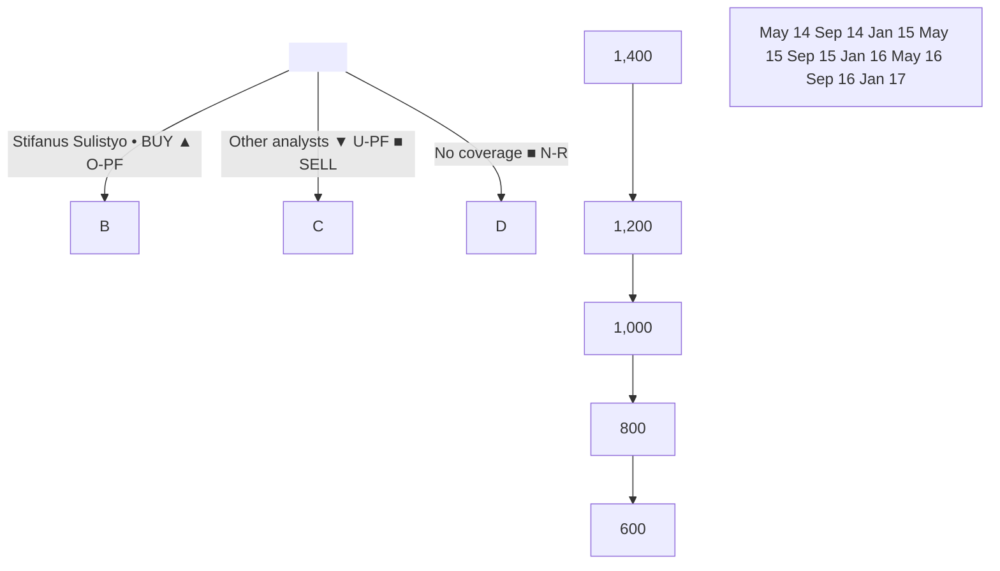

# Infrastructure
## Sector outlook

### Connecting the dots
#### Good progress in tollroad development

Sarina Lesmina CFA
sarina.lesmina@clsa.com
+62 21 2554 8820

Indri Gozali
+62 21 2554 8831

As a follow-up to our infra report (Roads to prosperity), we revisit tollroad development in Indonesia. Land clearing is faster. The number of completed kilometres on the crucial 750km Trans Java network has doubled in two years and it is set for completion in 2019. Adding that to new projects, the government's target to double the tollroad network in five years seems doable. Owing to substantial capital requirements, funding can be an issue. However, we believe private sector participation will continue to rise, as the economics continues to improve.

20 February 2017

### Indonesia
### Infrastructure

#### Faster land clearing
- Land clearing for tollroad projects continues to accelerate. Trans Java is 91% cleared vs only 50% in 2015 and for Trans Sumatra, it has risen to 62% from 22%.
- Eminent domain is yet to be fully enforced, but there is much more certainty about the timeline and the process.

#### Trans Java on track; more tenders coming
- Construction is accelerating; with faster land clearing and a push from government.
- "In construction" since 1988, the Trans Java network has doubled in the past two years with the 750km main corridor on track to finish in 2019 (target is 2018).
- Completion of Trans Java and Sumatra will add 841km to the current network (984km). As the gov't continues to award concessions (550km in 2016) and invite bids for new projects, its target to double the tollroad network in 5 years is doable.

#### Issue of funding for land clearing
- Currently, an issue is a limited state budget for land clearing. The gov't has resorted to a "revolving fund" scheme again but reimbursements aren't yet done.
- We hope the new government agency LMAN (State Asset Management Agency) is effective in reimbursing land clearing expenses to investors in public projects.

#### To attract more private-sector players
- As more tollroads are added to the pipeline, private-sector participation is needed as SOE tollroad investors face funding constraints given their large expansions.
- Realising this, the gov't recently launched its PINA programme – in essence, it facilitates of equity financing for private investors in key infra projects.
- Tollroad IRRs are more attractive vs other infra projects. Coupled with faster land clearing, this should entice more private players, say Astratel, to expand portfolios.
- Key potential beneficiaries include: Jasa Marga (largest operator with a 60% share in operating tollroads), Waskita Karya, and Astra (through Astratel).

#### Completion of Trans Java network

| Year | km(RHS) | % Completion |
| ---- | ------- | ------------ |
| 1988 | 73      | 10%          |
| 1998 | 99      | 13%          |
| 2004 | 134     | 18%          |
| 2010 | 134     | 18%          |
| 2014 | 161     | 21%          |
| 2015 | 291     | 39%          |
| 2016 | 335     | 45%          |
| 17CL | 424     | 57%          |
| 18CL | 635     | 85%          |
| 19CL | 749     | 100%         |

Source: CLSA, Government

www.clsa.com

Find CLSA research on Bloomberg, Thomson Reuters, Factset and CapitalIQ - and profit from our evalu@tor proprietary database at clsa.com

For important disclosures please refer to page 14.

Prepared for - W: rafdip@danareksa.com
---
# Connecting the dots

## Infrastructure

### Faster land clearing

**Land clearing continued to accelerate**

Land clearing for Trans Java and Trans Sumatra network continues to pick up. When it came to power at the end of 2014, the Jokowi administration revived Trans Java - land cleared has reached 91% from only 50% in 2015. Trans Sumatra was also kick-started in mid-2015 and land clearing has reached 62%.

**Eminent domain is yet to be fully enforced**

As mentioned in our Indo infrastructure report (Roads to prosperity: Construction boom paving the way) published in August 2016, land clearing has picked up although eminent domain (the government's right to land – as stipulated in the land law that became effective in 2015) is yet to be fully enforced.

**But, much more certainty in timeline and process**

However, tollroad companies say that there is real progress and more certainty with regards to timelines. Land appraisals are also a lot more realistic – the government is willing for differentiated pricing for different blocks of land - as opposed to one price for the whole project.

**There is compensation for 'loss time'**

We have also mentioned before that project delays due to land clearing can be compensated by either tariff adjustment (when the tollroad becomes operational), or extension of the concession period.

**Local government support remains a key factor**

Lastly, enforcement by and support of local governments remain the key factors – as eminent domain is yet to be fully enforced.

**91% of Trans Java remaining sections (449km) and 62% of Trans Sumatra priority sections (393km) has been cleared**

Figure 1: Land clearing progress

|      | Trans Java | Trans Sumatra |        |        |
| ---- | ---------- | ------------- | ------ | ------ |
| 100% |            |               |        |        |
| 90%  |            |               |        |        |
| 80%  |            |               |        |        |
| 70%  |            |               |        |        |
| 60%  |            |               |        |        |
| 50%  |            |               |        |        |
| 40%  |            |               |        |        |
| 30%  |            |               |        |        |
| 20%  |            |               |        |        |
| 10%  |            |               |        |        |
| 0%   | 2H15       | Mar 16        | Dec 16 | Jan 17 |

Source: Government. Note: Trans Java is 750km and Trans Sumatra (key sections) is 393km

**Certain sections need faster land clearing such as Batang-Semarang**

Overall, the progress is good – especially for the important Trans Java network – only for the Batang-Semarang tollroad, land clearing progress is lacking (see the following table), although ever since the government re-tendered this project in 2016, the pace has accelerated to 52% from 38% in 3Q16 and 20% in 1Q16.

Batang-Semarang is a key section of Trans Java as it is located in the middle of the network. The government targets the whole network to be completed in 2019. Logistics cost savings will be greatly enhanced with connectivity between different sections.

20 February 2017                sarina.lesmina@clsa.com                                                        2

Prepared for - W: rafdip@danareksa.com
---
Connecting the dots                                            Infrastructure

For Trans Sumatra, the land clearing progress is also encouraging and we expect it will continue to accelerate. Land clearing for this project is relatively easier (and cheaper) than Java, given lesser population; however, the area to be cleared is larger.

|                                         | Land cleared | Total length (km)  |
| --------------------------------------- | ------------ | ------------------ |
| **Trans Java (main corridor):**         |              |                    |
| Solo-Ngawi                              | 91%          | 90.1               |
| Ngawi-Kertosono                         | 91%          | 87.0               |
| Gempol-Pasuruan                         | 91%          | 34.2               |
| Pemalang-Batang                         | 91%          | 39.2               |
| Surabaya-Mojokerto (remaining sections) | 100%         | 36.3               |
| Batang-Semarang                         | 52%          | 75.0               |
| Bawen-Solo (part of Semarang-Solo)      | 99.9%        | 49.5               |
| Pejagan-Pemalang (section III-IV)       | 98%          | 37.3               |
| Total                                   |              | 448.6 (out of 750) |
| **Trans Sumatra (priority sections):**  |              |                    |
| Medan-Binjai                            | 78%          | 16.7               |
| Medan-Kualanamu-Tebingtinggi            | 86%          | 61.7               |
| Pekanbaru-Kandis-Dumai                  | 19%          | 135                |
| Palembang-Indralaya                     | 83%          | 24.5               |
| Bakauheuni-Terbanggi Besar              | 43%          | 155                |
| Total                                   |              | 392.9              |

Source: Government

## Trans Java on track; more tenders

Construction is accelerating

Construction progress has accelerated as well, mostly due to faster land clearing and also a push from the government.

|                                                                                                                                                                                                                                                                                                                                         |                                                                                                                                                                                                                                                                                                |
| --------------------------------------------------------------------------------------------------------------------------------------------------------------------------------------------------------------------------------------------------------------------------------------------------------------------------------------- | ---------------------------------------------------------------------------------------------------------------------------------------------------------------------------------------------------------------------------------------------------------------------------------------------- |
| **Figure 3: Construction progress of key sections -Trans Java** \[Bar chart showing construction progress for different sections of Trans Java, comparing 3Q16 and Dec2016/Feb2017. Sections include Solo-Ngawi, Ngawi-Kertosono, Surabaya-Mojokerto, Sem-Solo (Bawen-Solo), and Batang-Semarang. Progress ranges from 0% to 120%.] | **Figure 4: Construction progress of Trans Sumatra** \[Bar chart showing construction progress for different sections of Trans Sumatra. Sections include Medan-Binjai, Palembang-Indralaya, Medan-Kualanamu-, Bakauheuni-Terbanggi-, and Pekanbaru-Dumai. Progress ranges from 0% to 70%.] |

Source: Government

Some tweaks to our forecast for Trans Java 750km main corridor completion

Nonetheless, we need to make tweaks to our Trans Java forecasts due to some delays. We previously expected 49% completion of the main corridor (750km from Jakarta to Surabaya) by the end of 2016; however the actual came to 45% (or 335km).

But, still on target to be completed in 2019

20 February 2017               sarina.lesmina@clsa.com                                                     3

Prepared for - W: rafdip@danareksa.com
---
# Connecting the dots

## Infrastructure

Some 44km were added in 2016 – Surabaya-Mojokerto section IV (18.5km) in Mar2016; Pejagan-Pemalang section I and II (20.2km) in mid-Jun2016; and Kertosono-Mojokerto section III (5km) in Dec2016.

We expect +89km in 2017 for Trans Java

This year, we expect more sections to be added (~89km). These are mainly on the east side such as the remaining sections of Kertosono-Mojokerto, Semarang-Solo (Bawen-Salatiga), and some sections of Surabaya-Mojokerto. We still expect Trans Java to be completed in 2019 (while the government's target is 2018).

"In construction" since 1988, Trans Java main corridor (750km) has doubled in the past two years (from 161km in 2014 to 335km in 2016)

And, this looks set to double again in 2018

### Figure 5: Completion of Trans Java network (main corridor ~750km Jakarta-Surabaya)

| Year | km(RHS) | % Completion |
| ---- | ------- | ------------ |
| 1988 | 73      | 10%          |
| 1998 | 99      | 13%          |
| 2004 | 134     | 18%          |
| 2010 | 134     | 18%          |
| 2014 | 161     | 21%          |
| 2015 | 291     | 39%          |
| 2016 | 335     | 45%          |
| 17CL | 424     | 57%          |
| 18CL | 635     | 85%          |
| 19CL | 749     | 100%         |

Source: CLSA, Government

### Figure 6: Trans Java network – and construction progress

- Solo-Ngawi (90km): 50%
- Batang-Semarang (75km): 4%
- Ngawi-Kertosono (87km): 44%
- Surabaya-Mojokerto - remaining sections (15km): 38%
- Pejagan-Pemalang section III-IV (37km): 57%
- Pemalang-Batang (39km): 7%
- Bawen-Solo (49km): 95%

Legend:
- Solid line: Toll road in operation (430km)
- Dotted line: Toll road under construction (581km) - completion by 2019

Source: Government

20 February 2017 sarina.lesmina@clsa.com

Prepared for - W: rafdip@danareksa.com
---
# Connecting the dots

## Infrastructure

### Trans Sumatra maybe later (2020)

As for Trans Sumatra, we maintain our forecast that completion will be in 2020. We estimate that Medan-Binjai (16.7km), Medan-Kualanamu-Tebing Tinggi (61.7km) and Palembang-Indralaya (24.5km) sections will be completed in 1Q/2Q18. The government has targeted Jun-Sep2017 for some of these sections.

Nonetheless, given the aggressive push from President Jokowi, completion may end up as targeted.

### Ownership of Trans Java (main corridor) network

| Section              | Length (km) | Ownership                                                         |
| -------------------- | ----------- | ----------------------------------------------------------------- |
| Jakarta-Cikampek     | 83          | JSMR (100%)                                                       |
| Cikampek-Palimanan   | 117         | Plus Expressway (55%), ASII (45%)                                 |
| Palimanan-Kanci      | 26          | JSMR (100%)                                                       |
| Kanci-Pejagan        | 35          | WSKT (77.69%), Paspro (22.31%)                                    |
| Pejagan-Pemalang     | 58          | WSKT (99.99%)                                                     |
| Pemalang-Batang      | 39          | WSKT (60%), Sumber Mitra Jaya (40%) - private contractor company  |
| Batang-Semarang      | 75          | JSMR (60%), WSKT (40%)                                            |
| Semarang-Solo        | 73          | JSMR (73.91%), Astratel (25%), Pembangunan Jawa Tengah (1.09%)    |
| Solo-Mantingan-Ngawi | 90          | JSMR (60%), WSKT (40%)                                            |
| Ngawi-Kertosono      | 87          | JSMR (60%), WSKT (40%)                                            |
| Kertosono-Mojokerto  | 41          | Astratel (100%)                                                   |
| Mojokerto-Surabaya   | 36          | JSMR (55%), Moeladi Group (25%) - private EPC company, WIKA (20%) |
| Surabaya-Gempol      | 49          | JSMR (100%)                                                       |
| Gempol-Pandaan       | 14          | JSMR (90.71%)                                                     |

Source: Companies

### Target to double tollroad network in five years from 984km is doable

Given the current progress, we think the government's target to add 1,000km in five years (2015-2019) is still achievable. The completion of Trans Java and Sumatra (priority sections) will add 841km to the current network (984km). Moreover, the government is still issuing (and planning) more tenders.

### We assume a more conservative target than the government in 2017

#### Additional tollroads (government target vs CLSA's forecasts)

| Year         | Government (km) | CLSA's forecast (km) |
| ------------ | --------------- | -------------------- |
| 15A          | 130             | 130                  |
| 16A          | 44              | 44                   |
| 17F          | 392             | 133                  |
| 18F          | 288             | 363                  |
| 19F          | 146             | 317                  |
| 2020 onwards | 467             | 496                  |

Source: CLSA, Government

### We forecast +133.3km in tollroad network this year

We expect national the tollroad network to grow by 133.3km (14%) in 2017.

We assume a more conservative target than the government – basically pushing back to 2018 some of the sections expected to come in 4Q17, eg:

20 February 2017                sarina.lesmina@clsa.com                                                   5

Prepared for - W: rafdip@danareksa.com
---
Connecting the dots

Infrastructure

- Pejagan-Pemalang (III, IV) – 37.3km – the government expects completion in Dec2017.
- Ngawi-Kertosono (I, II, III) – 49.51km – the government expects completion in Sep2017.
- Solo-Ngawi (Section 1B and 2: Sragen-Mantingan-Ngawi) – 54.6km – the government expects completion in Oct2017
- Medan-Tebing Tinggi – 61.7km – the government expects completion in Sep2017
- Depok-Antasari section I – 6.8km – the government expects completion in Sep2017

Figure 9
New tollroads (17CL)

| Sections:                                                                      | Location                           | km     | Timeline |
| ------------------------------------------------------------------------------ | ---------------------------------- | ------ | -------- |
| Cinere-Jagorawi Section II                                                     | Greater Jakarta (West Java)        | 5.5    | 3Q17     |
| Solo-Ngawi (Section IA: Karanganyer-Sragen)                                    | East Java                          | 14.6   | 3Q17     |
| Solo-Ngawi - Section I: Kertosuro-Karanganyer (to be constructed by the gov't) | East Java                          | 20.9   | 2Q17     |
| Soreang-Pasirkoja                                                              | West Java (Bandung suburb to city) | 8.15   | 2Q17     |
| Kertosono-Mojokerto (Section II: Jombang-Mojokerto)                            | East Java                          | 20.15  | 2Q17     |
| Kertosono-Mojokerto (Section IV)                                               | East Java                          | 0.85   | 4Q17     |
| Semarang-Solo (Section 3: Bawen Salatiga)                                      | East Java                          | 17.5   | 2Q17     |
| Surabaya-Mojokerto (Section 1B: Sepanjang-WRR)                                 | East Java                          | 4.3    | 2Q17     |
| Surabaya-Mojokerto (Section 2: WRR-Driyorejo)                                  | East Java                          | 5.1    | 4Q17     |
| Surabaya-Mojokerto (Section 3: Driyorejo-Krian)                                | East Java                          | 6.1    | 4Q17     |
| Gempol-Pasuruan (Section 1: Gempol-Rembang)                                    | East Java                          | 13.9   | 2Q17     |
| Bekasi-Cawang-Kampung Melayu IB and IC                                         | Greater Jakarta                    | 8.28   | 2H17     |
| Tanjung Priok Access (partial)                                                 | Greater Jakarta (West Java)        | 8      | 4Q17     |
| Total                                                                          |                                    | 133.33 |          |

Source: CLSA

Figure 10
Tollroad network in Indonesia

We expect by 2020, the tollroad network will grow to 1,900km from 984km in 2016

| Year      | km        |
| --------- | --------- |
| 2001-14   | Cagr: 4%  |
| 2014-20CL | Cagr: 15% |

[A line graph shows the growth of the tollroad network in Indonesia from 1978 to 2020. The y-axis ranges from 0 to 2,000 km, and the x-axis shows years from 1978 to 2020. The line shows slow growth until about 2014, then a steeper increase from 2014 to 2020.]

Source: CLSA, Government

New concessions and upcoming tenders

550km concessions signed in 2016

The government signed concessions for ~550km in 2016 – much higher than its initial plan of 290km. There was hardly any new concession awarded in the prior administration. There are also tollroad projects for ~590km that are either in tender or their tenders are upcoming.

20 February 2017                sarina.lesmina@clsa.com                                                         6

Prepared for - W: rafdip@danareksa.com
---
Connecting the dots                                           Infrastructure

Figure 11

| Project                       | km     | Location        | Key shareholder |
| ----------------------------- | ------ | --------------- | --------------- |
| Manado-Bitung                 | 39     | Trans-Sulawesi  | Jasa Marga      |
| Balikpapan-Samarinda          | 99.02  | Kalimantan      | Jasa Marga      |
| Serpong-Balaraja              | 30     | Greater Jakarta | BSD consortium  |
| Pandaan-Malang                | 37.6   | Java            | Jasa Marga      |
| Terbanggi Besar-Kayu Agung    | 185    | Sumatra         | Hutama Karya    |
| Panimbang-Serang              | 83.9   | Greater Jakarta | Wijaya Karya    |
| Krian-Legundi-Bunder-Manyar   | 39     | West Java       | Waskita Karya   |
| Jakarta-Cikampek 2 (Elevated) | 36.4   | West Java       | Jasa Marga      |
| Total                         | 549.92 |                 |                 |

Source: Government

Figure 12

| In tender or upcoming tenders:       | km     | Location        | Note                                                                |
| ------------------------------------ | ------ | --------------- | ------------------------------------------------------------------- |
| Cisumdawu (Cileunyi-Sumedang-Dawuan) | 58.5   | West Java       | Access to West Java international airport                           |
| Probolinggo-Banyuwangi               | 156    | East Java       | Not part of main corridor of Trans Java                             |
| Semarang-Demak                       | 24     | Central Java    | To connect to the north part of Semarang                            |
| Jakarta-Cikampek 2 (South)           | 64     | West Java       | To support the current Jakarta-Cikampek tollroad                    |
| Semanan-Balaraja                     | 31.7   | Greater Jakarta | To connect to upcoming Serpong-Balaraja                             |
| Kemal-Teluk Naga-Balaraja            | 48.3   |                 | Greater Jakarta                                                     |
| Cileunyi-Banjar                      | 107    | West Java       |                                                                     |
| Sukabumi-Ciranjang                   | 28     | West Java       | To connect to the currently under construction Bogor-Ciawi-Sukabumi |
| Ciranjang-Padalarang                 | 33     | West Java       |                                                                     |
| Yogyakarta-Solo                      | 40.49  |                 | Central Java                                                        |
| Total                                | 590.99 |                 |                                                                     |

Source: Government

Some projects were proposed by companies

Note that some of the tollroad projects were proposed by companies to the government: eg, Surya Semesta proposed Subang-Patimban (38km), which will help support its future Subang industrial estate, Bumi Serpong proposed Serpong-Balaraja, and Alam Sutera proposed Semanan-Balaraja.

Separately, if a tender does not attract investors, the government may cancel it or itself take on the construction work. Another way to attract investments is by providing subsidies (for the less lucrative sections) in the form of financing/building a certain portion of the tollroad, such as parts of Solo-Kertosono and Semarang-Solo.

20 February 2017                sarina.lesmina@clsa.com                                                          7

Prepared for - W: rafdip@danareksa.com
---
# Issue on funding for land clearing

## Resorting back to revolving fund – given limited state budget

While land clearing effort has intensified, the issue remains on funding. As mentioned in our Roads to prosperity: Construction boom paving the way), towards 2H16, the government resorted to its previous practice of revolving funds or "Dana Talangan" (ie, asking investors to pay for land clearing to be reimbursed later by the government). Note that under land reform law No 2 of 2012, land clearing for public projects is the government's responsibility.

While the government has honoured this scheme in the past, this did put an additional burden on the tollroad investor's cash flow. For FY16, tollroad regulator Badan Pengatur Jalan Tol (BPJT) says that it has a commitment of ~Rp31tn for land revolving fund from concession holders. Note that land clearing requirement for all tollroads is ~Rp71tn according to BPJT.

## Hope is now on newly formed LMAN – as the land agency

On 23 December 2016, under Sri Mulyani, Minister of Finance, the State Asset Management Agency (Lembaga Manajemen Aset Negara or LMAN) was formed. Its task is to optimise the use of state assets (to maximise returns) but also planning for funding and use of land, and reimbursing land clearing expenses to investors of public projects.

## LMAN has a Rp13tn budget for land clearing, but deemed not enough

In the 2016 state budget, LMAN received a Rp16tn allocation for land clearing. For 2017, the allocation is Rp20tn (for all national strategic projects), out of which Rp13tn is for toll roads. However, the Ministry of Public Works and Public Housing proposes a higher allocation, as it deems that the requirement for this year's land clearing revolving fund is Rp28tn.

## Reimbursement includes interest

To incentivise investors, under Presidential Regulation No 102 (6 December 2016), the reimbursement includes interest at a 7-day BI repo rate (now at 4.75%).

## FY16 spending is yet to be reimbursed

The MoF is yet issue a ministerial decree ("PMK") on the reimbursement mechanism. This has been delayed since December 2016. Land clearing spending under the revolving fund (as of 24 January 2017) was reported at Rp15.6tn. Waskita Karya and Jasa Marga say that they have spent ~Rp6tn each in 2016 on land clearing while Hutama Karya says it has spent Rp2.5tn. We hope the government can resolve this quickly to ensure that the current good progress of tollroad development continues.

## Land clearing has intensified under the new government

| Figure 13: Land clearing budget and realisation trend | Figure 13: Land clearing budget and realisation trend | Figure 13: Land clearing budget and realisation trend | Figure 13: Land clearing budget and realisation trend | Figure 13: Land clearing budget and realisation trend | Figure 13: Land clearing budget and realisation trend | Figure 13: Land clearing budget and realisation trend |
| ----------------------------------------------------- | ----------------------------------------------------- | ----------------------------------------------------- | ----------------------------------------------------- | ----------------------------------------------------- | ----------------------------------------------------- | ----------------------------------------------------- |
| Year                                                  | 2011                                                  | 2012                                                  | 2013                                                  | 2014                                                  | 2015                                                  | 16F\*                                                 |
| Budget for land clearing (for roads) (Rptn)           | \~1                                                   | \~1                                                   | \~1                                                   | \~2                                                   | \~5                                                   | \~16                                                  |
| Realization (%)                                       | \~40%                                                 | \~80%                                                 | \~95%                                                 | \~100%                                                | \~95%                                                 | \~100%                                                |

Source: Government. 16F* = mostly land revolving fund

20 February 2017 sarina.lesmina@clsa.com 8

Prepared for - W: rafdip@danareksa.com
---
# Connecting the dots

## Infrastructure

### To attract more private-sector players

SOE tollroad investors have been very aggressive:
The two largest state-owned tollroad investors, Waskita and Jasa Marga, have been very aggressive in recent years in adding concessions to their portfolios. This, according to a private tollroad company, has to some extent, crowded out private players – especially on the lucrative projects (eg, Trans Java). Separately, Hutama Karya has been appointed to construct almost all of Trans Sumatra.

But, massive expansion plan implies funding constraints:
However, given their large expansion plans, these SOEs are facing funding constraints. Note that while tollroad investment is lucrative (ie, IRRs are generally higher than those for other infra projects), the investment is cash flow negative in the first few years and improves as traffic gradually grows to the target amount. Therefore, investors need to have strong balance sheets and cash flows from operating tollroads to support the initial cash outflow of new projects.

Figure 14
Returns of infra projects

| Sector   | Project IRR (%) |
| -------- | --------------- |
| Tollroad | 14-17           |
| Power    | 9-12            |
| Port     | 10-13           |

Source: Companies

Waskita divested 29% ownership in WTR:
Waskita recently sold 29% of its stake in Waskita Toll Road to SMI (Sarana Multi Infrastruktur, a non-bank financial institution under the MoF that focuses on infrastructure financing) and Taspen (the State Pension fund), split 16% and 13%, respectively, for Rp3.5tn. This was needed as Waskita only has two tollroads in operation – totaling 55.2km (Kanci-Pejagan, 35km, and section 1 and 2 of Pejagan Pemalang, 20.2km) out of 751km of concessions.

Jasa Marga also plans to divest some:
Unless the government is willing to inject more capital into Jasa Marga, the company plans to divest some stakes in operating assets. Its debt/equity ratio reached 1.3x as of Dec2016.

Expect more private sector participation:
This funding constraint on SOEs opens up the opportunity for private players where we are already seeing increasing interest, given better land clearing process on top of legal certainty (eg, tariff adjustment every two years based on inflation, clear functions of tollroad regulators, open tenders, etc).

Astratel has increased its portfolio by 51% to 343km:
Astratel (a subsidiary of Astra International) has mentioned that tollroad is the company's preferred infrastructure investment. Recently, it beat other bidders in acquiring a total of a 45% stake in the Cikampek-Palimanan tollroad for ~Rp97bn/km from Interra, Surya Semesta and Nusa Raya Cipta. This brings its total portfolio to 343km. Astratel believes that investment in Cikampek-Palimanan makes sense. There is much upside potential for traffic growth as it only became operational in 2015 and there is leverage from completion of the remaining sections of Trans Java. Astratel will continue to look for opportunities (mostly in Java) through M&A or participating in more tenders. It aspires to grow its portfolio to 500km by 2020.

Citra Marga less aggressive vs peers:
Citra Marga added 10.6km of Soreang-Pasirkoja tollroad in West Java (tendered in 2015) to its portfolio. It is now focussing on delivery of this as well as Depok-Antasari (Greater Jakarta). It's been less aggressive vs peers.

20 February 2017              sarina.lesmina@clsa.com                                                      9

Prepared for - W: rafdip@danareksa.com
---
# Connecting the dots

## Infrastructure

Foreign investors can own 100% of tollroads

As part of revisions to the negative investment list in mid-2016, foreign investors can now own up to 100% of a tollroad business, up from 95%. Nonetheless, we are yet to see more investment from foreign investors. Foreign participation in tollroads is in Cikampek-Palimanan (55% owned by Plus Expressway) and China's loan for the Manado-Bitung project's section IB. Its contractor, Sino Road and Bridge Group will be one of the contractors.

However, we are yet to see more result

Continuing improvement in investment climate (including land clearing process) should help

A Turkish construction company, Enka Insast Ve Sanayi is eyeing the Probolinggo-Banyuwangi project (East Java) – in a consortium with Jasa Marga and Waskita Karya. This tollroad is currently in the tender process.

Government also wants to facilitate equity financing for private investors

Realising the need for private-sector funding, the government has also launched the PINA programme (Pembiayaan Infrastruktur Non Anggaran Pemerintah) where the government acts as a facilitator between the potential private investor and the project owner in developing infrastructure projects. The equity financing from Taspen and SMI in WTR was the first project under this programme.

Of the national tollroad network in operation (984km), Jasa Marga has the largest share (580km)

### Figure 15: Share of tollroads in operation (Note: effective ownership)

| Company                   | Share |
| ------------------------- | ----- |
| Jasa Marga                | 59%   |
| Others (local gov't, etc) | 18%   |
| Astratel                  | 14%   |
| Citra Marga               | 5%    |
| Waskita Karya             | 3%    |
| Nusantara Infrastruktur   | 2%    |
| Hutama Karya              | 0%    |

Source: Companies, government

Jasa Marga has the largest concession totalling 1,260km – but effectively owns 989km

### Figure 16: Tollroad concession length (Note: effective ownership)

| Company                 | Length (km) |
| ----------------------- | ----------- |
| Jasa Marga              | \~1000      |
| Hutama Karya            | \~800       |
| Waskita Karya           | \~300       |
| Astratel                | \~200       |
| Taspen and SMI          | \~150       |
| Wijaya Karya            | \~100       |
| Citra Marga             | \~50        |
| Bumi Serpong            | \~25        |
| Nusantara Infrastruktur | \~10        |

Source: Companies. Note: this list covers only key names

20 February 2017                sarina.lesmina@clsa.com                                                   10

Prepared for - W: rafdip@danareksa.com
---
Connecting the dots                                     Infrastructure

Figure 17

## Jasa Marga's tollroad projects

| Section                                    | Length (km) | Ownership | Effective ownership (km) | Note                            |
| ------------------------------------------ | ----------- | --------- | ------------------------ | ------------------------------- |
| **In operation**                           |             |           |                          |                                 |
| Jagorawi                                   | 59          | 100%      | 59                       |                                 |
| Jakarta-Tangerang                          | 33          | 100%      | 33                       |                                 |
| Ulujami-Pondok Aren                        | 6           | 100%      | 6                        |                                 |
| JIRR (Jakarta Inner Ring Road) - west ring | 24          | 100%      | 24                       |                                 |
| Ir Sedyatmo (airport toll)                 | 14          | 100%      | 14                       |                                 |
| Jakarta-Cikampek                           | 83          | 100%      | 83                       |                                 |
| JORR                                       | 28          | 100%      | 28                       |                                 |
| Cikampek-Padalarang                        | 59          | 100%      | 59                       |                                 |
| Padalarang-Cileunyi                        | 64          | 100%      | 64                       |                                 |
| Palikanci                                  | 26          | 100%      | 26                       |                                 |
| Semarang, ABC                              | 25          | 100%      | 25                       |                                 |
| Surabaya-Gempol                            | 49          | 100%      | 49                       |                                 |
| Belmera                                    | 43          | 100%      | 43                       |                                 |
| **Subtotal**                               | **512**     |           | **512**                  |                                 |
| **New projects**                           |             |           |                          |                                 |
| Bogor Outer Ring Road                      | 11          | 55%       | 6                        | Partially in operation (5.8km)  |
| Semarang-Solo (Trans Java)                 | 73          | 74%       | 54                       | Partially in operation (23.1km) |
| Gempol-Pasuruan (Trans Java)               | 34          | 99%       | 34                       | Partially in operation (13.9km) |
| JORR2 (Cengkareng-Kunciran)                | 14          | 76%       | 11                       |                                 |
| JORR2 (Kunciran-Serpong)                   | 11          | 60%       | 7                        |                                 |
| JORR W2 North (road section of JORR)       | 8           | 65%       | 5                        | In operation                    |
| Surabaya-Mojokerto                         | 36          | 55%       | 20                       | Partially in operation (20.7km) |
| Gempol-Pandaan                             | 14          | 90.71%    | 12                       | In operation                    |
| Nusa Dua-Ngurah Rai-Benoa                  | 10          | 55%       | 6                        | In operation                    |
| Medan-Kualanamu-Tebing Tinggi              | 62          | 55%       | 34                       |                                 |
| Solo-Ngawi (Trans Java)                    | 90          | 60%       | 54                       |                                 |
| Ngawi-Kertosono (Trans Java)               | 87          | 60%       | 52                       |                                 |
| Cinere-Serpong                             | 10          | 55%       | 6                        |                                 |
| Batang-Semarang (Trans Java)               | 75          | 60%       | 45                       |                                 |
| Pandaan-Malang                             | 38          | 60%       | 23                       |                                 |
| Balikpapan-Samarinda                       | 99          | 55%       | 55                       |                                 |
| Manado-Bitung                              | 40          | 65%       | 26                       |                                 |
| Jakarta-Cikampek 2 elevated                | 36          | 80%       | 29                       |                                 |
| **Subtotal**                               | **748**     |           | **477**                  |                                 |
| **Total**                                  | **1,260**   |           | **989**                  |                                 |

Source: Company

Figure 18

## Astratel's tollroad projects

| Section             | Length (km) | Ownership | Effective ownership (km) | Note                            |
| ------------------- | ----------- | --------- | ------------------------ | ------------------------------- |
| Mojokerto-Kertosono | 41          | 100%      | 41                       | Partially in operation (19.5km) |
| Tangerang-Merak     | 72          | 79%       | 57                       | In operation                    |
| Kunciran-Serpong    | 11          | 40%       | 4                        |                                 |
| Sem-Solo            | 73          | 25%       | 18                       | Partially in operation (23.1km) |
| Serpong-Balaraja    | 30          | 25%       | 8                        |                                 |
| Cikampek-Palimanan  | 117         | 45%       | 53                       | In operation                    |
| **Total**           | **343**     |           | **181**                  |                                 |

Source: Company

20 February 2017              sarina.lesmina@clsa.com                                                 11

Prepared for - W: rafdip@danareksa.com
---
Connecting the dots                                     Infrastructure

Figure 19

| Section                       | Length (km) | Ownership | \*Effective ownership (km) | Note                            |
| ----------------------------- | ----------- | --------- | -------------------------- | ------------------------------- |
| Kanci-Pejagan                 | 35          | 78%       | 19                         | In operation                    |
| Pejagan-Pemalang              | 58          | 99.99%    | 41                         | Partially in operation (20.2km) |
| Cimanggis-Cibitung            | 26          | 90%       | 17                         |                                 |
| Bogor-Ciawi-Sukabumi (Bocimi) | 54          | 82%       | 31                         |                                 |
| Pasuruan-Probolinggo          | 31          | 80%       | 18                         |                                 |
| Bekasi-Cawang-Kampung Melayu  | 21          | 60%       | 9                          |                                 |
| Pemalang-Batang               | 39          | 60%       | 17                         |                                 |
| Kayu Agung-Palembang-Betung   | 112         | 60%       | 48                         |                                 |
| Krian-Legundi-Bunder          | 29          | 55%       | 11                         |                                 |
| Solo-Ngawi                    | 90          | 40%       | 26                         |                                 |
| Ngawi-Kertosono               | 87          | 40%       | 25                         |                                 |
| Semarang-Batang               | 75          | 40%       | 21                         |                                 |
| Cinere-Serpong                | 10          | 35%       | 3                          |                                 |
| Medan-Kualanamu-Tebing Tinggi | 62          | 30%       | 13                         |                                 |
| Depok-Antasari                | 22          | 25%       | 4                          |                                 |
| Total                         | 751         |           | 302                        |                                 |

Source: Company. *Note: takes into account 29.5% stakes sold to Taspen and SMI

Wijaya Karya owns 20% and 95% of Surabaya-Mojokerto (36km) and Serang-Panimbang (83.9km), respectively: effective ownership 87km.

Figure 20

| Section                           | Length (km) | Ownership | Effective ownership (km) | Note         |
| --------------------------------- | ----------- | --------- | ------------------------ | ------------ |
| Depok-Antasari                    | 22          | 13%       | 3                        |              |
| Nusa Dua-Ngurah Rai-Benoa         | 10          | 1%        | 0.1                      | In operation |
| Priority Trans Sumatra toll road: |             |           |                          |              |
| Medan-Binjai                      | 17          | 100%      | 17                       |              |
| Pekanbaru-Kandis-Dumai            | 135         | 100%      | 135                      |              |
| Palembang-Indralaya               | 24          | 100%      | 24                       |              |
| Bakauheuni-Terbanggi Besar        | 155         | 100%      | 155                      |              |
| Other Sumatra toll roads:         |             |           |                          |              |
| Terbanggi Besar-Pematang Panggang | 100         | 100%      | 100                      |              |
| Pematang Panggang-Kayu Agung      | 85          | 100%      | 85                       |              |
| Palembang-Tanjung Api-Api         | 90          | 100%      | 90                       |              |
| Kisaran-Tebing Tinggi             | 60          | 100%      | 60                       |              |
| Tebing Tinggi-Parapat             | 140         | 100%      | 140                      |              |
| Total                             | 838         |           | 809                      |              |

Source: Company

Figure 21

| Section                                    | Length (km) | Ownership | Effective ownership (km) | Note                           |
| ------------------------------------------ | ----------- | --------- | ------------------------ | ------------------------------ |
| JIRR (Jakarta Inner Ring Road) - east ring | 34          | 100%      | 34                       | In operation                   |
| Waru-Juanda                                | 13          | 95%       | 12                       | In operation                   |
| Depok-Antasari                             | 23          | 63%       | 14                       |                                |
| Soreang-Pasir Koja                         | 8           | 65%       | 5                        |                                |
| BORR                                       | 11          | 30%       | 3                        | Partially in operation (5.8km) |
| Total                                      | 89          |           | 69                       |                                |

Source: Company

20 February 2017              sarina.lesmina@clsa.com                                                 12

Prepared for - W: rafdip@danareksa.com
---
# Important disclosures

## Research subscriptions

To change your report distribution requirements, please contact your CLSA sales representative or email us at cib@clsa.com.
You can also fine-tune your Research Alert email preferences at https://www.clsa.com/member/tools/email_alert/.

## Companies mentioned

- Alam Sutera Realty (N-R)
- Astra Intl (ASII IJ - RP7,950 - BUY)
- Astratel Nusantara (N-R)
- Bumi Serpong (BSDE IJ - RP1,890 - UNDERPERFORM)
- CMNP (N-R)
- Enka (N-R)
- Hutama Karya (N-R)
- Interra Resources (N-R)
- Jasa Marga (N-R)
- Moeladi Group (N-R)
- Nusa Raya Cipta (N-R)
- Nusantara Infra (N-R)
- Paspro (N-R)
- Pembangunan Jawa Tengah (N-R)
- Plus Expressway (N-R)
- Sarana Multi Infrastruktur (N-R)
- Sino Road Sino Road and Bridge Group (N-R)
- Sumber Mitra Jaya (N-R)
- Surya Semesta (SSIA IJ - RP560 - BUY)
- Waskita Karya (N-R)
- Wijaya Karya (WIKA IJ - RP2,500 - BUY)

## Analyst certification

The analyst(s) of this report hereby certify that the views expressed in this research report accurately reflect
my/our own personal views about the securities and/or the issuers and that no part of my/our compensation
was, is, or will be directly or indirectly related to the specific recommendation or views contained in this
research report.

20 February 2017             sarina.lesmina@clsa.com                                               13

Prepared for - W: rafdip@danareksa.com
---
# Important disclosures

## Important disclosures

### Recommendation history of Astra International Tbk ASII IJ

| Date        | Rec | Target    | Date        | Rec  | Target   |
| ----------- | --- | --------- | ----------- | ---- | -------- |
| 05 Jan 2017 | BUY | 10,250.00 | 04 Aug 2015 | O-PF | 7,200.00 |
| 01 Aug 2016 | BUY | 9,700.00  | 10 Apr 2015 | O-PF | 8,550.00 |
| 27 Apr 2016 | BUY | 8,460.00  | 10 Feb 2015 | BUY  | 8,550.00 |
| 16 Feb 2016 | BUY | 7,900.00  | 05 Nov 2014 | BUY  | 8,050.00 |
| 03 Nov 2015 | BUY | 7,200.00  | 17 Mar 2014 | U-PF | 7,900.00 |

Source: CLSA

### Recommendation history of Surya Semesta Internusa Tbk SSIA IJ

| Date        | Rec  | Target   | Date        | Rec  | Target |
| ----------- | ---- | -------- | ----------- | ---- | ------ |
| 20 Jan 2016 | BUY  | 825.00   | 13 Nov 2014 | O-PF | 875.00 |
| 25 Aug 2015 | BUY  | 800.00   | 25 Aug 2014 | U-PF | 909.74 |
| 25 May 2015 | O-PF | 1,350.00 | 04 Jul 2014 | U-PF | 752.44 |
| 25 Nov 2014 | O-PF | 1,050.00 | 14 Apr 2014 | SELL | 741.60 |

Source: CLSA

20 February 2017                sarina.lesmina@clsa.com                                                       14

Prepared for - W: rafdip@danareksa.com
---
# Important disclosures

## Infrastructure

### Recommendation history of Bumi Serpong Damai Tbk BSDE IJ

| Date        | Rec  | Target   | Date        | Rec | Target   |
| ----------- | ---- | -------- | ----------- | --- | -------- |
| 28 Jan 2017 | U-PF | 1,900.00 | 10 Aug 2015 | BUY | 2,275.00 |
| 02 Sep 2016 | BUY  | 2,625.00 | 23 Jan 2015 | BUY | 2,350.00 |
| 11 Feb 2016 | BUY  | 2,000.00 | 26 May 2014 | BUY | 2,010.00 |
| 04 Nov 2015 | BUY  | 2,025.00 |             |     |          |

Source: CLSA

### Recommendation history of Wijaya Karya Tbk WIKA IJ

| Date        | Rec  | Target     | Date        | Rec  | Target     |
| ----------- | ---- | ---------- | ----------- | ---- | ---------- |
| 25 Aug 2016 | BUY  | 3,704.29\* | 22 Oct 2014 | O-PF | 3,056.04\* |
| 22 May 2016 | O-PF | 2,454.09\* | 07 Aug 2014 | O-PF | 2,889.34\* |
| 12 Jan 2016 | O-PF | 3,102.34\* | 04 Jun 2014 | O-PF | 2,398.53\* |
| 20 Aug 2015 | O-PF | 2,986.58\* | 07 Apr 2014 | BUY  | 2,870.82\* |
| 15 Jun 2015 | U-PF | 2,685.61\* | 14 Mar 2014 | BUY  | 2,528.18\* |
| 12 Jan 2015 | U-PF | 3,472.77\* |             |      |            |

Source: CLSA; * Adjusted for corporate action

The policy of CLSA (which for the purpose of this disclosure includes subsidiaries of CLSA B.V. and CLSA Americas, LLC ("CLSA Americas")), and CL Securities Taiwan Co., Ltd. ("CLST") is to only publish research that is impartial, independent, clear, fair, and not misleading. Analysts may not receive compensation from the companies they cover. Regulations or market practice of some jurisdictions/markets prescribe certain disclosures to be made for certain actual, potential or perceived conflicts of interests relating to a research report as below. This research disclosure should be read in conjunction with the research disclaimer as set out at

20 February 2017                sarina.lesmina@clsa.com                                                             15

Prepared for - W: rafdip@danareksa.com
---
# Important disclosures

www.clsa.com/disclaimer.html and the applicable regulation of the concerned market where the analyst is stationed and hence subject to. This research disclosure is for your information only and does not constitute any recommendation, representation or warranty. Absence of a discloseable position should not be taken as endorsement on the validity or quality of the research report or recommendation.

To maintain the independence and integrity of CLSA's research, our Corporate Finance, Sales Trading and Research business lines are distinct from one another. This means that CLSA's Research department is not part of and does not report to CLSA Corporate Finance (or "investment banking") department or CLSA's Sales and Trading business. Accordingly, neither the Corporate Finance nor the Sales and Trading department supervises or controls the activities of CLSA's research analysts. CLSA's research analysts report to the management of the Research department, who in turn report to CLSA's senior management.

CLSA has put in place a number of internal controls designed to manage conflicts of interest that may arise as a result of CLSA engaging in Corporate Finance, Sales and Trading and Research activities. Some examples of these controls include: the use of information barriers and other information controls designed to ensure that confidential information is only shared on a "need to know" basis and in compliance with CLSA's Chinese Wall policies and procedures; measures designed to ensure that interactions that may occur among CLSA's Research personnel, Corporate Finance and Sales and Trading personnel, CLSA's financial product issuers and CLSA's research analysts do not compromise the integrity and independence of CLSA's research.

Neither analysts nor their household members/associates/may have a financial interest in, or be an officer, director or advisory board member of companies covered by the analyst unless disclosed herein. In circumstances where an analyst has a pre-existing holding in any securities under coverage, those holdings are grandfathered and the analyst is prohibited from trading such securities.

Unless specified otherwise, CLSA/CLSA Americas/CLST did not receive investment banking/non-investment banking income from, and did not manage/co-manage a public offering for, the listed company during the past 12 months, and it does not expect to receive investment banking compensation from the listed company within the coming three months. Unless mentioned otherwise, CLSA/CLSA Americas/CLST does not own a material discloseable position, and does not make a market, in the securities.

As analyst(s) of this report, I/we hereby certify that the views expressed in this research report accurately reflect my/our own personal views about the securities and/or the issuers and that no part of my/our compensation was, is, or will be directly or indirectly related to the specific recommendation or views contained in this report or to any investment banking relationship with the subject company covered in this report (for the past one year) or otherwise any other relationship with such company which leads to receipt of fees from the company except in ordinary course of business of the company. The analyst/s also state/s and confirm/s that he/she/they has/have not been placed under any undue influence, intervention or pressure by any person/s in compiling this research report. In addition, the analysts included herein attest that they were not in possession of any material, nonpublic information regarding the subject company at the time of publication of the report. Save from the disclosure below (if any), the analyst(s) is/are not aware of any material conflict of interest.

CLSA or CLST (and/or their respective affiliates) participated in a public offering of Bumi Serpong Damai Tbk's securities or received compensation for investment banking services from Bumi Serpong Damai Tbk in the past 12 months.

Key to CLSA/CLSA Americas/CLST investment rankings: BUY: Total stock return (including dividends) expected to exceed 20%; O-PF: Total expected return below 20% but exceeding market return; U-PF: Total expected return positive but below market return; SELL: Total return expected to be negative. For relative performance, we benchmark the 12-month total forecast return (including dividends) for the stock against the 12-month forecast return (including dividends) for the market on which the stock trades.

In the case of US stocks, the recommendation is relative to the expected return for the S&P500 of 10%. Exceptions may be made depending upon prevailing market conditions. We define as "Double Baggers" stocks we expect to yield 100% or more (including dividends) within three years at the time the stocks are introduced to our "Double Bagger" list. "High Conviction" Ideas are not necessarily stocks with the most upside/downside, but those where the Research Head/Strategist believes there is the highest likelihood of positive/negative returns. The list for each market is monitored weekly.

Overall rating distribution for CLSA/CLSA Americas only /CLST only Universe:

Overall rating distribution: Buy / Outperform - CLSA: 61.61%; CLSA Americas only: 54.55%; CLST only: 71.62%, Underperform / Sell - CLSA: 38.39%; CLSA

20 February 2017                sarina.lesmina@clsa.com                                                          16

Prepared for - W: rafdip@danareksa.com
---
# Important disclosures

## Infrastructure

Americas only: 45.45%; CLST only: 28.38%, Restricted - CLSA: 0.00%; CLSA Americas only: 0.00%; CLST only: 0.00%. Data as of 31 December 2016.

Investment banking clients as a % of rating category:
Buy / Outperform - CLSA: 3.55%; CLSA Americas only: 0.00%; CLST only: 0.00%, Underperform / Sell - CLSA: 2.85%; CLSA Americas only: 0.00%; CLST only: 0.00%, Restricted - CLSA: 0.00%; CLSA Americas only: 0.00%; CLST only: 0.00% . Data for 12-month period ending 31 December 2016.

There are no numbers for Hold/Neutral as CLSA/CLSA Americas/CLST do not have such investment rankings.

For a history of the recommendations and price targets for companies mentioned in this report, as well as company specific disclosures, please write to: (a) CLSA Americas, Compliance Department, 1301 Avenue of the Americas, 15th Floor, New York, New York 10019-6022; (b) CLSA, Group Compliance, 18/F, One Pacific Place, 88 Queensway, Hong Kong and/or; (c) CLST Compliance (27/F, 95, Section 2 Dun Hua South Road, Taipei 10682, Taiwan, telephone (886) 2 2326 8188). © 2017 CLSA Limited, CLSA Americas, and/or CLST.

© 2017 CLSA Limited, CLSA Americas, LLC ("CLSA Americas") and/or CL Securities Taiwan Co., Ltd. ("CLST")

This publication/communication is subject to and incorporates the terms and conditions of use set out on the www.clsa.com website (www.clsa.com/disclaimer.html.). Neither the publication/communication nor any portion hereof may be reprinted, sold, resold, copied, reproduced, distributed, redistributed, published, republished, displayed, posted or transmitted in any form or media or by any means without the written consent of CLSA group of companies (excluding CLSA Americas, LLC) ("CLSA"), CLSA Americas (a broker-dealer registered with the US Securities and Exchange Commission and an affiliate of CLSA) and/or CLST.

CLSA, CLSA Americas and CLST has/have produced this publication/communication for private circulation to professional, institutional and/or wholesale clients only. This publication/communication may not be distributed or redistributed to retail investors. The information, opinions and estimates herein are not directed at, or intended for distribution to or use by, any person or entity in any jurisdiction where doing so would be contrary to law or regulation or which would subject CLSA, CLSA Americas and/or CLST to any additional registration or licensing requirement within such jurisdiction. The information and statistical data herein have been obtained from sources we believe to be reliable. Such information has not been independently verified and we make no representation or warranty as to its accuracy, completeness or correctness. Any opinions or estimates herein reflect the judgment of CLSA, CLSA Americas and/or CLST at the date of this publication/communication and are subject to change at any time without notice. Where any part of the information, opinions or estimates contained herein reflects the views and opinions of a sales person or a non-analyst, such views and opinions may not correspond to the published view of CLSA, CLSA Americas and/or CLST. This is not a solicitation or any offer to buy or sell. This publication/communication is for information purposes only and does not constitute any recommendation, representation, warranty or guarantee of performance. Any price target given in the report may be projected from one or more valuation models and hence any price target may be subject to the inherent risk of the selected model as well as other external risk factors. This is not intended to provide professional, investment or any other type of advice or recommendation and does not take into account the particular investment objectives, financial situation or needs of individual recipients. Before acting on any information in this publication/communication, you should consider whether it is suitable for your particular circumstances and, if appropriate, seek professional advice, including tax advice. CLSA, CLSA Americas and/or CLST do/does not accept any responsibility and cannot be held liable for any person's use of or reliance on the information and opinions contained herein. To the extent permitted by applicable securities laws and regulations, CLSA, CLSA Americas and/or CLST accept(s) no liability whatsoever for any direct or consequential loss arising from the use of this publication/communication or its contents. Where the publication does not contain ratings, the material should not be construed as research but is offered as factual commentary. It is not intended to, nor should it be used to form an investment opinion about the non-rated companies.

Subject to any applicable laws and regulations at any given time, CLSA, CLSA Americas, CLST, their respective affiliates or companies or individuals connected with CLSA/CLSA Americas/CLST may have used the information contained herein before publication and may have positions in, may from time to time purchase or sell or have a material interest in any of the securities mentioned or related securities, or may currently or in future have or have had a business or financial relationship with, or may provide or have provided investment banking, capital markets and/or other services to, the entities referred to herein, their advisors and/or any other connected parties. As a result, investors should be aware that CLSA, CLSA Americas, CLST and/or

20 February 2017                sarina.lesmina@clsa.com                                                                  17

Prepared for - W: rafdip@danareksa.com
---
# Important disclosures

## Infrastructure

their respective affiliates or companies or such individuals may have one or more conflicts of interest. Regulations or market practice of some jurisdictions/markets prescribe certain disclosures to be made for certain actual, potential or perceived conflicts of interests relating to research reports. Details of the disclosable interest can be found in certain reports as required by the relevant rules and regulation and the full details are available at http://www.clsa.com/member/research_disclosures/. Disclosures therein include the position of CLSA, CLSA Americas and CLST only. Unless specified otherwise, CLSA did not receive any compensation or other benefits from the subject company covered in this publication/communication.. If investors have any difficulty accessing this website, please contact webadmin@clsa.com on +852 2600 8111. If you require disclosure information on previous dates, please contact compliance_hk@clsa.com.

This publication/communication is distributed for and on behalf of CLSA Limited (for research compiled by non-US and non-Taiwan analyst(s)), CLSA Americas (for research compiled by US analyst(s)) and/or CLST (for research compiled by Taiwan analyst(s)) in Australia by CLSA Australia Pty Ltd; in Hong Kong by CLSA Limited; in India by CLSA India Private Limited, (Address: 8/F, Dalamal House, Nariman Point, Mumbai 400021. Tel No: +91-22-66505050. Fax No: +91-22-22840271; CIN: U67120MH1994PLC083118; SEBI Registration No: INZ000001735; in Indonesia by PT CLSA Sekuritas Indonesia; in Japan by CLSA Securities Japan Co., Ltd; in Korea by CLSA Securities Korea Ltd; in Malaysia by CLSA Securities Malaysia Sdn Bhd; in the Philippines by CLSA Philippines Inc (a member of Philippine Stock Exchange and Securities Investors Protection Fund); in Thailand by CLSA Securities (Thailand) Limited; in Taiwan by CLST and in United Kingdom by CLSA (UK).

India: CLSA India Private Limited, incorporated in November 1994 provides equity brokerage services (SEBI Registration No: INZ000001735), research services (SEBI Registration No: INH000001113) and merchant banking services (SEBI Registration No.INM000010619) to global institutional investors, pension funds and corporates. CLSA and its associates may have debt holdings in the subject company. Further, CLSA and its associates, in the past 12 months, may have received compensation for non-investment banking securities and/or non-securities related services from the subject company. For further details of "associates" of CLSA India please contact Compliance-India@clsa.com.

United States of America: Where any section of the research is compiled by US analyst(s), it is distributed by CLSA Americas. Where any section is compiled by non-US analyst(s), it is distributed into the United States by CLSA solely to persons who qualify as "Major US Institutional Investors" as defined in Rule 15a-6 under the Securities and Exchange Act of 1934 and who deal with CLSA Americas. However, the delivery of this research report to any person in the United States shall not be deemed a recommendation to effect any transactions in the securities discussed herein or an endorsement of any opinion expressed herein. Any recipient of this research in the United States wishing to effect a transaction in any security mentioned herein should do so by contacting CLSA Americas.

Canada: The delivery of this research report to any person in Canada shall not be deemed a recommendation to effect any transactions in the securities discussed herein or an endorsement of any opinion expressed herein. Any recipient of this research in Canada wishing to effect a transaction in any security mentioned herein should do so by contacting CLSA Americas.

United Kingdom: In the United Kingdom, this research is a marketing communication. It has not been prepared in accordance with the legal requirements designed to promote the independence of investment research, and is not subject to any prohibition on dealing ahead of the dissemination of investment research. The research is disseminated in the EU by CLSA (UK), which is authorised and regulated by the Financial Conduct Authority. This document is directed at persons having professional experience in matters relating to investments as defined in Article 19 of the FSMA 2000 (Financial Promotion) Order 2005. Any investment activity to which it relates is only available to such persons. If you do not have professional experience in matters relating to investments you should not rely on this document. Where the research material is compiled by the UK analyst(s), it is produced and disseminated by CLSA (UK). For the purposes of the Financial Conduct Rules this research is prepared and intended as substantive research material.

Singapore: In Singapore, research is issues and/or distributed by CLSA Singapore Pte Ltd (Company Registration No.: 198703750W), a Capital Markets Services license holder to deal in securities and an exempt financial adviser, a solely to persons who qualify as an institutional investor, accredited investor or expert investor, as defined in s.4A(1) of the Securities and Futures Act. Pursuant to Paragraphs 33, 34, 35 and 36 of the Financial Advisers (Amendment) Regulations 2005 of the Financial Advisers Act (Cap 110) with regards to an institutional investor, accredited investor expert investor or Overseas Investor, sections 25, 27 and 36 of the

20 February 2017                sarina.lesmina@clsa.com                                                                     18

Prepared for - W: rafdip@danareksa.com
---
# Important disclosures

## Infrastructure

Financial Adviser Act (Cap 110) shall not apply to CLSA Singapore Pte Ltd. Please contact CLSA Singapore Pte Ltd (telephone No.: +65 6416 7888) in connection with queries on the report. MCI (P) 033/11/2016

The analysts/contributors to this publication/communication may be employed by any relevant CLSA entity (including CLSA Americas), CLST or a subsidiary of CITIC Securities Company Limited which is different from the entity that distributes the publication/communication in the respective jurisdictions.

MSCI-sourced information is the exclusive property of Morgan Stanley Capital International Inc (MSCI). Without prior written permission of MSCI, this information and any other MSCI intellectual property may not be reproduced, redisseminated or used to create any financial products, including any indices. This information is provided on an "as is" basis. The user assumes the entire risk of any use made of this information. MSCI, its affiliates and any third party involved in, or related to, computing or compiling the information hereby expressly disclaim all warranties of originality, accuracy, completeness, merchantability or fitness for a particular purpose with respect to any of this information. Without limiting any of the foregoing, in no event shall MSCI, any of its affiliates or any third party involved in, or related to, computing or compiling the information have any liability for any damages of any kind. MSCI, Morgan Stanley Capital International and the MSCI indexes are service marks of MSCI and its affiliates. The Global Industry Classification Standard (GICS) was developed by and is the exclusive property of MSCI and Standard & Poor's. GICS is a service mark of MSCI and S&P and has been licensed for use by CLSA.

EVA® is a registered trademark of Stern, Stewart & Co. "CL" in charts and tables stands for CLSA/CLSA Americas and "CT" stands for CLST estimates unless otherwise noted in the source.

20 February 2017                sarina.lesmina@clsa.com                                                     19

Prepared for - W: rafdip@danareksa.com