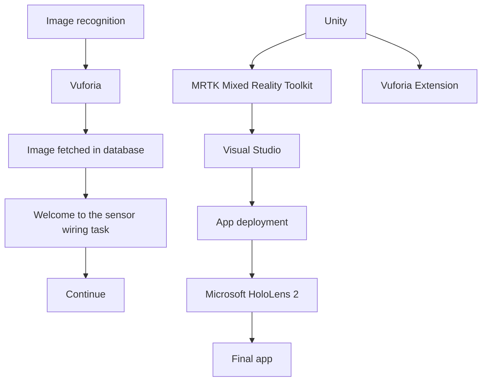

# PFU Business report

New customer's development and increasing the sale of product

My country economy at this season keeps escaping from Odoba of business though holds a crude oil high so on unstable element that continues still, and recovering gradually and well. In the IT industry, there is an influence such as competing intensification in narrowing investment field.

## [The main product and service at this season]

@From the product headquarters

In the image business, the new model turning on of the A3 high-speed, two sided color scanner that achieved a high-speed reading aimed at. wroom was established in United States, Europe, and Asia/Oceania.

@Image business

1) Scanner class

A3 high-speed, two sided color scanner "fi-5900C" that 100 high-n function to enable industry-leading was installed was announced in ScanSnap gotten popular because of an office and individual use. 2) DLM solution scanner

| Category | Percentage |
|----------|------------|
| Very Good | 47%        |
| Good     | 26%        |
| Usually  | 20%        |
| Bad      | 7%         |

The DLM solution that used received the rise of the concern to efficient

Satisfaction rating to new product

management and internal management of the corporate private circum-

stances report in recent years and attracted attention. The function of software that the inspection of data is possible the sense that turns over the file is strengthened, and easiness to use has been improved.

## [approach on business risk]

In-house activity

The attestation intended for each office in Shinbashi, Kansai, and Tokai was acquired in environment ISO in February, 2006. In addition, it participates in the minus 6% that is a national movement of the global warming prevention, and "Culbiz" is done. The scandal of the enterprise has frequently generated is received, concern is sent to the system mainte- nance including the observance of the law in recent years.

Enhancement of system of management

The committee that aimed at the decrease of a variety of business risks in an individual business talk was newly established. Moreover, the recognition of "Privacy mark" is received to manage customer and employee's individual information appropriately in 2001, and the activ- ity based on the protection of individual information policy is continued. It is .bAsia/Oceania in globaln addition, our technology, commodity power, and correspondence power were evaluating acquired.

| Year | Satisfaction Rating |
|------|---------------------|
| 1998 | 75                  |
| 1999 | 25                  |
| 2000 | 60                  |
| 2001 | 55                  |
| 2002 | 30                  |
| 2003 | 100                 |
| 2004 | 15                  |

Satisfaction rating to new product

---

# CIRP Journal of Manufacturing Science and Technology

## Contents lists: ScienceDirect

## CIRP Journal of Manufacturing Science and Technology

[www.elsevier.com/locate/cirpj](http://www.elsevier.com/locate/cirpj)

### Augmented reality training for improved learnability

Dedy Ariansyah \*, Bens Pardamean \”, Eddine Barbaro \’, John Ahmet Erkoyuncu \’\’

\* Bioinformatics & Data Science Research Center, Bina Nusantara University, Jakarta 11480, Indonesia

” Computer Science Department, BINUS Graduate Program - Master of Computer Science, Bina Nusantara University, Jakarta 11480, Indonesia

© School of Aerospace, Transport and Manufacturing, Cranfield, Bedfordshire MK43 0AL, UK

#### ARTICLE INFO

**ABSTRACT**

**Keywords:** Augmented Reality, Learnability, duet, 40, Industry 5.0

In the current era of Industry 4.0, many new technologies offer manufacturing industries to achieve high pro- ductivity. Augmented Reality (AR) is one of the emerging technologies that has been adopted in industries to aid users in acquiring complex skills and carrying out many complicated tasks such product assembly and mainte- nance. Nevertheless, most AR applications have been developed without clear understanding of how such technology can facilitate improved learnability in terms of knowledge reusability. This paper proposed an enhanced AR-based training system that provides multimodal information with a contextualized information to improve task comprehension and knowledge reusability compared with traditional AR that presents unimodal and decontextualized information. An empirical test was carried out to assess the task performance and the task learnability aspects of this enhanced AR compared to the traditional AR and the paper-based document. The experiment consisted of a training phase where participants carried out an electrical connection task of a sensor followed by a knowledge reuse phase where participants had to wire a second sensor using their previous training. A pre-test quiz was given before the experiment followed by the post-tests phase after the training. Post- tests consist of one post-test given directly after the experiment (short-term retention test) and a second post-test quiz given one week later (long-term retention test) to measure information retention. The results indicated that AR-based approaches could enhance knowledge acquisition by around 18 % for traditional AR and almost 25 % for enhanced AR as compared to paper-based approach. While all training systems achieved relatively equivalent well for short-term retention test, trainees who used the enhanced AR training systems statistically outperformed those in the paper-based group for long term retention test. Furthermore, there was a positive correlation be- tween the score of short-term retention test and the score in the knowledge reusability which was also shown by the higher scores in knowledge reusability for the enhanced AR training system compared to the other two approaches. These findings are discussed in relation to the Industry 5.0's human centric core value.

### 1. Introduction

The adoption of Industry 4.0 technologies enables new capabilities to produce and to deliver product faster with a better quality, and more cost efficient. However, this industrial revolution is leading to an increased complexity of manufacturing systems and an increasingly rapid renewal of these systems. Consequently, upskilling employees’ competencies to handle and maintain the complex engineering assets (CEAs) is indispensable. In recent years, finding a skilled worker has become a difficult task. The reason is that there is a talent shortage nowadays. Indeed, in 2018, 45 % of employers said that they could not find the necessary skills among candidates [17]. Furthermore, a new issue will arise from adapting to the changing job dynamics brought about by digitalization [27]. Despite the increased interconnectedness and availability of information globally, the progress of digitalization has not been uniformed across countries or even within industries within the same country [14]. To face this challenge and meet with the adop- tion of Industry 4.0, employers need to find a new way to ensure their workforces are sufficiently equipped to work with CEAs. In the aviation sector, research examined that traditional training such as in-class training and paper-based manual are not reliable means for teaching job tasks and the skills for visual inspection for the future trend in aviation [11,29]. Visual inspection requires Aircraft Maintenance Technician (AMT) to identify certain characteristics of all types of faults and make decision to troubleshoot various systems from one airplane to another. Due to highly complexity and interrelated components in the

\* Corresponding author.

E-mail address: j.a.erkoyuncu@cranfield.ac.uk (J.A. Erkoyuncu).

[https://doi.org/10.1016/j.cirpj.2023.11.003](https://doi.org/10.1016/j.cirpj.2023.11.003)

Received 29 March 2023; Received in revised form 4 September 2023; Accepted 2 November 2023 Available online 6 December 2023

1755-5817/© 2024 The Authors. This is an open access article under the CC BY license (hittp://creativecommons.org/licenses/by/4.0/).

---

D. Ariansyah et al.

| Method | Mean Task Completion Time (min) |
|--------|--------------------------------|
| Traditional AR | 19:26 |
| Enhanced AR | 19:57 |
| Paper-based | 20:47 |

mTraditionalAR mEnhancedAR sm Paper-based

Fig. 4. Mean Task Completion Time.

| Category           | Number of Mistakes |
|--------------------|---------------------|
| Traditional AR    | 1                   |
| Enhanced AR        | 0.6                 |
| Paper-based        | 1.75                |

m Traditional AR meEnhanced AR \_\_™ Paper-based

Fig. 5. Mean number of mistakes.

among groups ((F(2,10) = 1.335, p = 0.306).

4.8. Knowledge retention and reusability correlation

The associations between knowledge retention and knowledge reusability along as well as between short- and long-term retention were shown on the Table 6. Point-Biserial Correlation determined that

Table 6

Knowledge retention scores relative to the baseline.

|  | Traditional AR group (4 People) | Enhanced AR group (5 People) | Paper-based group (4 People) |
| --- | --- | --- | --- |
| st | \* 61.37 % | \* 67.27.% | \* 43.18 % |
| LT | \*\* 54.54 % | \*\* 74.54% | \* 40.91 % |
| LT-ST | 6.83% | 7.27% | 2.27% |
| ST (short-term), | LT (long-term) |  |  |

p < 0.05

\*\*p < 0.01

25

CIRP Journal of Manufacturing Science and Technology 48 (2024) 19-27

knowledge reusability had a statistically significant positive correlation with short-term retention score (rpb = 0.672, n = 13, p = 0.012), but not for long-term retention scores (rpb = 0.466, n = 13, p = 0.108). However, when knowledge retention between short- and long-term was analyzed, Pearson’s correlation showed that there was a positive cor- relation between both, which was statistically significant (rp = 0.717, n= 13, p = 0.006). Fig. 6 illustrates the comparison for the success rate of wiring a second sensor by comparing the traditional AR, Enhanced AR and Paper based approaches, achieving 50%, 80% and 25% respectively.

5. Discussion

Many applications have shown that AR technology can improve learnability when acquiring new skills or concepts over traditional training in terms of knowledge comprehension rate and knowledge retention. The superiority of AR lies in its capability to overlay interactive and animated information in a timely manner. This helps to increase user’s motivation to engage with the content which is essential to encourage learning. Besides, allowing users to see the necessary information at a favorable time results in a more efficient use of cognitive resources and in turn accommodates more learning. Nevertheless, the current paradigm in using AR for training seems to focus on a limited aspect of productivity such as task performance and knowledge retention enablement. In the light of Industry 5.0 which emphasizes on human centric, sustainability, and resilience, technology is expected to be developed in ways that serve human needs for upskilling or reskilling, with efficient use of resources, and better equip human to deal with uncertainties [15,31]. In attempt to expand the knowledge in this area, this study sought to base the development of AR system for training on human centric principles to facilitate meaningful learning and achieve improved learnability in terms of retention test and transfer test (see. Table 7).

The results in the retention test showed that all users demonstrated statistically significant understanding in the given task regardless of which training system (see Table 5). However, users in the AR groups were able to get an overall higher number of correct answers (18% for the traditional and ~25 % for the enhanced) than paper-based manual despite completion time and number of mistakes committed were similar across groups. Although the differences were not significant in the short-term test, the higher scores observed in AR groups could be due to more extraneous processing occurred in the paper-based manual group whereas more essential processing occurred in the AR groups. Essential processing involves intrinsic load or essential material/

| Success Rate (%) | Method          |
|------------------|-----------------|
| 50%              | Traditional AR  |
| 80%              | Enhanced AR     |
| 25%              | Paper-based     |

Traditional AR mEnhancedAR m™ Paper-based

Fig. 6. Success rate of wiring a second sensor.

---

D. Ariansyah et al.

CIRP Journal of Manufacturing Science and Technology 48 (2024) 19-27

Fig. 1. System architecture of AR system.

Further, the task was tested under three different learning interfaces: (1) a paper-based document that serves as a control group against AR systems, (2) a traditional AR-based training system, and (3) an enhanced AR-based training system that was developed by applying design prin- ciples that encourage meaningful learning.

3.3. The paper-based document. The paper-based document (see: 10.17862/cranfield.rd.24079371) contains all information about the electronic system and its components. It also consists of a step-by-step information in the form of textual instruction and pictures to complete a wiring task.

3.3.1.2. The traditional AR-based training system. This training system replicated most of AR systems used for learning the assembly tasks which include textual information, graphical objects (e.g. arrow) for pointing certain objects, and videos. Users were initially presented with an overview of the electronic system and its all components using tooltips and graphical arrows (See Fig. 2(a)). To acquire skills in wiring the system, assembly instructions were presented step by step on top of the workspace in the form of texts as well as videos which describe the task and how to do it (See Fig. 2(b)). The users can pause and play the video as much as they like and proceed to the next step.

3.3.1.3. The enhanced AR-based training system. The enhanced AR- based training system was similar to the traditional one regarding the contents. However, it had voice cues (multimodal information) that gives additional context and information to the user. For example, during the unscrewing part of the power supply, the voice cue gives additional information on how to perform the task: “To loosen the screws, do two or three counterclockwise turns with the screwdriver on both screws”. It also included common mistakes and consequences panel after each step to enable the user to grasp the significance of their

actions and increase the understanding of the system behavior (projec- tion of the given states and their consequences) as shown in Fig. 3.

3.3.2. Experimental procedure

To examine how different methods of learning affect users in understanding the task and reusing the acquired knowledge to a different situation, this study assessed independent groups of users (between- subjects test) who were assigned to each learning method to learn the same task. Each participant was asked to fill out a demographic questionnaire (see: 10.17862/cranfield.rd.24079371) which includes electronic and augmented reality background questionnaire to check whether they had done some tasks related electronics system and if they were familiar with the use of AR prior to the experiment. After that, each participant was given a questionnaire with questions related to the studied wiring task to test their initial knowledge about the system.

The test consisted of questions about the identification of different components they would use during the task and about general knowl- edge given during the experiment. Following this, a total of thirteen participants were involved in this experiment where four people were assigned in traditional AR group, five people in the enhanced AR group, and four people in the paper-based document group. They were all students (Male = 6, Female = 7) and aged between 25 and 35 years old. Their knowledge about electronics was balanced across the groups (See Section 4.1). The test was graded over 11 questions and was also given after they finished the task to measure the amount of information they learned after going through a training (short term retention test). One week later, each participant was assessed again with the same questionnaire to test their capability to remember what they learned (long term retention test). The duration of a week has been used in many studies for memory retention test [16,26]. Furthermore, participants were not told that the questionnaire would be the same after one week. Existing studies that measured task learnability typically focused on

Traditional AR-based training system showing (a) the overview of the electronic wiring system and (b) assembly instructions in textual form and video.

Fig. 2. Traditional AR-based training system: (a) the overview of the electronic wiring system, (b) assembly instructions in the textual form and video.

---

## TRACTORS

member of ASTRA

PT UNITED TRACTORS Tbk DAN ENTITAS ANAK

PT UNITED TRACTORS Tbk AND SUBSIDIARIES

PERNYATAAN DIREKSI TENTANG TANGGUNG JAWAB TERHADAP LAPORAN KEUANGAN KONSOLIDASIAN INTERIM PT UNITED TRACTORS Tbk DAN ENTITAS ANAK (“GRUP”) TANGGAL 31 MARET 2024 DAN 31 DESEMBER 2023 SERTA PERIODE-PERIODE TIGA BULAN YANG BERAKHIR 31 MARET 2024 DAN 2023

BOARD OF DIRECTORS’ STATEMENT REGARDING THE RESPONSIBILITY FOR THE INTERIM CONSOLIDATED FINANCIAL STATEMENTS OF PT UNITED TRACTORS Tbk AND SUBSIDIARIES (THE “GROUP”) AS AT 31 MARCH 2024 AND 31 DECEMBER 2023 AND FOR THE THREE-MONTH PERIODS ENDED 31 MARCH 2024 AND 2023

Kami yang bertanda tangan di bawah ini:
1. Nama : FXL Kesuma Alamat kantor
   : Jl. Raya Bekasi Km 22 Cakung, Jakarta 13910
We, the undersigned: 1. Name Office address
   FXL Kesuma
   Jl. Raya Bekasi Km 22 Cakung, Jakarta 13910

Alamat rumah
: Jl Wijaya Kusuma 49 Cilandak Jakarta Selatan
Residential address
Jl. Wijaya Kusuma 49 Cilandak Jakarta Selatan

No. Telepon Jabatan
: 021-24579999
: Presiden Direktur
Telephone No. Title
021 — 24579999
: President Director

2. Nama Alamat kantor
   : Vilihati Surya
   Jl. Raya Bekasi Km 22 Cakung, Jakarta 13910
2. Name Office address
   Vilihati Surya
   Jl. Raya Bekasi Km 22 Cakung, Jakarta 13910

Alamat rumah
No. Telepon Jabatan
:
:
:
Jl. Janur Elok VII QF-7/11A Kelapa Gading Jakarta Utara 021 -24579999 Direktur
Residential address vi. Janur Elok VII QF-7/11A Kelapa Gading Jakarta Utara 021 — 24579999 : Director

Telephone No. Title
menyatakan bahwa:
declare that:
1. Kami bertanggung jawab atas penyusunan dan penyajian laporan keuangan konsolidasian interim Grup;
1. We are responsible for the preparation and presentation of the Group’s interim consolidated financial statements;

2. Laporan ,keuangan konsolidasian interim Grup telah disusun dan disajikan sesuai dengan Standar Akuntansi Keuangan di Indonesia;
2. The Group’s interim consolidated financial statements have been prepared and presented in accordance with the Indonesian Financial Accounting Standards;

3.
a. Semua\_ informasi dalam laporan keuangan konsolidasian interim Grup telah dimuat secara lengkap dan benar;
3.
a. All information in the Group’s interim consolidated financial statements has been disclosed in a complete and truthful manner;

b. Laporan keuangan konsolidasian interim Grup tidak mengandung informasi atau fakta material yang tidak benar, dan tidak menghilangkan informasi atau fakta material;
b. The Group’s interim consolidated financial statements do not contain any incorrect information or material fact, nor do they omit information or material fact;

4. Kami bertanggung jawab atas sistem pengendalian internal dalam Grup.
4. We are responsible for Group’s internal control system.

Demikian pernyataan ini dibuat dengan sebenarnya.
Thus this statement is made truthfully.

Atas nama dan mewakili Direksi/For and on behalf of the Board of Directors

JAKARTA

29 April 2024

wi TEMPE }6EALX07250706%

—

FXL Kesuma Presiden Direktur/President Director

Vilihati Surya Direktur/Director

Moving as

PT UNITED TRACTORS Tbk

I

JI. Raya Bekasi Km 22, Jakarta 13910 - Indonesia

I

T: +62 21 2457 9999

l

F: +62 21 4600657

---

PT UNITED TRACTORS Tbk DAN ENTITAS ANAK/AND SUBSIDIARIES

Lampiran 1/1 Schedule

|  |  |
| --- | --- |
| (Dinyatakan dalam jutaan Rupiah, | (Expressed in millions of Rupiah, |
| kecuali dinyatakan lain) | unless otherwise stated) |

| Aset |  |  |  | Assets |
| --- | --- | --- | --- | --- |
| Aset lancar |  |  |  | Current assets |
| Kas dan setara kas | 22,246,140 |  | 18,596,609 | Cash and cash equivalents |
| Piutang usaha |  |  |  | Trade receivables |
| - Pihak ketiga | 18,435,677 |  | 18,953,089 | Third parties - |
| - Pihak berelasi | 981,633 | 4,35¢ | 1,321,493 | Related parties - |
| Piutang non-usaha |  |  |  | Non-trade receivables |
| - Pihak ketiga | 773,229 |  | 833,144 | Third parties - |
| - Pihak berelasi | 1,342,150 | 35c | 1,207,575 | Related parties - |
| Persediaan | 17,220,278 | 6 | 17,184,208 | Inventories |
| Proyek dalam pelaksanaan |  |  |  | Project under construction |
| - Pihak ketiga | 114,648 |  | 111,259 | Third parties - |
| Pajak dibayar dimuka |  |  |  | Prepaid taxes |
| - Pajak penghasilan badan | 1,100,303 | 16a | 910,334 | Corporate income taxes - |
| - Pajak lain-lain | 1,589,010 | 16a | 2,196,826 | Other taxes - |
| muka dan |  |  |  |  |
| Uang biaya dibayar |  |  |  |  |
| dimuka | 1,247,514 |  | 1,103,109 | Advances and prepayments |
| Aset lancar lain-lain | 256,470 |  | 249,459 | Other current assets |
| 65,307,052 |  | 62,667,105 |  |
| Aset tidak lancar |  |  |  | Non-current assets |
| Kas dan deposito berjangka yang dibatasi penggunaannya | 621,233 | 561,219 | Restricted cash and time deposits |
| Piutang usaha |  |  |  | Trade receivables |
| - Pihak ketiga | 351,299 |  | 107,565 | Third parties - |
| - Pihak berelasi | 15,841 | 4,35¢ | 16,514 | Related parties - |
| Piutang non-usaha |  |  |  | Non-trade receivables |
| - Pihak ketiga | 306,151 |  | 314,702 | Third parties - |
| - Pihak berelasi | 3,505,595 | 35c | 2,867,712 | Related parties - |
|  |  |  |  |  |
| Persediaan | 86,947 | 6 | 82,497 | Inventories |
| Pajak dibayar dimuka |  |  |  | Prepaid taxes |
| - Pajak penghasilan badan | 23,164 | 16a | 75,699 | Corporate income tax - |
| - Pajak lain-lain | 2,098,755 | 16a | 1,731,673 | Other taxes - |
| Uang muka dan biaya dibayar |  |  |  |  |
| dimuka | Investasi pada entitas asosiasi 389,139 ~ 1,298,672 Advances and prepayments Investments in associates | | | | |
| dan ventura bersama | 17,551,248 | Con | 14,853,244 | and joint ventures |
| Investasi jangka panjang | 1,268,213 |  | 1,243,018 | Long-term investments |
| Aset tetap | 37,512,715 |  | 36,001,559 | Fixed assets |
| Properti pertambangan | 17,698,024 | 10a | 17,845,848 | Mining properties |
| Properti investasi | 228,097 |  | 228,097 | Investment properties |
| Beban eksplorasi dan |  |  |  | Deferred exploration and |
| pengembangan tangguhan | 2,513,388 | 10b | 2,374,321 | development expenditures |
| Aset tambang berproduksi | 4,496,914 | 10 | 4,488,727 | Production mining assets |
| Beban tangguhan | 1,413,176 |  | 1,448,506 | Deferred charges |
| Aset pajak tangguhan | 3,697,201 | 16d | 3,537,279 | Deferred tax assets |
| Goodwill | 2,342,623 | 12 | 2,287,291 | Goodwill |
| 96,119,723 |  | 91,361,143 |  |
| Jumlah aset | ——161,426,775 |  | 154,028,248 | Total assets |

Catatan atas laporan keuangan konsolidasian merupakan bagian yang tidak terpisahkan dari laporan keuangan konsolidasian.

---

